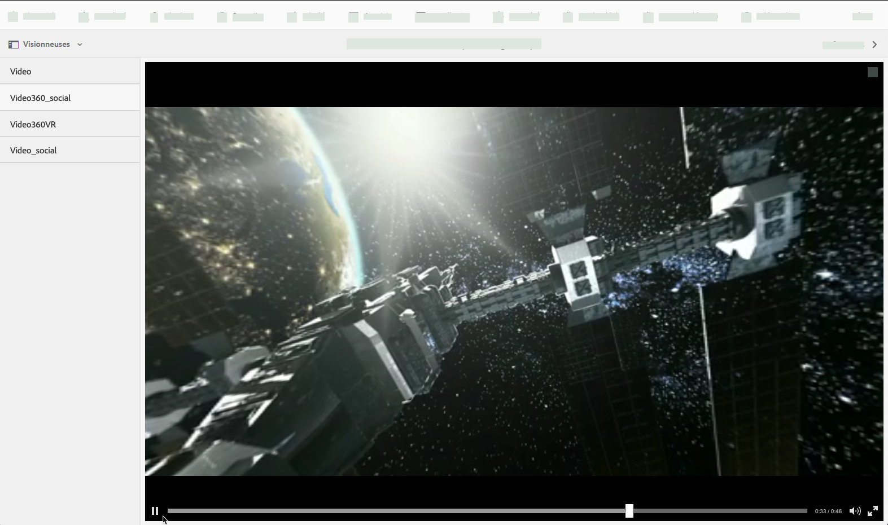
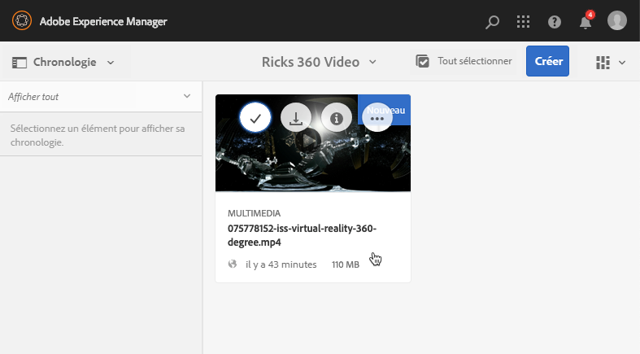
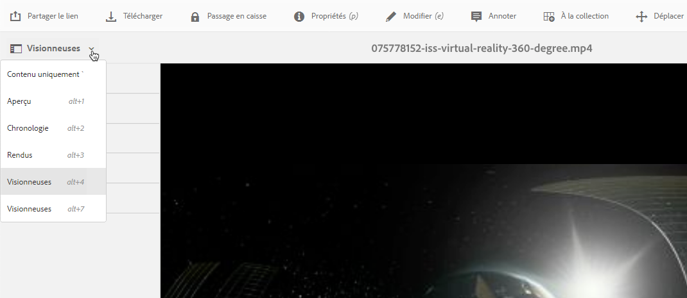
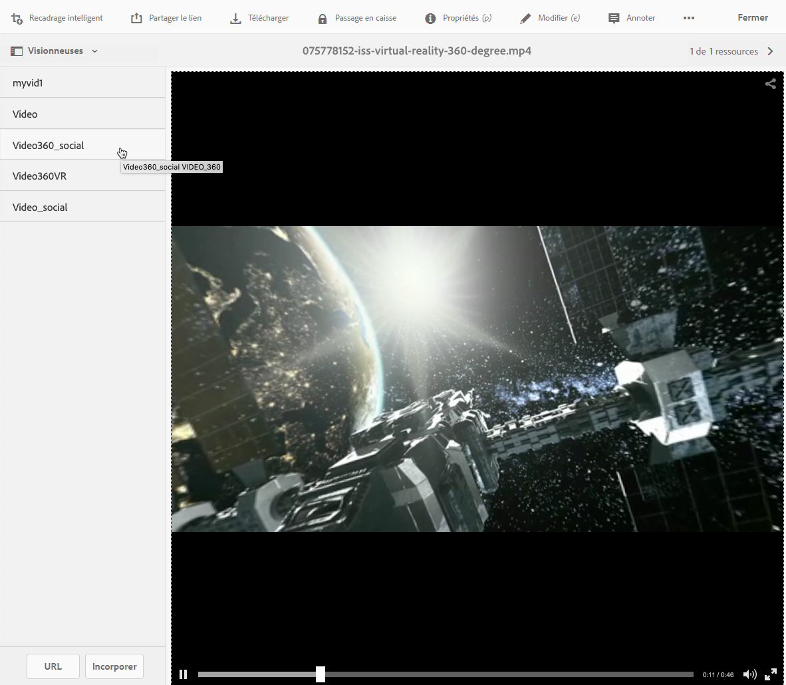
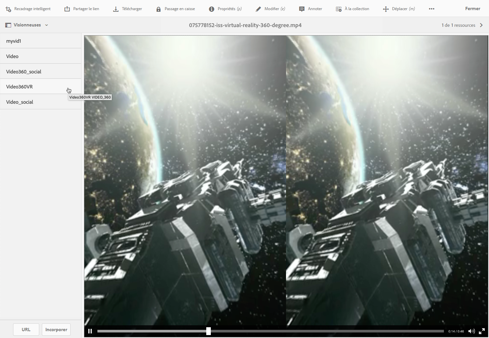

# Vidéo 360/VR {#vr-video}

Les vidéos 360 enregistrent une vue dans chaque direction au même moment. Elles sont tournées à l’aide d’une caméra omnidirectionnelle ou d’un ensemble de caméras. Lors de la lecture sur un écran plat, l’utilisateur contrôle l’angle de vue ; la lecture sur les appareils mobiles utilise généralement les commandes gyroscopiques intégrées.

Le mode Scene7 de Dynamic Media inclut une prise en charge native de la diffusion de ressources vidéo 360. Par défaut, aucune configuration supplémentaire n’est nécessaire pour l’affichage ou la lecture. Vous diffusez une vidéo 360 avec des extensions vidéo standard telles que .mp4, .mkv et .mov. Le codec le plus courant est H.264.

Cette section décrit l’utilisation de la visionneuse de vidéos 360/VR pour obtenir un rendu équirectangulaire et une expérience de visionnage immersive d’une pièce, d’une propriété, d’un lieu, d’un paysage, d’une procédure médicale, etc.

L’audio spatial n’est actuellement pas pris en charge ; si l’audio est mixé en stéréo, la balance (G/D) ne change pas lorsque le client change l’angle de vue de la caméra.

Voir également [Gestion des paramètres prédéfinis de visionneuse](/help/assets/managing-viewer-presets.md).

## Vidéo 360 en action {#video-in-action}

Appuyez sur [Station spatiale 360](http://mobiletest.scene7.com/s7viewers/html5/Video360Viewer.html?asset=Viewers/space_station_360-AVS) pour ouvrir une fenêtre de navigateur et visionner une vidéo à 360 degrés. Pendant la lecture vidéo, faites glisser le pointeur de la souris vers un nouvel emplacement pour modifier l’angle de vue.

*Image vidéo de la station spatiale 360*

## Vidéo 360/VR et Adobe Premiere Pro {#vr-video-and-adobe-premiere-pro}

Vous pouvez utiliser Adobe Premier Pro pour visualiser et modifier des séquences vidéo 360/VR. Par exemple, vous pouvez placer des logos et du texte correctement dans une scène et appliquer des effets et des transitions conçus spécialement pour les médias équirectangulaires.

Voir [Modification de la vidéo 360/VR](https://helpx.adobe.com/fr/premiere-pro/how-to/edit-360-vr-video.html).

## Chargement de ressources pour une utilisation avec la visionneuse de vidéos 360 {#uploading-assets-for-use-with-the-video-viewer}

Les ressources vidéo 360 qui sont chargées dans AEM sont considérées comme des fichiers **multimédias** sur une page de ressource, tout comme une ressource vidéo normale.

*Une ressource vidéo 360 chargée et affichée en mode Carte. La ressource est considérée comme multimédia.*

**Pour charger des ressources pour une utilisation avec la visionneuse de vidéos 360 :**

1. Créez un dossier dédié à votre ressource vidéo 360.
1. [Appliquez un profil de vidéo adaptative au dossier.](/help/assets/video-profiles.md#applying-a-video-profile-to-folders)

   Les exigences du rendu de contenu vidéo 360 sont plus élevées pour la résolution vidéo source et pour la résolution des rendus codée que pour le contenu vidéo standard.

   Vous pouvez utiliser le profil de vidéo adaptative prêt à l’emploi qui est déjà fourni avec Dynamic Media. Toutefois, sachez que la qualité de la vidéo 360 sera inférieure à celle que vous obtiendriez pour une vidéo standard encodée, avec les mêmes paramètres rendus avec une visionneuse vidéo standard. Par conséquent, si une vidéo 360 de qualité supérieure est requise, procédez comme suit :

   * Idéalement, votre contenu vidéo 360 d’origine doit avoir l’une des résolutions suivantes :

      * 1080p – 1920 x 1080, connu sous le nom de résolution Full HD ou FHD ou,
      * 2160p – 3840 x 2160, connu sous le nom de résolution 4K, UHD ou Ultra HD. Cette résolution d’affichage très importante est le plus souvent utilisée sur les téléviseurs et moniteurs d’ordinateur Premium. La résolution 2160p est souvent appelée « 4K », car la largeur est proche de 4 000 pixels. En d’autres termes, elle offre quatre fois plus de pixels que la résolution 1080p.
   * [Créez un profil de vidéo adaptative personnalisé](/help/assets/video-profiles.md#creating-a-video-encoding-profile-for-adaptive-streaming) avec des rendus de qualité supérieure. Par exemple, vous pouvez créer un profil de vidéo adaptative qui contient les trois paramètres suivants :

      * Largeur=auto ; hauteur=720 ; bitrate=2500 Kbit/s
      * Largeur=auto ; hauteur=1080 ; bitrate=5000 Kbit/s
      * Largeur=auto ; hauteur=1440 ; bitrate=6600 Kbit/s
   * Traitez le contenu vidéo 360 dans un dossier destiné exclusivement aux ressources vidéo 360.

   N’oubliez pas que cette approche augmente les demandes sur le réseau et le processeur de l’utilisateur final.

1. [Téléchargez votre vidéo dans le dossier](/help/assets/managing-video-assets.md#upload-and-preview-video-assets).

## Remplacement du rapport d’aspect par défaut des vidéos 360  {#overriding-the-default-aspect-ratio-of-videos}

Pour qu’une ressource téléchargée soit qualifiée de vidéo 360 à utiliser avec la visionneuse de vidéos 360, la ressource doit avoir un rapport d’aspect de 2.

Par défaut, AEM détecte la vidéo comme étant «  » si son rapport d’aspect (largeur/hauteur) est de 2.0. Si vous êtes un administrateur, vous pouvez remplacer le paramètre de rapport d’aspect par défaut de 2 en définissant la propriété facultative `s7video360AR`360 dans CRXDE Lite :

* `/conf/global/settings/cloudconfigs/dmscene7/jcr:content`

   * **Type de propriété** : Double
   * **Valeur** : rapport d’aspect, 2.0 par défaut.

Une fois cette propriété définie, elle prend effet immédiatement sur les vidéos existantes et les vidéos récemment téléchargées.

Le rapport d’aspect s’applique aux ressources vidéo 360 pour la page des détails de la ressource et le [composant de gestion de contenu web média de vidéo 360](/help/assets/adding-dynamic-media-assets-to-pages.md#dynamic-media-components).

Commencez par télécharger les vidéos 360.

## Prévisualisation d’une vidéo 360 {#previewing-video}

Vous pouvez utiliser l’option de prévisualisation pour déterminer comment les clients voient votre vidéo 360 et vous assurer qu’elle se comporte comme prévu.

Voir également [Modification de paramètres de visionneuse prédéfinis](/help/assets/managing-viewer-presets.md#editing-viewer-presets).

Lorsque vous êtes satisfait de la vidéo 360, vous pouvez la publier.

Voir [Incorporation de la visionneuse de vidéos ou d’images dans une page web.](https://helpx.adobe.com/experience-manager/6-5/help/assets/embed-code.html)
Voir [Liaison d’URL à une application web](https://helpx.adobe.com/experience-manager/6-5/help/assets/linking-urls-to-yourwebapplication.html). Notez que la méthode de liaison basée sur une URL n’est pas possible si votre contenu interactif contient des liens avec des URL relatives, en particulier des liens vers des pages AEM Sites.
Reportez-vous à la section [Ajout de ressources Dynamic Media aux pages.](https://helpx.adobe.com/experience-manager/6-5/help/assets/adding-dynamic-media-assets-to-pages.html)

**Prévisualisation de vidéos 360**

1. Dans **[!UICONTROL Assets]**, accédez à une vidéo 360 que vous avez créée. Appuyez sur la ressource vidéo 360 pour l’ouvrir en mode d’aperçu.

   

   Appuyez sur la ressource vidéo 360 pour prévisualiser la vidéo.

1. Dans la page d’aperçu, dans le coin supérieur gauche de la page, appuyez sur le menu déroulant puis sélectionnez **[!UICONTROL Visionneuses.]**

   

   Dans la liste des visionneuses, appuyez sur **[!UICONTROL Video360_social]**, puis effectuez l’une des opérations suivantes :

   * Faites glisser le pointeur de la souris sur la vidéo pour modifier l’angle de vue de la scène statique.
   * Appuyez sur le bouton **[!UICONTROL Lecture]** de la vidéo pour commencer la lecture ; pendant la lecture de la vidéo, faites glisser le pointeur de la souris sur la vidéo pour modifier l’angle de vue.

   *Capture d’écran d’une vidéo 360.*

   * Dans la liste des visionneuses, appuyez sur **[!UICONTROL Video360VR.]**

      Une vidéo de réalité virtuelle (VR) est un contenu vidéo immersif accessible via l’utilisation d’un casque de réalité virtuelle. À l’instar des vidéos ordinaires, vous créez une vidéo de réalité virtuelle au début, lorsqu’elle est en cours d’enregistrement ou capturée à l’aide de caméras à 360 degrés.
   
   *Capture d’écran d’une vidéo 360 VR*

1. Dans le coin supérieur droit de la page, appuyez sur **[!UICONTROL Fermer.]**

## Publication d’une vidéo 360 {#publishing-video}

Pour utiliser la vidéo 360, vous devez la publier. La publication d’une vidéo 360 active l’URL et le code intégré. Elle publie également la vidéo 360 sur le cloud Dynamic Media intégré au CDN pour un débit évolutif et performant.

Voir [Publication de ressources Dynamic Media](/help/assets/publishing-dynamicmedia-assets.md) pour savoir comment publier des vidéos 360.
Voir aussi [Incorporation de la visionneuse de vidéos ou d’images dans une page web](https://helpx.adobe.com/experience-manager/6-5/help/assets/embed-code.html).
Voir aussi [Liaison d’URL à une application web](https://helpx.adobe.com/experience-manager/6-5/help/assets/linking-urls-to-yourwebapplication.html). Notez que la méthode de liaison basée sur une URL n’est pas possible si votre contenu interactif contient des liens avec des URL relatives, en particulier des liens vers des pages AEM Sites.
Voir aussi [Ajout de ressources Dynamic Media aux pages](https://helpx.adobe.com/experience-manager/6-5/help/assets/adding-dynamic-media-assets-to-pages.html).
