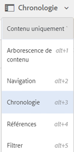
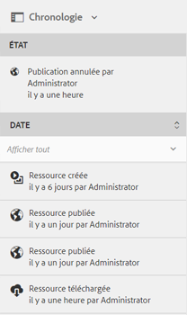

# Flux d’activité dans la chronologie {#activity-stream-in-timeline}

Cette fonctionnalité affiche les journaux d’activités correspondant aux ressources de la chronologie. Si vous effectuez l’une des opérations suivantes liées aux ressources dans les ressources d’Adobe Experience Manager, la fonction de flux d’activité met à jour la chronologie pour refléter l’activité.

Les opérations suivantes sont consignées dans le flux d’activités :

* Créer
* Supprimer
* Téléchargement (rendus compris)
* Publication 
* Annuler la publication
* Approuver
* Refuser
* Déplacer

Les journaux d’activité à afficher dans la chronologie sont récupérés à partir de l’emplacement `/var/audit/com.day.cq.dam/content/dam` dans CRX, où les fichiers journaux sont stockés. In addition, timeline activity is logged when new assets are uploaded or existing asses are modified and checked into Experience Manager via [Adobe Asset Link](https://helpx.adobe.com/fr/enterprise/using/manage-assets-using-adobe-asset-link.html) or [Experience Manager desktop app](https://docs.adobe.com/content/help/en/experience-manager-desktop-app/using/release-notes.html).

>[!NOTE]
>
>Les workflows transitoires ne sont pas affichés dans la chronologie, car aucune information d’historique n’est enregistrée pour ces derniers.

Pour afficher le flux d’activités, effectuez une ou plusieurs des opérations sur la ressource, sélectionnez la ressource, puis sélectionnez **[!UICONTROL Chronologie]** dans la liste de navigation globale.

La chronologie affiche le flux d’activités des opérations que vous effectuez sur les ressources.

>[!NOTE]
>
>L’emplacement de stockage par défaut pour les tâches **[!UICONTROL Publier]** et **[!UICONTROL Annuler la publication]** est `/var/audit/com.day.cq.replication/content`. Pour les tâches **[!UICONTROL Déplacer]**, l’emplacement par défaut est `/var/audit/com.day.cq.wcm.core.page`.
