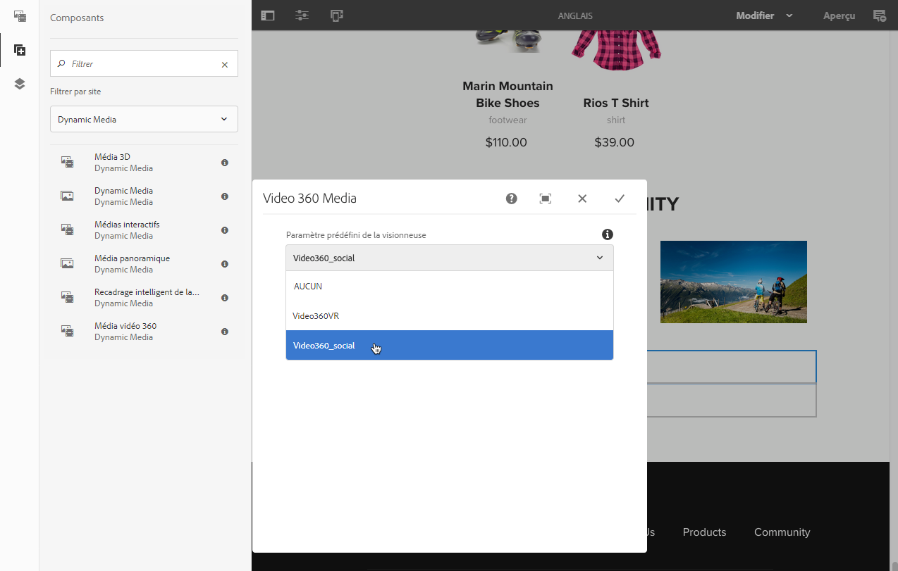
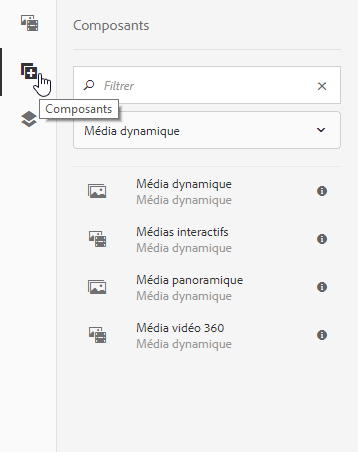
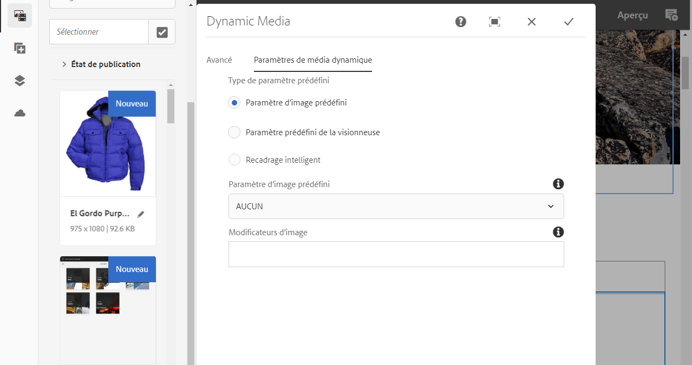
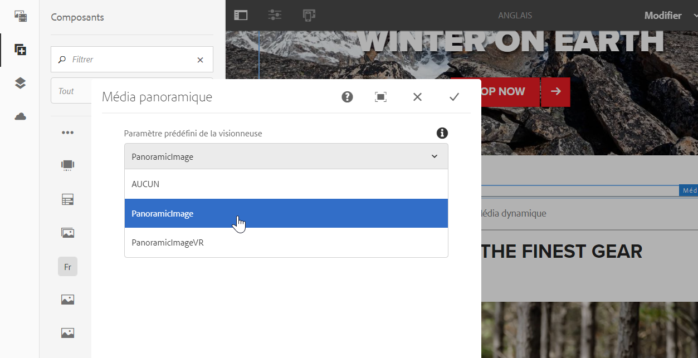
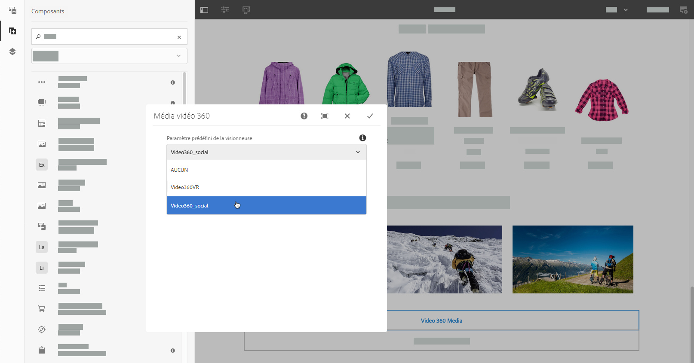

# Ajout de ressources Dynamic Media aux pages{#adding-dynamic-media-assets-to-pages}

Pour ajouter la fonction Dynamic Media aux ressources que vous utilisez sur des sites web, vous pouvez ajouter le composant **Dynamic Media**, **Média interactif**, **Média panoramique** ou **Média vidéo 360** directement à la page. Vous ajoutez des composants en activant le mode Mise en page et en activant les composants Dynamic Media. Vous pouvez ensuite ajouter ces composants à la page et ajouter des ressources au composant. Les composants Dynamic Media sont intelligents : ils savent si vous ajoutez une image ou une vidéo, et les options de configuration disponibles changent en conséquence.

Vous ajoutez directement des ressources Dynamic Media à la page si vous utilisez Adobe Experience Manager comme système de gestion de contenu web. Si vous faites appel à un tiers pour votre gestion de contenu web, [liez](/help/assets/linking-urls-to-yourwebapplication.md) ou [incorporez](/help/assets/embed-code.md) vos ressources. Pour un site web tiers réactif, reportez-vous à la section [Diffusion d’images optimisées sur un site réactif](/help/assets/responsive-site.md).

>[!NOTE]
>
>Veillez à publier les ressources avant de les ajouter aux pages dans Experience Manager. Voir [Publication de ressources Dynamic Media](/help/assets/publishing-dynamicmedia-assets.md).

## Ajout d’un composant Dynamic Media à une page  {#adding-a-dynamic-media-component-to-a-page}

L’ajout d’un composant Média 3D, Dynamic Media, Média interactif, Média panoramique, Recadrage intelligent de la vidéo ou Média vidéo 360 à une page est identique à l’ajout d’un composant sur n’importe quelle page. Les composants Dynamic Media sont décrits dans les sections suivantes.

1. Dans Experience Manager, ouvrez la page où vous souhaitez ajouter le composant Dynamic Media.
1. Dans le panneau situé à gauche de la page (si nécessaire, activez l’affichage du panneau latéral), cliquez sur l’icône **[!UICONTROL Composants]** .
1. Sous l’en-tête **[!UICONTROL Composants]**, dans la liste déroulante, sélectionnez **[!UICONTROL Dynamic Media]**.

   Si aucune liste de composants Dynamic Media n’est disponible, vous devez activer les composants Dynamic Media que vous souhaitez utiliser. Voir [Activation des composants Dynamic Media](#enabling-dynamic-media-components).

   

1. Faites glisser un composant **[!UICONTROL Dynamic Media]** que vous souhaitez utiliser et déposez-le à l’emplacement souhaité sur la page.

1. Placez le pointeur de la souris directement sur le composant. Lorsque le composant est entouré d’une zone bleue, appuyez une fois pour afficher la barre d’outils du composant. Appuyez sur l’icône **[!UICONTROL Configuration (clé à molette)]**.

   

1. En fonction du composant Dynamic Media que vous avez déposé sur la page, une boîte de dialogue de configuration s’ouvre. [Définissez les options du composant](/help/assets/adding-dynamic-media-assets-to-pages.md#dynamic-media-components) selon vos besoins.

   L’exemple ci-dessous illustre la boîte de dialogue du composant Dynamic Media **[!UICONTROL Média vidéo 360]** et les options disponibles dans la liste déroulante des paramètres prédéfinis de la visionneuse.

   

   Composant Dynamic Media Média vidéo 360.

1. Une fois que vous avez terminé, dans l’angle supérieur droit de la boîte de dialogue, appuyez sur la coche pour enregistrer vos modifications.

### Activation des composants Dynamic Media {#enabling-dynamic-media-components}

Si aucun composant Dynamic Media n’est disponible pour être ajouté à une page, cela signifie probablement que vous devez d’abord activer les composants que vous souhaitez utiliser.

1. Dans Experience Manager, ouvrez la page où vous souhaitez ajouter le composant Dynamic Media.
1. Dans la partie gauche de la barre d’outils située en haut de la page, appuyez sur l’icône Informations de la page, puis sur **[!UICONTROL Éditer le modèle]** dans la liste déroulante.

   

1. Dans la liste déroulante située sur le côté droit de la barre d’outils, à proximité du haut de la page, appuyez sur **[!UICONTROL Structure]**.

   

1. À proximité du bas de la page, appuyez sur **[!UICONTROL Conteneur de mises en page]** pour ouvrir sa barre d’outils, puis appuyez sur l’icône Stratégie.
1. Sur la page **[!UICONTROL Conteneur de mises en page]**, sous l’en-tête **[!UICONTROL Propriétés]**, assurez-vous que l’onglet **[!UICONTROL Composants autorisés]** est sélectionné.

   

1. Faites défiler l’écran jusqu’à ce que vous voyiez **[!UICONTROL Média dynamique]**.
1. Appuyez sur l’icône > située à gauche de **[!UICONTROL Dynamic Media]** afin de développer la liste, puis sélectionnez les composants Dynamic Media à activer.

   

1. À proximité de l’angle supérieur droit de la page **[!UICONTROL Conteneur de mises en page]**, appuyez sur l’icône Terminé (coche).

1. Dans la liste déroulante située sur le côté droit de la barre d’outils, en haut de la page, appuyez sur **[!UICONTROL Contenu initial]**, puis [ajoutez un composant Dynamic Media à une page](#adding-a-dynamic-media-component-to-a-page) comme vous le faites habituellement.

## Localisation des composants Dynamic Media {#localizing-dynamic-media-components}

Vous pouvez rechercher les composants Dynamic Media de deux façons :

* Dans une page web de Sites, ouvrez **[!UICONTROL Propriétés]** et sélectionnez l’onglet **[!UICONTROL Avancé]**. Choisissez la langue souhaitée pour la localisation.

   

* Depuis le sélecteur de site, sélectionnez la page ou le groupe de pages souhaité. Appuyez sur **[!UICONTROL Propriétés]** et sélectionnez l’onglet **[!UICONTROL Avancé]**. Choisissez la langue souhaitée pour la localisation.

   >[!NOTE]
   >
   >Notez que toutes les langues disponibles dans le menu **[!UICONTROL Langue]** ne sont pas actuellement associées à des jetons.

## Composants Dynamic Media {#dynamic-media-components}

Les composants Dynamic Media sont disponibles lorsque vous appuyez sur l’icône **[!UICONTROL Composants]**. Ensuite, choisissez le filtre **[!UICONTROL Média dynamique]**.

Les composants Dynamic Media disponibles comprennent les suivants :

* **[!UICONTROL Média dynamique]** : s’utilise pour les ressources telles que les images, les vidéos, les catalogues électroniques et les visionneuses à 360°.
* **[!UICONTROL Média interactif]** : s’utilise pour toute ressource interactive telle que le contenu vidéo interactif, les images interactives ou les ensembles de carrousels.
* **[!UICONTROL Média panoramique]** : s’utilise pour les images panoramiques ou les images de réalité virtuelle panoramiques.
* **[!UICONTROL Média vidéo 360]** : s’utilise pour les vidéos 360 et les fichiers vidéo 360 de réalité virtuelle.

>[!NOTE]
>
>Ces composants ne sont pas disponibles par défaut ; elles doivent être rendues disponibles au moyen de l’éditeur de modèles avant de les utiliser. [Une fois qu’ils sont disponibles ](/help/sites-authoring/templates.md#editing-templates-template-authors)dans l’éditeur de modèles, vous pouvez ajouter les composants à votre page comme vous le feriez pour tout autre composant Experience Manager.

### Composant Dynamic Media {#dynamic-media-component}

Le composant Média dynamique est dynamique ; il propose des options différentes selon que vous ajoutez une image ou une vidéo. Le composant prend en charge les paramètres d’image prédéfinis, ainsi que les visionneuses d’images telles que les visionneuses d’images, les visionneuses à 360°, les visionneuses de médias mixtes et le contenu vidéo. En outre, la visionneuse est réactive : la taille de l’écran change automatiquement en fonction de la taille de l’écran. Toutes les visionneuses sont des visionneuses HTML5.

>[!NOTE]
>
>Si votre page web comporte les éléments suivants :
>
>* Plusieurs instances du composant Média dynamique utilisées sur la même page.
>* Chaque instance utilise le même type de ressource.

>
>
L’affectation d’un paramètre prédéfini de visionneuse différent à chaque composant Dynamic Media de cette page n’est pas prise en charge.
>
>Vous pouvez toutefois utiliser le même paramètre prédéfini de visionneuse pour tous les composants Média dynamique qui utilisent des éléments du même type, dans la page.

Si vous ajoutez le composant Média dynamique et si l’option **[!UICONTROL Paramètres de média dynamique]** est vide ou s’il est impossible d’ajouter correctement une ressource, vérifiez les points suivants :

* Vous avez [activé Dynamic Media](/help/assets/config-dynamic.md). Par défaut, ce module complémentaire est désactivé.
* L’image possède un fichier pyramid tiff. Les images que vous importez avant d’activer Dynamic Media ne comportent pas de fichier pyramid tiff.

#### En cas d’utilisation d’images  {#when-working-with-images}

Le composant Média dynamique permet d’ajouter des images dynamiques, notamment des visionneuses d’images, à 360 ° et de supports variés. Vous pouvez effectuer un zoom avant et arrière, faire pivoter une image dans une visionneuse à 360° ou sélectionner une image dans un autre type de visionneuse.

Vous pouvez également configurer directement dans le composant les paramètres prédéfinis de la visionneuse ou de l’image ou le format de l’image. Pour rendre une image réactive, vous pouvez définir les points d’arrêt ou appliquer un paramètre prédéfini d’image réactive.

Modifiez les paramètres Dynamic Media suivants en appuyant sur l’icône **[!UICONTROL Modifier]** dans le composant, puis sur **[!UICONTROL Paramètres Dynamic Media]**.

>[!NOTE]
>
>Par défaut, le composant d’image Dynamic Media est adaptatif. Si vous souhaitez faire en sorte qu’il ait une taille fixe, définissez-la dans le composant de l’onglet **[!UICONTROL Avancé]** à l’aide des options **[!UICONTROL Largeur]** et **[!UICONTROL Hauteur]**.

* **[!UICONTROL Paramètre prédéfini de la visionneuse]**  : sélectionnez un paramètre prédéfini de visionneuse existant. Si le paramètre prédéfini de visionneuse que vous recherchez n’est pas visible, vous devez le rendre visible. Voir [Gestion des paramètres prédéfinis de visionneuse](/help/assets/managing-viewer-presets.md). Si vous utilisez un paramètre prédéfini d’image, vous ne pouvez pas sélectionner de paramètre prédéfini de visionneuse, et inversement.

   Il s’agit de la seule option disponible si vous affichez des visionneuses d’images, à 360° ou de médias mixtes. Les paramètres de visionneuse prédéfinis affichés sont intelligents ; seuls les paramètres de visionneuse prédéfinis pertinents s’affichent.

* **[!UICONTROL Modificateurs de visionneuse]** : les modificateurs de visionneuse prennent la forme d’une paire nom=valeur avec un délimiteur &amp; et permettent de modifier les visionneuses comme indiqué dans le Guide de référence des visionneuses. Un exemple de modificateur de visionneuse est `posterimage=img.jpg&caption=text.vtt,1`, qui définit une image différente pour la miniature de la vidéo et associe un fichier de légende/sous-titre à la vidéo.

* **[!UICONTROL Paramètre d’image prédéfini]**  : sélectionnez un paramètre d’image prédéfini existant. Si le paramètre d’image prédéfini que vous recherchez n’est pas visible, vous devez le rendre visible. Voir Gestion des paramètres d’image prédéfinis. Si vous utilisez un paramètre prédéfini d’image, vous ne pouvez pas sélectionner de paramètre prédéfini de visionneuse, et inversement.

   Cette option n’est pas disponible si vous affichez des visionneuses d’images, à 360° ou de médias mixtes.

* **[!UICONTROL Modificateurs d’image]**  : vous pouvez appliquer des effets d’image en fournissant des commandes d’image supplémentaires. Ces effets sont décrits dans la section Paramètres d’image prédéfinis et dans la référence de la commande de diffusion d’images.

   Cette option n’est pas disponible si vous affichez des visionneuses d’images, à 360° ou de médias mixtes.

* **[!UICONTROL Points d’arrêt]** : si vous utilisez cette ressource sur un site réactif, vous devez ajouter les points d’arrêt d’image. Les points d’arrêt d’image sont séparés par des virgules (,). Cette option fonctionne lorsqu’il n’existe aucune valeur de hauteur ou largeur définie dans un paramètre d’image prédéfini.

   Cette option n’est pas disponible si vous affichez des visionneuses d’images, à 360° ou de médias mixtes.

   Vous pouvez modifier les paramètres avancés ci-après en appuyant sur **[!UICONTROL Modifier]** dans le composant.

* **[!UICONTROL Optimiser pour les appareils]**  à résolution plus élevée : cochez (par défaut) la case pour autoriser l’optimisation du rapport DPR (Device Pixel Ratio).

   L’option **[!UICONTROL Optimiser pour les appareils à résolution plus élevée]** n’est affichée que lorsque la valeur suivante est vraie :

   * Sous Type de paramètre prédéfini, **[!UICONTROL Paramètre d’image prédéfini]** est sélectionné et **[!UICONTROL RESS_IP]** est sélectionné dans la liste déroulante **[!UICONTROL Paramètre d’image prédéfini]** .

   

   Voir aussi [A propos de l’optimisation du rapport pixels d’appareil](/help/assets/imaging-faq.md#dpr). Notez que toutes les valeurs RGPD d’imagerie dynamique Dynamic Media Adobe Experience Manager sont ignorées.

* **[!UICONTROL Titre]** : modifiez le titre de l’image.

* **[!UICONTROL Texte secondaire]** : ajoutez un titre à l’image pour les utilisateurs pour lesquels les graphiques sont désactivés.

   Cette option n’est pas disponible si vous affichez des visionneuses d’images, à 360° ou de médias mixtes.

* **[!UICONTROL URL, Ouvrir dans]** : vous pouvez définir une ressource pour ouvrir un lien. Définissez l’URL, puis dans le champ Ouvrir dans, indiquez si vous souhaitez l’ouvrir dans la même fenêtre ou une nouvelle fenêtre.

   Cette option n’est pas disponible si vous affichez des visionneuses d’images, à 360° ou de médias mixtes.

* **[!UICONTROL Largeur]** : si vous souhaitez que la taille de l’image soit fixe, saisissez une valeur en pixels. Si vous ne fournissez pas de valeur, la ressource devient adaptative.

* **[!UICONTROL Hauteur]** : si vous souhaitez que la taille de l’image soit fixe, saisissez une valeur en pixels. Si vous ne fournissez pas de valeur, la ressource devient adaptative.

#### En cas d’utilisation de vidéos {#when-working-with-video}

Le composant Média dynamique permet d’ajouter une vidéo dynamique à vos pages web. Lorsque vous modifiez le composant, vous pouvez choisir d’utiliser un paramètre prédéfini de la visionneuse de vidéos pour lire la vidéo sur la page.

Modifiez les paramètres Dynamic Media suivants en cliquant sur **[!UICONTROL Modifier]** dans le composant.

>[!NOTE]
>
>Par défaut le composant vidéo Dynamic Media est adaptatif. Si vous souhaitez lui donner une taille fixe, définissez-la sous l’onglet **[!UICONTROL Avancé]** du composant, grâce aux options **[!UICONTROL Largeur]** et **[!UICONTROL Hauteur]**.

* **[!UICONTROL Paramètre prédéfini de la visionneuse]**  : sélectionnez un paramètre prédéfini de visionneuse existant. Si le paramètre prédéfini de visionneuse que vous recherchez n’est pas visible, vous devez le rendre visible. Voir [Gestion des paramètres prédéfinis de visionneuse](/help/assets/managing-viewer-presets.md).

* **[!UICONTROL Modificateurs de visionneuse]**  : les modificateurs de visionneuse prennent la forme d’une paire nom=valeur avec un délimiteur &amp; et permettent de modifier les visionneuses comme indiqué dans le Guide de référence des visionneuses d’Adobe. Un exemple de modificateur de visionneuse est `posterimage=img.jpg&caption=text.vtt,1`

   Avec les modificateurs de visionneuse, par exemple, vous pouvez effectuer les opérations suivantes :

   * Associez un fichier de sous-titres à une vidéo : [légende][https://experienceleague.adobe.com/docs/dynamic-media-developer-resources/library/viewers-aem-assets-dmc/video/command-reference-url-video/r-html5-video-viewer-url-caption.html](https://experienceleague.adobe.com/docs/dynamic-media-developer-resources/library/viewers-aem-assets-dmc/video/command-reference-url-video/r-html5-video-viewer-url-caption.html)
   * Associer un fichier de navigation à une vidéo : [navigation][https://experienceleague.adobe.com/docs/dynamic-media-developer-resources/library/viewers-aem-assets-dmc/video/command-reference-url-video/r-html5-video-viewer-url-navigation.html](https://experienceleague.adobe.com/docs/dynamic-media-developer-resources/library/viewers-aem-assets-dmc/video/command-reference-url-video/r-html5-video-viewer-url-navigation.html)

      Vous pouvez modifier les paramètres avancés ci-après en cliquant sur **[!UICONTROL Modifier]** dans le composant.

* **[!UICONTROL Titre]** : modifiez le titre de la vidéo.

* **[!UICONTROL Largeur]** : si vous souhaitez que la taille de l’image soit fixe, saisissez une valeur en pixels. Si vous ne fournissez pas de valeur, la ressource devient adaptative.

* **[!UICONTROL Hauteur]** : si vous souhaitez que la taille de l’image soit fixe, saisissez une valeur en pixels. Si vous ne fournissez pas de valeur, la ressource devient adaptative.

#### Lorsque vous utilisez le recadrage intelligent {#when-working-with-smart-crop}

Utilisez le composant Média dynamique pour ajouter des ressources d’images avec recadrage intelligent à vos pages web. Lorsque vous modifiez le composant, vous pouvez choisir d’utiliser un paramètre prédéfini de la visionneuse de vidéos pour lire la vidéo sur la page.

Voir aussi [Profils d’image](/help/assets/image-profiles.md).

Modifiez le paramètre Dynamic Media suivant en cliquant sur **[!UICONTROL Modifier]** dans le composant.

>[!NOTE]
>
>Par défaut, le composant d’image Dynamic Media est adaptatif. Si vous souhaitez faire en sorte qu’il ait une taille fixe, définissez-la dans le composant de l’onglet **[!UICONTROL Avancé]** à l’aide des options **[!UICONTROL Largeur]** et **[!UICONTROL Hauteur]**.

* **[!UICONTROL Modificateurs d’image]**  : vous pouvez appliquer des effets d’image en fournissant des commandes d’image supplémentaires. Ces effets sont décrits dans la section Paramètres d’image prédéfinis et dans la référence de la commande de diffusion d’images.

   Cette option n’est pas disponible si vous affichez des visionneuses d’images, à 360° ou de médias mixtes.

   Vous pouvez modifier les paramètres avancés ci-après en cliquant sur **[!UICONTROL Modifier]** dans le composant.

* **[!UICONTROL Activer la correspondance du rapport d’aspect]** : sélectionnez cette option pour laisser Dynamic Media sélectionner un rendu de recadrage intelligent avec le rapport d’aspect correspondant le mieux à celui de l’image d’origine.

* **[!UICONTROL Optimiser pour les appareils]**  à résolution plus élevée : cochez (par défaut) la case pour autoriser l’optimisation du rapport DPR (Device Pixel Ratio).

   L’option **[!UICONTROL Optimiser pour les appareils à résolution plus élevée]** n’est affichée que lorsque la valeur suivante est vraie :

   * Sous Type de paramètre prédéfini, l’option **[!UICONTROL Recadrage intelligent]** est sélectionnée.

   

   Voir aussi [A propos de l’optimisation du rapport pixels d’appareil](/help/assets/imaging-faq.md#dpr). Notez que toutes les valeurs RGPD d’imagerie dynamique Dynamic Media Adobe Experience Manager sont ignorées.

* **[!UICONTROL Titre]** : modifiez le titre d’une image avec recadrage intelligent.

* **[!UICONTROL Texte secondaire]** : ajoutez un titre à l’image avec recadrage intelligent pour les utilisateurs pour lesquels les graphiques sont désactivés.

   Cette option n’est pas disponible si vous affichez des visionneuses d’images, à 360° ou de médias mixtes.

* **[!UICONTROL URL, Ouvrir dans]** : vous pouvez définir une ressource pour ouvrir un lien. Définissez l’URL, puis dans le champ Ouvrir dans, indiquez si vous souhaitez l’ouvrir dans la même fenêtre ou une nouvelle fenêtre.

   Cette option n’est pas disponible si vous affichez des visionneuses d’images, à 360° ou de médias mixtes.

* **[!UICONTROL Largeur]** : si vous souhaitez que la taille de l’image soit fixe, saisissez une valeur en pixels. Si vous ne fournissez pas de valeur, la ressource devient adaptative.

* **[!UICONTROL Hauteur]** : si vous souhaitez que la taille de l’image soit fixe, saisissez une valeur en pixels. Si vous ne fournissez pas de valeur, la ressource devient adaptative.

### Composant Interactive Media {#interactive-media-component}

Le composant Interactive Media est destiné aux ressources présentant des éléments interactifs tels que des zones réactives ou des zones cliquables. Si vous disposez d’une image interactive, d’une vidéo interactive ou d’une bannière de carrousel, utilisez le composant **[!UICONTROL Interactive Media]**.

Le composant Interactive Media est dynamique. Que vous ajoutiez une image ou une vidéo, plusieurs options s’offrent à vous. En outre, la visionneuse est réactive : la taille de l’écran change automatiquement en fonction de la taille de l’écran. Toutes les visionneuses sont des visionneuses HTML5.

>[!NOTE]
>
>Si votre page web comporte les éléments suivants :
>
>* Plusieurs instances du composant Interactive Media utilisé sur la même page.
>* Chaque instance utilise le même type de ressource.

>
>
L’affectation d’un paramètre prédéfini de visionneuse différent à chaque composant Interactive Media de cette page n’est pas prise en charge.
>
>Vous pouvez toutefois utiliser le même paramètre prédéfini de visionneuse pour tous les composants Interactive Media qui utilisent des éléments du même type, dans la page.

Vous pouvez modifier les paramètres **[!UICONTROL Général]** ci-après en cliquant sur **[!UICONTROL Modifier]** dans le composant.

* **[!UICONTROL Paramètre prédéfini de la visionneuse]**  : sélectionnez un paramètre prédéfini de visionneuse existant. Si le paramètre prédéfini de visionneuse que vous recherchez n’est pas visible, vous devez le rendre visible. Les paramètres de visionneuse prédéfinis doivent être publiés avant de pouvoir être utilisés. Voir Gestion des paramètres prédéfinis de visionneuse.

* **[!UICONTROL Titre]** : modifiez le titre de la vidéo.

* **[!UICONTROL Largeur]** : si vous souhaitez que la taille de l’image soit fixe, saisissez une valeur en pixels. Si vous ne fournissez pas de valeur, la ressource devient adaptative.

* **[!UICONTROL Hauteur]** : si vous souhaitez que la taille de l’image soit fixe, saisissez une valeur en pixels. Si vous ne fournissez pas de valeur, la ressource devient adaptative.

   Vous pouvez modifier les paramètres **[!UICONTROL Ajouter au panier]** ci-après en cliquant sur **[!UICONTROL Modifier]** dans le composant.

* **[!UICONTROL Afficher les ressources de produit]** : par défaut, cette valeur est sélectionnée. La ressource de produit affiche une image du produit telle que définie dans le module Commerce. Désactivez la case pour ne pas afficher la ressource de produit.

* **[!UICONTROL Afficher le prix des produits]** : par défaut, cette valeur est sélectionnée. Le prix du produit affiche le prix de l’élément tel qu’il est défini dans le module Commerce. Désactivez la case pour ne pas afficher le prix du produit.

* **[!UICONTROL Afficher le formulaire de produit]** : par défaut, cette valeur n’est pas sélectionnée. Le formulaire de produit contient toutes les variantes de produit, telles que la taille et la couleur. Désactivez la case pour ne pas afficher les variantes de produit.

### Composant de média panoramique {#panoramic-media-component}

Le composant de média panoramique est destiné aux ressources qui sont des images panoramiques sphériques. Ces images fournissent une expérience d’affichage à 360° d’une pièce, d’une propriété, d’un lieu ou d’un paysage. Pour qu’une image soit un panorama sphérique, elle doit posséder l’une ou l’autre des propriétés suivantes, ou les deux :

* Un rapport d’aspect de 2:1.
* Balisé à l’aide des mots-clés `equirectangular` ou (`spherical` + `panorama`) ou (`spherical` + `panoramic`). Voir [Utilisation des balises](/help/sites-authoring/tags.md).

Les critères de rapport d’aspect et de mots-clés s’appliquent tous deux aux ressources panoramiques pour la page des détails des ressources et le composant WCM **[!UICONTROL Média panoramique]**.

>[!NOTE]
>
>Si votre page web comporte les éléments suivants :
>
>* Plusieurs instances du composant **[!UICONTROL Média panoramique]** utilisées sur la même page.
>* Chaque instance utilise le même type de ressource.

>
>
L’affectation d’un paramètre prédéfini de visionneuse différent à chaque composant **[!UICONTROL Panoramic Media]** de cette page n’est pas prise en charge.
>
>Vous pouvez toutefois utiliser le même paramètre prédéfini de visionneuse pour tous les composants de média panoramique qui utilisent des éléments du même type, dans la page.

Vous pouvez modifier le paramètre suivant en appuyant sur **[!UICONTROL Modifier]** dans le composant.

* **[!UICONTROL Paramètre prédéfini de la visionneuse]**  : sélectionnez une visionneuse existante dans le menu déroulant Paramètre prédéfini de la visionneuse.

Si le paramètre prédéfini de la visionneuse que vous recherchez n’est pas visible, vérifiez qu’il est publié. Publiez les paramètres prédéfinis de la visionneuse avant de les utiliser. Voir [Gestion des paramètres prédéfinis de visionneuse](/help/assets/managing-viewer-presets.md).

### Composant Video 360 Media {#video-media-component}

Utilisez le composant **[!UICONTROL Média vidéo 360]** pour effectuer un rendu vidéo équirectangulaire sur votre page web pour une expérience de visionnage immersive d’une pièce, d’une propriété, d’un emplacement, d’un paysage ou d’une procédure médicale.

Lors de la lecture sur un écran plat, l’utilisateur contrôle l’angle de vue ; la lecture sur les appareils mobiles utilise généralement les commandes gyroscopiques intégrées.

La visionneuse inclut une prise en charge native de la diffusion de ressources vidéo 360. Par défaut, aucune configuration supplémentaire n’est nécessaire pour l’affichage ou la lecture. Vous diffusez une vidéo 360 avec des extensions vidéo standard telles que .mp4, .mkv et .mov. Le codec le plus courant est H.264.

Vous pouvez modifier le paramètre suivant en appuyant sur **[!UICONTROL Modifier]** dans le composant.

* **[!UICONTROL Paramètre prédéfini de la visionneuse]**  : sélectionnez une visionneuse existante dans le menu déroulant Paramètre prédéfini de la visionneuse. Utilisez Video360VR pour les utilisateurs finaux qui utilisent des lunettes de réalité virtuelle. Inclut les commandes de lecture vidéo de base et les fonctions de réseaux sociaux. Utilisez Video360_social, qui inclut les commandes de lecture vidéo de base. Le rendu vidéo est effectué en mode stéréo. Le contrôle manuel du point de vue est désactivé, mais la commande gyroscopique est activée. Il n’existe aucune fonction de réseaux sociaux.

Si le paramètre prédéfini de la visionneuse que vous recherchez n’est pas visible, vérifiez qu’il est publié. Veillez à publier les paramètres prédéfinis de visionneuse avant de les utiliser. Voir [Gestion des paramètres prédéfinis de visionneuse](/help/assets/managing-viewer-presets.md).

### Utilisation de HTTP/2 pour la diffusion de ressources Dynamic Media {#using-http-to-delivery-dynamic-media-assets}

HTTP/2 est le nouveau protocole web mis à jour qui améliore le mode de communication entre les navigateurs et les serveurs. Il permet un transfert rapide d’informations et réduit la puissance de traitement nécessaire. Les ressources Dynamic Media peuvent désormais être diffusées sur HTTP/2, un protocole qui garantit de meilleurs temps de réponse et de chargement.

Voir [Diffusion du contenu sur HTTP2](/help/assets/http2.md) pour tout savoir sur l’utilisation du protocole HTTP/2 avec votre compte Dynamic Media.

>[!MORELIKETHIS]
>
>* [Utilisation du lecteur vidéo dans Experience Manager Dynamic Media](https://experienceleague.adobe.com/docs/experience-manager-learn/assets/dynamic-media/dynamic-media-video-player-feature-video-use.html)
>* [Utilisation de la vidéo interactive avec Experience Manager Dynamic Media](https://experienceleague.adobe.com/docs/experience-manager-learn/assets/dynamic-media/dynamic-media-interactive-video-feature-video-use.html)
>* [Présentation de la visionneuse d’éléments avec Experience Manager Dynamic Media](https://experienceleague.adobe.com/docs/experience-manager-learn/assets/dynamic-media/dynamic-media-viewer-feature-video-understand.html)
>* [Utilisation de miniatures vidéo personnalisées avec Experience Manager Dynamic Media](https://experienceleague.adobe.com/docs/experience-manager-learn/assets/dynamic-media/dynamic-media-video-thumbnails-feature-video-use.html)
>* [Explication de la gestion des couleurs avec Experience Manager Dynamic Media](https://experienceleague.adobe.com/docs/experience-manager-learn/assets/dynamic-media/dynamic-media-color-management-technical-video-setup.html)
>* [Utilisation de l’accentuation d’image avec Experience Manager Dynamic Media](https://experienceleague.adobe.com/docs/experience-manager-learn/assets/dynamic-media/dynamic-media-image-sharpening-feature-video-use.html)

