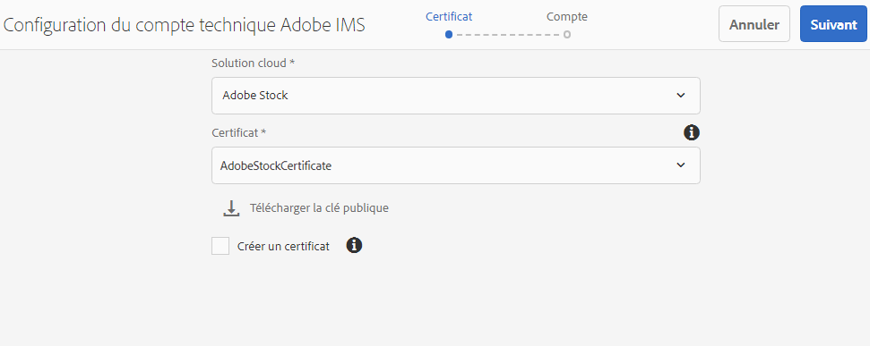
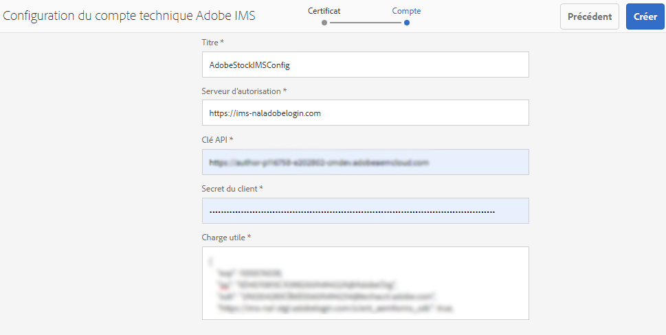
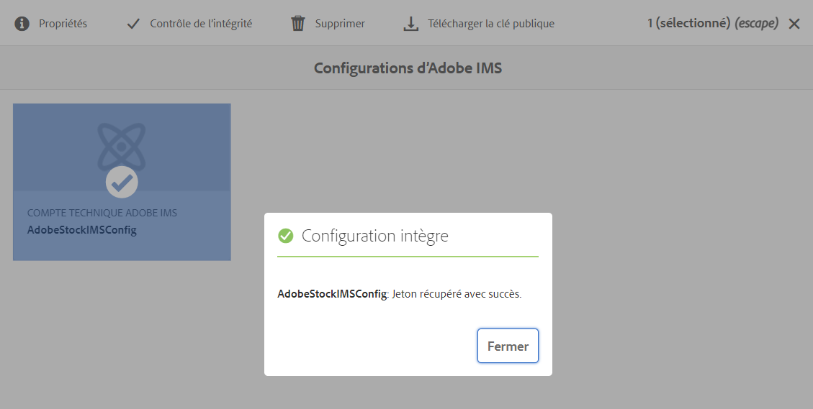
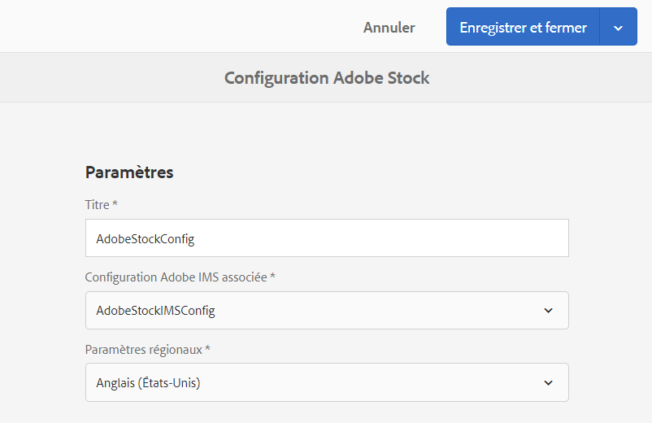
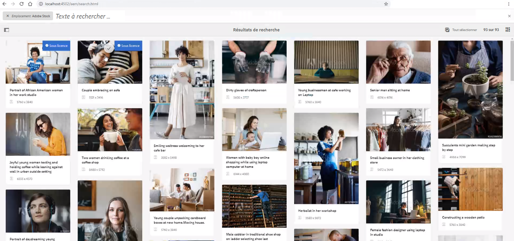
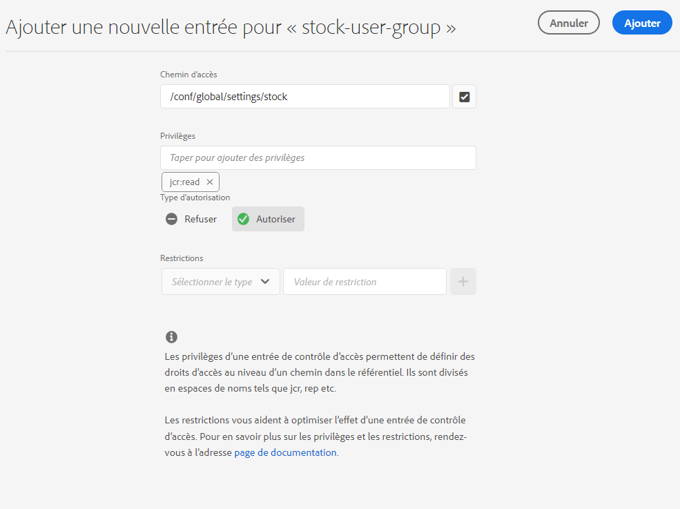
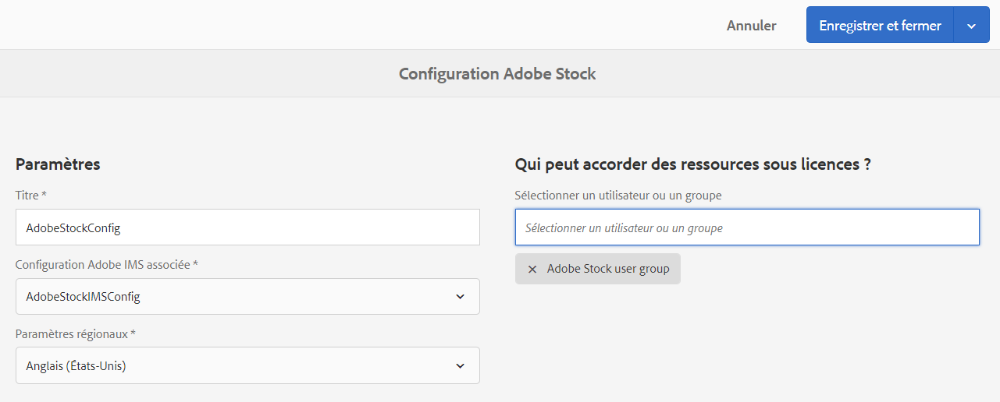
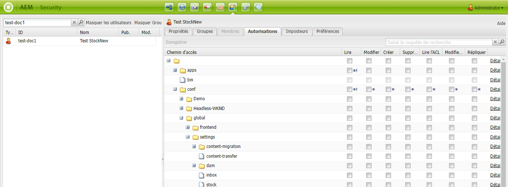
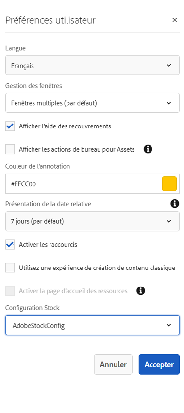

# Utiliser des ressources de [!DNL Adobe Stock] dans [!DNL Adobe Experience Manager Assets] {#use-adobe-stock-assets-in-aem-assets}

| Version | Lien de l’article |
| -------- | ---------------------------- |
| AEM as a Cloud Service | [Cliquez ici](https://experienceleague.adobe.com/docs/experience-manager-cloud-service/content/assets/manage/aem-assets-adobe-stock.html?lang=fr) |
| AEM 6.5 | Cet article |

<!-- old content

[!DNL Experience Manager Assets] provides users the ability to search, preview, save, and license [!DNL Adobe Stock] assets directly from [!DNL Experience Manager]. 

Organizations can integrate their [!DNL Adobe Stock] enterprise plan with [!DNL Experience Manager Assets] to ensure that licensed assets are broadly available for their creative and marketing projects, with the powerful asset management capabilities of [!DNL Experience Manager].

[!DNL Adobe Stock] service provides designers and businesses with access to millions of high-quality, curated, royalty-free photos, vectors, illustrations, videos, templates, and 3D assets for all their creative projects. [!DNL Experience Manager] users are able to quickly find, preview, and license [!DNL Adobe Stock] assets that are saved in [!DNL Experience Manager], without leaving the [!DNL Experience Manager] interface.
-->

<!-- New overview content
-->

Le service [!DNL Adobe Stock] permet aux concepteurs et aux entreprises d’accéder à des millions de photos, de vecteurs, d’illustrations, de vidéos, de modèles et de ressources 3D organisés, de grande qualité et libres de droits d’auteur pour tous leurs projets de création. 

[!DNL Adobe Stock] pour l’offre d’entreprise, inclut par défaut des droits de partage à l’échelle de l’entreprise. Une fois qu’une ressource a obtenu une licence d’un utilisateur de votre entreprise, d’autres utilisateurs de votre entreprise peuvent l’identifier, la télécharger et l’utiliser sans avoir à la renouveler. Une fois qu’une ressource a obtenu une licence de votre entreprise, le droit de l’utiliser est perpétuel.

Les entreprises peuvent intégrer leur formule d’abonnement [!DNL Adobe Stock] pour entreprise dans [!DNL Experience Manager Assets] pour s’assurer que les ressources sous licence sont mises à la disposition de leurs projets de création et marketing, tout en bénéficiant des puissantes fonctionnalités de gestion de ressources numériques de [!DNL Experience Manager]. Les utilisateurs d’[!DNL Experience Manager] peuvent en un éclair, rechercher, prévisualiser et acquérir sous licence des ressources Adobe Stock qui sont enregistrées dans [!DNL Experience Manager], sans quitter l’interface d’[!DNL Experience Manager].

<!-- Old content
## Prerequisites {#prerequisites}

The integration requires an [enterprise [!DNL Adobe Stock] plan](https://stockenterprise.adobe.com/).
-->

## Intégration d’[!DNL Experience Manager] et [!DNL Adobe Stock] {#integrate-aem-and-adobe-stock}

[!DNL Experience Manager Assets] permet aux utilisateurs de rechercher, de prévisualiser, d’enregistrer et d’acquérir sous licence des ressources [!DNL Adobe Stock] directement à partir d’[!DNL Experience Manager].

**Conditions préalables**

L’intégration nécessite :

* Une [formule d’abonnement pour [!DNL Adobe Stock] entreprise](https://stockenterprise.adobe.com/fr/home.html)
* Un utilisateur disposant d’autorisations dans Admin Console sur le profil de produit Stock par défaut.
* Un utilisateur disposant d’autorisations sur le profil Accès des développeurs pour la création d’une intégration dans Adobe Developer Console.

Une formule d’abonnement à [!DNL Adobe Stock] pour entreprise,

* Fournit les droits de produit pour [!DNL Adobe Stock] (Stocks connectés à Experience Manager)
* Achat de crédits dans [!DNL Adobe Admin Console] pour vos droits de stock
* Active l’authentification du compte de service (JWT) dans [!DNL Adobe Developer Console] pour vos droits de stock.
* Permet de gérer les crédits et les licences à l’échelle mondiale à partir d’[!DNL Adobe Admin Console].

Dans les droits, un profil de produit par défaut pour [!DNL Adobe Stock] existe dans [!DNL Admin Console]. Plusieurs profils peuvent être créés et ils déterminent qui peut acquérir des ressources Stock sous licence. Un utilisateur disposant d’un accès direct au profil de produits peut accéder à [https://stock.adobe.com/fr](https://stock.adobe.com/fr) et acquérir des ressources Stock sous licence. En revanche, il existe une autre méthode d’utilisation de l’accès développeur pour créer l’intégration (API) afin d’authentifier la communication entre [!DNL Experience Manager] et [!DNL Adobe Stock].

>[!NOTE]
>
>L’authentification du compte de service Stock (JWT) est fournie avec les droits Stock pour entreprise.
>
>L’intégration ne prend pas en charge l’authentification Oauth pour les droits Stock pour entreprise.

<!-- old content
To allow communication between [!DNL Experience Manager] and [!DNL Adobe Stock], create an IMS configuration and an [!DNL Adobe Stock] configuration in [!DNL Experience Manager].

>[!NOTE]
>
>Only [!DNL Experience Manager] administrators and [!DNL Admin Console] administrators for an organization can perform the integration as it requires administrator privileges.
-->

## Étapes d’intégration de [!DNL Experience Manager] et [!DNL Adobe Stock] {#integration-steps}

Pour intégrer [!DNL Experience Manager] et [!DNL Adobe Stock], remplissez les étapes suivantes dans la séquence répertoriée :

1. [Obtention d’un certificat public](#public-certificate)

   Dans [!DNL Experience Manager], créez un compte IMS et générez un certificat public (clé publique).

1. [Créer une connexion au compte de service (JWT)](#createnewintegration).

   Dans [!DNL Adobe Developer Console], créez un projet pour votre entreprise [!DNL Adobe Stock]. Dans le projet, configurez une API à l’aide de la clé publique pour créer une connexion au compte de service (JWT). Obtenez les identifiants du compte de service et les informations sur la payload JWT.

1. [Configuration du compte IMS](#create-ims-account-configuration)

   Dans [!DNL Experience Manager], configurez le compte IMS à l’aide des identifiants du compte de service et de la payload JWT.

1. [Configuration du service cloud](#configure-the-cloud-service)

   Dans [!DNL Experience Manager], configurez un service cloud d’[!DNL Adobe Stock] à l’aide du compte IMS.

### Création d’une configuration IMS {#create-an-ims-configuration}

La configuration IMS authentifie votre instance d’auteur [!DNL Experience Manager Assets] en utilisant les droits d’[!DNL Adobe Stock].

La configuration IMS comprend deux étapes :

* [Obtention d’un certificat public](#public-certificate)
* [Configuration du compte IMS](#create-ims-account-configuration)

### Obtention d’un certificat public {#public-certificate}

La clé publique (certificat) authentifie votre profil sur la console Adobe Developer.

1. Connectez-vous à votre instance d’auteur [!DNL Experience Manager Assets]. L’URL par défaut est `http://localhost:4502/aem/start.html`.

1. Dans le panneau **[!UICONTROL Outils]**, accédez à **[!UICONTROL Sécurité]** > **[!UICONTROL Configurations d’Adobe IMS]**.

1. Dans la page Configurations d’Adobe IMS, cliquez sur **[!UICONTROL Créer]**. La page **[!UICONTROL Configuration du compte technique Adobe IMS]** s’affiche.

1. Dans l’onglet **[!UICONTROL Certificat]**, sélectionnez **[!UICONTROL Adobe Stock]** dans la liste déroulante **[!UICONTROL Solution cloud]**.

1. Vous pouvez créer un certificat ou réutiliser un certificat existant pour la configuration.

   Pour créer un certificat, cochez la case **[!UICONTROL Créer un certificat]** et spécifiez un **alias** pour la clé publique. L’alias constitue le nom de la clé publique.

1. Cliquez sur **[!UICONTROL Créer un certificat]**. Cliquez sur **[!UICONTROL OK]** pour générer la clé publique.

1. Cliquez sur l’icône **[!UICONTROL Télécharger la clé publique]** et enregistrez le fichier de clé publique (.crt) sur votre ordinateur. La clé publique est utilisée ultérieurement pour configurer l’API de votre client Brand Portal et générer les informations d’identification de compte de service dans la console Adobe Developer.

   Cliquez sur **[!UICONTROL Suivant]**.

   

1. Le compte Adobe IMS est créé dans l’onglet **Compte**, ce qui nécessite les identifiants du compte de service.

   Ouvrez un nouvel onglet et [créez une connexion au compte de service (JWT) dans Adobe Developer Console](#createnewintegration).

### Créer une connexion au compte de service (JWT) {#createnewintegration}

Dans Adobe Developer Console, les projets et les API sont configurés au niveau de l’entreprise. La configuration d’une API crée une connexion au compte de service (JWT). Il existe deux méthodes pour configurer l’API : générer une paire de clés (clés privée et publique) ou télécharger une clé publique. Dans cet exemple, les identifiants du compte de service sont générés en chargeant la clé publique.

Pour générer les identifiants du compte de service et la payload JWT :

1. Connectez-vous à Adobe Developer Console avec les droits d’administrateur système. L’URL par défaut est [https://www.adobe.com/go/devs_console_ui](https://www.adobe.com/go/devs_console_ui).

   Assurez-vous d’avoir sélectionné l’entreprise IMS appropriée (droits Stock) dans la liste déroulante (entreprise).

1. Cliquez sur **[!UICONTROL Create new project]** (Créer un projet). Un projet vierge portant un nom généré par le système est créé pour votre organisation.

   Cliquez sur **[!UICONTROL Modifier le projet]**. Mettez à jour le **[!UICONTROL Titre du projet]** et la **[!UICONTROL Description]**, puis cliquez sur **[!UICONTROL Enregistrer]**.

1. Dans l’onglet **[!UICONTROL Aperçu du projet]**, cliquez sur **[!UICONTROL Ajouter une API]**.

1. Dans la **[!UICONTROL fenêtre Ajouter une API]**, sélectionnez **[!UICONTROL Adobe Stock]**. Cliquez sur **[!UICONTROL Suivant]**.

1. Dans la fenêtre **[!UICONTROL Configurer l’API]**, sélectionnez l’authentification du **[!UICONTROL Compte de service (JWT)]**. Cliquez sur **[!UICONTROL Suivant]**.

   

1. Cliquez sur **[!UICONTROL Charger votre clé publique]**. Cliquez sur **[!UICONTROL Sélectionner un fichier]** et chargez la clé publique (fichier .crt) que vous avez téléchargée comme indiqué dans la section [Obtention d’un certificat public](#public-certificate). Cliquez sur **[!UICONTROL Suivant]**.

1. Vérifiez la clé publique et cliquez sur **[!UICONTROL Suivant]**.

1. Sélectionnez le profil de produit **[!UICONTROL Adobe Stock]** par défaut et cliquez sur **[!UICONTROL Enregistrer l’API configurée]**.

1. Après la configuration de l’API, vous êtes redirigé vers sa page d’aperçu. Dans la navigation de gauche, sous **[!UICONTROL Identifiants]**, cliquez sur **[!UICONTROL Compte de service (JWT)]**. Vous pouvez alors afficher les identifiants et effectuer des actions telles que la génération des jetons JWT, la copie des informations d’identification et la récupération du secret client.

1. Dans l’onglet **[!UICONTROL Client Credentials]** (Informations d’identification client), copiez l’**[!UICONTROL ID client]**.

   Cliquez sur **[!UICONTROL Retrieve Client Secret]** (Récupérer le secret client) et copiez le **[!UICONTROL secret client]**.

   

1. Accédez à l’onglet **[!UICONTROL Générer le jeton JWT]** et copiez les informations relatives à la **[!UICONTROL Payload du JWT]**.

Vous pouvez désormais utiliser l’ID client (clé API), le secret client et la payload du JWT pour [configurer le compte IMS](#create-ims-account-configuration) dans [!DNL Experience Manager Assets].

### Configuration du compte IMS {#create-ims-account-configuration}

Vous devez disposer du [certificat](#public-certificate) et des [identifiants du compte de service (JWT)](#createnewintegration) pour configurer le compte IMS.

Pour configurer le compte IMS, procédez comme suit :

1. Ouvrez la configuration IMS et accédez à l’onglet **[!UICONTROL Compte]**. Vous avez maintenu la page ouverte lors de l’[obtention du certificat public](#public-certificate).

1. Spécifiez un **[!UICONTROL titre]** pour le compte IMS.

   Dans le champ **[!UICONTROL Serveur d’autorisation]**, saisissez l’URL suivante : [https://ims-na1.adobelogin.com/](https://ims-na1.adobelogin.com/).

   Saisissez l’ID client dans le champ **[!UICONTROL Clé API]**, le **[!UICONTROL Secret client]** et la **[!UICONTROL Payload]** (payload du JWT) que vous avez copiés lors de la [création d’une connexion au compte de service (JWT)](#createnewintegration).

1. Cliquez sur **[!UICONTROL Créer]**. Cela crée une configuration de compte IMS.

   

1. Sélectionnez la configuration de compte IMS et cliquez sur **[!UICONTROL Contrôle de l’intégrité]**.

   Cliquez sur **[!UICONTROL Vérifier]** dans la boîte de dialogue. Une fois la configuration réussie, un message s’affiche avec la mention *Jeton récupéré avec succès*.

   

### Configuration du service cloud {#configure-the-cloud-service}

Pour configurer le service cloud d’[!DNL Adobe Stock], procédez comme suit :

1. Dans l’interface utilisateur d’[!DNL Experience Manager], accédez à **[!UICONTROL Outils]** > **[!UICONTROL Services cloud]** > **[!UICONTROL Adobe Stock]**.

1. Dans la page d’[!DNL Adobe Stock Configurations], cliquez sur **[!UICONTROL Créer]**.

1. Saisissez un **[!UICONTROL titre]** pour la configuration cloud.

   Sélectionnez la configuration IMS créée lors de la [configuration du compte IMS](#create-ims-account-configuration).

   Sélectionnez vos paramètres régionaux dans la liste déroulante.

   

1. Cliquez sur **[!UICONTROL Enregistrer et fermer]**.

   Votre instance d’auteur [!DNL Experience Manager Assets] est désormais intégrée à [!DNL Adobe Stock]. Vous pouvez créer plusieurs configurations [!DNL Adobe Stock] (par exemple, des configurations basées sur des paramètres régionaux). Vous pouvez désormais accéder aux ressources [!DNL Adobe Stock], en rechercher et en obtenir la licence dans l’interface utilisateur d’[!DNL Experience Manager].

   

   >[!NOTE]
   >
   >À cette étape de l’intégration, seuls les administrateurs peuvent accéder aux ressources [!DNL Adobe Stock], rechercher des ressources Stock (à l’aide de l’omni-recherche) et obtenir la licence des ressources [!DNL Adobe Stock].
   >
   >Les administrateurs peuvent ajouter des utilisateurs ou des groupes au service cloud d’[!DNL Adobe Stock] et attribuer des autorisations à ces utilisateurs non administrateurs dans [!DNL Experience Manager] pour accéder à la configuration de Stock.

1. Pour ajouter des utilisateurs ou des groupes, sélectionnez la configuration cloud d’[!DNL Adobe Stock] et cliquez sur **[!UICONTROL Propriétés]**.

1. Effectuez une recherche pour ajouter les utilisateurs ou les groupes auxquels vous avez autorisé l’accès à la configuration d’Adobe Stock. Consultez la section [Attribuer des autorisations à un groupe d’utilisateurs](#assign-permissions-to-group).

## Attribution d’autorisations à un groupe d’utilisateurs {#assign-permissions-to-group}

Les administrateurs peuvent créer des groupes d’utilisateurs et autoriser certains utilisateurs ou groupes à accéder au service cloud d’[!DNL Adobe Stock].

Voici les autorisations requises pour qu’un utilisateur puisse rechercher et obtenir la licence des ressources Adobe Stock :

* Configurez le chemin d’accès : `/conf/global/settings/stock`
* Droits : `jcr:read`
* Type d’autorisation : `Allow`

Vous pouvez créer un groupe d’utilisateurs ou attribuer des autorisations à un groupe d’utilisateurs existant. Les autorisations peuvent être attribuées à partir de l’interface d’[!DNL Experience Manager Assets] ou à partir de la console d’[!DNL User Admin].

**Pour accorder l’accès à un groupe d’utilisateurs à partir d’[!DNL Experience Manager] :**

1. Dans l’interface utilisateur d’[!DNL Experience Manager], accédez à **[!UICONTROL Outils]** > **[!UICONTROL Sécurité]** > **[!UICONTROL Groupes]**. Créez un groupe d’utilisateurs pour [!DNL Adobe Stock].

1. Accédez à **[!UICONTROL Outils]** > **[!UICONTROL Sécurité]** > **[!UICONTROL Autorisations]**.

1. Recherchez le groupe d’utilisateurs dans le panneau de gauche et ajoutez une nouvelle **[!UICONTROL Entrée de contrôle d’accès (ACE)]** pour Adobe Stock.

   * Configurez le chemin d’accès : `/conf/global/settings/stock`
   * Droits : `jcr:read`
   * Type d’autorisation : `Allow`

   Cliquez sur **[!UICONTROL Ajouter]**.

   

1. Accédez à **[!UICONTROL Outils]** > **[!UICONTROL Services cloud]** > **[!UICONTROL Adobe Stock]**. Sélectionnez la configuration du cloud d’[!DNL Adobe Stock] et cliquez sur **[!UICONTROL Propriétés]**.

1. Ajoutez le groupe d’utilisateurs nouvellement créé à la configuration d’[!DNL Adobe Stock]. Cliquez sur **[!UICONTROL Enregistrer et fermer]**.

   

**Pour fournir l’accès à un utilisateur à partir de la [!DNL User Admin Console] :**

1. Ouvrez l’Admin Console des utilisateurs d’[!DNL Experience Manager]. L’URL par défaut est `http://localhost:4502/userdamin`.

1. Dans le volet de gauche, recherchez l’utilisateur en saisissant le `user_id` ou le `name`. Double-cliquez pour ouvrir les propriétés de l’utilisateur.

1. Accédez à l’onglet **[!UICONTROL Autorisations]** et activez l’autorisation de `read` pour la configuration cloud d’[!DNL Adobe Stock] : `/conf/global/settings/stock`.

   >[!CAUTION]
   >
   >Si la configuration cloud n’est pas autorisée, l’utilisateur peut uniquement accéder aux **[!UICONTROL Ressources]** dans l’interface d’[!DNL Experience Manager].
   >
   >Pour autoriser l’accès aux [!UICONTROL Ressources] et aux ressources d’[!DNL Adobe Stock], assurez-vous que la configuration cloud est autorisée pour l’utilisateur.

1. Cliquez sur **[!UICONTROL Enregistrer]** pour mettre à jour les autorisations.

   

1. Ajoutez l’utilisateur ou le groupe à la configuration du cloud d’[!DNL Adobe Stock].

## Accès aux ressources d’Adobe Stock {#access-stock-assets}

Un utilisateur non administrateur disposant d’autorisations pour la configuration cloud d’[!DNL Adobe Stock] peut rechercher et obtenir une licence pour les ressources d’[!DNL Adobe Stock] à partir de l’interface d’[!DNL Experience Manager].

L’utilisateur doit effectuer une étape supplémentaire pour activer la configuration cloud d’[!DNL Adobe Stock] avant d’accéder aux ressources [!DNL Adobe Stock]. Cette opération n’est à effectuer qu’une fois. Si des autorisations sont attribuées à l’utilisateur pour plusieurs configurations cloud d’[!DNL Adobe Stock], celui-ci peut sélectionner la configuration souhaitée dans les **[!UICONTROL Préférences utilisateur]**.

Pour activer la configuration cloud d’[!DNL Adobe Stock] :

1. Connectez-vous à [!DNL Experience Manager].

1. Cliquez sur l’icône de l’utilisateur dans le coin supérieur droit, puis cliquez sur **[!UICONTROL Mes préférences]**. La fenêtre des **[!UICONTROL Préférences utilisateur]** s’ouvre.

1. Sélectionnez la **[!UICONTROL Configuration Stock]** souhaitée dans la liste déroulante, puis cliquez sur **[!UICONTROL Accepter]** pour activer la configuration.

   

1. Accédez à **[!UICONTROL Ressources]** > **[!UICONTROL Adobe Stock]**. Vous pouvez désormais afficher, rechercher et obtenir une licence pour les ressources d’[!DNL Adobe Stock].

Le tableau suivant explique le fonctionnement des autorisations utilisateur lors de l’accès aux ressources d’[!DNL Adobe Stock] :

| Utilisateur | Groupe | Autorisations | Accepter la configuration Stock dans les Préférences utilisateur | Accéder aux ressources | Accéder à Adobe Stock |
| --- | --- | --- | --- | --- | --- |
| administrateur | S/O | Tous | S/O | Oui | Oui |
| test-doc1 | Utilisateur DAM | /conf/global/settings/stock/cloud-config | Oui | Oui | Oui |
| test-doc1 | Utilisateur DAM | /conf/global/settings/stock/cloud-config | Non | Erreur : Échec du chargement des données | Non |
| test-doc1 | Utilisateur DAM | **autoriser** : /conf/global/settings/stock **interdire** : /cloud-config | La configuration de Stock n’est pas visible | Oui | Non |

## Utilisation et gestion de ressources [!DNL Adobe Stock] dans [!DNL Experience Manager] {#usemanage}

Grâce à cette fonctionnalité, les entreprises peuvent permettre à leurs utilisateurs de travailler avec des ressources [!DNL Adobe Stock] dans [!DNL Experience Manager Assets]. Dans l’interface utilisateur [!DNL Experience Manager], les utilisateurs peuvent rechercher des ressources [!DNL Adobe Stock] et obtenir des licences pour les ressources requises.

Une fois qu’une ressource [!DNL Adobe Stock] est sous licence dans [!DNL Experience Manager], elle peut être utilisée et gérée comme une ressource standard. Dans [!DNL Experience Manager], les utilisateurs peuvent rechercher et prévisualiser les ressources, les copier et les publier, et les partager sur [!DNL Brand Portal]; accéder aux ressources et les utiliser au moyen de la fonction [!DNL Experience Manager] application de bureau, etc.

![Rechercher des ressources [!DNL Adobe Stock] et filtrer les résultats à partir de l’espace de travail d’[!DNL Adobe Experience Manager]](assets/adobe-stock-search-results-workspace.png)

**A.** Rechercher des ressources semblables à celles dont l’ID d’[!DNL Adobe Stock] est fourni. **B.** Rechercher des ressources correspondant à la forme ou à l’orientation que vous avez sélectionnée. **C.** Rechercher un ou plusieurs types de ressource pris en charge. **D.** Ouvrir ou réduire le volet Filtres. **E.** Obtenir la licence et enregistrer la ressource sélectionnée dans [!DNL Experience Manager]. **F.** Enregistrer la ressource dans [!DNL Experience Manager] avec filigrane. **G.** Explorer des ressources semblables à la ressource sélectionnée sur le site web d’[!DNL Adobe Stock]. **H.** Afficher des ressources sélectionnées sur le site web d’[!DNL Adobe Stock]. **I.** Nombre de ressources sélectionnées à partir des résultats de la recherche. **J.** Basculer entre les affichages Carte et Liste.

### Recherche de ressources {#find-assets}

Vos utilisateurs [!DNL Experience Manager] peuvent rechercher des ressources dans [!DNL Experience Manager] et dans [!DNL Adobe Stock]. Lorsque l’emplacement de recherche n’est pas limité à [!DNL Adobe Stock], les résultats de recherche en provenance d’[!DNL Experience Manager] et d’[!DNL Adobe Stock] sont affichés.

* Pour rechercher des ressources [!DNL Adobe Stock], cliquez sur **[!UICONTROL Navigation]** > **[!UICONTROL Ressources]** > **[!UICONTROL Rechercher sur Adobe Stock]**.

* Pour rechercher des ressources dans [!DNL Adobe Stock] et [!DNL Experience Manager Assets], cliquez sur .

Vous pouvez également commencer à saisir `Location: Adobe Stock` dans la barre de recherche pour sélectionner des ressources [!DNL Adobe Stock] [!DNL Experience Manager] propose des fonctionnalités de filtrage avancé sur les ressources recherchées, ce qui permet aux utilisateurs de cibler rapidement les ressources requises à l’aide de filtres tels que les types de ressources pris en charge, l’orientation d’image et l’état de licence.

>[!NOTE]
>
>Les ressources recherchées dans [!DNL Adobe Stock] s’affichent dans [!DNL Experience Manager]. Les ressources [!DNL Adobe Stock] ne sont pas récupérées ni stockées dans le référentiel [!DNL Experience Manager] tant qu’un utilisateur n’a pas [enregistré une ressource](/help/assets/aem-assets-adobe-stock.md#saveassets) ou [acquis sous licence et enregistré une ressource ](/help/assets/aem-assets-adobe-stock.md#licenseassets). Les ressources déjà stockées dans [!DNL Experience Manager] sont affichées et mises en surbrillance pour simplifier leur référencement et leur accès. En outre, les ressources [!DNL Stock] sont enregistrées avec quelques métadonnées supplémentaires pour indiquer la source comme étant [!DNL Stock].

![Rechercher des filtres dans [!DNL Experience Manager] et ressources [!DNL Adobe Stock] mises en évidence dans les résultats de recherche](assets/aem-search-filters2.jpg)

### Enregistrement et affichage des ressources requises {#saveassets}

Sélectionnez une ressource que vous souhaitez enregistrer dans [!DNL Experience Manager]. Cliquez sur [!UICONTROL Enregistrer] dans la barre d’outils supérieure, et indiquez le nom et l’emplacement de la ressource. Les ressources sans licence sont enregistrées en local avec un filigrane.

La prochaine fois que vous rechercherez des ressources, les ressources enregistrées seront mises en évidence avec un badge pour indiquer qu’elles sont disponibles dans [!DNL Experience Manager Assets].

>[!NOTE]
>
>Les ressources ajoutées récemment sont assorties d’un badge Nouvelle au lieu du badge Sous licence.

### Acquisition de ressources sous licence {#licenseassets}

Les utilisateurs peuvent acquérir des ressources [!DNL Adobe Stock] sous licence en utilisant le quota de leur abonnement pour entreprise [!DNL Adobe Stock]. Lorsque vous acquérez une ressource sous licence, elle est enregistrée sans filigrane, et elle peut être recherchée et utilisée dans [!DNL Experience Manager Assets].

![Boîte de dialogue permettant d’obtenir la licence et d’enregistrer des ressources [!DNL Adobe Stock] dans [!DNL Experience Manager Assets]](assets/aem-stock_licenseandsave.jpg)

### Accès aux propriétés de ressources et de métadonnées {#access-metadata-and-asset-properties}

Les utilisateurs peuvent accéder aux métadonnées et les prévisualiser, ce qui inclut les propriétés de métadonnées [!DNL Adobe Stock] des ressources enregistrées dans [!DNL Experience Manager], et ajouter des **[!UICONTROL Références de licence]** pour une ressource. Cependant, les mises à jour apportées à une référence de licence ne sont pas synchronisées entre [!DNL Experience Manager] et le site web d’[!DNL Adobe Stock].

Les utilisateurs peuvent afficher les propriétés de toutes les ressources, avec et sans licence.

## Limites connues {#known-limitations}

* **Problèmes d’intégration avec le pack de services [!DNL Experience Manager] 6.5.7.0 et versions ultérieures** : un problème inattendu est identifié lors de l’intégration à [!DNL Experience Manager] 6.5.7.0 et les versions ultérieures. Le problème est en cours de test et devrait être disponible dans [!DNL Experience Manager] 6.5.11.0. Contactez le [!DNL Customer Support] pour un correctif immédiat.

* **La fonctionnalité de restriction des utilisateurs pour l’obtention de la licence ne fonctionne pas correctement** : tous les utilisateurs qui disposent des autorisations `read` pour la configuration de Stock sont autorisés à rechercher les ressources d’[!DNL Adobe Stock] et à obtenir une licence.

* **Les utilisateurs non administrateurs doivent activer manuellement la configuration cloud d’[!DNL Adobe Stock]** : dans la fenêtre des **[!UICONTROL Préférences utilisateur]**, la **[!UICONTROL Configuration de Stock]** affiche la configuration cloud d’[!DNL Adobe Stock] comme étant activée, mais elle ne fonctionne pas pour un utilisateur non administrateur. L’utilisateur doit cliquer sur le bouton **[!UICONTROL Accepter]** pour activer la configuration de Stock. En l’absence de cette étape, le système affiche un message d’erreur lors de l’accès aux **[!UICONTROL Ressources]**.

* **L’avertissement d’image éditoriale n’est pas affiché** : lors de l’octroi d’une licence pour une image, les utilisateurs ne peuvent pas vérifier si une image est destinée à une utilisation éditoriale uniquement. Pour lutter contre une éventuelle utilisation abusive, les administrateurs peuvent désactiver l’accès aux ressources éditoriales à partir d’Admin Console.

* **Type de licence affiché incorrect** : il est possible qu’un type de licence incorrect apparaisse dans [!DNL Experience Manager] pour une ressource. Les utilisateurs peuvent se connecter au site web d’[!DNL Adobe Stock] pour afficher le type de licence.

* **Les champs de référence et les métadonnées ne sont pas synchronisés** : lorsqu’un utilisateur met à jour un champ de référence de licence, les informations de référence de licence sont mises à jour dans [!DNL Experience Manager], mais pas sur le site web d’[!DNL Adobe Stock]. De même, si l’utilisateur met à jour les champs de référence sur le site web d’[!DNL Adobe Stock], les mises à jour ne sont pas synchronisées dans [!DNL Experience Manager].

>[!MORELIKETHIS]
>
>* [Tutoriel vidéo sur l’utilisation de ressources  [!DNL Adobe Stock]  avec  [!DNL Experience Manager Assets]](https://experienceleague.adobe.com/docs/experience-manager-learn/assets/creative-workflows/adobe-stock.html?lang=fr)
>* Aide sur la formule Entreprise d’[[!DNL Adobe Stock] ](https://helpx.adobe.com/fr/enterprise/using/adobe-stock-enterprise.html)
>* [[!DNL Adobe Stock] FAQ](https://helpx.adobe.com/fr/stock/faq.html)

<!--old content

### Create an IMS configuration {#create-an-ims-configuration}

1. In the [!DNL Experience Manager] user interface, navigate to **[!UICONTROL Tools]** > **[!UICONTROL Security]** > **[!UICONTROL Adobe IMS Configurations]**. Click **[!UICONTROL Create]** and select **[!UICONTROL Cloud Solution]** > **[!UICONTROL Adobe Stock]**.
1. Either reuse an existing certificate or select **[!UICONTROL Create new certificate]**.
1. Click **[!UICONTROL Create certificate]**. Once created, download the public key. Click **[!UICONTROL Next]**. Leave the [!UICONTROL Adobe IMS Technical Account Configuration] screen open to provide the required values shortly.
1. Access [Adobe Developer Console](https://console.adobe.io). Ensure that your account has administrator permissions for the organization for which the integration is required.
1. Click **[!UICONTROL Create new project]** and click **[!UICONTROL Add API]**. Select **[!UICONTROL Adobe Stock]** from the list of APIs that are available to you. Select [!UICONTROL OAUTH 2.0 Web].
1. Provide **[!UICONTROL Default redirect URI]** and **[!UICONTROL Redirect URI pattern]** values. Click **[!UICONTROL Save configured API]**. Copy the generated ID and secret.
1. In [!UICONTROL Adobe IMS Technical Account Configuration] screen, provide the values in the boxes titled **[!UICONTROL Title]**, **[!UICONTROL Authorization Server]**, **[!UICONTROL API Key]**, **[!UICONTROL Client Secret]**, and **[!UICONTROL Payload]**. For detailed information about these values, see [JWT authentication quick start](https://www.adobe.io/authentication/auth-methods.html#!AdobeDocs/adobeio-auth/master/JWT/JWT.md).

-->

<!-- TBD: Update the URL to update the terminology when AIO team updates their documentation URL. Logged issue github.com/AdobeDocs/adobeio-auth/issues/63.
-->

<!--
### Create [!DNL Adobe Stock] configuration in [!DNL Experience Manager] {#create-adobe-stock-configuration-in-aem}

1. In the [!DNL Experience Manager], navigate to **[!UICONTROL Tools]** > **[!UICONTROL Cloud Services]** > **[!UICONTROL Adobe Stock]**.
1. Click **[!UICONTROL Create]** to create a configuration and associate it with your existing IMS Configuration. Select `PROD` as the environment parameter.
1. In **[!UICONTROL Licensed Assets Path]** field, leave a location as is. Do not change the location where you want to store the [!DNL Adobe Stock] assets.
1. Complete creation by adding all the required properties. Click **[!UICONTROL Save & Close]**.
1. Add [!DNL Experience Manager] users or groups, who can license the assets.

>[!NOTE]
>
>If there are multiple [!DNL Adobe Stock] configurations, select the desired configuration in [!UICONTROL User Preferences] panel. To access the panel from [!DNL Experience Manager] home page, click the user icon and then click **[!UICONTROL User Preferences]** > **[!UICONTROL Stock Configuration]**.
-->

