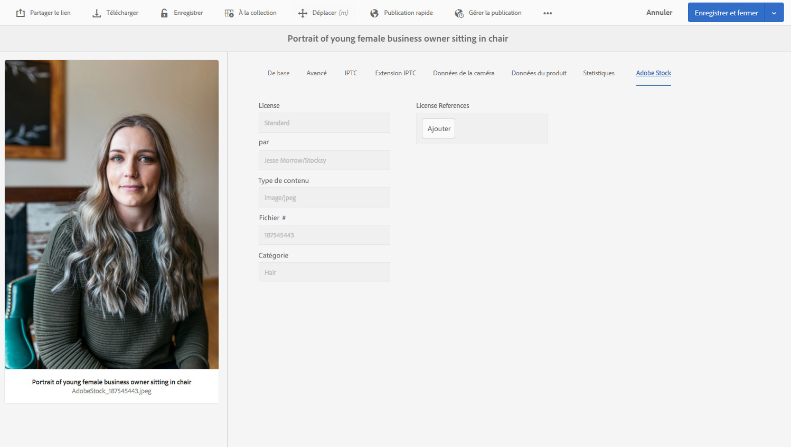

# Utilisation des ressources [!DNL Adobe Stock] dans [!DNL Adobe Experience Manager Assets] {#use-adobe-stock-assets-in-aem-assets}

Les entreprises peuvent intégrer leur formule d’abonnement pour entreprise [!DNL Adobe Stock] dans [!DNL Experience Manager Assets] pour s’assurer que les ressources sous licence sont mises à la disposition de leurs projets de création et marketing, tout en bénéficiant des puissantes fonctionnalités de gestion de ressources d’[!DNL Experience Manager].

Le service [!DNL Adobe Stock] permet aux créateurs et aux entreprises d’accéder à des millions de photos, de vecteurs, d’illustrations, de vidéos, de modèles et de ressources 3D organisés, de haute qualité et libres de droits pour tous leurs projets de création. Les utilisateurs d’[!DNL Experience Manager] peuvent en un éclair, rechercher, prévisualiser et acquérir sous licence des ressources [!DNL Adobe Stock] qui sont enregistrées dans [!DNL Experience Manager], sans quitter l’interface d’[!DNL Experience Manager].

## Conditions préalables {#prerequisites}

L&#39;intégration requiert un [plan d&#39;entreprise [!DNL Adobe Stock] ](https://stockenterprise.adobe.com/).

## Intégration d’[!DNL Experience Manager] et [!DNL Adobe Stock] {#integrate-aem-and-adobe-stock}

Pour permettre à [!DNL Experience Manager] et [!DNL Adobe Stock] de communiquer, créez une configuration IMS et une configuration [!DNL Adobe Stock] dans [!DNL Experience Manager].

>[!NOTE]
>
>Seuls les administrateurs d’[!DNL Experience Manager] et d’[!DNL Admin Console] d’une entreprise peuvent procéder à l’intégration, dans la mesure où elle requiert des privilèges d’administrateur.

### Création d’une configuration IMS {#create-an-ims-configuration}

1. Dans l’interface utilisateur [!DNL Experience Manager], naviguez jusqu’à **[!UICONTROL Outils]** > **[!UICONTROL Sécurité]** > **[!UICONTROL Configurations d’Adobe IMS]**. Cliquez sur **[!UICONTROL Créer]**, puis sélectionnez **[!UICONTROL Solution cloud]** > **[!UICONTROL Adobe Stock]**.
1. Réutilisez un certificat existant ou sélectionnez **[!UICONTROL Créer un certificat]**.
1. Cliquez sur **[!UICONTROL Créer un certificat]**. Une fois le certificat créé, téléchargez la clé publique. Cliquez sur **[!UICONTROL Suivant]**.
1. Ajoutez la clé publique téléchargée à votre compte de service [!DNL Adobe Developer Console]. Cliquez sur **[!UICONTROL Suivant]**. Laissez ouvert l’écran [!UICONTROL Configuration du compte technique Adobe IMS] pour obtenir rapidement les valeurs.
1. Accédez à [Adobe Developer Console](https://console.adobe.io). Assurez-vous que votre compte dispose des autorisations d’administrateur pour l’entreprise pour laquelle l’intégration est requise.
1. Cliquez sur **[!UICONTROL Créer un projet]**, puis sur **[!UICONTROL Ajouter l’API]**. Sélectionnez **[!UICONTROL Adobe Stock]** dans la liste des API disponibles. Sélectionnez [!UICONTROL OAUTH 2.0 Web]. Configurez et copiez les différentes valeurs présentées.
1. Dans [!DNL Experience Manager], indiquez les valeurs dans les champs intitulés **[!UICONTROL Titre]**, **[!UICONTROL Serveur d’autorisation]**, **[!UICONTROL Clé API]**, **[!UICONTROL Secret du client]** et **[!UICONTROL Charge utile]**. Voir [Démarrage rapide de l’authentification JWT](https://www.adobe.io/authentication/auth-methods.html#!AdobeDocs/adobeio-auth/master/JWT/JWT.md) pour obtenir des informations détaillées sur ces valeurs.

<!-- TBD: Update the URL to update the terminology when AIO team updates their documentation URL. Logged issue github.com/AdobeDocs/adobeio-auth/issues/63.
-->

### Création d’une configuration [!DNL Adobe Stock] dans [!DNL Experience Manager] {#create-adobe-stock-configuration-in-aem}

1. Dans [!DNL Experience Manager], accédez à **[!UICONTROL Outils]** > **[!UICONTROL Services cloud]** > **[!UICONTROL Adobe Stock]**.
1. Cliquez sur **[!UICONTROL Créer]** pour créer une configuration et l’associer à votre configuration IMS existante. Sélectionnez `PROD` comme paramètre d’environnement.
1. Ne modifiez pas l’emplacement défini dans le champ **[!UICONTROL Chemin d’accès aux ressources sous licence]**. Ne modifiez pas l’emplacement où vous souhaitez stocker les ressources [!DNL Adobe Stock].
1. Pour terminer la procédure de création, ajoutez toutes les propriétés requises. Cliquez sur **[!UICONTROL Enregistrer et fermer]**.
1. Ajoutez les utilisateurs ou groupes [!DNL Experience Manager] qui peuvent acquérir les ressources sous licence.

>[!NOTE]
>
>S’il existe plusieurs configurations [!DNL Adobe Stock], sélectionnez la configuration souhaitée dans le panneau Préférences utilisateur.  Pour accéder au panneau à partir de la page d&#39;accueil [!DNL Experience Manager], cliquez sur l’icône de l’utilisateur, puis sur **[!UICONTROL Préférences utilisateur]** > **[!UICONTROL Configuration du stock]**.

## Utilisation et gestion de ressources [!DNL Adobe Stock] dans [!DNL Experience Manager] {#usemanage}

Grâce à cette fonctionnalité, les entreprises peuvent permettre à leurs utilisateurs de travailler avec des ressources [!DNL Adobe Stock] dans [!DNL Experience Manager Assets]. Dans l’interface utilisateur [!DNL Experience Manager], les utilisateurs peuvent rechercher des ressources [!DNL Adobe Stock] et obtenir des licences pour les ressources requises.

Une fois qu’une ressource [!DNL Adobe Stock] est sous licence dans [!DNL Experience Manager], elle peut être utilisée et gérée comme une ressource standard. Dans [!DNL Experience Manager], les utilisateurs peuvent rechercher des ressources, les prévisualiser, les copier, les publier, les partager sur [!DNL Brand Portal] et les utiliser via l’application de bureau [!DNL Experience Manager], etc.

![Rechercher  [!DNL Adobe Stock] des ressources et filtrer les résultats de votre  [!DNL Adobe Experience Manager] espace de travail](assets/adobe-stock-search-results-workspace.png)

*Figure : Recherchez des  [!DNL Adobe Stock] ressources et filtrez les résultats de votre  [!DNL Experience Manager] interface.*

**A.**[!DNL Adobe Stock] Rechercher les ressources semblables à celles dont l’ID est fourni. **B.** Rechercher les ressources correspondant à la forme ou à l’orientation que vous avez sélectionnée. **C.** Recherchez l&#39;un des types de ressources les plus pris en charge  **D.** Ouvrez ou réduisez le volet filtres  **E.** Licenciez et enregistrez la ressource sélectionnée en  [!DNL Experience Manager] **F.** Enregistrez la ressource avec un filigrane G.Explorez les ressources du site Web de  qui sont similaires à la ressource sélectionnée en Vue de ressources du site Web de . résultats de la recherche J.Basculer entre la vue de carte et la vue de Liste[!DNL Experience Manager]****[!DNL Adobe Stock]****[!DNL Adobe Stock]********

### Recherche de ressources {#find-assets}

Vos utilisateurs [!DNL Experience Manager] peuvent rechercher des ressources dans [!DNL Experience Manager] et dans [!DNL Adobe Stock]. Lorsque l’emplacement de recherche n’est pas limité à [!DNL Adobe Stock], les résultats de recherche en provenance d’[!DNL Experience Manager] et d’[!DNL Adobe Stock] sont affichés.

* Pour rechercher des ressources [!DNL Adobe Stock], cliquez sur **[!UICONTROL Navigation]** > **[!UICONTROL Ressources]** > **[!UICONTROL Rechercher sur Adobe Stock]**.

* Pour rechercher des ressources dans [!DNL Adobe Stock] et [!DNL Experience Manager Assets], cliquez sur .

Vous pouvez également commencer à saisir `Location: Adobe Stock` dans la barre de recherche pour sélectionner des ressources [!DNL Adobe Stock] [!DNL Experience Manager] propose des fonctionnalités de filtrage avancé sur les ressources recherchées, ce qui permet aux utilisateurs de cibler rapidement les ressources requises à l’aide de filtres tels que les types de ressources pris en charge, l’orientation d’image et l’état de licence.

>[!NOTE]
>
>Les ressources recherchées dans [!DNL Adobe Stock] sont simplement affichées dans [!DNL Experience Manager]. Les ressources [!DNL Adobe Stock] ne sont pas récupérées ni stockées dans le référentiel [!DNL Experience Manager] tant qu’un utilisateur n’a pas [enregistré une ressource](/help/assets/aem-assets-adobe-stock.md#saveassets) ou [acquis sous licence et enregistré une ressource ](/help/assets/aem-assets-adobe-stock.md#licenseassets). Les ressources déjà stockées dans [!DNL Experience Manager] sont affichées et mises en surbrillance pour simplifier leur référencement et leur accès. En outre, les ressources [!DNL Stock] sont enregistrées avec quelques métadonnées supplémentaires pour indiquer la source comme étant [!DNL Stock].

![Filtres de recherche dans  [!DNL Experience Manager] et  [!DNL Adobe Stock] ressources mises en surbrillance dans les résultats de recherche](assets/aem-search-filters2.jpg)

*Figure : Filtres de recherche dans [!DNL Experience Manager] et ressources [!DNL Adobe Stock] mises en évidence dans les résultats de recherche.*

### Enregistrement et affichage des ressources requises {#saveassets}

Sélectionnez une ressource que vous souhaitez enregistrer dans [!DNL Experience Manager]. Cliquez sur [!UICONTROL Enregistrer] dans la barre d’outils supérieure, et indiquez le nom et l’emplacement de la ressource. Les ressources sans licence sont enregistrées en local avec un filigrane.

La prochaine fois que vous rechercherez des ressources, les ressources enregistrées seront mises en évidence avec un badge pour indiquer qu’elles sont disponibles dans [!DNL Experience Manager Assets].

>[!NOTE]
>
>Les ressources ajoutées récemment sont assorties d’un badge Nouvelle au lieu du badge Sous licence.

### Acquisition de ressources sous licence {#licenseassets}

Les utilisateurs peuvent acquérir des ressources [!DNL Adobe Stock] sous licence en utilisant le quota de leur abonnement pour entreprise [!DNL Adobe Stock]. Lorsque vous acquérez une ressource sous licence, elle est enregistrée sans filigrane, et elle peut être recherchée et utilisée dans [!DNL Experience Manager Assets].

![Boîte de dialogue pour activer la licence et enregistrer  [!DNL Adobe Stock] des fichiers dans  [!DNL Experience Manager Assets]](assets/aem-stock_licenseandsave.jpg)

*Figure : Boîte de dialogue permettant d’acquérir sous licence et d’enregistrer des ressources [!DNL Adobe Stock] dans [!DNL Experience Manager Assets].*

### Accès aux propriétés de ressources et de métadonnées {#access-metadata-and-asset-properties}

Les utilisateurs peuvent accéder aux métadonnées et les prévisualiser, ce qui inclut les propriétés de métadonnées [!DNL Adobe Stock] des ressources enregistrées dans [!DNL Experience Manager], et ajouter des **[!UICONTROL Références de licence]** pour une ressource. Cependant, les mises à jour apportées à une référence de licence ne sont pas synchronisées entre [!DNL Experience Manager] et le site web d’[!DNL Adobe Stock].

Les utilisateurs peuvent afficher les propriétés de toutes les ressources, avec et sans licence.

*Figure : Affichage des métadonnées et des références de licence des ressources enregistrées, et accès à ces éléments.*

## Limitations connues {#known-limitations}

* **L’avertissement d’image éditoriale n’est pas affiché** : lors de l’octroi d’une licence pour une image, les utilisateurs ne peuvent pas vérifier si une image est destinée à une utilisation éditoriale uniquement. Pour lutter contre une éventuelle utilisation abusive, les administrateurs peuvent désactiver l’accès aux ressources éditoriales à partir d’Admin Console.

* **Type de licence affiché incorrect** : il est possible qu’un type de licence incorrect apparaisse dans [!DNL Experience Manager] pour une ressource. Les utilisateurs peuvent se connecter au site web d’[!DNL Adobe Stock] pour afficher le type de licence.

* **Les champs de référence et les métadonnées ne sont pas synchronisés** : lorsqu’un utilisateur met à jour un champ de référence de licence, les informations de référence de licence sont mises à jour dans [!DNL Experience Manager], mais pas sur le site web d’[!DNL Adobe Stock]. De même, si l’utilisateur met à jour les champs de référence sur le site web d’[!DNL Adobe Stock], les mises à jour ne sont pas synchronisées dans [!DNL Experience Manager].

>[!MORELIKETHIS]
>
>* [Didacticiel vidéo sur l’ [!DNL Adobe Stock] utilisation de ressources avec [!DNL Experience Manager Assets]](https://experienceleague.adobe.com/docs/experience-manager-learn/assets/creative-workflows/adobe-stock.html?lang=fr)
>* [[!DNL Adobe Stock] aide du plan d&#39;entreprise](https://helpx.adobe.com/fr/enterprise/using/adobe-stock-enterprise.html)
>* [[!DNL Adobe Stock] FAQ](https://helpx.adobe.com/fr/stock/faq.html)

