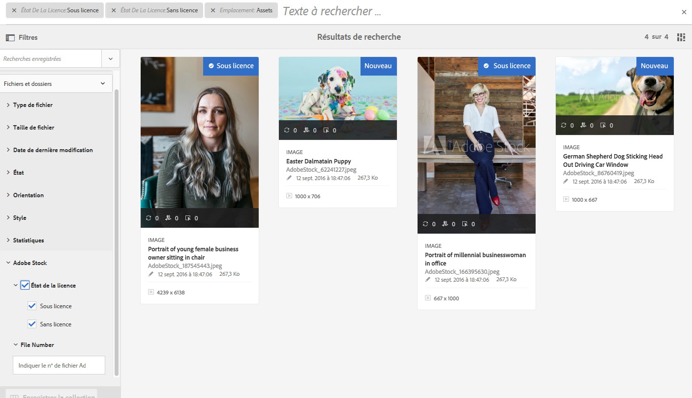
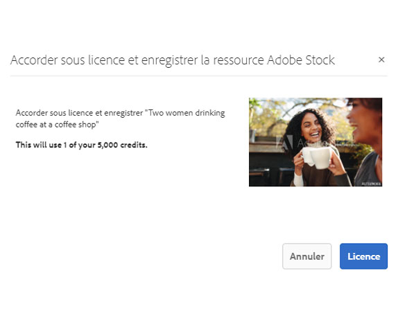

# Utiliser [!DNL Adobe Stock] des ressources dans [!DNL Adobe Experience Manager Assets]{#use-adobe-stock-assets-in-aem-assets}

Organizations can integrate their [!DNL Adobe Stock] enterprise plan with [!DNL Experience Manager Assets] to ensure that licensed assets are broadly available for their creative and marketing projects, with the powerful asset management capabilities of [!DNL Experience Manager].

[!DNL Adobe Stock]Le service permet aux créateurs et aux entreprises d’accéder à des millions de photos, de vecteurs, d’illustrations, de vidéos, de modèles et de ressources 3D organisés, de haute qualité et libres de droits pour tous leurs projets de création. [!DNL Experience Manager] les utilisateurs peuvent rapidement rechercher,  et activer la licence [!DNL Adobe Stock] des ressources enregistrées dans [!DNL Experience Manager], sans quitter l’ [!DNL Experience Manager] interface.

## Conditions préalables {#prerequisites}

L’intégration requiert un [abonnement Adobe Stock entreprise](https://stockenterprise.adobe.com/) et  6.5 ou une version ultérieure. [!DNL Experience Manager] For [!DNL Experience Manager] 6.5 service pack details, see these [release notes](/help/release-notes/sp-release-notes.md).

## Intégrer [!DNL Experience Manager] et [!DNL Adobe Stock]{#integrate-aem-and-adobe-stock}

To allow communication between [!DNL Experience Manager] and [!DNL Adobe Stock], create an IMS configuration and an [!DNL Adobe Stock] configuration in [!DNL Experience Manager].

>[!NOTE]
>
>Only [!DNL Experience Manager] administrators and [!DNL Admin Console] administrators for an organization can perform the integration as it requires administrator privileges.

### Création d’une configuration d’IMS   {#create-an-ims-configuration}

1. Click on [!DNL Experience Manager] logo. Accédez à **[!UICONTROL Outils]** > **[!UICONTROL Sécurité]** > **[!UICONTROL Configurations d’Adobe IMS]**. Cliquez sur **[!UICONTROL Créer]**, puis sélectionnez **[!UICONTROL Solution Cloud]** > **[!UICONTROL Adobe Stock]**.
1. Réutilisez un certificat existant ou sélectionnez **[!UICONTROL Créer un certificat]**.
1. Cliquez sur **[!UICONTROL Créer un certificat]**. Une fois le certificat créé, téléchargez la clé publique. Cliquez sur **[!UICONTROL Suivant]**.
1. Indiquez les valeurs appropriées dans les champs intitulés **[!UICONTROL Titre]**, **[!UICONTROL Serveur d’autorisation]**, **[!UICONTROL Clé API]**, **[!UICONTROL Secret client]** et **[!UICONTROL Charge]**. See [JWT authentication quick start](https://www.adobe.io/authentication/auth-methods.html#!AdobeDocs/adobeio-auth/master/JWT/JWT.md), for detailed information to fetch these values from [!DNL Adobe I/O].
1. Add the downloaded public key to your [!DNL Adobe I/O] service account.

### Créer une [!DNL Adobe Stock] configuration dans [!DNL Experience Manager]{#create-adobe-stock-configuration-in-aem}

1. In the [!DNL Experience Manager] user interface, navigate to **[!UICONTROL Tools]** > **[!UICONTROL Cloud Services]** > **[!UICONTROL Adobe Stock]**.
1. Cliquez sur **[!UICONTROL Créer]** pour créer une configuration et l’associer à votre configuration IMS existante. Sélectionnez `PROD` comme paramètre d’environnement.
1. Ne modifiez pas l’emplacement défini dans le champ **[!UICONTROL Chemin d’accès aux ressources sous licence]**. Do not change the location where you want to store the [!DNL Adobe Stock] assets.
1. Pour terminer la procédure de création, ajoutez toutes les propriétés requises. Cliquez sur **[!UICONTROL Enregistrer et fermer]**.
1. Add [!DNL Experience Manager] users or groups, who can license the assets.

>[!NOTE]
>
>If there are multiple [!DNL Adobe Stock] configurations, select the desired configuration in [!UICONTROL User Preferences] panel by clicking the *User* logo in the upper-right corner of the [!DNL Experience Manager] user interface.

## Use and manage [!DNL Adobe Stock] assets in [!DNL Experience Manager] {#usemanage}

Using this capability, organizations can allow its users to work using [!DNL Adobe Stock] assets in [!DNL Experience Manager Assets]. From within the [!DNL Experience Manager] user interface, users can search [!DNL Adobe Stock] assets and license the required assets.

Once an [!DNL Adobe Stock] asset is licensed in [!DNL Experience Manager], it can be used and managed like a typical asset. In [!DNL Experience Manager], the users can search and preview the assets; copy and publish the assets; share the assets on [!DNL Brand Portal]; access and use the assets via [!DNL Experience Manager] desktop app; and so on.

*Figure : Recherchez[!DNL Adobe Stock]des ressources et filtrez les résultats de votre[!DNL Experience Manager]interface.*

**A.**[!DNL Adobe Stock] Rechercher les ressources semblables à celles dont l’ID est fourni. **B.** Rechercher les ressources correspondant à la forme ou à l’orientation que vous avez sélectionnée. **C.** Recherchez l’un des types de ressource **D pris en charge.** Ouvrez ou réduisez le volet  du **E.** Attribuez une licence et enregistrez la ressource sélectionnée dans [!DNL Experience Manager] **F.** Enregistrez le fichier dans [!DNL Experience Manager] le filigrane **G.** Explorez sur [!DNL Adobe Stock] le site Web des ressources similaires à la ressource **H sélectionnée.**  les ressources sélectionnées sur le [!DNL Adobe Stock] site Web **I.** Nombre de fichiers sélectionnés à partir des résultats de la recherche **J.** Basculer entre les  de de cartes et les  de 

### Recherche de ressources {#find-assets}

Your [!DNL Experience Manager] users, can search for assets in both, [!DNL Experience Manager] and [!DNL Adobe Stock]. When the search location is not limited to [!DNL Adobe Stock], the search results from [!DNL Experience Manager] and [!DNL Adobe Stock] are displayed.

* To search for [!DNL Adobe Stock] assets, click **[!UICONTROL Navigation]** > **[!UICONTROL Assets]** > **[!UICONTROL Search Adobe Stock]**.

* To search for assets across [!DNL Adobe Stock] and [!DNL Experience Manager Assets], click the search icon .

Vous pouvez également commencer à saisir `Location: Adobe Stock` dans la barre de recherche pour sélectionner des ressources [!DNL Adobe Stock] [!DNL Experience Manager] propose des fonctionnalités de filtrage avancé sur les ressources recherchées, ce qui permet aux utilisateurs de cibler rapidement les ressources requises à l’aide de filtres tels que les types de ressources pris en charge, l’orientation d’image et l’état de licence.

>[!NOTE]
>
>Assets searched from [!DNL Adobe Stock] are just displayed in [!DNL Experience Manager]. [!DNL Adobe Stock] les ressources sont récupérées et stockées dans [!DNL Experience Manager] le référentiel uniquement après qu’un utilisateur [enregistre un fichier](/help/assets/aem-assets-adobe-stock.md#saveassets) ou [des licences et enregistre un fichier](/help/assets/aem-assets-adobe-stock.md#licenseassets). Assets that are already stored in [!DNL Experience Manager] are displayed and highlighted for ease of reference and access. Also, the [!DNL Stock] assets are saved with some additional metadata to indicate the source as [!DNL Stock].

*Figure : de recherche dans[!DNL Experience Manager]et ressources en surbrillance[!DNL Adobe Stock]dans les résultats de recherche.*

### Enregistrement et affichage des ressources requises {#saveassets}

Sélectionnez une ressource que vous souhaitez enregistrer dans [!DNL Experience Manager]. Click [!UICONTROL Save] in the toolbar at the top and provide the name and location of the asset. Les ressources sans licence sont enregistrées en local avec un filigrane.

La prochaine fois que vous rechercherez des ressources, les ressources enregistrées seront mises en évidence avec un badge pour indiquer qu’elles sont disponibles dans [!DNL Experience Manager Assets].

>[!NOTE]
>
>Les ressources ajoutées récemment sont assorties d’un badge Nouveau au lieu du badge Sous licence.

### Acquisition de ressources sous licence {#licenseassets}

Users can license [!DNL Adobe Stock] assets by using the quota of their [!DNL Adobe Stock] enterprise plan. Lorsque vous acquérez une ressource sous licence, elle est enregistrée sans filigrane, et elle peut être recherchée et utilisée dans [!DNL Experience Manager Assets].

*Figure : Boîte de dialogue permettant d’activer la licence et d’enregistrer[!DNL Adobe Stock]des fichiers[!DNL Experience Manager Assets].*

### Accès aux propriétés de ressources et de métadonnées {#access-metadata-and-asset-properties}

Users can access and preview the metadata, including the [!DNL Adobe Stock] metadata properties for the assets saved in [!DNL Experience Manager], and add **[!UICONTROL License References]** for an asset. However, the updates to license reference are not synced between [!DNL Experience Manager] and [!DNL Adobe Stock] website.

Les utilisateurs peuvent afficher les propriétés de toutes les ressources, avec et sans licence.

*Figure :  et accéder aux métadonnées et aux références de licence des ressources enregistrées.*

## Limitations connues {#known-limitations}

* **L’avertissement d’image éditoriale ne s’affiche** pas : Lors de la licence d’une image, les utilisateurs ne peuvent pas vérifier si une image est à usage éditorial uniquement. Pour lutter contre une éventuelle utilisation abusive, les administrateurs peuvent désactiver l’accès aux ressources éditoriales à partir d’Admin Console.

* **Type de licence incorrect affiché**: Il est possible qu’un type de licence incorrect s’affiche dans [!DNL Experience Manager] pour un fichier. Users can log into the [!DNL Adobe Stock] website to see the license type.

* **Les champs de référence et les métadonnées ne sont pas synchronisés**: Lorsqu’un utilisateur met à jour un champ de référence de licence, les informations de référence de licence sont mises à jour dans [!DNL Experience Manager] mais pas sur le [!DNL Adobe Stock] site Web. Similarly, if the user updates the reference fields on the [!DNL Adobe Stock] website, the updates are not synchronized in [!DNL Experience Manager].

>[!MORELIKETHIS]
>
>* [Didacticiel vidéo sur l’utilisation des ressources Adobe Stock avec les ressources d’Experience Manager](https://helpx.adobe.com/experience-manager/kt/assets/using/stock-assets-feature-video-use.html)
>* [Aide d’Adobe Stock pour entreprise](https://helpx.adobe.com/fr/enterprise/using/adobe-stock-enterprise.html)
>* [FAQ d’Adobe Stock](https://helpx.adobe.com/fr/stock/faq.html)

