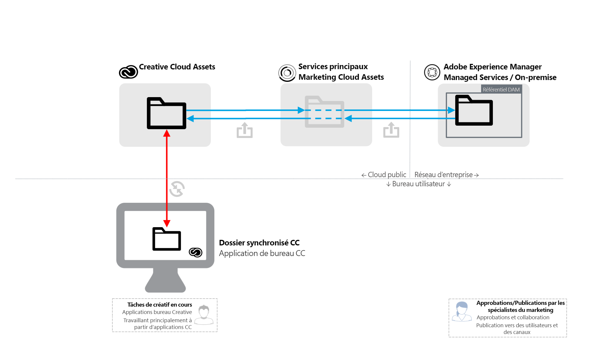
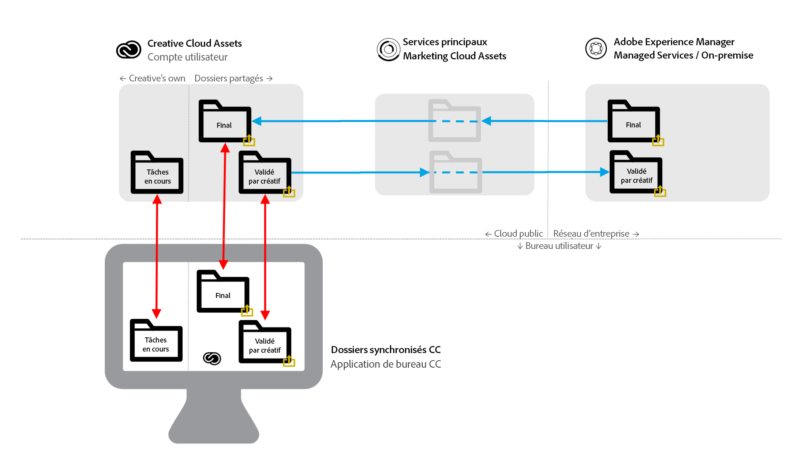

# Adobe Experience Manager au partage de dossiers Adobe Creative Cloud {#aem-to-creative-cloud-folder-sharing-best-practices}

>[!CAUTION]
>
>La fonction de partage de dossiers Experience Manager à Creative Cloud est obsolète. Adobe recommande vivement l’utilisation de fonctionnalités plus récentes, telles que [Adobe Asset Link](https://helpx.adobe.com/fr/enterprise/using/adobe-asset-link.html) ou l’application [de bureau](https://helpx.adobe.com/fr/experience-manager/desktop-app/aem-desktop-app.html)Experience Manager. Learn more in [Experience Manager and Creative Cloud integration best practices](/help/assets/aem-cc-integration-best-practices.md).

L’Adobe Experience Manager peut être configuré pour permettre aux utilisateurs des ressources de partager des dossiers avec les utilisateurs des applications Adobe Creative Cloud. Ils sont donc disponibles sous forme de dossiers partagés dans le service Adobe Creative Cloud Assets. Cette fonction peut être utilisée pour échanger des fichiers entre les équipes de création et les utilisateurs du module Ressources, en particulier lorsque les utilisateurs du module Ressources n’ont pas accès au déploiement du module Ressources (ils ne se trouvent pas sur le réseau de l’entreprise).

Ce type d’intégration peut être utilisé dans les deux cas d’utilisation, en particulier lorsque vous travaillez avec des utilisateurs qui n’ont pas d’accès direct à  Assets :

* Les utilisateurs partagent un ensemble de ressources spécifiques avec les utilisateurs des fichiers Adobe Creative Cloud (par exemple, une fiche créative et un ensemble de ressources approuvées pour le travail de conception d’une nouvelle activité marketing).
* Les utilisateurs de ressources reçoivent les nouveaux fichiers créés par les utilisateurs de l’application Adobe Creative Cloud.

>[!NOTE]
>
>Before reading this document, you can review the overall [Experience Manager and Creative Cloud integration best practices](/help/assets/aem-cc-integration-best-practices.md) for a higher-level overview of the topic.

## Présentation {#overview}

Le partage de dossiers Experience Manager à Creative Cloud repose sur le partage côté serveur de dossiers et de fichiers entre les ressources et les comptes Creative Cloud. Les professionnels de la conception, qui utilisent l’application pour postes de travail Creative Cloud sur leurs ordinateurs de bureau, peuvent également rendre les dossiers partagés disponibles directement sur leurs disques à l’aide de la technologie Adobe CreativeSync.

Le diagramme suivant offre une vue d’ensemble du processus d’intégration.

L’intégration comprend les éléments suivants :

* **Experience Manager Assets server** déployé dans le réseau d’entreprise (services gérés ou sur site) : Le partage de dossiers est initié ici.
* **Adobe Marketing Cloud Assets core service**: agit en tant qu’intermédiaire entre les services de Experience Manager et d’enregistrement Creative Cloud. L’administrateur de la société utilisant l’intégration doit établir une relation de confiance entre l’organisation Marketing Cloud et le déploiement des ressources. They also [define a list of approved Creative Cloud collaborators](https://docs.adobe.com/content/help/en/core-services/interface/assets/t-admin-add-cc-user.html), that Assets users can share folders too for additional security.

* **Services** Web Creative Cloud Assets (interface utilisateur Web des fichiers enregistrement et Creative Cloud) : C’est là que des utilisateurs spécifiques de l’application Creative Cloud, avec lesquels un dossier Ressources a été partagé, peuvent accepter l’invitation et voir le dossier dans leur enregistrement de compte Creative Cloud.
* **Application** de bureau Creative Cloud : (Facultatif) Permet un accès direct aux dossiers/fichiers partagés depuis le bureau de l’utilisateur créatif via la synchronisation avec l’enregistrement Ressources Creative Cloud.

## Caractéristiques et limites {#characteristics-and-limitations}

* **Propagation unidirectionnelle des modifications :** Les modifications apportées aux fichiers sont propagées dans une seule direction, à partir du système (Experience Manager ou ressources Creative Cloud), où la ressource a été créée à l’origine (téléchargée). L’intégration ne fournit pas de synchronisation entièrement automatisée et bidirectionnelle entre les deux systèmes.
* **Contrôle de version:**

   * Le Experience Manager ne crée des versions d’un fichier que lors des mises à jour si le fichier provient du Experience Manager et s’il y est mis à jour.
   * Creative Cloud Assets fournit sa propre [fonctionnalité de création de versions](https://helpx.adobe.com/fr/creative-cloud/help/versioning-faq.html), qui vise les mises à jour de travail en cours (en général, les mises à jour sont conservées 10 jours).

* **Limites d&#39;espace :** Les tailles et les volumes des fichiers échangés sont limités par le quota [d’actifs](https://helpx.adobe.com/creative-cloud/kb/file-storage-quota.html) Creative Cloud spécifique pour les utilisateurs créatifs (dépend du niveau d’abonnement) et par une taille de fichier maximale de 5 Go. L’espace est en outre limité par le quota de ressources que l’organisation possède dans le service principal d’Adobe Marketing Cloud Assets.

* **Espace requis :** Les fichiers des dossiers partagés doivent également être physiquement stockés dans le Experience Manager, puis dans le compte Creative Cloud, avec une copie mise en cache dans le service principal Ressources de Marketing Cloud.
* **Réseau et bande passante :** Les fichiers des dossiers partagés et toutes les mises à jour doivent être transportés sur le réseau entre les systèmes. Vous devez vous assurer que seuls les fichiers et les mises à niveau appropriées sont partagés.
* **Type de fichier** : partager un dossier de ressources du type `sling:OrderedFolder` n’est pas pris en charge dans le cadre du partage dans Adobe Marketing Cloud. Si vous souhaitez partager un dossier, lors de sa création dans  Assets, ne sélectionnez pas l’option Ordre.

## Bonnes pratiques {#best-practices}

Les meilleures pratiques pour exploiter le partage de dossiers Experience Manager vers Creative Cloud sont les suivantes :

* **Considérations relatives au volume :** Le partage de dossiers Experience Manager/Creative Cloud doit être utilisé pour partager un plus petit nombre de fichiers, par exemple en rapport avec une campagne ou une activité spécifique. Pour partager des jeux de ressources plus volumineux, comme tous les fichiers approuvés dans l’entreprise, utilisez d’autres méthodes de distribution (par exemple, le portail de la marque Ressources) ou une application de bureau Experience Manager.

* **Evitez de partager des hiérarchies profondes :** Le partage fonctionne de manière récursive et ne permet pas un déséchange sélectif. En règle générale, seuls les dossiers sans sous-dossiers ou avec une hiérarchie très superficielle, comme 1 niveau de sous-dossier, doivent être pris en compte pour le partage.
* **Dossiers distincts pour le partage à sens unique :** Des dossiers distincts doivent être utilisés pour le partage de fichiers finaux des ressources des ressources vers des fichiers Creative Cloud et pour le partage de fichiers créatifs à partir de fichiers Creative Cloud vers des ressources. Associé à une bonne convention d’affectation de nom pour ces dossiers, il crée un environnement de travail plus facile à comprendre pour les utilisateurs de ressources et de Creative Cloud.
* **Evitez les travaux en cours dans le dossier partagé :** Le dossier partagé ne doit pas être utilisé pour le travail en cours : utilisez un dossier distinct dans les fichiers Creative Cloud pour effectuer des tâches qui nécessitent des modifications fréquentes du fichier.
* **Début d’une nouvelle tâche en dehors du dossier partagé :** Les nouvelles conceptions (fichiers créatifs) doivent être démarrées dans le dossier WIP distinct des fichiers Creative Cloud et, lorsqu’elles sont prêtes à être partagées avec les utilisateurs de ressources, elles doivent être déplacées ou enregistrées dans le dossier partagé.
* **Simplifier la structure de partage :** Pour une configuration d&#39;exploitation plus gérable, pensez à simplifier la structure de partage. Au lieu d’être partagés avec tous les utilisateurs créatifs, les dossiers Ressources doivent être partagés avec les représentants de l’équipe uniquement, comme un directeur créatif ou un chef d’équipe. Le responsable artistique doit recevoir les ressources finales, déterminer l’attribution des tâches, puis permettre aux concepteurs de travailler sur les ressources de travail en cours sur leurs comptes Creative Cloud respectifs. Ils peuvent utiliser les fonctions de collaboration de Creative Cloud pour coordonner le travail, puis sélectionner et réinsérer les ressources prêtes à être partagées dans les ressources dans leur dossier partagé prêt à l’emploi.

Le diagramme suivant illustre un exemple de configuration pour la création de conceptions basées sur les ressources finales existantes des ressources.

