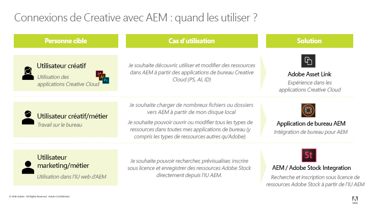

# [!DNL Adobe Experience Manager] et les meilleures pratiques d&#39; [!DNL Creative Cloud] intégration {#aem-and-creative-cloud-integration-best-practices}

[!DNL Adobe Experience Manager Assets] est une solution de gestion des actifs numériques (DAM) qui peut s&#39;intégrer [!DNL Adobe Creative Cloud] pour aider les utilisateurs de la gestion des actifs numériques à collaborer avec des équipes créatives, en rationalisant la collaboration dans le processus de création de contenu.

[!DNL Adobe Creative Cloud] offre aux équipes créatives un écosystème de solutions et de services pour leur permettre de créer des ressources numériques. It includes desktop and mobile applications, cloud services like storage with desktop sync or web experience, as well as marketplaces such as [!DNL Adobe Stock].

Lisez ce qui suit pour savoir quelles intégrations choisir entre poste de travail et DAM d’entreprise selon votre cas d’utilisation et découvrir quelles sont les meilleures pratiques associées aux workflows de connexion.

>[!NOTE]
>
>[!DNL Experience Manager] le partage de [!DNL Creative Cloud] dossiers est obsolète et n’est plus couvert par ce guide. Adobe recommande d’utiliser des fonctionnalités plus récentes, telles qu’ [Adobe Asset Link](https://helpx.adobe.com/fr/enterprise/using/adobe-asset-link.html) ou l’application [de bureau](https://docs.adobe.com/content/help/en/experience-manager-desktop-app/using/introduction.html) Experience Manager, afin de permettre à l’utilisateur créatif d’accéder aux ressources gérées dans [!DNL Experience Manager].

## Collaboration needs of creatives, marketers, and DAM users {#collaboration-needs-of-creatives-marketers-and-dam-users}

| Conditions requises | Cas d’utilisation | Surfaces impliquées |
|---|---|---|
| Simplifier l’expérience pour les créatifs utilisant un poste de travail | Streamline access to asset from a DAM ([!DNL Experience Manager Assets]) for creative professionals, or more broadly, users on desktop working in native asset creation applications. They need an easy and straightforward way to discover, use (open), edit and save changes to [!DNL Experience Manager], as well as upload new files. | Win or Mac desktop; [!DNL Creative Cloud] apps |
| Provide high-quality, ready-to-use assets from [!DNL Adobe Stock] | Les spécialistes marketing accélèrent le processus de création de contenu en contribuant à la recherche et à la découverte de ressources. Les créatifs utilisent les ressources approuvées directement dans leurs outils de création. | [!DNL Experience Manager Assets]; [!DNL Adobe Stock] marché ; Champs de métadonnées |
| Distribution et partage de ressources par sociétés | Les services internes/succursales locales et les partenaires externes, les distributeurs et les agences utilisent les ressources approuvées, partagées par la société mère. La société souhaite partager de manière sécurisée et transparente les ressources créées pour une réutilisation plus large. | Brand Portal, Asset Share Commons |

## Offres d’Adobe pour répondre aux besoins en matière de collaboration {#adobe-offerings-to-support-the-collaboration-need}

| Proposition de valeur pour les personnes impliquées | Offre d’Adobe | Surfaces impliquées |
|---|---|---|
| Creative users discover assets from [!DNL Experience Manager], open and use them, edit and upload changes to [!DNL Experience Manager], as well as upload new files into [!DNL Experience Manager], without leaving [!DNL Creative Cloud] apps. | [Adobe Asset Link](https://helpx.adobe.com/fr/enterprise/using/adobe-asset-link.html) | Photoshop, Illustrator et InDesign |
| Business users simplify opening and using assets, editing and uploading changes to [!DNL Experience Manager], and uploading new files into [!DNL Experience Manager] from the desktop environment. Ils utilisent une intégration générique pour ouvrir n’importe quel type de ressource dans l’application de bureau native, y compris les applications autres qu’Adobe. | [Application de bureau Experience Manager](https://docs.adobe.com/content/help/fr-FR/experience-manager-desktop-app/using/using.html) | [!DNL Experience Manager]Application de bureau sous Windows et Mac |
| Marketers and business users discover, preview, license and save, and manage the [!DNL Adobe Stock] assets from within [!DNL Experience Manager]. Licensed and saved assets provide select [!DNL Adobe Stock] metadata for better governance. | [Intégration d’Experience Manager et d’Adobe Stock](aem-assets-adobe-stock.md) | [!DNL Experience Manager] interface Web |

Cet article se concentre principalement sur les deux premiers aspects des besoins de collaboration. La distribution et la source des ressources à grande échelle sont brièvement mentionnées comme cas d’utilisation. Pour répondre à ces besoins, pensez à Adobe Brand Portal ou à Asset Share Commons. Alternate solutions such as [Brand Portal](https://helpx.adobe.com/fr/experience-manager/brand-portal/user-guide.html), solutions that can be built based on [Asset Share Commons](https://adobe-marketing-cloud.github.io/asset-share-commons/) components, [Link Share](/help/assets/link-sharing.md), using [Experience Manager Assets](/help/assets/managing-assets-touch-ui.md) should be reviewed based on specific requirement.

### Correspondance des cas d’utilisation aux solutions Adobe    {#mapping-of-use-cases-and-adobe-solutions}

| Exemple d’utilisation   | [!DNL Adobe Asset Link] | [!DNL Experience Manager] application de bureau | Remarques/autres solutions |
|---|---|---|---|
| Discover - parcourir les dossiers DAM | Oui | [!DNL Experience Manager] Interface Web et actions de bureau |  |
| Discover - Accès aux collections DAM | Oui | [!DNL Experience Manager] Interface Web et actions de bureau |  |
| Discover - Recherche de ressources à partir de DAM | Oui | [!DNL Experience Manager] Interface Web et actions de bureau |  |
| Utilisation - ouverture de la ressource | Oui | Oui | [Ouverture depuis l’interface web](managing-assets-touch-ui.md#previewing-assets) ou de l’outil de recherche |
| Utilisation : placer une ressource de DAM dans un document | Oui - incorporation | Oui - liaison ou incorporation | [!DNL Experience Manager]L’application de bureau donne accès aux ressources sous forme de fichiers sur le système de fichiers local. Ces liens dans les applications natives sont représentés par des chemins d’accès locaux. |
| Modification - ouvrir pour modification | Oui - Action d’extraction | Oui - Action d’ouverture (dans le partage réseau) | L’[extraction dans AAL](https://helpx.adobe.com/fr/enterprise/using/manage-assets-using-adobe-asset-link.html) enregistre la ressource dans le compte de stockage Creative Cloud de l’utilisateur (synchronisé par l’application Creative Cloud) par défaut. |
| Modifier : travail en cours en dehors de DAM | Oui - Ressource disponible dans le compte de stockage Creative Cloud de l’utilisateur synchronisé avec le poste de travail. | Oui |  |
| Modification - téléchargement des modifications | Oui - [Action d’archivage](https://helpx.adobe.com/fr/enterprise/using/manage-assets-using-adobe-asset-link.html) avec des commentaires facultatifs | Oui |  |
| Téléchargement - fichier unique | Oui - téléchargement du document actif | Oui | [Chargement via l’interface web](managing-assets-touch-ui.md#uploading-assets) |
| Téléchargement - plusieurs fichiers/structures de dossiers hiérarchiques | Non | Oui | [Chargement via l’interface web](managing-assets-touch-ui.md#uploading-assets) ou par le biais d’un script ou d’un outil personnalisé. |
| Divers - utilisateur et connexion | L’utilisateur Creative Cloud connecté à l’application de bureau Creative Cloud est reconnu (SSO) | [!DNL Experience Manager] informations d’identification et d’utilisateur | Users of both solutions count towards the [!DNL Experience Manager] user quota. |
| Divers - réseau et accès | Requires access from user&#39;s desktop to [!DNL Experience Manager] deployment over network | Requires access from user&#39;s desktop to [!DNL Experience Manager] deployment over network | [!DNL Adobe Asset Link] ne partage pas l&#39;environnement proxy réseau. |
| Divers - migration d’un grand nombre de ressources | Non | Non | [Guide de migration des ressources](assets-migration-guide.md) |

Pour prendre en charge les cas d’utilisation de la distribution des ressources, d’autres solutions doivent être envisagées :

* [Portail](https://helpx.adobe.com/fr/experience-manager/brand-portal/user-guide.html) de marque pour un module complémentaire SaaS configurable permettant [!DNL Experience Manager Assets] de publier des fichiers.
* Les solutions personnalisées sont créées à partir de la base de code [Asset Share Commons](https://adobe-marketing-cloud.github.io/asset-share-commons/).
* [!DNL Experience Manager][Partage de liens](/help/assets/link-sharing.md) pour partager des ressources ad hoc à l’aide de liens.
* [Interface](/help/assets/managing-assets-touch-ui.md) Web d’Experience Manager Assets avec des zones pour les parties externes sécurisées par la configuration [!DNL Experience Manager] du contrôle d&#39;accès et avec les ajustements nécessaires de la configuration informatique/réseau, donnant à ces utilisateurs externes l’accès à [!DNL Experience Manager].

## Concepts clés et cas d’utilisation {#key-concepts-and-use-cases}

### Glossaire des termes courants {#glossary-of-common-terms}

* **Travail en cours ou travail créatif en cours (WIP) :** phase dans le cycle de vie des ressources où une ressource est soumise à de multiples modifications et n’est généralement pas encore prête à être partagée avec les équipes élargies.
* **Fichiers prêts pour la création :** [!DNL Assets] qui sont prêts à être partagés avec une équipe plus large, ou qui ont été sélectionnés/approuvés par l’équipe créative pour le partage avec les équipes marketing ou LOB.
* **Approbation des ressources :** processus d’approbation traitant des ressources déjà transférées dans la gestion des ressources numériques, qui inclut généralement les approbations de marque, les validations juridiques, etc.
* **Ressource finale :** ressource qui a passé l’ensemble des      approbations/balisages de métadonnées et qui est prête à être utilisée par l’équipe élargie. Une telle ressource est stockée dans la gestion des ressources numériques et est accessible à tous les utilisateurs (ou à tous les utilisateurs intéressés). Il peut être utilisé dans les canaux marketing ou par des équipes créatives pour créer des conceptions.
* **Mise à jour/modification mineure des ressources :** modification rapide et petite d’une ressource numérique. Cette opération est souvent effectuée en réponse à une demande de retouche ou de modification mineure, de révision ou d’approbation de fichier (par exemple, repositionnement, modification de la taille du texte, ajustement de la saturation/luminosité, couleur, etc.).
* **Mise à jour/modification majeure des ressources :** modification d’une ressource numérique qui nécessite un travail considérable et qui doit parfois être effectuée sur une plus longue période de temps. Celle-ci implique généralement plusieurs modifications. La ressource doit être enregistrée plusieurs fois lors de la mise à jour. En règle générale, les mises à jour majeures de la ressource entraînent le passage à une étape en cours.
* **DAM :** gestion des ressources numériques (en anglais, Digital Asset Management). Dans ce document, il est synonyme de [!DNL Experience Manager Assets], sauf mention contraire.
* **Utilisateur créatif :** professionnel de la création, qui crée des ressources numériques à l’aide des applications et services Creative Cloud. Dans certains cas, un utilisateur créatif peut faire partie d’une équipe créative qui peut utiliser Creative Cloud, mais ne crée pas de ressources numériques (comme un directeur créatif ou un chef d’équipe créative).
* **Utilisateur de la gestion des ressources numériques :** utilisateur ordinaire d’un système de gestion des ressources numériques (DAM, Digital Asset Management). Selon l’organisation, l’utilisateur de gestion des ressources numériques peut être un utilisateur marketing ou non, par exemple, un utilisateur métier, un bibliothécaire, un commercial, etc.

### Remarques concernant l’utilisation [!DNL Experience Manager] et [!DNL Creative Cloud] l’intégration {#considerations-when-using-aem-and-creative-cloud-integration}

* See [desktop app best practices](https://docs.adobe.com/content/help/en/experience-manager-desktop-app/using/troubleshoot.html#best-practices-to-prevent-troubles)
* Voir Intégration [d’Adobe Stock.](aem-assets-adobe-stock.md)
* See [Adobe Asset Link](https://helpx.adobe.com/fr/enterprise/using/adobe-asset-link.html)

This is a brief summary of best practices for [!DNL Experience Manager] and [!DNL Creative Cloud] integration. Lisez la suite de ce document pour obtenir une description détaillée des points suivants.

* **Pour les utilisateurs créatifs, travaillant dans Photoshop, InDesign ou Illustrator :** Adobe Asset Link offre la meilleure expérience utilisateur, notamment une gestion propre des travaux en cours sur les ressources extraites [!DNL Experience Manager].
* **Pour simplifier l’accès aux ressources du bureau pour tout format de fichier ou application générique :** utilisez [!DNL Experience Manager] application de bureau.
* **Comprendre pourquoi et quand stocker des ressources dans DAM :** Mises à jour à mettre à la disposition de l’équipe au sens large de votre organisation.
* **Tenez compte du volume des ressources partagées :** si votre cas d’utilisation est la distribution des ressources, la gouvernance et la sécurité peuvent être les aspects les plus importants. Envisagez d’utiliser des outils conçus pour effectuer les tâches à grande échelle, comme Brand Portal.
* **Comprendre le cycle de vie des ressources :** comprenez la façon dont les ressources sont traitées par les différentes équipes au sein de votre organisation.
* **Gérer avec soin les enregistrements fréquents des ressources :** Adobe Asset Link s’en charge à votre place avec PS, IA, ID. Pour d’autres applications, ne conservez pas de tâches en cours dans le dossier mappé/partagé, sauf si vous avez besoin de toutes les modifications dans DAM.

### Accès aux [!DNL Adobe Stock] ressources à partir de [!DNL Assets] {#access-to-adobe-stock-assets-from-aem-assets}

[L’intégration](/help/assets/aem-assets-adobe-stock.md) d’Experience Manager et d’Adobe Stock permet [!DNL Experience Manager] aux utilisateurs de rechercher, de prévisualisation, de licence et d’enregistrer des ressources [!DNL Adobe Stock] dans [!DNL Experience Manager]. Licensed and saved [!DNL Stock] assets have selected [!DNL Stock] metadata, which can be used to search for them with extra filters.

Quelques points importants à savoir concernant cette intégration :

* When assets from Adobe stock are saved to [!DNL Experience Manager], they become a regular [!DNL Assets], with binary saved to the [!DNL Experience Manager] repository. Some metadata related to [!DNL Adobe Stock] are saved for the asset in [!DNL Experience Manager], otherwise the ingestion process looks the same as for any other file. Par exemple, si les balises dynamiques sont actives, les balises sont ajoutées à ces fichiers lors de l’enregistrement.
* The asset saved to [!DNL Experience Manager] is a copy, not a link back into [!DNL Adobe Stock].

**Utilisation de ressources enregistrées depuis[!DNL Adobe Stock]vers[!DNL Experience Manager]dans[!DNL Creative Cloud]**. Cette intégration est indépendante de[!DNL Adobe Asset Link], mais[!DNL Adobe Asset Link]reconnaît ces ressources enregistrées de[!DNL Stock]cette manière et affiche des métadonnées et des icônes supplémentaires sur ces ressources dans l’interface utilisateur de[!DNL Stock]l’extension dans[!DNL Adobe Asset Link],[!DNL Photoshop][!DNL Illustrator]ou .[!DNL InDesign]Les fichiers peuvent être parcourus, ouverts, etc., car il s’agit de ressources normales lorsqu’ils sont enregistrés dans[!DNL Experience Manager].
Creative users working in[!DNL Creative Cloud]apps with[!DNL Adobe Asset Link]extension present, in addition to having access to already-licensed assets from[!DNL Adobe Stock]into[!DNL Experience Manager], can also use[!DNL Creative Cloud]Libraries panel to search, preview, and license[!DNL Adobe Stock]assets.[!DNL Assets]de[!DNL Adobe Stock]licence et enregistrés dans[!DNL Experience Manager]deviennent disponibles pour les équipes plus larges accédant au[!DNL Experience Manager Assets]déploiement, tandis que les créatifs qui accordent des licences à des ressources à partir du panneau[!DNL Adobe Stock]Bibliothèques les rendent disponibles uniquement par défaut dans leur[!DNL Creative Cloud][!DNL Creative Cloud]compte.

<!-- 
TBD: A condensed version of the below content is better placed in the Adobe DAM article.
-->

## À propos du stockage de ressources dans un système de gestion des ressources numériques {#about-storing-assets-in-a-dam}

Pour établir un workflow efficace entre les équipes créatives et marketing/métier, et sélectionner les meilleures fonctionnalités de prise en charge, il est important de comprendre quand et pourquoi les ressources sont stockées dans la gestion des ressources numériques.

### Pourquoi les ressources sont-elles stockées dans la gestion des ressources numériques ?    {#why-assets-are-stored-in-dam}

Le stockage des ressources dans la gestion des ressources numériques permet d’en faciliter l’accès et de les retrouver plus aisément. Cela garantit que les ressources peuvent être exploitées par de nombreux utilisateurs au sein de votre organisation ou écosystème, qui comprend les partenaires, les clients, etc.

Most organizations choose to only store assets that are relevant to the downstream marketing/LOB processes (publishing to channels like web channel via [!DNL Experience Manager Sites] or other channels served by Adobe Experience Cloud - Marketing Cloud, Advertising Cloud, and measured by Analytics Cloud, providing to users/partners, and so on). En outre, les entreprises stockent les ressources qui peuvent être soumises à un processus de révision/approbation dans la gestion des ressources numériques. De cette manière, la gestion des ressources numériques stocke principalement les ressources ayant de grandes chances d’être exploitées, en évitant de stocker les ressources inactives.

Le stockage des ressources est soumis à des considérations techniques et d’utilisation des ressources. La gestion des ressources numériques fournit des services supplémentaires pour les ressources stockées, notamment l’extraction de métadonnées, le contrôle de versions, la génération d’aperçus/de transcodage, la gestion des références et l’ajout d’informations de contrôle d’accès. Ces services utilisent davantage de temps et de ressources de votre infrastructure.

Souvent, le stockage de toutes les ressources et mises à jour n’est pas souhaitable. Par exemple, si les mises à jour de ressources spécifiques sont de mauvaise qualité et utilisent les ressources en excès, les ressources peuvent être stockées dans la gestion des ressources numériques.

#### Quand les ressources sont-elles stockées dans la gestion des ressources numériques ?    {#when-assets-are-stored-in-dam}

Les équipes créatives (et les organisations) ne sont généralement pas intéressées par le stockage des ressources à chaque étape de leur cycle de vie. Par exemple, elles évitent de stocker des ressources dans les cas suivants :

* Si les ressources doivent être finalisées ou sont soumises à expérimentation.
* Si les ressources ne passent pas le cycle de révision de l’équipe interne/créative.
* L’équipe dispose de ressources plus pertinentes que celle en question pour présenter son travail à des équipes externes.

En règle générale, les classes de ressources suivantes sont stockées dans la gestion des ressources numériques :

* Les ressources ayant atteint une certaine maturité et que l’on estime prêtes à être partagées.
* Les ressources qui ont été présélectionnées par l’équipe créative.
* Les formats de ressources spécifiques qui sont utilisables ou demandés par le marketing, selon un contrat ou un accord spécifique (par exemple, des fichiers JPG convertis à partir de fichiers RAW, des TIFF/images à partir d’originaux PSD).

#### Quand les mises à jour de ressources sont-elles stockées dans la gestion des ressources numériques ?    {#when-updates-to-assets-are-stored-in-dam}

En règle générale, seules les mises à jour des ressources pertinentes pour un large ensemble d’utilisateurs de la gestion des ressources numériques doivent être stockées dans la gestion des ressources numériques. Cela garantit que les utilisateurs (marketing et fonctions similaires) voient uniquement les versions appropriées dans la chronologie des ressources de la gestion des ressources numériques.

Généralement, il s’agit des modifications en rapport avec les principaux jalons dans le cycle de vie des ressources. Par exemple, la ressource initiale prête pour les spécialistes marketing ou une mise à jour officielle basée sur une demande/révision fournie par l’équipe créative doit être enregistrée et versionnée dans la gestion des ressources numériques.

Il peut s’agir, par exemple, d’une mise à jour de l’équipe créative pour révision par l’équipe marketing après une demande de modification de la ressource existante dans la gestion des ressources numériques. Elle doit être stockée et versionnée dans la gestion des actifs numériques à des fins de référence ou pour revenir à la version précédente.

Voici quelques exemples de mises à jour qui ne sont généralement pas pertinentes :

* Les premières versions des ressources transférées avant qu’elles ne soient prêtes pour révision par le marketing
* Les modifications fréquentes de la ressource par l’équipe créative pendant la phase de travail en cours et avant que l’équipe créative ne décide que la ressource est prête

### Accès des utilisateurs à la gestion des ressources numériques {#user-access-to-dam}

[!DNL Assets] prend en charge deux types d’utilisateurs en fonction de leur accès au [!DNL Assets] déploiement. En règle générale, les utilisateurs à l’intérieur du réseau d’entreprise (pare-feu) ont un accès direct à la gestion des ressources numériques. Les autres utilisateurs à l’extérieur du réseau d’entreprise n’auront pas d’accès direct. Le type d’utilisateur détermine les intégrations qui peuvent être utilisées du point de vue technique.

#### Utilisateurs créatifs avec un accès direct à la gestion des ressources numériques    {#creative-users-with-direct-access-to-dam}

Typically, in-house creative teams or agencies/creative professionals  onboarded  to the internal network have access to the DAM instance, including [!DNL Experience Manager] login. [!DNL Experience Manager] et l&#39;infrastructure réseau peut être mise en place pour permettre un accès direct à des parties externes - généralement des organisations de confiance comme des agences travaillant pour un client - pour avoir accès à [!DNL Experience Manager] via le réseau, par exemple via VPN ou la liste blanche IP.

In such cases, Adobe Asset Link or [!DNL Experience Manager] desktop app helps provide easy access to final/approved assets and lets you save creative-ready assets to DAM.

#### Utilisateurs créatifs sans accès à la gestion des ressources numériques {#creative-users-without-access-to-dam}

Les agences externes et les indépendants sans accès direct à l’instance de la gestion des ressources numériques peuvent avoir besoin de l’accès aux ressources approuvées ou souhaiter ajouter leurs nouvelles créations dans la gestion des ressources numériques.

Utilisez les stratégies suivantes pour fournir un accès aux ressources finales/approuvées :

* Utilisez l’application de bureau si Asset Link ne fonctionne pas.
* Use [Experience Manager Assets Brand Portal](https://helpx.adobe.com/fr/experience-manager/brand-portal/user-guide.html) for distributing assets securely to external partners
* Utilisez une implémentation personnalisée d’un portail de distribution et de source basé sur [Asset Share Commons](https://adobe-marketing-cloud.github.io/asset-share-commons/)
* Use Access Control set up in [!DNL Experience Manager] and necessary network infrastructure (for example, VPN and IP whitelisting) to give external parties access to a dedicated area of content in your DAM. They can use [!DNL Experience Manager] Web UI to get assets and upload new content into your DAM.

#### Work in progress on assets from [!DNL Experience Manager] {#work-in-progress-on-assets-from-aem}

As discussed in this document, it is recommended to carry out major updates on assets, sometimes called work in progress, without having all the edits saved to the local file also uploaded to [!DNL Experience Manager] as changes. Cela accélère le travail d’un utilisateur sur poste de travail, limite la bande passante réseau utilisée et maintient le calendrier des ressources ciblé sur les mises à jour majeures et contrôlées.

Adobe Asset Link est adapté à cas d’utilisation :

* Lorsque les utilisateurs de Photoshop, InDesign ou Illustrator souhaitent modifier un fichier, ils effectuent une opération d’extraction sur la ressource donnée.
* The asset is downloaded in background, put into users Creative Cloud account synchronized to disk by Creative Cloud desktop app, and the check-out flag is toggled in [!DNL Experience Manager] on the asset to minimize editing conflicts
* À ce stade, l’utilisateur utilise un fichier stocké localement dans l’emplacement synchronisé et peut continuer à travailler et à enregistrer les modifications nécessaires selon la fréquence nécessaire.
* De plus, comme la ressource figure dans le compte Creative Cloud, elle est également disponible sur d’autres appareils appartenant à l’utilisateur (par exemple, elle peut être ouverte ou modifiée dans une application mobile Creative Cloud dédiée) et peut être partagée avec d’autres utilisateurs Creative Cloud à des fins de collaboration.
* Lorsque l’utilisateur créatif a terminé d’apporter des modifications, il peut effectuer une opération d’archivage sur ce fichier dans son application Creative Cloud, en fournissant un commentaire facultatif. The corresponding asset in [!DNL Experience Manager] are versioned and updated to with the new binary. [!DNL Experience Manager] les utilisateurs tels que les marketeurs ou les utilisateurs de la liste d’attente ont accès à des modifications majeures de ressources, ou à des jalons, via l’interface utilisateur de la chronologie des [!DNL Experience Manager] ressources.

[!DNL Experience Manager]L’application de bureau propose un partage réseau pour les ressources ouvertes dans l’application native. By default, all the changes done locally are uploaded to [!DNL Experience Manager] automatically after a brief while. With such a configuration, frequent saves during the work-in-progress phase would all be uploaded into [!DNL Experience Manager] and versioned, creating a lot of network traffic and potential scalability challenges - not to mention unnecessary versions in [!DNL Experience Manager].

The recommended approach here is to use an option in [!DNL Experience Manager] desktop app to turn off automated updates, and upload changes to assets to [!DNL Experience Manager] manually, leveraging the upload changes action in the app&#39;s Asset Status UI.

#### Chargement en masse dans DAM {#bulk-upload-to-dam}

Dans certains cas, il est possible que vous deviez télécharger simultanément un plus grand nombre de fichiers dans la gestion des actifs numériques, par exemple :

* Transfert des résultats de    photoshoots ou projets de plus grande envergure
* Chargement de ressources fournies par les agences de création
* Transfert de ressources sélectionnées à partir d’un plus grand ensemble si la sélection est effectuée en dehors de la gestion des ressources numériques

La description fait référence au téléchargement de fichiers de manière opérationnelle (par exemple, toutes les semaines ou avec chaque prise de vue), en tant que partie normale du processus de l’utilisateur de bureau. Les migrations de ressources de grande taille ne sont pas abordées ici.

Vous pouvez utiliser les fonctionnalités de transfert suivantes :

* To upload large/hierarchical folders in bulk, use [!DNL Experience Manager] desktop app that provides [folder upload](https://helpx.adobe.com/fr/experience-manager/desktop-app/aem-desktop-app.html#bulkupload) functionality. Vous pouvez également transférer des structures de dossiers hiérarchiques. [!DNL Assets] sont téléchargés en arrière-plan et, par conséquent, ils ne sont pas liés à une session de navigateur Web.
* To upload a few files from a single folder, drag the files directly to the web interface or use the Create option in the [!DNL Assets] web interface.
* En fonction des besoins de votre entreprise, vous pouvez également utiliser un outil de chargement personnalisé.

#### Manage digital assets directly from desktop {#managing-digital-assets-directly-from-desktop}

If you use Network File Shares to manage digital assets, just using the network share mapped by [!DNL Experience Manager] desktop app could be seen as a convenient substitute. When transitioning from network file shares, [!DNL Experience Manager] web interface provides a rich set of Digital Asset Management capabilities that go well beyond what is possible on a network share (search, collections, metadata, collaboration, previews, and so on), and [!DNL Experience Manager] desktop app provides a handy link to connect the server-side DAM repository with the work on desktop.

Avoid using [!DNL Experience Manager] desktop app to manage assets directly in the network share of [!DNL Assets]. For example, avoid using [!DNL Experience Manager] desktop app to move/copy multiple files. Instead, use the [!DNL Assets] interface to drag folders from Finder/Explorer to the network share or use the [!DNL Assets] Folder Upload feature.

#### Migration de ressources {#asset-migration}

Pour planifier et exécuter des migrations de ressources depuis le système existant vers un nouveau système ou effectuer une migration d’un gros volumes de ressources stockées sur les serveurs, consultez le [Guide de migration](/help/assets/assets-migration-guide.md). [!DNL Experience Manager] les applications de bureau et [!DNL Experience Manager] [!DNL Creative Cloud] les intégrations ne prennent pas en charge de telles migrations. En raison des grands volumes de ressources à assimiler et des exigences supplémentaires en termes de mappage, de transformation et d’intégration des métadonnées, les migrations doivent être gérées à l’aide d’outils et d’approches différents.

>[!MORELIKETHIS]
>
>* [Adobe Asset Link](https://helpx.adobe.com/in/enterprise/using/adobe-asset-link.html)
>* [Meilleures pratiques pour les applications de bureau Experience Manager](https://docs.adobe.com/content/help/en/experience-manager-desktop-app/using/archive/best-practices-for-v1.html)
>* [Portail de marques Experience Manager](https://docs.adobe.com/content/help/en/experience-manager-brand-portal/using/introduction/brand-portal.html)
>* [Intégration d’Experience Manager et d’Adobe Stock](aem-assets-adobe-stock.md)

