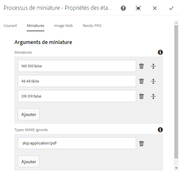
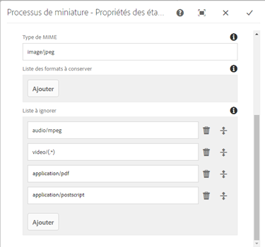
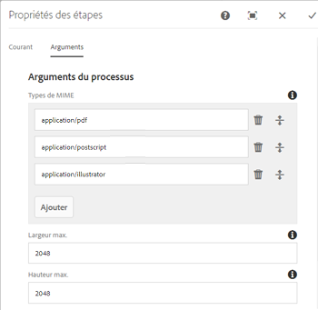
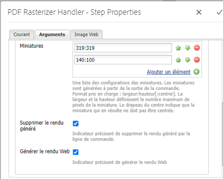
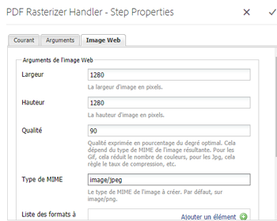
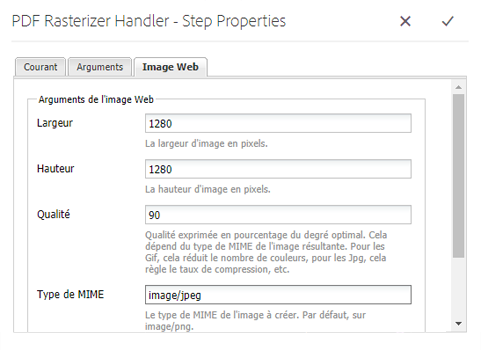

# Utilisation de PDF Rasterizer {#using-pdf-rasterizer}

When you upload large, content-intensive PDF or AI files to [!DNL Adobe Experience Manager Assets], the default conversion may not generate an accurate output. La bibliothèque Adobe PDF Rasterizer peut générer une sortie plus fiable et plus précise que la sortie d’une bibliothèque par défaut. Adobe recommande d’utiliser la bibliothèque PDF Rasterizer pour les scénarios suivants :

* Fichiers AI ou PDF lourds et intensifs en contenu.
* Fichiers AI et fichiers PDF contenant des miniatures qui ne sont pas générés par défaut.
* Fichiers AI contenant des couleurs PMS (Pantone Matching System).

Les miniatures et les aperçus générés à l’aide de PDF Rasterizer sont d’une plus grande qualité par rapport à la sortie native et fournissent donc une expérience d’affichage homogène sur tous les périphériques. La bibliothèque PDF Rasterizer d’Adobe ne prend en charge aucune conversion d’espace colorimétrique. Elle génère toujours une sortie RVB indépendamment de l’espace colorimétrique du fichier source.

1. Installez le package PDF Rasterizer sur votre [!DNL Adobe Experience Manager] déploiement à partir de [Software Distribution](https://experience.adobe.com/#/downloads/content/software-distribution/en/aem.html?package=/content/software-distribution/en/details.html/content/dam/aem/public/adobe/packages/cq640/product/assets/aem-assets-pdf-rasterizer-pkg).

   >[!NOTE]
   >
   >La bibliothèque PDF Rasterizer est disponible sous Windows et Linux uniquement.

1. Accédez à la console [!DNL Assets] de processus à l’adresse `https://[aem_server]:[port]/workflow`. Open [!UICONTROL DAM Update Asset] workflow.

1. Pour empêcher la génération de miniatures et de rendus Web pour les fichiers PDF et AI à l’aide des méthodes par défaut, procédez comme suit :

   * Open the **[!UICONTROL Process Thumbnails]** step, and add `application/pdf` or `application/postscript` in the **[!UICONTROL Skip Mime Types]** field under the **[!UICONTROL Thumbnails]** tab as necessary.

   

   * In the **[!UICONTROL Web Enabled Image]** tab, add `application/pdf` or `application/postscript` under **[!UICONTROL Skip List]** depending upon your requirements.

   

1. Open the **[!UICONTROL Rasterize PDF/AI Image Preview Rendition]** step, and remove the MIME type for which you want to skip the default generation of preview image renditions. For example, remove the MIME type `application/pdf`, `application/postscript`, or `application/illustrator` from the **[!UICONTROL MIME Types]** list.

   

1. Faites glisser l’étape **[!UICONTROL Gestionnaire PDF Rasterizer]** à partir du panneau latéral et déposez-le en dessous de l’étape **[!UICONTROL Miniatures des processus]**.
1. Configure the following arguments for the **[!UICONTROL PDF Rasterizer Handler]** step:

   * Types MIME : `application/pdf` ou `application/postscript`
   * Commandes: `PDFRasterizer -d -p 1 -s 1280 -t PNG -i ${file}`
   * Ajoutez les tailles des miniatures : 319:319, 140:100, 48:48. Ajoutez une configuration de miniature personnalisée, si nécessaire.

   Voici des arguments de ligne de commande de la commande `PDFRasterizer` :

   * `-d`: Indicateur qui permet le rendu lisse du texte, des illustrations vectorielles et des images. Crée des images de meilleure qualité. Toutefois, l’ajout de ce paramètre ralentit l’exécution de la commande et augmente la taille des images.

   * `-p`: Numéro de page. La valeur par défaut est toutes les pages. Pour représenter toutes les pages, utilisez `*`.

   * `-s`: Dimension d’image maximale (hauteur ou largeur). Elle est convertie en ppp pour chaque page. Si les pages sont de tailles différentes, chacune peut être redimensionnée selon une échelle différente. La valeur par défaut est la taille réelle de la page.

   * `-t`: Type d’image de sortie. Les types valides sont JPEG, PNG, GIF et BMP. La valeur par défaut est JPEG.

   * `-i`: Chemin d’accès pour l’entrée PDF. Ce paramètre est obligatoire.

   * `-h`: Aide

1. Pour supprimer des rendus intermédiaires, sélectionnez **[!UICONTROL Supprimer le rendu généré]**.

1. To let PDF Rasterizer generate web renditions, select **[!UICONTROL Generate Web Rendition]**.

   

1. Specify the settings in the **[!UICONTROL Web Enabled Image]** tab.

   

1. Enregistrez le workflow.

1. To enable PDF Rasterizer to process PDF pages with PDF libraries, open the **[!UICONTROL DAM Process Subasset]** model from the [!UICONTROL Workflow] console.

1. From the side panel, drag the PDF Rasterizer Handler step under the **[!UICONTROL Create Web-Enabled Image Rendition]** step.

1. Configure the following arguments for the **[!UICONTROL PDF Rasterizer Handler]** step:

   * Types MIME : `application/pdf` ou `application/postscript`

   * Commandes: `PDFRasterizer -d -p 1 -s 1280 -t PNG -i ${file}`
   * Add thumbnail sizes: `319:319`, `140:100`, `48:48`. Ajoutez la configuration personnalisée des miniatures, le cas échéant.

   Voici des arguments de ligne de commande de la commande `PDFRasterizer` :

   * `-d`: Indicateur qui permet le rendu lisse du texte, des illustrations vectorielles et des images. Crée des images de meilleure qualité. Toutefois, l’ajout de ce paramètre ralentit l’exécution de la commande et augmente la taille des images.

   * `-p`: Numéro de page. La valeur par défaut est toutes les pages. `*` indique toutes les pages.

   * `-s`: Dimension d’image maximale (hauteur ou largeur). Elle est convertie en ppp pour chaque page. Si les pages sont de tailles différentes, chacune peut être redimensionnée selon une échelle différente. La valeur par défaut est la taille réelle de la page.

   * `-t`: Type d’image de sortie. Les types valides sont JPEG, PNG, GIF et BMP. La valeur par défaut est JPEG.

   * `-i`: Chemin d’accès pour l’entrée PDF. Ce paramètre est obligatoire.

   * `-h`: Aide

1. Pour supprimer des rendus intermédiaires, sélectionnez **[!UICONTROL Supprimer le rendu généré]**.
1. To let PDF Rasterizer generate web renditions, select **[!UICONTROL Generate Web Rendition]**.

   

1. Specify the settings in the **[!UICONTROL Web Enabled Image]** tab.

   

1. Enregistrez le workflow.
1. Upload a PDF or an AI file to [!DNL Experience Manager Assets]. PDF Rasterizer génère les miniatures et les rendus web pour le fichier.
