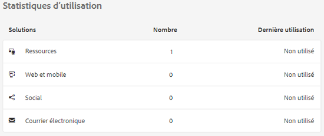
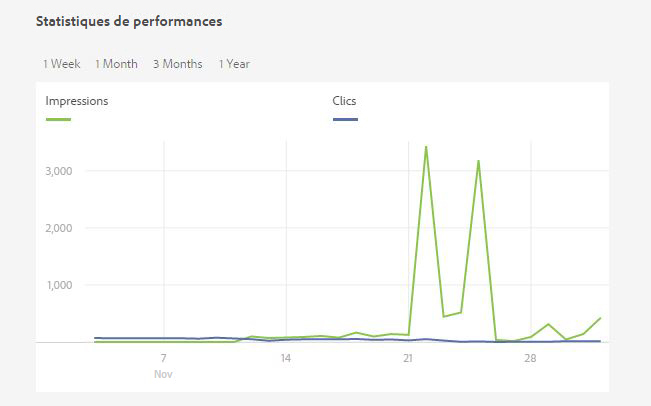
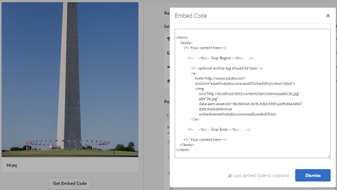

# Statistiques sur les ressources {#asset-insights}

La fonction Statistiques sur les ressources vous permet d’effectuer le suivi des évaluations des utilisateurs et des statistiques d’utilisation des images utilisées dans les sites web tiers, les campagnes marketing et les solutions de création d’Adobe. Elle permet d’extraire les statistiques sur leurs performances et leur popularité.

[!DNL Assets] Insights capture les détails de l’activité des utilisateurs, tels que le nombre de fois où une image est notée, sur laquelle les utilisateurs cliquent et les impressions (nombre de fois où une image est chargée sur le site Web). Elle attribue des scores aux images en fonction de ces statistiques. Vous pouvez utiliser les scores et les statistiques de performances pour sélectionner les images populaires à inclure dans les catalogues, les campagnes marketing et ainsi de suite. Vous pouvez même formuler des stratégies de renouvellement de licence et d’archivage en fonction de ces statistiques.

Pour [!DNL Assets] statistiques d’utilisation des images d’un site Web, vous devez inclure le code incorporé de l’image dans le code du site Web.

Pour permettre aux statistiques sur les ressources d’afficher les statistiques d’utilisation des ressources, commencez par configurer la fonction afin qu’elle récupère les données de rapports d’Adobe Analytics. Pour plus d’informations, consultez la section [Configuration des statistiques sur les ressources](/help/assets/configure-asset-insights.md).

>[!NOTE]
>
>Les statistiques sont uniquement prises en charge et fournies pour les images.

## Affichage des statistiques pour une image {#viewing-statistics-for-an-image}

Vous pouvez afficher les scores de statistiques sur les ressources à partir de la page des métadonnées.

1. Dans l&#39;interface utilisateur [!DNL Assets], sélectionnez l&#39;image, puis cliquez sur **[!UICONTROL Propriétés]** dans la barre d&#39;outils.
1. Sur la page Propriétés, cliquez sur l’onglet **[!UICONTROL Statistiques]**.
1. Consultez les détails d’utilisation de la ressource dans l’onglet **[!UICONTROL Statistiques]**. La section **[!UICONTROL Score]** indique les scores totaux d’utilisation et de performances d’une ressource.

   Le score d’utilisation indique le nombre de fois que la ressource est utilisée dans diverses solutions.

   Le score **[!UICONTROL Impressions]** correspond au nombre de fois que la ressource est chargée sur le site web. Le nombre affiché sous **[!UICONTROL Clics]** représente le nombre de fois que la ressource est cliquée.

1. Passez en revue la section **[!UICONTROL Statistiques d’utilisation]** pour savoir de quelles entités la ressource faisait partie et dans quelles solutions de création elle a récemment été utilisée. Plus l’utilisation est élevée, plus la ressource a de chances d’être populaire auprès des utilisateurs. Les données d’utilisation s’affichent sous les sections suivantes :

   * **Ressource** : nombre de fois où la ressource faisait partie d’une collection ou d’une ressource composite
   * **Web et mobile** : nombre de fois où la ressource faisait partie de sites web et d’applications
   * **Social** : nombre de fois où la ressource a été utilisée dans des solutions, comme Adobe Social et Adobe Campaign
   * **Email** : nombre de fois où la ressource a été utilisée dans des campagnes par email

   

   >[!NOTE]
   >
   >La fonctionnalité Statistiques des ressources récupérant généralement les données Solutions d’Adobe Analytics de manière périodique, la section Solutions n’affiche peut-être pas les données les plus récentes. La période pendant laquelle les données sont affichées dépend de la planification de l’opération de récupération que la fonction Statistiques sur les ressources exécute pour récupérer les données d’Analytics.

1. Pour afficher les statistiques de performances de l’actif sous forme graphique sur une période donnée, sélectionnez une période dans la section **[!UICONTROL Statistiques de performances]**. Les détails, y compris les clics et les impressions, sont affichés sous forme de lignes de tendance dans un graphique.

   

   >[!NOTE]
   >
   >Contrairement à la section Solutions, la section Statistiques de performances affiche les données les plus récentes.

1. Pour obtenir le code incorporé de la ressource que vous incluez dans les sites Web afin d’obtenir des données de performances, cliquez sur **[!UICONTROL Obtenir le code incorporé]** sous la miniature de la ressource. Pour plus d’informations sur la manière d’inclure votre code incorporé dans des pages Web tierces, voir [Utilisation du suivi de page et du code incorporé dans les pages Web](/help/assets/use-page-tracker.md).

   

## Affichage des statistiques générales pour les images {#viewing-aggregate-statistics-for-images}

Vous pouvez afficher les scores de toutes les ressources d’un dossier simultanément à l’aide du **[!UICONTROL mode Statistiques]**.

1. Dans l&#39;interface utilisateur [!DNL Assets], accédez au dossier contenant les ressources pour lesquelles vous souhaitez vue des informations.
1. Cliquez sur Disposition dans la barre d’outils, puis sélectionnez **[!UICONTROL Vue d’informations]**.
1. La page affiche les scores d’utilisation pour les ressources. Comparez les évaluations des différentes ressources et tirez-en des conclusions.

## Planification d’une tâche en arrière-plan {#scheduling-background-job}

La fonction Statistiques sur les ressources extrait les données d’utilisation des ressources à partir de suites de rapports Adobe Analytics de manière périodique. Par défaut, la fonction Statistiques sur les ressources exécute une tâche en arrière-plan toutes les 24 heures à 2 heures du matin pour récupérer les données. Cependant, vous pouvez modifier la fréquence et l’heure en configurant le service de **[!UICONTROL tâche de synchronisation de rapport de performances de ressource Adobe CQ DAM]** via la console web.

1. Cliquez sur le logo [!DNL Experience Manager] et accédez à **[!UICONTROL Outils]** > **[!UICONTROL Opérations]** > **[!UICONTROL Console Web]**.
1. Ouvrez la configuration de service **[!UICONTROL Tâche de synchronisation des rapports sur les performances des ressources de la gestion des actifs numériques Adobe CQ]**.

   

1. Spécifiez la fréquence du planificateur et l’heure de début désirées pour la tâche dans l’expression de planificateur de propriété. Enregistrez les modifications.
