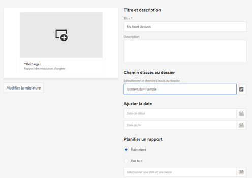

# Rapports de ressources {#asset-reports}

| Version | Lien de l’article |
| -------- | ---------------------------- |
| AEM as a Cloud Service | [Cliquez ici](https://experienceleague.adobe.com/docs/experience-manager-cloud-service/content/assets/admin/asset-reports.html?lang=fr) |
| AEM 6.5 | Cet article |

Les rapports de ressources vous permettent d’évaluer l’utilité de votre déploiement [!DNL Adobe Experience Manager Assets]. Avec [!DNL Assets], vous pouvez générer divers rapports pour vos ressources numériques. Les rapports fournissent des informations utiles concernant votre utilisation du système, la façon dont les utilisateurs et utilisatrices interagissent avec les ressources et les ressources téléchargées et partagées.

Utilisez les informations figurant dans les rapports de manière à obtenir des mesures de succès essentielles pour évaluer l’adoption d’[!DNL Assets] au sein de votre entreprise et par les clients.

Le framework de création de rapports [!DNL Assets] exploite des tâches [!DNL Sling] de façon à traiter de manière asynchrone les demandes de rapports en respectant l’ordre. Il est extensible pour les référentiels de grande taille. Le traitement asynchrone des rapports augmente l’efficacité et la vitesse de génération des rapports.

L’interface de gestion des rapports est intuitive et contient des options et des contrôles précis pour accéder aux rapports archivés et afficher les statuts d’exécution des rapports (succès, échec et mise en file d’attente).

Lorsqu’un rapport est généré, vous en êtes informé par un e-mail (facultatif) et une notification dans votre boîte de réception. Vous pouvez afficher, télécharger ou supprimer un rapport de la page de liste des rapports, où tous les rapports précédemment générés sont affichés.

## Prérequis {#prerequisite-for-reporting}

Pour générer des rapports, procédez comme suit :

* Activez le service [!UICONTROL Enregistreur d’événement de gestion des ressources numériques Day CQ] à partir de **[!UICONTROL Outils]** > **[!UICONTROL Opérations]** > **[!UICONTROL Console Web]**.
* Sélectionnez les activités ou les événements sur lesquels vous souhaitez créer des rapports. Par exemple, pour générer un rapport sur les ressources téléchargées, sélectionnez [!UICONTROL Ressource téléchargée (TÉLÉCHARGÉE)].

## Génération de rapports {#generate-reports}

[!DNL Experience Manager Assets] génère les rapports standard suivants :

* Chargement
* Téléchargement
* Expiration
* Modification
* Publication
* Publier sur [!DNL Brand Portal]
* Utilisation du disque
* Fichiers
* Partage de liens

Les administrateurs d’[!DNL Adobe Experience Manager] peuvent facilement générer et personnaliser ces rapports pour votre implémentation. Un administrateur peut procéder comme suit pour générer un rapport :

1. Dans l’interface [!DNL Experience Manager], cliquez sur **[!UICONTROL Outils]** > **[!UICONTROL Ressources]** > **[!UICONTROL Rapports]**.

   

1. Sur la page [!UICONTROL Rapports de ressources], cliquez sur **[!UICONTROL Créer]** dans la barre d’outils.
1. Sur la page **[!UICONTROL Créer un rapport]**, sélectionnez le rapport que vous souhaitez créer, puis cliquez sur **[!UICONTROL Suivant]**.

   

   >[!NOTE]
   >
   >Par défaut, les fragments de contenu et les partages de lien sont inclus dans le rapport [!UICONTROL Ressource téléchargée]. Sélectionnez l’option appropriée pour créer un rapport de partages de lien ou pour exclure les fragments de contenu du rapport de téléchargement.

   >[!NOTE]
   >
   >Le rapport [!UICONTROL Télécharger] affiche uniquement les détails des ressources téléchargées après sélection individuelle ou téléchargées à l’aide de l’action rapide. Cependant, il n’inclut pas les détails des ressources figurant dans un dossier téléchargé.

1. Configurez les détails du rapport, tels que le titre, la description, la miniature et le chemin du dossier dans le référentiel CRX où le rapport est stocké. Par défaut, le chemin du dossier est `/content/dam`. Vous pouvez spécifier un autre chemin.

   

   Sélectionnez la période de votre rapport.

   Vous pouvez choisir de générer le rapport maintenant ou à une date et une heure ultérieures.

   >[!NOTE]
   >
   >Si vous choisissez de planifier le rapport à une date ultérieure, veillez à spécifier la date et l’heure dans les champs Date et Heure. Si vous ne spécifiez aucune valeur, le moteur de création de rapports traite le rapport comme devant être généré immédiatement.

   Les champs de configuration peuvent varier en fonction du type de rapport que vous créez. Par exemple, le rapport **[!UICONTROL Utilisation du disque]** fournit des options pour inclure les rendus de ressources lors du calcul de l’espace disque utilisé par les ressources. Vous pouvez choisir d’inclure ou d’exclure les ressources figurant dans les sous-dossiers pour le calcul de l’utilisation du disque.

   >[!NOTE]
   >
   >Le rapport **[!UICONTROL Utilisation du disque]** n’inclut pas les champs de période, car il indique uniquement l’utilisation actuelle de l’espace disque.

   

   Lorsque vous créez le rapport **[!UICONTROL Fichiers]**, vous pouvez inclure/exclure les sous-dossiers. Cependant, vous ne pouvez pas inclure les rendus de ressources dans ce rapport.

   

   Le rapport **[!UICONTROL Partage de liens]** affiche les URL des ressources qui sont partagées avec des utilisateurs externes à partir d’[!DNL Assets]. Celui-ci comprend les ID de courrier électronique de l’utilisateur qui a partagé les ressources, les ID de courrier électronique des utilisateurs avec lesquels les ressources sont partagées, la date de partage et la date d’expiration du lien. Les colonnes ne sont pas personnalisables.

   Le rapport **[!UICONTROL Partage de liens]** n’inclut pas d’options pour les sous-dossiers et les rendus, car il ne publie que les URL partagées qui apparaissent sous `/var/dam/share`.

   

1. Cliquez sur **[!UICONTROL Suivant]** dans la barre d’outils.

1. Sur la page **[!UICONTROL Configurer les colonnes]**, certaines colonnes sont sélectionnées pour apparaître dans le rapport par défaut. Vous pouvez sélectionner plus de colonnes. Annulez la sélection d’une colonne pour l’exclure dans le rapport.

   

   Pour afficher un chemin de propriété ou un nom de colonne personnalisé, configurez les propriétés du binaire de ressource sous le nœud `jcr:content` dans CRX. Vous pouvez également l’ajouter dans le sélecteur de chemin de propriété.

   

1. Cliquez sur **[!UICONTROL Créer]** dans la barre d’outils. Un message indique que la génération du rapport a été lancée.
1. Sur le [!UICONTROL Rapports de ressources] , l’état de génération de rapport est basé sur l’état actuel de la tâche de rapport, par exemple : [!UICONTROL Succès], [!UICONTROL En échec], [!UICONTROL En file d&#39;attente], ou [!UICONTROL Planifié]. Le même état s’affiche dans la boîte de réception des notifications. Pour afficher la page du rapport, cliquez sur le lien du rapport. Vous pouvez également sélectionner le rapport et cliquer sur **[!UICONTROL Afficher]** dans la barre d’outils.

   <!---->
   [État du rapport](assets/report-status.JPG)

   Cliquez sur **[!UICONTROL Télécharger]** dans la barre d’outils pour télécharger le rapport au format CSV.

## Ajout de colonnes personnalisées  {#add-custom-columns}

Vous pouvez également ajouter des colonnes personnalisées à ces rapports pour adapter l’affichage des données à vos besoins :

* Chargement
* Téléchargement
* Expiration
* Modification
* Publication
* Publier sur [!DNL Brand Portal]
* Fichiers

Pour ajouter des colonnes personnalisées à ces rapports, procédez comme suit :

1. Dans le [!DNL Manager interface], cliquez sur **[!UICONTROL Outils]** > **[!UICONTROL Ressources]** > **[!UICONTROL Rapports]**.
1. Sur la page [!UICONTROL Rapports de ressources], cliquez sur **[!UICONTROL Créer]** dans la barre d’outils.

1. Sur la page **[!UICONTROL Créer un rapport]**, sélectionnez le rapport que vous souhaitez créer, puis cliquez sur **[!UICONTROL Suivant]**.
1. Configurez les détails du rapport, tels que le titre, la description, la miniature, le chemin du dossier et la période, le cas échéant.

1. Pour afficher une colonne personnalisée, spécifiez son nom sous **[!UICONTROL Colonnes personnalisées]**.

   

1. Ajoutez le chemin de la propriété sous le nœud `jcr:content` dans CRXDE à l’aide du sélecteur de chemin de propriété. Vous pouvez également saisir le chemin d’accès dans le champ de chemin d’accès à la propriété.

   

   Pour ajouter d’autres colonnes personnalisées, cliquez sur **[!UICONTROL Ajouter]** et répétez les étapes 5 et 6.

1. Cliquez sur **[!UICONTROL Créer]** dans la barre d’outils. Un message indique que la génération du rapport a été lancée.

## Configuration du service de purge {#configure-purging-service}

Pour supprimer les rapports dont vous n’avez plus besoin, configurez le service Purge des rapports de la gestion des actifs numériques à partir de la console web afin de purger les rapports existants en fonction de leur quantité et de leur âge.

1. Accédez à la console web (Configuration Manager) à partir de `https://[aem_server]:[port]/system/console/configMgr`.
1. Ouvrez la configuration **[!UICONTROL Service de purge des rapports de la gestion des actifs numériques]**.
1. Spécifiez la fréquence (intervalle) pour le service de purge dans le champ `scheduler.expression.name`. Vous pouvez également configurer l’âge et le seuil de quantité des rapports.
1. Enregistrez les modifications.

## Informations, conseils et limites de dépannage {#best-practices-and-limitations}

* Si certains rapports ou nombres ne sont pas disponibles, ou pas comme prévu, assurez-vous que le service [!UICONTROL Enregistreur d’événement de gestion des ressources numériques Day CQ] est activé.

* Supprimez les rapports qui ne sont plus nécessaires. Utilisez les options de configuration du service Purge des rapports de la gestion des ressources numériques pour configurer les critères de purge des rapports.

* Si le rapport d’utilisation des disques n’est pas généré et si vous utilisez [!DNL Dynamic Media], assurez-vous que toutes les ressources sont traitées correctement. Pour résoudre ce problème, retraitez les ressources puis générez de nouveau le rapport.
