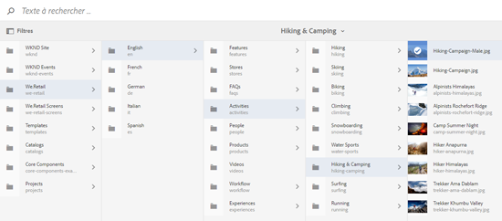
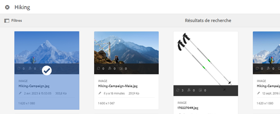
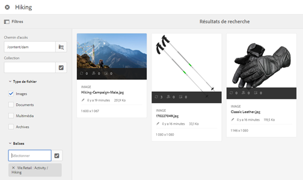

# Sélecteur de ressources {#asset-selector}

>[!NOTE]
>
>Le [sélecteur de ressources](https://experienceleague.adobe.com/docs/experience-manager-cloud-service/content/assets/manage/asset-selector.html?lang=fr) s’appelait [Asset picker](https://helpx.adobe.com/fr/experience-manager/6-2/assets/using/asset-picker.html) en anglais dans les versions antérieures d’[!DNL Experience Manager].

Le sélecteur de ressources vous permet de parcourir, rechercher et filtrer des ressources dans [!DNL Adobe Experience Manager] Assets. Vous pouvez également récupérer les métadonnées des ressources sélectionnées à l’aide du sélecteur de ressources. Pour personnaliser l’interface du sélecteur de ressources, vous pouvez la lancer avec les paramètres de requête pris en charge. Ces paramètres définissent le contexte du sélecteur de ressources pour un scénario particulier.

Actuellement, vous pouvez transmettre les paramètres de requête `assettype` (*Image/Vidéo/Texte*) et sélectionner `mode` (*Mono/Multiple*) comme informations contextuelles pour le sélecteur de ressources, qui reste intact tout au long de la sélection.

Le sélecteur de ressources utilise le message **HTML5 Window.postMessage** pour envoyer au ou à la destinataire les données correspondant à la ressource sélectionnée.

Le sélecteur de ressources utilise le vocabulaire d’interface Foundation Picker de Granite. Par défaut, le sélecteur de ressources fonctionne en mode de navigation. Cependant, vous pouvez appliquer des filtres à l’aide de l’expérience Omnisearch pour affiner votre recherche de ressources spécifiques.

Vous pouvez intégrer n’importe quelle page web (qu’elle fasse partie ou non du conteneur CQ) au sélecteur de ressources (`https://[AEM_server]:[port]/aem/assetpicker.html`).

## Paramètres contextuels {#contextual-parameters}

Vous pouvez transmettre les paramètres de requête suivants dans une URL pour démarrer le sélecteur de ressources dans un contexte spécifique :

| Nom | Valeurs | Exemple | Objectif |
|---|---|---|---|
| suffixe de la ressource (B) | Chemin d’accès au dossier indiqué comme suffixe de la ressource dans l’URL :`http://localhost:4502/aem/` `assetpicker.html/<folder_path>` | Pour démarrer le sélecteur de ressources avec un dossier particulier, par exemple avec le dossier `/content/dam/we-retail/en/activities` sélectionné, l’URL doit avoir la forme suivante : `http://localhost:4502/aem/assetpicker.html` `/content/dam/we-retail/en/activities?assettype=images`. | Si vous avez besoin de sélectionner un dossier en particulier au démarrage du sélecteur de ressources, vous pouvez l’indiquer comme suffixe de ressource. |
| mode | single, multiple | `http://localhost:4502/aem/assetpicker.html` `?mode=multiple`   `http://localhost:4502/aem/assetpicker.html` `?mode=single` | En mode multiple, vous pouvez sélectionner plusieurs ressources simultanément à l’aide du sélecteur de ressources. |
| boîte de dialogue | true, false | `http://localhost:4502/aem/assetpicker.html` `?dialog=true` | Utilisez ces paramètres pour ouvrir le sélecteur de ressources en tant que boîte de dialogue Granite. Cette option ne peut être appliquée qu’au démarrage du sélecteur de ressources via le champ Chemin de Granite, en la configurant comme URL pickerSrc. |
| root | `<folder_path>` | `http://localhost:4502/aem/` `assetpicker.html?assettype=images` `&root=/content/dam/we-retail/en/activities` | Utilisez cette option pour spécifier le dossier racine du sélecteur de ressources. Dans ce cas, le sélecteur de ressources vous permet de sélectionner uniquement les ressources enfants (directes/indirectes) sous le dossier racine. |
| viewmode | search |  | Pour lancer le sélecteur de ressources en mode recherche, avec les paramètres assettype et mimetype. |
| assettype (S) | images, documents, multimedia, archives | <ul><li>`http://localhost:4502/aem/assetpicker.html?viewmode=search&assettype=images`</li> <li>`http://localhost:4502/aem/assetpicker.html?viewmode=search&assettype=documents`</li> <li>`http://localhost:4502/aem/assetpicker.html?viewmode=search&assettype=multimedia`</li> <li>`http://localhost:4502/aem/assetpicker.html?viewmode=search&assettype=archives`</li> | Utilisez cette option pour filtrer les types de ressources en fonction de la valeur transmise. |
| mimetype | Type(s) MIME (`/jcr:content/metadata/dc:format`) d’une ressource (le caractère générique est également pris en charge) | <ul><li>`http://localhost:4502/aem/assetpicker.html?viewmode=search&mimetype=image/png`</li>  <li>`http://localhost:4502/aem/assetpicker.html?viewmode=search&?mimetype=*png`</li>  <li>`http://localhost:4502/aem/assetpicker.html?viewmode=search&mimetype=*presentation`</li>  <li>`http://localhost:4502/aem/assetpicker?viewmode=search&mimetype=*presentation&mimetype=*png`</li></ul> | Utilisez-le pour filtrer les ressources basées sur le ou les types MIME |

## Utiliser le sélecteur de ressources {#using-the-asset-selector}

1. Pour accéder à l’interface du sélecteur de ressources, accédez à `https://[AEM_server]:[port]/aem/assetpicker`.
1. Recherchez le dossier souhaité, puis sélectionnez une ou plusieurs ressources.

   

   Vous pouvez également rechercher la ressource souhaitée dans la zone OmniSearch, puis la sélectionner.

   

   Si vous recherchez des ressources à l’aide de la zone OmniSearch, vous pouvez sélectionner différents filtres dans le volet **[!UICONTROL Filtres]** pour affiner votre recherche.

   

1. Cliquez sur **[!UICONTROL Sélectionner]** dans la barre d’outils.

>[!MORELIKETHIS]
>
>* [Sélecteur de ressources micro-frontend dans AEM as a Cloud Service](https://experienceleague.adobe.com/docs/experience-manager-cloud-service/content/assets/manage/asset-selector.html?lang=fr)
