# Modèles de ressources {#asset-templates}

Les modèles de ressources sont une catégorie spéciale de ressources qui facilite la réaffectation rapide de contenu visuellement riche pour les supports numériques et imprimés. Un modèle de ressource comprend deux parties : une section de message fixe et une section modifiable. La section fixe peut comprendre du contenu propriétaire, comme le logo d’une marque ou des informations sur les droits d’auteur, pour lequel la modification n’est pas activée. La section modifiable peut contenir du contenu visuel et textuel dans des champs qui peuvent être modifiés pour personnaliser la messagerie.

La souplesse d’effectuer des modifications limitées tout en sécurisant la signalisation globale rend les modèles de ressources des blocs de construction idéaux pour une adaptation et une distribution rapides du contenu en tant qu’artefacts de contenu pour diverses fonctions. La redéfinition du contenu permet de réduire les coûts de gestion des canaux imprimés et numériques et de proposer des expériences holistiques et cohérentes sur l’ensemble de ces canaux.

En tant que spécialiste du marketing, vous pouvez stocker et gérer des modèles dans [!DNL Experience Manager Assets] et utiliser un modèle de base unique pour créer facilement plusieurs expériences d’impression personnalisée. Vous pouvez créer différents types de documents marketing, par exemple, des brochures, des prospectus, des cartes postales, des cartes de visite, etc. pour transmettre de façon claire votre message marketing à vos clients. Vous pouvez également assembler des documents papier comportant plusieurs pages à partir de documents papier nouveaux ou existants. Vous pouvez surtout diffuser des expériences à la fois numériques et papier simultanément en toute simplicité et offrir ainsi aux utilisateurs une expérience intégrée cohérente.

Bien que les modèles de ressources soient principalement des fichiers [!DNL Adobe InDesign], la maîtrise de [!DNL Adobe InDesign] n&#39;empêche pas la création d&#39;artefacts stellaires. Il n’est pas nécessaire de mapper les champs de votre modèle [!DNL Adobe InDesign] avec les champs de vos produits que vous auriez autrement dû utiliser lors de la création de catalogues. Vous pouvez modifier les modèles en mode WYSIWYG directement sur l’interface Web. Cependant, pour que [!DNL Adobe InDesign] puisse traiter vos modifications de modification, vous devez d&#39;abord configurer [!DNL Experience Manager Assets] pour qu&#39;il s&#39;intègre à [!DNL Adobe InDesign Server].

La possibilité de modifier des modèles [!DNL Adobe InDesign] à partir de l’interface Web permet de renforcer la collaboration entre les créatifs et le personnel marketing. La vitesse accrue du contenu réduit le délai de mise sur le marché des garanties marketing.

Les modèles de ressources permettent d’effectuer les opérations suivantes :

* Modifier des champs de modèle modifiables depuis l’interface web.
* Contrôler les paramètres de base de style du texte, par exemple, la taille, le style et le type de police au niveau des balises.
* Modifier les images du modèle à l’aide du sélecteur de contenu.
* Prévisualiser les modifications du modèle.
* Fusionner plusieurs fichiers de modèle pour créer un document multipage.

Lorsque vous choisissez un modèle pour votre garantie, [!DNL Experience Manager Assets] crée une copie du modèle que vous pouvez modifier. Le modèle original est préservé, ce qui garantit que votre signalétique reste intacte et peut être réutilisée pour renforcer la cohérence de la marque.

Vous pouvez exporter le fichier mis à jour dans le dossier parent aux formats INDD, PDF ou JPG. Vous pouvez également télécharger la sortie dans ces formats vers votre système de fichiers local.

## Créer une garantie {#creating-a-collateral}

Imaginons que vous voulez créer des contenus numériques papier, comme des brochures, des prospectus ou des publicités pour une future campagne, et les envoyer à des magasins dans le monde entier. Créer de tels documents à l’aide d’un modèle vous permet de proposer la même expérience client sur tous les canaux de diffusion. Les concepteurs peuvent créer des modèles de campagne (d’une ou de plusieurs pages) à l’aide d’une solution créative, telle que [!DNL InDesign] et télécharger les modèles vers [!DNL Experience Manager Assets] pour vous. Avant de créer une garantie, demandez qu&#39;un ou plusieurs modèles INDD soient chargés et disponibles dans [!DNL Experience Manager] à l&#39;avance.

1. Dans l&#39;interface [!DNL Experience Manager], cliquez sur [!UICONTROL Ressources].

1. Dans les options, choisissez **[!UICONTROL Modèles]**.

   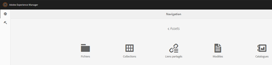

1. Cliquez sur **[!UICONTROL Créer]**, puis choisissez la garantie que vous souhaitez créer dans le menu. Par exemple, choisissez **[!UICONTROL Brochure]**.

   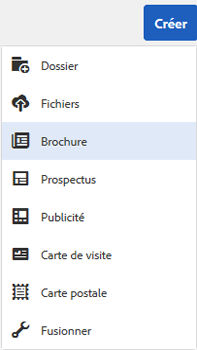

1. Demandez qu&#39;un ou plusieurs modèles INDD soient chargés et disponibles à l&#39;avance dans [!DNL Experience Manager]. Choisissez un modèle pour votre brochure, puis cliquez sur **[!UICONTROL Suivant]**.
1. Entrez un nom et éventuellement une description pour la brochure.

   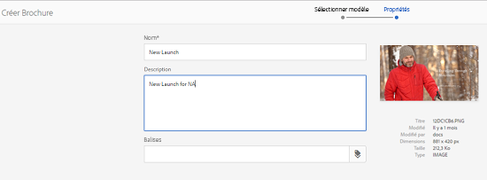

1. (Facultatif) Cliquez sur **[!UICONTROL Balises]** et sélectionnez une ou plusieurs balises pour la brochure. Cliquez sur **[!UICONTROL Confirmer]** pour confirmer votre sélection.
1. Cliquez sur **[!UICONTROL Créer]**. Une boîte de dialogue s’ouvre pour confirmer que la nouvelle brochure a été créée. Cliquez sur **[!UICONTROL Ouvrir]** pour ouvrir la brochure en mode d&#39;édition.

   <!-- -->

   Vous pouvez aussi fermer la boîte de dialogue et accéder au dossier dans la page Modèles de départ pour afficher la brochure créée. Le type de document apparaît sur sa miniature en mode Carte. Par exemple, dans ce cas, le mot [!UICONTROL Brochure] s’affiche sur la miniature.

   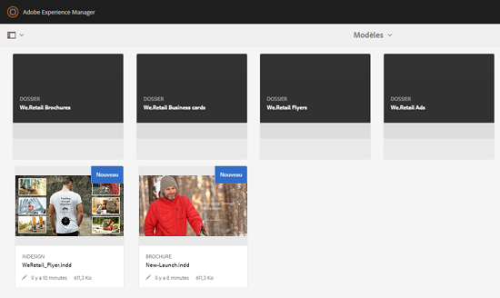

## Modifier une garantie {#editing-a-collateral}

Vous pouvez modifier un document immédiatement après sa création. Vous pouvez également l’ouvrir à partir de la page [!UICONTROL Modèles] ou de la page de ressources.

1. Pour ouvrir un document pour le modifier, procédez de l’une des façons suivantes :

   * Ouvrez la garantie (brochure dans ce cas) que vous avez créée à l’étape 7 de [Créer une garantie](/help/assets/asset-templates.md#creating-a-collateral).
   * Dans la page Modèles, accédez à un dossier dans lequel vous avez créé la garantie, puis cliquez sur l&#39;action rapide [!UICONTROL Modifier] sur la miniature d&#39;une garantie.
   * Dans la page de ressources de la garantie, cliquez sur **[!UICONTROL Modifier]** dans la barre d’outils.
   * Sélectionnez la garantie et cliquez sur **[!UICONTROL Modifier]** dans la barre d’outils.

   <!-- -->

   L’outil de recherche de ressources et l’éditeur de texte sont affichés à gauche de la page. L’éditeur de texte s’ouvre par défaut.

   Vous pouvez utiliser l’éditeur de texte pour modifier le texte à afficher dans le champ de texte. Vous pouvez modifier la taille, le style, la couleur et le type de police au niveau de la balise.

   A l’aide de l’outil de recherche de ressources, vous pouvez parcourir ou rechercher des images dans [!DNL Experience Manager Assets] et remplacer les images modifiables du modèle par les images de votre choix.

   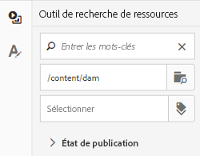

   Les champs modifiables sont affichés à droite. Pour qu’un champ soit modifiable dans [!DNL Experience Manager Assets], le champ correspondant dans le modèle doit être balisé dans [!DNL InDesign]. En d&#39;autres termes, ils doivent être marqués comme modifiables dans [!DNL InDesign].

   >[!NOTE]
   >
   >Assurez-vous que votre déploiement [!DNL Experience Manager] est intégré à un [!DNL InDesign Server] pour permettre à [!DNL Experience Manager Assets] d&#39;extraire des données du modèle [!DNL InDesign] et de les rendre disponibles pour modification. Pour plus d&#39;informations, voir [intégrer des ressources Experience Manager à l&#39;InDesign Server](/help/assets/indesign.md).

1. Pour modifier le texte d’un champ modifiable, cliquez sur le champ de texte à partir de la liste des champs modifiables et modifiez le texte du champ.

   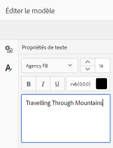

   Vous pouvez modifier les propriétés de texte, par exemple le style, la couleur et la taille de la police, à l’aide des options fournies.

1. Cliquez sur **[!UICONTROL Prévisualisation]** pour prévisualisation des modifications de texte.

1. Pour permuter une image, cliquez sur le **[!UICONTROL Outil de recherche de ressources]** .

1. Sélectionnez le champ d’image dans la liste des champs modifiables, puis faites glisser l’image souhaitée du sélecteur de ressource vers le champ modifiable.

   

   Vous pouvez également rechercher des images à l’aide de mots-clés, de balises ou selon leur état de publication. Vous pouvez parcourir le référentiel [!DNL Experience Manager Assets] et accéder à l’emplacement de l’image souhaitée.

   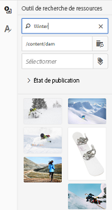

1. Cliquez sur **[!UICONTROL Prévisualisation]** pour prévisualisation de l’image.
1. Pour modifier une page spécifique dans une documentation multipage, utilisez le navigateur de page situé en bas.

1. Cliquez sur **[!UICONTROL Prévisualisation]** dans la barre d’outils pour prévisualisation toutes les modifications. Cliquez sur **[!UICONTROL Terminé]** pour enregistrer les modifications apportées à la garantie.

   >[!NOTE]
   >
   >Les options Prévisualisation et Terminé ne sont activées que si les champs d’image modifiables dans la documentation ne comportent pas d’icônes manquantes. S’il manque des icônes dans votre garantie, c’est parce que [!DNL Experience Manager] ne parvient pas à résoudre les images du modèle [!DNL InDesign]. En règle générale, [!DNL Experience Manager] ne parvient pas à résoudre les images dans les cas suivants :
   >
   >* Les images ne sont pas incorporées dans le modèle [!DNL InDesign] sous-jacent.
   >* Les images sont liées à partir du système de fichiers local.

   >
   >Pour permettre à [!DNL Experience Manager] de résoudre des images, procédez comme suit :
   >
   >* Incorporer des images lors de la création de modèles [!DNL InDesign] (voir [A propos des liens et des graphiques incorporés](https://helpx.adobe.com/fr/indesign/using/graphics-links.html)).
   >* Montez [!DNL Experience Manager] sur votre système de fichiers local, puis mappez les icônes manquantes avec les ressources existantes dans [!DNL Experience Manager].

   >
   >Pour plus d&#39;informations sur l&#39;utilisation des documents [!DNL InDesign], consultez la section [meilleures pratiques pour travailler avec les documents d&#39;InDesign en Experience Manager](https://helpx.adobe.com/experience-manager/kb/best-practices-idd-docs-aem.html).

1. Pour générer un rendu PDF pour la brochure, sélectionnez l’option Acrobat dans la boîte de dialogue, puis cliquez sur **[!UICONTROL Continuer]**.
1. Le document est créé dans le dossier où vous avez commencé. Pour afficher les rendus, ouvrez le document et choisissez **[!UICONTROL Rendus]** dans la liste de navigation globale.

   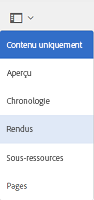

1. Cliquez sur le rendu PDF dans la liste des rendus pour télécharger le fichier PDF. Ouvrez le fichier PDF pour réviser le document.

   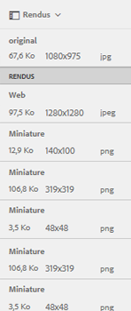

## Fusionner la garantie {#merge-collateral}

1. Dans l&#39;interface [!DNL Experience Manager], cliquez sur [!UICONTROL Ressources] dans la page Navigation.

1. Dans les options, choisissez **[!UICONTROL Modèles]**.

1. Cliquez sur **[!UICONTROL Créer]** et choisissez **[!UICONTROL Fusionner]** dans le menu.

   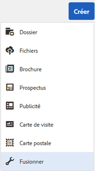

1. Dans la page [!UICONTROL Fusion de modèles], cliquez sur **[!UICONTROL Fusion]** .

1. Accédez à l&#39;emplacement de la garantie que vous souhaitez fusionner, cliquez sur les miniatures de la sûreté à fusionner pour les sélectionner.

   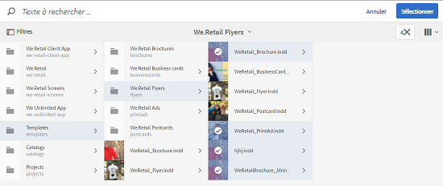

   Vous pouvez également rechercher des modèles dans la zone Omnisearch.

   Vous pouvez parcourir le référentiel [!DNL Experience Manager Assets] ou les collections, accéder à l’emplacement des modèles souhaités, puis les sélectionner pour les fusionner.

   Vous pouvez appliquer différents filtres pour rechercher les modèles souhaités. Par exemple, vous pouvez rechercher des modèles en fonction de leur type ou de leurs balises.

1. Cliquez sur **[!UICONTROL Suivant]** dans la barre d’outils.
1. Dans l’écran **[!UICONTROL Prévisualisation et réorganisation]**, réorganisez les modèles si nécessaire et prévisualisation la sélection des modèles à fusionner. Cliquez ensuite sur **[!UICONTROL Suivant]** dans la barre d’outils.

   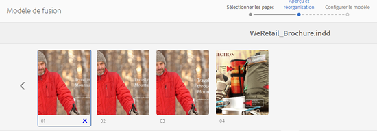

1. Dans l’écran [!UICONTROL Configurer le modèle], spécifiez un nom pour la garantie. Vous pouvez également spécifier les balises que vous considérez appropriées. Si vous souhaitez exporter la sortie au format PDF, sélectionnez **[!UICONTROL Acrobat (.PDF)]**. Par défaut, la garantie est exportée au format JPG et [!DNL InDesign]. Pour modifier la miniature d’affichage de la documentation multipage, cliquez sur **[!UICONTROL Modifier la miniature]**.

   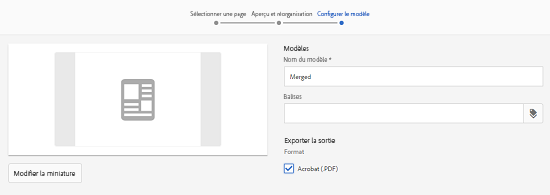

1. Cliquez sur **[!UICONTROL Enregistrer]**, puis sur **[!UICONTROL OK]** dans la boîte de dialogue pour fermer la boîte de dialogue. La documentation multipage est créée dans le dossier que vous avez créé.

   >[!NOTE]
   >
   >Vous ne pouvez pas modifier ultérieurement un document fusionné ni l’utiliser pour créer d’autres documents.

## Bonnes pratiques et restrictions {#best-practices-limitations-tips}

* L&#39;éditeur [!DNL InDesign] de [!DNL Experience Manager] fonctionne au niveau de la balise et tout le texte sous une balise unique est considéré comme une entité unique. Pour conserver la mise en forme et les styles du texte lors de la modification, balisez séparément chaque paragraphe (ou le texte avec des styles différents).
