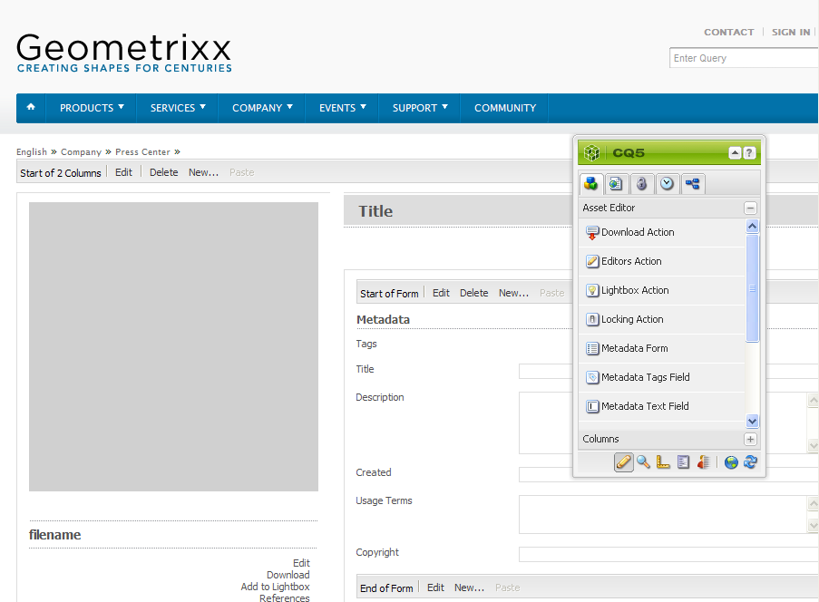

# Create and configure Asset Editor pages {#creating-and-configuring-asset-editor-pages}

Ce document répond aux questions suivantes :

* Pourquoi créer des pages Éditeur de ressources personnalisées.
* Comment créer et personnaliser des pages Éditeur de ressources, qui sont des pages de gestion de contenu web permettant d’afficher et de modifier des métadonnées, et d’effectuer des opérations sur la ressource.
* Comment modifier plusieurs ressources simultanément.

<!-- TBD: Add UICONTROL tags. Need PM review. Flatten the structure a bit. Re-write to remove Geometrixx mentions and to adhere to 6.5 OOTB samples. -->

>[!NOTE]
>
>Asset Share est disponible en tant qu’implémentation de référence en source libre. Voir [Asset Share Commons](https://adobe-marketing-cloud.github.io/asset-share-commons/). Il n’est pas officiellement pris en charge.

## Why create and configure Asset Editor pages? {#why-create-and-configure-asset-editor-pages}

La gestion des actifs numériques est utilisée dans un nombre toujours plus grand de scénarios. Lorsque vous passez d’une solution à petite échelle pour un petit groupe d’utilisateurs formés (par exemple des photographes ou des taxonomistes) à des groupes d’utilisateurs plus vastes et plus diversifiés (par exemple, des utilisateurs de l’entreprise, des auteurs de gestion de contenu web, des journalistes, etc.), l’interface utilisateur puissante d’Adobe Experience Manager (AEM) destinée aux utilisateurs professionnels peut fournir trop d’informations et les parties prenantes commencent à demander des interfaces utilisateur ou des applications spécifiques pour accéder aux ressources numériques qui les concernent.

Ces applications axées sur les ressources peuvent être de simples galeries de photos dans un intranet où les employés peuvent charger des photos de visite d’un salon ou d’un centre de presse sur un site web public, tel que l’exemple fourni avec Geometrixx. Les applications axées sur les ressources peuvent également s’étendre à des solutions complètes, y compris les paniers, le passage en caisse et les processus de vérification.

La création d’une application axée sur les ressources devient, dans une large mesure, un processus de configuration ne nécessitant pas de codage, mais uniquement la connaissance des groupes d’utilisateurs et de leurs besoins ainsi que des métadonnées utilisées. Les applications axées sur les ressources créées avec AEM Assets sont extensibles : avec un effort de codage minimal, il est possible de créer des composants réutilisables pour la recherche, l’affichage et la modification des ressources.

Dans AEM, une application axée sur les ressources consiste en une page Éditeur de ressources pouvant être utilisée pour obtenir une vue détaillée d’une ressource spécifique. Une page Éditeur de ressources permet également de modifier les métadonnées, à condition que l’utilisateur accédant à la ressource dispose des autorisations nécessaires.

## Création et configuration d’une page de partage de ressources {#creating-and-configuring-an-asset-share-page}

Personnalisez la fonctionnalité du Finder de la gestion des actifs numériques et créez des pages disposant de toutes les fonctionnalités dont vous avez besoin, appelées pages Partage de ressources. Pour créer une page Partage de ressources, ajoutez la page à l’aide du modèle Partage de ressources de Geometrixx, puis personnalisez les opérations que les utilisateurs peuvent effectuer sur cette page, déterminez comment les utilisateurs voient les ressources et décidez comment ils peuvent créer leurs requêtes.

Voici quelques cas d’utilisation de création d’une page Partage de ressources personnalisée :

* Centre de presse pour les journalistes
* Moteur de recherche d’images pour les utilisateurs internes de l’entreprise
* Base de données d’images pour les utilisateurs du site web
* Interface de balisage des données multimédias pour les éditeurs de métadonnées

### Create an Asset Share page {#creating-an-asset-share-page}

Vous pouvez créer une page Partage de ressources lorsque vous travaillez sur des sites web ou à partir du gestionnaire des actifs numériques.

>[!NOTE]
>
>Par défaut, lorsque vous créez une page Partage de ressources à partir de l’option **Nouveau** du gestionnaire des actifs numériques, une Visionneuse d’éléments et un Éditeur de ressources sont automatiquement créés pour vous.

Pour créer une page Partage de ressources dans la console **Sites web**, procédez comme suit :

1. Dans l’onglet **Sites web**, accédez à l’emplacement où vous souhaitez créer une page Partage de ressources et cliquez sur **Nouveau**.

1. Select the **Asset Share** page and click **Create**. La nouvelle page est créée et la page Partage de ressources est répertoriée dans l’onglet **Sites web**.

La page de base créée à l’aide du modèle Partage de ressources de gestion des actifs numériques de Geometrixx se présente comme suit :

Pour personnaliser la page Partage de ressources, utilisez les éléments du sidekick. Vous pouvez également modifier les propriétés du créateur de requêtes. The page **Geometrixx Press Center** is a customized version of a page based on this template:

Pour créer une page Partage de ressources par l’intermédiaire du gestionnaire des actifs numériques :

1. Dans le gestionnaire des actifs numériques, dans **Nouveau**, sélectionnez **Nouveau partage de ressources**.
1. Dans le **Titre**, saisissez le nom de la page Partage de ressources. Si vous le souhaitez, saisissez un nom pour l’URL.

   

1. Double-cliquez sur la page Partage de ressources pour l’ouvrir, puis configurez-la.

   

   Par défaut, lorsque vous créez une page Partage de ressources à partir de l’option **Nouveau**, une Visionneuse d’éléments et un Éditeur de ressources sont automatiquement créés pour vous.

#### Personnalisation des actions {#customizing-actions}

Vous pouvez déterminer les actions que les utilisateurs peuvent effectuer sur des ressources numériques sélectionnées à partir d’une sélection d’actions prédéfinies.

Pour ajouter des actions à la page Partage de ressources :

1. Dans la page Partage de ressources que vous souhaitez personnaliser, cliquez sur **Actions** dans le sidekick.

Les actions suivantes sont disponibles :

| Action | Description |
|---|---|
| [!UICONTROL Supprimer l’action] | Les utilisateurs peuvent supprimer les fichiers sélectionnés. |
| [!UICONTROL Télécharger l’action] | Permet aux utilisateurs de télécharger les fichiers sélectionnés sur leur ordinateur. |
| [!UICONTROL Action Lightbox] | Enregistre les fichiers dans une &quot;lightbox&quot; où vous pouvez effectuer d’autres actions dessus. La lightbox est pratique lorsque vous travaillez avec des ressources sur plusieurs pages. Elle peut également être utilisée comme panier pour les ressources. |
| [!UICONTROL Déplacer l’action] | Les utilisateurs peuvent déplacer le fichier vers un autre emplacement |
| [!UICONTROL Action sur les tags] | Permet aux utilisateurs d’ajouter des balises aux fichiers sélectionnés |
| [!UICONTROL Action Afficher un élément] | Ouvre le fichier dans l’éditeur de fichiers en vue d’une manipulation par l’utilisateur. |

1. Faites glisser l’action appropriée vers la zone **Actions** de la page. Cette opération crée un bouton utilisé pour effectuer cette action.

#### Determine how search results are presented {#determining-how-search-results-are-presented}

Vous déterminez comment les résultats sont affichés à partir d’une liste de loupes prédéfinie.

Pour modifier la façon dont les résultats de la recherche sont affichés :

1. Dans la page Partage de ressources que vous souhaitez personnaliser, cliquez sur Rechercher.

1. Faites glisser la loupe appropriée en haut au centre de la page. Dans le centre de presse, les loupes sont déjà disponibles. Les utilisateurs appuient sur l’icône de loupe appropriée pour afficher les résultats de recherche souhaités.

Les lentilles suivantes sont disponibles:

| Objectif | Description |
|---|---|
| **[!UICONTROL Liste des loupes]** | Présente les fichiers sous forme de liste avec des détails. |
| **[!UICONTROL Loupe mosaïque]** | Présente les fichiers de manière mosaïque. |

#### Loupe mosaïque {#mosaic-lens}

#### Liste des loupes {#list-lens}

#### Customize the Query Builder {#customizing-the-query-builder}

Query Builder permet d’entrer des termes de recherche et de créer du contenu pour la page Partage de ressources. Lorsque vous modifiez Query Builder, vous pouvez également déterminer le nombre de résultats de la recherche affichés par page, l’Éditeur de ressources qui s’ouvre lorsque vous double-cliquez sur une ressource, le chemin parcouru par la requête et les types de nœuds personnalisés.

Pour personnaliser Query Builder :

1. Dans la page Partage de ressources que vous souhaitez personnaliser, cliquez sur **Modifier** dans Query Builder. Par défaut, l’onglet **Général** s’ouvre.
1. Sélectionnez le nombre de résultats par page, le chemin d’accès à l’Éditeur de ressources (si vous disposez d’un Éditeur de ressources personnalisé) et le titre Actions.

1. Cliquez sur l’onglet **Chemins**. Saisissez un ou plusieurs chemins que la recherche va exécuter. Ces chemins sont remplacés si l’utilisateur utilise le prédicat Chemins.

1. Saisissez un autre type de nœud, le cas échéant.

1. In the **Query Builder URL** field, you can override or wrap the query builder and enter the new servlet URLs with the existing query builder component. Dans le champ **URL du flux**, vous pouvez également remplacer l’URL du flux.

1. Dans le champ **Texte**, saisissez le texte que vous souhaitez afficher pour les résultats et le nombre de page des résultats. Cliquez sur **OK** une fois que vous avez terminé d’apporter des modifications.

#### Ajouter des prédicats {#adding-predicates}

AEM Assets inclut un certain nombre de prédicats que vous pouvez ajouter à la page Partage de ressources. Ils permettent à vos utilisateurs de restreindre les recherches. Dans certains cas, ils peuvent remplacer un paramètre de Query Builder (par exemple, le paramètre Chemin).

Pour ajouter des prédicats :

1. Dans la page Partage de ressources que vous souhaitez personnaliser, cliquez sur **Rechercher**.

1. Faites glisser les prédicats appropriés vers la page Partage de ressources située sous Query Builder. Cette action crée les champs appropriés.

Les prédicats suivants sont disponibles :

| Prédicat | Description |
|---|---|
| **[!UICONTROL Prédicat de la date]** | Permet aux utilisateurs de rechercher des fichiers qui ont été modifiés avant et après certaines dates. |
| **[!UICONTROL Prédicat Options]** | Le propriétaire du site peut spécifier une propriété à rechercher (comme dans le prédicat de la propriété, par exemple cq:tags) et une arborescence de contenu à partir de laquelle renseigner les options (comme l&#39;arborescence des balises). Cela génère une liste d’options dans laquelle les utilisateurs peuvent sélectionner les valeurs (balises) que la propriété sélectionnée (propriété de la balise) doit comporter. Ce prédicat permet de créer des contrôles de liste comme la liste des balises, les types de fichiers, les orientations d’image, etc. Il est donc parfait pour un jeu fixe d’options. |
| **[!UICONTROL Prédicat du chemin d’accès]** | Permet aux utilisateurs de définir le chemin d’accès et les sous-dossiers, le cas échéant. |
| **[!UICONTROL Prédicat de la propriété]** | Le propriétaire du site spécifie une propriété à rechercher, par exemple tiff:ImageLength et l’utilisateur peut alors saisir une valeur, par exemple 800. Renvoie toutes les images de 800 pixels de haut. Ce prédicat est utile si votre propriété peut comporter des valeurs arbitraires. |

For more information, see the [predicate Javadocs](https://helpx.adobe.com/experience-manager/6-5/sites/developing/using/reference-materials/javadoc/com/day/cq/search/eval/package-summary.html).

1. Pour configurer davantage le prédicat, double-cliquez dessus. Par exemple, lorsque vous ouvrez le prédicat du chemin d’accès, vous devez affecter le chemin racine.

## Création et configuration d’une page Editeur de ressources {#creating-and-configuring-an-asset-editor-page}

Personnalisez l’Éditeur de ressources pour déterminer comment les utilisateurs peuvent afficher et modifier les ressources numériques. Pour ce faire, créez une page Éditeur de ressources, puis personnalisez les vues et les actions que les utilisateurs peuvent effectuer sur cette page.

>[!NOTE]
>
>Si vous souhaitez ajouter des champs personnalisés à l’Éditeur de ressources du gestionnaire des actifs numériques, ajoutez les nouveaux nœuds cq:Widget à `/apps/dam/content/asseteditors.`

### Create an Asset Editor page {#creating-the-asset-editor-page}

Lors de la création de la page Éditeur de ressources, il est recommandé de créer la page directement sous la page Partage de ressources.

Pour créer une page Éditeur de ressources :

1. Dans l’onglet **Sites web**, accédez à l’emplacement où vous souhaitez créer une page Éditeur de ressources, puis cliquez sur **Nouveau**.
1. Sélectionnez **Éditeur de ressourcesGeometrixx**, puis cliquez sur **Créer**. La nouvelle page est créée et elle est répertoriée dans l’onglet **Sites web**.

La page de base créée à l’aide du modèle Editeur de ressources Geometrixx se présente comme suit :

Pour personnaliser votre page Éditeur de ressources, utilisez les éléments du sidekick. The Asset Editor page that is accessed from the **Geometrixx Press Center** is a customized version of a page based on this template:

#### Définition d’un éditeur de ressources à ouvrir à partir d’une page de partage de ressources {#setting-which-asset-editor-opens-from-an-asset-share-page}

Après avoir créé la page Éditeur de ressources personnalisée, vous devez vous assurer que, lorsque vous double-cliquez sur des ressources, le Partage de ressources personnalisé que vous avez créé ouvre les ressources dans la page Éditeur personnalisée.

Pour définir la page Éditeur de ressources :

1. Dans la page Partage de ressources, cliquez sur **Modifier** en regard de Query Builder.

1. Cliquez sur l’onglet **Général** s’il n’est pas déjà sélectionné.

1. Dans le champ **Chemin d’accès à l’Éditeur de ressources**, saisissez le chemin d’accès à l’Éditeur de ressources dans lequel vous souhaitez que la page Partage de ressources ouvre les ressources, puis cliquez sur **OK**.

#### Add Asset Editor components {#adding-asset-editor-components}

Vous déterminez les fonctionnalités d’un Éditeur de ressources en ajoutant des composants à la page.

Pour ajouter des composants de l’Éditeur de ressources :

1. Dans la page Éditeur de ressources que vous souhaitez personnaliser, cliquez sur **Éditeur de ressources** dans le sidekick. Tous les composants de l’Éditeur de ressources disponibles s’affichent.

>[!NOTE]
>
>Les éléments que vous pouvez personnaliser dépendent des composants disponibles. Pour activer les composants, accédez au mode de création et sélectionnez les composants dont vous avez besoin.

1. Faites glisser les composants depuis le sidekick vers l’Éditeur de ressources et apportez les modifications nécessaires dans les boîtes de dialogue des composants. Les composants sont décrits dans le tableau suivant ainsi que dans les instructions détaillées ci-dessous.

>[!NOTE]
>
>Lors de la conception de la page Éditeur de ressources, vous créez des composants en lecture seule ou modifiables. Les utilisateurs savent qu’un champ peut être modifié si une icône en forme de crayon apparaît dans ce composant. Par défaut, la plupart des composants sont configurés en lecture seule.

| Component | Description |
|---|---|
| **[!UICONTROL Formulaire]de métadonnées et champ de texte de[!UICONTROL métadonnées]** | Vous permet d’ajouter des métadonnées supplémentaires à un fichier et d’effectuer une action, telle que l’envoi, sur ce fichier. |
| **[!UICONTROL Sous-ressources]** | Permet de personnaliser des sous-ressources. |
| **Balises** | Permet aux utilisateurs de sélectionner et d’ajouter des balises à un fichier. |
| **[!UICONTROL Miniature]** | Affiche une miniature du fichier, son nom de fichier et vous permet d’ajouter un texte de remplacement. Vous pouvez également ajouter des actions de l’Éditeur de ressources dans ce composant. |
| **[!UICONTROL Titre]** | Affiche le titre du fichier, qui peut être personnalisé. |

#### Formulaire de métadonnées et Champ de texte des métadonnées - Configuration du composant d’affichage des métadonnées {#metadata-form-and-text-field-configuring-the-view-metadata-component}

Le Formulaire de métadonnées est un formulaire incluant une action de début et de fin. Dans l’intervalle, vous saisissez des champs **Texte**. Voir [Formulaires](/help/sites-authoring/default-components-foundation.md#form-component) pour plus d’informations sur l’utilisation des formulaires.

1. Créez une action de début en cliquant sur **Modifier** dans la zone Début du formulaire. Vous pouvez saisir le Titre de la boîte, si vous le souhaitez. Par défaut, le Titre de la boîte est **Métadonnées**. Cochez la case Validation du client si vous souhaitez que le code client JavaScript pour la validation soit généré.

1. Créez une action de fin en cliquant sur **Modifier** dans la zone Fin de formulaire. Par exemple, vous pouvez créer un bouton **Envoyer** pour permettre aux utilisateurs de soumettre les modifications des métadonnées. Facultativement, vous pouvez ajouter un bouton **Réinitialiser** qui réinitialise les métadonnées à leur état d’origine.

1. Entre le **Début du formulaire** et la **Fin de formulaire**, faites glisser les champs de texte des métadonnées vers le formulaire. Les utilisateurs renseignent les métadonnées dans ces champs de texte, qu’ils peuvent envoyer, ou bien ils peuvent effectuer une autre action.

1. Double-cliquez sur le nom du champ, par exemple **Titre**, pour ouvrir le champ de métadonnées et apporter des modifications. Dans l’onglet **Général** de la fenêtre **Modifier le composant**, vous définissez l’espace de noms et le libellé du champ, ainsi que le type, par exemple `dc:title`.

See [Customizing and Extending AEM Assets](/help/assets/extending-assets.md) for information on modifying the namespaces available in the metadata form.

1. Cliquez sur l’onglet **Contraintes**. Dans cet onglet, vous pouvez choisir si un champ est requis et, si nécessaire, ajouter des contraintes.

1. Cliquez sur l’onglet **Affichage**. Dans cet onglet, vous pouvez saisir une nouvelle largeur et un nouveau nombre de lignes pour le champ de métadonnées. Cochez la case **Le champ est en lecture seule** pour permettre aux utilisateurs de modifier les métadonnées.

Voici un exemple de formulaire de métadonnées comportant différents champs :

Sur la page Éditeur de ressources, les utilisateurs peuvent ensuite saisir des valeurs dans les champs de métadonnées (s’ils sont modifiables) et effectuer l’action de fin (par exemple, envoyer les modifications).

#### Sous-ressources {#sub-assets}

Le composant Sous-ressources permet d’afficher et de sélectionner des sous-ressources. Vous pouvez déterminer les noms qui apparaissent dans la [ressources principale](/help/assets/assets.md#what-are-digital-assets) et les sous-ressources.

Double-cliquez sur le composant Sous-ressources pour ouvrir la boîte de dialogue des sous-ressources dans laquelle vous pouvez modifier le titre de la ressource principale et de toutes les sous-ressources. Les valeurs par défaut apparaissent sous le champ correspondant.

Voici un exemple de composant Sous-ressources renseigné :

Par exemple, si vous sélectionnez une sous-ressources, notez comment le composant affiche la page appropriée et le Titre de la boîte passe de Sous-ressources à Frères.

#### Balises {#tags}

Le composant Balises est un composant permettant aux utilisateurs d’affecter des balises existantes à une ressource, ce qui facilite l’organisation et la récupération des ressources. Vous pouvez définir ce composant en lecture seule, afin que les utilisateurs ne puissent pas ajouter de balises, mais seulement les afficher.

Double-cliquez sur le composant Balises pour ouvrir la boîte de dialogue des balises dans laquelle vous pouvez modifier le titre des balises, si vous le souhaitez, et sélectionner les espaces de noms alloués. To make this field editable, clear the **[!UICONTROL Hide Edit]** check box. Par défaut, les balises sont modifiables.

Si les utilisateurs peuvent modifier les balises, ils peuvent cliquer sur le crayon pour ajouter des balises en les sélectionnant dans le menu déroulant Balises.

Voici un composant Balises renseigné :

#### Miniature {#thumbnail}

Le composant Miniature est l’emplacement où la ressource affiche la miniature sélectionnée (pour la plupart des formats, la miniature est extraite automatiquement). En outre, le composant affiche le nom de fichier et les [actions que vous pouvez modifier](/help/assets/assets-finder-editor.md#adding-asset-editor-actions).

Double-cliquez sur le composant Miniature pour ouvrir la boîte de dialogue des miniatures dans laquelle vous pouvez modifier le texte de remplacement. Par défaut, le texte de remplacement de la miniature est la ressource **Cliquer pour télécharger.**

Voici un exemple de composant Miniature renseigné :

#### Titre {#title}

Le composant Titre affiche le titre de la ressource et une description.

Par défaut, il est en mode lecture seule. Les utilisateurs ne peuvent donc pas le modifier. Pour le rendre modifiable, double-cliquez sur le composant et décochez la case **Masquer le boutond’édition**. En outre, saisissez un titre pour plusieurs ressources.

Si le titre peut être modifié, vous pouvez ajouter un titre et une description en cliquant sur le crayon pour ouvrir la fenêtre **Propriétés de l’élément**. En outre, vous pouvez activer et désactiver la ressource en sélectionnant la date et l’heure.

Lorsque les utilisateurs modifient le titre en cliquant sur l’icône en forme de crayon, ils peuvent modifier le **Titre**, la **Description** et saisir une **Heure d’activation** et une **Heure de désactivation** afin d’activer et désactiver la ressource.

Voici un exemple de composant Titre renseigné :

#### Ajout d’actions à l’éditeur de fichiers {#adding-asset-editor-actions}

Vous pouvez déterminer les actions que les utilisateurs peuvent effectuer sur des ressources numériques sélectionnées à partir d’une sélection d’actions prédéfinies.

Pour ajouter des actions à la page Éditeur de ressources :

1. In the Asset Editor page that you want to customize, click **Asset Editor** in the sidekick.

Les actions suivantes sont disponibles :

| Action | Description |
|---|---|
| [!UICONTROL Téléchargement] | Permet aux utilisateurs de télécharger les fichiers sélectionnés sur leur ordinateur. |
| [!UICONTROL Editeurs] | Permet aux utilisateurs de modifier une image (édition interactive) |
| [!UICONTROL Lightbox] | Enregistre les fichiers dans une &quot;lightbox&quot; où vous pouvez effectuer d’autres actions dessus. La lightbox est pratique lorsque vous travaillez avec des ressources sur plusieurs pages. |
| [!UICONTROL Verrouillage] | Permet aux utilisateurs de verrouiller un fichier. Cette fonctionnalité n’est pas activée par défaut et doit être activée dans la liste des composants. |
| [!UICONTROL Références] | Cliquez sur ceci pour afficher sur quelles pages le fichier est utilisé. |
| [!UICONTROL Création de versions] | Permet de créer et de restaurer des versions d’un fichier. |

1. Faites glisser l’action appropriée vers la zone **Actions** de la page. Cette opération crée un bouton utilisé pour effectuer cette action.

## Multi-edit assets with the Asset Editor page {#multi-editing-assets-with-the-asset-editor-page}

Avec AEM Assets, vous pouvez apporter des modifications à plusieurs ressources à la fois. Après avoir sélectionné les ressources, vous pouvez simultanément modifier leurs :

* Balises
* Métadonnées

Pour modifier simultanément plusieurs ressources à l’aide de la page Éditeur de ressources :

1. Ouvrez la page Centre de **presse** Geometrixx :
   `https://localhost:4502/content/geometrixx/en/company/press.html`

1. Sélectionnez les ressources :

   * sous Windows : `Ctrl + click` chaque fichier.
   * sous Mac : `Cmd + click` chaque fichier.
   To select a range of assets: click the first asset then `Shift + click` the last asset.

1. Cliquez sur **Éditer les métadonnées** dans le champ **Actions** (partie gauche de la page).
1. La page **Éditeur de ressources du centre de presse** de Geometrixx s’ouvre dans un nouvel onglet. Les métadonnées des ressources s’affichent de la façon suivante :

   * Les balises qui ne s’appliquent pas à toutes les ressources, mais seulement à quelques-unes, s’affichent en italique.
   * Une balise qui s’applique à tous les fichiers s’affiche avec une police normale.
   * Métadonnées autres que les balises : la valeur du champ ne s’affiche que si elle est identique pour toutes les ressources sélectionnées.

1. Cliquez sur **Télécharger** pour télécharger un fichier zip contenant les rendus d’origine des ressources.
1. Cliquez sur l’icône en forme de crayon en regard du champ **Balises** pour modifier ces dernières :

   * Les balises qui ne s’appliquent pas à toutes les ressources, mais seulement à quelques-unes, s’affichent avec un arrière-plan grisé.
   * Les balises qui s’appliquent à toutes les ressources s’affichent avec un arrière-plan blanc.
   Vous pouvez :

   * cliquer sur l’icône **x** pour supprimer la balise de toutes les ressources ;
   * cliquer sur l’icône **+** pour ajouter la balise à toutes les ressources ;
   * cliquer sur la **flèche**, puis sélectionner une balise pour ajouter une nouvelle balise à toutes les ressources.
   Cliquez sur **OK** pour enregistrer les modifications apportées au formulaire. La case en regard du champ **Balises** est automatiquement activée.

1. Modifiez le champ Description. Par exemple, définissez-le sur :

   `This is a common description`

   Lorsqu’un champ est modifié, sa valeur remplace les valeurs existantes des ressources sélectionnées lors de l’envoi du formulaire.

   Remarque : La case en regard du champ est automatiquement activée lorsque le champ est modifié.

1. Cliquez sur **Mettre à jour les métadonnées** pour envoyer le formulaire et enregistrer les modifications pour toutes les ressources.

   Remarque : seules les métadonnées cochées sont modifiées.
