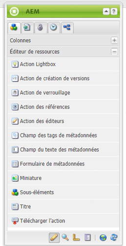

# Créer et configurer des pages d’Éditeur de ressources {#creating-and-configuring-asset-editor-pages}

Ce document répond aux questions suivantes :

* Pourquoi créer des pages Éditeur de ressources personnalisées.
* Comment créer et personnaliser des pages Éditeur de ressources, qui sont des pages de gestion de contenu web permettant d’afficher et de modifier des métadonnées, et d’effectuer des opérations sur la ressource.
* Comment modifier plusieurs ressources simultanément.

<!-- TBD: Add UICONTROL tags. Need PM review. Flatten the structure a bit. Re-write to remove Geometrixx mentions and to adhere to 6.5 default samples. -->

>[!NOTE]
>
>Asset Share est disponible en tant qu’implémentation de référence en source libre. Voir [Asset Share Commons](https://adobe-marketing-cloud.github.io/asset-share-commons/). Il n’est pas officiellement pris en charge.

## Pourquoi créer et configurer des pages de l’Éditeur de ressources ? {#why-create-and-configure-asset-editor-pages}

La gestion des actifs numériques est utilisée dans un nombre toujours plus grand de scénarios. Lorsque vous passez d&#39;une solution à petite échelle pour un petit groupe d&#39;utilisateurs formés par des professionnels - par exemple des photographes ou des taxonomistes - à des groupes d&#39;utilisateurs plus nombreux et plus diversifiés - par exemple des utilisateurs professionnels, des auteurs de WCM, des journalistes, etc. - la puissante interface utilisateur de [!DNL Adobe Experience Manager Assets] pour les utilisateurs professionnels peut fournir trop d&#39;informations et de parties prenantes début pour demander des interfaces utilisateur ou des applications spécifiques pour accéder aux ressources numériques qui les intéressent.

Ces applications centrées sur les ressources peuvent être de simples galeries de photos dans un intranet où les employés peuvent télécharger des photos à partir de visites de salons commerciaux ou d&#39;un centre de presse sur un site Web public. Les applications axées sur les ressources peuvent également s’étendre à des solutions complètes, y compris les paniers, le passage en caisse et les processus de vérification.

La création d’une application axée sur les ressources devient, dans une large mesure, un processus de configuration ne nécessitant pas de codage, mais uniquement la connaissance des groupes d’utilisateurs et de leurs besoins ainsi que des métadonnées utilisées. Les applications axées sur les ressources créées avec [!DNL Assets] sont extensibles : avec un effort de codage modéré, des composants réutilisables pour la recherche, l’affichage et la modification des ressources peuvent être créés.

Une application axée sur les ressources dans [!DNL Experience Manager] est constituée d’une page de l’éditeur de ressources, qui peut être utilisée pour obtenir une vue détaillée d’une ressource spécifique. Une page Éditeur de ressources permet également de modifier les métadonnées, à condition que l’utilisateur accédant à la ressource dispose des autorisations nécessaires.

<!--
## Create and configure an Asset Share page {#creating-and-configuring-an-asset-share-page}

You customize the DAM Finder functionality and create pages that have all the functionality you require, which are called Asset Share pages. To create a new Asset Share page, you add the page using the Geometrixx Asset Share template and then you customize the actions users can perform on that page, determine how viewers see the assets, and decide how users can build their queries.

Here are some use cases for creating a customized Asset Share page:

* Press Center for Journalists.
* Image Search Engine for internal business users.
* Image Database for website users.
* Media Tagging Interface for metadata editors.

### Create an Asset Share page {#creating-an-asset-share-page}

To create a new Asset Share page, you can either create it when you are working on web sites or from the digital asset manager.

>[!NOTE]
>
>By default, when you create an Asset Share page from **New** in the digital asset manager, an Asset viewer and Asset editor are automatically created for you.

To create an new Asset Share page in the **Websites** console:

1. In the **Websites** tab, navigate to the place where you want to create an asset share page and click **New**.

1. Select the **Asset Share** page and click **Create**. The new page is created and the asset share page is listed in the **Websites** tab.

The basic page created using the Geometrixx DAM Asset Share template looks as follows:

To customize your Asset Share page, you use elements from the sidekick and you also edit query builder properties. The page **Geometrixx Press Center** is a customized version of a page based on this template:

To create a new asset share page via the digital asset manager:

1. In the digital asset manager, in **New**, select **New Asset Share**.
1. In the **Title**, enter the name of the asset share page. If desired, enter a name for the URL.

   

1. Double-click the asset share page to open it and configure the page.

   

   By default, when you create an Asset Share page from **New**, an Asset viewer and Asset editor are automatically created for you.

#### Customize actions {#customizing-actions}

You can determine what actions users can perform on selected digital assets from a selection of predefined actions.

To add actions to the Asset Share page:

1. In the Asset Share page that you want to customize, click **Actions** in the sidekick.

The following actions are available:

 | Action | Description |
 |---|---|
 | [!UICONTROL Delete Action] | Users can delete the selected assets. |
 | [!UICONTROL Download Action] | Lets users download selected assets to their computers. |
 | [!UICONTROL Lightbox Action] | Saves assets to a "lightbox"   where you can perform other actions on them. This comes in handy when working   with assets across multiple pages. The lightbox can also be used as a   shopping cart for assets. |
 | [!UICONTROL Move Action] | Users can move the asset to another   location |
 | [!UICONTROL Tags Action] | Lets users add tags to selected assets |
 | [!UICONTROL View Asset Action] | Opens the asset in the Asset editor for   user manipulation. |

1. Drag the appropriate action to the **Actions** area on the page. Doing so creates a button that is used to execute that action.

#### Determine how search results are presented {#determining-how-search-results-are-presented}

You determine how results are displayed from a predefined list of lenses.

To change how search results are viewed:

1. In the Asset Share page that you want to customize, click Search.

1. Drag the appropriate lens to the top center of the page. In the Press Center, the lenses are already available. Users press the appropriate lens icon to display search results as desired.

The following lenses are available:

| Lens | Description |
|---|---|
| **[!UICONTROL List Lens]** |Presents the assets in a list fashion with details. |
| **[!UICONTROL Mosaic Lens]** |Presents assets in a mosaic fashion. |

#### Mosaic Lens {#mosaic-lens}

#### List Lens {#list-lens}

#### Customize the Query Builder {#customizing-the-query-builder}

The query builder lets you enter search terms and create content for the Asset Share page. When you edit the query builder, you also get to determine how many search results are displayed per page, which asset editor opens when you double-click an asset, the path the query searches, and customizes nodetypes.

To customize the query builder:

1. In the Asset Share page that you want to customize, click **Edit** in the Query Builder. By default, the **General** tab opens.
1. Select the number of results per page, the path of the asset editor (if you have a customized asset editor) and the Actions title.

1. Click the **Paths** tab. Enter a path or multiple paths that the search will run. These paths are overwritten if the user uses the Paths predicate.

1. Enter another node type, if desired.

1. In the **Query Builder URL** field, you can override or wrap the query builder and enter the new servlet URLs with the existing query builder component. In the **Feed URL** field, you can override the Feed URL as well.

1. In the **Text** field, enter the text you want to appear for results and page numbers of results. Click **OK** when finished making changes.

#### Add predicates {#adding-predicates}

Experience Manager Assets includes a number of predicates that you can add to the Asset Share page. These let your users further narrow searches. In some cases, they may override a query builder parameter (for example, the Path parameter).

To add predicates:

1. In the Asset Share page that you want to customize, click **Search**.

1. Drag the appropriate predicates to the Asset Share page underneath the query builder. Doing so creates the appropriate fields.

The following predicates are available:

| Predicate | Description |
|---|---|
| **[!UICONTROL Date Predicate]** |Lets users search for assets that were modified before and after certain dates. |
| **[!UICONTROL Options Predicate]** |The site owner can specify a property to search for (as in the property predicate, for example cq:tags) and a content tree to populate the options from (for example the tag tree). Doing so generates a list of options where the users can select the values (tags) that the selected property (tag property) should have. This predicate lets you build list controls like the list of tags, file types, image orientations, and so on. It is great for a fixed set of options. |
| **[!UICONTROL Path Predicate]** |Lets users define the path and subfolders, if desired. |
| **[!UICONTROL Property Predicate]** |The site owner specifies a property to search for, e.g. tiff:ImageLength and the user can then enter a value, e.g. 800. This returns all images that are 800 pixels high. Useful predicate if your property can have arbitrary values. |

For more information, see the [predicate Javadocs](https://helpx.adobe.com/experience-manager/6-5/sites/developing/using/reference-materials/javadoc/com/day/cq/search/eval/package-summary.html).

1. To configure the predicate further, double-click it. For example, when you open the Path Predicate, you need to assign the root path.

-->

## Créer et configurer une page d’éditeur de ressources {#creating-and-configuring-an-asset-editor-page}

Personnalisez l’Éditeur de ressources pour déterminer comment les utilisateurs peuvent afficher et modifier les ressources numériques. Pour ce faire, créez une page Éditeur de ressources, puis personnalisez les vues et les actions que les utilisateurs peuvent effectuer sur cette page.

>[!NOTE]
>
>Si vous souhaitez ajouter des champs personnalisés à l&#39;éditeur de ressources DAM, ajoutez de nouveaux noeuds `cq:Widget` à `/apps/dam/content/asseteditors.`.

### Créer une page d’éditeur de ressources {#creating-the-asset-editor-page}

Lors de la création de la page Éditeur de ressources, il est recommandé de créer la page directement sous la page Partage de ressources.

Pour créer une page Éditeur de ressources :

1. Dans l’onglet **[!UICONTROL Sites web]**, accédez à l’emplacement où vous souhaitez créer une page Éditeur de ressources, puis cliquez sur **Nouveau**.
1. Sélectionnez **Éditeur de ressourcesGeometrixx**, puis cliquez sur **Créer**. La nouvelle page est créée et elle est répertoriée dans l’onglet **Sites web**.

La page de base créée à l’aide du modèle Éditeur de ressources Geometrixx se présente comme suit :

Pour personnaliser votre page Éditeur de ressources, utilisez les éléments du sidekick. La page Editeur de ressources accessible à partir du **Centre de presse de Geometrixx** est une version personnalisée d’une page basée sur ce modèle :

#### Définir un éditeur de ressources à ouvrir à partir d’une page de partage de ressources {#setting-which-asset-editor-opens-from-an-asset-share-page}

Après avoir créé la page Éditeur de ressources personnalisée, vous devez vous assurer que, lorsque vous double-cliquez sur des ressources, le Partage de ressources personnalisé que vous avez créé ouvre les ressources dans la page Éditeur personnalisée.

Pour définir la page Éditeur de ressources :

1. Dans la page Partage de ressources, cliquez sur **Modifier** en regard de Query Builder.

1. Cliquez sur l’onglet **Général** s’il n’est pas déjà sélectionné.

1. Dans le champ **Chemin d’accès à l’Éditeur de ressources**, saisissez le chemin d’accès à l’Éditeur de ressources dans lequel vous souhaitez que la page Partage de ressources ouvre les ressources, puis cliquez sur **OK**.

#### Ajouter les composants de l’éditeur de ressources {#adding-asset-editor-components}

Vous déterminez les fonctionnalités d’un Éditeur de ressources en ajoutant des composants à la page.

Pour ajouter des composants de l’Éditeur de ressources :

1. Dans la page Éditeur de ressources que vous souhaitez personnaliser, cliquez sur **Éditeur de ressources** dans le sidekick. Tous les composants de l’Éditeur de ressources disponibles s’affichent.

>[!NOTE]
>
>Les éléments que vous pouvez personnaliser dépendent des composants disponibles. Pour activer les composants, accédez au mode de création et sélectionnez les composants dont vous avez besoin.

1. Faites glisser les composants depuis le sidekick vers l’Éditeur de ressources et apportez les modifications nécessaires dans les boîtes de dialogue des composants. Les composants sont décrits dans le tableau suivant ainsi que dans les instructions détaillées ci-dessous.

>[!NOTE]
>
>Lors de la conception de la page Éditeur de ressources, vous créez des composants en lecture seule ou modifiables. Les utilisateurs savent qu’un champ peut être modifié si une icône en forme de crayon apparaît dans ce composant. Par défaut, la plupart des composants sont configurés en lecture seule.

| Composant | Description |
|---|---|
| **[!UICONTROL Formulaire ] de métadonnées et champ de texte  [!UICONTROL de métadonnées]** | Vous permet d’ajouter des métadonnées supplémentaires à un fichier et d’effectuer une action, telle que l’envoi, sur ce fichier. |
| **[!UICONTROL Sous-ressources]** | Permet de personnaliser des sous-ressources. |
| **Balises** | Permet aux utilisateurs de sélectionner et d’ajouter des balises à un fichier. |
| **[!UICONTROL Miniature]** | Affiche une miniature du fichier, son nom de fichier et vous permet d’ajouter un texte de remplacement. Vous pouvez également ajouter des actions de l’Éditeur de ressources dans ce composant. |
| **[!UICONTROL Titre]** | Affiche le titre du fichier, qui peut être personnalisé. |

#### Formulaire de métadonnées et Champ de texte des métadonnées - Configuration du composant d’affichage des métadonnées {#metadata-form-and-text-field-configuring-the-view-metadata-component}

Le Formulaire de métadonnées est un formulaire incluant une action de début et de fin. Dans l’intervalle, vous saisissez des champs **Texte**. Voir [Formulaires](/help/sites-authoring/default-components-foundation.md#form-component) pour plus d’informations sur l’utilisation des formulaires.

1. Créez une action de début en cliquant sur **Modifier** dans la zone Début du formulaire. Vous pouvez saisir le Titre de la boîte, si vous le souhaitez. Par défaut, le Titre de la boîte est **Métadonnées**. Cochez la case Validation du client si vous souhaitez que le code client JavaScript pour la validation soit généré.

1. Créez une action de fin en cliquant sur **Modifier** dans la zone Fin de formulaire. Par exemple, vous pouvez créer une option **[!UICONTROL Envoyer]** pour permettre aux utilisateurs d’envoyer leurs modifications de métadonnées. Vous pouvez éventuellement ajouter une option **Réinitialiser** qui réinitialise les métadonnées à leur état d’origine.

1. Entre le **Début du formulaire** et la **Fin de formulaire**, faites glisser les champs de texte des métadonnées vers le formulaire. Les utilisateurs renseignent les métadonnées dans ces champs de texte, qu’ils peuvent envoyer, ou bien ils peuvent effectuer une autre action.

1. Double-cliquez sur le nom du champ, par exemple **Titre**, pour ouvrir le champ de métadonnées et apporter des modifications. Dans l’onglet **Général** de la fenêtre **Modifier le composant**, vous définissez l’espace de noms et le libellé du champ, ainsi que le type, par exemple `dc:title`.

Voir [Personnalisation et extension des ressources](/help/assets/extending-assets.md) pour plus d’informations sur la modification des espaces de nommage disponibles dans le formulaire de métadonnées.

1. Cliquez sur l’onglet **Contraintes**. Dans cet onglet, vous pouvez choisir si un champ est requis et, si nécessaire, ajouter des contraintes.

1. Cliquez sur l’onglet **Affichage**. Dans cet onglet, vous pouvez saisir une nouvelle largeur et un nouveau nombre de lignes pour le champ de métadonnées. Cochez la case **Le champ est en lecture seule** pour permettre aux utilisateurs de modifier les métadonnées.

Voici un exemple de formulaire de métadonnées comportant différents champs :

Sur la page Éditeur de ressources, les utilisateurs peuvent ensuite saisir des valeurs dans les champs de métadonnées (s’ils sont modifiables) et effectuer l’action de fin (par exemple, envoyer les modifications).

#### Sous-ressources {#sub-assets}

Le composant Sous-ressources permet d’afficher et de sélectionner des sous-ressources. Vous pouvez déterminer les noms qui apparaissent dans la [ressources principale](/help/assets/assets.md#what-are-digital-assets) et les sous-ressources.

Double-cliquez sur le composant Sous-ressources pour ouvrir la boîte de dialogue des sous-ressources dans laquelle vous pouvez modifier le titre de la ressource principale et de toutes les sous-ressources. Les valeurs par défaut apparaissent sous le champ correspondant.

Voici un exemple de composant Sous-ressources renseigné :

Par exemple, si vous sélectionnez une sous-ressources, notez comment le composant affiche la page appropriée et le Titre de la boîte passe de Sous-ressources à Frères.

#### Balises {#tags}

Le composant Balises est un composant permettant aux utilisateurs d’affecter des balises existantes à une ressource, ce qui facilite l’organisation et la récupération des ressources. Vous pouvez définir ce composant en lecture seule, afin que les utilisateurs ne puissent pas ajouter de balises, mais seulement les afficher.

Double-cliquez sur le composant Balises pour ouvrir la boîte de dialogue des balises dans laquelle vous pouvez modifier le titre des balises, si vous le souhaitez, et sélectionner les espaces de noms alloués. Pour rendre ce champ modifiable, désactivez la case à cocher **[!UICONTROL Masquer Modifier]**. Par défaut, les balises sont modifiables.

Si les utilisateurs peuvent modifier les balises, ils peuvent cliquer sur le crayon pour ajouter des balises en les sélectionnant dans le menu déroulant Balises.

Voici un composant Balises renseigné :

#### Miniature  {#thumbnail}

Le composant Miniature est l’emplacement où la ressource affiche la miniature sélectionnée (pour la plupart des formats, la miniature est extraite automatiquement). En outre, le composant affiche le nom de fichier et les [actions que vous pouvez modifier](/help/assets/assets-finder-editor.md#adding-asset-editor-actions).

Double-cliquez sur le composant Miniature pour ouvrir la boîte de dialogue des miniatures dans laquelle vous pouvez modifier le texte de remplacement. Par défaut, le texte de remplacement de la miniature est la ressource **Cliquer pour télécharger.**

Voici un exemple de composant Miniature renseigné :

#### Titre {#title}

Le composant Titre affiche le titre de la ressource et une description.

Par défaut, il est en mode lecture seule. Les utilisateurs ne peuvent donc pas le modifier. Pour le rendre modifiable, double-cliquez sur le composant et décochez la case **Masquer le boutond’édition**. En outre, saisissez un titre pour plusieurs ressources.

Si le titre peut être modifié, vous pouvez ajouter un titre et une description en cliquant sur le crayon pour ouvrir la fenêtre **Propriétés de l’élément**. En outre, vous pouvez activer et désactiver la ressource en sélectionnant la date et l’heure.

Lors de la modification du [!UICONTROL Titre], les utilisateurs peuvent modifier le **Titre**, **Description**, et saisir **On** et **Off Times** pour activer et désactiver le fichier.

Voici un exemple de composant Titre renseigné :

#### Ajouter les actions de l’éditeur de ressources {#adding-asset-editor-actions}

Vous pouvez déterminer les actions que les utilisateurs peuvent effectuer sur des ressources numériques sélectionnées à partir d’une sélection d’actions prédéfinies.

Pour ajouter des actions à la page Éditeur de ressources :

1. Dans la page Editeur de ressources que vous souhaitez personnaliser, cliquez sur **Éditeur de ressources** dans le panneau latéral.

Les actions suivantes sont disponibles :

| Action | Description |
|---|---|
| [!UICONTROL Télécharger] | Permet aux utilisateurs de télécharger les éléments sélectionnés   sur leurs ordinateurs. |
| [!UICONTROL Editeurs] | permet aux utilisateurs de modifier une image.   (édition interactive) |
| [!UICONTROL Lightbox] | Enregistre les actifs dans une   &quot;lightbox&quot; où vous pouvez exécuter d’autres actions sur ces objets. La lightbox est pratique lorsque vous travaillez avec des ressources sur plusieurs pages. |
| [!UICONTROL Verrouillage] | Permet aux utilisateurs de verrouiller un fichier. Cette fonctionnalité n’est pas activée par défaut et doit être activée dans la liste des composants. |
| [!UICONTROL Références] | Cliquez pour afficher sur quelles pages   la ressource est utilisée. |
| [!UICONTROL Contrôle de version] | Permet de créer et de restaurer   versions d’une ressource. |

1. Faites glisser l’action appropriée vers la zone **Actions** de la page. Il crée une option qui est utilisée pour exécuter l’action qui est glissée sur la page.

## Modification multiple de fichiers à l’aide de la page Editeur de fichiers {#multi-editing-assets-with-the-asset-editor-page}

Avec [!DNL Experience Manager Assets], vous pouvez apporter des modifications à plusieurs ressources à la fois. Après avoir sélectionné les ressources, vous pouvez simultanément modifier leurs :

* Balises
* Métadonnées

Pour modifier simultanément plusieurs ressources à l’aide de la page Éditeur de ressources :

1. Ouvrez la page **Centre de presse** Geometrixx :
   `https://localhost:4502/content/geometrixx/en/company/press.html`

1. Sélectionnez les ressources :

   * sous Windows : `Ctrl + click` chaque ressource.
   * sur Mac : `Cmd + click` chaque ressource.

   Pour sélectionner une plage de ressources : cliquez sur le premier fichier, puis `Shift + click` sur le dernier fichier.

1. Cliquez sur **Éditer les métadonnées** dans le champ **Actions** (partie gauche de la page).
1. La page **Éditeur de ressources du centre de presse** de Geometrixx s’ouvre dans un nouvel onglet. Les métadonnées des ressources s’affichent de la façon suivante :

   * Les balises qui ne s’appliquent pas à toutes les ressources, mais seulement à quelques-unes, s’affichent en italique.
   * Une balise qui s’applique à tous les actifs s’affiche avec une police normale.
   * Métadonnées autres que les balises : la valeur du champ ne s’affiche que si elle est identique pour toutes les ressources sélectionnées.

1. Cliquez sur **Télécharger** pour télécharger un fichier ZIP contenant les ressources et les rendus d’origine.
1. Cliquez sur Modifier l’option de balises située en regard du champ **Balises**.

   * Les balises qui ne s’appliquent pas à toutes les ressources, mais seulement à quelques-unes, s’affichent avec un arrière-plan grisé.
   * Les balises qui s’appliquent à toutes les ressources s’affichent avec un arrière-plan blanc.

   Vous pouvez :

   * Cliquez sur `x` pour supprimer la balise de tous les actifs.
   * Cliquez sur `+` pour ajouter la balise à tous les actifs.
   * cliquer sur la **flèche**, puis sélectionner une balise pour ajouter une nouvelle balise à toutes les ressources.

   Cliquez sur **OK** pour enregistrer les modifications apportées au formulaire. La case en regard du champ **Balises** est automatiquement activée.

1. Modifiez le champ Description. Par exemple, définissez-le sur :

   `This is a common description`

   Lorsqu’un champ est modifié, sa valeur remplace les valeurs existantes des ressources sélectionnées lors de l’envoi du formulaire.

   Remarque : La case en regard du champ est automatiquement activée lorsque le champ est modifié.

1. Cliquez sur **Mettre à jour les métadonnées** pour envoyer le formulaire et enregistrer les modifications pour toutes les ressources.

   Remarque : seules les métadonnées cochées sont modifiées.
