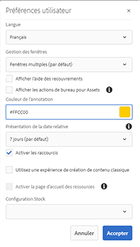
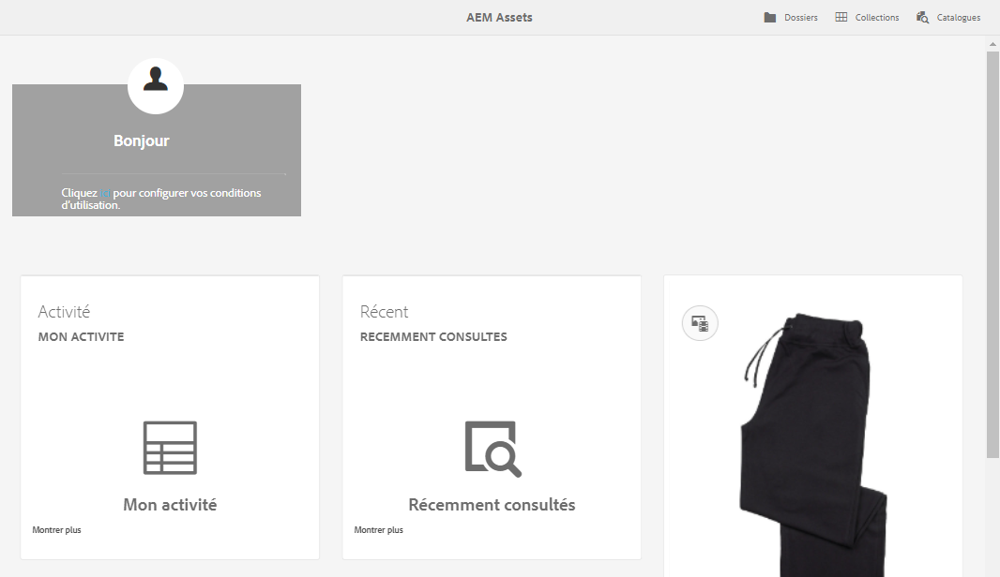

# [!DNL Adobe Experience Manager Assets] Expérience de page d&#39;accueil {#aem-assets-home-page-experience}

Personalize the [!DNL Adobe Experience Manager Assets] home page for a rich welcome screen experience, including a snapshot of recent activities around assets.

[!DNL Assets] La page d&#39;accueil offre une expérience d’écran de bienvenue riche et personnalisée, qui comprend un instantané des activités récentes, telles que les ressources récemment affichées ou téléchargées.

The [!DNL Assets] home page is disabled by default. Pour l’activer, procédez comme suit :

1. Open [!DNL Experience Manager] Configuration Manager `https://[aem_server]:[port]/system/console/configMgr`.
1. Open the **[!UICONTROL Day CQ DAM Event Recorder]** service.
1. Select the **[!UICONTROL Enable this service]** to enable activity recording.

   

1. From the **[!UICONTROL Event Types]** list, select the events to be recorded and save the changes.

   >[!CAUTION]
   >
   >Activer les options Ressource affichée, Projets affichés et Collections affichées augmente significativement le nombre d’événements enregistrés.

1. Ouvrez le service **[!UICONTROL DAM Asset Page d&#39;accueil Feature Flag]** à partir de Configuration Manager `https://[aem_server]:[port]/system/console/configMgr`.
1. Select the `isEnabled.name` option to enable the [!DNL Assets] Home page feature. Enregistrez les modifications.

   

1. Open the **[!UICONTROL User Preferences]** dialog, and select **[!UICONTROL Enable Assets Home Page]**. Enregistrez les modifications.

   

Après avoir activé la [!DNL Assets] Page d&#39;accueil, accédez à l’interface [!DNL Assets] utilisateur à partir de la page Navigation ou accédez-y directement à partir de l’URL `https://[aem_server]:[port]/aem/assetshome.html/content/dam`.

Click the **[!UICONTROL Click here to configure your experience link]** to add your username, background image, and profile image.

The [!DNL Assets] Home page includes the following sections:

* Section Bienvenue
* Section Widget

**Section Bienvenue**

Si votre profil existe, la section Bienvenue affiche pour vous un message de bienvenue. En outre, il affiche votre image de profil et une image de bienvenue (si elle est déjà configurée).

Si votre profil est incomplet, la section Bienvenue affiche un message de bienvenue générique et un espace réservé pour votre image de profil.

**Section Widget**

Cette section s’affiche sous la section Bienvenue et contient des widgets prêts à l’emploi dans les sections suivantes :

* Activité
* Récent
* Découvrez

**activité**: Sous cette section, le widget **[!UICONTROL Mon Activité]** affiche les activités récentes effectuées par l’utilisateur connecté avec des ressources (y compris des ressources sans rendus), par exemple les téléchargements, les téléchargements, la création de ressources, les modifications, les commentaires, les annotations et les partages.

**Récent**: Le widget **[!UICONTROL Récemment affiché]** sous cette section affiche les entités récemment consultées par l’utilisateur connecté, y compris les dossiers, les collections et les projets.

**Discover**: Le **[!UICONTROL nouveau]** widget sous cette section affiche les ressources et les rendus récemment transférés vers le [!DNL Assets] déploiement.

To enable purging of user activity data, enable the **[!UICONTROL DAM Event Purge Service]** from Configuration Manager. Une fois que vous avez activé ce service, les activités de l’utilisateur connecté dépassant le nombre spécifié sont supprimées par le système.

L’écran de bienvenue fournit des outils d’aide à la navigation, comme des icônes sur la barre d’outils afin d’accéder aux dossiers, aux collections et aux catalogues.

>[!NOTE]
>
>Enabling the [!UICONTROL Day CQ DAM Event Recorder] and [!UICONTROL DAM Event Purge] services increases write operations to JCR and search indexing, which significantly increases the load on the [!DNL Experience Manager] server. The additional load on the [!DNL Experience Manager] server can impact its performance.

>[!CAUTION]
>
>Capturing, filtering, and purging user activities required for [!DNL Assets] home page impose an overhead on performance. Par conséquent, les administrateurs doivent configurer la page d’accueil de manière efficace pour les utilisateurs cibles.
>
>Adobe recommande que les administrateurs et les utilisateurs qui effectuent des opérations en masse évitent d’utiliser la fonction de la page d’accueil des ressources pour empêcher l’augmentation des activités de l’utilisateur.  De plus, les administrateurs peuvent exclure les activités d’enregistrement de certains utilisateurs en configurant[!UICONTROL  l’enregistreur d’événement Day CQ DAM][!UICONTROL  à partir du gestionnaire de configuration].
>
>Si vous utilisez la fonction, Adobe recommande que vous planifiez la fréquence de purge par rapport à la charge du serveur.
