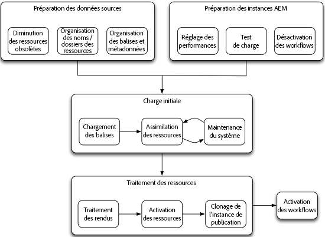

# Comment migrer des ressources en bloc {#assets-migration-guide}

When migrating assets into [!DNL Adobe Experience Manager], there are several steps to consider. Extracting assets and metadata out of their current home is outside the scope of this document as it varies widely between implementations, but this document describes how to bring these assets into [!DNL Experience Manager], apply their metadata, generate renditions, and activate them to publish instances.

## Conditions préalables {#prerequisites}

Before actually performing any of the steps in this methodology, please review and implement the guidance in [Assets performance tuning tips](performance-tuning-guidelines.md). La plupart des étapes, telles que la configuration des tâches simultanées maximales, améliorent considérablement la stabilité et les performances du serveur en charge. D’autres étapes, telles que la configuration d’un entrepôt de données basé sur les fichiers, sont beaucoup plus difficiles à effectuer une fois le système chargé avec des ressources.

>[!NOTE]
>
>The following asset migration tools are not part of [!DNL Experience Manager] and are not supported by Adobe:
>
>* Tools Tag Maker d’ACS AEM
>* Tools CSV Asset Importer d’ACS AEM
>* Bulk Workflow Manager d’ACS Commons
>* Fast Action Manager d’ACS Commons
>* Synthetic Workflow
>
>
Ces logiciels sont Open Source et couverts par la [Licence Apache v2](https://adobe-consulting-services.github.io/pages/license.html). Pour poser une question ou signaler un problème, consultez les sections respectives [Problèmes GitHub pour les outils ACS AEM](https://github.com/Adobe-Consulting-Services/acs-aem-commons/issues) et [ACS AEM Commons](https://github.com/Adobe-Consulting-Services/acs-aem-tools/issues).

## Migrer vers [!DNL Experience Manager]{#migrating-to-aem}

Migrating assets to [!DNL Experience Manager] requires several steps and should be viewed as a phased process. Les phases de la migration sont les suivantes :

1. Désactivation des workflows.
1. Chargement des balises.
1. Assimilation des ressources.
1. Traitement des rendus.
1. Activation des ressources.
1. Activation des workflows.

### Désactivez les workflows {#disabling-workflows}

Before starting your migration, disable your launchers for the [!UICONTROL DAM Update Asset] workflow. Il est préférable d’intégrer toutes les ressources dans le système, puis d’exécuter les workflows par lots. Si vous êtes déjà en ligne pendant la migration, vous pouvez planifier ces activités en dehors des heures de bureau.

### Chargement des balises {#loading-tags}

Vous avez peut-être déjà mis en place une taxonomie de balises que vous appliquez à vos images. While tools like the CSV Asset Importer and [!DNL Experience Manager] support for metadata profiles can automate the process of applying tags to assets, the tags need to be loaded into the system. La fonctionnalité [Tools Tag Maker d’ACS AEM](https://adobe-consulting-services.github.io/acs-aem-tools/features/tag-maker/index.html) permet de renseigner les balises à l’aide d’une feuille de calcul Microsoft Excel chargée dans le système.

### Assimilation des ressources {#ingesting-assets}

Les performances et la stabilité sont des préoccupations importantes lors de l’intégration des ressources dans le système. Comme vous chargez une grande quantité de données dans le système, vous devez vous assurer que le système fonctionne le mieux possible, afin de minimiser le temps nécessaire et d’éviter de surcharger le système, ce qui peut entraîner un blocage de ce dernier, en particulier des systèmes déjà en production.

Il existe deux approches pour charger les ressources dans le système : une approche basée sur le push utilisant le protocole HTTP ou une approche basée sur l’extraction utilisant les API JCR.

#### Envoyer via HTTP {#pushing-through-http}

L’équipe Managed Services d’Adobe utilise un outil appelé Glutton pour charger les données dans les environnements clients. Glutton is a small Java application that loads all assets from one directory into another directory on an [!DNL Experience Manager] instance. À la place de Glutton, vous pouvez également utiliser des outils tels que les scripts Perl pour publier les ressources dans le référentiel.

L’utilisation de l’approche Push à l’aide du protocole HTTPS présente deux inconvénients :

1. Les ressources doivent être transmises au serveur via HTTP. Cette transmission nécessite beaucoup de temps et crée une surcharge, ce qui rallonge le temps nécessaire pour effectuer la migration.
1. Si vous disposez de balises et de métadonnées personnalisées devant être appliquées aux ressources, cette approche nécessite un deuxième processus personnalisé que vous devez exécuter pour appliquer ces métadonnées aux ressources une fois qu’elles ont été importées.

L’autre approche de l’intégration des ressources consiste à extraire les ressources du système de fichiers local. Toutefois, si vous ne parvenez pas à obtenir un lecteur externe ou un partage réseau monté sur le serveur pour effectuer une approche par extraction, la publication des ressources en utilisant HTTP est la meilleure option.

#### Fetch from the local filesystem {#pulling-from-the-local-filesystem}

L’utilitaire [Tools CSV Asset Importer d’ACS AEM](https://adobe-consulting-services.github.io/acs-aem-tools/features/csv-asset-importer/index.html) extrait les ressources du système de fichiers et des métadonnées des ressources à partir d’un fichier CSV pour l’importation des ressources. L’API AEM Asset Manager est utilisée pour importer les ressources dans le système et appliquer les propriétés des métadonnées configurées. Idéalement, les ressources sont montées sur le serveur via un montage de fichiers réseau ou via un lecteur externe.

Comme il n’est pas nécessaire que les ressources soient transmises sur un réseau, les performances globales s’améliorent considérablement et cette méthode est généralement considérée comme le moyen le plus efficace de charger des ressources dans le référentiel. En outre, comme l’outil prend en charge l’assimilation des métadonnées, vous pouvez importer toutes les ressources et métadonnées en une seule étape plutôt que de créer une deuxième étape pour appliquer les métadonnées via un outil distinct.

### Traitement des rendus {#processing-renditions}

After you load the assets into the system, you need to process them through the [!UICONTROL DAM Update Asset] workflow to extract metadata and generate renditions. Before performing this step, you need to duplicate and modify the [!UICONTROL DAM Update Asset] workflow to fit your needs. The out-of-the-box workflow contains many steps that may not necessary for you, such as Scene7 PTIFF generation or [!DNL InDesign Server] integration.

Après avoir configuré le workflow en fonction de vos besoins, vous disposez de deux options pour l’exécuter :

1. L’approche la plus simple consiste à utiliser l’outil [Bulk Workflow Manager d’ACS Commons](https://adobe-consulting-services.github.io/acs-aem-commons/features/bulk-workflow-manager.html). Cet outil permet d’exécuter une requête et de traiter les résultats de la requête via un workflow. Il existe également des options permettant de définir la taille des lots.
1. Vous pouvez utiliser l’outil [Fast Action Manager d’ACS Commons](https://adobe-consulting-services.github.io/acs-aem-commons/features/fast-action-manager.html) en association avec [Synthetic Workflows](https://adobe-consulting-services.github.io/acs-aem-commons/features/synthetic-workflow.html). While this approach is much more involved, it lets you remove the overhead of the [!DNL Experience Manager] workflow engine while optimizing the use of server resources. De plus, Fast Action Manager améliore les performances en surveillant de manière dynamique les ressources du serveur et en réduisant la charge placée sur le système. Des exemples de scripts ont été fournis sur la page de fonctionnalités d’ACS Commons.

### Activation des ressources {#activating-assets}

Pour les déploiements disposant d’un niveau de publication, vous devez activer les ressources dans la ferme de serveurs de publication. Bien qu’Adobe recommande d’exécuter plusieurs instances de publication, il est plus efficace de répliquer toutes les ressources sur une seule instance de publication, puis de cloner cette instance. Lorsque vous activez un grand nombre de ressources, après le déclenchement d’une activation d’arborescence, vous devrez peut-être intervenir. Voici pourquoi : Lors de la  , les éléments sont ajoutés aux tâches/Sling. Une fois que la taille de cette file d’attente commence à dépasser environ 40 000 éléments, le traitement ralentit considérablement. Lorsque la taille de cette file d’attente dépasse 100 000 éléments, la stabilité du système commence à souffrir.

Pour contourner ce problème, vous pouvez utiliser l’outil [Fast Action Manager](https://adobe-consulting-services.github.io/acs-aem-commons/features/fast-action-manager.html) pour gérer la réplication des ressources. Il fonctionne sans utiliser les files d’attente Sling, réduisant les surcharges, tout en régulant la charge de travail pour éviter que le serveur ne soit surchargé. Un exemple d’utilisation de cet outil pour gérer la réplication est présenté sur la page de documentation de FAM.

D’autres options permettant de transférer des ressources vers la batterie de serveurs de publication incluent l’utilisation de [vlt-rcp](https://jackrabbit.apache.org/filevault/rcp.html) ou [oak-run](https://github.com/apache/jackrabbit-oak/tree/trunk/oak-run), qui sont fournis en tant qu’outils dans le cadre de Jackrabbit. Another option is to use an open-sourced tool for your [!DNL Experience Manager] infrastructure called [Grabbit](https://github.com/TWCable/grabbit), which claims to have faster performance than vlt.

Pour toutes ces approches, notez que les ressources de l’instance de création ne s’affichent pas comme ayant été activées. Pour marquer ces ressources avec l’état d’activation correct, vous devez également exécuter un script les marquant comme activées.

>[!NOTE]
>
>Adobe ne prend pas en charge Grabbit.

### Clone Publish {#cloning-publish}

Une fois les ressources activées, vous pouvez cloner votre instance de publication afin de créer autant de copies que nécessaire pour le déploiement. Le clonage d’un serveur est relativement simple, mais il existe quelques étapes importantes à retenir. Pour cloner la publication :

1. Sauvegardez l’instance source et la banque de données.
1. Restaurez la sauvegarde de l’instance et de la banque de données à l’emplacement cible. Les étapes suivantes se rapportent toutes à cette nouvelle instance.
1. Perform a filesystem search under `crx-quickstart/launchpad/felix` for `sling.id`. Supprimez ce fichier.
1. Sous le chemin d’accès racine de la banque de données, recherchez et supprimez les fichiers `repository-XXX`.
1. Modifiez `crx-quickstart/install/org.apache.jackrabbit.oak.plugins.blob.datastore.FileDataStore.config` et `crx-quickstart/launchpad/config/org/apache/jackrabbit/oak/plugins/blob/datastore/FileDataStore.config` pointez sur l’emplacement de la banque de données sur le nouveau  de .
1. Démarrez l’environnement.
1. Mettez à jour la configuration de tous les agents de réplication sur le ou les auteurs afin de pointer vers les instances de publication ou les agents de vidage du Dispatcher corrects sur la nouvelle instance. Cela permet de pointer vers les Dispatchers appropriés du nouvel environnement.

### Activation des workflows {#enabling-workflows}

Once we have completed migration, the launchers for the [!UICONTROL DAM Update Asset] workflows should be re-enabled to support rendition generation and metadata extraction for ongoing day-to-day system usage.

## Migration entre [!DNL Experience Manager] déploiements {#migrating-between-aem-instances}

While not nearly as common, sometimes you need to migrate large amounts of data from one [!DNL Experience Manager] instance to another; for example, when you perform an [!DNL Experience Manager] upgrade, upgrade your hardware, or migrate to a new datacenter, such as with an AMS migration.

Dans ce cas, les ressources sont déjà renseignées avec les métadonnées et les rendus déjà générés. Il ne vous reste plus qu’à vous concentrer sur le déplacement des ressources d’une instance à une autre. When migrating between [!DNL Experience Manager] instances, you perform the following steps:

1. Disable workflows: Because you are migrating renditions along with our assets, you want to disable the workflow launchers for [!UICONTROL DAM Update Asset] workflow.

1. Migrate tags: Because you already have tags loaded in the source [!DNL Experience Manager] instance, you can build them in a content package and install the package on the target instance.

1. Migrate assets: There are two tools that are recommended for moving assets from one [!DNL Experience Manager] instance to another:

   * **Vault Remote Copy** ou vlt rcp vous permet d&#39;utiliser vlt sur un réseau. Vous pouvez indiquer des répertoires source et de destination pour que vlt télécharge toutes les données du référentiel d’une instance et les charge dans l’autre. Vlt rcp est documenté à l’adresse [https://jackrabbit.apache.org/filevault/rcp.html](https://jackrabbit.apache.org/filevault/rcp.html)
   * **Grabbit** est un outil de synchronisation de contenu open-source développé par Time Warner Cable pour leur [!DNL Experience Manager] implémentation. Comme il utilise des flux de données continus, en comparaison avec vlt rcp, sa latence est inférieure et il annonce une vitesse de deux à dix fois plus rapide que vlt rcp. Grabbit prend également en charge la synchronisation du contenu delta uniquement, ce qui lui permet de synchroniser les modifications après l’achèvement d’une passe de migration initiale.

1. Activate assets: Follow the instructions for [activating assets](#activating-assets) documented for the initial migration to [!DNL Experience Manager].

1. Cloner la publication : Comme pour une nouvelle migration, le chargement d’une instance de publication unique et son clonage sont plus efficaces que l’activation du contenu sur les deux noeuds. Voir [Clonage de la publication](#cloning-publish).

1. Enable workflows: After you have completed migration, re-enable the launchers for the [!UICONTROL DAM Update Asset] workflow to support rendition generation and metadata extraction for ongoing day-to-day system usage.
