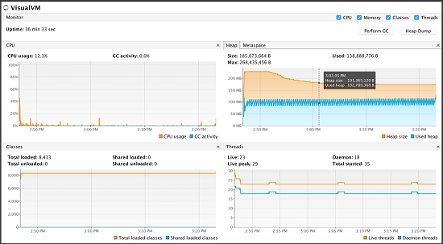

# Meilleures pratiques de surveillance du [!DNL Adobe Experience Manager Assets] déploiement {#assets-monitoring-best-practices}

From the [!DNL Experience Manager Assets] standpoint, monitoring should include observing and reporting on the following processes and technologies:

* Processeur du système
* Utilisation de la mémoire système
* E/S du disque système et temps d’attente
* E/S du réseau
* MBeans JMX pour l’utilisation du tas et les processus asynchrones, tels que les workflows
* Contrôles de l’intégrité de la console OSGi

Typically, [!DNL Experience Manager Assets] can be monitored in two ways, live monitoring and long term monitoring.

## Live monitoring {#live-monitoring}

La surveillance en temps réel est conseillée lors de la phase de test des performances de votre développement ou en cas de charges élevées afin de comprendre les caractéristiques de performance de votre environnement. Typiquement, différents outils peuvent être utilisés pour la surveillance en temps réel. Voici quelques recommandations :

* [Visual VM](https://visualvm.java.net/): Visual VM vous permet de vue des informations détaillées sur la machine virtuelle Java, y compris l&#39;utilisation du processeur et de la mémoire Java. En outre, il vous permet d’échantillonner et d’évaluer le code qui s’exécute sur un déploiement.
* [Top](https://man7.org/linux/man-pages/man1/top.1.html) : Top est une commande Linux ouvrant un tableau de bord qui affiche des statistiques d’utilisation, notamment sur le processeur, la mémoire et les E/S. Vous obtenez ainsi une vue d’ensemble de ce qui se produit sur une instance.
* [Htop](https://hisham.hm/htop/) : Htop est un utilitaire qui permet de visualiser les processus de manière interactive. Il permet de disposer d’informations détaillées sur l’utilisation du processeur et de la mémoire en plus des informations fournies par Top. Htop can be installed on most Linux systems using `yum install htop` or `apt-get install htop`.

* [Iotop](https://guichaz.free.fr/iotop/) : Iotop fournit un tableau de bord détaillé sur l’utilisation des disques en lecture/écriture. Il fournit des informations détaillées sur les processus qui utilisent les E/S sur les disques ainsi que le volume utilisé. Iotop can be installed on most Linux systems using `yum install iotop` or `apt-get install iotop`.

* [Iftop](https://www.ex-parrot.com/pdw/iftop/) : Iftop affiche des informations détaillées sur l’utilisation des ports ethernet et réseau. Iftop affiche des statistiques par canal de communication sur les entités utilisant Ethernet et la quantité de bande passante utilisée. Iftop can be installed on most Linux systems using `yum install iftop` or `apt-get install iftop`.

* Java Flight Recorder (JFR) : JFR est un outil Oracle pouvant être utilisé gratuitement dans les environnements qui ne sont pas destinés à la production. For more details, see [How to Use Java Flight Recorder to Diagnose CQ Runtime Problems](https://cq-ops.tumblr.com/post/73865704329/how-to-use-java-flight-recorder-to-diagnose-cq).
* [!DNL Experience Manager] `error.log` fichier : Vous pouvez rechercher dans le [!DNL Experience Manager]`error.log` fichier les détails des erreurs consignées dans le système. Utilisez la commande `tail -F quickstart/logs/error.log` pour identifier les erreurs à rechercher.
* [Console d’administration des workflow](/help/sites-administering/workflows.md) : utilisez la console d’administration des workflow pour suivre les workflow en retard ou bloqués.

Typically, you use these tools together to obtain a comprehensive idea about the performance of your [!DNL Experience Manager] deployment.

>[!NOTE]
>
>Il s’agit d’outils standard qui ne sont pas pris en charge directement par Adobe. En outre, ils ne requièrent pas de licences supplémentaires.

*Figure : Surveillance en direct à l&#39;aide de l&#39;outil Visual VM.*

## Surveillance à long terme {#long-term-monitoring}

Long term monitoring of an [!DNL Experience Manager] deployment involves monitoring for a longer duration the same portions that are monitored live. Cela implique également de définir des alertes spécifiques à votre environnement.

### Agrégation des journaux et création de rapports {#log-aggregation-and-reporting}

Il existe plusieurs outils disponibles pour les journaux d&#39;agrégats, par exemple Splunk(TM) et Elastic Search, Logstash et Kabana (ELK). To evaluate the uptime of your [!DNL Experience Manager] deployment, it is important for you to understand log events specific to your system and create alerts based on them. Une bonne connaissance de vos pratiques de développement et d&#39;exploitation peut vous aider à mieux comprendre comment ajuster votre processus d&#39;agrégation des journaux pour générer des alertes critiques.

### Surveillance de l’environnement {#environment-monitoring}

La surveillance de l’environnement implique de surveiller les éléments suivants :

* Débit réseau
* E/S disque
* Mémoire
* Utilisation du processeur
* MBeans JMX
* Sites web externes

Des outils externes sont nécessaires, par exemple NewRelic(TM) et AppDynamics(TM) pour la surveillance de chaque élément. Vous pouvez, avec ces outils, définir des alertes spécifiques à votre système, par exemple, en cas d’utilisation intensive du système, pour la sauvegarde des workflow, en cas d’échec des contrôles de l’intégrité ou d’accès non authentifiés à votre site web. Adobe ne recommande pas un outil plutôt qu’un autre. Choisissez l’outil qui correspond le plus à vos besoins et utilisez-le pour la surveillance des éléments indiqués ici.

#### Surveillance des applications internes {#internal-application-monitoring}

Internal application monitoring includes monitoring the application components that make up the [!DNL Experience Manager] stack, including JVM, the content repository, and monitoring through custom application code built on the platform. En général, elle se fait via les Mbeans JMX qui peuvent être contrôlés directement par de nombreuses et solutions de contrôle populaires telles que SolarWinds (TM), HP OpenView(TM), Hyperic(TM), Zabbix(TM) et bien d’autres encore. Pour les systèmes ne prenant pas en charge une connexion directe avec JMX, vous pouvez écrire des scripts shell pour extraire les données JMX et les présenter à ces systèmes dans un format intelligible pour eux.

Par défaut, l’accès à distance aux Mbeans JMX n’est pas activé. Pour plus d’informations sur la surveillance via JMX, reportez-vous à la section [Surveillance et gestion à l’aide de la technologie JMX](https://docs.oracle.com/javase/7/docs/technotes/guides/management/agent.html).

Souvent, il faut une valeur de référence pour que la surveillance des statistiques soit efficace. Pour créer une valeur de référence, observez le système dans des conditions de fonctionnement normales pendant une période de temps prédéfinie, puis identifiez la mesure normale.

**Surveillance JVM**

As with any Java-based application stack, [!DNL Experience Manager] depends on the resources that are provided to it through the underlying Java Virtual Machine. Vous pouvez suivre l’état de ces ressources via les MXBeans de plateforme présentés par JVM. Pour plus d’informations sur les MXBeans, reportez-vous à la section [Utilisation du serveur MBean de plateforme et des MXBeans de plateforme](https://docs.oracle.com/javase/7/docs/technotes/guides/management/mxbeans.html).

Voici quelques paramètres de base que vous pouvez surveiller pour la JVM :

Mémoire

* `MBean: lava.lang:type=Memory`
* URL: `/system/console/jmx/java.lang:type=Memory`
* Instances : tous les serveurs
* Seuil d’alarme : lorsque l’utilisation de la mémoire allouée ou non allouée sur le tas dépasse de 75 % la mémoire maximale correspondante.
* Définition de l’alarme : la mémoire système est insuffisante ou il y a une fuite de mémoire dans le code. Analysez une image mémoire des threads pour trouver une définition.

>[!NNote]
>
>Les informations fournies par ce bean sont exprimées en octets.

Threads

* MBean: `java.lang:type=Threading`
* URL: `/system/console/jmx/java.lang:type=Threading`
* Instances : tous les serveurs
* Seuil d’alarme : lorsque le nombre de threads est supérieur de 150 % à la valeur de référence.
* Définition de l’alarme : un processus de fuite est actif ou une opération inefficace consomme un très grand nombre de ressources. Analysez une image mémoire des threads pour trouver une définition.

**Moniteur[!DNL Experience Manager]**

[!DNL Experience Manager] présente également un ensemble de statistiques et d’opérations via JMX. Elles peuvent vous aider à évaluer l’état de santé du système et à identifier les éventuels problèmes avant qu’ils n’affectent les utilisateurs. For more information, see [documentation](/help/sites-administering/jmx-console.md) on [!DNL Experience Manager] JMX MBeans.

Voici quelques paramètres de référence que vous pouvez surveiller pour [!DNL Experience Manager]:

Agents de réplication

* MBean: `com.adobe.granite.replication:type=agent,id=”<AGENT_NAME>”`
* URL: `/system/console/jmx/com.adobe.granite.replication:type=agent,id=”<AGENT_NAME>"`
* Instances : un auteur et toutes les instances de publication (pour les agents de purge)
* Seuil d’alarme : lorsque `QueueBlocked``true` a la valeur ou lorsque la valeur de `QueueNumEntries` est supérieure de 150 % à la valeur de référence.

* Définition de l’alarme : une file d’attente est bloquée dans le système, indiquant que la cible de réplication n’est pas active ou qu’elle est hors d’atteinte. Très souvent, les problèmes d’infrastructure ou de réseau provoquent la mise en attente d’un nombre excessif d’entrées, ce qui peut affecter les performances du système.

>[!NNote]
>
>For the MBean and URL parameters, replace `<AGENT_NAME>` with the name of the replication agent you want to monitor.

Décompte du nombre de sessions

* MBean: `org.apache.jackrabbit.oak:id=7,name="OakRepository Statistics",type="RepositoryStats"`
* URL : */system/console/jmx/org.apache.jackrabbit.oak:id=7,name=&quot;OakRepository Statistics&quot;,type*=&quot;RepositoryStats&quot;
* Instances : tous les serveurs
* Seuil d’alarme : lorsque la valeur des sessions ouvertes dépasse de 50 % la valeur de référence.
* Définition de l’alarme : des sessions peuvent avoir été ouvertes via un élément de code et n’avoir jamais été fermées. Cela peut se produire au fil du temps et finir par provoquer des fuites de mémoire dans le système. Si le nombre de sessions peut fluctuer dans un système, il ne doit pas croître de façon continue.

Contrôles de l’intégrité

Les contrôles de l’intégrité disponibles dans le [tableau de bord des opérations](/help/sites-administering/operations-dashboard.md#health-reports) ont des MBeans JMX correspondants pour la surveillance. Vous pouvez toutefois créer des contrôles personnalisés pour disposer de statistiques supplémentaires sur le système.

Voici plusieurs contrôles de l’intégrité prêts à l’emploi qui pourront vous être utiles :

* Contrôles système
   * MBean: `org.apache.sling.healthcheck:name=systemchecks,type=HealthCheck`
   * URL: `/system/console/jmx/org.apache.sling.healthcheck:name=systemchecks,type=HealthCheck`
   * Instances : un auteur, tous les serveurs de publication
   * Seuil d’alarme : lorsque l’état n’est pas OK.
   * Définition de l’alarme : l’état de l’une des mesures est défini sur AVERTISSEMENT ou CRITIQUE. Vérifiez l’attribut de journal pour en savoir plus sur l’origine du problème.

* File d’attente de réplication

   * MBean: `org.apache.sling.healthcheck:name=replicationQueue,type=HealthCheck`
   * URL: `/system/console/jmx/org.apache.sling.healthcheck:name=replicationQueue,type=HealthCheck`
   * Instances : un auteur, tous les serveurs de publication
   * Seuil d’alarme : lorsque l’état n’est pas OK.
   * Définition de l’alarme : l’état de l’une des mesures est défini sur AVERTISSEMENT ou CRITIQUE. Vérifiez l’attribut de journal pour en savoir plus sur la file d’attente à l’origine du problème.

* Performances des réponses

   * MBean: `org.apache.sling.healthcheck:name=requestsStatus,type=HealthCheck`
   * URL: `/system/console/jmx/org.apache.sling.healthcheck:name=requestsStatus,type=HealthCheck`
   * Instances : tous les serveurs
   * Durée de l’alarme : lorsque l’état n’est pas OK.
   * Définition de l’alarme : l’état de l’une des mesures est défini sur AVERTISSEMENT ou CRITIQUE. Vérifiez l’attribut de journal pour en savoir plus sur la file d’attente à l’origine du problème.

* Performances des requêtes

   * MBean: `org.apache.sling.healthcheck:name=queriesStatus,type=HealthCheck`
   * URL: `/system/console/jmx/org.apache.sling.healthcheck:name= queriesStatus,type=HealthCheck`
   * Instances : un auteur, tous les serveurs de publication
   * Seuil d’alarme : lorsque l’état n’est pas OK.
   * Définition de l’alarme : une ou plusieurs requêtes s’exécutent lentement dans le système. Vérifiez l’attribut de journal pour en savoir plus sur les requêtes à l’origine du problème.

* Lots actifs

   * MBean: `org.apache.sling.healthcheck:name=inactiveBundles,type=HealthCheck`
   * URL: `/system/console/jmx/org.apache.sling.healthcheck:name=inactiveBundles,type=HealthCheck`
   * Instances : tous les serveurs
   * Seuil d’alarme : lorsque l’état n’est pas OK.
   * Définition de l’alarme : des lots OSGi non résolus ou inactifs sont présents dans le système. Vérifiez l’attribut de journal pour en savoir plus sur les lots à l’origine du problème.

* Erreurs de journal

   * MBean: `org.apache.sling.healthcheck:name=logErrorHealthCheck,type=HealthCheck`
   * URL: `/system/console/jmx/org.apache.sling.healthcheck:name=logErrorHealthCheck,type=HealthCheck`
   * Instances : tous les serveurs
   * Seuil d’alarme : lorsque l’état n’est pas OK.
   * Définition de l’alarme : les fichiers journaux comportent des erreurs. Vérifiez l’attribut de journal pour en savoir plus sur l’origine du problème.

## Common issues and resolutions  {#common-issues-and-resolutions}

In the process of monitoring, if you encounter issues, here are some troubleshooting tasks that you can perform to resolve common issues with [!DNL Experience Manager] deployments:

* Si vous utilisez TarMK, exécutez souvent la compression Tar. For more details, see [Maintain the repository](/help/sites-deploying/storage-elements-in-aem-6.md#maintaining-the-repository).
* Vérifiez `OutOfMemoryError` les journaux. Pour plus d’informations, reportez-vous à la section [Analyse des problèmes de mémoire](https://helpx.adobe.com/experience-manager/kb/AnalyzeMemoryProblems.html).

* Consultez les journaux pour vérifier les références aux requêtes non indexées, ou aux parcours d’arborescence ou d’index. Ils signalent les requêtes non indexées ou indexées de façon inappropriée. For For best practices on optimizing query and indexing performance, see [Best practices for queries and indexing](/help/sites-deploying/best-practices-for-queries-and-indexing.md).
* Utilisez la console d’administration des workflow pour vérifier que vos workflow se comportent comme prévu. Si possible, regroupez plusieurs workflow en un seul.
* Revoyez la surveillance en temps réel et recherchez toute congestion supplémentaire ou recherchez les processus fortement consommateurs de certaines ressources spécifiques.
* Investigate the egress points from the client network and the ingress points to the [!DNL Experience Manager] deployment network, including the dispatcher. Ce sont souvent des zones de congestion. Pour plus d’informations, reportez-vous à la section [Considérations relatives aux ressources réseau](/help/assets/assets-network-considerations.md).
* Augmentez la taille de votre [!DNL Experience Manager] serveur. You may have an inadequately sized your [!DNL Experience Manager] deployment. Le service à la clientèle d’Adobe peut vous aider à déterminer si votre serveur est sous-dimensionné.
* Consultez les fichiers `access.log` et `error.log` pour trouver les entrées situées autour du moment où le problème est survenu. Recherchez des indices susceptibles d’indiquer la présence d’anomalies au niveau du code personnalisé. Ajoutez-les à la liste d’événements à surveiller.
