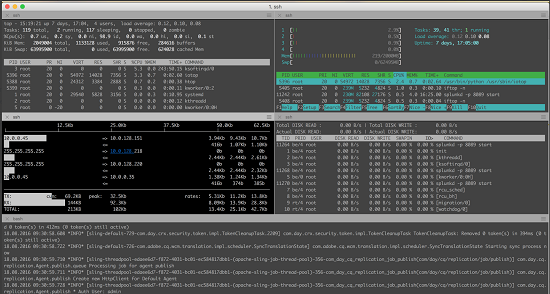

# Bonnes pratiques de surveillance de déploiement d’[!DNL Adobe Experience Manager Assets] {#assets-monitoring-best-practices}

La surveillance dans [!DNL Experience Manager Assets] implique l’observation et le suivi des technologies et processus suivants :

* Processeur système
* Utilisation de la mémoire système
* Délai d’attente d’E/S du disque système
* IO du réseau système
* JMX MBeans pour l’utilisation du tas et des processus asynchrones, tels que les workflows
* Contrôles de l’intégrité de la console OSGi

Typiquement, la surveillance d’[!DNL Experience Manager Assets] peut être effectuée de deux façons : en temps réel ou sur le long terme.

## Surveillance en temps réel {#live-monitoring}

Vous devez effectuer une surveillance en direct pendant la phase de test des performances de votre développement ou lors de situations de charge élevée afin de comprendre les caractéristiques de performances de votre environnement. En règle générale, la surveillance en direct doit être effectuée à l’aide d’une suite d’outils. Voici quelques recommandations :

* [Visual VM](https://visualvm.github.io/) : Visual VM vous permet d’afficher des informations détaillées sur la machine virtuelle Java, et notamment l’utilisation du processeur et de la mémoire Java. En outre, il vous permet de tester et d’évaluer le code exécuté sur un déploiement.
* [Haut](https://man7.org/linux/man-pages/man1/top.1.html): Top est une commande Linux qui ouvre un tableau de bord, qui affiche les statistiques d’utilisation, y compris l’utilisation du processeur, de la mémoire et des E/S. Il fournit un aperçu général de ce qui se passe sur une instance.
* [Htop](https://hisham.hm/htop/): Htop est une visionneuse de processus interactive. Il fournit une utilisation détaillée du processeur et de la mémoire en plus de ce que Top peut fournir. Htop peut être installé sur la plupart des systèmes Linux en utilisant `yum install htop` ou `apt-get install htop`.

* Iotop : Iotop fournit un tableau de bord détaillé sur l’utilisation des disques en lecture/écriture. Il fournit des informations détaillées sur les processus qui utilisent les E/S sur les disques ainsi que le volume utilisé. Iotop peut être installé sur la plupart des systèmes Linux en utilisant `yum install iotop` ou `apt-get install iotop`.

* [Iftop](https://www.ex-parrot.com/pdw/iftop/): Iftop affiche des informations détaillées sur l’utilisation de l’Ethernet/du réseau. Iftop affiche les statistiques par canal de communication sur les entités utilisant Ethernet et la quantité de bande passante utilisée. Iftop peut être installé sur la plupart des systèmes Linux en utilisant `yum install iftop` ou `apt-get install iftop`.

* Java Flight Recorder (JFR) : JFR est un outil Oracle pouvant être utilisé gratuitement dans les environnements qui ne sont pas destinés à l’exploitation. Pour des informations détaillées, reportez-vous à la section relative à [l’utilisation de Java Flight Recorder pour diagnostiquer les problèmes d’exécution de CQ](https://cq-ops.tumblr.com/post/73865704329/how-to-use-java-flight-recorder-to-diagnose-cq).
* Fichier `error.log` [!DNL Experience Manager] : vous pouvez consulter le fichier `error.log` [!DNL Experience Manager] pour obtenir plus de détails sur les erreurs enregistrées par le système. Utilisez la commande `tail -F quickstart/logs/error.log` pour identifier les erreurs à étudier.
* [Console d’administration des workflow](/help/sites-administering/workflows.md) : utilisez la console d’administration des workflow pour suivre les workflow en retard ou bloqués.

Ces outils vous permettent d’obtenir une vue globale des performances de votre déploiement [!DNL Experience Manager].

>[!NOTE]
>
>Ces outils sont des outils standard qui ne sont pas directement pris en charge par Adobe. Elles ne nécessitent pas de licences supplémentaires.

*Image : surveillance en direct à l’aide de l’outil Visual VM.*

## Surveillance à long terme {#long-term-monitoring}

La surveillance à long terme d’une instance consiste à surveiller pendant une longue période les mêmes portions de l’instance [!DNL Experience Manager] que vous avez surveillées en temps réel. Elle comprend également la définition d’alertes spécifiques à votre environnement.

### Agrégation des logs et création de rapports {#log-aggregation-and-reporting}

Plusieurs outils sont disponibles pour agréger les journaux, par exemple Splunk(TM) et Elastic Search, Logstash et Kabana (ELK). Pour évaluer la disponibilité de votre déploiement [!DNL Experience Manager], il est important de comprendre les événements de journal spécifiques à votre système et de créer des alertes basées sur ces événements. Une bonne connaissance de votre développement et des pratiques opérationnelles peut vous aider à mieux comprendre comment adapter le processus d’agrégation des journaux pour générer des alertes critiques.

### Surveillance de l’environnement {#environment-monitoring}

La surveillance de l’environnement comprend la surveillance des éléments suivants :

* Débit réseau
* IO de disque
* Mémoire
* Utilisation du processeur
* MBeans JMX
* Sites externes

Vous avez besoin d’outils externes, tels que NewRelic(TM) et AppDynamics(TM), pour surveiller chaque élément. Grâce à ces outils, vous pouvez définir des alertes spécifiques à votre système, par exemple une utilisation élevée du système, une sauvegarde des workflows, des échecs de contrôle de l’intégrité ou un accès non authentifié à votre site web. Adobe ne recommande aucun outil particulier par rapport aux autres. Recherchez l’outil qui vous convient et utilisez-le pour surveiller les éléments abordés.

#### Surveillance des applications internes {#internal-application-monitoring}

La surveillance des applications internes consiste à surveiller les composants d’application qui constituent la pile [!DNL Experience Manager], notamment JVM et le référentiel de contenu. Elle inclut également la surveillance via le code d’application personnalisé intégré à la plateforme. En général, elle se fait via les MBeans JMX qui peuvent être contrôlés directement par de nombreuses et solutions de contrôle populaires telles que SolarWinds (TM), HP OpenView(TM), Hyperic(TM), Zabbix(TM) et bien d’autres encore. Pour les systèmes qui ne prennent pas en charge une connexion directe à JMX, vous pouvez écrire des scripts shell pour extraire les données JMX et les exposer à ces systèmes dans un format qu’ils comprennent nativement.

Par défaut, l’accès à distance aux JMX MBeans n’est pas activé. Pour plus d’informations sur la surveillance via JMX, reportez-vous à la section [Surveillance et gestion à l’aide de la technologie JMX](https://docs.oracle.com/javase/7/docs/technotes/guides/management/agent.html).

Dans de nombreux cas, une ligne de base est nécessaire pour contrôler efficacement une statistique. Pour créer une ligne de base, observez le système dans des conditions de travail normales pendant une période prédéterminée, puis identifiez la mesure normale.

**Surveillance JVM**

Comme toutes les piles d’application basées sur Java, [!DNL Experience Manager] dépend des ressources qui lui sont fournies via la machine virtuelle Java sous-jacente. Vous pouvez surveiller l’état de plusieurs de ces ressources via les MXBeans Platform qui sont exposés par JVM. Pour plus d’informations sur les MXBeans, voir [Utilisation du serveur MBean de plateforme et des MXBeans de plateforme](https://docs.oracle.com/javase/7/docs/technotes/guides/management/mxbeans.html).

Voici quelques paramètres de référence que vous pouvez surveiller pour JVM :

Mémoire

* `MBean: lava.lang:type=Memory`
* URL : `/system/console/jmx/java.lang:type=Memory`
* Instances : tous les serveurs
* Seuil d’alarme : lorsque l’utilisation de la mémoire de tas ou non de tas dépasse 75 % de la mémoire maximale correspondante.
* Définition de l’alarme : la mémoire système est insuffisante ou le code contient une fuite de mémoire. Analysez un vidage de thread pour obtenir une définition.

>[!NOTE]
>
>Les informations fournies par ce bean sont exprimées en octets.

Threads

* MBean : `java.lang:type=Threading`
* URL : `/system/console/jmx/java.lang:type=Threading`
* Instances : tous les serveurs
* Seuil d’alarme : lorsque le nombre de threads est supérieur à 150 % de la ligne de base.
* Définition de l’alarme : soit il existe un processus d’exécution actif, soit une opération inefficace consomme une grande quantité de ressources. Analysez un vidage de thread pour obtenir une définition.

**Surveiller[!DNL Experience Manager]**

[!DNL Experience Manager] présente également un ensemble de statistiques et d’opérations via JMX. Elles peuvent vous aider à évaluer l’état de santé du système et à identifier les éventuels problèmes avant qu’ils n’affectent les utilisateurs. Pour plus d’informations, reportez-vous à la [documentation](/help/sites-administering/jmx-console.md) sur les JMX MBeans d’[!DNL Experience Manager].

Voici quelques paramètres de référence que vous pouvez surveiller pour [!DNL Experience Manager] :

Agents de réplication

* MBean : `com.adobe.granite.replication:type=agent,id="<AGENT_NAME>"`
* URL : `/system/console/jmx/com.adobe.granite.replication:type=agent,id="<AGENT_NAME>"`
* Instances : un auteur et toutes les instances de publication (pour les agents de purge)
* Seuil d’alarme : lorsque `QueueBlocked` a la valeur `true` ou lorsque la valeur de `QueueNumEntries` est supérieure de 150 % à la valeur de référence.

* Définition de l’alarme : présence d’une file d’attente bloquée dans le système indiquant que la cible de réplication est hors service ou inatteignable. Souvent, les problèmes de réseau ou d’infrastructure entraînent la mise en file d’attente d’entrées excessives, ce qui peut avoir un impact négatif sur les performances du système.

>[!NOTE]
>
>Pour les paramètres d’URL et MBean, remplacez `<AGENT_NAME>` par le nom de l’agent de réplication que vous voulez surveiller.

Décompte du nombre de sessions

* MBean : `org.apache.jackrabbit.oak:id=7,name="OakRepository Statistics",type="RepositoryStats"`
* URL : */system/console/jmx/org.apache.jackrabbit.oak:id=7,name=&quot;OakRepository Statistics&quot;,type*=&quot;RepositoryStats&quot;
* Instances : tous les serveurs
* Seuil d’alarme : lorsque les sessions ouvertes dépassent la ligne de base de plus de 50 %.
* Définition de l’alarme : les sessions peuvent être ouvertes par le biais d’un morceau de code et ne jamais se fermer. Cela peut se produire lentement au fil du temps et entraîner des fuites de mémoire dans le système. Le nombre de sessions doit fluctuer sur un système, mais il ne doit pas augmenter de manière continue.

Contrôles d’intégrité

Les contrôles d’intégrité disponibles dans la variable [tableau de bord des opérations](/help/sites-administering/operations-dashboard.md#health-reports) possèdent les MBeans JMX correspondants pour la surveillance. Cependant, vous pouvez écrire des contrôles d’intégrité personnalisés pour afficher des statistiques système supplémentaires.

Voici quelques contrôles d’intégrité prêts à l’emploi qui s’avèrent utiles à la surveillance :

* Contrôles système
   * MBean : `org.apache.sling.healthcheck:name=systemchecks,type=HealthCheck`
   * URL : `/system/console/jmx/org.apache.sling.healthcheck:name=systemchecks,type=HealthCheck`
   * Instances : un auteur, tous les serveurs de publication
   * Seuil d’alarme : lorsque l’état n’est pas OK
   * Définition de l’alarme : l’état de l’une des mesures est AVERTISSEMENT ou CRITIQUE. Vérifiez l’attribut de journal pour plus d’informations sur la cause du problème.

* File d’attente de réplication

   * MBean : `org.apache.sling.healthcheck:name=replicationQueue,type=HealthCheck`
   * URL : `/system/console/jmx/org.apache.sling.healthcheck:name=replicationQueue,type=HealthCheck`
   * Instances : un auteur, tous les serveurs de publication
   * Seuil d’alarme : lorsque l’état n’est pas OK
   * Définition de l’alarme : l’état de l’une des mesures est AVERTISSEMENT ou CRITIQUE. Vérifiez l’attribut de journal pour plus d’informations sur la file d’attente à l’origine du problème.

* Performances des réponses

   * MBean : `org.apache.sling.healthcheck:name=requestsStatus,type=HealthCheck`
   * URL : `/system/console/jmx/org.apache.sling.healthcheck:name=requestsStatus,type=HealthCheck`
   * Instances : tous les serveurs
   * Durée de l’alarme : lorsque l’état n’est pas OK
   * Définition de l’alarme : l’état de l’une des mesures est AVERTISSEMENT ou CRITIQUE. Vérifiez l’attribut de journal pour plus d’informations sur la file d’attente à l’origine du problème.

* Performances des requêtes

   * MBean : `org.apache.sling.healthcheck:name=queriesStatus,type=HealthCheck`
   * URL : `/system/console/jmx/org.apache.sling.healthcheck:name= queriesStatus,type=HealthCheck`
   * Instances : un auteur, tous les serveurs de publication
   * Seuil d’alarme : lorsque l’état n’est pas OK
   * Définition de l’alarme : une ou plusieurs requêtes s’exécutent lentement dans le système. Vérifiez l’attribut de journal pour plus d’informations sur les requêtes à l’origine du problème.

* Lots actifs

   * MBean : `org.apache.sling.healthcheck:name=inactiveBundles,type=HealthCheck`
   * URL : `/system/console/jmx/org.apache.sling.healthcheck:name=inactiveBundles,type=HealthCheck`
   * Instances : tous les serveurs
   * Seuil d’alarme : lorsque l’état n’est pas OK
   * Définition de l’alarme : présence de lots OSGi inactifs ou non résolus sur le système. Vérifiez l’attribut de journal pour plus d’informations sur les lots à l’origine du problème.

* Erreurs de journal

   * MBean : `org.apache.sling.healthcheck:name=logErrorHealthCheck,type=HealthCheck`
   * URL : `/system/console/jmx/org.apache.sling.healthcheck:name=logErrorHealthCheck,type=HealthCheck`
   * Instances : tous les serveurs
   * Seuil d’alarme : lorsque l’état n’est pas OK
   * Définition de l’alarme : les fichiers journaux contiennent des erreurs. Vérifiez l’attribut de journal pour plus d’informations sur la cause du problème.

## Problèmes courants et solutions  {#common-issues-and-resolutions}

Si vous rencontrez des problèmes lors du processus de surveillance, voici quelques solutions permettant de résoudre les problèmes courants des déploiement [!DNL Experience Manager] :

* Si vous utilisez TarMK, exécutez souvent la compression Tar. Pour plus d’informations, consultez [Maintien du référentiel](/help/sites-deploying/storage-elements-in-aem-6.md#maintaining-the-repository).
* Vérifiez les journaux `OutOfMemoryError`. Pour plus d’informations, reportez-vous à [Analyse des problèmes de mémoire](https://experienceleague.adobe.com/docs/experience-cloud-kcs/kbarticles/KA-17482.html?lang=fr).

* Recherchez dans les journaux des références à des requêtes non indexées, à des traversées d’arborescence ou à des traversées d’index. Elles indiquent des requêtes non indexées ou des requêtes incorrectement indexées. Pour connaître les bonnes pratiques en matière d’optimisation des performances des requêtes et de l’indexation, reportez-vous à la section [Bonnes pratiques relatives aux requêtes et à l’indexation](/help/sites-deploying/best-practices-for-queries-and-indexing.md).
* Utilisez la console de workflow pour vérifier que vos workflows fonctionnent comme prévu. Si possible, condensez plusieurs workflows en un seul workflow.
* Revoyez la surveillance en temps réel et recherchez toute congestion supplémentaire ou recherchez les processus fortement consommateurs de certaines ressources spécifiques.
* Vérifiez les points de sortie du réseau client et les points d’entrée au réseau de déploiement d’[!DNL Experience Manager], Dispatcher compris. Souvent, il s&#39;agit de zones de goulot d&#39;étranglement. Pour plus d’informations, voir [Considérations sur le réseau d’Assets](/help/assets/assets-network-considerations.md).
* Augmentez la taille de votre serveur [!DNL Experience Manager]. Il est possible que la capacité de votre déploiement d’[!DNL Experience Manager] ne soit pas adaptée. L’assistance clientèle d’Adobe peut vous aider à déterminer si votre serveur est sous-dimensionné.
* Consultez les fichiers `access.log` et `error.log` pour trouver les entrées situées autour du moment où le problème est survenu. Recherchez des modèles susceptibles d’indiquer des anomalies de code personnalisé. Ajoutez-les à la liste des événements que vous surveillez.
