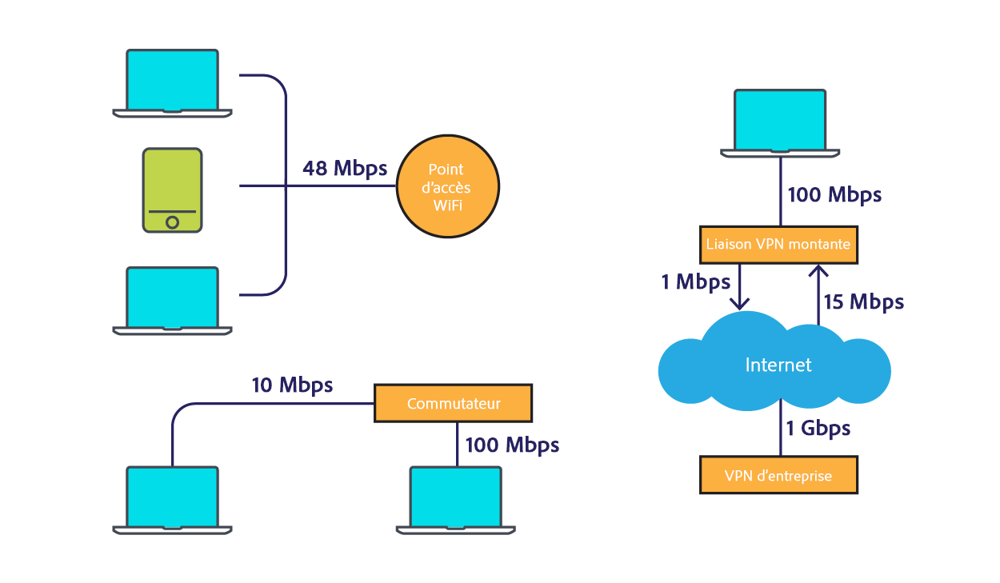
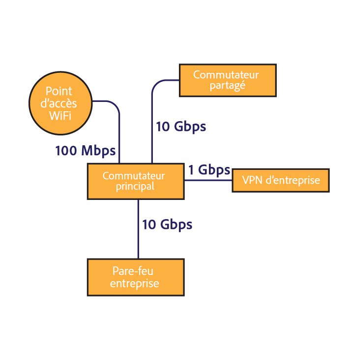
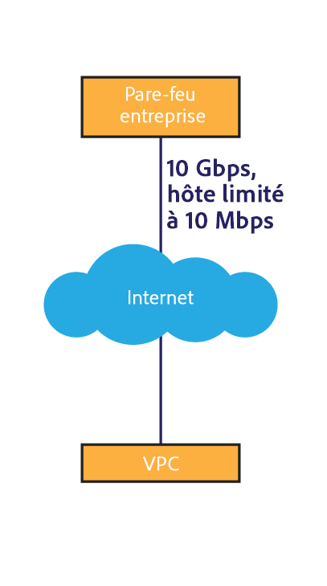
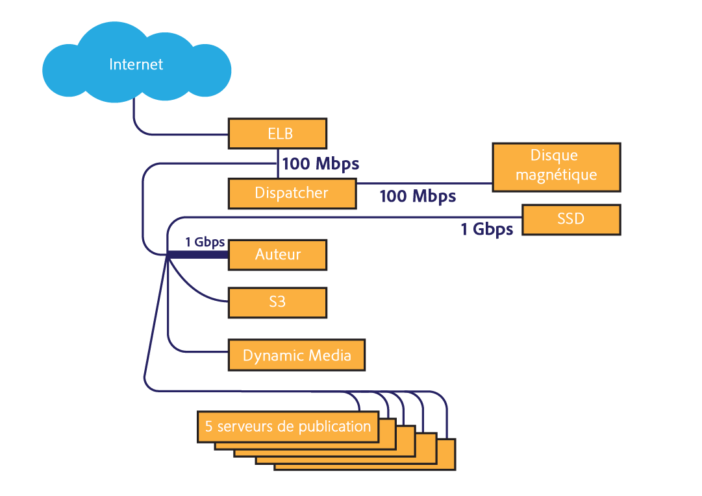
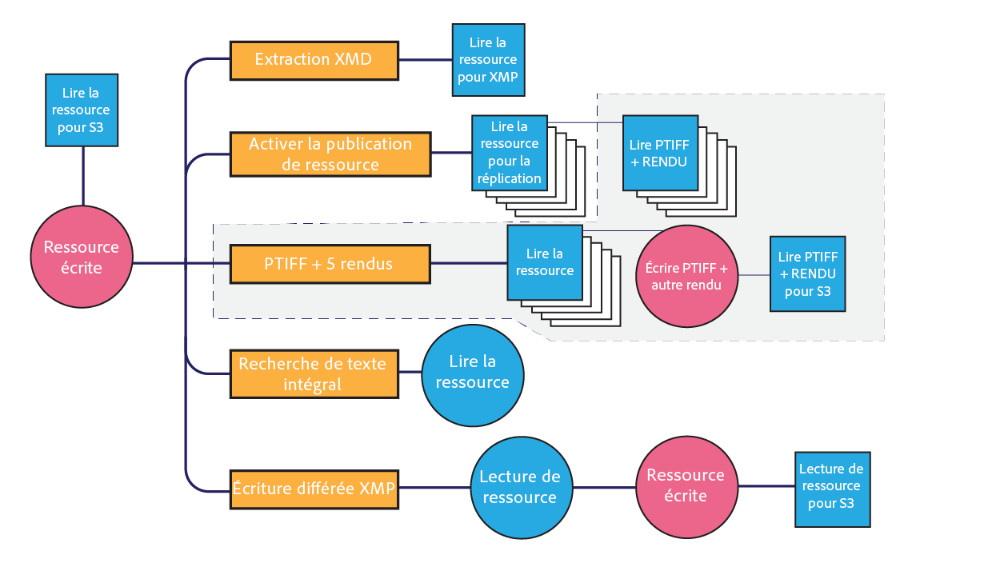

# [!DNL Assets] considérations relatives au réseau {#assets-network-considerations}

Comprendre votre réseau est aussi important que comprendre [!DNL Adobe Experience Manager Assets]. Le réseau peut affecter les chargements, les téléchargements et l’expérience utilisateur. La création d’un diagramme de la topologie du réseau vous permet d’identifier les goulots d’étranglement et les zones sous-optimisées du réseau que vous devez optimiser pour améliorer les performances du réseau et l’expérience de l’utilisateur.

Veillez à inclure les éléments suivants dans votre diagramme de réseau :

* La connectivité du périphérique client (par exemple, l’ordinateur, le mobile ou la tablette) au réseau.
* La topologie du réseau d’entreprise.
* Uplink to the internet from the corporate network and the [!DNL Experience Manager] environment.
* Topology of the [!DNL Experience Manager] environment.
* Define simultaneous consumers of the [!DNL Experience Manager] network interface.
* Workflows définis du [!DNL Experience Manager] déploiement.

## Connectivité de l’appareil client au réseau d’entreprise {#connectivity-from-the-client-device-to-the-corporate-network}

Commencez par créer le diagramme de la connectivité entre les différents périphériques client et le réseau d’entreprise. À ce stade, identifiez les ressources partagées, telles que les connexions Wi-Fi, pour lesquelles plusieurs utilisateurs accèdent au même point ou commutateur Ethernet pour transférer et télécharger des ressources.

Les périphériques client se connectent au réseau d’entreprise de différentes façons, telles que le wi-fi, Ethernet sur un commutateur partagé et le VPN. Identifying and understanding chokepoints on this network is important for [!DNL Assets] planning and to modify the network.

En haut à gauche du diagramme, on peut voir trois périphériques partageant un point d’accès WiFi de 48 Mbps. Si tous les périphériques effectuent un chargement simultané, la bande passante du réseau wi-fi est partagée entre les périphériques. Par rapport à l&#39;ensemble du système, un utilisateur peut rencontrer un point d&#39;étranglement différent pour les trois clients sur ce canal divisé.

La mesure de la vitesse réelle d’un réseau Wi-Fi est complexe, car un périphérique lent peut impacter d’autres clients sur le point d’accès. Si vous prévoyez d’utiliser le Wi-Fi pour manipuler les ressources, effectuez un test de vitesse sur plusieurs clients en même temps pour évaluer le débit.

Le coin inférieur gauche du graphique présente deux périphériques connectés au réseau d’entreprise via des canaux indépendants. Par conséquent, chaque périphérique peut atteindre une vitesse comprise entre 10 Mbps et 100 Mbps.

L’ordinateur présenté à droite, connecté au réseau d’entreprise via un VPN, a un débit limité, avec une vitesse de 1 Mbps. L’expérience utilisateur est totalement différente avec une connexion de 1 Mbps et avec une connexion de 1 Gbps. En fonction de la taille des ressources que les utilisateurs manipulent, leur liaison VPN peut s’avérer insuffisante pour la tâche.

## La topologie du réseau d’entreprise  {#topology-of-the-corporate-network}

Le diagramme présente des vitesses de liaison plus élevées au sein du réseau d’entreprise que ce qui est généralement utilisé. Ces canaux sont des ressources partagées. Si le commutateur partagé est censé gérer 50 clients, il peut s&#39;agir d&#39;un point d&#39;étranglement. Dans le diagramme initial, seuls deux ordinateurs partagent la connexion.

## Uplink to the internet from the corporate network and [!DNL Experience Manager] environment {#uplink-to-the-internet-from-the-corporate-network-and-aem-environment}

Il est important de prendre en compte les facteurs inconnus de la connexion Internet et VPC, car la bande passante sur Internet peut être restreinte par des pics de chargement ou des pannes de fournisseur à grande échelle. En général, une connexion Internet est fiable. Toutefois, cela peut parfois entraîner la création de goulots d’étranglement.

Au niveau de la liaison du réseau d’entreprise à Internet, il peut exister d’autres services utilisant la bande passante. Il est important de connaître la quantité de bande passante pouvant être dédiée ou donnée en priorité à Assets. For example, if a 1 Gbps link is already at 80% utilization, you can only allocate a maximum of 20% of the bandwidth for [!DNL Experience Manager Assets].

Les pare-feu et les proxys de l’entreprise peuvent également influencer la bande passante de différentes manières. Ce type de périphérique peut prioriser la qualité du service de la bande passante, définir la bande passante maximale par utilisateur ou les limites de débit par hôte. These are important chokepoints to examine as they can significantly impact [!DNL Assets] user experience.

Dans cet exemple, l’entreprise dispose d’une liaison de 10 Gbps. Cela doit être suffisant pour prendre en charge plusieurs clients. Par ailleurs, le pare-feu impose une limite de débit par hôte de 10 Mbps. Cette restriction risque de ralentir le trafic d’un seul hôte à 10 Mbps, même si la liaison montante à l’Internet est de 10 Gbps.

Il s&#39;agit du plus petit point d&#39;étranglement orienté client. Cependant, vous pouvez évaluer une modification ou configurer une liste autorisée avec le groupe d&#39;opérations réseau responsable de ce pare-feu.

Les exemples de diagrammes vous permettent de conclure que six périphériques partagent un canal conceptuel de 10 Mbps. Selon la taille des ressources exploitées, cela peut s’avérer insuffisant pour répondre aux attentes de l’utilisateur.

## Topology of the [!DNL Experience Manager] environment {#topology-of-the-aem-environment}

Designing the topology of the [!DNL Experience Manager] environment requires detailed knowledge of the system configuration and how the network is connected within the user environment.

L’exemple de scénario comprend une batterie de publication dotée de cinq serveurs, une banque de données binaires S3 et un Contenu multimédia dynamique.

The dispatcher shares it&#39;s 100Mbps connection with two entities, the outside world and the [!DNL Experience Manager] deployment. Pour les opérations simultanées de chargement et de téléchargement, vous devez diviser ce nombre par deux. L’espace de stockage externe joint utilise une connexion distincte.

The [!DNL Experience Manager] deployment shares it&#39;s 1Gbps connection with multiple services. Du point de vue de la topologie du réseau, cela équivaut à partager un seul canal avec plusieurs services.

Reviewing the network from the client device to the [!DNL Experience Manager] deployment, the smallest choke-point appears to be the 10 Mbit enterprise firewall throttle. Vous pouvez utiliser ces valeurs dans le calcul de dimensionnement du [Guide du dimensionnement des ressources](assets-sizing-guide.md) pour déterminer l’expérience de l’utilisateur.

## Workflows définis du [!DNL Experience Manager] déploiement {#defined-workflows-of-the-aem-deployment}

En tenant compte des performances du réseau, il peut être important de prendre en considération les workflows et la publication qui auront lieu dans le système. De plus, S3 ou tout autre stockage en réseau que vous utilisez, ainsi que les requêtes E/S consomment de la bande passante du réseau. Par conséquent, même dans un réseau entièrement optimisé, la performance peut être limitée par les E/S du disque.

Pour simplifier les processus d’assimilation des ressources (notamment lors du chargement d’un grand nombre de ressources), vous devez explorer leurs workflows et en savoir plus sur leur configuration.

Lors de l’évaluation de la topologie interne du workflow, vous devez analyser ce qui suit :

* Les procédures d’écriture d’une ressource
* Les workflows/événements qui se déclenchent lorsqu’une ressource ou une métadonnée est modifiée
* Procédures de lecture d’une ressource

Voici quelques éléments à vérifier :

* XMP métadonnées en lecture/écriture différée
* Activation et réplication automatiques
* Application d’un filigrane  
* Assimilation de sous-ressources/Extraction de pages
* Chevauchement des workflows.

Voici un exemple de client pour la définition d’un workflow de ressource.

