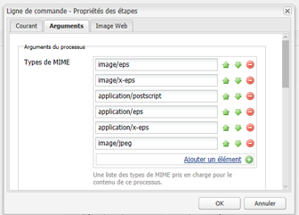
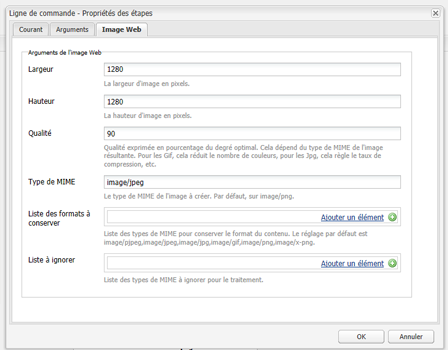
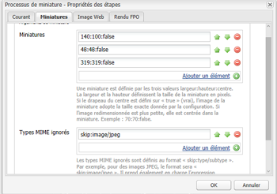
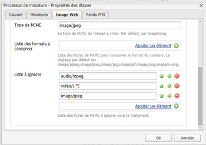

# Installation et configuration d’ImageMagick pour une utilisation avec AEM Assets{#install-and-configure-imagemagick-to-work-with-aem-assets}

ImageMagick est un module logiciel permettant de créer, modifier, composer ou convertir des images bitmap. Il peut lire et écrire des images dans divers formats (plus de 200), notamment PNG, JPEG, JPEG-2000, GIF, TIFF, DPX, EXR, WebP, Postscript, PDF et SVG. Utilisez ImageMagick pour redimensionner, réaliser une symétrie, effectuer un miroir, faire pivoter, déformer, cisailler et transformer des images. Vous pouvez également régler les couleurs des images, ainsi qu’appliquer divers effets spéciaux, ou tracer du texte, des lignes, des polygones, des ellipses et des courbes à l’aide d’ImageMagick.

Utilisez le gestionnaire de médias d’Adobe Experience Manager (AEM) à partir de la ligne de commande afin de traiter les images via ImageMagick. Pour utiliser plusieurs formats de fichiers avec ImageMagick, voir [Meilleures pratiques relatives au format de fichier des ressources](/help/assets/assets-file-format-best-practices.md). Pour connaître tous les formats de fichiers pris en charge, voir [Formats de ressources pris en charge](/help/assets/assets-formats.md).

Pour traiter des fichiers volumineux à l’aide d’ImageMagick, veuillez tenir compte de besoins en mémoire plus élevés que d’habitude, des modifications potentielles requises pour les stratégies IM, ainsi que de l’impact global sur les performances. La mémoire requise dépend de divers facteurs tels que la résolution, la profondeur des couleurs, le profil colorimétrique et le format de fichier. Si vous envisagez de traiter des fichiers très volumineux à l’aide d’ImageMagick, effectuez correctement le test des performances du serveur AEM. Certaines ressources utiles sont fournies à la fin.

>[!NOTE]
>
>Si vous utilisez AEM sur Adobe Managed Services (AMS), contactez le service à la clientèle d’Adobe si vous prévoyez de traiter de nombreux fichiers PSD ou PSB haute résolution. Experience Manager peut ne pas traiter les fichiers PSB haute résolution de plus de 3 000 x 2 3 000 pixels.

## Installation d’ImageMagick {#installing-imagemagick}

Plusieurs versions des fichiers d’installation d’ImageMagic sont disponibles pour les différents systèmes d’exploitation. Utilisez la version appropriée pour votre système d’exploitation.

1. Download the appropriate [ImageMagick installation files](https://www.imagemagick.org/script/download.php) for your operating system.
1. Pour installer ImageMagick sur le disque hébergeant le serveur AEM, lancez le fichier d’installation.

1. Définissez la variable de chemin d’environnement sur le répertoire d’installation d’ImageMagick.
1. Pour vérifier si l’installation est réussie, exécutez la commande `identify -version`.

## Configuration de l’étape de processus de ligne de commande {#set-up-the-command-line-process-step}

Vous pouvez configurer l’étape de processus de ligne de commande en fonction de votre cas d’utilisation. Perform these steps to generate a flipped image and thumbnails (140x100, 48x48, 319x319, and 1280x1280) each time you add a JPEG image file to `/content/dam` on the AEM server:

1. On the AEM server, go to the Workflow console (`https://[aem_server]:[port]/workflow`) and open the **[!UICONTROL DAM Update Asset]** workflow model.
1. From the **[!UICONTROL DAM Update Asset]** workflow model, open the **[!UICONTROL EPS thumbnails (powered by ImageMagick)]** step.
1. In the **[!UICONTROL Arguments tab]**, add `image/jpeg` to the **[!UICONTROL Mime Types]** list.

   

1. Dans le champ **[!UICONTROL Commandes]**, saisissez la commande suivante :

   `convert ./${filename} -flip ./${basename}.flipped.jpg`

1. Select the **[!UICONTROL Delete Generated Rendition]** and **[!UICONTROL Generate Web Rendition]** flags.

   

1. Sous l’onglet **[!UICONTROL Image web]**, spécifiez les détails du rendu avec des dimensions de 1 280 x 1 280 pixels. Spécifiez également `image/jpeg` dans la zone **[!UICONTROL Mimetype]** .

   

1. Pour enregistrer les modifications, cliquez sur **[!UICONTROL OK.]**

   >[!NOTE]
   >
   >The `convert` command may not run with certain Windows versions (for example Windows SE), because it conflicts with the native `convert` utility that is part of Windows installation. Dans ce cas, précisez le chemin complet de l’utilitaire ImageMagick. Par exemple, spécifiez :
   >
   >
   >`"C:\Program Files\ImageMagick-6.8.9-Q16\convert.exe" -define jpeg:size=319x319 ./${filename} -thumbnail 319x319 cq5dam.thumbnail.319.319.png`

1. Open the **[!UICONTROL Process Thumbnails]** step, and add the MIME type `image/jpeg` under **[!UICONTROL Skip Mime Types]**.

   

1. In the **[!UICONTROL Web Enabled Image]** tab, add the MIME type `image/jpeg` under the **[!UICONTROL Skip List]**. Pour enregistrer les modifications, cliquez sur **[!UICONTROL OK.]**

   

1. Enregistrez le workflow.
1. Pour vérifier si ImageMagick peut traiter les images correctement, téléchargez une image .jpg vers AEM Assets. Vérifiez si une image inversée et les rendus sont générés.

## Réduction des vulnérabilités en matière de sécurité {#mitigating-security-vulnerabilities}

Il existe plusieurs vulnérabilités de sécurité liées à l’utilisation d’ImageMagick pour traiter les images. Par exemple, le traitement d’images envoyées par l’utilisateur entraîne un risque d’exécution de code à distance (RCE).

En outre, plusieurs modules externes de traitement d’images dépendent de la bibliothèque ImageMagick, y compris, sans s’y limiter, imagick de PHP, rmagick et paperclip de Ruby, et imagemagick de nodejs.

Si vous utilisez ImageMagick ou une bibliothèque affectée, Adobe vous recommande de limiter les vulnérabilités connues en réalisant au moins l’une des tâches suivantes (de préférence les deux) :

1. Verify that all image files begin with the expected [&quot;magic bytes&quot;](https://en.wikipedia.org/wiki/List_of_file_signatures) corresponding to the image file types you support before sending them to ImageMagick for processing.
1. Utilisez un fichier de stratégie pour désactiver les codeurs ImageMagick vulnérables. The global policy for ImageMagick is found at `/etc/ImageMagick`.
