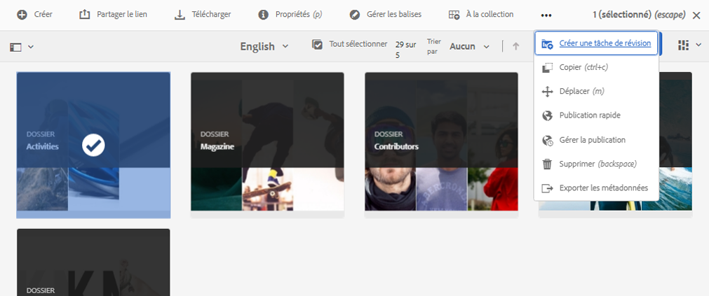

# Configuration de l’intégration d’AEM Assets à Brand Portal {#configure-aem-assets-integration-with-brand-portal}

Si vous êtes un client du portail des ressources d’Adobe Experience Manager (AEM), vous pouvez intégrer AEM Assets au portail des marques afin de permettre la publication des ressources sur le portail des marques. Vous pouvez installer cette intégration à travers l’interface Adobe.io.

Pour commencer, créez une application (contenant un mécanisme d’authentification) dans la passerelle publique Marketing Cloud. Créez ensuite un profil dans votre instance AEM Assets à l’aide de l’ID d’application obtenu via la passerelle.

Utilisez cette fonctionnalité pour publier des ressources à partir d’AEM Assets sur Brand Portal. À l’arrière-plan, le serveur AEM authentifie votre profil avec la passerelle, puis intègre AEM Assets à Brand Portal.

>[!NOTE]
>
>The User Interface for configuring oAuth integrations is hosted in [https://legacy-oauth.cloud.adobe.io/](https://legacy-oauth.cloud.adobe.io/), which was earlier hosted in [https://marketing.adobe.com/developer/](https://marketing.adobe.com/developer/).

## Création d’une application JWT {#create-jwt-application}

1. Login to [https://legacy-oauth.cloud.adobe.io/](https://legacy-oauth.cloud.adobe.io/) with your Adobe ID. **La page Applications** JWT s’ouvre.

   >[!NOTE]
   >
   >Vous ne pouvez créer un ID d’application que si vous êtes l’administrateur système de votre entreprise. Le client est le nom technique de votre entreprise enregistré auprès d’Adobe Marketing Cloud.

1. Select **[!UICONTROL Add Application]** to create an application.
1. Spécifiez le nom de l’application et une description facultative.
1. Dans la liste **[!UICONTROL Organisation]**, sélectionnez l’organisation pour laquelle vous souhaitez synchroniser les ressources.
1. From the **[!UICONTROL Scope]** list, select **[!UICONTROL dam-read]**, **[!UICONTROL dam-sync]**, **[!UICONTROL dam-write]**, and **[!UICONTROL cc-share]**.
1. Cliquez sur **[!UICONTROL Ajouter]**. Une application Service JWT est créée. Vous pouvez modifier l’application et enregistrer.
1. Copiez l’ID d’application généré pour la nouvelle application.

   >[!NOTE]
   >
   >Assurez-vous de ne pas copier par inadvertance le secret d’application au lieu de l’ID d’application.

## Création d’une configuration de cloud {#create-a-new-cloud-configuration}

1. From the **[!UICONTROL Navigation]** page of your local AEM Assets instance, click **[!UICONTROL Tools]** icon on the left.

1. Navigate to **[!UICONTROL Cloud Services]>[!UICONTROL Legacy Cloud Services]**.

   

1. In **[!UICONTROL Cloud Services]**, locate the **[!UICONTROL Assets Brand Portal]** service under **[!UICONTROL Adobe Experience Cloud]**.

   

1. Click **[!UICONTROL Configure now]** link below the service to display the **[!UICONTROL Create Configuration]** dialog.
1. In **[!UICONTROL Create Configuration]** dialog, specify a title and name for the new configuration and click **[!UICONTROL Create]**.

   

1. In the **[!UICONTROL AEM Assets Brand Portal Replication]** dialog, specify the URL of your organization in the **[!UICONTROL Tenant URL]** field.
1. Dans le champ **[!UICONTROL ID client]**, collez l’ID d’application que vous avez copié à la fin de la procédure [Création d’une application](/help/assets/brand-portal-configuring-integration.md#create-jwt-application). **[!UICONTROL Cliquez sur OK]**.

   

1. To make the assets (published from AEM) publicly available to general users of Brand Portal, enable the **[!UICONTROL Public Folder Publish]** check box .

   >[!NOTE]
   >
   >L’option **[!UICONTROL Publication de dossier public]** est disponible à compter d’AEM 6.3.2.1.

1. Sur la page **[!UICONTROL Configuration de Brand Portal]**, cliquez sur **[!UICONTROL Afficher la clé publique]** afin d’afficher la clé publique générée pour votre instance.

   

   Alternatively, click **[!UICONTROL Download Public Key for OAuth Gateway]** to download the file containing the public key. Ouvrez ensuite le fichier pour afficher la clé publique.

## Activation de l’intégration {#enable-integration}

1. Display the public key using one of the following methods mentioned in the last step of the procedure [Add a new configuration to Marketing Cloud](/help/assets/brand-portal-configuring-integration.md#create-a-new-cloud-configuration).

   * Click **[!UICONTROL Display Public Key]** button to display the key.
   * Ouvrez le fichier téléchargé qui contient la clé.

1. Open the Marketing Cloud Developer Connection interface and click on the application you created in [Create an application](/help/assets/brand-portal-configuring-integration.md#create-jwt-application).
1. Collez la clé publique dans le champ **[!UICONTROL Clé publique]** de l’interface de configuration.
1. Cliquez sur **[!UICONTROL Enregistrer]**. Un message confirme que l’application a été mise à jour.

## Test de l’intégration {#test-the-integration}

1. From the **[!UICONTROL Navigation]** page of your local AEM Assets instance, click **[!UICONTROL Tools]** icon on the left.

1. Navigate to **[!UICONTROL Deployment]** > **[!UICONTROL Replication]**.

   

1. In the **[!UICONTROL Replication]** page, click **[!UICONTROL Agents on author]**.

   

1. Pour vérifier la connexion entre l’auteur AEM et Brand Portal, ouvrez n’importe lequel des quatre agents de réplication et cliquez sur **[!UICONTROL Tester la connexion]**.

   >[!NOTE]
   >
   >Les agents de réplication fonctionnent en parallèle et partagent la distribution des tâches de manière égale, augmentant ainsi la vitesse de publication de quatre fois la vitesse initiale. Une fois le service cloud configuré, une configuration supplémentaire n’est pas nécessaire pour activer les agents de réplication activés par défaut pour activer la publication parallèle de plusieurs ressources.

   >[!NOTE]
   >
   >Évitez de désactiver tout agent de réplication, car cela peut entraîner l’échec de la réplication de certaines ressources.

   

1. En bas des résultats du test, vérifiez que la réplication a réussi.

   

Une fois la réplication réussie, vous pouvez publier des ressources, des dossiers et des collections sur Brand Portal. Pour plus d’informations, voir :

* [Publication de ressources et de dossiers sur Brand Portal](/help/assets/brand-portal-publish-folder.md)
* [Publication de collections sur Brand Portal](/help/assets/brand-portal-publish-collection.md)

## Publication de ressources sur Brand Portal {#publish-assets-to-brand-portal}

Une fois la réplication réussie, vous pouvez publier des ressources, des dossiers et des collections sur Brand Portal. Pour publier des ressources sur Brand Portal, procédez comme suit :

>[!NOTE]
>
>Adobe recommande la publication décalée, de préférence en dehors des heures de pointe, de sorte que l’auteur AEM n’utilise pas une quantité excessive de ressources.

1. Dans la console Ressources, sélectionnez les ressources/le dossier à publier, puis cliquez sur l’option Publication **[!UICONTROL rapide]** dans la barre d’outils.

   Vous pouvez également sélectionner les ressources que vous voulez publier sur Brand Portal.

   

1. Pour publier les fichiers sur Brand Portal, vous disposez de deux options :
   * [Publication immédiate des fichiers](#publish-to-bp-now)
   * [Publier les ressources plus tard](#publish-to-bp-now)

### Publier les ressources maintenant {#publish-to-bp-now}

Pour publier les ressources sélectionnées sur Brand Portal, effectuez l’une des opérations suivantes :

* From the toolbar, select **[!UICONTROL Quick Publish]**. Then from the menu, select **[!UICONTROL Publish to Brand Portal]**.

* From the toolbar, select **[!UICONTROL Manage Publication]**.

   1. Then from the **[!UICONTROL Action]** select **[!UICONTROL Publish to Brand Portal]**, and from **[!UICONTROL Scheduling]** select **[!UICONTROL Now]**. Cliquez sur **[!UICONTROL Suivant]**.

   2. Within **[!UICONTROL Scope]**, confirm your selection and click **[!UICONTROL Publish to Brand Portal]**.

Un message indique que les ressources ont été placées en file d’attente pour publication sur Brand Portal. Connectez-vous à l’interface du portail des marques pour afficher les fichiers publiés.

### Publier les ressources plus tard {#publish-to-bp-later}

Pour planifier la publication des ressources sur Brand Portal à une date ou une heure ultérieure :

1. Once you have selected assets/ folders to publish, select **[!UICONTROL Manage Publication]** from the tool bar at the top.

1. On **[!UICONTROL Manage Publication]** page, select **[!UICONTROL Publish to Brand Portal]** from **[!UICONTROL Action]** and select **[!UICONTROL Later]** from **[!UICONTROL Scheduling]**.

   

1. Select an **[!UICONTROL Activation date]** and specify time. Cliquez sur **[!UICONTROL Suivant]**.

1. Select an **Activation date** and specify time. Cliquez sur **Suivant**.

1. Specify a **[!UICONTROL Workflow title]** in **[!UICONTROL Workflows]**. Click **[!UICONTROL Publish Later]**.

   

Désormais, connectez-vous au portail de marque pour savoir si les fichiers publiés sont disponibles dans l’interface du portail de marque.

