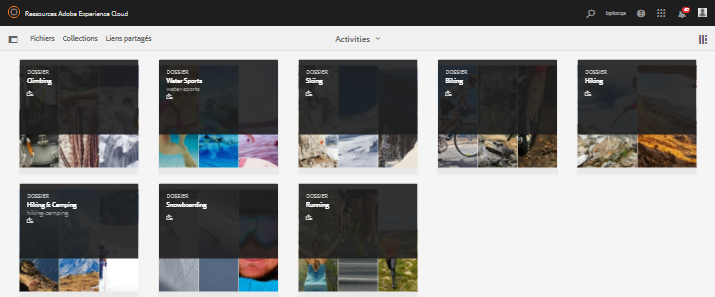

# Publication de ressources sur Brand Portal {#publish-assets-to-brand-portal}

| Version | Lien de l’article |
| -------- | ---------------------------- |
| AEM as a Cloud Service | [Cliquez ici](https://experienceleague.adobe.com/docs/experience-manager-cloud-service/content/assets/brand-portal/publish-to-brand-portal.html?lang=fr) |
| AEM 6.5 | Cet article |

En tant qu’administrateur d’Adobe Experience Manager (AEM) Assets, vous pouvez publier des ressources et des dossiers sur l’instance AEM Assets Brand Portal (ou planifier le workflow de planification à une date/heure ultérieure) pour votre organisation. Cependant, vous devez d’abord configurer AEM Assets avec Brand Portal. Pour plus de détails, voir [Configuration d’AEM Assets avec Brand Portal](/help/assets/configure-aem-assets-with-brand-portal.md).

Une fois la réplication réussie, vous pouvez publier des ressources, des dossiers et des collections sur Brand Portal. Pour publier des ressources sur Brand Portal, procédez comme suit :

>[!NOTE]
>
>Adobe recommande la publication décalée, de préférence en dehors des heures de pointe, de sorte que l’auteur AEM n’utilise pas une quantité excessive de ressources.

1. Dans la console Assets, sélectionnez les dossiers/ressources à publier, puis cliquez sur l’option **[!UICONTROL Publication rapide]** dans la barre d’outils.

   Vous pouvez également sélectionner les ressources que vous voulez publier sur Brand Portal.

   

1. Pour publier les ressources dans Brand Portal, deux options sont disponibles :
   * [Publication immédiate des ressources](#publish-to-bp-now)
   * [Publication immédiate des ressources](#publish-to-bp-now)

## Publication immédiate des ressources {#publish-to-bp-now}

Pour publier les ressources sélectionnées sur Brand Portal, effectuez l’une des opérations suivantes :

* Dans la barre d’outils, sélectionnez **[!UICONTROL Publication rapide]**. Ensuite, sélectionnez **[!UICONTROL Publier sur Brand Portal]** dans le menu.

* Dans la barre d’outils, sélectionnez **[!UICONTROL Gérer la publication]**.

   1. Ensuite, dans **[!UICONTROL Action]**, sélectionnez **[!UICONTROL Publier sur Brand Portal]** et dans **[!UICONTROL Planification]**, sélectionnez **[!UICONTROL Maintenant]**. Cliquez sur **[!UICONTROL Suivant]**.

   2. Dans **[!UICONTROL Portée]**, confirmez votre sélection et cliquez sur **[!UICONTROL Publier sur Brand Portal]**.

Un message indique que les ressources ont été placées en file d’attente pour publication sur Brand Portal. Connectez-vous à l’interface Brand Portal pour voir les ressources publiées.

## Publication ultérieure des ressources {#publish-to-bp-later}

Pour planifier la publication des ressources sur Brand Portal à une date ou une heure ultérieure :

1. Une fois que vous avez sélectionné les ressources/dossiers à publier, sélectionnez **[!UICONTROL Gérer la publication]** dans la barre d’outils supérieure.

1. Sur la page **[!UICONTROL Gérer la publication]**, sélectionnez **[!UICONTROL Publier sur Brand Portal]** dans **[!UICONTROL Action]** et sélectionnez **[!UICONTROL Plus tard]** à partir de **[!UICONTROL Planification]**.

   

1. Sélectionnez une **[!UICONTROL Date d’activation]** et spécifiez l’heure. Cliquez sur **[!UICONTROL Suivant]**.

1. Sélectionnez une **Date d’activation** et spécifiez l’heure. Cliquez sur **Suivant**.

1. Spécifiez un **[!UICONTROL Titre de workflow]** sous **[!UICONTROL Processus]**. Cliquez sur **[!UICONTROL Publier ultérieurement]**.

   

Désormais, connectez-vous à Brand Portal pour voir si les ressources publiées sont disponibles dans l’interface de Brand Portal.

