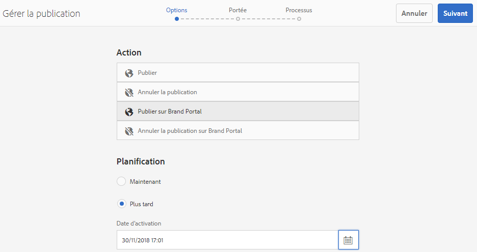

# Publication de ressources sur Brand Portal {#publish-assets-to-brand-portal}

En tant qu’administrateur d’Adobe Experience Manager (AEM) Assets, vous pouvez publier des ressources et des dossiers sur l’instance AEM Assets Brand Portal (ou planifier le workflow de planification à une date/heure ultérieure) pour votre organisation. Toutefois, vous devez d’abord configurer AEM Assets avec Brand Portal. For details, see [Configure AEM Assets with Brand Portal](/help/assets/configure-aem-assets-with-brand-portal.md).

Une fois la réplication réussie, vous pouvez publier des ressources, des dossiers et des collections sur Brand Portal. Pour publier des ressources sur Brand Portal, procédez comme suit :

>[!NOTE]
>
>Adobe recommande la publication décalée, de préférence en dehors des heures de pointe, de sorte que l’auteur AEM n’utilise pas une quantité excessive de ressources.

1. Dans la console Ressources, sélectionnez les ressources/le dossier à publier, puis cliquez sur l’option Publication **[!UICONTROL rapide]** dans la barre d’outils.

   Vous pouvez également sélectionner les ressources que vous voulez publier sur Brand Portal.

   

1. Pour publier les fichiers sur Brand Portal, vous disposez de deux options :
   * [Publication immédiate des fichiers](#publish-to-bp-now)
   * [Publier les ressources plus tard](#publish-to-bp-now)

## Publier les ressources maintenant {#publish-to-bp-now}

Pour publier les ressources sélectionnées sur Brand Portal, effectuez l’une des opérations suivantes :

* From the toolbar, select **[!UICONTROL Quick Publish]**. Then from the menu, select **[!UICONTROL Publish to Brand Portal]**.

* From the toolbar, select **[!UICONTROL Manage Publication]**.

   1. Then from the **[!UICONTROL Action]** select **[!UICONTROL Publish to Brand Portal]**, and from **[!UICONTROL Scheduling]** select **[!UICONTROL Now]**. Cliquez sur **[!UICONTROL Suivant]**.

   2. Within **[!UICONTROL Scope]**, confirm your selection and click **[!UICONTROL Publish to Brand Portal]**.

Un message indique que les ressources ont été placées en file d’attente pour publication sur Brand Portal. Connectez-vous à l’interface du portail des marques pour afficher les fichiers publiés.

## Publier les ressources plus tard {#publish-to-bp-later}

Pour planifier la publication des ressources sur Brand Portal à une date ou une heure ultérieure :

1. Once you have selected assets/ folders to publish, select **[!UICONTROL Manage Publication]** from the tool bar at the top.

1. On **[!UICONTROL Manage Publication]** page, select **[!UICONTROL Publish to Brand Portal]** from **[!UICONTROL Action]** and select **[!UICONTROL Later]** from **[!UICONTROL Scheduling]**.

   

1. Select an **[!UICONTROL Activation date]** and specify time. Cliquez sur **[!UICONTROL Suivant]**.

1. Select an **Activation date** and specify time. Cliquez sur **Suivant**.

1. Specify a **[!UICONTROL Workflow title]** in **[!UICONTROL Workflows]**. Click **[!UICONTROL Publish Later]**.

   

Désormais, connectez-vous au portail de marque pour savoir si les fichiers publiés sont disponibles dans l’interface du portail de marque.

