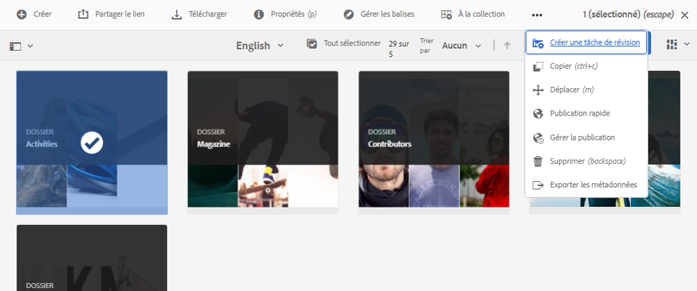
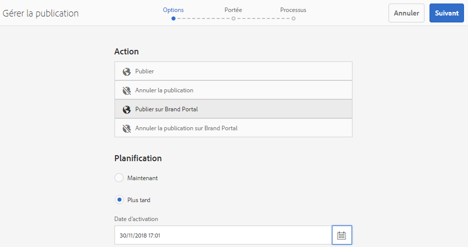
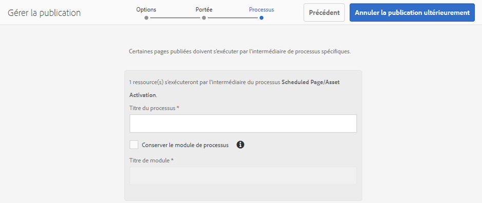
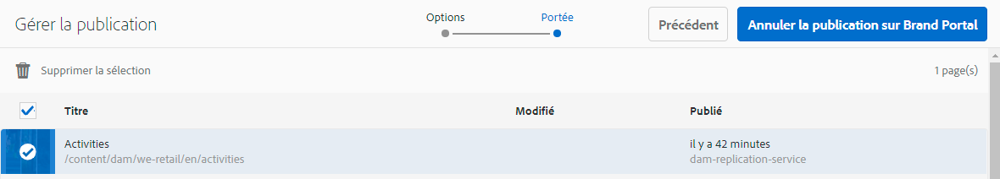
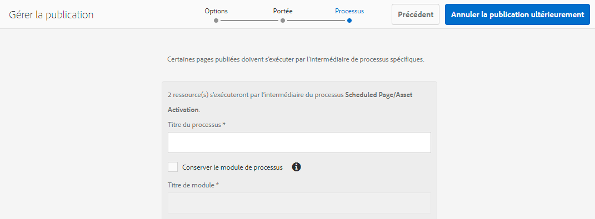

# Publication de dossiers sur Brand Portal{#publish-folders-to-brand-portal}

En tant qu’administrateur d’Adobe Experience Manager (AEM) Assets, vous pouvez publier des ressources et des dossiers sur l’instance AEM Assets Brand Portal (ou planifier le workflow de planification à une date/heure ultérieure) pour votre organisation. Cependant, vous devez d’abord intégrer AEM Assets à Brand Portal. Pour plus de détails, voir [Configuration d’AEM Assets avec Brand Portal](/help/assets/configure-aem-assets-with-brand-portal.md).

Une fois que vous avez publié un fichier ou un dossier, il est disponible pour les utilisateurs dans le portail de marque.

Si vous apportez des modifications ultérieures à la ressource ou au dossier d’origine dans AEM Assets, les modifications ne sont pas répercutées dans le portail des marques tant que vous n’avez pas republié la ressource ou le dossier. Cette fonction assure que les modifications en cours ne sont pas disponibles dans Brand Portal. Seules les modifications approuvées publiées par un administrateur sont disponibles dans Brand Portal.

## Publication de dossiers sur Brand Portal {#publish-folders-to-brand-portal-1}

1. From the AEM Assets interface, hover over the desired folder and select **Publish** option from the quick actions.

   Vous pouvez aussi sélectionner le dossier souhaité et suivre les étapes supplémentaires.

   

1. **Publication instantanée des dossiers**

   Pour publier les dossiers sélectionnés sur Brand Portal, effectuez l’une des opérations suivantes :

   * Dans la barre d’outils, sélectionnez **Publication rapide**. Then from the menu, select **Publish to Brand Portal**.

   * Dans la barre d’outils, sélectionnez **Gérer la publication**.
   1. Dans **Action** , sélectionnez **Publier sur le portail** de la marque, dans **Planification** , sélectionnez **Maintenant, puis cliquez sur Suivant.******
   1. Confirmez votre sélection dans **Portée** et cliquez sur **Publier sur Brand Portal**.

   Un message indique que le dossier a été placé en file d’attente pour publication sur Brand Portal. Connectez-vous à l’interface Brand Portal pour voir le dossier publié.

   **Publication ultérieure de dossiers**

   Pour programmer la publication sur le flux de travaux du portail de marques des dossiers de fichiers à une date ou une heure ultérieure :

   1. Once you have selected assets/ folders to publish, select **Manage Publication** from the tool bar at the top.
   1. Dans **Action** , sélectionnez **Publier sur le portail** de la marque, dans **Planification** , sélectionnez **Plus tard.**

      

   1. Sélectionnez une **Date d’activation** et spécifiez l’heure. Cliquez sur **Suivant**.
   1. Confirmez votre sélection dans **Portée**. Cliquez sur **Suivant**.
   1. Spécifiez un titre de workflow sous **Processus**. Cliquez sur **Publier ultérieurement**.

      

## Annulation de la publication de dossiers sur Brand Portal {#unpublish-folders-from-brand-portal}

Vous pouvez supprimer n’importe quel dossier de ressources publié sur Brand Portal en en annulant la publication à partir de l’instance d’auteur AEM. Une fois que vous avez annulé la publication du dossier original, sa copie n’est plus disponible pour les utilisateurs de Brand Portal.

Vous avez la possibilité d’annuler rapidement la publication de dossiers sur Brand Portal ou de planifier l’annulation à une date et une heure ultérieures. Pour annuler la publication de dossiers de ressources sur Brand Portal :

1. Depuis l’interface d’AEM Assets de l’instance d’auteur AEM, sélectionnez le dossier dont vous souhaitez annuler la publication.

   

1. From the toolbar, Click **Manage Publication**.

1. **Annulation rapide d’une publication sur Brand Portal**

   Pour annuler rapidement la publication du dossier désiré sur Brand Portal :

   1. Dans la barre d’outils, sélectionnez **Gérer la publication**.
   1. Dans **Action** , sélectionnez **Annuler la publication dans le portail** de marque, dans **Planification** , sélectionnez **Maintenant, puis cliquez sur Suivant.******
   1. Confirmez votre sélection dans **Portée** et cliquez sur **Annuler la publication sur Brand Portal**.

   

   **Annulation de la publication à partir du portail de marque ultérieurement**

   Pour planifier l’annulation de la publication d’un dossier sur Brand Portal à une date et à une heure ultérieures :

   1. Dans la barre d’outils, sélectionnez **Gérer la publication**.
   1. From **Action** select **Unpublish from Brand Portal**, and from **Scheduling** select **Later**.
   1. Sélectionnez une **Date d’activation** et spécifiez l’heure. Cliquez sur **Suivant**.
   1. Confirmez votre sélection dans **Portée** et cliquez sur **Suivant**.
   1. Spécifiez un **Titre de workflow** sous **Processus**. Cliquez sur **Annuler la publication ultérieurement.**

      

>[!NOTE]
>
>La procédure de publication/annulation de la publication d’un fichier depuis/vers le portail des marques est similaire à la procédure correspondante pour un dossier.

