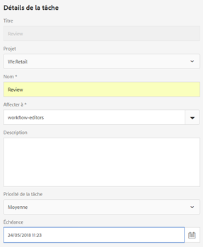
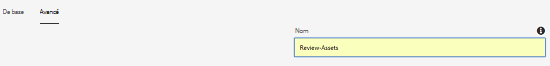
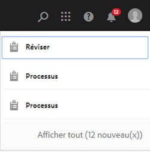
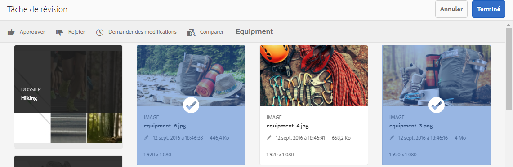
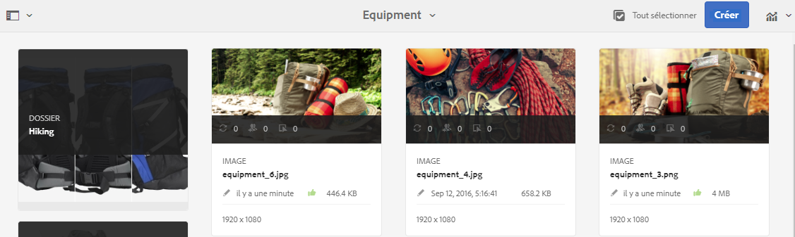
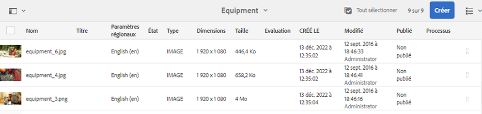
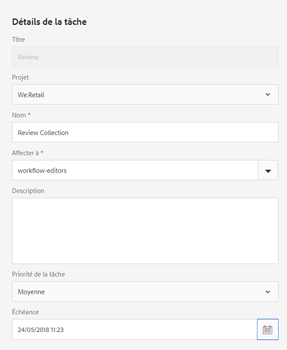
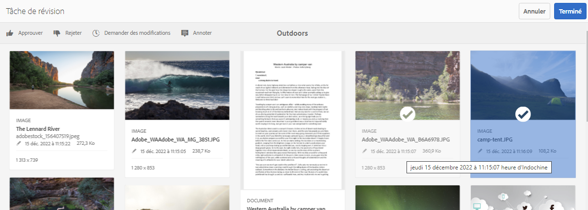
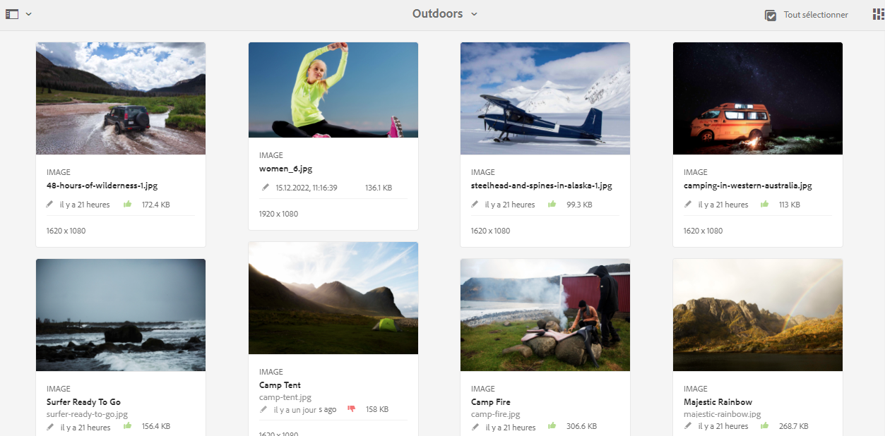
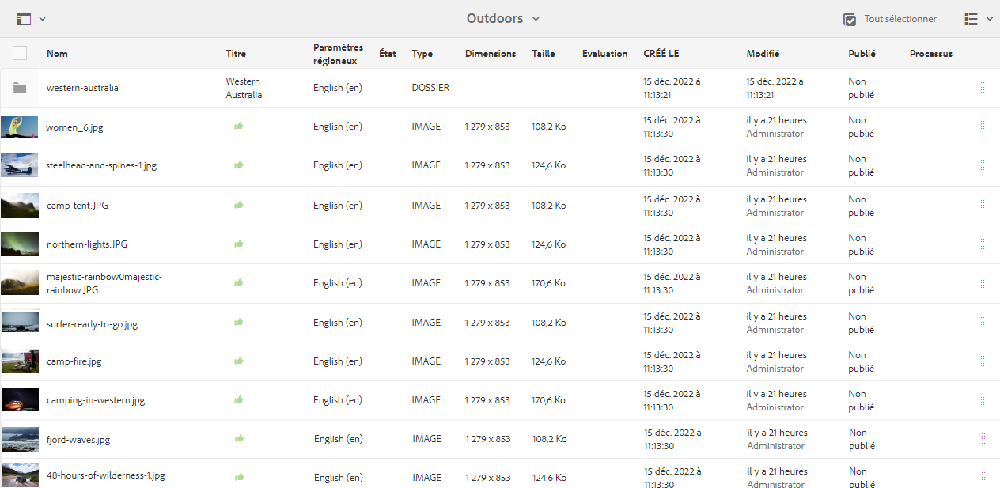

# Révision de collections et de ressources situées dans un dossier {#review-folder-assets-and-collections}

Mettez en place des workflows de révision pour les ressources dans un dossier ou une collection et partagez ce workflow avec les réviseurs ou les partenaires de conception afin d’obtenir leurs commentaires.

[!DNL Adobe Experience Manager Assets] permet de configurer un workflow de révision ad hoc pour les ressources situées dans un dossier ou une collection et de partager ce workflow avec des réviseurs ou des partenaires de conception afin d’obtenir leurs commentaires.

Vous pouvez associer le workflow de révision à un projet ou créer une tâche de révision indépendante.

Une fois que vous avez partagé les ressources, les réviseurs peuvent les approuver ou les rejeter. Les notifications sont envoyées à différentes étapes du workflow pour informer les destinataires voulus de la fin des diverses tâches. Par exemple, lorsque vous partagez un dossier ou une collection, le réviseur reçoit une notification lui indiquant qu’un dossier/une collection a été partagé(e) pour la révision.

Une fois que le réviseur a terminé la révision (approuvé ou rejeté les ressources), vous recevez une notification de fin de révision.

## Create a review task for folders {#creating-a-review-task-for-folders}

1. From the [!DNL Assets] user interface, select the folder for which you want to create a review task.
1. Dans la barre d’outils, cliquez sur **[!UICONTROL Créer une Tâche]** de révision  de révision pour ouvrir la page **[!UICONTROL Tâche]** de révision. If you cannot see the option in the toolbar, click **[!UICONTROL More]** and then select the option.

1. (Facultatif) Dans la liste **[!UICONTROL Projets]**, choisissez le projet auquel vous voulez associer la tâche de révision. Par défaut, l’option **[!UICONTROL Aucun]** est sélectionnée. Si vous ne souhaitez associer aucun projet à la tâche de révision, conservez cette sélection.

   >[!NOTE]
   >
   >Seuls les projets pour lesquels vous disposez d’autorisations de niveau Éditeur (ou supérieur) apparaissent dans la liste **[!UICONTROL Projets]**.

1. Entrez un nom pour la tâche de révision, puis sélectionnez un approbateur dans la liste **[!UICONTROL Affecter à.]**

   >[!NOTE]
   >
   >Les membres/groupes du projet sélectionné sont disponibles en tant qu’approbateurs dans la liste **[!UICONTROL Affecter à.]**

1. Entrez une description, la priorité et la date d’échéance de la tâche de révision.

   

1. Dans l’onglet Avancé, entrez le libellé à utiliser pour créer l’URI.

   

1. Click **[!UICONTROL Submit]**, and then click **[!UICONTROL Done]** to close the confirmation message. Une notification pour la nouvelle tâche est envoyée à l’approbateur.
1. Log in to [!DNL Assets] as an Approver and navigate to the [!DNL Assets] UI. To approve assets, click **[!UICONTROL Notifications]** and then select the review task from the list.

   

1. In the **[!UICONTROL Review Task]** page, examine the details of the review task, and then click **[!UICONTROL Review]**.
1. In the **[!UICONTROL Review Task]** page, select assets, and click **[!UICONTROL Approve/Reject]** to approve or reject, as appropriate.

   

1. Click **[!UICONTROL Complete]** from the toolbar. In the dialog, enter a comment and click  **[!UICONTROL Complete]** to confirm.
1. Navigate to the [!DNL Assets] user interface and open the folder. Les icônes d’état d’approbation des ressources s’affichent dans la vue de carte et la vue de liste.

   **Mode Carte**

   

   **Mode Liste**

   

## Create a review task for collections {#creating-a-review-task-for-collections}

1. Sur la page Collections, sélectionnez la collection pour laquelle vous souhaitez créer une tâche de révision.
1. Dans la barre d’outils, cliquez sur **[!UICONTROL Créer une Tâche]** de révision  de révision pour ouvrir la page **[!UICONTROL Tâche]** de révision. If you cannot see the option on the toolbar, click **[!UICONTROL More]** and then select the option.

1. (Facultatif) Dans la liste **[!UICONTROL Projets]**, choisissez le projet auquel vous voulez associer la tâche de révision. Par défaut, l’option **[!UICONTROL Aucun]** est sélectionnée. Si vous ne souhaitez associer aucun projet à la tâche de révision, conservez cette sélection.

   >[!NOTE]
   >
   >Seuls les projets pour lesquels vous disposez d’autorisations de niveau Éditeur (ou supérieur) apparaissent dans la liste **[!UICONTROL Projets]**.

1. Entrez un nom pour la tâche de révision, puis sélectionnez un approbateur dans la liste **[!UICONTROL Affecter à.]**

   >[!NOTE]
   >
   >Les membres/groupes du projet sélectionné sont disponibles en tant qu’approbateurs dans la liste **[!UICONTROL Affecter à.]**

1. Entrez une description, la priorité et la date d’échéance de la tâche de révision.

   

1. Click **[!UICONTROL Submit]**, and then click **[!UICONTROL Done]** to close the confirmation message. Une notification pour la nouvelle tâche est envoyée à l’approbateur.
1. Log in to [!DNL Assets] as an Approver and navigate to the [!DNL Assets] console. To approve assets, click **[!UICONTROL Notifications]** and then select the review task from the list.
1. In the **[!UICONTROL Review Task]** page, examine the details of the review task, and then click **[!UICONTROL Review]**.
1. Toutes les ressources situées dans la collection sont visibles dans le panneau de révision. Select the assets and click **[!UICONTROL Approve/Reject]** to approve or reject assets, as appropriate.

   

1. Click **[!UICONTROL Complete]** from the toolbar. In the dialog, enter a comment and click **[!UICONTROL Complete]** to confirm.
1. Accédez à la console Collections et ouvrez la collection. Les icônes d’état d’approbation pour les ressources apparaissent dans les modes Carte et Liste.

   

   *Figure : Vue de carte.*

   

   *Figure : Vue de liste.*
