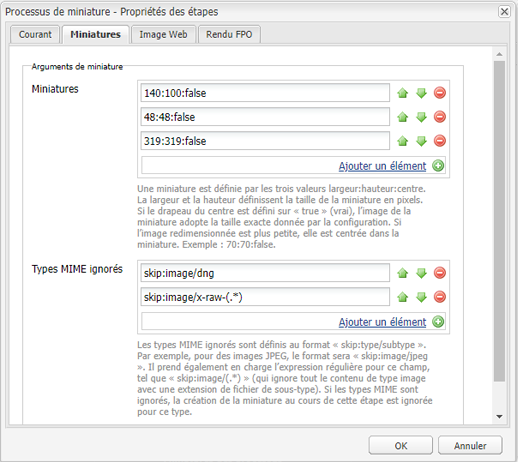
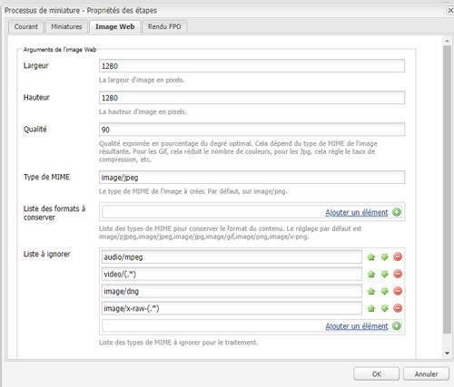
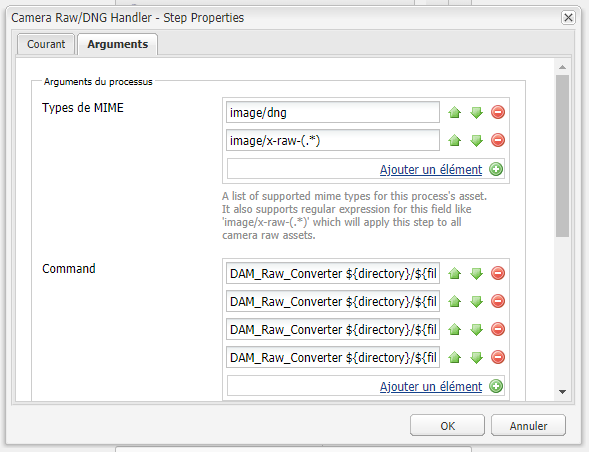
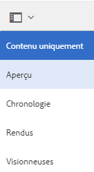
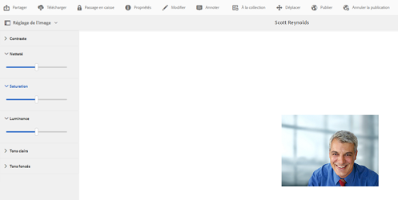

# Traiter les images à l’aide de la commande Camera Raw {#camera-raw-support}

Vous pouvez activer la prise en charge de [!DNL Adobe Camera Raw] pour traiter les formats de fichiers bruts, tels que CR2, NEF et RAF, et effectuer le rendu des images au format JPEG. La fonctionnalité est prise en charge dans [!DNL Adobe Experience Manager Assets] à l&#39;aide du [package Camera Raw](https://experience.adobe.com/#/downloads/content/software-distribution/en/aem.html?package=/content/software-distribution/en/details.html/content/dam/aem/public/adobe/packages/aem630/product/assets/aem-assets-cameraraw-pkg) disponible dans Software Distribution.

>[!NOTE]
>
>La fonctionnalité ne prend en charge que les rendus JPEG. Il est pris en charge sous Windows 64 bits, Mac OS et RHEL 7.x.

Pour activer la prise en charge de [!DNL Camera Raw] dans [!DNL Experience Manager Assets], procédez comme suit :

1. Téléchargez le [package Camera Raw](https://experience.adobe.com/#/downloads/content/software-distribution/en/aem.html?package=/content/software-distribution/en/details.html/content/dam/aem/public/adobe/packages/aem630/product/assets/aem-assets-cameraraw-pkg) à partir de Software Distribution.
1. Accédez à l’adresse `https://[aem_server]:[port]/workflow`. Ouvrez le workflow **[!UICONTROL DAM Update Asset]**.
1. Ouvrez l’étape **[!UICONTROL Traiter les miniatures]**.
1. Fournissez la configuration suivante dans l’onglet **[!UICONTROL Miniatures]** :

   * **[!UICONTROL Miniatures]** :  `140:100:false, 48:48:false, 319:319:false`
   * **[!UICONTROL Types MIME ignorés]**: `skip:image/dng, skip:image/x-raw-(.*)`

   

1. Dans l&#39;onglet **[!UICONTROL Image activée pour le Web]**, dans le champ **[!UICONTROL Ignorer la Liste]**, spécifiez `audio/mpeg, video/(.*), image/dng, image/x-raw-(.*)`.

   

1. Dans le panneau latéral, ajoutez l’étape **[!UICONTROL Gestionnaire Camera Raw/DNG]** sous l’étape **[!UICONTROL Création de miniature]**.
1. À l’étape **[!UICONTROL Gestionnaire Camera Raw/DNG]**, ajoutez la configuration suivante dans l’onglet **[!UICONTROL Arguments]** :

   * **[!UICONTROL Types]** MIME :  `image/dng` et  `image/x-raw-(.*)`
   * **[!UICONTROL Commande]**:

      * `DAM_Raw_Converter ${directory}/${filename} ${directory} cq5dam.web.1280.1280.jpeg 1280 1280`
      * `DAM_Raw_Converter ${directory}/${filename} ${directory} cq5dam.thumbnail.319.319.jpeg 319 319`
      * `DAM_Raw_Converter ${directory}/${filename} ${directory} cq5dam.thumbnail.140.100.jpeg 140 100`
      * `DAM_Raw_Converter ${directory}/${filename} ${directory} cq5dam.thumbnail.48.48.jpeg 48 48`

   

1. Cliquez sur **[!UICONTROL Enregistrer]**.

>[!NOTE]
>
>Vérifiez que la configuration ci-dessus est identique à la configuration **[!UICONTROL Exemple de ressources de mise à jour de gestion des actifs numériques avec l&#39;étape de manipulation Camera RAW et DNG]**.

Vous pouvez désormais importer des fichiers Camera Raw dans Assets. Après avoir installé le pack Camera Raw et configuré le flux de travaux requis, l’option **[!UICONTROL Ajustement de l’image]** apparaît dans la liste des volets latéraux.

*Figure : Options dans le volet latéral.*

*Figure : Utilisez cette option pour apporter des modifications légères à vos images.*

Après avoir enregistré les modifications sur une image [!DNL Camera Raw], un nouveau rendu `AdjustedPreview.jpg` est généré pour l’image. Pour les autres types d’image, à l’exception de [!DNL Camera Raw], les modifications sont répercutées dans tous les rendus.

## Bonnes pratiques, problèmes connus et limites {#best-practices}

La fonctionnalité présente les limites suivantes :

* La fonctionnalité ne prend en charge que les rendus JPEG. Elle est prise en charge sous Windows 64 bits, Mac OS et RHEL 7.x.
* L’écriture différée des métadonnées n’est pas prise en charge pour les formats RAW et DNG.
* La bibliothèque [!DNL Camera Raw] est limitée au total des pixels qu’elle peut traiter à la fois. Actuellement, il peut traiter un maximum de 65 000 pixels sur le côté long d’un fichier ou 512 MP, quels que soient les critères rencontrés en premier.
