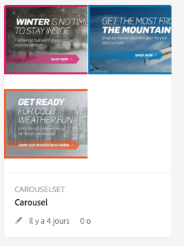
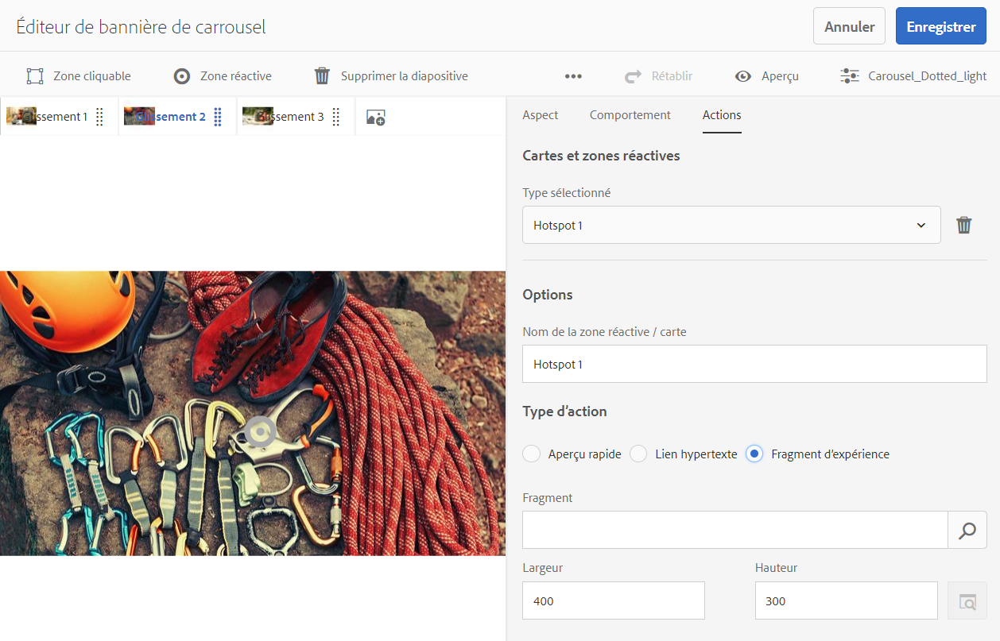
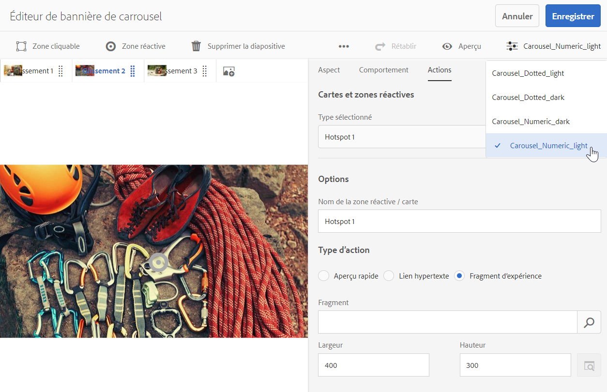

# Bannières de carrousel{#carousel-banners}

Les bannières de carrousel permettent aux spécialistes du marketing de générer des interactions en créant facilement du contenu promotionnel interactif et rotatif et en le diffusant sur n&#39;importe quel écran.

La création et la modification du contenu présenté dans les bannières promotionnelles peuvent prendre beaucoup de temps, limitant votre capacité à publier rapidement du nouveau contenu ou à le rendre plus ciblé. Les bannières de carrousel vous permettent de créer ou de modifier rapidement des bannières rotatives. Vous pouvez ajouter de l’interactivité, par exemple des zones réactives liées au détail d’un produit ou à des ressources connexes, puis les diffuser sur n’importe quel écran, ce qui vous permet d’apporter plus rapidement du nouveau contenu promotionnel au marché.

Les bannières de carrousel sont signalées par une bannière contenant le mot **[!UICONTROL CAROUSELSET]**

Sur votre site web, la bannière de carrousel peut se présenter comme suit :

Vous pouvez parcourir les images (en cliquant sur les numéros). De plus, les diapositives alternent automatiquement selon un intervalle personnalisable. Les images que vous ajoutez aux bannières de carrousel prennent en charge les zones réactives et les zones cliquables, qui permettent aux utilisateurs de sélectionner un lien hypertexte ou d’accéder à une fenêtre d’aperçu rapide.

Dans cet exemple, un utilisateur a tapé ou cliqué sur une zone cliquable et a accédé à la fenêtre d’aperçu rapide pour des gants :

## Vidéo sur la création de bannières de carrousel {#watch-how-carousel-banners-are-created}

Regardez une présentation sur [la manière dont les bannières de carrousel sont créées](https://s7d5.scene7.com/s7viewers/html5/VideoViewer.html?videoserverurl=https://s7d5.scene7.com/is/content/&amp;emailurl=https://s7d5.scene7.com/s7/emailFriend&amp;serverUrl=https://s7d5.scene7.com/is/image/&amp;config=Scene7SharedAssets/Universal_HTML5_Video_social&amp;contenturl=https://s7d5.scene7.com/skins/&amp;asset=S7tutorials/InteractiveCarouselBanner) (10 minutes et 33 secondes). Vous apprendrez également à prévisualiser, modifier et diffuser des bannières de carrousel.

>[!NOTE]
>
>Les personnes qui ne sont pas administratrices doivent être ajoutées au groupe **[!UICONTROL `dam-users`]** de façon à pouvoir créer ou modifier des bannières de carrousel. Si vous rencontrez des problèmes lors de la création ou de la modification des bannières, contactez votre administrateur ou administratrice système qui vous ajoutera au groupe **[!UICONTROL `dam-users`]**.

## Démarrage rapide : bannières de carrousel {#quick-start-carousel-banners}

Pour vous familiariser rapidement avec les bannières de carrousel :

1. [Identifiez les variables de zone réactive et de zone cliquable](#identifying-hotspot-and-image-map-variables) (seulement pour les clients qui utilisent Experience Manager Assets et Dynamic Media).

   Commencez par identifier les variables dynamiques utilisées par la mise en œuvre de l’aperçu rapide existant afin de pouvoir entrer correctement les données des zones réactives et des zones cliquables lors de la création de la bannière de carrousel dans Adobe Experience Manager Assets.

   >[!NOTE]
   >
   >Si vous êtes un client Experience Manager Sites ou AEM eCommerce, vous pouvez utiliser la fonctionnalité intégrée permettant d’accéder aux pages de produit et à la recherche des unités de gestion des stocks (SKU) existantes dans le catalogue de produits. Vous n’avez pas besoin d’entrer manuellement les variables de zone réactive ou de zone cliquable. Reportez-vous aux informations sur la [configuration d’eCommerce](/help/commerce/cif-classic/administering/generic.md).
   >
   >
   >Si vous êtes un client Experience Manager Assets et Dynamic Media, vous entrez manuellement les données des zones réactives et des zones cliquables, puis vous intégrez l’URL publiée ou le code intégré au système de gestion de contenu tiers.

1. Facultatif : [créez un paramètre prédéfini d’ensemble de carrousel](/help/assets/managing-viewer-presets.md), au besoin.

   Si vous êtes administrateur, vous pouvez personnaliser le comportement et l’apparence du carrousel en créant votre propre paramètre prédéfini de visionneuse de carrousel. L’avantage principal est que vous pouvez réutiliser ce paramètre prédéfini de visionneuse personnalisé pour plusieurs carrousels. Cependant, les utilisateurs ont également la possibilité de personnaliser le comportement et l’apparence du carrousel directement lors de sa création. Il s’agit de l’approche recommandée lorsque vous souhaitez une conception spécifique pour un carrousel donné.

1. [Chargez une bannière d’image](#uploading-image-banners).

   Chargez les bannières d’images que vous souhaitez rendre interactives.

1. [Créez des ensembles de carrousels](#creating-carousel-sets).

   Dans les ensembles de carrousels, les utilisateurs parcourent les images de bannière et sélectionnent les zones réactives ou cliquables pour accéder au contenu approprié.

   Pour créer un ensemble de carrousel dans Assets, sélectionnez **[!UICONTROL Créer]**, puis sélectionnez **[!UICONTROL Ensembles de carrousels]**. Ajoutez des ressources à chaque diapositive et sélectionnez **[!UICONTROL Enregistrer]**. Vous pouvez également modifier l’apparence et le comportement du carrousel directement dans l’éditeur.

1. [Ajoutez des zones réactives ou cliquables dans une bannière d’image](#adding-hotspots-or-image-maps-to-an-image-banner).

   Ajoutez une ou plusieurs zones réactives ou cliquables à une bannière d’image et associez chacune d’elles à une action, comme un lien, un aperçu rapide ou un fragment d’expérience. Après avoir ajouté des zones réactives ou cliquables, terminez cette tâche en publiant l&#39;ensemble de carrousel. La publication crée le code intégré que vous pouvez copier et appliquer à la fin dans la page de destination de votre site web.

   Consultez [Aperçu des bannières de carrousel](#optional-previewing-carousel-banners) (Facultatif). Si vous le souhaitez, vous pouvez afficher une représentation de l’ensemble de carrousel et tester son interactivité.

1. [Publiez les bannières de carrousel](#publishing-carousel-banners).

   Vous publiez un ensemble de carrousel comme vous le feriez pour d’autres ressources. Dans Ressources, accédez à l’ensemble de carrousel, sélectionnez-le et sélectionnez **[!UICONTROL Publier]**. La publication d’un ensemble de carrousel active l’URL et la chaîne intégrée.

1. Utilisez l’une des méthodes suivantes :

   * [Ajoutez une bannière de carrousel à la page de votre site web](#adding-a-carousel-banner-to-your-website-page). Vous pouvez ajouter l’URL de la bannière de carrousel ou le code intégré que vous avez copié sur la page du site web.

      * [Intégrez la bannière de carrousel à un aperçu rapide existant](#integrating-the-carousel-banner-with-an-existing-quickview). Si vous utilisez un système de gestion de contenu web externe, vous devez intégrer la nouvelle bannière de carrousel à la mise en œuvre de l’aperçu rapide existant sur votre site web.

   * [Ajout d’une bannière de carrousel à votre site web dans Experience Manager](/help/assets/adding-dynamic-media-assets-to-pages.md) Si vous êtes un client Experience Manager Sites, vous pouvez ajouter l’ensemble de carrousel directement sur la page dans Experience Manager à l’aide du composant Interactive Media.

Pour modifier des ensembles de carrousel, consultez [Modification d’ensembles de carrousels](#editing-carousel-sets). De plus, vous pouvez afficher et modifier les [propriétés d’un ensemble de carrousel](manage-assets.md#editing-properties).

## Identification des variables de zone réactive et de zone cliquable {#identifying-hotspot-and-image-map-variables}

Commencez par identifier les variables dynamiques utilisées par la mise en œuvre de l’aperçu rapide existant afin de pouvoir entrer les données des zones réactives et des zones cliquables lors de la création d’un ensemble de carrousel dans Experience Manager Assets.

Lorsque vous ajoutez des zones réactives ou des zones cliquables à une bannière d’image dans Experience Manager Assets, vous devez affecter un SKU et des variables supplémentaires facultatives à chaque zone réactive ou cliquable. Ces variables sont utilisées, par la suite, pour faire correspondre les zones réactives ou cliquables au contenu de l’aperçu rapide.

>[!NOTE]
>
>Si vous êtes un client Experience Manager Sites et/ou Experience Manager eCommerce, ignorez cette étape. Vous n’avez pas besoin d’identifier manuellement les variables de zone réactive ou cliquable. Vous pouvez utiliser l’intégration à eCommerce pour l’intégration des produits. Reportez-vous aux informations sur la [configuration d’eCommerce](/help/commerce/cif-classic/administering/generic.md). De plus, vous pouvez utiliser le composant interactif et l’ajouter à votre page web.
>
>Si vous êtes un client Experience Manager Assets ou Media, vous publiez l’URL ou le code intégré, effectuez l’intégration au système de gestion de contenu tiers, puis identifiez manuellement les zones réactives et cliquables.

Il est important d’identifier correctement le nombre et le type des variables à associer aux données des zones réactives ou cliquables. Chaque zone réactive ou zone cliquable ajoutée à une image de bannière doit comporter suffisamment d’informations pour identifier clairement le produit sur le système back-end existant. En même temps, chaque zone réactive ou cliquable ne doit pas comporter plus de données que nécessaire. La raison en est que cela rendrait le processus de saisie des données trop complexe et la gestion continue des zones réactives ou des zones cliquables plus sujette aux erreurs.

Il existe différentes manières d’identifier un jeu de variables à utiliser pour les données des zones réactives ou des zones cliquables.

Il suffit parfois de consulter les spécialistes informatiques chargés de la mise en œuvre de l’aperçu rapide existant. Ceux-ci devraient connaître les données minimum nécessaires pour identifier l’aperçu rapide dans le système. Cependant, il est normalement également possible d’analyser le comportement existant du code en front-end.

La plupart des implémentations d’aperçu rapide utilisent le modèle suivant :

* L’utilisateur active un élément d’interface utilisateur sur le site web. Par exemple, en appuyant sur un bouton **[!UICONTROL Aperçu rapide]**.
* Le site Web envoie une requête Ajax au serveur principal afin de charger les données ou le contenu de l’aperçu rapide, le cas échéant.
* Les données de l’aperçu rapide sont traduites en contenu en préparation du rendu sur la page Web.
* Enfin, le code en front-end effectue le rendu visuel de ce contenu à l’écran.

L’approche consiste alors à visiter différentes zones du site web existant où la fonctionnalité d’aperçu rapide est implémentée. à déclencher l’aperçu rapide et à capturer l’URL Ajax envoyée par la page web pour charger les données ou le contenu de l’aperçu rapide.

Normalement, il n’est pas nécessaire d’utiliser des outils de débogage spécialisés. Les navigateurs web modernes incluent des inspecteurs web qui font un travail correct. Vous trouverez ci-dessous quelques exemples de navigateurs web qui incluent des inspecteurs web :

* Pour afficher toutes les demandes HTTP sortantes dans Google Chrome, appuyez sur F12 (Windows) ou Contrôle+Options+I (Mac) pour ouvrir le volet Outils de développement, puis sélectionnez l’onglet Réseau.
* Dans Firefox, vous pouvez activer le plug-in Firebug en appuyant sur F12 (Windows) ou Contrôle-Option-I (Mac) et utiliser l’onglet Réseau, ou vous pouvez utiliser l’outil Inspecteur intégré et son onglet Réseau.

Lorsque la surveillance de réseau est activée dans le navigateur, déclenchez l’aperçu rapide sur la page.

Vous trouvez maintenant l’URL Ajax d’aperçu rapide dans le journal réseau. Copiez l’URL enregistrée pour l’analyse ultérieure. Généralement, lorsque vous déclenchez l’aperçu rapide, plusieurs requêtes sont envoyées au serveur. En règle générale, l’URL Ajax d’aperçu rapide est l’une des premières dans la liste. Elle possède une partie de chaîne de requête complexe ou un chemin d’accès, et son type de réponse MIME est `text/html`, `text/xml` ou `text/javascript`.

Au cours de ce processus, il est important de parcourir différentes zones de votre site web, avec différentes catégories et types de produits. C’est pourquoi les URL d’aperçu rapide peuvent avoir des parties communes pour une catégorie de site web donnée, mais ne changent que si vous visitez une autre zone du site web.

Dans le cas le plus simple, la seule partie variable dans l’URL de l’aperçu rapide est le SKU du produit. Dans ce cas, la valeur de la SKU est la seule donnée dont vous avez besoin pour ajouter des zones réactives ou des zones cliquables à l’image de bannière.

Cependant, dans les cas complexes, l’URL d’aperçu rapide comporte différents éléments variables qui diffèrent en complément du SKU, comme l’identifiant de la catégorie, le code couleur et le code taille. Dans ce cas, chaque élément est une variable distincte dans la définition des données de zone réactive ou cliquable dans la fonction de bannière de carrousel.

Consultez les exemples d’URL d’aperçu rapide ci-dessous et les variables de zone réactive et de zone cliquable obtenues :

<table>
 <tbody>
  <tr>
   <td>SKU unique, trouvé dans la chaîne de requête.</td>
   <td>
Les URL d’aperçu rapide enregistrées incluent ce qui suit :

    <ul>
     <li>
<code>https://server/json?productId=866558&amp;source=100</code>
 </li>
     <li>
<code>https://server/json?productId=1196184&amp;source=100</code>
 </li>
     <li>
<code>https://server/json?productId=1081492&amp;source=100</code>
 </li>
     <li>
<code>https://server/json?productId=1898294&amp;source=100</code>
 </li>
    </ul> 
La seule partie variable de l’URL est la valeur du paramètre de chaîne de requête <code>productId=</code>, et il s’agit clairement d’une valeur de SKU. Par conséquent, il suffit d’indiquer dans les champs de SKU des zones réactives ou cliquables des valeurs telles que <code>866558,</code> <code>1196184,</code> <code>1081492,</code> <code>1898294.</code>
 </td>
  </tr>
  <tr>
   <td>SKU unique, trouvé dans le chemin d’accès à l’URL.</td>
   <td>
Les URL d’aperçu rapide enregistrées incluent ce qui suit :

    <ul>
     <li>
<code>https://server/product/6422350843</code>
 </li>
     <li>
<code>https://server/product/1607745002</code>
 </li>
     <li>
<code>https://server/product/0086724882</code>
 </li>
    </ul> 
La partie variable se trouve dans la dernière partie du chemin et elle devient la valeur de SKU des zones réactives/cliquables : <strong><code>6422350843</code>, <code>1607745002,</code> </strong><code>0086724882.</code>.
 </td>
  </tr>
  <tr>
   <td>SKU et ID de catégorie dans la chaîne de requête.</td>
   <td>
Les URL d’aperçu rapide enregistrées incluent ce qui suit :

    <ul>
     <li>
<code>https://server/quickView/product/?category=1100004&amp;prodId=305466</code>
 </li>
     <li>
<code>https://server/quickView/product/?category=1100004&amp;prodId=310181</code>
 </li>
     <li>
<code>https://server/quickView/product/?category=1740148&amp;prodId=308706</code>
 </li>
    </ul> 
Dans ce cas, l’URL comporte deux parties différentes. Le SKU est stocké dans le paramètre <code>prodId</code> et l’ID de catégorie est stocké dans le paramètre <code>category=</code>.
 
En tant que telles, les définitions zone réactive/zone cliquable sont des paires. Autrement dit, une valeur de SKU et une variable supplémentaire appelée « <code>categoryId</code> ». Les paires obtenues sont les suivantes :

    <ul>
     <li>
Le SKU est <strong><code>305466</code></strong> et <code>categoryId</code> est <code>1100004</code>.
 </li>
     <li>
Le SKU est <strong><code>310181</code></strong> et <code>categoryId</code> est <strong><code>1100004</code></strong>.
 </li>
     <li>
Le SKU est <strong><code>308706</code></strong> et <code>categoryId</code> est <strong><code>1740148</code></strong>.
 </li>
    </ul> </td>
  </tr>
 </tbody>
</table>

## Chargement des bannières d’image {#uploading-image-banners}

Si vous avez déjà chargé les images à utiliser, passez à l’étape suivante, [Création d’ensembles de carrousels](#creating-carousel-sets). Notez que les images utilisées dans le carrousel doivent être chargées une fois que Dynamic Media a été activé.

Pour charger des bannières d’image, voir [Chargement de ressources](/help/assets/manage-assets.md).

## Création d’ensembles de carrousels {#creating-carousel-sets}

>[!NOTE]
>
>Les personnes qui ne sont pas administratrices doivent être ajoutées au groupe **[!UICONTROL `dam-users`]** de façon à pouvoir créer ou modifier des bannières de carrousel. Si vous rencontrez des problèmes lors de la création ou de la modification des bannières, contactez votre administrateur ou administratrice système qui vous ajoutera au groupe **[!UICONTROL `dam-users`]**.

**Pour créer des ensembles de carrousels :**

1. Dans Ressources, cherchez le dossier dans lequel vous souhaitez créer l’ensemble de carrousel, puis accédez à **[!UICONTROL Créer]** > **[!UICONTROL Ensemble de carrousel]**.
1. Dans la page de l’éditeur de bannière de carrousel, sélectionnez **[!UICONTROL Appuyer pour ouvrir le sélecteur de ressources]** pour sélectionner l’image de votre première diapositive.

   Dans la page de l’éditeur de bannières de carrousel, effectuez l’une des actions suivantes :

   * Dans le coin supérieur gauche de la page, sélectionnez l’icône **[!UICONTROL Ajouter une diapositive]**.

   * Près du milieu de la page, sélectionnez **[!UICONTROL Appuyer pour ouvrir le sélecteur de ressources]**.

   Sélectionnez pour sélectionner les ressources à inclure dans votre ensemble de carrousel. Les ressources sélectionnées sont cochées. Lorsque vous avez terminé, en haut à droite de la page, sélectionnez **[!UICONTROL Sélectionner]**.

   Le sélecteur de ressources vous permet de rechercher des ressources en saisissant un mot-clé, puis en appuyant ou en cliquant sur **[!UICONTROL Entrée]**. Vous pouvez également appliquer des filtres pour affiner vos résultats de recherche. Vous pouvez filtrer par chemin, collection, type de fichier et balise. Sélectionnez le filtre, puis sélectionnez l’icône **[!UICONTROL Filtre]** de la barre d’outils. Modifiez l’affichage en appuyant sur l’icône Affichage et en sélectionnant **[!UICONTROL Vue Colonnes]**, **[!UICONTROL Vue Carte]** ou **[!UICONTROL Vue Liste]**.

   Pour plus d’informations, voir [Utilisation de sélecteurs](/help/assets/working-with-selectors.md).

1. Continuez à ajouter des diapositives jusqu’à ce que vous ayez ajouté toutes les images que vous souhaitez faire pivoter dans l’ensemble du carrousel.
1. (En option) Effectuez l’une des actions suivantes :

   * Si nécessaire, faites glisser les diapositives pour réorganiser la liste des images à insérer.
   * Pour supprimer une image, sélectionnez-la, puis sélectionnez **[!UICONTROL Supprimer la diapositive]** dans la barre d’outils.

   * Pour appliquer un paramètre prédéfini, à proximité du coin supérieur droit de la page, sélectionnez la liste déroulante de paramètres prédéfinis, puis sélectionnez un paramètre prédéfini à appliquer à l’ensemble simultanément.

   Pour supprimer une diapositive, sélectionnez-la, puis, sur la barre d’outils, sélectionnez **[!UICONTROL Supprimer la diapositive]**. Pour déplacer une diapositive, sélectionnez l’icône Réorganiser et maintenez le pointeur enfoncé jusqu’à l’emplacement souhaité.

1. Une fois que vous avez ajouté les images aux diapositives, vous pouvez ajouter à votre image une zone réactive, une zone cliquable, ou les deux. Voir [Ajout de zones réactives ou cliquables dans une bannière d’image](#adding-hotspots-or-image-maps-to-an-image-banner).
1. Vous pouvez modifier le design visuel et le comportement des ensembles de carrousels. Sélectionnez les onglets **[!UICONTROL Comportement]** et **[!UICONTROL Apparence]** et réglez l’aspect de la bannière du carrousel ou le comportement de composants spécifiques. Pour plus d’informations sur l’utilisation de l’éditeur de visionneuses, reportez-vous à la section [Gestion des paramètres prédéfinis de visionneuse](/help/assets/viewer-presets.md).

   >[!NOTE]
   >
   >Pour les bannières de carrousel, vous pouvez ajuster les éléments suivants :
   >
   >    * Durée d’affichage d’une image. Par défaut, chaque image s’affiche pendant 9 secondes.
   >    * Animation. Par défaut, chaque transition de diapositive est une atténuation. Vous pouvez changer cela en une transition de diapositive.
   >    * Style des boutons. Les utilisateurs et utilisatrices peuvent faire alterner les bannières en appuyant sur chaque point ou numéro. Vous pouvez modifier l’emplacement des boutons indicateurs définis (et s’ils sont numériques ou en forme de points) ainsi que leur taille.
   >    * Modifiez le style de mise en surbrillance d’une zone cliquable ou l’icône utilisée pour les zones réactives.
   >    * Avant de modifier un paramètre prédéfini de visionneuse, choisissez le style sur lequel vous souhaitez le baser. Sans cela, lorsque vous commencerez à modifier le paramètre prédéfini de visionneuse, vous perdrez toutes les modifications si vous décidez de changer de paramètre prédéfini..
   >
   >Pour des instructions détaillées et plus d’informations sur l’éditeur de visionneuses, consultez [Considérations spécifiques aux bannières de carrousel](/help/assets/managing-viewer-presets.md#special-considerations-for-creating-a-carousel-banner-viewer-preset).

   Vous pouvez également prévisualiser l’affichage de la bannière de carrousel. Consultez [(Facultatif) Aperçu des bannières de carrousel](#optional-previewing-carousel-banners).

1. Lorsque vous avez terminé, sélectionnez **[!UICONTROL Enregistrer]**.

## Ajout de zones réactives ou cliquables à une bannière d’image {#adding-hotspots-or-image-maps-to-an-image-banner}

Vous pouvez ajouter des zones réactives ou des zones cliquables à une bannière à l’aide de l’éditeur d’ensemble de carrousel.

Lorsque vous ajoutez des zones réactives ou cliquables, vous pouvez les définir comme un écran contextuel d’aperçu rapide, un lien hypertexte ou un fragment d’expérience.

Consultez [Fragment d’expérience](/help/sites-authoring/experience-fragments.md).

>[!NOTE]
>
>Les outils de partage sur les médias sociaux ne sont pas pris en charge dans la bannière de carrousel lorsque vous incorporez la visionneuse dans un fragment d’expérience.
>
>Pour contourner ce problème, vous pouvez utiliser ou créer des paramètres prédéfinis de visionneuse qui ne disposent pas d’outils de partage sur les médias sociaux. Ces paramètres prédéfinis de visionneuse vous permettent de l’incorporer dans des fragments d’expérience.

À mesure que vous ajoutez des zones réactives ou des zones cliquables à une image, pensez à enregistrer votre travail. Les options Annuler et Rétablir, proches du coin supérieur droit de la page, sont prises en charge au cours de la session de création/modification actuelle.

Lorsque vous avez fini de créer votre bannière de carrousel, vous pouvez utiliser l’aperçu pour afficher une représentation de votre bannière de carrousel telle qu’elle s’affiche pour les clients.

Consultez [(Facultatif) Aperçu des bannières de carrousel](#optional-previewing-carousel-banners).

>[!NOTE]
>
>Lorsque vous ajoutez des zones réactives à une image dans une [image interactive](/help/assets/interactive-images.md) ou une bannière de carrousel, les informations de ces zones sont stockées au même emplacement de métadonnées. Cet emplacement dépend de l’emplacement de l’image, qu’il s’agisse d’une image interactive ou d’une bannière de carrousel. Cette fonctionnalité signifie que vous pouvez réutiliser facilement la même image (avec ses données de zone réactive définies) dans les visionneuses.
>
>Notez cependant que les bannières de carrousel prennent en charge les images à zones cliquables, qui peuvent également contenir des zones réactives. Les images interactives n’en comportent pas. Gardez cela en tête si vous envisagez de créer une image interactive ou une bannière de carrousel qui utilise la même image. Envisagez de créer des images interactives et des bannières de carrousel en utilisant des copies distinctes de la même image à la place.

>[!NOTE]
>
>Si vous modifiez des images interactives avec des zones réactives et que vous recadrez l’image, les zones réactives sont supprimées.

Consultez également la section [Ajout de zones cliquables](/help/assets/image-maps.md).

**Pour ajouter des zones réactives ou cliquables à une bannière d’image :**

1. À partir de Ressources, accédez à l’ensemble de carrousel auquel vous souhaitez ajouter de l’interactivité.
1. Sélectionnez l’ensemble de carrousel et sélectionnez **[!UICONTROL Modifier]**. L’éditeur de visionneuse de carrousel s’ouvre.
1. Sélectionnez la diapositive que vous souhaitez rendre interactive.
1. Dans le coin supérieur gauche de la page, sélectionnez **[!UICONTROL Zone réactive]** ou **[!UICONTROL Zone cliquable]**.
1. Effectuez l’une des opérations suivantes :

   * Pour les zones réactives : sur l’image, sélectionnez un emplacement où vous souhaitez que la zone réactive apparaisse.
   * Pour les zones cliquables : sur l’image, sélectionnez puis faites glisser le pointeur depuis le coin supérieur gauche vers le coin inférieur droit pour créer la zone cliquable. Vous pouvez ajuster la taille de la zone cliquable en faisant glisser les coins.

   Si nécessaire, faites glisser la zone réactive ou la zone cliquable vers un nouvel emplacement. Ajoutez plus de zones réactives ou cliquables si nécessaire.

   Pour supprimer une zone réactive ou cliquable, sélectionnez l’onglet **[!UICONTROL Actions]**. Sous l’en-tête **[!UICONTROL Cartes et zone réactives]**, dans le menu déroulant **[!UICONTROL Type sélectionné]**, sélectionnez le nom de la zone réactive ou de l’image cliquable à supprimer. Sélectionnez l’icône **[!UICONTROL Corbeille]** en regard du menu, puis sélectionnez **[!UICONTROL Supprimer]**.

1. Dans le champ de texte Nom, saisissez le nom de la zone réactive ou cliquable. Ce nom apparaît également dans la liste déroulante **[!UICONTROL Zones réactives et cliquables]**. Le fait de fournir un nom facilite l’identification de la zone réactive ou de la zone cliquable si vous décidez de le modifier ultérieurement.
1. Effectuez l’une des actions disponibles sur l’onglet **[!UICONTROL Actions]** :

   * Sélectionnez **[!UICONTROL Aperçu rapide]**.

      * Si vous êtes client Experience Manager Sites et eCommerce, sélectionnez l’icône de sélecteur de produit (loupe) afin d’afficher la page Sélectionner un produit. Sélectionnez le produit à utiliser, puis la coche dans le coin supérieur droit de la page pour revenir à l’éditeur de bannière de carrousel.
      * Si vous n’êtes pas client Experience Manager Sites ou eCommerce

         * Consultez [Identification des variables de zone réactive](#identifying-hotspot-and-image-map-variables) si vous souhaitez définir ces variables.
         * Ensuite, entrez manuellement la valeur de SKU. Dans le champ de texte Valeur de SKU, entrez la SKU, qui est un identifiant unique pour chaque produit ou service que vous proposez. La valeur de la SKU entrée est renseignée automatiquement dans la partie variable du modèle d’aperçu rapide afin que le système sache associer la zone réactive sur laquelle l’utilisateur appuie et l’aperçu rapide d’une SKU spécifique.
         * (Facultatif) S’il existe d’autres variables dans l’aperçu rapide que vous devez utiliser pour identifier un produit, sélectionnez **[!UICONTROL Ajouter la variable générique]**. Dans le champ de texte, spécifiez une variable supplémentaire. Par exemple, category=Mens est une variable ajoutée.

         * Pour plus d’informations, voir [Utilisation de sélecteurs](/help/assets/working-with-selectors.md).

   * Sélectionnez **[!UICONTROL Lien hypertexte]**.

      * Si vous êtes client Experience Manager Sites, sélectionnez l’icône Sélecteur de site (dossier) pour accéder à une URL.
        >[!NOTE]
        >
        >La méthode de liaison basée sur une URL n’est pas possible si votre contenu interactif contient des liens avec des URL relatives, en particulier des liens vers des pages Experience Manager Sites.

      * Si vous êtes un client ou une cliente autonome, dans le champ de texte HREF, spécifiez le chemin URL complet vers une page web liée.

   Veillez à spécifier si vous souhaitez ouvrir le lien dans un nouvel onglet du navigateur (paramètre par défaut recommandé) ou dans le même onglet.

   Pour plus d’informations, voir [Utilisation de sélecteurs](/help/assets/working-with-selectors.md).

   * Sélectionnez **[!UICONTROL Fragment d’expérience]**.

      * Si vous êtes client Experience Manager Sites, sélectionnez l’icône Rechercher (loupe) afin d’ouvrir la page Fragment d’expérience. Sélectionnez le fragment d’expérience à utiliser, puis **[!UICONTROL Sélectionner]** dans le coin supérieur droit de la page, afin que vous puissiez revenir à la page de gestion des zones réactives.
Voir [Fragments d’expérience](/help/sites-authoring/experience-fragments.md).

      * Indiquez la largeur et la hauteur du fragment d’expérience tel qu’il apparaît dans la bannière.

        >[!NOTE]
        >
        >Les outils de partage sur les médias sociaux ne sont pas pris en charge dans la bannière de carrousel lorsque vous incorporez la visionneuse dans un fragment d’expérience.
        >
        >Pour contourner ce problème, créez des paramètres prédéfinis de visionneuse qui ne disposent pas d’outils de partage sur les médias sociaux. Ces paramètres prédéfinis de visionneuse vous permettent de l’incorporer dans des fragments d’expérience.

   

   Vous pouvez également prévisualiser l’affichage de la bannière de carrousel. Consultez [(Facultatif) Aperçu des bannières de carrousel](#optional-previewing-carousel-banners).

1. Sélectionnez **[!UICONTROL Enregistrer]**.
1. Publiez l’ensemble de carrousel. La publication crée le code intégré ou l’URL que vous pouvez utiliser sur la page de votre site web. Si vous êtes un client Experience Manager Sites, vous pouvez ajouter l’ensemble de carrousel directement dans votre page web.

   Voir [Publication de ressources](/help/assets/publishing-dynamicmedia-assets.md).

   Reportez-vous à la section [Ajout d’un ensemble de carrousel à la page de destination de votre site web](#adding-a-carousel-banner-to-your-website-page).

## Modification d‘ensembles de carrousels {#editing-carousel-sets}

>[!NOTE]
>
>Les personnes qui ne sont pas administratrices doivent être ajoutées au groupe **[!UICONTROL `dam-users`]** de façon à pouvoir créer ou modifier des bannières de carrousel. Si vous rencontrez des problèmes lors de la création ou de la modification des bannières, contactez votre administrateur système pour qu’il vous ajoute au groupe **[!UICONTROL DAM-users]**.

Vous pouvez effectuer diverses tâches de modification sur les visionneuses de carrousel, telles que :

* Ajouter des diapositives à l’ensemble de carrousel. Voir également [Utilisation de sélecteurs](/help/assets/working-with-selectors.md).
* Réorganiser les diapositives dans l’ensemble de carrousel.
* Supprimer des ressources de l’ensemble de carrousel.
* Appliquer des paramètres prédéfinis de visionneuse.
* Supprimer l’ensemble de carrousel.
* Ajouter ou modifier des zones réactives et des zones cliquables. Voir également [Utilisation de sélecteurs](/help/assets/working-with-selectors.md).

**Pour modifier des ensembles de carrousels :**

1. Effectuez l’une des opérations suivantes :

   * Pointez sur une ressource d’ensemble de carrousel, puis sélectionnez **[!UICONTROL Modifier]** (icône crayon).
   * Pointez sur une ressource d’ensemble de carrousel, sélectionnez **[!UICONTROL Sélectionner]** (icône de coche), puis **[!UICONTROL Modifier]** sur la barre d’outils.

   * Sélectionnez une ressource de l’ensemble de carrousel, puis, dans le coin supérieur gauche de la page, sélectionnez **[!UICONTROL Modifier]** (icône en forme de crayon).

1. Pour modifier l’ensemble de carrousel, effectuez l’une des opérations suivantes :

   * Pour ajouter une diapositive, sélectionnez l’icône **[!UICONTROL Ajouter une diapositive]**, puis accédez à la ressource à ajouter à cette diapositive et sélectionnez la coche.
   * Pour réorganiser les diapositives, faites glisser une diapositive vers un nouvel emplacement (sélectionnez l’icône Réorganiser pour déplacer les éléments).
   * Pour ajouter une zone réactive ou une zone cliquable, sélectionnez l’icône Zone réactive ou Zone cliquable et reportez-vous à la section [Ajout de zones réactives et de zones cliquables](#adding-hotspots-or-image-maps-to-an-image-banner).
   * Pour modifier l’aspect ou le comportement de l’ensemble de carrousel, sélectionnez l’onglet **[!UICONTROL Apparences]** ou l’onglet **[!UICONTROL Comportement]**, puis définissez les options de votre choix.
   * Pour modifier les zones réactives ou cliquables, sur la diapositive appropriée, sélectionnez une zone réactive ou cliquable, puis apportez les modifications nécessaires à l’aide de l’onglet **[!UICONTROL Actions]**.
   * Pour supprimer une diapositive, sélectionnez-la, puis sélectionnez **[!UICONTROL Supprimer la diapositive]** dans la barre d’outils.
   * Pour appliquer un paramètre prédéfini, à proximité du coin supérieur droit de la page, sélectionnez la liste déroulante **[!UICONTROL Paramètre prédéfini]**, puis sélectionnez un paramètre prédéfini de visionneuse.
   * Pour supprimer un ensemble de carrousel en entier, accédez-y, sélectionnez-le et sélectionnez **[!UICONTROL Supprimer]**.

   >[!NOTE]
   >
   >Si vous modifiez des images interactives avec des zones réactives et que vous recadrez l’image, les zones réactives sont supprimées.
   >
   >

## (Facultatif) Aperçu des bannières de carrousel {#optional-previewing-carousel-banners}

Vous pouvez utiliser l’aperçu pour savoir à quoi ressemblera votre bannière de carrousel pour les clients et tester les zones réactives et cliquables des bannières de carrousel pour vous assurer qu’elles se comportent de la façon escomptée.

Lorsque vous êtes satisfait de la bannière de carrousel, vous pouvez la publier.
Voir [Incorporation de la visionneuse de vidéos ou d’images dans une page web](/help/assets/embed-code.md).
Voir [Liaison d’URL à une application web](/help/assets/linking-urls-to-yourwebapplication.md). La méthode de liaison basée sur une URL n’est pas possible si votre contenu interactif contient des liens avec des URL relatives, en particulier des liens vers des pages Experience Manager Sites.
Reportez-vous à la section [Ajout de ressources Dynamic Media aux pages](/help/assets/adding-dynamic-media-assets-to-pages.md).

Vous pouvez afficher un aperçu des bannières de carrousel dans l’éditeur de carrousel (méthode recommandée) ou dans la liste **[!UICONTROL Visionneuses]**.

**Pour obtenir un aperçu des bannières de carrousel :**

1. Dans **[!UICONTROL Ressources]**, accédez à une bannière de carrousel que vous avez créée et sélectionnez pour l’afficher.
1. Sélectionnez **[!UICONTROL Modifier]**.
1. Dans la liste des paramètres prédéfinis de visionneuse dans le coin supérieur droit de la barre d’outils, sélectionnez une visionneuse pour afficher un aperçu de la bannière de carrousel.

   

1. Sélectionnez **[!UICONTROL Aperçu]**.
1. Sélectionnez les zones réactives ou cliquables de l’image pour tester les actions associées.

**Pour afficher un aperçu des bannières de carrousel à partir de la liste Visionneuses :**

1. Dans **[!UICONTROL Ressources]**, accédez à une bannière de carrousel que vous avez créée et sélectionnez pour l’afficher.
1. Dans le coin supérieur gauche de la page Aperçu, sélectionnez l’icône Contenu.
1. Dans la liste **[!UICONTROL Visionneuses]** du volet situé à gauche de la page, sélectionnez le nom du paramètre prédéfini de visionneuse de bannière de carrousel que vous souhaitez utiliser.
1. Sélectionnez les zones réactives ou cliquables de l’image pour tester les actions associées.

## Publication des bannières de carrousel {#publishing-carousel-banners}

Publiez le carrousel pour pouvoir l’utiliser. La publication d’un ensemble de carrousel active l’URL et le code intégré. Elle publie également le carrousel sur le cloud Dynamic Media intégré au CDN pour un débit évolutif et performant.

>[!NOTE]
>
>Si vous utilisez une image interactive existante avec des zones réactives pour la bannière de carrousel, vous devez publier l’image interactive séparément après avoir publié la bannière de carrousel.
>
>De plus, si vous modifiez une image interactive publiée existante que vous utilisez dans une bannière de carrousel, vous devez publier l’image interactive avant que ces modifications se répercutent sur la bannière de carrousel.

Consultez [Publication de ressources Dynamic Media](/help/assets/publishing-dynamicmedia-assets.md) pour savoir comment publier des bannières de carrousel.

## Ajoutez une bannière de carrousel à votre page web. {#adding-a-carousel-banner-to-your-website-page}

Une fois que vous avez chargé les images de la bannière pour créer un carrousel, ajouté des zones réactives et/ou cliquables à la bannière et publié l’ensemble de carrousel, vous êtes prêt à l’ajouter à votre page web existante.

>[!NOTE]
>
>Si vous êtes client Experience Manager Sites, vous pouvez ajouter la bannière de carrousel directement dans votre page en faisant glisser le composant Interactive Media dans votre page. Consultez [Ajout de ressources Dynamic Media aux pages](/help/assets/adding-dynamic-media-assets-to-pages.md).

Cependant, si vous êtes un client Experience Manager Assets autonome, vous pouvez ajouter manuellement la bannière de carrousel à la page de destination de votre site web, comme indiqué dans cette section.

1. Copiez le code intégré de l’ensemble de carrousel.
Consultez [Incorporation de la visionneuse de vidéos ou d’images dans une page web](/help/assets/embed-code.md).

1. Ajoutez le code incorporé que vous avez copié à partir d’Experience Manager Assets sur votre page web.
Le code intégré copié est réactif et soit donc s’adapter automatiquement à la zone d’incorporation de la page.

## Intégration de la bannière de carrousel à un aperçu rapide existant {#integrating-the-carousel-banner-with-an-existing-quickview}

>[!NOTE]
>
>Cette étape ne s’applique que si vous êtes un client Experience Manager Assets autonome.

La dernière étape de cette procédure consiste à intégrer la bannière de carrousel à la mise en œuvre d’un aperçu rapide existant à votre site web. Chaque mise en œuvre de l’aperçu rapide est unique, et une approche spécifique est nécessaire, ce qui implique l’assistance d’une personne spécialisée en systèmes front-end.

L’implémentation d’aperçus rapides existante représente normalement une chaîne d’actions interdépendantes qui se produisent sur la page web dans l’ordre suivant :

1. Un utilisateur déclenche un élément dans l’interface utilisateur de votre site web.
1. Le code en front-end obtient une URL d’aperçu rapide basée sur l’élément d’interface utilisateur qui a été déclenché à l’étape 1.
1. Le code en front-end envoie une demande Ajax en utilisant l’URL obtenue à l’étape 2.
1. La logique du serveur principal renvoie les données ou le contenu de l’aperçu rapide correspondant au code en front-end.
1. Le code en front-end charge les données ou le contenu de l’aperçu rapide.
1. Facultativement, le code en front-end convertit les données chargées de l’aperçu rapide en une représentation HTML.
1. Le code en front-end affiche une boîte de dialogue ou un panneau modal et effectue le rendu du contenu HTML à l’écran pour l’utilisateur final.

Ces appels ne représentent pas des appels d’API publics indépendants qui peuvent être appelés par la logique de page web à partir d’une étape arbitraire. Il s’agit plutôt d’un appel chaîné où chaque étape suivante est masquée dans la dernière phase (rappel) de l’étape précédente.

Alors que la bannière de carrousel remplace l’étape 1, et partiellement l’étape 2, lorsqu’un utilisateur appuie sur une zone réactive ou cliquable dans la bannière de carrousel, cette interaction est gérée par la visionneuse. La visionneuse renvoie un événement à la page web qui contient toutes les données des zones réactives ou des zones cliquables ajoutées précédemment.

Dans ce type de gestionnaire d’événements, le code en front-end effectue les opérations suivantes :

* Écoute un événement émis par la bannière de carrousel.
* Crée une URL d’aperçu rapide d’après les données des zones réactives ou cliquables.
* Il déclenche le processus de chargement de l’aperçu rapide depuis le serveur principal et en effectue le rendu à l’écran.

Un gestionnaire d’événements prêt à l’emploi et commenté est déjà en place pour le code intégré renvoyé par Experience Manager Assets.

Il suffit donc de supprimer les commentaires du code et de remplacer le corps factice du gestionnaire par le code spécifique à la page web.

La création de l’URL d’aperçu rapide suit la procédure inverse de l’identification des variables de zone réactive et cliquable décrite précédemment.

Consultez [Identification des variables de zone réactive et de zone cliquable](#identifying-hotspot-and-image-map-variables).

La dernière étape pour déclencher l’URL d’aperçu rapide et activer le panneau d’aperçu rapide nécessite probablement l’assistance d’une personne spécialisée en systèmes front-end issue de votre équipe informatique. Celui-ci sait comment déclencher précisément l’implémentation de l’aperçu rapide à l’aide de l’étape appropriée, avec une URL d’aperçu rapide prête à l’emploi.

## Création de pop-ups personnalisés à l’aide de l’aperçu rapide {#using-quickviews-to-create-custom-pop-ups}

Consultez la section [Création de pop-ups personnalisés à l’aide de l’aperçu rapide](/help/assets/custom-pop-ups.md).
