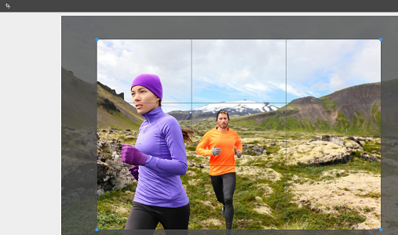

# Fichiers d’enregistrement et d’extraction dans AEM DAM {#check-in-and-check-out-files-in-assets}

Adobe Experience Manager (AEM) Assets permet d’extraire des ressources pour les modifier et de les archiver après avoir apporté les modifications. Après avoir extrait une ressource, vous seul pouvez la modifier, l’annoter, la publier, la déplacer ou la supprimer. Le fait d’extraire une ressource entraîne son verrouillage. Les autres utilisateurs ne peuvent effectuer aucune de ces opérations sur la ressource tant que vous ne la réarchivez pas dans AEM Assets. Toutefois, ils peuvent modifier les métadonnées de la ressource verrouillée.

Vous avez besoin d’un accès en écriture à ces ressources pour être en mesure de les extraire ou de les archiver.

Cette caractéristique permet d’empêcher les autres utilisateurs d’écraser les modifications apportées par un auteur lorsque plusieurs utilisateurs issus de plusieurs équipes collaborent à la modification des workflows.

## Extraction de fichiers {#checking-out-assets}

1. Dans l’interface utilisateur d’Assets, sélectionnez la ressource que vous souhaitez extraire. Vous pouvez également sélectionner plusieurs ressources à extraire.
1. Dans la barre d’outils, cliquez sur **[!UICONTROL Passage en caisse]**.
L’option **[!UICONTROL Passage en caisse]** bascule vers **[!UICONTROL Passage en caisse]**.
Pour vérifier si d’autres utilisateurs peuvent modifier la ressource que vous avez extraite, connectez-vous comme un utilisateur différent. Un symbole de verrou s’affiche sur la miniature du fichier que vous avez extrait.

   

   Sélectionnez la ressource. Notez que la barre d’outils n’affiche aucune option permettant de modifier, d’annoter, de publier ou de supprimer la ressource.

   

   You can click **[!UICONTROL View Properties]** to edit the metadata for the locked asset.

1. Cliquez sur **[!UICONTROL Modifier]** pour ouvrir le fichier en mode d’édition.

   

1. Modifiez la ressource et enregistrez les modifications. Par exemple, recadrez l’image et enregistrez-la.

   

   Vous pouvez également choisir d’annoter ou de publier la ressource.

1. Sélectionnez le fichier modifié dans l’ [!DNL Assets] interface, puis cliquez sur **[!UICONTROL Archiver]** dans la barre d’outils. La ressource modifiée est archivée dans AEM Assets et peut être modifiée par les autres utilisateurs.

## Forced check in {#forced-check-in}

Les administrateurs peuvent archiver les ressources extraites par d’autres utilisateurs.

1. Connectez-vous à AEM Assets en tant qu’administrateur.
1. Dans l’interface utilisateur d’Assets, sélectionnez une ou plusieurs ressources extraites par d’autres utilisateurs.

   

1. Dans la barre d’outils, cliquez sur **[!UICONTROL Verrouiller]**. La ressource est à nouveau archivée et disponible pour modification pour d’autres utilisateurs.

>[!MORELIKETHIS]
>
>* [Comprendre l&#39;archivage et l&#39;extraction dans l&#39;application de bureau AEM](https://docs.adobe.com/content/help/en/experience-manager-desktop-app/using/using.html#how-app-works2)
>* [Didacticiel vidéo pour comprendre l’archivage et l’extraction dans les ressources AEM](https://docs.adobe.com/content/help/en/experience-manager-learn/assets/collaboration/checkin-checkout-technical-video-understand.html)

