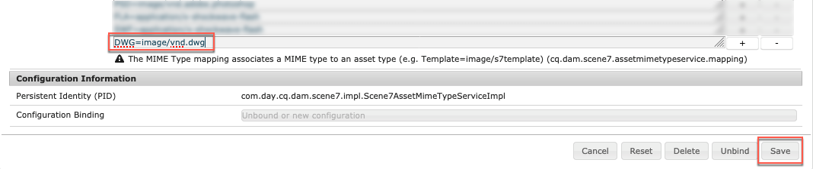

# Configuration de Dynamic Media – mode Scene7{#configuring-dynamic-media-scene-mode}

Si vous utilisez Adobe Experience Manager configuré pour différents environnements, tels que le développement, l’évaluation et la production, configurez les Cloud Services Dynamic Media pour chacun de ces environnements.

## Schéma d’architecture de Dynamic Media – mode Scene7 {#architecture-diagram-of-dynamic-media-scene-mode}

Le schéma d’architecture suivant décrit le fonctionnement de Dynamic Media – mode Scene7.

Grâce à la nouvelle architecture, Experience Manager est responsable des ressources d’origine Principale et des synchronisations avec Dynamic Media pour le traitement et la publication des ressources :

1. Lorsque le fichier source Principal est téléchargé vers le Experience Manager, il est répliqué vers Dynamic Media. À ce stade, Dynamic Media gère l’intégralité du traitement des ressources et de la génération du rendu, comme le codage vidéo et les variantes dynamiques d’une image. <!-- (In Dynamic Media - Scene7 mode, be aware that you can only upload assets whose file sizes are 2 GB or less.) Jira ticket CQ-4286561 fixed this issue. DM-S7 NOW SUPPORTS THE UPLOAD OF ASSETS LARGER THAN 2 GB. -->
1. Une fois les rendus générés, le Experience Manager peut accéder en toute sécurité et prévisualisation aux rendus Dynamic Media distants (aucun binaire n’est renvoyé à l’instance Experience Manager).
1. Une fois que le contenu est prêt à être publié et approuvé, il déclenche le service Dynamic Media pour diffuser le contenu vers les serveurs de diffusion et le mettre en cache sur le réseau CDN (Content Diffusion Network).


>[!NOTE]
>
>La liste de fonctionnalités suivante nécessite l’utilisation du CDN prêt à l’emploi fourni avec Adobe Experience Manager - Dynamic Media. Les autres réseaux CDN personnalisés ne sont pas pris en charge avec ces fonctionnalités.
>
>* [Imagerie dynamique](/help/assets/imaging-faq.md)
>* [Invalidation du cache](/help/assets/invalidate-cdn-cache-dynamic-media.md)
>* [Protection des liens dynamiques](/help/assets/hotlink-protection.md)
>* [Diffusion de contenu HTTP/2](/help/assets/http2.md)
>* Redirection d’URL au niveau du CDN
>* Akamai ChinaCDN (pour une diffusion optimale en Chine)


## Activation de Dynamic Media en mode Scene7 {#enabling-dynamic-media-in-scene-mode}

[Par défaut, ce module complémentaire est désactivé. ](https://www.adobe.com/fr/marketing/experience-manager-assets/dynamic-media.html) Pour tirer parti des fonctionnalités de Dynamic Media, vous devez l&#39;activer.

>[!NOTE]
>
>Dynamic Media - Le mode Scene7 est réservé à l’instance d’auteur Experience Manager. Par conséquent, vous devez configurer `runmode=dynamicmedia_scene7` sur l’instance d’auteur Experience Manager, *et non* l’instance de publication Experience Manager.

Pour activer Dynamic Media, vous devez début le Experience Manager à l&#39;aide du mode d&#39;exécution `dynamicmedia_scene7` à partir de la ligne de commande en saisissant ce qui suit dans une fenêtre de terminal (l&#39;exemple de port utilisé est 4502) :

```shell
java -Xms4096m -Xmx4096m -Doak.queryLimitInMemory=500000 -Doak.queryLimitReads=500000 -jar cq-quickstart-6.5.0.jar -gui -r author,dynamicmedia_scene7 -p 4502
```

## (Facultatif) Migration des paramètres prédéfinis et des configurations Dynamic Media de 6.3 à 6.5 sans interruption {#optional-migrating-dynamic-media-presets-and-configurations-from-to-zero-downtime}

La mise à niveau de Experience Manager Dynamic Media de la version 6.3 à la version 6.4 ou 6.5 permet désormais de ne pas déployer de périodes d’inactivité. Pour migrer tous vos paramètres prédéfinis et configurations de `/etc` vers `/conf` en CRXDE Lite, veillez à exécuter la commande curl suivante.

>[!NOTE]
>
>Si vous exécutez votre instance de Experience Manager en mode de compatibilité (c&#39;est-à-dire si le package de compatibilité est installé), vous n&#39;avez pas besoin d&#39;exécuter ces commandes.

Pour toutes les mises à niveau, avec ou sans le package de compatibilité, vous pouvez copier les paramètres prédéfinis de visionneuse prêts à l’emploi par défaut fournis à l’origine avec Dynamic Media en exécutant la commande suivante de l’option d’activation de Linux® :

`curl -u admin:admin -X POST https://<server_address>:<server_port>/libs/settings/dam/dm/presets/viewer.pushviewerpresets.json`

Pour migrer les paramètres prédéfinis et les configurations de visionneuse personnalisés que vous avez créés à partir de `/etc` vers `/conf`, exécutez la commande d’activation de Linux® suivante :

`curl -u admin:admin -X POST https://<server_address>:<server_port>/libs/settings/dam/dm/presets.migratedmcontent.json`

## Installation de Feature Pack 18912 pour la migration des ressources en vrac {#installing-feature-pack-for-bulk-asset-migration}

L&#39;installation de Feature Pack 18912 est *optionnelle*.

Feature Pack 18912 vous permet soit d’assimiler des fichiers en vrac par FTP, soit de migrer des fichiers du mode Dynamic Media - Hybrid ou de Dynamic Media Classic vers le mode Dynamic Media - Scene7 sur Experience Manager. Il est disponible à partir de [Adobe Professional Services](https://www.adobe.com/fr/experience-cloud/consulting-services.html).

Voir [Installation de Feature Pack 18912 pour la migration des ressources en vrac](/help/assets/bulk-ingest-migrate.md) pour plus d’informations.

## Création d’une configuration Dynamic Media en Cloud Services {#configuring-dynamic-media-cloud-services}

**Avant de configurer Dynamic Media**  : après avoir reçu votre courrier électronique de mise en service avec les informations d’identification Dynamic Media, vous devez ouvrir l’application [ de bureau ](https://experienceleague.adobe.com/docs/dynamic-media-classic/using/getting-started/signing-out.html?lang=fr#getting-started)Dynamic Media Classic, puis vous connecter à votre compte pour modifier votre mot de passe. Le mot de passe fourni dans l’e-mail de mise en service est généré par le système et il est attribué uniquement de manière temporaire. Il est important que vous mettiez à jour le mot de passe afin que Dynamic Media Cloud Service soit configuré avec les informations d’identification correctes.


**Pour créer une configuration Dynamic Media en Cloud Services**

1. Dans Experience Manager, appuyez sur le logo du Experience Manager pour accéder à la console de navigation globale et appuyez sur l’icône Outils, puis appuyez sur **[!UICONTROL Cloud Services > Dynamic Media Configuration]**.
1. Sur la page du navigateur de configuration Dynamic Media, dans le volet de gauche, appuyez sur **[!UICONTROL global]** (ne sélectionnez/n’appuyez pas sur l’icône de dossier située à gauche de **[!UICONTROL global]**), puis sur **[!UICONTROL Créer]**.
1. Sur la page **[!UICONTROL Créer une configuration Dynamic Media]**, saisissez un titre, l’adresse email du compte Dynamic Media et un mot de passe, puis sélectionnez votre région. Ces informations vous sont fournies par Adobe dans le courrier électronique de mise en service. Contactez le service à la clientèle d’Adobe si vous n’avez pas reçu le courrier électronique.

   Appuyez sur **[!UICONTROL Se connecter à Dynamic Media]**.

   >[!NOTE]
   Après avoir reçu votre courrier électronique de mise en service avec les informations d’identification Dynamic Media, ouvrez l’[application de bureau Dynamic Media Classic](https://experienceleague.adobe.com/docs/dynamic-media-classic/using/getting-started/signing-out.html#getting-started), puis connectez-vous à votre compte pour modifier votre mot de passe. Le mot de passe fourni dans l’e-mail de mise en service est généré par le système et il est attribué uniquement de manière temporaire. Il est important de mettre à jour le mot de passe afin que le Cloud Service Dynamic Media soit configuré avec les informations d’identification appropriées.

1. Lorsque la connexion est établie, définissez les options suivantes. Les en-têtes avec un astérisque (*) sont obligatoires :

   * **[!UICONTROL Société]** : nom du compte Dynamic Media. Vous avez plusieurs comptes Dynamic Media. Par exemple, vous pouvez avoir différentes sous-marques, divisions, environnements de production ou de test.

   * **[!UICONTROL Chemin d’accès au dossier racine de l’entreprise]**

   * **[!UICONTROL Publication de ressources]** : vous pouvez choisir parmi les trois options suivantes :
      * **[!UICONTROL Immédiatement]** signifie que lorsque les ressources sont chargées, le système intègre les ressources et fournit instantanément l’URL/le code intégré. Aucune intervention n’est nécessaire de la part de l’utilisateur pour publier des ressources.
      * **[!UICONTROL Lors de]** l’activation, cela signifie que vous devez publier explicitement le fichier avant qu’un lien URL/incorporé ne soit fourni.<br><!-- CQDOC-17478, Added March 9, 2021-->À partir de la version 6.5.8 de Experience Manager, l’instance de publication de Experience Manager reflète des valeurs de métadonnées Dynamic Media précises, telles que  `dam:scene7Domain` et  `dam:scene7FileStatus` en mode  **[!UICONTROL Lors de l’]** activation, publication uniquement. Pour activer cette fonctionnalité, installez le Service Pack 8, puis redémarrez le Experience Manager. Accédez au Gestionnaire de configuration Sling. Recherchez la configuration de `Scene7ActivationJobConsumer Component` ou créez-en une). Cochez la case **[!UICONTROL Répliquer les métadonnées après la publication Dynamic Media]**, puis appuyez sur **[!UICONTROL Enregistrer]**.

         

      * **** Publier de manière sélectiveCette option vous permet de contrôler les dossiers publiés dans Dynamic Media. Il vous permet d’utiliser des fonctionnalités telles que la recadrage dynamique ou les rendus dynamiques, ou de déterminer quels dossiers sont publiés exclusivement en Experience Manager pour la prévisualisation. Ces mêmes actifs sont *non* publiés à Dynamic Media pour diffusion dans le domaine public.<br>Vous pouvez définir cette option ici dans la  **[!UICONTROL Dynamic Media Cloud]** Configurationou, si vous préférez, vous pouvez choisir de la définir au niveau du dossier, dans les  **[!UICONTROL Propriétés]** d’un dossier.<br>Voir [Utilisation de la publication sélective dans Dynamic Media.](/help/assets/selective-publishing.md)<br>Si vous modifiez ultérieurement cette configuration, ou si vous la modifiez ultérieurement au niveau du dossier, ces modifications n’affectent que les nouveaux fichiers que vous téléchargez à partir de ce moment. L’état de publication des ressources existantes dans le dossier reste tel quel jusqu’à ce que vous modifiiez manuellement ces ressources à partir de la boîte de dialogue **[!UICONTROL Publication rapide]** ou **[!UICONTROL Gérer la publication]**.
   * **[!UICONTROL Serveur d’aperçu sécurisé]** : permet de définir le chemin URL de votre serveur d’aperçu des rendus sécurisé. En d’autres termes, une fois les rendus générés, le Experience Manager peut accéder en toute sécurité et prévisualisation aux rendus Dynamic Media distants (aucun binaire n’est renvoyé à l’instance Experience Manager).
À moins que vous ne disposiez d’un arrangement spécial pour utiliser votre propre serveur de société ou un serveur spécial, l’Adobe vous recommande de laisser ce paramètre tel qu’il est spécifié.

   * **[!UICONTROL Synchroniser tout le contenu]**  -  <!-- NEW OPTION, CQDOC-15371, Added March 4, 2020-->Sélectionné par défaut. Désélectionnez cette option si vous souhaitez inclure ou exclure des ressources de la synchronisation avec Dynamic Media. La désélection de cette option vous permet de choisir l’un des deux modes de synchronisation Dynamic Media :

   * **[!UICONTROL Mode de synchronisation Dynamic Media]**
      * **[!UICONTROL Activé par défaut]** : la configuration s’applique par défaut à tous les dossiers, sauf si vous marquez un dossier spécifique à exclure. <!-- you can then deselect the folders that you do not want the configuration applied to.-->
      * **[!UICONTROL Désactivé par défaut]** : la configuration n’est appliquée à aucun dossier tant que vous ne marquez pas explicitement un dossier sélectionné pour synchronisation avec Dynamic Media.
Pour marquer un dossier sélectionné afin de le synchroniser avec Dynamic Media, sélectionnez un dossier de ressources, puis, dans la barre d’outils, appuyez sur **[!UICONTROL Propriétés]**. Sous l’onglet **[!UICONTROL Détails]**, dans la liste déroulante **[!UICONTROL Mode de synchronisation Dynamic Media]**, choisissez l’une des trois options suivantes. Une fois le choix effectué, appuyez sur **[!UICONTROL Enregistrer]**. *À retenir : ces trois options ne sont pas disponibles si vous avez sélectionné auparavant **Synchroniser tout le contenu**.* Voir aussi [Utilisation de la publication sélective au niveau du dossier dans Dynamic Media.](/help/assets/selective-publishing.md)
         * **[!UICONTROL Hérité]**  : aucune valeur de synchronisation explicite sur le dossier ; au lieu de cela, le dossier hérite de la valeur de synchronisation de l’un de ses dossiers ancêtres ou du mode par défaut dans la configuration cloud. L’état détaillé pour les éléments hérités s’affiche par le biais d’une info-bulle.
         * **[!UICONTROL Activer pour les sous-dossiers]**  - Inclure tout ce qui se trouve dans cette sous-arborescence pour la synchronisation avec Dynamic Media. Les paramètres propres au dossier remplacent le mode par défaut dans la configuration du cloud.
         * **[!UICONTROL Désactivé pour les sous-dossiers]**  - Exclure tous les éléments de cette sous-arborescence de la synchronisation vers Dynamic Media.

   >[!NOTE]
   Le contrôle de version n’est pas pris en charge dans DMS7. En outre, l’activation différée ne s’applique que si l’option **[!UICONTROL Publier des ressources]** dans la page de configuration de Dynamic Media est définie sur **[!UICONTROL Dès l’activation]**, puis uniquement jusqu’à la première activation de la ressource.
   Une fois qu’une ressource est activée, toutes les mises à jour sont immédiatement publiées en direct sur la livraison S7.

1. Appuyez sur **[!UICONTROL Enregistrer]**.
1. Pour prévisualisation en toute sécurité du contenu Dynamic Media avant qu’il ne soit publié, vous devez &quot;placer sur la liste autorisée&quot; l’instance d’auteur du Experience Manager à se connecter à Dynamic Media :

   * Ouvrez [l’application de bureau Dynamic Media Classic](https://experienceleague.adobe.com/docs/dynamic-media-classic/using/getting-started/signing-out.html#getting-started) puis connectez-vous à votre compte. Vos informations d’identification et de connexion ont été fournies par l’Adobe au moment de l’attribution des privilèges d’accès. Si vous ne disposez pas de ces informations, contactez l’assistance technique.

   * Dans la barre de navigation située en haut à droite de la page, appuyez sur **[!UICONTROL Configuration > Configuration de l’application > Configuration de la publication > Image Server]**.

   * Sur la page Publication sur hébergeur d’images, dans la liste déroulante Contexte de publication, sélectionnez **[!UICONTROL Test de l’hébergeur d’images]**.
   * Pour l’option Filtre d’adresse client, appuyez sur **[!UICONTROL Ajouter]**.
   * Pour activer (activer) l&#39;adresse, cochez la case. Entrez l’adresse IP de l’instance d’auteur du Experience Manager (et non l’adresse IP du répartiteur).
   * Appuyez sur **[!UICONTROL Enregistrer]**.

Vous avez à présent terminé la configuration de base ; vous êtes prêt à utiliser le mode Scene7 de Dynamic Media.

Si vous souhaitez personnaliser davantage votre configuration, vous pouvez éventuellement effectuer l’une des tâches de la rubrique [(Facultatif) Configuration de paramètres avancés dans le mode Scene7 de Dynamic Media](#optional-configuring-advanced-settings-in-dynamic-media-scene-mode).

## (Facultatif) Configuration de paramètres avancés dans le mode Scene7 de Dynamic Media {#optional-configuring-advanced-settings-in-dynamic-media-scene-mode}

Si vous souhaitez personnaliser davantage l’installation et la configuration du mode Scene7 de Dynamic Media, ou en optimiser les performances, vous pouvez effectuer une ou plusieurs des tâches *facultatives* suivantes :

* [(Facultatif) Installation et configuration des paramètres du mode Scene7 de Dynamic Media](#optional-setup-and-configuration-of-dynamic-media-scene7-mode-settings)

* [(Facultatif) Optimisation des performances du mode Scene7 de Dynamic Media](#optional-tuning-the-performance-of-dynamic-media-scene-mode)

* [(Facultatif) Filtrage des ressources en vue de la réplication](#optional-filtering-assets-for-replication)

### (Facultatif) Installation et configuration des paramètres du mode Scene7 de Dynamic Media {#optional-setup-and-configuration-of-dynamic-media-scene7-mode-settings}

Lorsque vous êtes en mode d’exécution `dynamicmedia_scene7`, utilisez l’interface utilisateur de Dynamic Media Classic pour modifier vos paramètres Dynamic Media.

Certaines des tâches ci-dessus exigent que vous ouvriez l’[application de bureau Dynamic Media Classic](https://experienceleague.adobe.com/docs/dynamic-media-classic/using/getting-started/signing-out.html#getting-started) puis que vous vous connectiez à votre compte.

Les tâches d’installation et de configuration incluent :

* [Configuration de la publication pour Image Server](#publishing-setup-for-image-server)
* [Configuration des paramètres généraux de l’application](#configuring-application-general-settings)
* [Configuration de la gestion des couleurs](#configuring-color-management)
* [Modification des types MIME pour les formats pris en charge](#editing-mime-types-for-supported-formats)
* [Ajout de types MIME pour les formats non pris en charge](#adding-mime-types-for-unsupported-formats)
* [Création de paramètres prédéfinis d’ensemble par lot pour générer automatiquement des visionneuses d’images et des visionneuses à 360°](#creating-batch-set-presets-to-auto-generate-image-sets-and-spin-sets)

#### Configuration de la publication pour Image Server {#publishing-setup-for-image-server}

Les paramètres de configuration de la publication déterminent comment les ressources sont diffusées par défaut à partir de Dynamic Media. Si aucun paramètre n’est spécifié, Dynamic Media diffuse une ressource selon les paramètres par défaut définis dans Configuration de la publication. Par exemple, une requête de diffusion d’image qui ne comporte pas d’attribut de résolution produit une image avec le paramètre de résolution d’objet par défaut.

Pour configurer la configuration de la publication : dans Dynamic Media Classic, appuyez sur **[!UICONTROL Configuration > Configuration de l’application > Configuration de la publication > Image Server]**.

L’écran Image Server permet de définir les paramètres par défaut pour la diffusion des images. Voir l’écran de l’interface utilisateur pour la description de chaque paramètre.

* **[!UICONTROL Attributs de requête]** : ces paramètres imposent des limites aux images qui peuvent être diffusées à partir du serveur.
* **[!UICONTROL Attributs de requête par défaut]** : ces paramètres concernent l’aspect par défaut des images.
* **[!UICONTROL Attributs de miniature courants]** : ces paramètres concernent l’aspect par défaut des images miniatures.
* **[!UICONTROL Valeurs par défaut des champs de catalogue]** : ces paramètres concernent la résolution et le type de miniature par défaut des images.
* **[!UICONTROL Attributs de gestion des couleurs]** : ces paramètres déterminent les profils de couleurs ICC utilisés.
* **[!UICONTROL Attributs de compatibilité]** : ce paramètre permet aux paragraphes de début et de fin des calques de texte d’être traités tels qu’ils l’étaient dans la version 3.6, ce qui les rend rétrocompatibles.
* **[!UICONTROL Aide à la localisation]** : ces paramètres vous permettent de gérer divers attributs de paramètres régionaux. Ils vous permettent également de définir une chaîne de mappage de paramètres régionaux afin de définir les langues à prendre en charge pour les différentes info-bulles dans les visionneuses. Pour plus d’informations sur la configuration de la **[prise en charge de la localisation]**, voir [Considérations à prendre en compte lors de la configuration de la localisation des ressources](https://help.adobe.com/fr_FR/scene7/using/WS997f1dc4cb0179f034e07dc31412799d19a-8000.html).

#### Configuration des paramètres généraux de l’application {#configuring-application-general-settings}

Pour ouvrir la page Paramètres généraux de l’application, dans la barre de navigation globale de Dynamic Media Classic, appuyez sur **[!UICONTROL Configuration > Configuration de l’application > Paramètres généraux]**.

**[!UICONTROL Serveurs]** : au moment de la mise en service du compte, Dynamic Media fournit automatiquement les serveurs attribués à votre entreprise. Ces serveurs sont utilisés pour créer des chaînes URL pour votre site web et vos applications. Ces appels d’URL sont spécifiques à votre compte. Ne changez aucun nom de serveur, sauf si le service à la clientèle d’Adobe lui a demandé de le faire.

**[!UICONTROL Écraser les images]** : Dynamic Media ne permet pas que deux fichiers portent le même nom. L’identifiant de l’URL de chaque élément (le nom de fichier sans l’extension) doit être unique. Ces options spécifient la manière dont les ressources de remplacement sont chargées : elles peuvent remplacer l’original ou devenir un doublon. Les ressources en double sont renommées en ajoutant « -1 » (par exemple, chaise.tif devient chaise-1.tif). Ces options affectent les ressources chargées dans un dossier autre que celui d’origine ou les ressources dont l’extension est différente de celle du fichier d’origine (telle que JPG, TIF ou PNG).

* **[!UICONTROL Écraser dans dossier actuel, même nom/même extension de fichier de base]** : cette option est la règle la plus stricte pour le remplacement. Elle implique que vous chargiez l’image de remplacement dans le même dossier que l’original, et qu’elle ait la même extension que le fichier d’origine. Si ces conditions ne sont pas remplies, un doublon est créé.

>[!NOTE]
Pour maintenir la cohérence avec le Experience Manager, choisissez toujours ce paramètre : **Ecraser dans le dossier actif, même nom/extension d’image de base**

* **[!UICONTROL Écraser dans un dossier, même nom/même extension de fichier de base]** : nécessite que l’image de remplacement ait la même extension que l’image d’origine (par exemple, chaise.jpg peut remplacer uniquement chaise.jpg, et non chaise.tif). Vous pouvez néanmoins télécharger l’image de remplacement dans un dossier différent de celui de l’image d’origine. L’image mise à jour se trouve dans le nouveau dossier ; le fichier d’origine n’est plus disponible à l’emplacement d’origine.
* **[!UICONTROL Écraser dans un dossier, même nom de fichier, extension indépendante]** : cette option est la règle de remplacement la plus inclusive. Elle vous permet de charger une image de remplacement dans un dossier autre que celui de l’image d’origine, de charger un fichier dont l’extension est différente de celle du fichier d’origine et de remplacer le fichier d’origine. Si le fichier d’origine se trouve dans un dossier différent, l’image de remplacement est enregistrée dans le nouveau dossier où elle a été chargée.

**[!UICONTROL Profils de couleurs par défaut]** : voir [Configuration de la gestion des couleurs](#configuring-color-management) pour plus d’informations.

>[!NOTE]
Par défaut, le système affiche 15 rendus lorsque vous sélectionnez **[!UICONTROL Rendus]** et 15 paramètres prédéfinis de la visionneuse lorsque vous sélectionnez **[!UICONTROL Visionneuses]** dans la vue détaillée de la ressource. Vous pouvez augmenter cette limite. Voir [Augmentation du nombre de paramètres d’image prédéfinis qui s’affichent](/help/assets/managing-image-presets.md#increasing-or-decreasing-the-number-of-image-presets-that-display) ou [Augmentation du nombre de paramètres prédéfinis de visionneuse qui s’affichent](/help/assets/managing-viewer-presets.md#increasing-the-number-of-viewer-presets-that-display).


#### Configuration de la gestion des couleurs {#configuring-color-management}

La gestion des couleurs de Dynamic Media vous permet de corriger les couleurs des ressources. Avec la correction des couleurs, les ressources intégrées conservent leur espace colorimétrique (RVB, CMJN, gris) et leur profil de couleur intégré. Lorsque vous demandez un rendu dynamique, la couleur de l’image est corrigée dans l’espace colorimétrique cible en utilisant une sortie CMJN, RVB ou grise. Reportez-vous à la section [Configuration des paramètres d’image prédéfinis](/help/assets/managing-image-presets.md).

Pour configurer les propriétés de couleur par défaut afin que la correction des couleurs soit activée lorsque des images sont demandées :

1. Ouvrez l’[application de bureau Dynamic Media Classic](https://experienceleague.adobe.com/docs/dynamic-media-classic/using/getting-started/signing-out.html#getting-started) puis connectez-vous à votre compte à l’aide des informations d’identification fournies lors de la mise en service.
1. Accédez à **[!UICONTROL Configuration > Configuration de l’application]**.
1. Développez la zone **[!UICONTROL Configuration de la publication]** et sélectionnez **[!UICONTROL Image Server]**. Définissez **[!UICONTROL Contexte de publication]** sur **[!UICONTROL Imager Server]** lors de la définition des paramètres par défaut des instances de publication.
1. Accédez à la propriété que vous souhaitez modifier. Par exemple, une propriété de la zone **[!UICONTROL Attributs de gestion des couleurs]**.

   Vous pouvez définir les propriétés de correction des couleurs suivantes :

   * **[!UICONTROL Espace colorimétrique CMJN par défaut]** : nom du profil de couleurs CMJN par défaut.
   * **[!UICONTROL Espace colorimétrique de niveaux de gris par défaut]** : nom du profil de niveaux de gris par défaut.
   * **[!UICONTROL Espace colorimétrique RVB par défaut]** : nom du profil de couleurs RVB par défaut.
   * **[!UICONTROL Intention de rendu de conversion de couleurs]** : indique l’intention de rendu. Les valeurs possibles sont les suivantes : **[!UICONTROL perception]**, **[!UICONTROL colorimétrie relative]**, **[!UICONTROL saturation]** et **[!UICONTROL colorimétrie absolue]**. Adobe recommande d’utiliser **[!UICONTROL colorimétrie relative]** comme valeur par défaut.

1. Appuyez sur **[!UICONTROL Enregistrer]**.

Par exemple, vous pouvez définir l’**[!UICONTROL Espace colorimétrique RVB par défaut]** sur *sRVB* et l’**[!UICONTROL Espace colorimétrique CMJN par défaut]** sur *WebCoated*.

Cela aura les effets suivants :

* Active la correction des couleurs pour les images RVB et CMJN.
* Les images RVB sans profil de couleur sont supposées se trouver dans l’espace colorimétrique *sRVB*.
* Les images CMJN qui n’ont pas de profil de couleur sont supposées se trouver dans l’espace colorimétrique *WebCoated*.
* Rendus dynamiques renvoyant une sortie RVB, renvoyez-la dans l’espace colorimétrique *sRVB*.
* Rendus dynamiques renvoyant une sortie CMJN, renvoyez-la dans l’espace colorimétrique *WebCoated*.

#### Modification des types MIME pour les formats pris en charge {#editing-mime-types-for-supported-formats}

Vous pouvez définir les types de ressources traités par Dynamic Media et personnaliser les paramètres de traitement des ressources avancé. Vous pouvez, par exemple, spécifier les paramètres de traitement des ressources de façon à ce qu’ils effectuent les opérations suivantes :

* Conversion d’un PDF Adobe en ressource de catalogue électronique.
* Conversion d’un document Adobe Photoshop (.psd) en ressource de modèle de bannière afin de permettre la personnalisation.
* pixelliser un fichier Adobe Illustrator (.AI) ou un fichier PostScript® encapsulé Adobe Photoshop (.EPS).
* Des [profils vidéo](/help/assets/video-profiles.md) et des [profils d’images](/help/assets/image-profiles.md) peuvent être utilisés pour définir le traitement des vidéos et des images.

Voir la section [Chargement des ressources](/help/assets/manage-assets.md#uploading-assets).

**Pour modifier les types MIME pour les formats pris en charge :**

1. Dans Experience Manager, appuyez sur le logo du Experience Manager pour accéder à la console de navigation globale, puis appuyez sur **[!UICONTROL Outils > Général > CRXDE Lite]**.
1. Dans le rail de gauche, accédez à ce qui suit :

   `/conf/global/settings/cloudconfigs/dmscene7/jcr:content/mimeTypes`

   

1. Sous le dossier mimeTypes, sélectionnez un type MIME.
1. Sur le côté droit de la page CRXDE Lite, dans la partie inférieure :

   * Cliquez deux fois sur le champ **[!UICONTROL enabled]**. Par défaut, tous les types MIME d’actifs sont activés (définis sur **[!UICONTROL true]**), ce qui signifie que les actifs sont synchronisés sur Dynamic Media pour traitement. Si vous souhaitez exclure ce type MIME de ressource du traitement, définissez ce paramètre sur **[!UICONTROL false]**.

   * doublon-appuyez sur **[!UICONTROL jobParam]** pour ouvrir le champ de texte associé. Voir [Types MIME pris en charge](/help/assets/assets-formats.md#supported-mime-types) pour connaître la liste des valeurs de paramètres de traitement que vous pouvez utiliser pour un type MIME donné.

1. Utilisez l’une des méthodes suivantes :

   * Répétez les étapes 3 à 4 pour modifier d’autres types MIME.
   * Dans la barre de menus de la page du CRXDE Lite, appuyez sur **[!UICONTROL Enregistrer tout]**.

1. Dans le coin supérieur gauche de la page, appuyez sur **[!UICONTROL CRXDE Lite]** pour revenir au Experience Manager.

#### Ajout de types MIME pour les formats non pris en charge {#adding-mime-types-for-unsupported-formats}

Vous pouvez ajouter des types MIME personnalisés pour les formats non pris en charge dans les ressources du Experience Manager. Assurez-vous que tout nouveau noeud ajouté dans le CRXDE Lite n’est pas supprimé par le Experience Manager en déplaçant le type MIME avant `image_`. Assurez-vous également que sa valeur activée est définie sur **[!UICONTROL false]**.

**Pour ajouter des types MIME pour des formats non pris en charge:**

1. Dans le Experience Manager, appuyez sur **[!UICONTROL Outils > Opérations > Console Web]**.

   

1. Un nouvel onglet du navigateur s’ouvre sur la page **[!UICONTROL Adobe Experience Manager Web Console Configuration]** (Configuration de la console web Adobe Experience Manager).

   

1. Sur la page, faites défiler l’écran jusqu’à atteindre *Adobe CQ Scene7 Asset MIME type Service*, comme illustré ci-dessous. À droite du nom, appuyez sur **[!UICONTROL Modifier les valeurs de configuration]** (icône en forme de crayon).

   

1. Sur la page **Adobe CQ Asset MIME type Service**, appuyez sur toute icône de signe plus &lt;+>. L’emplacement dans le tableau où vous appuyez sur le signe plus pour ajouter le nouveau type MIME est trivial.

   

1. Entrez `DWG=image/vnd.dwg` dans le champ de texte vide que vous venez d’ajouter.

   L&#39;exemple `DWG=image/vnd.dwg` n&#39;est fourni qu&#39;à titre d&#39;illustration. Le type MIME que vous ajoutez ici peut être tout autre format non pris en charge.

   

1. Dans le coin inférieur droit de la page, appuyez sur **[!UICONTROL Save]** (Enregistrer).

   À ce stade, vous pouvez fermer l’onglet du navigateur dans lequel la page de configuration de la console web d’Adobe Experience Manager est ouverte.

1. Revenez à l’onglet du navigateur qui contient votre console de Experience Manager ouverte.
1. Dans le Experience Manager, appuyez sur **[!UICONTROL Outils > Général > CRXDE Lite]**.

   

1. Dans le rail de gauche, accédez à ce qui suit :

   `conf/global/settings/cloudconfigs/dmscene7/jcr:content/mimeTypes`

1. Faites glisser le type MIME `image_vnd.dwg` et déposez-le directement au-dessus de `image_` de l’arborescence, comme dans la capture d’écran suivante.

   

1. Le type MIME `image_vnd.dwg` étant toujours sélectionné, dans l&#39;onglet **[!UICONTROL Propriétés]**, dans la ligne **[!UICONTROL enabled]**, sous l&#39;en-tête de colonne **[!UICONTROL Valeur]**, appuyez sur la valeur pour ouvrir la liste déroulante **[!UICONTROL Valeur]**.
1. Tapez `false` dans le champ (ou sélectionnez **[!UICONTROL false]** dans la liste déroulante).

   

1. Près du coin supérieur gauche de la page du CRXDE Lite, appuyez sur **[!UICONTROL Enregistrer tout]**.

#### Création de paramètres prédéfinis d’ensemble par lot pour générer automatiquement des visionneuses d’images et des visionneuses à 360° {#creating-batch-set-presets-to-auto-generate-image-sets-and-spin-sets}

Utilisez les paramètres prédéfinis d’ensemble par lot pour automatiser la création de visionneuses d’images ou de jeux de rotation lorsque des ressources sont téléchargées sur Dynamic Media.

Tout d’abord, définissez la convention d’affectation de nom pour le mode de regroupement des fichiers dans un ensemble. Créez ensuite un paramètre prédéfini d’ensemble par lot qui correspond à un ensemble d’instructions indépendant à nom unique. Il doit définir comment construire la visionneuse à l’aide d’images qui correspondent aux conventions d’affectation de nom définies dans la recette de paramètres prédéfinis.

Lorsque vous téléchargez des fichiers, Dynamic Media crée automatiquement une visionneuse avec tous les fichiers qui correspondent à la convention de nommage définie dans les paramètres prédéfinis actifs.

**Configuration du nommage par défaut**

Créez une convention de nommage par défaut qui est utilisée dans n’importe quelle recette de paramètre prédéfini d’ensemble par lot. La convention d’affectation de nom par défaut sélectionnée dans la définition des paramètres prédéfinis d’ensemble par lot est probablement tout ce dont votre société a besoin pour générer des visionneuses par lot. Un paramètre prédéfini d’ensemble par lot est créé pour utiliser la convention de nommage par défaut que vous définissez. Vous pouvez créer autant de paramètres prédéfinis d’ensemble par lot que nécessaire avec des conventions de nommage différentes et personnalisées pour une visionneuse de contenu spécifique au cas où il existe une exception dans le nommage par défaut défini par l’entreprise.

Bien que la configuration d’une convention d’affectation de nom par défaut ne soit pas nécessaire pour utiliser la fonctionnalité de paramètres prédéfinis d’ensemble par lot, il est recommandé d’utiliser la convention d’affectation de nom par défaut. Il vous permet de définir autant d’éléments de votre convention d’affectation de nom que vous souhaitez regrouper dans une visionneuse afin de simplifier la création d’ensembles par lot.

Vous pouvez également utiliser le **[!UICONTROL code de Vue]** sans champs de formulaire. Dans cette vue, vous créez vos définitions de convention d’affectation de nom entièrement à l’aide d’expressions régulières.

Deux éléments sont disponibles pour la définition : correspondance et nom de base. Ces champs vous permettent de définir tous les éléments de la convention de nommage et d’identifier la partie de la convention utilisée pour nommer la visionneuse dans laquelle ils se trouvent. La convention d’affectation de nom individuelle d’une société utilise souvent une ou plusieurs lignes de définition pour chacun de ces éléments. Vous pouvez utiliser autant de lignes que vous le souhaitez pour votre définition unique et les regrouper dans des éléments distincts, par exemple, pour l’image principale, les éléments Couleur, Affichage secondaire et Échantillon.

**Pour configurer l’affectation de nom par défaut:**

1. Ouvrez [l’application de bureau Dynamic Media Classic](https://experienceleague.adobe.com/docs/dynamic-media-classic/using/getting-started/signing-out.html#getting-started) puis connectez-vous à votre compte.

   Vos informations d’identification et de connexion ont été fournies par l’Adobe au moment de l’attribution des privilèges d’accès. Si vous ne disposez pas de ces informations, contactez l’assistance technique.

1. Sur la barre de navigation située en haut de la page, appuyez sur **[!UICONTROL Configuration > Configuration de l’application > Paramètres prédéfinis d’ensemble par lot > Affectation de nom par défaut]**.
1. Sélectionnez **[!UICONTROL Afficher le formulaire]** ou **[!UICONTROL Afficher le code]** pour indiquer le mode de visualisation et de saisie des informations sur chaque élément.

   Vous pouvez cocher la case **[!UICONTROL Afficher le code]** pour afficher la valeur d’expression régulière qui se crée à côté de vos sélections dans le formulaire. Vous pouvez saisir ou modifier ces valeurs pour définir les éléments de la convention de nommage si l’affichage sous forme de formulaire vous limite pour quelque raison que ce soit. Si vos valeurs ne peuvent pas être analysées dans l’affichage de formulaire, les champs de formulaire seront inactifs.

   >[!NOTE]
   Les champs de formulaire désactivés ne permettent pas de confirmer que vos expressions régulières sont correctes. Vous verrez les résultats de l’expression régulière que vous créez pour chaque élément après la ligne de résultat. L’expression régulière est visible en entier en bas de la page.

1. Développez chaque élément selon vos besoins et indiquez les conventions de nommage que vous souhaitez utiliser.
1. Si nécessaire, effectuez l’une des opérations suivantes :

   * Appuyez sur **[!UICONTROL Ajouter]** afin d’ajouter une autre convention d’affectation de nom pour un élément.
   * Appuyez sur **[!UICONTROL Supprimer]** afin de supprimer une convention d’affectation de nom pour un élément.

1. Utilisez l’une des méthodes suivantes :

   * Appuyez sur **[!UICONTROL Enregistrer sous]** et saisissez un nom pour le paramètre prédéfini.
   * Appuyez sur **[!UICONTROL Enregistrer]** si vous modifiez un paramètre prédéfini existant.

**Création d’un paramètre prédéfini d’ensemble par lot**

Dynamic Media utilise les paramètres prédéfinis d’ensemble par lot pour organiser les ressources en visionneuses d’images (images de remplacement, options de couleur, rotation à 360°) pour l’affichage dans des visionneuses. Les paramètres prédéfinis d’ensemble par lot s’exécutent automatiquement avec les processus de transfert des ressources dans Dynamic Media.

Vous pouvez créer, modifier et gérer vos paramètres prédéfinis d’ensemble par lot. Il existe deux formes de définitions de paramètres prédéfinis d’ensemble par lot : l’une pour une convention d’affectation de nom par défaut que vous pouvez configurer, l’autre pour des conventions d’affectation de nom personnalisées que vous créez à la volée.

Vous pouvez utiliser la méthode de champ de formulaire pour définir un paramètre prédéfini d’ensemble par lot ou la méthode de code, qui vous permet d’utiliser des expressions régulières. Comme dans le nommage par défaut, vous pouvez sélectionner Afficher le code en même temps que vous définissez la vue Formulaire et utilisez des expressions régulières pour créer vos définitions. Vous pouvez également désélectionner l’une des deux vues pour utiliser uniquement l’une ou l’autre.

**Pour créer un paramètre prédéfini d’ensemble par lot:**

1. Ouvrez [l’application de bureau Dynamic Media Classic](https://experienceleague.adobe.com/docs/dynamic-media-classic/using/getting-started/signing-out.html#getting-started) puis connectez-vous à votre compte.

   Vos informations d’identification et de connexion ont été fournies par l’Adobe au moment de l’attribution des privilèges d’accès. Si vous ne disposez pas de ces informations, contactez l’assistance technique.

1. Dans la barre de navigation située en haut de la page, appuyez sur **[!UICONTROL Configuration > Configuration de l’application > Paramètres prédéfinis d’ensemble par lot > Paramètre prédéfini d’ensemble par lot]**.

   **[!UICONTROL Le formulaire]** de vue, tel qu’il est défini dans le coin supérieur droit de la page Détails, est la vue par défaut.

1. Dans le panneau Liste des paramètres prédéfinis, appuyez sur **[!UICONTROL Ajouter]** pour activer les champs de définition dans le panneau Détails sur le côté droit de l’écran.
1. Dans le panneau Détails, nommez le paramètre prédéfini dans le champ Nom du paramètre prédéfini.
1. Dans le menu déroulant Type d’ensemble par lot, sélectionnez un type de paramètre prédéfini.
1. Utilisez l’une des méthodes suivantes :

   * Si vous utilisez une convention d’affectation de nom par défaut que vous avez précédemment définie sous **[!UICONTROL Configuration de l’application > Paramètres prédéfinis d’ensemble par lot > Nom par défaut]**, développez **[!UICONTROL Conventions d’affectation de nom]**, puis dans la liste déroulante Affectation de nom de fichier, appuyez sur **[!UICONTROL Par défaut]**.

   * Pour définir une nouvelle convention d’affectation de nom lorsque vous configurez le paramètre prédéfini, développez **[!UICONTROL Conventions d’affectation de nom]**, puis, dans la liste déroulante Affectation de nom de fichier, appuyez sur **[!UICONTROL Personnalisé]**.

1. Pour l’ordre des séquences, définissez l’ordre d’affichage des images une fois la visionneuse regroupée dans Dynamic Media.

   Par défaut, les ressources sont classées par ordre alphanumérique. Cependant, vous pouvez utiliser une liste d’expressions régulières séparées par des virgules pour définir l’ordre.

1. Dans Options de création et d’affectation de nom de l’ensemble, indiquez le suffixe ou le préfixe du nom de base que vous avez défini dans la convention d’affectation de nom. Définissez également l’emplacement de création du jeu dans la structure de dossiers Dynamic Media.

   Si vous définissez un grand nombre de jeux, gardez les jeux à l’écart des dossiers contenant les fichiers eux-mêmes. Par exemple, créez un dossier Visionneuses d’images et placez les visionneuses générées ici.

1. Dans le panneau Détails, appuyez sur **[!UICONTROL Enregistrer]**.
1. Appuyez sur **[!UICONTROL Actif]** en regard du nom du nouveau paramètre prédéfini.

   L’activation du paramètre prédéfini garantit que, lorsque vous chargez des ressources vers Dynamic Media, le paramètre prédéfini d’ensemble par lot est appliqué pour générer la visionneuse.

**Création d’un paramètre prédéfini d’ensemble par lot pour la génération automatique d’une visionneuse à 360° en 2D**

Vous pouvez utiliser le type d’ensemble par lot **[!UICONTROL Visionneuse à 360° multi-axe]** pour créer une recette qui automatise la génération des visionneuses à 360° en 2D. Le regroupement des images utilise des expressions régulières de ligne et de colonne afin que les ressources d’image soient correctement alignées à l’emplacement correspondant dans le tableau multidimensionnel. Il n’existe aucune limite minimale ou maximale quant au nombre de lignes ou de colonnes nécessaires dans la visionneuse à 360° multi-axe.

Par exemple, supposons que vous souhaitiez créer une visionneuse à 360° multi-axe nommée `spin-2dspin`. Vous disposez d’un ensemble d’images de visionneuse à 360° qui contient trois lignes, avec 12 images par ligne. Les images sont nommées comme suit :

```
spin-01-01
 spin-01-02
 …
 spin-01-12
 spin-02-01
 …
 spin-03-12
```

Grâce à ces informations, votre recette Type d&#39;ensemble par lot peut être créée comme suit :


Le regroupement de la partie du nom de ressource partagée de la visionneuse à 360° est ajouté au champ **Correspondance** (comme souligné). La partie variable du nom de ressource contenant la ligne et la colonne est ajoutée respectivement aux champs **Ligne** et **Colonne**.

Lorsque la visionneuse à 360° est téléchargée et publiée, vous activez le nom de la recette de visionneuse à 360° en 2D répertoriée sous **Paramètres prédéfinis d’ensemble par lot** dans la boîte de dialogue **Télécharger les options de la tâche**.

**Pour créer un paramètre prédéfini d’ensemble par lot pour la génération automatique d’une visionneuse à 360° en 2D:**

1. Ouvrez [l’application de bureau Dynamic Media Classic](https://experienceleague.adobe.com/docs/dynamic-media-classic/using/getting-started/signing-out.html#getting-started) puis connectez-vous à votre compte.

   Vos informations d’identification et de connexion ont été fournies par l’Adobe au moment de l’attribution des privilèges d’accès. Si vous ne disposez pas de ces informations, contactez l’assistance technique.

1. Dans la barre de navigation située en haut de la page, appuyez sur **[!UICONTROL Configuration] > [!UICONTROL Configuration de l’application] > [!UICONTROL Paramètres prédéfinis d’ensemble par lot] > [!UICONTROL Paramètre prédéfini d’ensemble par lot]**.

   **[!UICONTROL Le formulaire]** de vue, tel qu’il est défini dans le coin supérieur droit de la page Détails, est la vue par défaut.

1. Dans le panneau Liste des paramètres prédéfinis, appuyez sur **[!UICONTROL Ajouter]** pour activer les champs de définition dans le panneau Détails sur le côté droit de l’écran.
1. Dans le panneau Détails, nommez le paramètre prédéfini dans le champ Nom du paramètre prédéfini.
1. Dans le menu déroulant Type d’ensemble par lot, sélectionnez **[!UICONTROL Visionneuse de ressources]**.
1. Dans la liste déroulante Sous-type, sélectionnez **[!UICONTROL Visionneuse à 360° multi-axe]**.
1. Développez **[!UICONTROL Conventions d’affectation de nom]**, puis, dans la liste déroulante Affectation de nom de fichier, appuyez sur **[!UICONTROL Personnalisé]**.
1. Utilisez les attributs **[!UICONTROL Correspondance]** et, éventuellement, **[!UICONTROL Nom de base]** pour définir une expression régulière pour nommer les fichiers d’image qui constituent le regroupement.

   Par exemple, votre expression ordinaire Correspondance littérale peut se présenter comme suit :

   `(w+)-w+-w+`

1. Développez **[!UICONTROL Position des colonnes/lignes]**, puis définissez le format de nom de la position de la ressource image dans le tableau de la visionneuse à 360° en 2D.

   Placez la position de ligne ou de colonne entre parenthèses dans le nom de fichier.

   Par exemple, pour votre expression régulière de ligne, elle peut se présenter comme suit :

   `\w+-R([0-9]+)-\w+`

   ou

   `\w+-(\d+)-\w+`

   Pour votre expression régulière de colonne, elle peut se présenter comme suit :

   `\w+-\w+-C([0-9]+)`

   ou

   `\w+-\w+-C(\d+)`

   Les exemples ci-dessus sont fournis à titre indicatif uniquement. Vous pouvez créer votre expression régulière comme bon vous semble, en fonction de vos besoins.

   >[!NOTE]
   Si la combinaison d’expressions régulières de ligne et de colonne ne parvient pas à déterminer la position de la ressource dans la baie de disques multidimensionnelle, la ressource n’est pas ajoutée à la visionneuse. Une erreur est également consignée.

1. Dans Options de création et d’affectation de nom de l’ensemble, indiquez le suffixe ou le préfixe du nom de base que vous avez défini dans la convention d’affectation de nom.

   Définissez également l’emplacement de création de la visionneuse à 360° dans la structure de dossiers Dynamic Media Classic.

   Si vous définissez un grand nombre de jeux, gardez les jeux à l’écart des dossiers contenant les fichiers eux-mêmes. Par exemple, créez un dossier Visionneuses à 360° pour y placer les visionneuses générées.

1. Dans le panneau Détails, appuyez sur **[!UICONTROL Enregistrer]**.
1. Appuyez sur **[!UICONTROL Actif]** en regard du nom du nouveau paramètre prédéfini.

   L’activation du paramètre prédéfini garantit que, lorsque vous chargez des ressources vers Dynamic Media, le paramètre prédéfini d’ensemble par lot est appliqué pour générer la visionneuse.

### (Facultatif) Optimisation des performances du mode Scene7 de Dynamic Media  {#optional-tuning-the-performance-of-dynamic-media-scene-mode}

Pour que le mode Dynamic Media - Scene7 fonctionne correctement, l’Adobe recommande les conseils de réglage précis des performances et de l’évolutivité de la synchronisation suivants :

* Mise à jour des paramètres de tâche prédéfinis pour le traitement de différents formats de fichier.
* Mise à jour des threads de traitement de file d’attente de workflows Granite prédéfinis (ressources vidéo).
* Mise à jour des threads de traitement de file d’attente de workflows Granite prédéfinis (images et ressources non vidéo).
* Mise à jour du nombre maximal de connexions de chargement au serveur Dynamic Media Classic.

#### Mise à jour des paramètres de tâche prédéfinis pour le traitement de différents formats de fichier

Vous pouvez régler les paramètres de tâche pour accélérer le traitement des fichiers lors du chargement. Par exemple, si vous téléchargez des fichiers PSD mais que vous ne souhaitez pas les traiter comme modèles, vous pouvez définir l’extraction du calque sur false (désactivé). Dans ce cas, le paramètre de tâche affinée s’affiche comme suit : `process=None&createTemplate=false`.

Si vous souhaitez activer la création de modèles, utilisez les paramètres suivants : `process=MaintainLayers&layerNaming=AppendName&createTemplate=true`.

<!-- THIS PARAGRAPH WAS REPLACED WITH THE TWO PARAGRAPHS DIRECTLY ABOVE BASED ON CQDOC-17657 You can tune job parameters for faster processing when you upload files. For example, if you are uploading PSD files, but do not want to process them as templates, you can set layer extraction to false (off). In such case, the tuned job parameter would appear as `process=None&createTemplate=false`. -->

L’Adobe recommande d’utiliser les paramètres de tâche &quot;affinés&quot; suivants pour les fichiers PDF, PostScript® et PSD :

<!-- OLD PDF JOB PARAMETERS `pdfprocess=Rasterize&resolution=150&colorspace=Auto&pdfbrochure=false&keywords=false&links=false` -->

<!-- OLD POSTSCRIPT JOB PARAMETERS `psprocess=Rasterize&psresolution=150&pscolorspace=Auto&psalpha=false&psextractsearchwords=false&aiprocess=Rasterize&airesolution=150&aicolorspace=Auto&aialpha=false` -->

| Type de fichier | Paramètres de tâche recommandés |
| ---| ---|
| PDF | `pdfprocess=Thumbnail&resolution=150&colorspace=Auto&pdfbrochure=false&keywords=false&links=false` |
| PostScript® | `psprocess=Rasterize&psresolution=150&pscolorspace=Auto&psalpha=false&psextractsearchwords=false&aiprocess=Thumbnail&airesolution=150&aicolorspace=Auto&aialpha=false` |
| PSD | `process=None&layerNaming=AppendName&anchor=Center&createTemplate=false&extractText=false&extendLayers=false` |

<!-- CQDOC-17657 for PSD entry in table above -->

Pour mettre à jour l’un de ces paramètres, procédez comme indiqué dans la [Activation de la prise en charge du paramètre de tâche de chargement Assets/Dynamic Media Classic basé sur le type MIME](/help/sites-administering/scene7.md#enabling-mime-type-based-assets-scene-upload-job-parameter-support).

#### Mise à jour de la file d&#39;attente de processus transitoire Granite {#updating-the-granite-transient-workflow-queue}

La file d’attente de workflows Granite est utilisée pour le workflow **[!UICONTROL Ressources de mise à jour de gestion des actifs numériques]**. Dans Dynamic Media, elle est utilisée pour l’intégration et le traitement des images.

**Pour mettre à jour la file d&#39;attente de processus transitoire Granite :**

1. Accédez à [https://&lt;serveur>/system/console/configMgr](https://localhost:4502/system/console/configMgr) et recherchez **Queue: Granite Transient Workflow Queue** (File d’attente : file d’attente de workflows transitoires Granite).

   >[!NOTE]
   Il est nécessaire d’effectuer une recherche par texte au lieu d’utiliser une URL directe, car le PID OSGi est généré dynamiquement.

1. Dans le champ **[!UICONTROL Maximum Parallel Jobs]** (Nombre maximal de tâches en parallèle), modifiez le nombre en fonction de la valeur souhaitée.

   Vous pouvez augmenter le **[!UICONTROL nombre maximal de tâches en parallèle]** afin de prendre en charge le chargement intensif de fichiers vers Dynamic Media. La valeur exacte dépend de la capacité matérielle. Dans certains cas, c’est-à-dire lors d’une migration initiale ou d’un chargement en vrac unique, vous pouvez utiliser une valeur importante. Sachez toutefois que l’utilisation d’une valeur élevée (par exemple deux fois le nombre de coeurs) peut avoir des effets négatifs sur d’autres activités simultanées. Par conséquent, testez et ajustez la valeur en fonction de votre cas d’utilisation particulier.

<!--    By default, the maximum number of parallel jobs depends on the number of available CPU cores. For example, on a 4-core server, it assigns 2 worker threads. (A value between 0.0 and 1.0 is ratio based, or any numbers greater than 1 will assign the number of worker threads.)

   Adobe recommends that 32 **[!UICONTROL Maximum Parallel Jobs]** be configured to adequately support heavy upload of files to Dynamic Media Classic (Scene7). -->


1. Appuyez sur **[!UICONTROL Enregistrer]**.

#### Mise à jour de la file d&#39;attente de processus Granite {#updating-the-granite-workflow-queue}

La file d’attente de workflows Granite est utilisée pour les workflows non transitoires. Dans Dynamic Media, il traitait la vidéo avec le flux de travail **[!UICONTROL Dynamic Media Encode Video]**.

**Pour mettre à jour la file d&#39;attente de processus Granite :**

1. Accédez à `https://<server>/system/console/configMgr` et recherchez **Queue: Granite Workflow Queue** (File d’attente : file d’attente de workflows Granite).

   >[!NOTE]
   Il est nécessaire d’effectuer une recherche par texte au lieu d’utiliser une URL directe, car le PID OSGi est généré dynamiquement.

1. Dans le champ **[!UICONTROL Maximum Parallel Jobs]** (Nombre maximal de tâches en parallèle), modifiez le nombre en fonction de la valeur souhaitée.

   Vous pouvez augmenter le nombre maximal de tâches en parallèle afin de prendre en charge le chargement intensif de fichiers vers Dynamic Media. La valeur exacte dépend de la capacité matérielle. Dans certains cas, c’est-à-dire lors d’une migration initiale ou d’un chargement en vrac unique, vous pouvez utiliser une valeur importante. Sachez toutefois que l’utilisation d’une valeur élevée (par exemple deux fois le nombre de coeurs) peut avoir des effets négatifs sur d’autres activités simultanées. Par conséquent, testez et ajustez la valeur en fonction de votre cas d’utilisation particulier.

   

1. Appuyez sur **[!UICONTROL Save]** (Enregistrer).

#### Mise à jour de la connexion de transfert Dynamic Media Classic {#updating-the-scene-upload-connection}

Le paramètre Scene7 Upload Connection synchronise les ressources du Experience Manager sur les serveurs Dynamic Media Classic.

**Pour mettre à jour la connexion de transfert Dynamic Media Classic :**

1. Accédez à `https://<server>/system/console/configMgr/com.day.cq.dam.scene7.impl.Scene7UploadServiceImpl`.
1. Dans le champ **[!UICONTROL Number of connections]** (Nombre de connexions) et/ou **[!UICONTROL Active job timeout]** (Délai d’expiration des tâches actives), modifiez le nombre en fonction de vos besoins.

   Le paramètre **[!UICONTROL Nombre de connexions]** contrôle le nombre maximal de connexions HTTP autorisées pour le Experience Manager au transfert Dynamic Media ; généralement, la valeur prédéfinie de dix connexions est suffisante.

   Le paramètre **[!UICONTROL Active job timeout]** détermine le temps d’attente avant que les ressources Dynamic Media chargées ne soient publiées sur le serveur de diffusion. Cette valeur est de 2 100 secondes ou 35 minutes, par défaut.

   Dans la plupart des cas d’utilisation, le paramètre de 2 100 est suffisant.

   

1. Appuyez sur **[!UICONTROL Enregistrer]**.

### (Facultatif) Filtrage des ressources en vue de la réplication {#optional-filtering-assets-for-replication}

Dans les déploiements autres que Dynamic Media, vous pouvez répliquer *tous les* fichiers (images et vidéos) de votre environnement d’auteur Experience Manager vers le noeud de publication Experience Manager. Ce processus est nécessaire car les serveurs de publication du Experience Manager diffusent également les ressources.

Cependant, dans les déploiements Dynamic Media, dans la mesure où les ressources sont distribuées par le biais du Cloud Service, il n’est pas nécessaire de répliquer ces mêmes ressources sur les noeuds de publication Experience Manager. Un tel processus de &quot;publication hybride&quot; permet d’éviter des coûts d’enregistrement supplémentaires et des délais de traitement plus longs pour la réplication des ressources. D’autres contenus, tels que les pages du site, continuent d’être diffusés à partir des noeuds de publication du Experience Manager.

Les filtres permettent d’exclure *les ressources* de la réplication sur le noeud de publication Experience Manager.

#### Utilisation des filtres de ressources par défaut pour la réplication {#using-default-asset-filters-for-replication}

Si vous utilisez Dynamic Media pour la création d’images, la vidéo ou les deux, vous pouvez utiliser les filtres par défaut fournis par l’Adobe en l’état. Les filtres suivants sont activés par défaut :

<table>
 <tbody>
  <tr>
   <td> </td>
   <td><strong>Filtrer</strong></td>
   <td><strong>Type Mime</strong></td>
   <td><strong>Rendus</strong></td>
  </tr>
  <tr>
   <td>Dynamic Media Image Diffusion</td>
   <td><p>filter-images</p> <p>ensembles de filtres</p> <p> </p> </td>
   <td><p>Débuts avec <strong>image/</strong></p> <p>Contient <strong>application/</strong> et se termine par <strong>set</strong>.</p> </td>
   <td>Les "images-filtres" prêtes à l’emploi (s’appliquent aux fichiers d’images uniques, y compris aux images interactives) et les "visionneuses de filtres" (s’appliquent aux visionneuses à 360°, aux visionneuses d’images, aux visionneuses de supports variés et aux visionneuses de carrousel) :
    <ul>
     <li>Suppriment de la réplication l’image d’origine et les rendus d’image statiques.</li>
    </ul> </td>
  </tr>
  <tr>
   <td>diffusion vidéo Dynamic Media</td>
   <td>filter-video</td>
   <td>Débuts avec <strong>video/</strong></td>
   <td>La "vidéo-filtre" prête à l'emploi permet de :
    <ul>
     <li>Exclure de la réplication les rendus vidéo et miniatures statiques d'origine.<br /> <br /> </li>
    </ul> </td>
  </tr>
 </tbody>
</table>

>[!NOTE]
Les filtres s&#39;appliquent aux types MIME et ne peuvent pas être spécifiques au chemin.

#### Personnalisation des filtres de ressources en vue de la réplication {#customizing-asset-filters-for-replication}

1. Dans Experience Manager, appuyez sur le logo du Experience Manager pour accéder à la console de navigation globale et appuyez sur **[!UICONTROL Outils > Général > CRXDE Lite]**.
1. Dans l&#39;arborescence de dossiers de gauche, accédez à `/etc/replication/agents.author/publish/jcr:content/damRenditionFilters` pour consulter les filtres.

   

1. Pour définir le type MIME du filtre, vous pouvez localiser le type MIME comme suit : 

   Dans le rail de gauche, développez `content > dam > <locate_your_asset> > jcr:content > metadata`, puis dans le tableau, recherchez `dc:format`.

   L’illustration ci-dessous est un exemple de chemin d’une ressource vers `dc:format`.

   

   Notez que `dc:format` pour l&#39;actif `Fiji Red.jpg` est `image/jpeg`.

   Pour que ce filtre s’applique à toutes les images, quel que soit leur format, définissez la valeur sur `image/*` où `*` est une expression régulière appliquée à toutes les images de n’importe quel format.

   Pour que le filtre s’applique uniquement aux images de type JPEG, entrez la valeur `image/jpeg`.

1. Définissez les rendus que vous souhaitez inclure ou exclure de la réplication.

   Voici des exemples de caractères que vous pouvez utiliser afin de filtrer la réplication :

<table>
 <tbody>
  <tr>
   <td><strong>Caractère à utiliser</strong></td>
   <td><strong>Filtres des ressources pour la réplication</strong></td>
  </tr>
  <tr>
   <td>*</td>
   <td>Caractère générique</td>
  </tr>
  <tr>
   <td>+</td>
   <td>Inclut des ressources pour la réplication.</td>
  </tr>
  <tr>
   <td>-</td>
   <td>Exclut les actifs de la réplication.</td>
  </tr>
 </tbody>
</table>

Accéder à `content/dam/<locate your asset>/jcr:content/renditions`.

L’illustration ci-dessous est un exemple de rendu d’une ressource.


Si vous souhaitez uniquement répliquer l’original, vous devez saisir `+original`.
