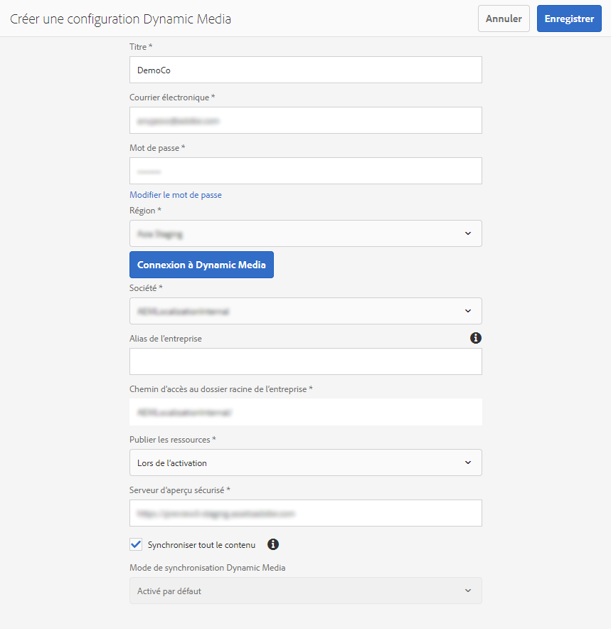

# Configuration de Dynamic Media en mode Scene7{#configuring-dynamic-media-scene-mode}

Si vous utilisez Adobe Experience Manager pour différents environnements, tels que le développement, l’évaluation et la production en direct, configurez les services cloud Dynamic Media pour chacun de ces environnements.

## Schéma de l’architecture de Dynamic Media - mode Scene7 {#architecture-diagram-of-dynamic-media-scene-mode}

Le diagramme d’architecture suivant décrit le fonctionnement du mode Dynamic Media - Scene7.

Avec la nouvelle architecture, Experience Manager est responsable des ressources issues de sources originales et des synchronisations avec Dynamic Media pour le traitement et la publication des ressources :

1. Lorsque la ressource source principale est chargée dans Experience Manager, elle est répliquée vers Dynamic Media. À ce stade, Dynamic Media gère l’intégralité du traitement des ressources et de la génération du rendu, comme le codage vidéo et les variantes dynamiques d’une image.
(Dans Dynamic Media en mode Scene7, la taille du fichier de chargement par défaut est de 2 Go ou moins. Pour activer des tailles de fichier de chargement allant de 2 Go à 15 Go, consultez [(Facultatif) Configurer Dynamic Media en mode Scene7 pour le chargement de ressources d’une taille supérieure à 2 Go](#optional-config-dms7-assets-larger-than-2gb).)
1. Une fois les rendus générés, Experience Manager peut accéder en toute sécurité aux rendus Dynamic Media distants et les prévisualiser (aucune donnée binaire n’est renvoyée à l’instance Experience Manager).
1. Une fois que le contenu est prêt à être publié et approuvé, il déclenche l’envoi du contenu par le service Dynamic Media vers les serveurs de diffusion et la mise en cache du contenu sur le réseau de diffusion de contenu (CDN).


>[!IMPORTANT]
>
>Les fonctionnalités de la liste suivante nécessitent que vous utilisiez le réseau de diffusion de contenu prêt à l’emploi fourni avec Dynamic Media d’Adobe Experience Manager. Les autres réseaux de diffusion de contenu personnalisés ne sont pas pris en charge avec ces fonctionnalités.
>
>* [Imagerie dynamique](/help/assets/imaging-faq.md)
>* [Invalidation du cache](/help/assets/invalidate-cdn-cache-dynamic-media.md)
>* [Protection des liens dynamiques](/help/assets/hotlink-protection.md)
>* [Diffusion de contenu HTTP/2](/help/assets/http2.md)
>* Redirection d’URL au niveau du réseau de diffusion de contenu
>* Akamai ChinaCDN (pour une diffusion optimale en Chine)

## Activation de Dynamic Media en mode Scene7 {#enabling-dynamic-media-in-scene-mode}

Par défaut, [Dynamic Media](https://business.adobe.com/fr/products/experience-manager/assets/dynamic-media.html) est désactivé. Pour tirer parti des fonctionnalités de Dynamic Media, vous devez l’activer.

>[!WARNING]
>
>Dynamic Media en mode Scene7 n’est destiné qu’à l’*Instance de création de Experience Manager uniquement*. Par conséquent, vous devez configurer `runmode=dynamicmedia_scene7` sur l’instance d’auteur du Experience Manager, et *non* sur l’instance de publication du Experience Manager.

Pour activer Dynamic Media, démarrez Experience Manager en mode d’exécution `dynamicmedia_scene7` à partir de la ligne de commande en saisissant ce qui suit dans une fenêtre de terminal (l’exemple de port utilisé est 4502) :

```shell {.line-numbers}
java -Xms4096m -Xmx4096m -Doak.queryLimitInMemory=500000 -Doak.queryLimitReads=500000 -jar cq-quickstart-6.5.0.jar -gui -r author,dynamicmedia_scene7 -p 4502
```

## (Facultatif) Migration des paramètres prédéfinis et des configurations Dynamic Media versions 6.3 à 6.5, sans interruption {#optional-migrating-dynamic-media-presets-and-configurations-from-to-zero-downtime}

La mise à niveau d’Experience Manager Dynamic Media de la version 6.3 vers la version 6.4 ou 6.5 inclut désormais la possibilité de réaliser des déploiements sans interruption de service. Pour migrer tous vos paramètres prédéfinis et configurations depuis `/etc` vers `/conf` dans CRXDE Lite, veillez à exécuter la commande curl suivante.

>[!NOTE]
>
>Si vous exécutez votre instance d’Experience Manager en mode de compatibilité (c’est-à-dire si le package de compatibilité est installé), vous n’avez pas besoin d’exécuter ces commandes.

Pour toutes les mises à niveau, avec ou sans package de compatibilité, vous pouvez copier les paramètres prédéfinis de la visionneuse prête à l’emploi fournie initialement avec Dynamic Media en exécutant la commande curl Linux® suivante :

`curl -u admin:admin -X POST https://<server_address>:<server_port>/libs/settings/dam/dm/presets/viewer.pushviewerpresets.json`

Pour migrer des paramètres prédéfinis de visionneuse et des configurations personnalisés que vous avez créés dans `/etc` vers `/conf`, exécutez la commande curl Linux® suivante :

`curl -u admin:admin -X POST https://<server_address>:<server_port>/libs/settings/dam/dm/presets.migratedmcontent.json`

## Installation du pack de fonctionnalités 18912 pour la migration de ressources en bloc {#installing-feature-pack-for-bulk-asset-migration}

L’installation du pack de fonctionnalités 18912 est *facultative*.

Le pack de fonctionnalités 18912 vous permet soit d’ingérer des ressources par FTP en bloc, soit de migrer des ressources de Dynamic Media en mode hybride ou de Dynamic Media Classic vers le mode Dynamic Media en mode Scene7 sur Experience Manager. Il est disponible à partir d’[Adobe Professional Services](https://business.adobe.com/customers/consulting-services/main.html).

Consultez [Installer le Pack de fonctionnalités 18912 pour la migration de ressources en masse](/help/assets/bulk-ingest-migrate.md) pour plus d’informations.

## Création d’une configuration Dynamic Media dans les services cloud {#configuring-dynamic-media-cloud-services}

<!-- **Before you configure Dynamic Media** - After you receive your provisioning email with Dynamic Media credentials, you must open the [Dynamic Media Classic desktop application](https://experienceleague.adobe.com/docs/dynamic-media-classic/using/getting-started/signing-out.html#getting-started), then sign in to your account to change your password. The password provided in the provisioning email is system-generated and intended to be a temporary password only. It is important that you update the password so that Dynamic Media Cloud Service is set up with the correct credentials.

   

**To create a Dynamic Media Configuration in Cloud Services:** -->

1. Dans Experience Manager en mode Création, sélectionnez le logo d’Experience Manager pour accéder à la console de navigation globale, sélectionnez l’icône Outils, puis accédez à **[!UICONTROL Services cloud]** > **[!UICONTROL Configuration Dynamic Media]**.
1. Sur la page du navigateur de configuration Dynamic Media, dans le volet de gauche, sélectionnez **[!UICONTROL global]**. Ne sélectionnez pas l’icône de dossier située à gauche de **[!UICONTROL global]**. Sélectionnez ensuite **[!UICONTROL Créer]**.
1. Sur la page **[!UICONTROL Créer une configuration Dynamic Media]**, saisissez un titre, l’adresse email du compte Dynamic Media et un mot de passe, puis sélectionnez votre région. Ces informations vous sont fournies par Adobe dans l’e-mail de mise en service. Contactez l’assistance clientèle Adobe si vous n’avez pas reçu cet e-mail.

   Sélectionnez **[!UICONTROL Connexion à Dynamic Media]**.

1. Dans la boîte de dialogue **[!UICONTROL Modifier le mot de passe]**, dans le champ **[!UICONTROL Nouveau mot de passe]**, saisissez un nouveau mot de passe composé de 8 à 25 caractères. Le mot de passe doit contenir au moins une occurrence de chacun des types de caractères suivants :

   * Lettre majuscule
   * Lettre minuscule
   * Nombre
   * Caractère spécial : `# $ & . - _ : { }`

   Le champ **[!UICONTROL Mot de passe actuel]** est délibérément prérempli et masqué vis-à-vis des interactions.

   Si nécessaire, vous pouvez vérifier l’orthographe d’un mot de passe saisi en sélectionnant l’icône en forme d’œil pour l’afficher. Sélectionnez de nouveau l’icône pour le masquer.

1. Dans le champ **[!UICONTROL Répéter le mot de passe]**, saisissez une deuxième fois le nouveau mot de passe, puis sélectionnez **[!UICONTROL Terminé]**.

   Le nouveau mot de passe est enregistré si vous sélectionnez **[!UICONTROL Enregistrer]** dans l’angle supérieur droit de la page **[!UICONTROL Créer une configuration Dynamic Media]**.

   Si vous avez sélectionné **[!UICONTROL Annuler]** dans la boîte de dialogue **[!UICONTROL Modifier le mot de passe]**, vous devez toujours saisir un nouveau mot de passe lorsque vous enregistrez la configuration Dynamic Media qui vient d’être créée.

   Voir aussi [Modifier le mot de passe pour Dynamic Media](#change-dm-password).

1. Une fois la connexion établie, définissez les options suivantes. Les en-têtes avec un astérisque (*) sont obligatoires :

   * **[!UICONTROL Entreprise]** : nom du compte Dynamic Media.
     >[!IMPORTANT]
     >
     Une seule configuration Dynamic Media dans Services cloud est prise en charge sur une instance d’Experience Manager, n’ajoutez pas plusieurs configurations. Plusieurs configurations Dynamic Media sur une instance d’Experience Manager ne sont _pas_ prises en charge ni recommandées par Adobe.

     <!-- CQDOC-19579 and CQDOC-19612 -->

     Consultez également [Configurer un compte d’alias de société Dynamic Media](/help/assets/dm-alias-account.md).

   * **[!UICONTROL Chemin d’accès au dossier racine de l’entreprise]**

   * **[!UICONTROL Publication de ressources]** : vous pouvez choisir parmi les trois options suivantes :
      * **[!UICONTROL Immédiatement]** signifie que lorsque les ressources sont chargées, le système intègre les ressources et fournit instantanément l’URL/le code intégré. Aucune intervention n’est nécessaire de la part de l’utilisateur pour publier des ressources.
      * **[!UICONTROL Lors de l’activation]** : signifie que vous devez publier explicitement la ressource avant qu’un lien URL/code intégré ne soit fourni.<br><!-- CQDOC-17478, Added March 9, 2021-->À partir de la version 6.5.8 d’Experience Manager, l’instance de publication d’Experience Manager reflète des valeurs de métadonnées Dynamic Media précises, telles que `dam:scene7Domain` et `dam:scene7FileStatus` en mode de publication **[!UICONTROL Lors de l’activation]** uniquement. Pour activer cette fonctionnalité, installez le Pack de services 8, puis redémarrez Experience Manager. Accédez au Gestionnaire de configuration Sling. Recherchez la configuration pour `Scene7ActivationJobConsumer Component` ou créez-en une. Cochez la case **[!UICONTROL Réplication des métadonnées après publication sur Dynamic Media]**, puis sélectionnez **[!UICONTROL Enregistrer]**.

        

      * **[!UICONTROL Publication sélective]** Cette option vous permet de contrôler les dossiers publiés dans Dynamic Media. Il vous permet d’utiliser des fonctionnalités telles que le recadrage intelligent ou les rendus dynamiques, ou de déterminer les dossiers qui sont publiés exclusivement en Experience Manager à des fins de prévisualisation. Ces mêmes ressources ne sont *pas* publiées dans Dynamic Media pour diffusion dans le domaine public.<br>Vous pouvez définir cette option ici dans la **[!UICONTROL Configuration du cloud Dynamic Media]** ou, si vous préférez, vous pouvez choisir de définir cette option au niveau du dossier, dans le **[!UICONTROL Propriétés]**.<br>Consultez [Utilisation de la publication sélective dans Dynamic Media](/help/assets/selective-publishing.md).<br>Si vous modifiez cette configuration par la suite ou au niveau du dossier, ces modifications n’affectent que les nouvelles ressources que vous chargez à partir de ce moment-là. Le statut de publication des ressources existantes dans le dossier reste tel quel jusqu’à ce que vous modifiiez manuellement ces ressources à partir de la boîte de dialogue **[!UICONTROL Publication rapide]** ou **[!UICONTROL Gérer la publication]**.

   * **[!UICONTROL Serveur d’aperçu sécurisé]** : permet de définir le chemin URL de votre serveur d’aperçu des rendus sécurisé. Ainsi, une fois les rendus générés, Experience Manager peut accéder en toute sécurité aux rendus Dynamic Media distants et les prévisualiser (aucune donnée binaire n’est renvoyée à l’instance Experience Manager).
À moins que vous ayez pris des dispositions spéciales pour utiliser le serveur de votre entreprise ou un serveur spécial, Adobe vous conseille de conserver ce paramètre tel que spécifié.

   * **[!UICONTROL Synchroniser tout le contenu]** : <!-- NEW OPTION, CQDOC-15371, Added March 4, 2020-->sélectionné par défaut. Désélectionnez cette option si vous souhaitez inclure ou exclure des ressources de la synchronisation avec Dynamic Media. La désélection de cette option vous permet de choisir l’un des deux modes de synchronisation Dynamic Media :

   * **[!UICONTROL Mode de synchronisation Dynamic Media]**
      * **[!UICONTROL Activé par défaut]** : la configuration s’applique par défaut à tous les dossiers, sauf si vous marquez un dossier spécifique à exclure. <!-- you can then deselect the folders that you do not want the configuration applied to.-->
      * **[!UICONTROL Désactivé par défaut]** : la configuration n’est appliquée à aucun dossier tant que vous ne marquez pas explicitement un dossier sélectionné pour synchronisation avec Dynamic Media.
Pour marquer un dossier sélectionné afin de le synchroniser avec Dynamic Media, sélectionnez un dossier de ressources, puis, dans la barre d’outils, sélectionnez **[!UICONTROL Propriétés]**. Sous l’onglet **[!UICONTROL Détails]**, dans la liste déroulante **[!UICONTROL Mode de synchronisation Dynamic Media]**, choisissez l’une des trois options suivantes. Une fois le choix effectué, sélectionnez **[!UICONTROL Enregistrer]**. *À retenir : ces trois options ne sont pas disponibles si vous avez sélectionné auparavant **[!UICONTROL Synchroniser tout le contenu]**.* Voir aussi [Utilisation de la publication sélective au niveau du dossier dans Dynamic Media](/help/assets/selective-publishing.md).
         * **[!UICONTROL Hérité]** : aucune valeur de synchronisation explicite sur le dossier. Au lieu de cela, le dossier hérite de la valeur de synchronisation de l’un de ses dossiers ancêtres ou du mode par défaut dans la configuration du cloud. Le statut détaillé de l’héritage s’affiche par le biais d’une info-bulle.
         * **[!UICONTROL Activé pour les sous-dossiers]** : incluez tous les éléments de cette sous-arborescence dans la synchronisation avec Dynamic Media. Les paramètres propres au dossier remplacent le mode par défaut dans la configuration du cloud.
         * **[!UICONTROL Désactivé pour les sous-dossiers]** : excluez tous les éléments de cette sous-arborescence de la synchronisation avec Dynamic Media.

   >[!NOTE]
   >
   Le contrôle de version n’est pas pris en charge dans Dynamic Media en mode Scene7. En outre, l’activation différée ne s’applique que si l’option **[!UICONTROL Publier des ressources]** dans la page de configuration de Dynamic Media est définie sur **[!UICONTROL Dès l’activation]**, puis uniquement jusqu’à la première activation de la ressource.
   >
   Une fois qu’une ressource est activée, toutes les mises à jour sont immédiatement publiées en direct sur la livraison S7.

1. Sélectionnez **[!UICONTROL Enregistrer]**.
1. Pour prévisualiser en toute sécurité le contenu Dynamic Media avant qu’il ne soit publié, l’instance auteur Experience Manager utilise la validation basée sur les jetons et donc l’auteur Experience Manager prévisualise le contenu Dynamic Media par défaut. Cependant, vous pouvez également placer en liste autorisée d’autres adresses IP pour permettre aux utilisateurs d’accéder à l’aperçu sécurisé du contenu. Pour configurer cette action dans Experience Manager, consultez [Configurer la publication Dynamic Media pour le serveur d’image - Onglet Sécurité](/help/assets/dm-publish-settings.md#security-tab).

Si vous souhaitez personnaliser davantage votre configuration, comme activer les autorisations ALC (liste de contrôles d’accès), vous pouvez éventuellement effectuer l’une des tâches de la rubrique [(Facultatif) Configuration de paramètres avancés dans Dynamic Media en mode Scene7](#optional-configuring-advanced-settings-in-dynamic-media-scene-mode).

<!-- 1. To securely preview Dynamic Media content before it gets published, Experience Manager uses token-based validation and hence Experience Manager Author previews Dynamic Media content by default. However, you can *allowlist* more IPs to provide users access to securely preview content. To set up this action in Experience Manager, see [Configure Dynamic Media Publish Setup for Image Server - Security tab](/help/assets/dm-publish-settings.md#security-tab).     * In Experience Manager Author mode, select the Experience Manager logo to access the global navigation console.
    * In the left rail, select the **[!UICONTROL Tools]** icon, then go to **[!UICONTROL Assets]** > **[!UICONTROL Dynamic Media Publish Setup]**.
    * On the Dynamic Media Image Server page, in the **[!UICONTROL Publish Context]** drop-down list, select **[!UICONTROL Test Image Serving]**.
    * Select the **[!UICONTROL Security]** tab.
    * For the **[!UICONTROL Client address]**, select **[!UICONTROL Add]**.
    * Enter the IP address of the Experience Manager Author instance (not Dispatcher IP).
    * In the upper-right corner of the page, select **[!UICONTROL Save]**. -->

Vous avez à présent terminé la configuration de base ; vous êtes prêt à utiliser Dynamic Media en mode Scene7.

### Modification du mot de passe pour Dynamic Media {#change-dm-password}

L’expiration du mot de passe dans Dynamic Media est fixée sur 100 ans à compter de la date actuelle du système.

Le mot de passe doit contenir au moins une occurrence de chacun des types de caractères suivants :

* Lettre majuscule
* Lettre minuscule
* Nombre
* Caractère spécial : `# $ & . - _ : { }`

Si nécessaire, vous pouvez vérifier l’orthographe d’un mot de passe saisi en sélectionnant l’icône en forme d’œil pour l’afficher. Sélectionnez de nouveau l’icône pour le masquer.

Le mot de passe modifié est enregistré lorsque vous sélectionnez **[!UICONTROL Enregistrer]** dans l’angle supérieur droit de la page **[!UICONTROL Modifier la configuration Dynamic Media]**.

**Modification du mot de passe pour Dynamic Media :**

1. En mode création d’Experience Manager, sélectionnez le logo d’Experience Manager pour accéder à la console de navigation globale.
1. Sur le côté gauche de la console, sélectionnez l’icône Outils, puis **[!UICONTROL Services Cloud] > [!UICONTROL Configuration Dynamic Media]**.
1. Sur la page Navigateur de configuration Dynamic Media, dans le volet de gauche, sélectionnez **[!UICONTROL global]**. Ne sélectionnez pas l’icône de dossier située à gauche de **[!UICONTROL global]**. Sélectionnez ensuite **[!UICONTROL Modifier]**.
1. Sur la page **[!UICONTROL Modifier la configuration Dynamic Media]**, directement au-dessous du champ **[!UICONTROL Mot de passe]**, sélectionnez **[!UICONTROL Modifier le mot de passe]**.
1. Dans la boîte de dialogue **[!UICONTROL Modifier le mot de passe]**, procédez comme suit :

   * Dans le champ **[!UICONTROL Nouveau mot de passe]**, saisissez un nouveau mot de passe.

     Le champ **[!UICONTROL Mot de passe actuel]** est délibérément prérempli et masqué vis-à-vis des interactions.

   * Dans le champ **[!UICONTROL Répéter le mot de passe]**, saisissez une deuxième fois le nouveau mot de passe, puis sélectionnez **[!UICONTROL Terminé]**.

1. Dans l’angle supérieur droit de la page **[!UICONTROL Modifier la configuration Dynamic Media]**, sélectionnez **[!UICONTROL Enregistrer]**, puis **[!UICONTROL OK]**.

## (Facultatif) Configuration de paramètres avancés dans Dynamic Media en mode Scene7 {#optional-configuring-advanced-settings-in-dynamic-media-scene-mode}

Si vous souhaitez personnaliser davantage l’installation et la configuration de Dynamic Media en mode Scene7, ou en optimiser les performances, vous pouvez effectuer une ou plusieurs des tâches *facultatives* suivantes :

* [(Facultatif) Activer les autorisations ACL dans le mode Dynamic Media - Scene7](#optional-enable-acl)

* [(Facultatif) Configuration de Dynamic Media en mode Scene7 pour le chargement de ressources d’une taille supérieure à 2 Go](#optional-config-dms7-assets-larger-than-2gb)

* [(Facultatif) Installation et configuration des paramètres de Dynamic Media en mode Scene7](#optional-setup-and-configuration-of-dynamic-media-scene7-mode-settings)

* [(Facultatif) Optimisation des performances de Dynamic Media en mode Scene7](#optional-tuning-the-performance-of-dynamic-media-scene-mode)

* [(Facultatif) Filtrage des ressources en vue de la réplication](#optional-filtering-assets-for-replication)

### (Facultatif) Activer les autorisations de liste de contrôle d’accès dans le mode Dynamic Media - Scene7 {#optional-enable-acl}

Lorsque vous exécutez Dynamic Media en mode Scene7 sur AEM, il transfère actuellement les `/is/image` demandes vers le traitement d’images d’aperçu sécurisé sans vérifier les autorisations ACL (Liste de contrôle d’accès) sur PlatformServerServlet. Vous pouvez toutefois *activer* les autorisations ACL. Ce faisant, il transfère les requêtes `/is/image` autorisées. Si un utilisateur n’est pas autorisé à accéder à la ressource, une erreur « 403 - Forbidden » s’affiche.

**Pour activer les autorisations ACL en mode Dynamic Media - Scene7 :**

1. À partir d’Experience Manager, accédez à **[!UICONTROL Outils]** > **[!UICONTROL Opérations]** > **[!UICONTROL Console Web]**.

   

1. Un nouvel onglet du navigateur s’ouvre sur la page **[!UICONTROL Adobe Experience Manager Web Console Configuration]** (Configuration de la console web Adobe Experience Manager).

   

1. Sur la page, faites défiler l’écran jusqu’au nom *Adobe CQ Scene7 PlatformServer*.

1. À droite du nom, sélectionnez l’icône en forme de crayon (**[!UICONTROL Modifier les valeurs de configuration]**).

1. Sur la page **com.adobe.cq.dam.s7imaging.impl.ps.PlatformServerServlet.name**, cochez la case correspondant aux deux paramètres suivants :

   * `com.adobe.cq.dam.s7imaging.impl.ps.PlatformServerServlet.cache.enable.name` - Lorsque cette option est activée, ce paramètre met en cache les résultats des autorisations pendant 120 secondes ou deux minutes (par défaut) à enregistrer.
   * `com.adobe.cq.dam.s7imaging.impl.ps.PlatformServerServlet.validate.userAccess.name` - Lorsqu’il est activé, ce paramètre valide l’accès d’un utilisateur lorsqu’il prévisualise des ressources au moyen du serveur d’images Dynamic Media.

   

1. Dans le coin inférieur droit de la page, sélectionnez **[!UICONTROL Enregistrer]**.

### (Facultatif) Configuration de Dynamic Media en mode Scene7 pour le chargement de ressources d’une taille supérieure à 2 Go {#optional-config-dms7-assets-larger-than-2gb}

Dans Dynamic Media en mode Scene7, la taille de fichier de chargement de ressource par défaut est de 2 Go ou moins. Cependant, vous pouvez éventuellement configurer le chargement de ressources de plus de 2 Go et de 15 Go.

Si vous avez l’intention d’utiliser cette fonction, tenez compte des conditions préalables et des points suivants :

* Vous devez exécuter Experience Manager 6.5 avec le Pack de services 6.5.4.0 ou une version ultérieure dans Dynamic Media en mode Scene7.
* Cette fonctionnalité de chargement volumineuse n’est prise en charge que pour les clients [*Managed Services*](https://business.adobe.com/fr/products/experience-manager/managed-services.html).
* Assurez-vous que votre instance d’Experience Manager est configurée avec le stockage Azure Blob Amazon S3 ou Microsoft®.

  >[!NOTE]
  >
  Configurez le stockage Blob de Microsoft Azure avec une clé d’accès et une clé secrète, car cette fonctionnalité de chargement volumineuse n’est pas prise en charge avec AzureSas dans la configuration de stockage Blob.

* Le [Téléchargement de Direct Binary Access](https://jackrabbit.apache.org/oak/docs/features/direct-binary-access.html) d’Oak est activé (le *Chargement de Direct Binary Access* d’Oak n’est pas obligatoire).

  Pour activer le téléchargement Direct Binary Access, définissez la propriété `presignedHttpDownloadURIExpirySeconds > 0` dans la configuration du magasin de données. La valeur doit être suffisamment longue pour télécharger des fichiers binaires plus volumineux et éventuellement effectuer une nouvelle tentative.

* Les ressources de plus de 15 Go ne sont pas chargées. (La limite de taille est définie à l’étape 8 ci-dessous.)
* Lorsque workflow de ressources **[!UICONTROL Retraitement Dynamic Media]** est déclenché sur un dossier, il retraite toutes les ressources volumineuses qui sont déjà synchronisées avec Dynamic Media. Toutefois, si des ressources volumineuses ne sont pas encore synchronisées dans le dossier, elles ne sont pas chargées. Par conséquent, pour synchroniser les ressources volumineuses existantes dans Dynamic Media, vous pouvez exécuter le workflow de ressources **[!UICONTROL Retraitement Dynamic Media]** sur des ressources individuelles.

**Pour configurer Dynamic Media en mode Scene7 pour le chargement de ressources de plus de 2 Go :**

1. Dans Experience Manager, sélectionnez le logo Experience Manager pour accéder à la console de navigation globale, puis accédez à **[!UICONTROL Outils**[!UICONTROL  > ]**Général**[!UICONTROL  > ]**CRXDE Lite]**.

1. Dans la fenêtre du CRXDE Lite, effectuez l’une des opérations suivantes :

   * Dans le rail de gauche, accédez à ce qui suit chemin :

     `/libs/dam/gui/content/assets/jcr:content/actions/secondary/create/items/fileupload`

   * Copiez et collez le chemin d’accès au-dessus dans le champ Chemin d’accès du CRXDE Lite sous la barre d’outils, puis appuyez sur `Enter`.

1. Dans le rail de gauche, cliquez avec le bouton droit de la souris sur `fileupload`, puis, dans le menu pop-up, sélectionnez **[!UICONTROL Nœud de recouvrement]**.

   

1. Dans la boîte de dialogue Nœud de recouvrement, sélectionnez l’option **[!UICONTROL Faire correspondre les types de nœud]** pour activer l’option, puis sélectionnez **[!UICONTROL OK]**.

   

1. Dans la fenêtre du CRXDE Lite, effectuez l’une des opérations suivantes :

   * Dans le rail de gauche, accédez au chemin d’accès au nœud de recouvrement suivant :

     `/apps/dam/gui/content/assets/jcr:content/actions/secondary/create/items/fileupload`

   * Copiez et collez le chemin d’accès au-dessus dans le champ Chemin d’accès du CRXDE Lite sous la barre d’outils, puis appuyez sur `Enter`.

1. Dans l’onglet **[!UICONTROL Propriétés]** dans la colonne **[!UICONTROL Nom]**, localisez `sizeLimit`.
1. À droite du nom `sizeLimit`, dans la colonne **[!UICONTROL Valeur]**, double-cliquez sur le champ de valeur.
1. Saisissez la valeur appropriée en octets afin d’augmenter la taille limite pour atteindre la taille maximale souhaitée pour le chargement. Par exemple, pour augmenter la taille de la ressource de chargement à 10 Go, saisissez `10737418240` dans le champ valeur.
Vous pouvez saisir une valeur allant jusqu’à 15 Go (`2013265920` octets). Dans ce cas, les ressources chargées de plus de 15 Go ne sont pas chargées.

   

1. Dans le coin supérieur gauche de fenêtre CRXDE Lite, sélectionnez **[!UICONTROL Tout enregistrer]**.

   *Définissez maintenant le délai d’attente pour le gestionnaire de tâches de processus externe de workflow Adobe Granite en procédant comme suit :*

1. Dans Experience Manager, sélectionnez le logo d’Experience Manager pour accéder à la console de navigation globale.
1. Effectuez l’une des opérations suivantes :

   * Accédez au chemin d’accès à l’URL suivant :

     `localhost:4502/system/console/configMgr/com.adobe.granite.workflow.core.job.ExternalProcessJobHandler`

   * Copiez et collez le chemin d’accès ci-dessus dans le champ URL de votre navigateur. Veillez à remplacer `localhost:4502` avec votre propre instance d’Experience Manager.

1. Dans le **[!UICONTROL Adobe Granite Workflow External Process Job Handler]** dans la boîte de dialogue **[!UICONTROL Délai d’expiration maximal]** , définissez la valeur sur `18000` secondes (cinq heures). La valeur par défaut est de 10 800 secondes (trois heures).

   

1. Dans l’angle inférieur droit de la boîte de dialogue, sélectionnez **[!UICONTROL Enregistrer]**.

   *Définissez maintenant le délai d’attente de l’étape de processus Chargement de binaire direct Scene7 en procédant comme suit :*

1. Dans Experience Manager, sélectionnez le logo d’Experience Manager pour accéder à la console de navigation globale.
1. Accédez à **[!UICONTROL Outils]** > **[!UICONTROL Workflows]** > **[!UICONTROL Modèles]**.
1. Dans la page Modèles de workflow, sélectionnez **[!UICONTROL Vidéo de codage de Dynamic Media]**.
1. Dans la barre d’outils, sélectionnez **[!UICONTROL Modifier]**.
1. Dans la page du workflow, double-cliquez sur l’étape du processus **[!UICONTROL Chargement de binaires directs Scene7]**.
1. Dans le **[!UICONTROL Propriétés de l’étape]** sous la boîte de dialogue **[!UICONTROL Courant]** sous l’onglet **[!UICONTROL Paramètres avancés]** en-tête, dans la **[!UICONTROL Timeout]** , saisissez la valeur `18000` secondes (cinq heures). La valeur par défaut est `3600` secondes (une heure).
1. **[!UICONTROL Cliquez sur OK]**.
1. Sélectionnez **[!UICONTROL Synchronisation]**.
1. Répétez les étapes 14 à 21 pour le modèle de workflow **[!UICONTROL Ressource de mise à jour de la gestion des ressources numériques]** et **[!UICONTROL Retraitement Dynamic Media]**.

### (Facultatif) Installation et configuration des paramètres de Dynamic Media en mode Scene7 {#optional-setup-and-configuration-of-dynamic-media-scene7-mode-settings}

<!-- When you are in run mode `dynamicmedia_scene7`, use the Dynamic Media Classic user interface to change your Dynamic Media settings. -->

* [Configurer la configuration de publication Dynamic Media pour Image Server](/help/assets/dm-publish-settings.md)
* [Configurer les paramètres généraux de Dynamic Media](/help/assets/dm-general-settings.md)
* [Configuration de la gestion des couleurs](#configuring-color-management)
* [Modification des types MIME pour les formats pris en charge](#editing-mime-types-for-supported-formats)
* [Ajout de types MIME pour les formats non pris en charge](#adding-mime-types-for-unsupported-formats)
* [Création de paramètres prédéfinis d’ensemble par lot pour générer automatiquement des visionneuses d’images et des visionneuses à 360°](#creating-batch-set-presets-to-auto-generate-image-sets-and-spin-sets) (dans l’interface utilisateur de Dynamic Media Classic)

#### Configurer la configuration de publication Dynamic Media pour Image Server {#publishing-setup-for-image-server}

La page Configuration de la publication Dynamic Media établit les paramètres par défaut qui déterminent la manière dont les ressources sont diffusées des serveurs Dynamic Media d’Adobe vers les sites web ou les applications.

Voir [Configurer la configuration de publication Dynamic Media pour Image Server](/help/assets/dm-publish-settings.md).

#### Configurer les paramètres généraux de Dynamic Media {#configuring-application-general-settings}

Configurez l’URL **[!UICONTROL Nom du serveur de publication]** et l’URL **[!UICONTROL Nom du serveur d’origine]** Dynamic Media. Vous pouvez également indiquer les paramètres **[!UICONTROL Téléchargement vers l’application]** et **[!UICONTROL Options de téléchargement par défaut]** en fonction de votre cas d’utilisation spécifique.

Voir [Configurer les paramètres généraux de Dynamic Media](/help/assets/dm-general-settings.md).

#### Configuration de la gestion des couleurs {#configuring-color-management}

La gestion des couleurs de Dynamic Media vous permet de corriger les couleurs des ressources. Avec la correction des couleurs, les ressources ingérées conservent leur espace colorimétrique (RVB, CMJN, Gris) et leur profil de couleur intégré. Lorsque vous demandez un rendu dynamique, la couleur de l’image est corrigée dans l’espace colorimétrique cible en utilisant une sortie CMJN, RVB ou grise.

Consultez [Configuration des paramètres d’image prédéfinis](/help/assets/managing-image-presets.md).

>[!NOTE]
>
Par défaut, le système affiche 15 rendus lorsque vous sélectionnez **[!UICONTROL Rendus]** et 15 paramètres prédéfinis de la visionneuse lorsque vous sélectionnez **[!UICONTROL Visionneuses]** dans la vue Détails de la ressource. Vous pouvez augmenter cette limite. Consultez [Augmentation du nombre de paramètres prédéfinis d’image affichés](/help/assets/managing-image-presets.md#increasing-or-decreasing-the-number-of-image-presets-that-display) ou [Augmentation du nombre de paramètres prédéfinis de visionneuse affichés](/help/assets/managing-viewer-presets.md#increasing-the-number-of-viewer-presets-that-display).

#### Modification des types MIME pour les formats pris en charge {#editing-mime-types-for-supported-formats}

Vous pouvez définir les types de ressources traités par Dynamic Media et personnaliser les paramètres de traitement des ressources avancé. Vous pouvez, par exemple, spécifier les paramètres de traitement des ressources de façon à ce qu’ils effectuent les opérations suivantes :

* Conversion d’un Adobe PDF en ressource de catalogue électronique.
* Convertissez un document Adobe Photoshop (.PSD) en ressource de modèle de bannière pour la personnalisation.
* Pixellisation d’un fichier Adobe Illustrator (.ai) ou d’un fichier PostScript® encapsulé Adobe Photoshop (.eps).
* Des [profils vidéo](/help/assets/video-profiles.md) et des [profils d’images](/help/assets/image-profiles.md) peuvent être utilisés pour définir le traitement des vidéos et des images.

Consultez [Chargement de ressources](/help/assets/manage-assets.md#uploading-assets).

**Pour modifier des types MIME pour les formats pris en charge :**

1. Dans Experience Manager, sélectionnez le logo Experience Manager pour accéder à la console de navigation globale, puis accédez à **[!UICONTROL Outils**[!UICONTROL  > ]**Général**[!UICONTROL  > ]**CRXDE Lite]**.
1. Dans le rail de gauche, accédez à ce qui suit :

   `/conf/global/settings/cloudconfigs/dmscene7/jcr:content/mimeTypes`

   

1. Sous le dossier mimeTypes, sélectionnez un type MIME.
1. Sur le côté droit de la page CRXDE Lite, dans la partie inférieure :

   * Double-cliquez sur le champ **[!UICONTROL activé]**. Par défaut, tous les types MIME des ressources sont activés (définis sur **[!UICONTROL true]**), ce qui signifie que les ressources sont synchronisées avec Dynamic Media pour le traitement. Si vous souhaitez exclure ce type MIME de ressource du traitement, définissez ce paramètre sur **[!UICONTROL false]**.

   * Appuyez deux fois sur **[!UICONTROL jobParam]** pour ouvrir le champ de texte associé. Consultez [Types MIME pris en charge](/help/assets/assets-formats.md#supported-mime-types) pour connaître la liste des valeurs de paramètres de traitement que vous pouvez utiliser pour un type MIME donné.

1. Utilisez l’une des méthodes suivantes :

   * Répétez les étapes 3 et 4 pour modifier d’autres types de MIME.
   * Dans la barre de menus de la page CRXDE Lite, sélectionnez **[!UICONTROL Enregistrer tout]**.

1. Dans l’angle supérieur gauche de la page, sélectionnez **[!UICONTROL CRXDE Lite]** pour revenir à Experience Manager.

#### Ajout de types MIME pour les formats non pris en charge {#adding-mime-types-for-unsupported-formats}

Vous pouvez ajouter des types de MIME personnalisés pour les formats non pris en charge dans Experience Manager Assets. Pour vous assurer qu’un nouveau nœud ajouté dans le CRXDE Lite n’est pas supprimé par Experience Manager, déplacez le type MIME avant `image_`. Assurez-vous également que sa valeur activée est définie sur **[!UICONTROL false]**.

**Pour ajouter des types MIME pour des formats non pris en charge :**

1. À partir d’Experience Manager, accédez à **[!UICONTROL Outils]** > **[!UICONTROL Opérations]** > **[!UICONTROL Console Web]**.

   

1. Un nouvel onglet du navigateur s’ouvre sur la page **[!UICONTROL Adobe Experience Manager Web Console Configuration]** (Configuration de la console web Adobe Experience Manager).

   

1. Sur la page, faites défiler l’écran jusqu’à atteindre *Adobe CQ Scene7 Asset MIME type Service*, comme illustré ci-dessous. À droite du nom, sélectionnez **[!UICONTROL Modifier les valeurs de configuration]** (icône en forme de crayon).

   

1. Sur la page **Adobe CQ Scene7 Asset MIME type Service**, sélectionnez n’importe quelle icône &lt;+>. Dans le tableau, l’emplacement du signe + que vous sélectionnez pour ajouter le nouveau type MIME n’est pas important.

   

1. Entrez `DWG=image/vnd.dwg` dans le champ de texte vide que vous venez d’ajouter.

   L’exemple `DWG=image/vnd.dwg` est fourni à titre d’illustration uniquement. Le type MIME que vous ajoutez ici peut être tout autre format non pris en charge.

   

1. Dans l’angle inférieur droit de la page, sélectionnez **[!UICONTROL Enregistrer]**.

   À ce stade, vous pouvez fermer l’onglet du navigateur dans lequel la page de configuration de la console web d’Adobe Experience Manager est ouverte.

1. Revenez à l’onglet du navigateur qui contient votre console Experience Manager
1. À partir d’Experience Manager, accédez à **[!UICONTROL Outils]** > **[!UICONTROL Général]** > **[!UICONTROL CRXDE Lite]**.

   

1. Dans le rail de gauche, accédez à ce qui suit :

   `conf/global/settings/cloudconfigs/dmscene7/jcr:content/mimeTypes`

1. Faites glisser le type MIME `image_vnd.dwg` et déposez-le directement au-dessus de `image_` de l’arborescence, comme dans la capture d’écran suivante.

   

1. Avec le type MIME `image_vnd.dwg` toujours sélectionné, dans l’onglet **[!UICONTROL Propriétés]**, au niveau de la ligne **[!UICONTROL enabled]**, sous l’en-tête de colonne **[!UICONTROL Valeur]**, appuyez deux fois sur la valeur pour ouvrir la liste déroulante **[!UICONTROL Valeur]**.
1. Tapez `false` dans le champ (ou sélectionnez **[!UICONTROL false]** dans la liste déroulante).

   

1. Dans le coin supérieur gauche de la page CRXDE Lite, sélectionnez **[!UICONTROL Tout enregistrer]**.

#### Création de paramètres prédéfinis d’ensemble par lot pour générer automatiquement des visionneuses d’images et des visionneuses à 360° {#creating-batch-set-presets-to-auto-generate-image-sets-and-spin-sets}

Utilisez les paramètres prédéfinis d’ensemble par lot pour automatiser la création de visionneuses d’images ou de jeux de rotation lorsque des ressources sont chargées sur Dynamic Media.

Tout d’abord, définissez les conventions de nommage pour la façon dont les ressources doivent être regroupées dans un ensemble. Créez ensuite un paramètre prédéfini d’ensemble par lot, qui est un ensemble d’instructions autonomes nommées de manière unique. Il doit définir comment construire la visionneuse à l’aide d’images qui correspondent aux conventions de nommage définies dans la recette de paramètres prédéfinis.

Lorsque vous chargez des fichiers, Dynamic Media crée automatiquement une visionneuse avec tous les fichiers qui correspondent à la convention de nommage définie dans les paramètres prédéfinis actifs.

##### Configuration de l’affectation de nom par défaut

Créez une convention de nommage par défaut qui est utilisée dans n’importe quelle recette de paramètre prédéfini d’ensemble par lot. La convention de nommage par défaut sélectionnée dans la définition de paramètre prédéfini d’ensemble par lot est probablement tout ce dont votre entreprise a besoin pour générer des ensembles par lot. Un paramètre prédéfini d’ensemble par lot est créé pour utiliser la convention d’affectation de nom par défaut que vous définissez. Vous pouvez créer autant de paramètres prédéfinis d’ensemble par lot qu’avec d’autres conventions d’affectation de nom personnalisées nécessaires pour un ensemble particulier de contenu lorsqu’il existe une exception à l’attribution de nom par défaut définie par l’entreprise.

Bien que la spécification d’une convention de nommage par défaut ne soit pas nécessaire pour utiliser la fonctionnalité de paramètre prédéfini d’ensemble par lot, il est recommandé d’appliquer une telle convention. Cette pratique permet de définir autant d’éléments de convention de nommage que vous souhaitez, regroupés pour simplifier la création d’ensembles par lot.

Vous pouvez également utiliser **[!UICONTROL Afficher le code]** sans champ de formulaire. Cet affichage vous permet de définir vos conventions de nommage en utilisant uniquement des expressions régulières.

Deux éléments sont disponibles pour la définition : Correspondance et Nom de base. Ces champs vous permettent de définir tous les éléments d’une convention d’affectation de nom et d’identifier la partie de la convention utilisée pour nommer l’ensemble dans lequel ils se trouvent. La convention de dénomination individuelle d’une entreprise utilise souvent une ou plusieurs lignes de définition pour chacun de ces éléments. Vous pouvez utiliser autant de lignes que vous le souhaitez pour votre définition unique et les regrouper dans des éléments distincts, par exemple, pour l’image principale, les éléments Couleur, Affichage secondaire et Échantillon.

**Pour configurer l’affectation de nom par défaut :**

1. Ouvrez [l’application de bureau Dynamic Media Classic](https://experienceleague.adobe.com/docs/dynamic-media-classic/using/getting-started/signing-out.html?lang=fr#getting-started) puis connectez-vous à votre compte.

   Vos informations d’identification et de connexion vous ont été communiquées par Adobe au moment de la configuration. Si vous ne possédez pas ces informations, contactez le service clientèle d’Adobe.

1. Sur la barre de navigation située en haut de la page, accédez à **[!UICONTROL Configuration]** > **[!UICONTROL Configuration de l’application]** > **[!UICONTROL Paramètres prédéfinis d’ensemble par lot]** > **[!UICONTROL Affectation de nom par défaut]**.
1. Sélectionnez **[!UICONTROL Afficher le formulaire]** ou **[!UICONTROL Afficher le code]** pour indiquer le mode de visualisation et de saisie des informations sur chaque élément.

   Vous pouvez cocher la case **[!UICONTROL Afficher le code]** pour afficher la valeur d’expression régulière qui se crée à côté de vos sélections dans le formulaire. Vous pouvez saisir ou modifier ces valeurs pour définir les éléments de la convention d’affectation des noms, si l’affichage du formulaire vous limite pour une raison quelconque. Si vos valeurs ne peuvent pas être analysées dans la vue de formulaire, les champs de formulaire deviennent inactifs.

   >[!NOTE]
   >
   Les champs de formulaire désactivés n’exécutent aucune validation indiquant que vos expressions régulières sont correctes. Vous verrez les résultats de l’expression régulière que vous créez pour chaque élément après la ligne de résultat. L’expression régulière complète est visible au bas de la page.

1. Développez chaque élément selon vos besoins et saisissez les conventions d’affectation de nom à utiliser.
1. Si nécessaire, effectuez l’une des opérations suivantes :

   * Sélectionnez **[!UICONTROL Ajouter]** afin d’ajouter une autre convention de nommage pour un élément.
   * Sélectionnez **[!UICONTROL Supprimer]** afin de supprimer une convention de nommage pour un élément.

1. Utilisez l’une des méthodes suivantes :

   * Sélectionnez **[!UICONTROL Enregistrer sous]** et saisissez un nom pour le paramètre prédéfini.
   * Sélectionnez **[!UICONTROL Enregistrer]** si vous modifiez un paramètre prédéfini existant.

##### Créer un paramètre prédéfini d’ensemble par lot

Dynamic Media utilise des paramètres prédéfinis d’ensemble par lot pour organiser les ressources en ensembles d’images (images de remplacement, options de couleur, 360 rotation) à afficher dans les visionneuses. Les paramètres prédéfinis d’ensemble par lot s’exécutent automatiquement avec les processus de chargement de ressources dans Dynamic Media.

Vous pouvez créer, modifier et gérer vos paramètres prédéfinis d’ensemble par lot. Il existe deux formulaires de définitions de paramètres prédéfinis d’ensemble par lot : un pour une convention de nommage par défaut que vous pouvez configurer, et un autre pour les conventions de nommage personnalisées que vous créez en cas de besoin.

Vous pouvez utiliser la méthode de champ de formulaire pour définir un paramètre prédéfini d’ensemble par lot ou la méthode de code, qui vous permet d’utiliser des expressions régulières. Comme pour l’affectation de nom par défaut, vous pouvez choisir Afficher le code en même temps que vous définissez dans la vue de formulaire et utiliser des expressions régulières pour créer vos définitions. Vous pouvez également décocher l’une ou l’autre vue pour l’utiliser exclusivement.

**Pour créer un paramètre prédéfini d’ensemble par lot :**

1. Ouvrez [l’application de bureau Dynamic Media Classic](https://experienceleague.adobe.com/docs/dynamic-media-classic/using/getting-started/signing-out.html?lang=fr#getting-started) puis connectez-vous à votre compte.

   Vos informations d’identification et de connexion vous ont été communiquées par Adobe au moment de la configuration. Si vous ne possédez pas ces informations, contactez le service clientèle d’Adobe.

1. Dans la barre de navigation située en haut de la page, accédez à **[!UICONTROL Configuration**[!UICONTROL  > ]**Configuration de l’application]** > **[!UICONTROL Paramètres prédéfinis d’ensemble par lot]** > **[!UICONTROL Paramètre prédéfini d’ensemble par lot]**.

   L’option **[!UICONTROL Afficher le formulaire]**, indiquée dans le coin supérieur droit de la page Détails, correspond à la vue par défaut.

1. Dans le panneau Liste des paramètres prédéfinis, sélectionnez **[!UICONTROL Ajouter]** pour activer les champs de définition dans le panneau Détails situé sur la droite de l’écran.
1. Dans le panneau Détails, nommez le paramètre prédéfini dans le champ Nom du paramètre prédéfini.
1. Dans le menu déroulant Type d’ensemble par lot, sélectionnez un type de paramètre prédéfini.
1. Utilisez l’une des méthodes suivantes :

   * Si vous utilisez une convention de nommage par défaut que vous avez précédemment définie sous **[!UICONTROL Configuration de l’application]** > **[!UICONTROL Paramètres prédéfinis d’ensemble par lot]** > **[!UICONTROL Nom par défaut]**, développez **[!UICONTROL Conventions d’affectation de nom]**, puis dans la liste déroulante Affectation de nom de fichier, sélectionnez **[!UICONTROL Par défaut]**.

   * Pour définir une nouvelle convention d’affectation de nom quand vous configurez le paramètre prédéfini, développez **[!UICONTROL Affectation de nom de fichier]**, puis dans la liste déroulante Affectation de nom de fichier, sélectionnez **[!UICONTROL Personnalisé]**.

1. Pour l’ordre de la séquence, définissez l’ordre des images une fois que la visionneuse est regroupée dans Dynamic Media.

   Par défaut, vos ressources sont classées par ordre alphanumérique. Cependant, vous pouvez utiliser une liste d’expressions régulières séparées par des virgules pour définir l’ordre.

1. Dans Options de création et d’affectation de nom de l’ensemble, indiquez le suffixe ou le préfixe du nom de base que vous avez défini dans la convention d’affectation de nom. En outre, définissez si la visionneuse sera créée dans la structure de dossiers de Dynamic Media.

   Si vous définissez un grand nombre de visionneuses, séparez-les des dossiers contenant les ressources elles-mêmes. Par exemple, créez un dossier Visionneuses d’images et placez-y les visionneuses générées.

1. Dans le panneau Détails, sélectionnez **[!UICONTROL Enregistrer]**.
1. Sélectionnez **[!UICONTROL Actif]** en regard du nom du nouveau paramètre prédéfini.

   L’activation du paramètre prédéfini garantit que, lorsque vous chargez des ressources vers Dynamic Media, le paramètre prédéfini d’ensemble par lot est appliqué pour générer la visionneuse.

##### Création d’un paramètre prédéfini d’ensemble par lot pour la génération automatique d’une visionneuse à 360° en 2D

Vous pouvez utiliser le type d’ensemble par lot **[!UICONTROL Visionneuse à 360° multi-axe]** pour créer une recette qui automatise la génération des visionneuses à 360° en 2D. Le regroupement d’images utilise des expressions régulières de ligne et de colonne afin que les ressources d’image soient correctement alignées à l’emplacement correspondant dans le tableau multidimensionnel. Il n’existe pas de nombre maximal ou minimal de lignes ou de colonnes que vous devez avoir dans une visionneuse à 360° multi-axe.

Par exemple, supposons que vous souhaitiez créer une visionneuse à 360° multi-axe nommée `spin-2dspin`. Vous disposez d’un ensemble d’images de visionneuse à 360° qui contiennent trois lignes, avec 12 images par ligne. Les images sont nommées comme suit :

```xml {.line-numbers}
spin-01-01
 spin-01-02
 …
 spin-01-12
 spin-02-01
 …
 spin-03-12
```

Avec ces informations, vous pouvez créer votre recette de type d’ensemble par lot comme suit :


Le regroupement de la partie du nom de ressource partagé de la visionneuse à 360° est ajouté au champ **[!UICONTROL Correspondance]** (éléments en surbrillance). La partie variable du nom de ressource contenant la ligne et la colonne est ajoutée respectivement aux champs **[!UICONTROL Ligne]** et **[!UICONTROL Colonne]**.

Lorsque la visionneuse à 360° est téléchargée et publiée, vous activez le nom de la recette de visionneuse à 360° en 2D répertoriée sous **[!UICONTROL Paramètres prédéfinis d’ensemble par lot]** dans la boîte de dialogue **[!UICONTROL Télécharger les options de la tâche]**.

**Pour créer un paramètre prédéfini d’ensemble par lot pour la génération automatique d’une visionneuse à 360° en 2D :**

1. Ouvrez [l’application de bureau Dynamic Media Classic](https://experienceleague.adobe.com/docs/dynamic-media-classic/using/getting-started/signing-out.html?lang=fr#getting-started) puis connectez-vous à votre compte.

   Vos informations d’identification et de connexion vous ont été communiquées par Adobe au moment de la configuration. Si vous ne possédez pas ces informations, contactez le service clientèle d’Adobe.

1. Dans la barre de navigation située en haut de la page, accédez à **[!UICONTROL Configuration**[!UICONTROL  > ]**Configuration de l’application]** > **[!UICONTROL Paramètres prédéfinis d’ensemble par lot]** > **[!UICONTROL Paramètre prédéfini d’ensemble par lot]**.

   L’option **[!UICONTROL Afficher le formulaire]**, indiquée dans le coin supérieur droit de la page Détails, correspond à la vue par défaut.

1. Dans le panneau Liste des paramètres prédéfinis, sélectionnez **[!UICONTROL Ajouter]** pour activer les champs de définition dans le panneau Détails situé sur la droite de l’écran.
1. Dans le panneau Détails, nommez le paramètre prédéfini dans le champ Nom du paramètre prédéfini.
1. Dans le menu déroulant Type d’ensemble par lot, sélectionnez **[!UICONTROL Visionneuse de ressources]**.
1. Dans la liste déroulante Sous-type , sélectionnez **[!UICONTROL Visionneuse à 360° multi-axe]**.
1. Développez les **[!UICONTROL Conventions de nommage de ressource]**, puis, dans la liste déroulante Nommage de fichier, cliquez sur **[!UICONTROL Personnalisé]**.
1. Utilisez les attributs **[!UICONTROL Correspondance]** et, éventuellement, **[!UICONTROL Nom de base]** pour définir une expression régulière pour nommer les fichiers d’image qui constituent le regroupement.

   Par exemple, votre expression régulière de correspondance littérale peut se présenter comme suit :

   `(w+)-w+-w+`

1. Développez **[!UICONTROL Position des colonnes/lignes]**, puis définissez le format de nom de la position de la ressource image dans le tableau de la visionneuse à 360° en 2D.

   Utilisez la parenthèse pour incorporer la position de ligne ou de colonne dans le nom du fichier.

   Par exemple, l’expression régulière de ligne peut se présenter comme suit :

   `\w+-R([0-9]+)-\w+`

   ou

   `\w+-(\d+)-\w+`

   L’expression régulière de colonne peut se présenter comme suit :

   `\w+-\w+-C([0-9]+)`

   ou

   `\w+-\w+-C(\d+)`

   Les exemples ci-dessus sont fournis à des fins de démonstration uniquement. Vous pouvez créer votre expression régulière comme bon vous semble, en fonction de vos besoins.

   >[!NOTE]
   >
   Si la combinaison des expressions régulières de ligne et de colonne ne permet pas de déterminer la position de la ressource dans le tableau de la visionneuse à 360° multidimensionnelle, cette ressource n’est pas ajoutée à la visionneuse. Une erreur est également consignée.

1. Dans Options de création et de nommage de la visionneuse, indiquez le suffixe ou le préfixe du nom de base que vous avez défini dans la convention de nommage.

   Vous pouvez également définir l’emplacement où la visionneuse à 360° sera créée dans la structure de dossiers de Dynamic Media Classic.

   Si vous définissez un grand nombre de visionneuses, séparez-les des dossiers contenant les ressources elles-mêmes. Par exemple, créez un dossier Visionneuses à 360° pour y placer les visionneuses générées.

1. Dans le panneau Détails, sélectionnez **[!UICONTROL Enregistrer]**.
1. Sélectionnez **[!UICONTROL Actif]** en regard du nom du nouveau paramètre prédéfini.

   L’activation du paramètre prédéfini garantit que, lorsque vous chargez des ressources vers Dynamic Media, le paramètre prédéfini d’ensemble par lot est appliqué pour générer la visionneuse.

### (Facultatif) Optimisation des performances de Dynamic Media en mode Scene7 {#optional-tuning-the-performance-of-dynamic-media-scene-mode}

Pour garantir la bonne exécution de Dynamic Media en mode Scene7, Adobe recommande les actions suivantes permettant d’optimiser les performances/l’évolutivité de la synchronisation :

* Mise à jour des paramètres de tâche prédéfinis pour le traitement de différents formats de fichier.
* Mise à jour des threads de traitement de file d’attente de workflows Granite prédéfinis (ressources vidéo).
* Mise à jour des threads de traitement de file d’attente de workflows Granite prédéfinis (images et ressources non vidéo).
* Mise à jour du nombre maximal de connexions de chargement au serveur Dynamic Media Classic.

#### Mettre à jour les paramètres de tâche prédéfinis pour le traitement de différents formats de fichier

Vous pouvez régler les paramètres de tâche pour accélérer le traitement des fichiers lors du chargement. Par exemple, si vous téléchargez des fichiers PSD, mais que vous ne souhaitez pas les traiter en tant que modèles, vous pouvez définir l’extraction du calque sur false (désactivé). Dans ce cas, le paramètre de tâche affiné se présente comme suit : `process=None&createTemplate=false`.

Si vous souhaitez activer la création de modèles, utilisez les paramètres suivants : `process=MaintainLayers&layerNaming=AppendName&createTemplate=true`.

<!-- THIS PARAGRAPH WAS REPLACED WITH THE TWO PARAGRAPHS DIRECTLY ABOVE BASED ON CQDOC-17657 You can tune job parameters for faster processing when you upload files. For example, if you are uploading PSD files, but do not want to process them as templates, you can set layer extraction to false (off). In such case, the tuned job parameter would appear as `process=None&createTemplate=false`. -->

Adobe recommande d’utiliser les paramètres de tâche « affiné » suivants pour les fichiers PDF, PostScript® et PSD :

<!-- OLD PDF JOB PARAMETERS `pdfprocess=Rasterize&resolution=150&colorspace=Auto&pdfbrochure=false&keywords=false&links=false` -->

<!-- OLD POSTSCRIPT JOB PARAMETERS `psprocess=Rasterize&psresolution=150&pscolorspace=Auto&psalpha=false&psextractsearchwords=false&aiprocess=Rasterize&airesolution=150&aicolorspace=Auto&aialpha=false` -->

| Type de fichier | Paramètres de tâche recommandés |
| ---| ---|
| PDF | `pdfprocess=Thumbnail&resolution=150&colorspace=Auto&pdfbrochure=false&keywords=false&links=false` |
| PostScript® | `psprocess=Rasterize&psresolution=150&pscolorspace=Auto&psalpha=false&psextractsearchwords=false&aiprocess=Thumbnail&airesolution=150&aicolorspace=Auto&aialpha=false` |
| PSD | `process=None&layerNaming=AppendName&anchor=Center&createTemplate=false&extractText=false&extendLayers=false` |

<!-- CQDOC-17657 for PSD entry in table above -->

Pour mettre à jour l’un de ces paramètres, procédez comme indiqué dans la [Activation de la prise en charge du paramètre de tâche de chargement Assets/Dynamic Media Classic basé sur le type MIME](/help/sites-administering/scene7.md#enabling-mime-type-based-assets-scene-upload-job-parameter-support).

#### Mise à jour de la file d’attente de workflows transitoires Granite {#updating-the-granite-transient-workflow-queue}

La file d’attente de workflows Granite est utilisée pour le workflow **[!UICONTROL Ressources de mise à jour de gestion des actifs numériques (DAM)]**. Dans Dynamic Media, elle est utilisée pour l’intégration et le traitement des images.

**Pour mettre à jour la file d’attente de workflows transitoires Granite :**

1. Accédez à [https://localhost:4502/system/console/configMgr](https://localhost:4502/system/console/configMgr) et recherchez **File d’attente : file d’attente de workflows Granite**.

   >[!NOTE]
   >
   Il est nécessaire d’effectuer une recherche par texte au lieu d’utiliser une URL directe, car le PID OSGi est généré dynamiquement.

1. Dans le champ **[!UICONTROL Maximum Parallel Jobs]** (Nombre maximal de tâches en parallèle), modifiez le nombre en fonction de la valeur souhaitée.

   Vous pouvez augmenter le **[!UICONTROL nombre maximal de tâches en parallèle]** afin de prendre en charge le chargement intensif de fichiers vers Dynamic Media. La valeur exacte dépend de la capacité matérielle. Dans certains cas, c’est-à-dire lors d’une migration initiale ou d’un chargement en bloc unique, vous pouvez utiliser une valeur élevée. Sachez toutefois que l’utilisation d’une valeur élevée (par exemple deux fois le nombre de cœurs) peut avoir des effets négatifs sur les activités simultanées. Testez et ajustez la valeur en fonction de votre cas d’utilisation particulier.

<!--    By default, the maximum number of parallel jobs depends on the number of available CPU cores. For example, on a 4-core server, it assigns 2 worker threads. (A value between 0.0 and 1.0 is ratio based, or any numbers greater than 1 will assign the number of worker threads.)

   Adobe recommends that 32 **[!UICONTROL Maximum Parallel Jobs]** be configured to adequately support heavy upload of files to Dynamic Media Classic (Scene7). -->


1. Sélectionnez **[!UICONTROL Enregistrer]**.

#### Mise à jour de la file d’attente de workflows Granite {#updating-the-granite-workflow-queue}

La file d’attente de workflows Granite est utilisée pour les workflows non transitoires. Dans Dynamic Media, elle est utilisée pour le traitement de la vidéo avec le workflow **[!UICONTROL Vidéo de codage Dynamic Media]**.

**Pour mettre à jour la file d’attente de workflows Granite :**

1. Accédez à `https://<server>/system/console/configMgr` et recherchez **Queue: Granite Workflow Queue** (File d’attente : file d’attente de workflows Granite).

   >[!NOTE]
   >
   Il est nécessaire d’effectuer une recherche par texte au lieu d’utiliser une URL directe, car le PID OSGi est généré dynamiquement.

1. Dans le champ **[!UICONTROL Maximum Parallel Jobs]** (Nombre maximal de tâches en parallèle), modifiez le nombre en fonction de la valeur souhaitée.

   Vous pouvez augmenter le nombre maximal de tâches en parallèle afin de prendre en charge le chargement intensif de fichiers vers Dynamic Media. La valeur exacte dépend de la capacité matérielle. Dans certains cas, c’est-à-dire lors d’une migration initiale ou d’un chargement en bloc unique, vous pouvez utiliser une valeur élevée. Sachez toutefois que l’utilisation d’une valeur élevée (par exemple deux fois le nombre de cœurs) peut avoir des effets négatifs sur les activités simultanées. Testez et ajustez la valeur en fonction de votre cas d’utilisation particulier.

   

1. Sélectionnez **[!UICONTROL Enregistrer]**.

#### Mise à jour de la connexion de chargement Dynamic Media Classic {#updating-the-scene-upload-connection}

Le paramètre de connexion de chargement vers Scene7 synchronise les ressources Experience Manager avec les serveurs Dynamic Media Classic.

**Pour mettre à jour la connexion de chargement Dynamic Media Classic :**

1. Accédez à `https://<server>/system/console/configMgr/com.day.cq.dam.scene7.impl.Scene7UploadServiceImpl`.
1. Dans le champ **[!UICONTROL Number of connections]** (Nombre de connexions) et/ou **[!UICONTROL Active job timeout]** (Délai d’expiration des tâches actives), modifiez le nombre en fonction de vos besoins.

   Le paramètre **[!UICONTROL Nombre de connexions]** contrôle le nombre maximal de connexions HTTP autorisées pour le chargement d’Experience Manager vers Dynamic Media. En règle générale, la valeur prédéfinie de dix connexions est suffisante.

   Le paramètre **[!UICONTROL Active job timeout]** détermine le temps d’attente avant que les ressources Dynamic Media chargées ne soient publiées sur le serveur de diffusion. Cette valeur est de 2 100 secondes ou 35 minutes, par défaut.

   Dans la plupart des cas d’utilisation, le paramètre de 2 100 est suffisant.

   

1. Sélectionnez **[!UICONTROL Enregistrer]**.

### (Facultatif) Filtrage des ressources en vue de la réplication {#optional-filtering-assets-for-replication}

Dans le cas des déploiements autres que Dynamic Media, vous répliquez *toutes* les ressources (à la fois les images et les vidéos) à partir de votre environnement de création Experience Manager et vers le nœud de publication Experience Manager. Ce workflow est nécessaire car les serveurs de publication Experience Manager diffusent également les ressources.

Toutefois, dans le cas de déploiements Dynamic Media, dans la mesure où les ressources sont diffusées par le service cloud, il n’est pas nécessaire de répliquer ces mêmes ressources sur les nœuds de publication Experience Manager. Un tel workflow de publication hybride permet d’éviter le coût d’un stockage supplémentaire et réduit les temps de traitement pour la réplication des ressources. Les autres contenus, tels que les pages de site, continuent à être diffusés à partir des nœuds de publication Experience Manager.

Les filtres vous offrent la possibilité d’*exclure* des ressources de la réplication sur le nœud de publication Experience Manager.

#### Utilisation de filtres de ressource par défaut pour la réplication {#using-default-asset-filters-for-replication}

Si vous utilisez Dynamic Media pour les images ou les vidéos, ou les deux, vous pouvez utiliser les filtres par défaut fournis en l’état par Adobe. Les filtres suivants sont activés par défaut :

|   | Filtrer | Type MIME | Rendus |
| --- | --- | --- | --- |
| Diffusion d’image Dynamic Media | filter-image<br>filter-sets | Commence par **image/**<br> Contient **applications/** et se termine par **set**. | Les filtres prêts à l’emploi « filter-images » (s’applique aux ressources d’images uniques, y compris les images interactives) et « filter-sets » (s’applique aux visionneuses à 360°, visionneuses d’images, visionneuses de supports variés et ensembles de carrousels) permettent :<br>• d’exclure de la réplication les rendus des images originales et des images statiques. |
| Diffusion vidéo Dynamic Media | filter-video | Commence par **video/** | La « vidéo de filtrage » prête à l’emploi :<br>• Exclure de la réplication la vidéo d’origine et les rendus de miniatures statiques. |

>[!NOTE]
>
Les filtres s’appliquent aux types MIME et ne peuvent pas être spécifiques à un chemin.

#### Personnalisation des filtres de ressources en vue de la réplication {#customizing-asset-filters-for-replication}

1. Dans Experience Manager, sélectionnez le logo Experience Manager pour accéder à la console de navigation globale, puis accédez à **[!UICONTROL Outils]** > **[!UICONTROL Général]** > **[!UICONTROL CRXDE Lite]**.
1. Dans l’arborescence de gauche, accédez à `/etc/replication/agents.author/publish/jcr:content/damRenditionFilters` pour parcourir les filtres.

   

1. Pour définir le type MIME du filtre, vous pouvez localiser le type MIME comme suit : 

   Dans le rail de gauche, développez `content > dam > <locate_your_asset> > jcr:content > metadata`, puis dans le tableau, recherchez `dc:format`.

   L’illustration ci-dessous est un exemple de chemin d’une ressource vers `dc:format`.

   

   Notez que la valeur `dc:format` de la ressource `Fiji Red.jpg` est `image/jpeg`.

   Pour appliquer ce filtre à toutes les images, quel que soit leur format, définissez la valeur sur `image/*` où `*` est une expression régulière qui est appliquée à toutes les images de n’importe quel format.

   Pour appliquer le filtre uniquement aux images de type JPEG, saisissez la valeur `image/jpeg`.

1. Définissez les rendus à inclure ou à exclure de la réplication.

   Voici des exemples de caractères que vous pouvez utiliser afin de filtrer la réplication :

   | Caractère à utiliser | Filtrage des ressources pour la réplication |
   | --- | --- |
   | * | Caractère générique |
   | + | Inclure les ressources à répliquer |
   | - | Exclure les ressources de la réplication |

   Accédez à `content/dam/<locate your asset>/jcr:content/renditions`.

   L’illustration ci-dessous est un exemple de rendu d’une ressource.

   

   Si vous souhaitez uniquement répliquer l’original, vous devez entrer `+original`.
