# Configuration de Dynamic Media – mode hybride{#configuring-dynamic-media-hybrid-mode}

Dynamic Media mode hybride doit être activé et configuré pour être utilisé. Selon l’utilisation que vous souhaitez en faire, Dynamic Media prend en charge [plusieurs configurations](#supported-dynamic-media-configurations).

>[!NOTE]
>
>Si vous envisagez de configurer et d’exécuter Dynamic Media en mode d’exécution Scene7, voir [Configuration de Dynamic Media – mode Scene7](/help/assets/config-dms7.md).
>
>Si vous envisagez de configurer et d’exécuter Dynamic Media en mode d’exécution hybride, suivez les instructions sur cette page.

En savoir plus sur l’utilisation des [vidéos](/help/assets/video.md) dans Dynamic Media.

>[!NOTE]
>
>Si Adobe Experience Manager est configuré dans des environnements différents, tels que le développement, l’évaluation et la production, vous devez configurer Dynamic Media Cloud Services pour chacun de ces environnements.

>[!NOTE]
>
>Si vous rencontrez des problèmes lors de la configuration de Dynamic Media, veillez à prêter une attention particulière aux fichiers journaux spécifiques à Dynamic Media. Ces fichiers sont installés automatiquement lorsque vous activez Dynamic Media :
>
>* `s7access.log`
>* `ImageServing.log`

>
>
They are documented in [Monitoring and Maintaining your AEM instance](/help/sites-deploying/monitoring-and-maintaining.md).

La diffusion de contenus et la publication hybride est une fonctionnalité clé lorsque vous ajoutez Dynamic Media à Adobe Experience Manager. La publication hybride vous permet de diffuser des ressources Dynamic Media, telles que des images, des visionneuses et de la vidéo, à partir du cloud et non plus à partir des noeuds de publication AEM.

D’autres contenus, comme les visionneuses Dynamic Media, les pages de site et le contenu statique, restent diffusés depuis les nœuds de publication AEM.

Si vous êtes un client de Dynamic Media, vous devez utiliser la diffusion hybride comme mécanisme de diffusion pour tous les contenus Dynamic Media.

## Architecture de publication hybride des vidéos {#hybrid-publishing-architecture-for-videos}

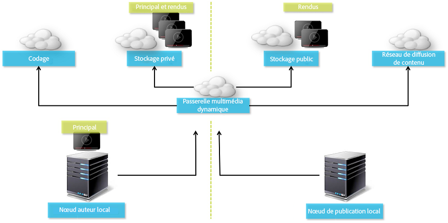

## Architecture de publication hybride pour les images {#hybrid-publishing-architecture-for-images}

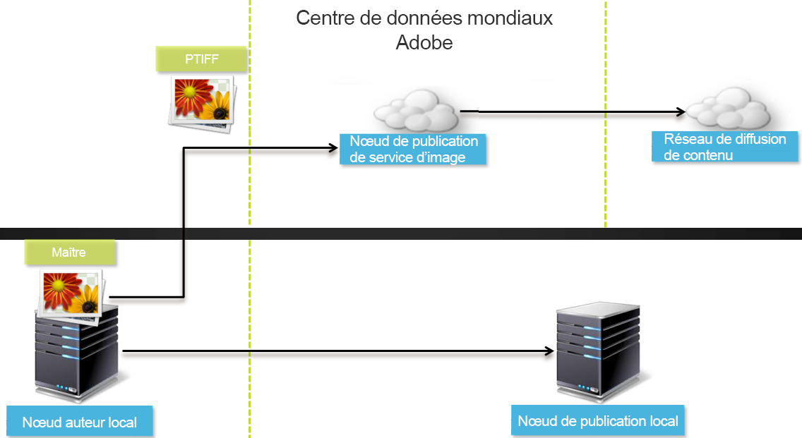

## Configurations Dynamic Media prises en charge {#supported-dynamic-media-configurations}

Les tâches de configuration suivantes font référence aux termes suivants :

| **Terme** | **Dynamic Media activé** | **Description** |
|---|---|---|
| Noeud d’auteur AEM | Coche blanche dans un cercle vert | Noeud d’auteur que vous déployez sur site ou via les services gérés. |
| Noeud de publication AEM | &quot;X&quot; blanc dans un carré rouge. | Noeud de publication que vous déployez sur site ou via les services gérés. |
| Noeud de publication Image Service | Coche blanche en cercle vert. | Noeud de publication que vous exécutez sur les centres de données gérés par Adobe. Renvoie à l’URL du service d’images. |

Vous pouvez choisir d’implémenter Dynamic Media uniquement pour les images, uniquement pour les vidéos ou à la fois pour les images et les vidéos. Pour déterminer les étapes à suivre pour configurer Dynamic Media pour votre scénario, reportez-vous au tableau suivant.

<table>
 <tbody>
  <tr>
   <td><strong>Scénario</strong></td>
   <td ><strong>Fonctionnement</strong></td>
   <td><strong>Étapes de configuration</strong></td>
  </tr>
  <tr>
   <td>Livraison des images en production UNIQUEMENT</td>
   <td>Les images sont livrées par les serveurs des data centers Adobe du monde entier, puis mises en cache par un réseau de diffusion de contenu pour une portée internationale et des performances évolutives.</td>
   <td>
    <ol>
     <li>Sur le nœud <strong>auteur</strong> d’AEM, <a href="#enabling-dynamic-media">activez Dynamic Media</a>.</li>
     <li>Configurez l’imagerie dans les <a href="#configuring-dynamic-media-cloud-services">services cloud Dynamic Media</a>.</li>
     <li><a href="#configuring-image-replication">Configurez la réplication de l’image</a>.</li>
     <li><a href="#replicating-catalog-settings">Répliquez les paramètres du catalogue</a>.</li>
     <li><a href="#replicating-viewer-presets">Répliquez les paramètres de la visionneuse</a>.</li>
     <li><a href="#using-default-asset-filters-for-replication">Utilisez les filtres de ressource par défaut pour la réplication</a>.</li>
     <li><a href="#configuring-dynamic-media-image-server-settings">Configurez les paramètres du serveur d’images Dynamic Media</a>.</li>
     <li><a href="#delivering-assets">Livrez les ressources</a>.</li>
    </ol> </td>
  </tr>
  <tr>
   <td>Livraison des images en préproduction UNIQUEMENT (développement, évaluation de la qualité, zone de transit, etc.)</td>
   <td>Les images sont livrées via le nœud de publication d’AEM. Dans ce scénario, puisque le trafic est minimal, il n’est pas nécessaire d’envoyer les images vers le centre données d’Adobe.  Un autre avantage est que cela permet une prévisualisation sécurisée du contenu avant le lancement de la production</td>
   <td>
    <ol>
     <li>Sur le nœud <strong>auteur</strong> d’AEM, <a href="#enabling-dynamic-media">activez Dynamic Media</a>.</li>
     <li>On AEM <strong>publish</strong> node, <a href="#enabling-dynamic-media">enable dynamic media</a>.</li>
     <li><a href="#replicating-viewer-presets">Répliquez les paramètres de la visionneuse</a>.</li>
     <li>Configurez le <a href="#setting-up-asset-filters-for-imaging-in-non-production-deployments">filtre de ressources pour les images qui ne sont pas en production</a>.</li>
     <li><a href="#configuring-dynamic-media-image-server-settings">Configurez les paramètres du serveur d’images Dynamic Media.</a></li>
     <li><a href="#delivering-assets">Livrez les ressources.</a></li>
    </ol> </td>
  </tr>
  <tr>
   <td>Livraison de la vidéo UNIQUEMENT dans n’importe quel environnement (production, développement, évaluation de la qualité, zone de transit, etc.)</td>
   <td>Les vidéos sont livrées et mises en cache par un réseau de diffusion de contenu pour des performances extensibles et une portée globale. L’image d’affiche de la vidéo (la miniature de la vidéo qui s’affiche avant le début de la lecture) sera livrée par l’instance de publication d’AEM.</td>
   <td>
    <ol>
     <li>Sur le nœud <strong>auteur</strong> d’AEM, <a href="#enabling-dynamic-media">activez Dynamic Media</a>.</li>
     <li>Sur le nœud de <strong>publication</strong> d’AEM, <a href="#enabling-dynamic-media">activez Dynamic Media</a> (l’instance de publication envoie l’image d’affiche de la vidéo et fournit les métadonnées pour la lecture de la vidéo).</li>
     <li>Configurez la vidéo dans les <a href="#configuring-dynamic-media-cloud-services">services cloud Dynamic Media.</a></li>
     <li><a href="#replicating-viewer-presets">Répliquez les paramètres de la visionneuse</a>.</li>
     <li>Configurez le <a href="#setting-up-asset-filters-for-video-only-deployments">filtre actif pour la vidéo uniquement</a>.</li>
     <li><a href="#delivering-assets">Livrez les ressources.</a></li>
    </ol> </td>
  </tr>
  <tr>
   <td>Livraison À LA FOIS des images et de la vidéo en production</td>
   <td><p>Les vidéos sont livrées et mises en cache par un réseau de diffusion de contenu pour des performances extensibles et une portée globale. Les images et les images d’affiches de vidéos sont livrées par les serveurs des data centers Adobe du monde entier, puis mises en cache par un réseau de diffusion de contenu pour une portée internationale et des performances évolutives.</p> <p>Reportez-vous aux sections précédentes pour configurer les images ou les vidéos en préproduction. </p> </td>
   <td>
    <ol>
     <li>Sur le nœud <strong>auteur</strong> d’AEM, <a href="#enabling-dynamic-media">activez Dynamic Media</a>.</li>
     <li>Configurez la vidéo dans les <a href="#configuring-dynamic-media-cloud-services">services cloud Dynamic Media.</a></li>
     <li>Configurez l’imagerie dans les <a href="#configuring-dynamic-media-cloud-services">services cloud Dynamic Media</a>.</li>
     <li><a href="#configuring-image-replication">Configurez la réplication de l’image</a>.</li>
     <li><a href="#replicating-catalog-settings">Répliquez les paramètres du catalogue</a>.</li>
     <li><a href="#replicating-viewer-presets">Répliquez les paramètres de la visionneuse</a>.</li>
     <li><a href="#using-default-asset-filters-for-replication">Utilisez les filtres de ressource par défaut pour la réplication.</a></li>
     <li><a href="#configuring-dynamic-media-image-server-settings">Configurez les paramètres du serveur d’images Dynamic Media.</a></li>
     <li><a href="#delivering-assets">Livrez les ressources.</a></li>
    </ol> </td>
  </tr>
 </tbody>
</table>

## Activation de Dynamic Media {#enabling-dynamic-media}

[Dynamic Media](https://www.adobe.com/fr/marketing/experience-manager-assets/dynamic-media.html) est désactivé par défaut. Pour bénéficier des fonctionnalités de contenu multimédia dynamique, vous devez activer Dynamic Media en utilisant le mode d’exécution `dynamicmedia` comme vous le feriez par exemple pour le mode d’exécution `publish`. Avant l’activation, vérifiez les [exigences techniques.](/help/sites-deploying/technical-requirements.md#dynamicmediaaddonprerequisites)

>[!NOTE]
>
>L’activation de Dynamic Media via le mode d’exécution remplace la fonctionnalité dans AEM 6.1 et AEM 6.0 qui consistait à définir l’indicateur `dynamicMediaEnabled` sur **[!UICONTROL true]**. Cet indicateur ne correspond à aucune fonctionnalité dans AEM 6.2 et versions ultérieures. Par ailleurs, vous n’avez pas besoin de redémarrer le démarrage rapide pour activer Dynamic Media.

By enabling Dynamic Media, the dynamic media features will be available in the UI and every uploaded image asset receives a *cqdam.pyramid.tiff* rendition that is used for fast delivery of dynamic image renditions. Ces PTIFF présentent des avantages significatifs, notamment (1) la possibilité de gérer une seule image source principale et de générer des rendus infinis en temps réel sans enregistrement supplémentaire et (2) la possibilité d’utiliser la visualisation interactive telle que le zoom, le panoramique, la rotation, etc.

If you want to use Dynamic Media Classic (Scene7) in AEM, you should not enable Dynamic Media unless you are using a [specific scenario](/help/sites-administering/scene7.md#aem-scene-integration-versus-dynamic-media). Dynamic Media est désactivé, sauf si vous l’activez via le mode d’exécution.

Pour activer Dynamic Media, vous devez activer le mode d’exécution Dynamic Media, soit depuis la ligne de commande, soit en modifiant le nom de fichier de démarrage rapide.

**Pour activer le média dynamique**

1. Dans la ligne de commande, lorsque vous lancez le démarrage rapide, procédez de la façon suivante :

   * Add `-r dynamicmedia` to the end of the command line when starting the jar file.

   ```shell
   java -Xmx4096m -Doak.queryLimitInMemory=500000 -Doak.queryLimitReads=500000 -jar cq-quickstart-6.5.0.jar -r dynamicmedia
   ```

   Si vous publiez vers s7 diffusion, vous devez également inclure les arguments TrustStore suivants :

   ```
   -Djavax.net.ssl.trustStore=<absoluteFilePath>/customerTrustStoreFileName>
   
    -Djavax.net.ssl.trustStorePassword=<passwordForTrustStoreFile>
   ```

1. Request `https://localhost:4502/is/image` and make sure Image Server is now running.

   >[!NOTE]
   >
   >To troubleshoot issues with Dynamic Media, see the following logs in the `crx-quickstart/logs/` directory:
   >
   >* ImageServer-&lt;PortId>-&lt;aaaa>&lt;mm>&lt;dd>.log - Le journal ImageServer fournit des statistiques et des informations analytiques utilisées pour analyser le comportement du processus interne ImageServer.

   Example of an Image Server log file name: `ImageServer-57346-2020-07-25.log`
   * s7access-&lt;yyyy>&lt;mm>&lt;dd>.log - The s7access log records each request made to Dynamic Media through `/is/image` and `/is/content`.

   Ces journaux sont utilisés uniquement lorsque Dynamic Media est activé. They are not included in the **Download Full** package that is generated from the `system/console/status-Bundlelist` page; when calling Customer Support if you have a Dynamic Media issue, please append both these logs to the issue.

### If you installed AEM to a different port or context path ... {#if-you-installed-aem-to-a-different-port-or-context-path}

If you are deploying [AEM to an application server](/help/sites-deploying/application-server-install.md) and have Dynamic Media enabled, you need to configure the **self** domain in the externalizer. Dans le cas contraire, la fonctionnalité de génération de miniature pour les ressources ne fonctionnera pas correctement pour les ressources de média dynamique.

En outre, si vous exécutez le démarrage rapide sur un port ou un chemin d’accès au contexte différent, vous devez également changer le domaine **self**.

Lorsque Dynamic Media est activé, les rendus de miniature statiques pour les ressources images sont générés à l’aide de Dynamic Media. Pour que la génération de miniature fonctionne correctement pour le contenu multimédia dynamique, AEM doit s’envoyer une requête d’URL et doit connaître à la fois le numéro de port et le chemin d’accès au contexte.

Dans AEM :

* Le domaine **self** du service [Externalizer](/help/sites-developing/externalizer.md) est utilisé pour récupérer à la fois le numéro de port et le chemin d’accès au contexte.
* If no **self** domain is configured, the port number and context path are retrieved from the Jetty HTTP service.

In an AEM QuickStart WAR deployment, the port number and context path cannot be derived, therefore you must configure a **self** domain. Reportez-vous à la section de la [documentation sur le service Externalizer](/help/sites-developing/externalizer.md) relative à la configuration du domaine **self**.

>[!NOTE]
Dans un [déploiement autonome Quickstart AEM](/help/sites-deploying/deploy.md), un domaine **self** n’a généralement pas besoin d’être configuré, car le numéro de port et le chemin d’accès au contexte peuvent s’autoconfigurer. Si toutefois toutes les interfaces réseau sont désactivées, vous devez configurer le domaine **self**.

## Désactivation de Dynamic Media  {#disabling-dynamic-media}

Dynamic Media est désactivé par défaut. Toutefois, si vous l’avez activé, vous voudrez peut-être le désactiver.

To disable dynamic media after you have enabled it, you remove the `-r dynamicmedia` run mode flag.

**Pour désactiver Dynamic Media après son activation**

1. Dans la ligne de commande, lorsque vous lancez le démarrage rapide, vous pouvez procéder de l’une des façons suivantes :

   * Do not add `-r dynamicmedia` to the command line when starting the jar file.

   ```shell
   java -Xmx4096m -Doak.queryLimitInMemory=500000 -Doak.queryLimitReads=500000 -jar cq-quickstart-6.5.0.jar
   ```

1. Requête `https://localhost:4502/is/image`. Vous recevez un message indiquant que Dynamic Media est désactivé.

   >[!NOTE]
   After the Dynamic Media run mode is disabled, the workflow step that generates the `cqdam.pyramid.tiff` rendition is skipped automatically. La prise en charge du rendu dynamique est également désactivée, ainsi que d’autres fonctionnalités Dynamic Media.
   Notez également que lorsque le mode d’exécution Dynamic Media est désactivé après configuration du serveur AEM, tous les actifs qui ont été téléchargés sous ce mode d’exécution son alors invalides.

## (Facultatif) Migration des paramètres prédéfinis et des configurations Dynamic Media de 6.3 à 6.5 sans interruption {#optional-migrating-dynamic-media-presets-and-configurations-from-to-zero-downtime}

If you are upgrading AEM Dynamic Media from 6.3 to 6.5 (which now includes the ability for zero downtime deployments), you are required to run the following curl command to migrate all your presets and configurations from `/etc` to `/conf` in CRXDE Lite.

**Remarque**: Si vous exécutez votre instance AEM en mode de compatibilité (c’est-à-dire si le package de compatibilité est installé), vous n’avez pas besoin d’exécuter ces commandes.

Pour toutes les mises à niveau, avec ou sans le module de compatibilité, vous pouvez copier les paramètres prédéfinis de la visionneuse prête à l’emploi fournie initialement avec Dynamic Media en exécutant la commande curl Linux suivante :

`curl -u admin:admin -X POST https://<server_address>:<server_port>/libs/settings/dam/dm/presets/viewer.pushviewerpresets.json`

To migrate any custom viewer presets and configurations that you have created from `/etc` to `/conf`, run the following Linux curl command:

`curl -u admin:admin -X POST https://<server_address>:<server_port>/libs/settings/dam/dm/presets.migratedmcontent.json`

## Configuration de la réplication d’images {#configuring-image-replication}

La diffusion d’images Dynamic Media fonctionne en publiant des fichiers d’image, y compris des miniatures vidéo, du AEM Author et en les répliquant au service de réplication à la demande de Adobe (l’URL du service de réplication). Les fichiers sont ensuite diffusés par le biais du service de diffusion d’images à la demande (l’URL du service d’images).

Procédez de la façon suivante :

1. [Définissez une authentification](#setting-up-authentication).
1. [Configurez l’agent de réplication](#configuring-the-replication-agent).

L’agent de réplication publie des ressources Dynamic Media telles que des images, des métadonnées vidéo et les définit sur le service d’image hébergé par Adobe. L’agent de réplication n’est pas activé par défaut.

Après avoir configuré l’agent de réplication, vous devez [valider et tester que la configuration a bien été effectuée](#validating-the-replication-agent-for-dynamic-media). La section suivante décrit ces procédures.

>[!NOTE]
La limite par défaut de la mémoire pour la création de fichiers PTIFF est de 3 Go pour tous les workflow. Par exemple, vous pouvez traiter une image qui nécessite 3 Go de mémoire si les autres workflow sont en pause, ou vous pouvez traiter 10 images en parallèle qui nécessitent chacune 300 Mo de mémoire.
La limite de la mémoire peut être configurée et doit s’adapter en fonction de la disponibilité des ressources du système et du type de contenu d’image traité. Si vous avez plusieurs ressources très volumineuses et que vous avez suffisamment de mémoire dans le système, vous pouvez augmenter cette limite pour être certain de pouvoir traiter les images en parallèle.
Une image nécessitant plus de mémoire que la limite maximale prévue sera rejetée.
Pour modifier la limite de mémoire pour la création d’images PTIFF, accédez à **[!UICONTROL Outils > Opérations > Console web > Adobe CQ Scene7 PTiffManager]** et modifiez la valeur **[!UICONTROL maxMemory]**.

### Configuration de l’authentification {#setting-up-authentication}

Vous devez configurer l’authentification de la réplication sur l’auteur afin de pouvoir répliquer les images vers le service de diffusion d’images Dynamic Media. You do this by obtaining a KeyStore and then saving it under the **[!UICONTROL dynamic-media-replication]** user and configuring it. L’administrateur de votre société doit avoir reçu un courriel de bienvenue contenant le fichier KeyStore et les informations d’identification nécessaires au cours du processus de provisionnement. Si vous n’avez rien reçu, contactez l’assistance clientèle.

**Pour configurer l’authentification**

1. Contactez l’assistance clientèle pour recevoir votre mot de passe et votre fichier KeyStore si vous ne les avez pas déjà. Cela fait partie du provisionnement et vous permettra d’associer les clés à votre compte.
1. Dans AEM, appuyez sur le logo AEM pour accéder à la console de navigation globale, puis appuyez sur **[!UICONTROL Outils > Sécurité > Utilisateurs]**.
1. On the User Management page, navigate to the **[!UICONTROL dynamic-media-replication]** user, then tap to open.

   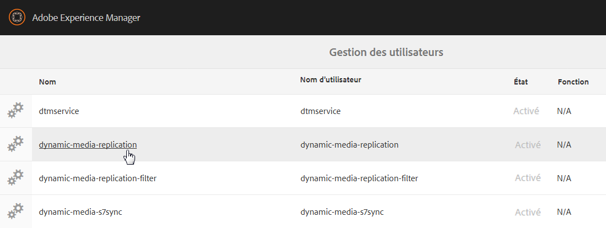

1. Sur la page Modifier les paramètres utilisateur pour la page de réplication Dynamic Media, appuyez sur l’onglet **[!UICONTROL Keystore]** puis cliquez sur **[!UICONTROL Créer le KeyStore]**.

   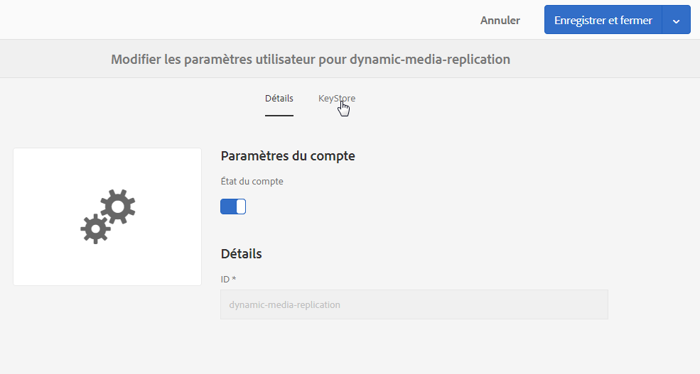

1. Saisissez un mot de passe, puis confirmez-le dans la boîte de dialogue **[!UICONTROL Définir le mot de passe d’accès KeyStore]**.

   >[!NOTE]
   Veillez à ne pas oublier le mot de passe saisi. Vous devrez le saisir de nouveau ultérieurement pour configurer l’agent de réplication. 

   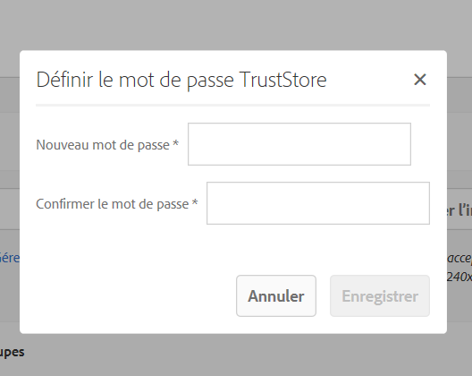

1. Sur la page **[!UICONTROL Modifier les paramètres utilisateurs pour la réplication Dynamic Media]**, **développer l’espace Ajouter une clé privée depuis le fichier KeyStore** et ajoutez les éléments suivants (voir image suivante) :

   * In the **[!UICONTROL New Alias]** field, enter the name of an alias that you will later use in the replication configuration; for example, `replication`.
   * Appuyez sur **[!UICONTROL KeyStore File]**. Accédez au fichier KeyStore fourni par Adobe, sélectionnez-le puis appuyez sur **[!UICONTROL Ouvrir]**. 
   * In the **[!UICONTROL KeyStore File Password]** field, enter the KeyStore File password. Ce n’est **pas** le mot de passe du KeyStore que vous avez créé à l’étape 5. C’est le mot de passe du fichier KeyStore fourni par Adobe dans le courriel de bienvenue qui vous a été envoyé pendant le provisionnement. Contactez l’assistance clientèle si vous n’avez pas reçu le mot de passe du fichier KeyStore.
   * Dans le champ **[!UICONTROL Mot de passe de la clé privée]**, entrez le mot de passe de la clé privée (ce peut être le même mot de passe de clé privée que celui fourni à l’étape précédente). Adobe vous fournit ce mot de passe de clé privée dans le courriel de bienvenue qui vous est envoyé pendant le provisionnement. Contactez l’assistance clientèle si vous n’avez pas reçu le mot de passe de clé privée.
   * In the **[!UICONTROL Private Key Alias]** field, enter the private key alias. For example, `*companyname*-alias`. Adobe vous fournit cet alias de clé privée dans le courriel de bienvenue qui vous est envoyé pendant le provisionnement. Contactez l’assistance clientèle si vous n’avez pas reçu d’alias de clé privée.

   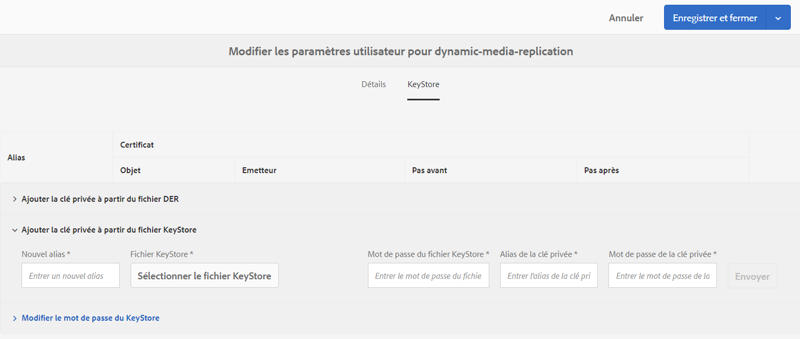

1. Appuyez sur **[!UICONTROL Enregistrer et fermer]** pour enregistrer vos modifications pour cet utilisateur.

   Vous devez ensuite [configurer l’agent de réplication.](#configuring-the-replication-agent)

### Configuration de l’agent de réplication {#configuring-the-replication-agent}

1. Dans AEM, appuyez sur le logo AEM pour accéder à la console de navigation globale, puis appuyez sur **[!UICONTROL Outils > Déploiement > Réplication  > Agents sur l’auteur]**.
1. Dans la page Agents sur l’auteur, appuyez ou cliquez sur **[!UICONTROL Réplication des images hybrides Dynamic Media (s7delivery)]**.
1. Appuyez sur **[!UICONTROL Modifier]**.
1. Tap the **[!UICONTROL Settings]** tab, then enter the following:

   * **[!UICONTROL Activé ]**: cochez cette option pour activer l’agent de réplication.
   * **[!UICONTROL Région]** - Définissez la région appropriée : Amérique du Nord, Europe ou Asie
   * **[!UICONTROL ID]** du client : cette valeur correspond au nom de votre société/client qui publie sur le service de réplication. Cette valeur correspond à l’identifiant du client fourni par Adobe dans le courrier électronique de bienvenue qui vous a été envoyé lors de l’attribution des privilèges d’accès. Contactez l’assistance clientèle si vous ne l’avez pas reçu.
   * **[!UICONTROL Alias]** de stockage de clés : cette valeur est identique à la valeur** Nouvel alias** définie lors de la génération de la clé dans [Configuration de l&#39;authentification](#setting-up-authentication); par exemple, `replication`. (See step 7 in [Setting Up Authentication](#setting-up-authentication).)
   * **[!UICONTROL Mot de passe]** du Key Store : mot de passe du KeyStore créé lorsque vous avez appuyé sur **[!UICONTROL Créer KeyStore]**. Adobe ne fournit pas ce mot de passe. See step 5 of [Setting up Authentication](#setting-up-authentication).

   L’image suivante montre l’agent de réplication avec des exemples de données :

   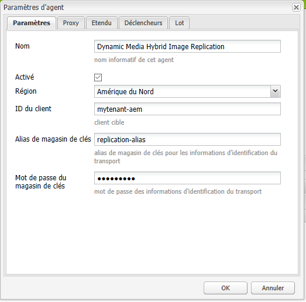

1. Appuyez sur **[!UICONTROL OK]**.

### Validation de l’agent de réplication pour Dynamic Media {#validating-the-replication-agent-for-dynamic-media}

Pour valider l&#39;agent de réplication pour les supports dynamiques, procédez comme suit :

Appuyez sur **[!UICONTROL Tester la connexion]**. Voici un exemple de résultat :

```shell
11.03.2016 10:57:55 - Transferring content for ReplicationAction{type=TEST, path[0]='/content/dam', time=1457722675402, userId='admin', revision='null'}
11.03.2016 10:57:55 - * Auth User: replication-receiver
11.03.2016 10:57:55 - * HTTP Version: 1.1
11.03.2016 10:57:55 - * Using OAuth 2.0 Authorization Grants
11.03.2016 10:57:55 - * OAuth 2.0 User: dynamic-media-replication
11.03.2016 10:57:55 - * OAuth 2.0 Token: '*****' initialized
11.03.2016 10:57:55 - Publishing: POST[https://replicate-na.assetsadobe.com:8580/is-publish/publish-receiver?Cmd=Test&RootId=xfpuu-6613]
11.03.2016 10:57:55 - Publish response: OK[]
11.03.2016 10:57:55 - Transfer succeeded in 141 ms for ReplicationAction{type=TEST, path[0]='/content/dam', time=1457722675402, userId='admin', revision='null'}
-------------------------------------------------------------------------------------------------------------------------------
Replication test succeeded
```

>[!NOTE]
Vous pouvez aussi procéder de l’une des manières suivantes :
* Vérifiez les journaux de réplication pour vous assurer que la ressource a été répliquée.
* Publiez une image. Tap the image and select **[!UICONTROL Viewers]** in drop-down menu. Sélectionnez ensuite un paramètre prédéfini de visionneuse, puis cliquez sur URL et copiez/collez l’URL dans le navigateur pour vérifier que l’image s’affiche.


### Résolution des problèmes d’authentification {#troubleshooting-authentication}

Lors de la configuration de l’authentification, voici certains problèmes que vous pourriez rencontrer, ainsi que leurs solutions. Avant de commencer, vérifiez que vous avez configuré la réplication.

#### Problème : Code d’état HTTP 401 avec message - Autorisation requise {#problem-http-status-code-with-message-authorization-required}

Ce problème peut être dû à l’échec de la configuration du KeyStore pour l’utilisateur `dynamic-media-replication`.

```shell
Replication test to s7delivery:https://s7bern.macromedia.com:8580/is-publish/
17.06.2016 18:54:43 - Transferring content for ReplicationAction{type=TEST, path[0]='/content/dam', time=1466214883309, userId='admin', revision='null'}
17.06.2016 18:54:43 - * Auth User: replication-receiver
17.06.2016 18:54:43 - * HTTP Version: 1.1
17.06.2016 18:54:43 - * Using OAuth 2.0 Authorization Grants
17.06.2016 18:54:43 - * OAuth 2.0 User: dynamic-media-replication
17.06.2016 18:54:43 - No OAuth token available. OAuth not initialized
17.06.2016 18:54:43 - * Using Client Auth SSL alias - replication-alias *
17.06.2016 18:54:43 - Publishing: POST[https://<localhost>:8580/is-publish//publish-receiver?Cmd=Test&RootId=brough]
17.06.2016 18:54:43 - Transfer failed for ReplicationAction{type=TEST, path[0]='/content/dam', time=1466214883309, userId='admin', revision='null'}. java.io.IOException: Failed to execute request
'https://<localhost>:8580/is-publish//publish-receiver?Cmd=Test&RootId=brough':
 Server returned status code 401 with message: Authorization required.
17.06.2016 18:54:43 - Error while replicating: com.day.cq.replication.ReplicationException: Transfer failed for ReplicationAction{type=TEST, path[0]='/content/dam', time=1466214883309,
 userId='admin', revision='null'}. java.io.IOException: Failed to execute request
'https://<localhost>:8580/is-publish//publish-receiver?Cmd=Test&RootId=brough':
 Server returned status code 401 with message: Authorization required.
```

**Solution**: Vérifiez que le `KeyStore` fichier est enregistré sur l’utilisateur de réplication **de médias** dynamiques et qu’il dispose du mot de passe correct.

#### Problème : Impossible de déchiffrer la clé - Impossible de déchiffrer les données {#problem-could-not-decrypt-key-could-not-decrypt-data}

```xml
Replication test to s7delivery:https://<localhost>:8580/is-publish/
17.06.2016 19:00:16 - Transferring content for ReplicationAction{type=TEST, path[0]='/content/dam', time=1466215216662, userId='admin', revision='null'}
17.06.2016 19:00:16 - * Auth User: replication-receiver
17.06.2016 19:00:16 - * HTTP Version: 1.1
17.06.2016 19:00:16 - * Using OAuth 2.0 Authorization Grants
17.06.2016 19:00:16 - * OAuth 2.0 User: dynamic-media-replication
17.06.2016 19:00:16 - No OAuth token available. OAuth not initialized
17.06.2016 19:00:16 - * Using Client Auth SSL alias - replication-alias *
17.06.2016 19:00:16 - Transfer failed for ReplicationAction{type=TEST, path[0]='/content/dam', time=1466215216662, userId='admin', revision='null'}. java.lang.SecurityException: java.security.UnrecoverableKeyException: Could not decrypt key: Could not decrypt data.
```

**Solution** : vérifiez le mot de passe. Le mot de passe enregistré dans l’agent de réplication n’est pas le même mot de passe que celui utilisé pour créer le KeyStore.

#### Problème : InvalidAlgorithmParameterException {#problem-invalidalgorithmparameterexception}

Ce problème est causé par une erreur de configuration dans votre instance Auteur AEM. Le `javax.net.ssl.trustStore` obtenu par le processus java sur l’auteur n’est pas correct. L’erreur est visible dans le journal de réplication :

```shell
14.04.2016 09:37:43 - Transfer failed for ReplicationAction{type=TEST, path[0]='/content/dam', time=1460651862089, userId='admin', revision='null'}. java.io.IOException: Failed to execute request 'https://<localhost>:8580/is-publish/publish-receiver?Cmd=Test&RootId=rbrough-osx2': java.lang.RuntimeException: Unexpected error: java.security.InvalidAlgorithmParameterException: the trustAnchors parameter must be non-empty
14.04.2016 09:37:43 - Error while replicating: com.day.cq.replication.ReplicationException: Transfer failed for ReplicationAction{type=TEST, path[0]='/content/dam', time=1460651862089, userId='admin', revision='null'}. java.io.IOException: Failed to execute request 'https://<localhost>:8580/is-publish/publish-receiver?Cmd=Test&RootId=rbrough-osx2': java.lang.RuntimeException: Unexpected error: java.security.InvalidAlgorithmParameterException: the trustAnchors parameter must be non-empty
```

Ou dans le journal des erreurs :

```shell
07.25.2019 12:00:59.893 *ERROR* [sling-threadpool-db2763bb-bc50-4bb5-bb64-10a09f432712-(apache-sling-job-thread-pool)-90-com_day_cq_replication_job_s7delivery(com/day/cq/replication/job/s7delivery)] com.day.cq.replication.Agent.s7delivery.queue Error during processing of replication.

java.io.IOException: Failed to execute request 'https://replicate-na.assetsadobe.com:8580/is-publish/publish-receiver?Cmd=Test&RootId=rbrough-osx': java.lang.RuntimeException: Unexpected error: java.security.InvalidAlgorithmParameterException: the trustAnchors parameter must be non-empty
        at com.scene7.is.catalog.service.publish.atomic.PublishingServiceHttp.executePost(PublishingServiceHttp.scala:195)
```

**Solution**: Assurez-vous que la propriété système du processus java sur le AEM Author est `-Djavax.net.ssl.trustStore=` définie sur un fichier Trust Store valide.

#### Problème : Le KeyStore n’est pas configuré ou n’a pas été initialisé {#problem-keystore-is-either-not-set-up-or-it-is-not-initialized}

Le problème peut être dû à un correctif ou à un Feature Pack qui a écrasé le nœud du KeyStore ou dynamic-media-user.

Exemple de journal de réplication :

```shell
Replication test to s7delivery:https://replicate-na.assetsadobe.com/is-publish
02.08.2016 14:37:44 - Transferring content for ReplicationAction{type=TEST, path[0]='/content/dam', time=1470173864834, userId='admin', revision='null'}
02.08.2016 14:37:44 - * Auth User: replication-receiver
02.08.2016 14:37:44 - * HTTP Version: 1.1
02.08.2016 14:37:44 - * Using OAuth 2.0 Authorization Grants
02.08.2016 14:37:44 - * OAuth 2.0 User: dynamic-media-replication
02.08.2016 14:37:44 - Transfer failed for ReplicationAction{type=TEST, path[0]='/content/dam', time=1470173864834, userId='admin', revision='null'}. com.adobe.granite.keystore.KeyStoreNotInitialisedException: Uninitialised key store for user dynamic-media-replication
```

**Solution**:

1. Accédez à la page Gestion des utilisateurs :
   `localhost:4502/libs/granite/security/content/useradmin.html`
1. On the User Management page, navigate to the `dynamic-media-replication` user, then tap to open.
1. Cliquez sur l’onglet **[!UICONTROL KeyStore]**. Si le bouton **[!UICONTROL Créer KeyStore]** apparaît, il vous faut alors répéter les étapes décrites précédemment sous [Configuration de l’authentification](#setting-up-authentication).
1. Si vous aviez à répéter la configuration du KeyStore, il se peut que vous ayiez à répéter la [ Configuration de l’agent de réplication](/help/assets/config-dynamic.md#configuring-the-replication-agent) également.

   Reconfigurez l’agent de réplication s7delivery.
   `localhost:4502/etc/replication/agents.author/s7delivery.html`

1. Appuyez sur **[!UICONTROL Tester la connexion]** pour vous assurer que la configuration est valide.

#### Problème : L’agent de publication utilise SSL à la place d’OAuth {#problem-publish-agent-is-using-ssl-instead-of-oauth}

Le problème peut être dû à un correctif ou à un Feature Pack qui ne s’est pas installé correctement ou qui a écrasé les paramètres.

Exemple de journal de réplication :

```shell
01.08.2016 18:42:59 - Transferring content for ReplicationAction{type=TEST, path[0]='/content/dam', time=1470073379634, userId='admin', revision='null'}
01.08.2016 18:42:59 - * Auth User: replication-receiver
01.08.2016 18:42:59 - * HTTP Version: 1.1
01.08.2016 18:42:59 - * Using Client Auth SSL alias - replication-receiver *
01.08.2016 18:42:59 - Publishing: POST[https://replicate-eu.assetsadobe2.com:443/is-publish/publish-receiver?Cmd=Test&RootId=altayerstaging]
01.08.2016 18:42:59 - Transfer failed for ReplicationAction{type=TEST, path[0]='/content/dam', time=1470073379634, userId='admin', revision='null'}. java.io.IOException: Failed to execute request 'https://replicate-eu.assetsadobe2.com:443/is-publish/publish-receiver?Cmd=Test&RootId=rbroughstaging': Server returned status code 401 with message: Authorization required.
01.08.2016 18:42:59 - Error while replicating: com.day.cq.replication.ReplicationException: Transfer failed for ReplicationAction{type=TEST, path[0]='/content/dam', time=1470073379634, userId='admin', revision='null'}. java.io.IOException: Failed to execute request 'https://replicate-eu.assetsadobe2.com:443/is-publish/publish-receiver?Cmd=Test&RootId=rbroughstaging': Server returned status code 401 with message: Authorization required.
```

**Solution:**

1. Dans AEM, cliquez sur **[!UICONTROL Outils > Général > CRXDE Lite]**.

   `localhost:4502/crx/de/index.jsp`

1. Naviguez vers le nœud de l’agent de réplication s7delivery.
   `localhost:4502/crx/de/index.jsp#/etc/replication/agents.author/s7delivery/jcr:content`

1. Ajoutez ce paramètre à l’agent de réplication (Booléen avec la valeur **[!UICONTROL True]**) :

   `enableOauth=true`

1. Dans le coin supérieur gauche de la page, appuyez sur **[!UICONTROL Tout enregistrer]**.

### Test de la configuration {#testing-your-configuration}

Adobe vous recommande d’effectuer un test complet de la configuration :

Assurez-vous d’avoir déjà effectué les étapes suivantes avant de commencer ce test :

* Ajouter les paramètres d’image prédéfinis.
* Configurez **[!UICONTROL la configuration Dynamic Media (version antérieure à 6.3)]** sous Services cloud. L’URL du service d’images est obligatoire pour ce test

**Pour tester votre configuration**

1. Téléchargez une ressource image. (In Assets, tap **[!UICONTROL Create > Files]** and select the file.)
1. Patientez jusqu’à la fin du workflow.
1. Publiez la ressource image. (Sélectionnez la ressource et appuyez sur **[!UICONTROL Publication rapide]**.)
1. Navigate to the renditions for that image by opening the image, and tapping **[!UICONTROL Renditions]**.

   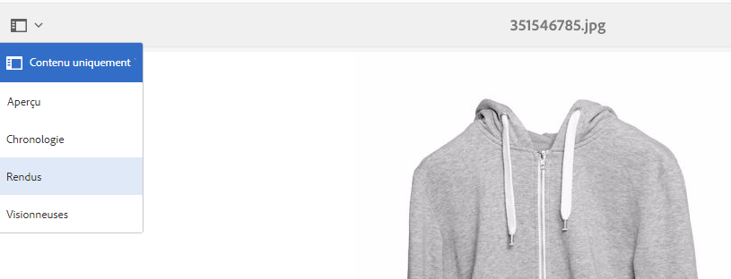

1. Sélectionnez n’importe quel rendu dynamique.
1. Cliquez sur **[!UICONTROL URL]** pour obtenir l’URL de cette ressource.
1. Naviguez vers l’URL sélectionnée et vérifiez si l’image se comporte comme prévu.

Une autre façon de vérifier que vos ressources ont bien été diffusées est d’ajouter req=exists à votre URL.

## Configuration des Services cloud Dynamic Media {#configuring-dynamic-media-cloud-services}

Les Services cloud Dynamic Media fournissent la prise en charge des services cloud comme la publication hybride et la diffusion d’images et de vidéos, d’analyses vidéo, d’encodage vidéo, etc.

Lors de la configuration, vous devez entrer un ID d’enregistrement, l’URL du service vidéo, l’URL du service d’images, l’URL du service de réplication et configurer l’authentification. Vous auriez dû recevoir toutes ces informations dans le cadre du processus d’attribution des privilèges d’accès aux comptes. Si vous n&#39;avez pas reçu ces informations, contactez votre administrateur d&#39;Adobe Experience Manager ou votre support technique Adobe pour obtenir ces informations.

>[!NOTE]
Avant de configurer les Services cloud Dynamic Media, assurez-vous d’avoir configuré l’instance de publication. Vous devez également configurer la réplication avant de configurer les Services cloud Dynamic Media.

Pour configurer les Services cloud Dynamic Media :

1. In AEM, tap the AEM logo to access the global navigation console and tap **[!UICONTROL Tools > Cloud Services > Dynamic Media Configuration (Pre-6.3)]**.
1. On the Dynamic Media Configuration Browser page, in the left pane, select **[!UICONTROL global]**, then tap **[!UICONTROL Create]**.
1. Dans la boîte de dialogue **[!UICONTROL Configuration de Dynamic Media]**, dans le champ Titre, tapez un titre.
1. Si vous configurez Dynamic Media pour la vidéo,

   * dans le champ **[!UICONTROL ID d’enregistrement]**, entrez votre ID d’enregistrement.
   * In the **V[!UICONTROL ideo Service URL ]**field, enter the video service URL for the Dynamic Media Gateway.

1. Si vous configurez Dynamic Media pour les images, dans le champ **[!UICONTROL URL du service d’images]**, saisissez l’URL du service d’images pour la passerelle Dynamic Media.
1. Appuyez sur **[!UICONTROL Enregistrer]** pour revenir à la page Navigateur de configuration Dynamic Media.
1. Appuyez sur le logo AEM pour accéder à la console de navigation globale.

## Configuration des rapports vidéo {#configuring-video-reporting}

Vous pouvez configurer les rapports vidéo pour plusieurs installations d’AEM à l’aide de Dynamic Media en mode hybride.

**Utilisation :** au moment de la configuration de Dynamic Media (version antérieure à 6.3), de nombreuses fonctionnalités démarrent, dont celle des rapports vidéo. La configuration crée une suite de rapports dans une entreprise Analytics régionale. Si vous configurez plusieurs nœuds Auteur, vous créez une suite de rapport séparée pour chacun. Par conséquent, les données de rapport sont inconhérentes entre les installations. En outre, si chaque nœud Auteur se réfère au même serveur Hybrid Publish, la dernière installation Auteur modifie la suite de rapports de destination pour tous les rapports vidéo. Le problème surcharge le système d’analyses avec de trop nombreuses suites de rapports.

**Commencer :** configurez les rapports vidéo en effectuant les trois tâches suivantes.

1. Créez un package de paramètres prédéfinis d’analyses vidéo après avoir configuré Configuration Dynamic Media (version antérieure à 6.3) sur le premier nœud Auteur. Cette première tâche est importante car elle permet à une nouvelle configuration de continuer à utiliser la même suite de rapports.
1. Installez le module de paramètres prédéfinis d’analyses vidéo sur ***tout*** nouveau nœud Auteur ***avant*** de configurer Configuration Dynamic Media (version antérieure à 6.3). 
1. Vérifiez et déboguez l’installation du module.

### Création d’un module de paramètres prédéfinis d’analyses vidéo après la configuration du premier nœud Auteur {#creating-a-video-analytics-preset-package-after-configuring-the-first-author-node}

Lorsque vous avez terminé cette tâche, vous disposez d’un ensemble de fichiers contenant les paramètres prédéfinis d’analyses vidéo. Ces paramètres prédéfinis comportent une suite de rapports, le serveur de suivi, les espaces de nom de suivi et l’ID d’organisation Marketing Cloud, le cas échéant.

1. Si vous ne l’avez pas déjà fait, configurez la Configuration Dynamic Media (version antérieure à 6.3).
1. (Facultatif) Affichez et copiez l’ID de suite de rapports (vous devez avoir accès au JCR). Bien que disposer de l’ID de suite de rapports n’est pas obligatoire, cela facilite la validation.
1. Créez un module à l’aide du gestionnaire de modules.
1. Modifiez le module pour inclure un filtre.

   Dans AEM: `/conf/global/settings/dam/dm/presets/analytics/jcr:content/userdata`

1. Créez le module.
1. Téléchargez ou partagez le module de paramètres prédéfinis d’analyses vidéo afin que celui-ci puisse être partagé avec les nouveaux nœuds auteur ultérieurs.

### Installation du module de paramètres prédéfinis d’analyses vidéo préalable à la configuration des nœuds auteur additionnels {#installing-the-video-analytics-preset-package-before-you-configure-additional-author-nodes}

Assurez-vous d’avoir effectué cette tâche ***avant*** de configurer Configuration Dynamic Media (version antérieure à 6.3). Sinon, une autre suite de rapports inutilisée est créée. En outre, même si le rapports vidéo continuera à fonctionner correctement, la collecte de données n’est pas optimisée.

Vérifiez que le module de paramètres prédéfinis d’analyses vidéo du premier nœud Auteur est accessible sur le nouveau nœud Auteur.

1. Téléchargez le module de paramètres prédéfinis d’analyses vidéo que vous avez créé précédemment sur le gestionnaire de modules.
1. Installez le module de paramètres prédéfinis d’analyses vidéo.
1. Configurez Configuration Dynamic Media (version antérieure à 6.3).

### Vérification et débogage de l’installation du module {#verifying-and-debugging-the-package-installation}

1. Effectuez l’une des actions suivantes et, si nécessaire, déboguez l’installation du module :

   * **Vérifiez les paramètres prédéfinis d’analyses vidéo au moyen du JCR** Pour vérifier les paramètres prédéfinis d’analyses vidéo au moyen du JCR, vous devez disposer d’un accès à CRXDE Lite.

      AEM - In CRXDE Lite, navigate to `/conf/global/settings/
dam/dm/presets/analytics/jcr:content/userdata`

      That is `https://localhost:4502/crx/de/index.jsp#/conf/global/settings/dam/dm/presets/analytics/jcr%3Acontent/userdata`

      Si vous n’avez pas accès à CRXDE Lite sur le noeud d’auteur, vous pouvez vérifier le paramètre prédéfini via le serveur de publication.

   * **Vérification du paramètre prédéfini Analytics vidéo via le serveur d’images**

      Vous pouvez valider le paramètre prédéfini Analytics vidéo directement en exécutant une requête Image Server req=userdata.
Par exemple, pour afficher le paramètre prédéfini Analytics sur le noeud d’auteur, vous pouvez effectuer la requête suivante :

      `https://localhost:4502/is/image/conf/global/settings/dam/dm/presets/analytics?req=userdata`

      Pour valider le paramètre prédéfini sur les serveurs de publication, vous pouvez adresser une requête directe similaire au serveur de publication. La réponse est la même sur les nœuds d’auteur et de publication. La réponse ressemble à ce qui suit :**

      ```
      marketingCloudOrgId=0FC4E86B573F99CC7F000101
       reportSuite=aemaem6397618-2018-05-23
       trackingNamespace=aemvideodal
       trackingServer=aemvideodal.d2.sc.omtrdc.net
      ```

   * **Vérifiez le paramètre prédéfini Analytics vidéo à l’aide de l’outil Rapports vidéo dans AEM** Tap **[!UICONTROL Tools > Assets > Video Rapports.]**

      `https://localhost:4502/mnt/overlay/dam/gui/content/s7dam/videoreports/videoreport.html`

      Si le message d’erreur suivant s’affiche, la suite de rapports est disponible, mais pas renseignée. Cette erreur est correcte -et voulue- dans une nouvelle installation, avant que le système ne collecte des données.
   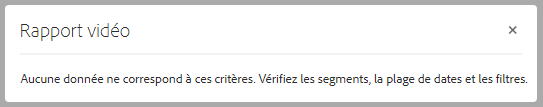

   Pour générer des données de rapport, téléchargez et publiez une vidéo. Utilisez **[!UICONTROL Copier l’URL]** et exécutez la vidéo au moins une fois.

   Gardez à l’esprit que cela peut prendre jusqu’à 12 h pour que les données de rapport soient remplies depuis l’utilisation de la visionneuse vidéo.

   Si une erreur survient et que la suite de rapports n’est pas configurée correctement, l’avertissement suivant s’affiche.

   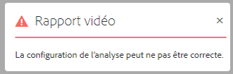

   Cette erreur s’affiche également si le rapport vidéo est exécuté avant la configuration des services de Configuration Dynamic Media (version antérieure à 6.3).

### Dépannage de la configuration de rapport vidéo {#troubleshooting-the-video-reporting-configuration}

* Pendant l’installation, les connexions au serveur API Analytics expirent. L’installation effectue 20 nouvelles tentatives de connexion, mais elles échouent. Dans ce cas, le fichier journal enregistre plusieurs erreurs. Recherchez `SiteCatalystReportService`.
* Le fait de ne pas installer le module de paramètres prédéfinis d’analyses en premier peut causer la création d’une nouvelle suite de rapports.
* La mise à niveau d’AEM 6.3 vers AEM 6.4 ou AEM 6.4.1, suivie de la configuration de Configuration Dynamic Media (version antérieure à 6.3) génère quand même une suite de rapports. Ce problème est connu et sa réparation est prévue pour AEM 6.4.2.

### À propos des paramètres prédéfinis d’analyses vidéo {#about-the-video-analytics-preset}

Les paramètres prédéfinis d’analyses vidéo, parfois simplement appelés paramètres prédéfinis d’analyses, sont stockés près des paramètres prédéfinis de la visionneuse dans Dynamic Media. Il s’agit presque de la même chose que les paramètres prédéfinis de la visionneuse mais avec des informations utilisées pour configurer les rapports AppMeasurement et Video Heartbeat.

Les propriétés des paramètres prédéfinis sont les suivantes :

* `reportSuite`
* `trackingServer`
* `trackingNamespace`
* `marketingCloudOrgId` (non présent dans les anciennes versions d’AEM)

AEM 6.4 et les versions plus récentes enregistrent ce paramètre prédéfini à la section `/conf/global/settings/dam/dm/presets/analytics/jcr:content/userdata`

## Réplication des paramètres de catalogue {#replicating-catalog-settings}

Vous devez publier vos propres paramètres de catalogue par défaut lors du processus de configuration via le JCR. Pour répliquer les paramètres de catalogue :

1. Dans la fenêtre de terminal, exécutez les opérations suivantes :

   `curl -u admin:admin localhost:4502/libs/settings/dam/dm/presets/viewer.pushviewerpresets`

1. Dans AEM, accédez à l’emplacement suivant dans CRXDE Lite (privilèges administrateur requis) :

   `https://<*server*>:<*port*>/crx/de/index.jsp#/conf/global/settings/dam/dm/imageserver/`

1. Appuyez sur l’onglet **[!UICONTROL Réplication]**.
1. Appuyez sur **[!UICONTROL Répliquer]**.

## Réplication des paramètres prédéfinis de la visionneuse {#replicating-viewer-presets}

To deliver *an asset with a viewer preset, you must replicate/publish* the viewer preset. (All viewer presets must be activated *and* replicated to obtain the URL or embed code for an asset.
Reportez-vous à la section [Publication des paramètres prédéfinis de la visionneuse](/help/assets/managing-viewer-presets.md#publishing-viewer-presets) pour plus d’informations.

>[!NOTE]
By default, the system shows a variety of renditions when you select **[!UICONTROL Renditions]** and a variety of viewer presets when you select **[!UICONTROL Viewers]** in the asset&#39;s detail view. Vous pouvez augmenter ou diminuer le nombre indiqué. See [Increasing the number of image presets that display](/help/assets/managing-image-presets.md#increasingthenumberofimagepresetsthatdisplay) or [Increasing the number of viewer presets that display](/help/assets/managing-viewer-presets.md#increasing-the-number-of-viewer-presets-that-display).

## Filtrage des ressources pour la réplication {#filtering-assets-for-replication}

In non-Dynamic Media deployments, you replicate *all* assets (both images and video) from your AEM author environment to the AEM publish node. Ce processus est nécessaire car les serveurs de publication AEM diffusent également les ressources.

Cependant, dans les déploiements Dynamic Media, dans la mesure où les ressources sont distribuées par le biais du cloud, il n’est pas nécessaire de répliquer ces mêmes ressources sur les noeuds de publication AEM. Un tel processus de &quot;publication hybride&quot; permet d’éviter des coûts d’enregistrement supplémentaires et des délais de traitement plus longs pour la réplication des ressources. D’autres contenus, comme les visionneuses Dynamic Media, les pages de site et le contenu statique, restent diffusés depuis les nœuds de publication AEM.

Outre la réplication des actifs, les autres actifs suivants sont également répliqués :

* Configuration de la Diffusion Dynamic Media : `/conf/global/settings/dam/dm/imageserver/jcr:content`
* Paramètres d’image prédéfinis: `/conf/global/settings/dam/dm/presets/macros`
* Paramètres prédéfinis de la visionneuse: `/conf/global/settings/dam/dm/presets/viewer`

Les filtres vous permettent d’*empêcher* que les ressources ne soient répliquées vers le nœud de publication AEM.

### Utilisation de filtres de ressources par défaut pour la réplication {#using-default-asset-filters-for-replication}

If you are using Dynamic Media for (1) imaging in production **or** (2) imaging and video, then you can use the default filters that we provide as-is. Les filtres suivants sont activés par défaut :

<table>
 <tbody>
  <tr>
   <td> </td>
   <td><strong>Filtrer</strong></td>
   <td><strong>Type de MIME</strong></td>
   <td><strong>Rendus</strong></td>
  </tr>
  <tr>
   <td>Dynamic Media Image Diffusion</td>
   <td><p>filter-images</p> <p>ensembles de filtres</p> <p> </p> </td>
   <td><p>Débuts avec <strong>image/</strong></p> <p>Contient l’ <strong>application/</strong> et se termine par <strong>set</strong>.</p> </td>
   <td>Les "images-filtres" prêtes à l’emploi (s’appliquent aux fichiers d’images uniques, y compris aux images interactives) et les "visionneuses de filtres" (s’appliquent aux visionneuses à 360°, aux visionneuses d’images, aux visionneuses de supports variés et aux visionneuses de carrousel) :
    <ul>
     <li>Incluez des images PTIFF et des métadonnées pour la réplication (tout rendu commençant par <strong>cqdam</strong>).</li>
     <li>Suppriment de la réplication l’image d’origine et les rendus d’image statiques.</li>
    </ul> </td>
  </tr>
  <tr>
   <td>Diffusion vidéo Dynamic Media</td>
   <td>filter-video</td>
   <td>Débuts avec <strong>vidéo/</strong></td>
   <td>La "vidéo-filtre" prête à l'emploi permet de :
    <ul>
     <li>Incluez des rendus de vidéo proxy, des images miniatures/affiches vidéo, des métadonnées (à la fois dans les rendus vidéo parents et vidéo) pour la réplication (tout rendu commençant par <strong>cqdam</strong>).</li>
     <li>Exclure de la réplication les rendus vidéo et miniatures statiques d’origine.<br /> <br /> <strong>Remarque :</strong> Les rendus de vidéo proxy ne contiennent pas de fichiers binaires, mais sont simplement des propriétés de noeud. Ils n’affectent donc pas la taille du référentiel de l’éditeur.</li>
    </ul> </td>
  </tr>
  <tr>
   <td>Intégration de Dynamic Media Classic (Scene7)</td>
   <td><p>filter-images</p> <p>ensembles de filtres</p> <p>filter-video</p> </td>
   <td><p>Débuts avec <strong>image/</strong></p> <p>Contient l’ <strong>application/</strong> et se termine par <strong>set</strong>.</p> <p>Débuts avec <strong>vidéo/</strong></p> </td>
   <td><p>Configurez l’URI de transport pour qu’il pointe vers votre serveur de publication AEM au lieu de l’URL du service de réplication Dynamic Media Cloud d’Adobe. La configuration de ce filtre permet à Dynamic Media Classic de diffuser les ressources à la place de l’instance de publication AEM.</p> <p>Les options "filter-images", "filter-sets" et "filter-video" prêtes à l’emploi vont :</p>
    <ul>
     <li>Incluez des images PTIFF, des rendus de vidéo proxy et des métadonnées pour la réplication. Toutefois, dans la mesure où ils n’existent pas dans JCR, ces filtres n’ont aucun effet pour ceux qui exécutent l’intégration de Dynamic Media Classic d’AEM.</li>
     <li>Suppriment de la réplication l’image d’origine et les rendus d’image statiques, les vidéos d’origine et les rendus de miniature statiques. À la place, Dynamic Media Classic diffuse les ressources image et vidéo.</li>
    </ul> </td>
  </tr>
 </tbody>
</table>

>[!NOTE]
Les filtres s’appliquent aux types MIME et ne peuvent pas être spécifiques à un chemin.

### Configuration des filtres de ressource pour les déploiements vidéo uniquement {#setting-up-asset-filters-for-video-only-deployments}

Si vous utilisez Dynamic Media pour la vidéo uniquement, suivez les étapes suivantes pour configurer les filtres de ressource pour la réplication :

1. In AEM, tap the AEM logo to access the global navigation console and tap **[!UICONTROL Tools > Deployment > Replication > Agents on author]**.
1. Dans la page Agents sur l’auteur, appuyez sur **[!UICONTROL Agent par défaut (publication)]**.
1. Appuyez sur **[!UICONTROL Modifier]**.
1. In the **[!UICONTROL Agent Settings]** dialog box, in the **[!UICONTROL Settings]** tab, check **[!UICONTROL Enabled]** to turn on the agent.
1. Appuyez sur **[!UICONTROL OK]**.
1. Dans AEM, appuyez sur **[!UICONTROL Outils > Général > CRXDE Lite]**.
1. In the left folder tree, navigate to `/etc/replication/agents.author/dynamic_media_replication/jcr:content/damRenditionFilters`
1. Localisez **[!UICONTROL filter-video]**, cliquez dessus avec le bouton droit de la souris et sélectionnez **[!UICONTROL Copier]**.
1. In the left folder tree, navigate to `/etc/replication/agents.author/publish`
1. Localisez **[!UICONTROL jcr:content]**, cliquez dessus avec le bouton droit de la souris et sélectionnez **[!UICONTROL Coller]**.

Cette opération permet de configurer l’instance de publication AEM pour qu’elle fournisse l’image d’affiche et les métadonnées de la vidéo, qui sont nécessaires pour la lecture, tandis que la vidéo elle-même est fournie par le service cloud de Dynamic Media. Le filtre exclut également de la réplication la vidéo originale et les rendus de miniature statiques, qui ne sont pas nécessaires sur l’instance de publication.

### Configuration des filtres de ressource pour les images dans des déploiements hors production {#setting-up-asset-filters-for-imaging-in-non-production-deployments}

Si vous utilisez Dynamic Media pour les images dans des déploiements hors production, suivez les étapes suivantes pour configurer les filtres de ressource pour la réplication :

1. In AEM, tap the AEM logo to access the global navigation console and tap **[!UICONTROL Tools > Deployment > Replication > Agents on author]**.
1. Dans la page Agents sur l’auteur, appuyez sur **[!UICONTROL Agent par défaut (publication)]**.
1. Appuyez sur **[!UICONTROL Modifier]**.
1. In the **[!UICONTROL Agent Settings]** dialog box, in the **[!UICONTROL Settings]** tab, check **[!UICONTROL Enabled]** to turn on the agent.
1. Appuyez sur **[!UICONTROL OK]**.
1. Dans AEM, appuyez sur **[!UICONTROL Outils > Général > CRXDE Lite]**.
1. In the left folder tree, navigate to `/etc/replication/agents.author/dynamic_media_replication/jcr:content/damRenditionFilters`

   

1. Localisez **[!UICONTROL filter-images]**, cliquez dessus avec le bouton droit de la souris et sélectionnez **[!UICONTROL Copier]**.
1. In the left folder tree, navigate to `/etc/replication/agents.author/publish`
1. Locate **[!UICONTROL jcr:content]**, right-click it and select **[!UICONTROL Create > Create Node]**. Entrez le nom `damRenditionFilters` du type `nt:unstructured`.
1. Locate `damRenditionFilters`, right-click it and select **[!UICONTROL Paste]**.

Cette opération permet de configurer l’instance de publication AEM pour qu’elle fournisse les images à votre environnement hors production. Le filtre exclut également de la réplication l’image originale et les rendus statiques, qui ne sont pas nécessaires sur l’instance de publication.

>[!NOTE]
S’il existe de nombreux filtres dans un auteur, chaque agent nécessite qu’un autre utilisateur lui soit attribué. Le code Granite impose le modèle d’un filtre par utilisateur. Ayez toujours un utilisateur différent pour chaque filtre configuré.
If you are using more than one filter on a server - for example, one filter for replication to publish and a second filter for s7delivery - then you need to ensure that these two filters have a different **userId** assigned to them in the **jcr:content** node. Voir l’image suivante :


### Personnalisation des filtres de ressources pour la réplication {#customizing-asset-filters-for-replication}

Pour personnaliser les filtres de ressources pour la réplication (facultatif) :

1. In AEM, tap the AEM logo to access the global navigation console and tap **[!UICONTROL Tools > General > CRXDE Lite]**.
1. In the left folder tree, navigate to `/etc/replication/agents.author/dynamic_media_replication/jcr:content/damRenditionFilters` to review the filters.

   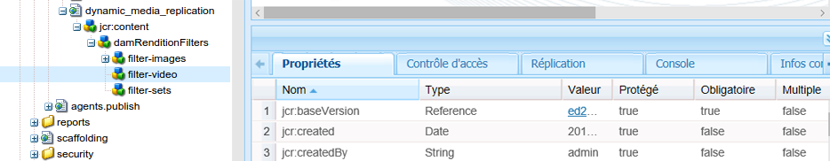

1. Pour définir le type MIME du filtre, vous pouvez localiser le type MIME comme suit : 

   Dans le rail de gauche, développez `content > dam > <locate_your_asset> >  jcr:content > metadata` puis dans le tableau, recherchez **[!UICONTROL dc:format]**.

   L’illustration ci-dessous est un exemple de chemin d’une ressource vers dc:format.

   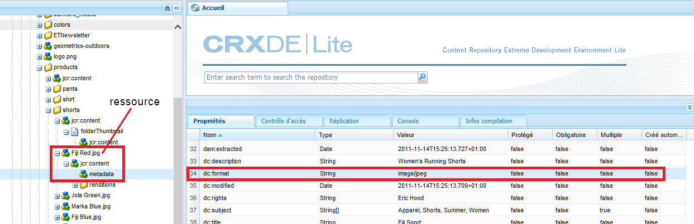

   Notice that the `dc:format` for the asset `Fiji Red.jpg` is `image/jpeg`.

   To have this filter apply to all images, regardless of their format, set the value to `image/*` where `*` is a regular expression that is applied to all images of any format.

   To have the filter apply only to images of the type JPEG, enter a value of `image/jpeg`.

1. Définissez les rendus que vous souhaitez inclure ou exclure de la réplication.

   Voici des exemples de caractères que vous pouvez utiliser afin de filtrer la réplication :

<table>
 <tbody>
  <tr>
   <td><strong>Caractère à utiliser</strong></td>
   <td><strong>filtres des ressources pour la réplication</strong></td>
  </tr>
  <tr>
   <td>*</td>
   <td>Caractère générique<br /> </td>
  </tr>
  <tr>
   <td>+</td>
   <td>Inclut des ressources pour la réplication.</td>
  </tr>
  <tr>
   <td>-</td>
   <td>Exclut les actifs de la réplication.</td>
  </tr>
 </tbody>
</table>

Accéder à `content/dam/<locate your asset>/jcr:content/renditions`.

L’illustration ci-dessous est un exemple de rendu d’une ressource.


Using the example above, if you only wanted to replicate the PTIFF (Pyramid TIFF), then you would enter `+cqdam,*` which includes all the renditions that start with `cqdam`. Inthe example, that rendition is `cqdam.pyramid.tiff`.

If you only wanted to replicate the original, then you would enter `+original`.

## Configuration des paramètres du serveur d’images Dynamic Media {#configuring-dynamic-media-image-server-settings}

Pour configurer le serveur d’images Dynamic Media, vous devez modifier les lots Adobe CQ Scene7 ImageServer et Adobe CQ Scene7 PlatformServer.

>[!NOTE]
Dynamic Media works out-of-the-box [after it is enabled](#enabling-dynamic-media). Cependant, vous pouvez choisir d’affiner l’installation en configurant le serveur d’images Dynamic Media.

**Condition préalable**: *Avant* de configurer Dynamic Media Image Server, assurez-vous que votre machine virtuelle Windows comprend une installation des bibliothèques Microsoft Visual C++. Les bibliothèques sont nécessaires pour exécuter le serveur d’images Dynamic Media. Vous pouvez [télécharger le module Microsoft Visual C++ 2010 Redistributable (x64) ici](https://www.microsoft.com/fr-fr/download/details.aspx?id=14632).

Pour configurer les paramètres du serveur d’images Dynamic Media :

1. In the upper-left corner of AEM, tap **[!UICONTROL Adobe Experience Manager]** to access the global navigation console, then tap **[!UICONTROL Tools > Operations > Web Console]**.
1. On the Adobe Experience Manager Web Console Configuration page, tap **[!UICONTROL OSGi > Configuration]** to list all the bundles that are currently running within AEM.

   Les serveurs de Diffusion Dynamic Media se trouvent sous les noms suivants dans la liste :

   * `Adobe CQ Scene7 ImageServer`
   * `Adobe CQ Scene7 PlatformServer`

1. Dans la liste de lots, à droite d’Adobe CQ Scene7 ImageServer, appuyez sur l’icône Modifier.
1. Dans la boîte de dialogue Adobe CQ Scene7 ImageServer, définissez les valeurs de configuration par défaut suivantes :

   >[!NOTE]
   Dans la plupart des cas, il n’est pas nécessaire de modifier les valeurs par défaut. Cependant, si vous modifiez les valeurs par défaut, vous devez redémarrer le lot pour que les modifications prennent effet.

<table>
 <tbody>
  <tr>
   <td><strong>Propriétés</strong></td>
   <td><strong>Valeur par défaut</strong></td>
   <td><strong>Description</strong></td>
  </tr>
  <tr>
   <td>TcpPort.name</td>
   <td><code><em>empty</em></code></td>
   <td>Numéro de port à utiliser pour la communication avec le processus ImageServer. Le port disponible par défaut est automatiquement détecté.</td>
  </tr>
  <tr>
   <td>AllowRemoteAccess.name</td>
   <td><code><em>empty</em></code></td>
   <td><p>Autoriser ou refuser l’accès à distance au processus ImageServer. Si la valeur est false, le serveur d’images écoute uniquement sur localhost.</p> <p>Les paramètres par défaut du service Externalizer qui pointe vers le localhost doivent spécifier le domaine ou l’adresse IP de l’instance VM spécifique. La raison en est que l'hôte local peut pointer vers le système parent de la machine virtuelle.</p> <p>Les domaines ou les adresses IP de la machine virtuelle ont donc peut-être besoin d’une entrée de fichier hôte pour être résolus.</p> </td>
  </tr>
  <tr>
   <td>MaxRenderRgnPixels</td>
   <td>16 mégapixels</td>
   <td>Taille maximale en mégapixels restitués.</td>
  </tr>
  <tr>
   <td>MaxMessageSize</td>
   <td>16 Mo</td>
   <td>Taille maximale du message envoyé en mégaoctects.</td>
  </tr>
  <tr>
   <td>RandomAccessUrlTimeout</td>
   <td>20</td>
   <td>Délai d’expiration correspondant au nombre de secondes durant lesquelles le serveur d’images attend le JCR pour répondre à une requête de plage de mosaïque.</td>
  </tr>
  <tr>
   <td>WorkerThreads</td>
   <td>10</td>
   <td>Nombre de threads Worker.</td>
  </tr>
 </tbody>
</table>

1. Appuyez sur **[!UICONTROL Save]** (Enregistrer).
1. In the list of bundles, to the right of Adobe CQ Scene7 PlatformServer, tap the **[!UICONTROL Edit]** icon.
1. Dans la boîte de dialogue Adobe CQ Scene7 PlatformServer, définissez les valeurs d’option par défaut suivantes :

   >[!NOTE]
   Le serveur d’images Dynamic Media utilise son propre cache sur disque pour mettre les réponses en mémoire cache. Le cache HTTP AEM et le Dispatcher ne peuvent pas être utilisés pour la mise en mémoire cache des réponses provenant du serveur d’images Dynamic Media.

   | **Propriété** | **Valeur par défaut** | **Description** |
   |---|---|---|
   | Cache enabled | Cochée | Indique si le cache de réponse est activé.. |
   | Cache roots | cache | Un ou plusieurs chemins vers les dossiers de cache de réponse. Les chemins relatifs sont résolus par rapport au dossier du lot s7imaging interne. |
   | Cache Max Size | 200 000 000 | Taille maximale du cache de réponse en octets. |
   | Cache Max Entries | 100 000 | Nombre maximal d’entrées autorisées dans le cache. |

### Paramètres du manifeste par défaut {#default-manifest-settings}

Le manifeste par défaut vous permet de configurer les valeurs par défaut qui sont utilisées pour générer les réponses du service de diffusion Dynamic Media. Vous pouvez affiner la qualité des réglages (qualité JPEG, résolution, mode de rééchantillonnage), la mise en cache (expiration) et empêcher le rendu des images trop volumineuses (defaultpix, defaultthumbpix, maxpix).

La localisation de la configuration du manifeste par défaut est basée sur la valeur par défaut de **[!UICONTROL Catalog root]** du lot **[!UICONTROL Adobe CQ Scene7 PlatformServer]**. By default this value is located at the following path within **[!UICONTROL Tools > General > CRXDE Lite]**:

`/conf/global/settings/dam/dm/imageserver/`

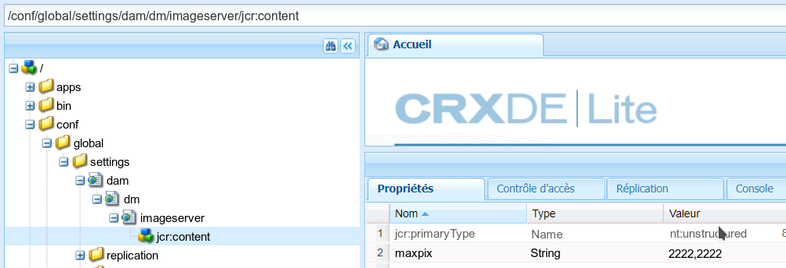

Vous pouvez modifier les valeurs des propriétés décrites dans le tableau ci-dessous en saisissant de nouvelles valeurs.

When you are finished making changes to the default manifest, in the upper-left corner of the page, tap **[!UICONTROL Save All]**.

Be sure you tap the **[!UICONTROL Access Control]** tab (to the right of the Properties tab), then set the access control privileges to `jcr:read` for the everyone and dynamic-media-replication users.

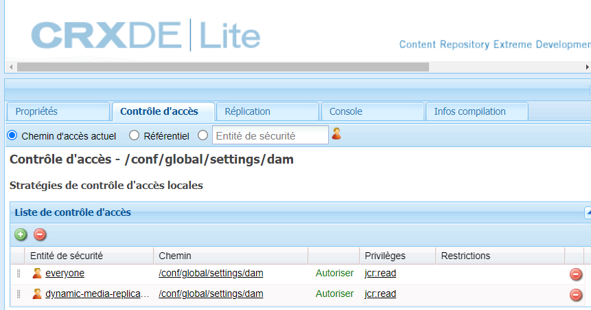

Tableau des paramètres du manifeste et leurs valeurs par défaut :

<table>
 <tbody>
  <tr>
   <td><strong>Propriétés</strong></td>
   <td><strong>Valeur par défaut</strong></td>
   <td><strong>Description</strong></td>
  </tr>
  <tr>
   <td>bkgcolor</td>
   <td>FFFFFF</td>
   <td><p>Couleur d’arrière-plan par défaut. La valeur RVB est utilisée pour remplir toutes les zones d’une image de réponse qui ne contiennent aucune donnée d’image actuelle.</p> <p>Voir également <a href="https://microsite.omniture.com/t2/help/en_US/s7/is_ir_api/is_api/image_catalog/r_bkgcolor.html">BkgColor</a> dans l’API du service d’images.</p> </td>
  </tr>
  <tr>
   <td>defaultpix</td>
   <td>300,300</td>
   <td><p>Taille d’affichage par défaut. Le serveur oblige les images de réponse à ne pas dépasser ces valeurs, si la requête ne précise pas la taille d’affichage explicitement à l’aide des commandes wid=, hei= ou scl=.</p> <p>Spécifiée sous la forme de deux nombres entiers de valeur supérieure ou égale à zéro, séparés par une virgule. Largeur et hauteur en pixels. Les deux valeurs, ou une seule, peuvent être définies sur 0 pour ne pas les limiter. Ne s’applique pas aux requêtes imbriquées/intégrées.</p> <p>Voir également <a href="https://microsite.omniture.com/t2/help/en_US/s7/is_ir_api/is_api/image_catalog/r_defaultpix.html">DefaultPix</a> dans l’API du service d’images.</p> <p>Habituellement, cependant, vous utilisez un paramètre de visionneuse ou d’image prédéfini pour fournir la ressource. Defaultpix ne s’applique qu’à une ressource qui n’utilise pas de paramètre de visionneuse ou d’image prédéfini.</p> </td>
  </tr>
  <tr>
   <td>defaultthumbpix</td>
   <td>100,100</td>
   <td><p>Taille de miniature par défaut. Utilisé à la place d’attribute::DefaultPix pour les requêtes de miniature (req=tmb).</p> <p>Le serveur oblige les images de réponse à ne pas dépasser ces valeurs, si la requête de miniature (req=tmb) ne précise pas la taille d’affichage explicitement à l’aide des commandes wid=, hei= ou scl=.</p> <p>Spécifiée sous la forme de deux nombres entiers de valeur supérieure ou égale à zéro, séparés par une virgule. Largeur et hauteur en pixels. Les deux valeurs, ou une seule, peuvent être définies sur 0 pour ne pas les limiter. </p> <p>Ne s’applique pas aux requêtes imbriquées/intégrées.</p> <p>See also <a href="https://microsite.omniture.com/t2/help/en_US/s7/is_ir_api/is_api/image_catalog/r_defaultthumbpix.html">DefaultThumbPix</a> in the Image Serving API. </p> </td>
  </tr>
  <tr>
   <td>expiration</td>
   <td>36 000 000</td>
   <td><p>Délai d’expiration par défaut du cache client. Indique un délai d’expiration par défaut dans l’éventualité où un enregistrement de catalogue spécifique ne contiendrait aucune valeur catalog::Expiration valide.</p> <p>Nombre réel, supérieur ou égal à zéro. Nombre de millisecondes jusqu’à l’expiration, depuis la génération des données de réponse. Définissez la valeur sur zéro pour que l’image de réponse expire immédiatement, ce qui permet de désactiver efficacement la mise en cache de client. Par défaut, la valeur est définie sur 10 heures, ce qui signifie que si une nouvelle image est publiée, il faudra 10 heures aux anciennes images pour quitter le cache de l’utilisateur. Contactez l’assistance clientèle si vous avez besoin que la mémoire cache soit effacée plus rapidement.</p> <p>Voir également <a href="https://marketing.adobe.com/resources/help/en_US/s7/is_ir_api/is_api/image_catalog/r_expiration.html">Expiration</a> dans l’API du service d’images.</p> </td>
  </tr>
  <tr>
   <td>jpegquality</td>
   <td>80</td>
   <td><p>Attributs d’encodage JPEG par défaut. Indique l’attribut par défaut des images de réponse au format JPEG.</p> <p>Nombre entier et indicateur, séparés par une virgule. La première valeur est comprise dans la plage 1..100 et définit la qualité. La seconde valeur peut être égale à 0 par défaut, ou à 1 pour désactiver la réduction de la résolution chromatique RVB généralement utilisée par les encodeurs JPEG.</p> <p>Voir également <a href="https://microsite.omniture.com/t2/help/en_US/s7/is_ir_api/is_api/image_catalog/r_jpegquality.html">JpegQuality</a> dans l’API du service d’images.</p> </td>
  </tr>
  <tr>
   <td>maxpix</td>
   <td>2000,2000</td>
   <td><p>Limite de taille de l’image de réponse. Largeur et hauteur maximales de l’image de réponse fournie au client.</p> <p>Le serveur renvoie une erreur si une requête provoque une image de réponse dont la largeur ou la hauteur est supérieure à attribute::MaxPix.</p> <p>Voir également <a href="https://microsite.omniture.com/t2/help/en_US/s7/is_ir_api/is_api/image_catalog/r_maxpix.html">MaxPix</a> dans l’API du service d’images.</p> </td>
  </tr>
  <tr>
   <td>resmode</td>
   <td>NET2</td>
   <td><p>Mode de rééchantillonnage par défaut. Indique les attributs de rééchantillonnage et d’interpolation à appliquer par défaut lors du redimensionnement de données d’images.</p> <p>Utilisé quand resMode= n’est pas indiqué dans une requête.</p> <p>Les valeurs autorisées sont les suivantes : BILIN, BICUB ou SHARP2.</p> <p>Enum. Défini sur 2 pour bilin, 3 pour bicub ou 4 pour le mode d’interpolation sharp2. Utilisez sharp2 pour obtenir de meilleurs résultats.</p> <p>Voir également <a href="https://microsite.omniture.com/t2/help/en_US/s7/is_ir_api/is_api/image_catalog/r_is_cat_resmode.html">ResMode</a> dans l’API du service d’images.</p> </td>
  </tr>
  <tr>
   <td>resolution</td>
   <td>72</td>
   <td><p>Résolution d’objet par défaut. Indique une résolution d’objet par défaut dans l’éventualité où un enregistrement de catalogue spécifique ne contiendrait aucune valeur catalog::Resolution valide.</p> <p>Nombre réel, supérieur à 0. Généralement exprimé en pixels par pouce, mais peut également être exprimé dans d’autres unités, comme les pixels par mètre.</p> <p>Voir également <a href="https://microsite.omniture.com/t2/help/en_US/s7/is_ir_api/is_api/image_catalog/r_resolution.html">Résolution</a> dans l’API du service d’images.</p> </td>
  </tr>
  <tr>
   <td>thumbnailtime</td>
   <td>1 %, 11 %, 21 %, 31 %, 41 %, 51 %, 61 %, 71 %, 81 %, 91 %</td>
   <td>These values represent a snapshot of video playtime and are passed to <a href="https://encoding.com/">encoding.com</a>. Reportez-vous à la section <a href="/help/assets/video.md#aboutvideothumbnails">À propos des miniatures vidéo</a> pour plus d’informations.</td>
  </tr>
 </tbody>
</table>

## Configuration de la gestion des couleurs Dynamic Media {#configuring-dynamic-media-color-management}

La gestion des couleurs Dynamic Media vous permet de corriger les couleurs des ressources pour leur prévisualisation.

Avec la correction des couleurs, les ressources intégrées conservent leur espace colorimétrique (RVB, CMJN, niveaux de gris) et le profil de couleurs intégré dans le rendu TIFF pyramidal générique. Lorsque vous demandez un rendu dynamique, la couleur de l’image est corrigée en fonction de l’espace colorimétrique cible. Vous configurez le profil de couleurs cible dans les paramètres de publication Dynamic Media dans le JCR.

La gestion des couleurs Adobe utilise les profils ICC, un format défini par l’ICC (International Color Consortium).

Vous pouvez configurer la gestion des couleurs Dynamic Media et les paramètres d’image prédéfinis à l’aide des sorties RVB, CMJN et de niveaux de gris. Reportez-vous à la section [Configuration des paramètres d’image prédéfinis](/help/assets/managing-image-presets.md).

Advanced use cases could use a manual configure `icc=` modifier to explicitly select an output color profile:

* `icc` – [https://marketing.adobe.com/resources/help/en_US/s7/is_ir_api/is_api/http_ref/r_icc.html](https://marketing.adobe.com/resources/help/en_US/s7/is_ir_api/is_api/http_ref/r_icc.html)

* `iccEmbed` – [https://marketing.adobe.com/resources/help/en_US/s7/is_ir_api/is_api/http_ref/r_iccembed.html](https://marketing.adobe.com/resources/help/en_US/s7/is_ir_api/is_api/http_ref/r_iccembed.html)

>[!NOTE]
L&#39;ensemble standard de profils de couleur Adobe n&#39;est disponible que si vous avez [Feature Pack 12445 de Package Share](https://www.adobeaemcloud.com/content/marketplace/marketplaceProxy.html?packagePath=/content/companies/public/adobe/packages/cq630/featurepack/cq-6.3.0-featurepack-12445) ou [Feature Pack 12445 de Software Distribution](https://experience.adobe.com/#/downloads/content/software-distribution/en/aem.html?package=/content/software-distribution/en/details.html/content/dam/aem/public/adobe/packages/cq630/featurepack/cq-6.3.0-featurepack-12445) installé. All feature packs and service packs are available via [Package Share](https://www.adobeaemcloud.com/content/packageshare.html) and [Software Distribution](https://experience.adobe.com/#/downloads/content/software-distribution/en/aem.html). Le Feature Pack 12445 fournit les profils de couleurs Adobe.

### Installation du Feature Pack 12445 {#installing-feature-pack}

Vous devez installer un Feature Pack 12445 pour utiliser les fonctionnalités de gestion des couleurs Dynamic Media.

**Pour installer Feature Pack 12445**

1. Accédez à [Package Share](https://www.adobeaemcloud.com/content/packageshare.html) ou [Software Distribution](https://experience.adobe.com/#/downloads/content/software-distribution/en/aem.html) et téléchargez l’un ou l’autre `cq-6.3.0-featurepack-12445`.

   See [How to Work with Packages](/help/sites-administering/package-manager.md) for more information on using Package Share and Packages in AEM.

1. Installez le Feature Pack.

### Configuration des profils de couleurs par défaut {#configuring-the-default-color-profiles}

Une fois que vous avez installé le Feature Pack, vous devez configurer les profils de couleurs par défaut appropriés pour activer la correction de couleurs lors de l’appel des données d’image RVB ou CMJN.

**Pour configurer les profils de couleur par défaut**

1. In **[!UICONTROL Tools > General > CRXDE Lite]**, navigate to `/conf/global/settings/dam/dm/imageserver/jcr:content` which contains the default Adobe Color Profiles.

   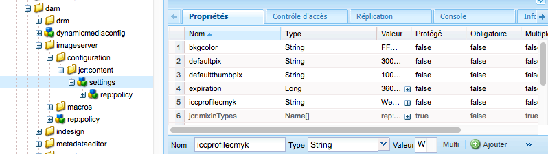

1. Add a color correction property by scrolling to the bottom of the **[!UICONTROL Properties]** tab and manually entering the property name, type, and value, which are described in the following tables. After you enter the values, tap **[!UICONTROL Add]** and then **[!UICONTROL Save All]** to save your values.

   Les propriétés de correction des couleurs sont répertoriées dans le tableau des **propriétés de correction des couleurs**. Les valeurs que vous pouvez attribuer à ces propriétés sont disponibles dans le tableau des **profils de couleurs**.

   For example, in **[!UICONTROL Name]**, add `iccprofilecmyk`, select **[!UICONTROL Type]** `String`, and add `WebCoated` as a **[!UICONTROL Value]**. Then tap **[!UICONTROL Add]** and then **[!UICONTROL Save All]** to save your values.

   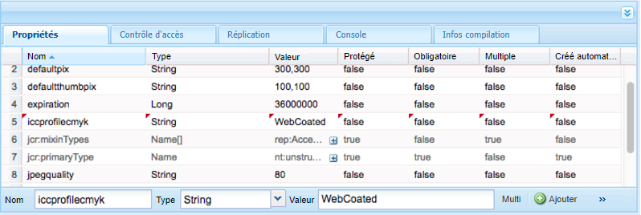

   **Tableau des propriétés de corrections des couleurs**

<table>
 <tbody>
  <tr>
   <td><strong>Propriétés</strong></td>
   <td><strong>Type</strong></td>
   <td><strong>Valeur par défaut</strong></td>
   <td><strong>Description</strong></td>
  </tr>
  <tr>
   <td><a href="https://marketing.adobe.com/resources/help/en_US/s7/is_ir_api/is_api/image_catalog/r_iccprofilergb.html">iccprofilergb</a></td>
   <td>Chaîne</td>
   <td>&lt;empty&gt;</td>
   <td>Nom du profil de couleurs RVB par défaut.</td>
  </tr>
  <tr>
   <td><a href="https://marketing.adobe.com/resources/help/en_US/s7/is_ir_api/is_api/image_catalog/r_iccprofilecmyk.html">iccprofilecmyk</a></td>
   <td>Chaîne</td>
   <td>&lt;empty&gt;</td>
   <td>Nom du profil de couleurs CMJN par défaut.</td>
  </tr>
  <tr>
   <td><a href="https://marketing.adobe.com/resources/help/en_US/s7/is_ir_api/is_api/image_catalog/r_iccprofilegray.html">iccprofilegray</a></td>
   <td>Chaîne</td>
   <td>&lt;empty&gt;</td>
   <td>Nom du profil de couleur gris par défaut.</td>
  </tr>
  <tr>
   <td><a href="https://marketing.adobe.com/resources/help/en_US/s7/is_ir_api/is_api/image_catalog/r_iccprofilesrcrgb.html">iccprofilesrcrgb</a></td>
   <td>Chaîne</td>
   <td>&lt;empty&gt;</td>
   <td>Nom du profil de couleurs RVB par défaut utilisé pour les images RVB sans profil de couleur incorporé</td>
  </tr>
  <tr>
   <td><a href="https://marketing.adobe.com/resources/help/en_US/s7/is_ir_api/is_api/image_catalog/r_iccprofilesrccmyk.html">iccprofilesrccmyk</a></td>
   <td>Chaîne</td>
   <td>&lt;empty&gt;</td>
   <td>Nom du profil de couleurs CMJN par défaut utilisé pour les images CMJN sans profil de couleurs incorporé.</td>
  </tr>
  <tr>
   <td><a href="https://marketing.adobe.com/resources/help/en_US/s7/is_ir_api/is_api/image_catalog/r_iccprofilesrcgray.html">iccprofilesrcgray</a></td>
   <td>Chaîne</td>
   <td>&lt;empty&gt;</td>
   <td>Nom du profil de couleurs gris par défaut utilisé pour les images CMJN qui n’ont pas de profil de couleurs incorporé.</td>
  </tr>
  <tr>
   <td><a href="https://marketing.adobe.com/resources/help/en_US/s7/is_ir_api/is_api/image_catalog/r_iccblackpointcompensation.html">compensation du point de blocage</a></td>
   <td>Booléen</td>
   <td>True</td>
   <td>Indique si la compensation des points noirs doit être effectuée lors de la correction des couleurs. Adobe recommande d’activer cette propriété.</td>
  </tr>
  <tr>
   <td><a href="https://marketing.adobe.com/resources/help/en_US/s7/is_ir_api/is_api/image_catalog/r_iccdither.html">iccdither</a></td>
   <td>Booléen</td>
   <td>False</td>
   <td>Indique si le tramage doit être effectué lors de la correction des couleurs.</td>
  </tr>
  <tr>
   <td><a href="https://marketing.adobe.com/resources/help/en_US/s7/is_ir_api/is_api/image_catalog/r_iccrenderintent.html">iccrenderintent</a></td>
   <td>Chaîne</td>
   <td>relative</td>
   <td><p>Indique le mode de rendu. Acceptable values are: <strong>perceptual, relative, saturation, absolute. </strong><i></i>Adobe recommande la <strong>valeur par défaut </strong><i></i>relative.</p> </td>
  </tr>
 </tbody>
</table>

>[!NOTE]
Les noms des propriétés sont sensibles à la casse et doivent être en minuscules.

**Tableau des profils de couleurs**

Les profils de couleurs installés sont les suivants :

<table>
 <tbody>
  <tr>
   <th><p>Name (Nom)</p> </th>
   <th><p>Espace colorimétrique</p> </th>
   <th><p>Description</p> </th>
  </tr>
  <tr>
   <td>AdobeRGB</td>
   <td>RVB</td>
   <td>Adobe RGB (1998)</td>
  </tr>
  <tr>
   <td>AppleRGB</td>
   <td>RVB</td>
   <td>Apple RGB</td>
  </tr>
  <tr>
   <td>CIERGB</td>
   <td>RVB</td>
   <td>CIE RGB</td>
  </tr>
  <tr>
   <td>CoatedFogra27</td>
   <td>CMJN</td>
   <td>FOGRA27 recouvert (ISO 12647-2:2004)</td>
  </tr>
  <tr>
   <td>CoatedFogra39</td>
   <td>CMJN</td>
   <td>FOGRA39 recouvert (ISO 12647-2:2004)</td>
  </tr>
  <tr>
   <td>CoatedGraCol</td>
   <td>CMJN</td>
   <td>GRACoL 2006 (ISO 12647-2:2004)</td>
  </tr>
  <tr>
   <td>ColorMatchRGB</td>
   <td>RVB</td>
   <td>ColorMatch RGB</td>
  </tr>
  <tr>
   <td>EuropeISOCoated</td>
   <td>CMJN</td>
   <td>Europe ISO Coated FOGRA27</td>
  </tr>
  <tr>
   <td>EuroscaleCoated</td>
   <td>CMJN</td>
   <td>Euroscale Coated v2</td>
  </tr>
  <tr>
   <td>EuroscaleNon couché</td>
   <td>CMJN</td>
   <td>Euroscale UnCouché v2</td>
  </tr>
  <tr>
   <td>JapanColorCoated</td>
   <td>CMJN</td>
   <td>Japan Color 2001 Coated</td>
  </tr>
  <tr>
   <td>JapanColorNewspaper</td>
   <td>CMJN</td>
   <td>Journal de Japan Color 2002</td>
  </tr>
  <tr>
   <td>JapanColorUnenduit</td>
   <td>CMJN</td>
   <td>Japan Color 2001 Unbedded</td>
  </tr>
  <tr>
   <td>JapanColorWebCoated</td>
   <td>CMJN</td>
   <td>Couleur du Japon 2003 - Web Coated</td>
  </tr>
  <tr>
   <td>JapanWebCoated</td>
   <td>CMJN</td>
   <td>Japon Web Coated (publicité)</td>
  </tr>
  <tr>
   <td>NewsprintSNAP2007</td>
   <td>CMJN</td>
   <td>Newsprint (SNAP 2007)</td>
  </tr>
  <tr>
   <td>NTSC</td>
   <td>RVB</td>
   <td>NTSC (1953)</td>
  </tr>
  <tr>
   <td>PAL</td>
   <td>RVB</td>
   <td>PAL/SECAM</td>
  </tr>
  <tr>
   <td>ProPhoto</td>
   <td>RVB</td>
   <td>ProPhoto RGB</td>
  </tr>
  <tr>
   <td>PS4Default</td>
   <td>CMJN</td>
   <td>Photoshop 4 CMJN par défaut</td>
  </tr>
  <tr>
   <td>PS5Default</td>
   <td>CMJN</td>
   <td>Photoshop 5 CMJN par défaut</td>
  </tr>
  <tr>
   <td>Feuillettré</td>
   <td>CMJN</td>
   <td>U.S. Sheetfed Coated v2</td>
  </tr>
  <tr>
   <td>FeuillesNon couché</td>
   <td>CMJN</td>
   <td>U.S. Sheetfed Non couché v2</td>
  </tr>
  <tr>
   <td>SMPTE</td>
   <td>RVB</td>
   <td>SMPTE-C</td>
  </tr>
  <tr>
   <td>sRVB</td>
   <td>RVB</td>
   <td>sRVB IEC61966-2.1</td>
  </tr>
  <tr>
   <td>UncoatedFogra29</td>
   <td>CMJN</td>
   <td>FOGRA29 non couché (ISO 12647-2:2004)</td>
  </tr>
  <tr>
   <td>WebCoated</td>
   <td>CMJN</td>
   <td>U.S. Web Coated (SWOP) v2</td>
  </tr>
  <tr>
   <td>WebCoatedFogra28</td>
   <td>CMJN</td>
   <td>Web Coated FOGRA28 (ISO 12647-2:2004)</td>
  </tr>
  <tr>
   <td>WebCoatedGrade3</td>
   <td>CMJN</td>
   <td>Papier de 3e année SWOP 2006 à revêtement Web</td>
  </tr>
  <tr>
   <td>WebCoatedGrade5</td>
   <td>CMJN</td>
   <td>Papier enrobé Web SWOP 2006 de classe 5</td>
  </tr>
  <tr>
   <td>WebUnCouché</td>
   <td>CMJN</td>
   <td>U.S. Web non couché v2</td>
  </tr>
  <tr>
   <td>WideGamutRGB</td>
   <td>RVB</td>
   <td>Gamme large RVB</td>
  </tr>
 </tbody>
</table>

1. Appuyez sur **[!UICONTROL Tout enregistrer]**.

For example, you could set the **[!UICONTROL iccprofilergb]** to `sRGB`, and **[!UICONTROL iccprofilecmyk]** to **[!UICONTROL WebCoated]**.

Cela aura les effets suivants :

* Active la correction des couleurs pour les images RVB et CMJN.
* Les images RVB qui n’ont pas de profil colorimétrique seront considérées comme se trouvant dans l’espace colorimétrique *sRVB*.
* Les images CMJN qui n’ont pas de profil colorimétrique seront considérées comme se trouvant dans l’espace colorimétrique *WebCoated*.
* Les rendus dynamiques qui renvoient une sortie RVB, la renverront dans l’espace colorimétrique *sRVB*.
* Les rendus dynamiques qui renvoient une sortie CMJN, la renverront dans l’espace colorimétrique *WebCoated*.

## Diffusion des ressources {#delivering-assets}

Une fois toutes les tâches ci-dessus terminées, les fichiers Dynamic Media activés sont diffusés à partir du service Image ou Vidéo. In AEM, this ability shows up in a **[!UICONTROL Copy Image URL]**, **[!UICONTROL Copy Viewer URL]**, **[!UICONTROL Embed Viewer Code]**, and in the WCM.

Reportez-vous à la section [Diffusion de ressources Dynamic Media](/help/assets/delivering-dynamic-media-assets.md).

<table>
 <tbody>
  <tr>
   <td><strong>Lorsque vous...</strong></td>
   <td><strong>Résultat</strong></td>
  </tr>
  <tr>
   <td>Copiez l’URL d’une image</td>
   <td><p>La boîte de dialogue Copier l’URL affiche une URL semblable à celle qui suit (l’URL est utilisée à des fins de démonstration uniquement) :</p> <p><code>https://IMAGESERVICEPUBLISHNODE/is/image/content/dam/path/to/Image.jpg?$preset$</code></p> <p>Où <code>IMAGESERVICEPUBLISHNODE</code> fait référence à l’URL du service d’images.</p> <p>Voir aussi <a href="/help/assets/delivering-dynamic-media-assets.md">Diffusion des ressources Dynamic Media</a>.</p> </td>
  </tr>
  <tr>
   <td>Copiez l’URL d’une visionneuse</td>
   <td><p>La boîte de dialogue Copier l’URL affiche une URL similaire à celle-ci (l’URL est utilisée à des fins de démonstration uniquement) :</p> <p><code>https://PUBLISHNODE/etc/dam/viewers/s7viewers/html5/BasicZoomViewer.html?asset=/content/dam/path/to/Image.jpg&amp;config=/conf/global/settings/dam/dm/presets/viewer/Zoom_dark&amp;serverUrl=https://IMAGESERVICEPUBLISHNODE/is/image/&amp;contentRoot=%2F</code></p> <p>Où <code>PUBLISHNODE</code> désigne le nœud de publication standard d’AEM et <code>IMAGESERVICEPUBLISHNODE</code> fait référence à l’URL du service d’images.</p> <p>Voir aussi <a href="/help/assets/delivering-dynamic-media-assets.md">Diffusion des ressources Dynamic Media</a>.</p> </td>
  </tr>
  <tr>
   <td>Copiez le code intégré d’une visionneuse</td>
   <td><p>La boîte de dialogue Copier le code incorporé affiche un fragment de code semblable à celui-ci (l’exemple de code est fourni à des fins de démonstration uniquement) :</p> <p><code class="code">&lt;style type="text/css"&gt;
       #s7basiczoom_div.s7basiczoomviewer{
       width:100%;
       height:auto;
       }
       &lt;/style&gt;
       &lt;script
       type="text/javascript" src="https://PUBLISHNODE/etc/dam/viewers/s7viewers/html5/js/BasicZoomViewer.js"&gt;&lt;/script&gt;
       &lt;div id="s7basiczoom_div"&gt;&lt;/div&gt;
       &lt;script type="text/javascript"&gt;
       var s7basiczoomviewer = new s7viewers.BasicZoomViewer({
       "containerId" : "s7basiczoom_div",
       "params" : {
       "serverurl" : "https://IMAGESERVICEPUBLISHNODE/is/image/",
       "contenturl" : "https://PUBLISHNODE/",
       "config" : "/conf/global/settings/dam/dm/presets/viewer/Zoom_dark",
       "asset" : "/content/dam/path/to/Image.jpg" }
       }).init();
       &lt;/script&gt;</code></p> <p>Où <code>PUBLISHNODE</code> désigne le nœud de publication standard d’AEM et <code>IMAGESERVICEPUBLISHNODE</code> fait référence à l’URL du service d’images.</p> <p>Voir aussi <a href="/help/assets/delivering-dynamic-media-assets.md">Diffusion des ressources Dynamic Media</a>.</p> </td>
  </tr>
 </tbody>
</table>

### Composants de médias interactifs et composants Dynamic Media de gestion de contenu web {#wcm-dynamic-media-and-interactive-media-components}

Les pages de gestion du contenu web qui mentionnent les composants de médias interactifs et Dynamic Media mentionnent également le service de diffusion de contenu.
