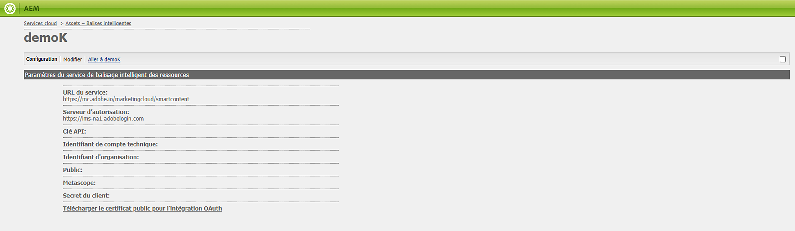

# Dépanner les balises intelligentes pour les informations d’identification OAuth {#oauth-config}

Une configuration d’autorisation ouverte est nécessaire pour adopter le consentement de l’application [!DNL Adobe Experience Manager] afin d’interagir avec les services de contenu dynamique de manière sécurisée.

>[!NOTE]
>
> Vous ne pourrez plus créer de nouvelles informations d’identification JWT à partir de juin 2024. Dorénavant, seules les informations d’identification OAuth de serveur à serveur seront créées.
> L’intégration JWT continue de fonctionner jusqu’en janvier 2025 uniquement pour les utilisateurs et utilisatrices AMS et On-Premise existants.

## Configuration OAuth pour les nouveaux utilisateurs et utilisatrices AMS {#oauth-config-existing-ams-users}

Reportez-vous à la section [configuration des services de contenu dynamique](#integrate-adobe-io) pour la configuration des services OAuth pour un nouvel utilisateur ou une nouvelle utilisatrice. Une fois terminé, suivez ces [étapes](#prereqs-config-oauth-onprem).

>[!NOTE]
>
>Si nécessaire, vous pouvez envoyer un ticket d’assistance après le [processus d’assistance](https://experienceleague.adobe.com/fr?lang=fr&amp;support-tab=home#support).

## Configuration OAuth pour les utilisateurs et utilisatrices AMS existants {#oauth-config-new-ams-users}

Avant d’exécuter l’une des étapes de cette méthodologie, vous devez mettre en œuvre les éléments suivants :

### Conditions préalables {#prereqs-config-oauth-onprem}

Une configuration OAuth requiert les conditions préalables suivantes :

* Créez une intégration OAuth dans [Developer Console](https://developer.adobe.com/console/user/servicesandapis). Utilisez les propriétés `ClientID`, `ClientSecret`, `OrgID` et autres dans les étapes ci-dessous :
* Les fichiers suivants se trouvent à ce chemin `/apps/system/config in crx/de` :
   * `com.adobe.granite.auth.oauth.accesstoken.provider.<randomnumbers>.config`
   * `com.adobe.granite.auth.ims.impl.IMSAccessTokenRequestCustomizerImpl.<randomnumber>.config`

### Configuration OAuth pour les utilisateurs et utilisatrices AMS et On-Premise existants {#steps-config-oauth-onprem}

Les étapes ci-dessous peuvent être effectuées par l’administrateur ou l’administratrice système dans **CRXDE**. Le client ou la cliente AMS peut contacter le représentant ou la représentante Adobe ou envoyer un ticket d’assistance après le [processus d’assistance](https://experienceleague.adobe.com/fr?lang=fr&amp;support-tab=home#support).

1. Ajoutez ou mettez à jour les propriétés ci-dessous dans `com.adobe.granite.auth.oauth.accesstoken.provider.<randomnumbers>.config` :

   * `auth.token.provider.authorization.grants="client_credentials"`
   * `auth.token.provider.orgId="<OrgID>"`
   * `auth.token.provider.default.claims=("\"iss\"\ :\ \"<OrgID>\"")`
   * `auth.token.provider.scope="read_pc.dma_smart_content,\ openid,\ AdobeID,\ additional_info.projectedProductContext"`
     `auth.token.validator.type="adobe-ims-similaritysearch"`
   * Mettez à jour `auth.token.provider.client.id` avec l’identifiant client de la nouvelle configuration OAuth.
   * Mettez à jour `auth.access.token.request` sur `"https://ims-na1.adobelogin.com/ims/token/v3"`.
1. Renommez le fichier en `com.adobe.granite.auth.oauth.accesstoken.provider-<randomnumber>.config`.

   >[!IMPORTANT]
   >
   >Remplacez le point (.) par le trait d’union (-) comme préfixe à `<randomnumber>`.

1. Suivez les étapes ci-dessous dans `com.adobe.granite.auth.ims.impl.IMSAccessTokenRequestCustomizerImpl.<randomnumber>.config` :
   * Mettez à jour la propriété auth.ims.client.secret avec le secret client de la nouvelle intégration OAuth.
   * Renommez ce fichier en `com.adobe.granite.auth.ims.impl.IMSAccessTokenRequestCustomizerImpl-<randomnumber>.config`.
1. Enregistrez toutes les modifications dans la console de développement du référentiel de contenu, par exemple, CRXDE.
<!--
1. Navigate to `/system/console/configMgr` and replace the OSGi configuration from `.<randomnumber>` to `-<randomnumber>`.
1. Delete the old OSGi configuration for `"Access Token provider name: adobe-ims-similaritysearch"` in `/system/console/configMgr`.
-->
1. Dans `System/console/configMgr`, vous pouvez voir à la fois les anciens et les nouveaux fichiers de configuration. Supprimez les anciennes configurations pour `com.adobe.granite.auth.ims.impl.IMSAccessTokenRequestCustomizerImpl` et le nom du fournisseur de jeton d’accès `adobe-ims-similaritysearch`. Assurez-vous que la configuration mise à jour uniquement est en place, plutôt que les anciennes configurations.
1. Redémarrez la console.

## Validation de la configuration {#validate-the-configuration}

Une fois la configuration terminée, vous pouvez utiliser un MBean JMX pour valider la configuration. Pour procéder à la validation, suivez ces étapes.

1. Accédez à votre serveur [!DNL Experience Manager] sur `https://[aem_server]:[port]`.

1. Accédez à **[!UICONTROL Outils]** > **[!UICONTROL Opérations]** > **[!UICONTROL Console Web]** pour ouvrir la console OSGi. Cliquez sur **[!UICONTROL Principal] > [!UICONTROL JMX]**.

1. Cliquez sur `com.day.cq.dam.similaritysearch.internal.impl`. Les **[!UICONTROL tâches relatives à SimilaritySearch]** s’ouvrent alors.

1. Cliquez sur `validateConfigs()`. Dans la boîte de dialogue **[!UICONTROL Valider les configurations]**, cliquez sur **[!UICONTROL Invoquer]**.

Le résultat de la validation s’affiche dans la même boîte de dialogue.

>[!NOTE]
>
>Si l’erreur `unsupported_grant_type` se produit, essayez d’installer le correctif Granite. Consultez [Migrer des informations d’identification du compte de service (JWT) vers les informations d’identification OAuth de serveur à serveur](https://experienceleague.adobe.com/fr/docs/experience-cloud-kcs/kbarticles/ka-24660).

## Intégration à la console Adobe Developer {#integrate-adobe-io}

Lors de l’intégration à Adobe Developer Console, le serveur [!DNL Experience Manager] authentifie vos informations d’identification de service auprès de la passerelle Adobe Developer Console avant de transférer votre demande au service de contenu dynamique. Pour l’intégration, vous avez besoin d’un compte Adobe ID disposant de droits d’administration pour l’organisation et d’une licence de service de contenu dynamique achetée et activée pour votre organisation.

Pour configurer le service de contenu dynamique, procédez comme suit :

<!---->

1. Pour générer une clé publique, [créez une configuration de service de contenu dynamique](#oauth-config) dans [!DNL Experience Manager]. [Téléchargez un certificat public](#oauth-config) pour l’intégration OAuth.

1. *[Non applicable si vous êtes un utilisateur existant ou une utilisatrice existante,]* [créez alors une intégration dans Adobe Developer Console](#create-adobe-i-o-integration).

1. [Configurez votre déploiement](#configure-smart-content-service) en utilisant la clé API et d’autres informations d’identification de la console Adobe Developer.

1. [Testez la configuration](#validate-the-configuration).

## Télécharger un certificat public en créant la configuration du service de contenu dynamique {#download-public-certificate}

Un certificat public permet d’authentifier votre profil sur Adobe Developer Console.

1. Dans l’interface utilisateur [!DNL Experience Manager], accédez à **[!UICONTROL Outils]** > **[!UICONTROL Services cloud]** > **[!UICONTROL Services cloud hérités]**.

1. Dans la page Services cloud, cliquez sur **[!UICONTROL Configurer maintenant]** sous **[!UICONTROL Ressources – Balises intelligentes]**.

1. Dans la boîte de dialogue **[!UICONTROL Créer une configuration]**, spécifiez un titre et un nom pour la configuration de balises intelligentes. Cliquez sur **[!UICONTROL Créer]**.

1. Dans la boîte de dialogue **[!UICONTROL Service de contenu dynamique AEM]**, utilisez les valeurs suivantes :

   **[!UICONTROL URL du service]** : `https://smartcontent.adobe.io/<region where your Experience Manager author instance is hosted>`

   Par exemple, `https://smartcontent.adobe.io/apac`. Vous pouvez indiquer `na`, `emea`, ou `apac` comme les régions où votre instance d’auteur Experience Manager est hébergée.

   >[!NOTE]
   >
   >Si le service géré Experience Manager est mis en service avant le 1er septembre 2022, utilisez l’URL de service suivante :
   >`https://mc.adobe.io/marketingcloud/smartcontent`

   **[!UICONTROL Serveur d’autorisation]** : `https://ims-na1.adobelogin.com`

   Laissez les autres champs vides pour l’instant (pour les remplir ultérieurement). Cliquez sur **[!UICONTROL OK]**.

   

   *Image : boîte de dialogue Service de contenu dynamique pour fournir une URL de service de contenu*

   >[!NOTE]
   >
   >L’URL fournie en tant qu’[!UICONTROL URL de service] n’est pas accessible via le navigateur et génère un message d’erreur 404. La configuration fonctionne correctement avec la même valeur que le paramètre [!UICONTROL URL de service]. Pour connaître le statut général du service et le planning de maintenance, consultez [https://status.adobe.com](https://status.adobe.com).

1. Cliquez sur **[!UICONTROL Télécharger le certificat public pour l’intégration OAuth]** et téléchargez le fichier de certificat public `AEM-SmartTags.crt`. De plus, vous n’avez plus l’obligation de charger ce certificat dans Adobe Developer Console.

   

   *Image : paramètres du service de balisage intelligent.*

## Création de l’intégration de la console Adobe Developer {#create-adobe-i-o-integration}

Pour utiliser les API de service de contenu dynamique, créez une intégration dans la console Adobe Developer afin d’obtenir la [!UICONTROL Clé API] (générée dans le champ [!UICONTROL ID CLIENT] de l’intégration de la console Adobe Developer), [!UICONTROL ID DE COMPTE TECHNIQUE], [!UICONTROL ID D’ORGANISATION] et [!UICONTROL SECRET CLIENT] pour les [!UICONTROL Paramètres du service de balisage intelligent des ressources] de la configuration cloud dans [!DNL Experience Manager].

1. Accédez à l’URL [https://developer.adobe.com/console](https://developer.adobe.com/console/) dans un navigateur. Sélectionnez le compte approprié et vérifiez que le rôle d’organisation associé est administrateur système.

1. Créez un projet portant le nom de votre choix. Cliquez sur **[!UICONTROL Add API]** (Ajouter une API).

1. Sur la page **[!UICONTROL Add API]**, sélectionnez **[!UICONTROL Experience Cloud]** puis **[!UICONTROL Smart Content]** (Contenu dynamique). Cliquez sur **[!UICONTROL Next]** (Suivant).

1. Choisissez la méthode d’authentification **[!UICONTROL OAuth de serveur à serveur]**.

1. Ajoutez/modifiez le **[!UICONTROL nom de l’information d’identification]** suivant les besoins. Cliquez sur **[!UICONTROL Suivant]**.

1. Sélectionnez le profil de produit **[!UICONTROL Services de contenu dynamique]**. Cliquez sur **[!UICONTROL Enregistrer l’API configurée]**. L’API OAuth est ajoutée sous les informations d’identification connectées pour une utilisation ultérieure. Vous pouvez copier la [!UICONTROL clé API (ID client)] ou [!UICONTROL Générer un jeton d’accès] à partir de celle-ci.
<!--
1. On the **[!UICONTROL Select product profiles]** page, select **[!UICONTROL Smart Content Services]**. Click **[!UICONTROL Save configured API]**.

   A page displays more information about the configuration. Keep this page open to copy and add these values in [!UICONTROL Assets Smart Tagging Service Settings] of cloud configuration in [!DNL Experience Manager] to configure smart tags.

   

   *Figure: Details of integration in Adobe Developer Console*
-->

*Illustration : configuration d’OAuth de serveur à serveur dans Adobe Developer Console*

## Configuration du service de contenu dynamique {#configure-smart-content-service}

Pour configurer l’intégration, utilisez les valeurs d’[!UICONTROL ID DE COMPTE TECHNIQUE], d’[!UICONTROL ID D’ORGANISATION], de [!UICONTROL SECRET CLIENT] et d’[!UICONTROL ID CLIENT] à partir de l’intégration de la console Adobe Developer. La création d’une configuration cloud de balises intelligentes permet d’authentifier les demandes d’API provenant du déploiement [!DNL Experience Manager].

1. [!DNL Experience Manager]Accédez à **[!UICONTROL Outils]** > **[!UICONTROL Services cloud]** > **[!UICONTROL Services cloud hérités]** pour ouvrir la console [!UICONTROL Services cloud].

1. Sous les **[!UICONTROL balises intelligentes des ressources]**, ouvrez la configuration créée ci-dessus. Sur la page des paramètres du service, cliquez sur **[!UICONTROL Modifier]**.

1. Dans la boîte de dialogue **[!UICONTROL Service de contenu dynamique AEM]**, utilisez les valeurs préremplies pour les champs **[!UICONTROL URL de service]** et **[!UICONTROL Serveur d’autorisation]**.

1. Pour les champs [!UICONTROL Clé Api], [!UICONTROL Identifiant du compte technique], [!UICONTROL ID d’organisation] et [!UICONTROL Secret du client], copiez et utilisez les valeurs suivantes générées dans [Intégration de la console Adobe Developer](#create-adobe-i-o-integration).

   | [!UICONTROL Paramètres du service de balisage intelligent des ressources] | Champs d’intégration d’[!DNL Adobe Developer Console] |
   |--- |--- |
   | [!UICONTROL Clé API] | [!UICONTROL ID CLIENT] |
   | [!UICONTROL Identifiant de compte technique] | [!UICONTROL ID DE COMPTE TECHNIQUE] |
   | [!UICONTROL Identifiant d’organisation] | [!UICONTROL ID D’ORGANISATION] |
   | [!UICONTROL Secret client] | [!UICONTROL SECRET CLIENT] |

>[!MORELIKETHIS]
>
>* [Vue d’ensemble et entraînement des balises intelligentes](enhanced-smart-tags.md)
>* [Configurer le balisage intelligent](config-smart-tagging.md)
>* [Tutoriel vidéo sur les balises intelligentes](https://experienceleague.adobe.com/docs/experience-manager-learn/assets/metadata/image-smart-tags.html?lang=fr)
