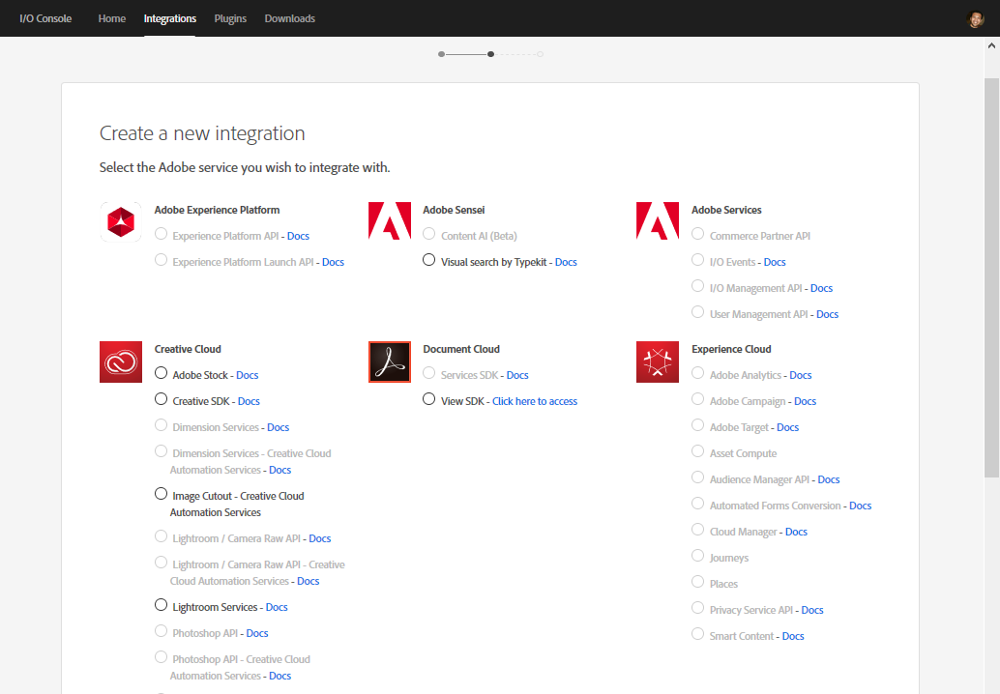

# Configure asset tagging using the Smart Content Service {#configure-asset-tagging-using-the-smart-content-service}

You can integrate [!DNL Adobe Experience Manager] with the Smart Content Service using Adobe I/O. Use this configuration to access the Smart Content Service from within [!DNL Experience Manager].

L’article détaille les tâches essentielles suivantes qui sont requises pour configurer le service de contenu dynamique. At the back end, the [!DNL Experience Manager] server authenticates your service credentials with the Adobe I/O gateway before forwarding your request to the Smart Content Service.

* Create a Smart Content Service configuration in [!DNL Experience Manager] to generate a public key. Obtention d’un certificat public pour l’intégration OAuth.
* Création d’une intégration dans Adobe I/O et téléchargement de la clé publique générée.
* Configure your [!DNL Experience Manager] instance using the API key and other credentials from Adobe I/O.
* Facultativement, activation du balisage automatique lors du téléchargement de ressources.

## Conditions préalables {#prerequisites}

Avant de pouvoir utiliser le service de contenu dynamique, assurez-vous de respecter les conditions suivantes pour créer une intégration sur Adobe I/O :

* L’organisation doit disposer d’un compte Adobe ID pourvu de droits d’administrateur.
* Le service de contenu dynamique est activé pour votre organisation.

## Obtention d’un certificat public {#obtain-public-certificate}

Un certificat public permet d’authentifier votre profil sur Adobe I/O.

1. Dans l’interface [!DNL Experience Manager] utilisateur, accédez à **[!UICONTROL Outils > Services]** Cloud > Services **** Cloud hérités.

1. In the Cloud Services page, click **[!UICONTROL Configure Now]** under **[!UICONTROL Assets Smart Tags]**.
1. Dans la boîte de dialogue **[!UICONTROL Créer une configuration]**, spécifiez un titre et un nom pour la configuration de balises intelligentes. Cliquez sur **[!UICONTROL Créer]**.
1. Dans la boîte de dialogue **[!UICONTROL Service de contenu dynamique AEM]**, utilisez les valeurs suivantes :

   **[!UICONTROL URL du service]**: `https://mc.adobe.io/marketingcloud/smartcontent`

   **[!UICONTROL Serveur d’autorisation]**: `https://ims-na1.adobelogin.com`

   Laissez les autres champs vides pour l’instant (pour les remplir ultérieurement). Cliquez sur **[!UICONTROL OK]**.

   

1. Click **[!UICONTROL Download Public Certificate for OAuth Integration]**, and download the public certificate file `AEM-SmartTags.crt`.

   

### Reconfigure when a certificate expires {#certrenew}

Lorsque le certificat expire, il n’est plus approuvé. Pour ajouter un nouveau certificat, procédez comme suit. Vous ne pouvez pas renouveler un certificat arrivé à expiration.

1. Log in your [!DNL Experience Manager] deployment as an administrator. Cliquez sur **[!UICONTROL Outils]** > **[!UICONTROL Sécurité]** > **[!UICONTROL Utilisateurs]**.

1. Recherchez et cliquez sur l’utilisateur **[!UICONTROL dam-update-service]** . Cliquez sur l’onglet **[!UICONTROL KeyStore]**.
1. Supprimez le fichier de stockage de clés **[!UICONTROL similaritysearch]** existant avec le certificat arrivé à expiration. Cliquez sur **[!UICONTROL Enregistrer et fermer]**.

   

   Suppression d’une entrée similaritysearch existante dans Keystore pour ajouter un nouveau certificat de sécurité

1. Accédez à **[!UICONTROL Outils]** > **[!UICONTROL Cloud Services]** > **[!UICONTROL Ancienne version de Cloud Services]**. Cliquez sur **[!UICONTROL Balises dynamiques de ressources]** > **[!UICONTROL Afficher la configuration]** > **[!UICONTROL Configurations disponibles]**. Cliquez sur la configuration requise.

1. Pour télécharger un certificat public, cliquez sur **[!UICONTROL Télécharger le certificat public pour l’intégration Oauth]**.
1. Accédez à [https://console.adobe.io](https://console.adobe.io) et accédez aux services de contenu intelligent existants sur la page **[!UICONTROL Intégrations]**. Téléchargez le nouveau certificat. Pour plus d’informations, reportez-vous aux instructions de la section [Création de l’intégration Adobe I/O](#create-adobe-i-o-integration).

## Créer l’intégration Adobe I/O {#create-adobe-i-o-integration}

Pour utiliser les API du service de contenu dynamique, créez une intégration dans Adobe I/O afin de générer une clé API, un identifiant de compte technique, un identifiant d’organisation et un secret de client.

1. Accédez à [https://console.adobe.io](https://console.adobe.io/).
1. Dans la page **[!UICONTROL Intégrations]** , sélectionnez le compte approprié et vérifiez que le rôle d’organisation associé est administrateur système.
1. Click **[!UICONTROL New integration]**.
1. Sur la page **[!UICONTROL Créer une intégration]**, sélectionnez **[!UICONTROL Accéder à une API]**. Cliquez sur **[!UICONTROL Continuer]**.
1. Sous **[!UICONTROL Experience Cloud]**, sélectionnez **[!UICONTROL Contenu intelligent]**. Cliquez sur **[!UICONTROL Continuer]**.

   

1. Sur la page suivante, sélectionnez **[!UICONTROL Nouvelle intégration]**. Cliquez sur **[!UICONTROL Continuer]**.
1. Sur la page **[!UICONTROL Informations concernant l’intégration]**, indiquez un nom pour la passerelle d’intégration et ajoutez une description.
1. Dans **[!UICONTROL Certificats de clés publiques]**, chargez le fichier `AEM-SmartTags.crt` que vous avez téléchargé ci-dessus.
1. Click **[!UICONTROL Create Integration]**.
1. To view the integration information, click **[!UICONTROL Continue to integration details]**.

   

## Configuration du service de contenu dynamique {#configure-smart-content-service}

Pour configurer l’intégration, utilisez les valeurs des champs Identifiant de compte technique, Identifiant d’organisation, Secret du client, Serveur d’autorisation et Clé API de l’intégration Adobe I/O. Creating a Smart Tags cloud configuration allows authentication of API requests from the [!DNL Experience Manager] instance.

1. In [!DNL Experience Manager], navigate to **[!UICONTROL Tools > Cloud Service > Legacy Cloud Services]** to open the [!UICONTROL Cloud Services] console.
1. Sous **[!UICONTROL Ressources – Balises intelligentes]**, ouvrez la configuration créée ci-dessus. Sur la page de paramètres du service, cliquez sur **[!UICONTROL Modifier]**.
1. Dans la boîte de dialogue **[!UICONTROL Service de contenu dynamique AEM]**, utilisez les valeurs préremplies pour les champs **[!UICONTROL URL de service]** et **[!UICONTROL Serveur d’autorisation]**.
1. Pour les champs **[!UICONTROL Clé API]**, **[!UICONTROL ID de compte technique]**, **[!UICONTROL ID d’organisation]** et **[!UICONTROL Client secret]**, utilisez les valeurs générées ci-dessus.

## Valider la configuration {#validate-the-configuration}

Une fois la configuration terminée, vous pouvez utiliser un MBean JMX pour valider la configuration. Pour procéder à la validation, suivez ces étapes.

1. Accédez à votre [!DNL Experience Manager] serveur à `https://[aem_server]:[port]`.

1. Accédez à **[!UICONTROL Outils > Opérations > Console Web]** pour ouvrir la console OSGi. Cliquez sur **[!UICONTROL Principal > JMX]**.
1. Cliquez sur **[!UICONTROL com.day.cq.dam.similaritysearch.internal.impl]**. Les **[!UICONTROL tâches relatives à SimilaritySearch]** s’ouvrent alors.
1. Cliquez sur **[!UICONTROL validateConfigs()]**. In the **[!UICONTROL Validate Configurations]** dialog, click **[!UICONTROL Invoke]**.

   Le résultat de la validation s’affiche dans la même boîte de dialogue.

## Activation du balisage intelligent dans le workflow Mettre à jour la ressource (facultatif) {#enable-smart-tagging-in-the-update-asset-workflow-optional}

1. Dans [!DNL Experience Manager]Outils > **[!UICONTROL Processus > Modèles]**.
1. Sur la page **[!UICONTROL Modèles de processus]**, sélectionnez le modèle de processus **[!UICONTROL Ressources de mise à jour de DAM]**.
1. Click **[!UICONTROL Edit]** from the toolbar.
1. Développez le panneau latéral pour afficher les étapes. Faites glisser l’étape **[!UICONTROL Balisage intelligent de la ressource]** disponible dans la section Processus de DAM (gestion des actifs numériques) et placez-la après l’étape **[!UICONTROL Traiter les miniatures]**.

   ![[!UICONTROL Ajouter l’étape Balisage intelligent de la ressource après l’étape Miniature des processus dans le processus Ressources de mise à jour de gestion des actifs numériques.]](assets/chlimage_1-105.png)

   *Figure : Ajouter étape de la ressource de balise intelligente après l’étape de miniature du processus dans le flux de travaux[!UICONTROL DAM Update Asset].*

1. Ouvrez l’étape en mode édition. Sous **[!UICONTROL Paramètres avancés]**, vérifiez que l’option **[!UICONTROL Avance du gestionnaire]** est sélectionnée.

   

1. Dans l’onglet **[!UICONTROL Arguments]**, sélectionnez **[!UICONTROL Ignorer les erreurs]** si vous souhaitez que le processus se termine même si l’étape de balisage automatique échoue.

   

   Pour baliser les ressources lors de leur chargement, que le balisage intelligent soit activé ou non dans les dossiers, cochez la case **[!UICONTROL Ignorer l’indicateur de balise intelligente]**.

   

1. Click **[!UICONTROL OK]** to close the process step, and then save the workflow.

>[!MORELIKETHIS]
>
>* [Gestion des balises actives](managing-smart-tags.md)
>* [Présentation et formation des balises actives](enhanced-smart-tags.md)
>* [Instructions et règles de formation de Smart Content Service](smart-tags-training-guidelines.md)
>* [Didacticiel vidéo sur la configuration des balises actives](https://docs.adobe.com/content/help/en/experience-manager-learn/assets/metadata/smart-tags-technical-video-setup.html)

