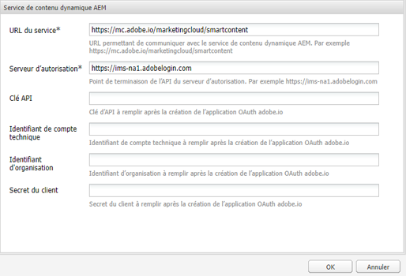
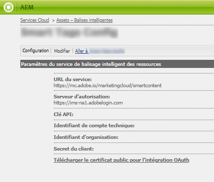
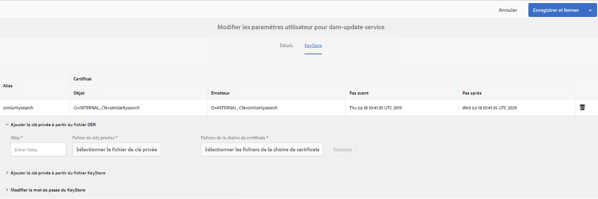
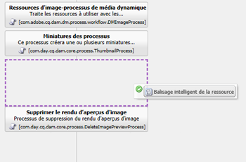
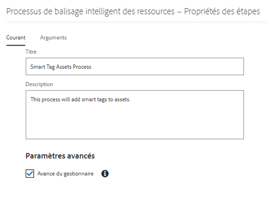
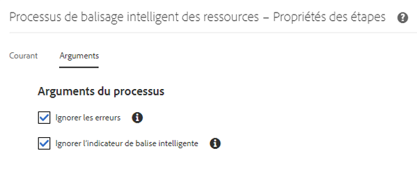
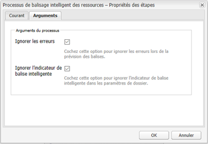
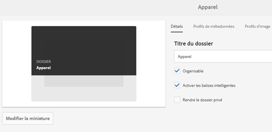

# Préparation [!DNL Assets] au balisage intelligent {#configure-asset-tagging-using-the-smart-content-service}

Avant de pouvoir début le balisage de vos ressources à l’aide de Smart Content Services, intégrez-les [!DNL Experience ManageR Assets] à Adobe Developer Console afin de tirer parti du service intelligent de [!DNL Adobe Sensei]. Une fois configuré, le service est formé à l’aide de quelques images et d’une balise.

Avant d’utiliser Smart Content Service, vérifiez les points suivants :

* [Intégration à Adobe Developer Console](#integrate-adobe-io).
* [Formation de Smart Content Service](#training-the-smart-content-service).

   <!-- TBD: This link will update soon after the new articles goes live on docs.adobe.com. Change it when new URL is available.
  -->

* Installez le dernier Service Pack [du](https://experienceleague.adobe.com/docs/experience-manager-release-information/aem-release-updates/aem-releases-updates.html)Experience Manager.

## Intégration à Adobe Developer Console {#integrate-adobe-io}

Lorsque vous effectuez une intégration avec Adobe Developer Console, le [!DNL Experience Manager] serveur authentifie vos informations d’identification de service auprès de la passerelle Adobe Developer Console avant de transmettre votre demande à Smart Content Service. Pour intégrer votre entreprise, vous devez disposer d’un compte Adobe ID doté de droits d’administrateur pour l’entreprise et d’une licence Smart Content Service achetée et activée pour celle-ci.

Pour configurer Smart Content Service, procédez comme suit :

1. [Création d’une configuration de service de contenu dynamique dans pour générer une clé publique. ](#obtain-public-certificate)[!DNL Experience Manager] [Obtenez un certificat public](#obtain-public-certificate) pour l’intégration d’OAuth.

1. [Créez une intégration dans Adobe Developer Console](#create-adobe-i-o-integration) et chargez la clé publique générée.

1. [Configurez votre déploiement](#configure-smart-content-service) à l’aide de la clé d’API et d’autres informations d’identification d’Adobe Developer Console.

1. [Testez la configuration](#validate-the-configuration).

1. Optionally, [enable auto-tagging on asset upload](#enable-smart-tagging-in-the-update-asset-workflow-optional).

### Création d’une configuration de Smart Content Service pour obtenir un certificat public {#obtain-public-certificate}

Un certificat public permet d’authentifier votre profil sur Adobe Developer Console.

1. Dans l’interface [!DNL Experience Manager] utilisateur, accédez à **[!UICONTROL Outils]** > **[!UICONTROL Cloud Services]** > Cloud Services **** hérités.

1. In the Cloud Services page, click **[!UICONTROL Configure Now]** under **[!UICONTROL Assets Smart Tags]**.

1. Dans la boîte de dialogue **[!UICONTROL Créer une configuration]**, spécifiez un titre et un nom pour la configuration de balises intelligentes. Cliquez sur **[!UICONTROL Créer]**.

1. Dans la boîte de dialogue **[!UICONTROL Service de contenu dynamique AEM]**, utilisez les valeurs suivantes :

   **[!UICONTROL URL du service]**: `https://mc.adobe.io/marketingcloud/smartcontent`

   **[!UICONTROL Serveur d’autorisation]**: `https://ims-na1.adobelogin.com`

   Laissez les autres champs vides pour l’instant (pour les remplir ultérieurement). Cliquez sur **[!UICONTROL OK]**.

   

   *Figure : Boîte de dialogue de Smart Content Service permettant de fournir l’URL du service de contenu*

   >[!NOTE]
   >
   >The URL provided as [!UICONTROL Service URL] is not accessible via browser and generates a 404 error. La configuration fonctionne correctement avec la même valeur que le paramètre URL  de service. Pour connaître l’état général du service et le calendrier de maintenance, voir [https://status.adobe.com](https://status.adobe.com).

1. Click **[!UICONTROL Download Public Certificate for OAuth Integration]**, and download the public certificate file `AEM-SmartTags.crt`.

   

   *Figure : Paramètres du service de balisage intelligent*

#### Reconfigure when a certificate expires {#certrenew}

Une fois qu’un certificat expire, il n’est plus approuvé. Vous ne pouvez pas renouveler un certificat ayant expiré. Pour ajouter un nouveau certificat, procédez comme suit.

1. Connectez-vous en tant qu’administrateur à votre déploiement [!DNL Experience Manager]. Cliquez sur **[!UICONTROL Outils]** > **[!UICONTROL Sécurité]** > **[!UICONTROL Utilisateurs]**.

1. Recherchez et cliquez sur l’utilisateur **[!UICONTROL dam-update-service]**. Cliquez sur l’onglet **[!UICONTROL KeyStore]**.

1. Supprimez le fichier de stockage de clés **[!UICONTROL similaritysearch]** existant avec le certificat arrivé à expiration. Cliquez sur **[!UICONTROL Enregistrer et fermer]**.

   

   *Figure : Suppression d’une entrée existante`similaritysearch` dans le Keystore pour ajouter un nouveau certificat de sécurité.*

1. Accédez à **[!UICONTROL Outils]** > **[!UICONTROL Cloud Services]** > **[!UICONTROL Ancienne version de Cloud Services]**. Cliquez sur **[!UICONTROL Balises dynamiques de ressources]** > **[!UICONTROL Afficher la configuration]** > **[!UICONTROL Configurations disponibles]**. Cliquez sur la configuration requise.

1. Pour télécharger un certificat public, cliquez sur **[!UICONTROL Télécharger le certificat public pour l’intégration Oauth]**.

1. Accédez à [https://console.adobe.io](https://console.adobe.io) et accédez aux services de contenu intelligent existants sur la page **[!UICONTROL Intégrations]**. Téléchargez le nouveau certificat. For more information, see the instructions in [Create Adobe Developer Console integration](#create-adobe-i-o-integration).

### Intégration de la Console développeur de création d’Adobes {#create-adobe-i-o-integration}

Pour utiliser les API de Smart Content Service, créez une intégration dans Adobe Developer Console afin d’obtenir la clé [!UICONTROL d’] API (générée dans le champ ID  CLIENT de l’intégration d’Adobe Developer Console), l’ID [!UICONTROL DE COMPTE][!UICONTROL TECHNIQUE, l’ID D’ORGANISATION et CLIENT SECRET pour les paramètresService de balisage intelligentAssets de la configuration de cloud dans le cloud.][!DNL Experience Manager]

1. Accédez à l’URL [https://console.adobe.io](https://console.adobe.io/) dans un navigateur. Sélectionnez le compte approprié et vérifiez que le rôle d’organisation associé est administrateur système.

1. Créez un projet portant le nom de votre choix. Cliquez sur **[!UICONTROL Add API]** (Ajouter une API).

1. Sur la page **[!UICONTROL Add API]**, sélectionnez **[!UICONTROL Experience Cloud]** puis **[!UICONTROL Smart Content]** (Contenu dynamique). Cliquez sur **[!UICONTROL Next]** (Suivant).

1. Sélectionnez **[!UICONTROL Upload your public key]** (Charger votre clé publique). Fournissez le fichier de certificat téléchargé depuis [!DNL Experience Manager]. Le message [!UICONTROL Public key(s) uploaded successfully] (La ou les clés publiques ont été chargées) s’affiche. Cliquez sur **[!UICONTROL Next]** (Suivant).

   La page [!UICONTROL Create a new Service Account (JWT) credential] (Créer des informations d’identification de compte de service (JWT)) affiche la clé publique du compte de service qui vient d’être configuré.

1. Cliquez sur **[!UICONTROL Next]** (Suivant).

1. Dans la page **[!UICONTROL Select product profiles]** (Sélectionner les profils de produits), sélectionnez **[!UICONTROL Smart Content Services]** (Services de contenu dynamique). Cliquez sur **[!UICONTROL Save configured API]** (Enregistrer l’API configurée). 

   Une page affiche davantage d’informations sur la configuration. Conservez cette page ouverte pour copier et ajouter ces valeurs dans les Paramètres [!UICONTROL du service de balisage intelligent] Assets de la configuration du cloud [!DNL Experience Manager] afin de configurer les balises actives.

   

   *Figure : Détails de l&#39;intégration dans la Console développeur d&#39;Adobes*

### Configuration du service de contenu dynamique {#configure-smart-content-service}

Pour configurer l’intégration, utilisez les valeurs des champs ID [!UICONTROL DE COMPTE]TECHNIQUE, ID D’ORGANISATION, SECRET CLIENT et ID [!UICONTROL CLIENT dans l’intégration de la Console développeur d’Adobes. ] Creating a Smart Tags cloud configuration allows authentication of API requests from the [!DNL Experience Manager] deployment.

1. In [!DNL Experience Manager], navigate to **[!UICONTROL Tools]** > **[!UICONTROL Cloud Service]** > **[!UICONTROL Legacy Cloud Services]** to open the [!UICONTROL Cloud Services] console.

1. Sous **[!UICONTROL Ressources – Balises intelligentes]**, ouvrez la configuration créée ci-dessus. Sur la page de paramètres du service, cliquez sur **[!UICONTROL Modifier]**.

1. Dans la boîte de dialogue **[!UICONTROL Service de contenu dynamique AEM]**, utilisez les valeurs préremplies pour les champs **[!UICONTROL URL de service]** et **[!UICONTROL Serveur d’autorisation]**.

1. Pour les champs Clé d’API, ID [!UICONTROL de compte]technique, ID [!UICONTROL d’]organisation et Secret du [!UICONTROL client, copiez et utilisez les valeurs suivantes générées dans Intégration de la Console développeur d’Adobes.]

   | [!UICONTROL Paramètres du service de balisage intelligent des ressources] | [!DNL Adobe Developer Console] Champs d’intégration |
   |--- |--- |
   | [!UICONTROL Clé API] | [!UICONTROL ID CLIENT] |
   | [!UICONTROL Identifiant de compte technique] | [!UICONTROL ID DE COMPTE TECHNIQUE] |
   | [!UICONTROL Identifiant d&#39;organisation] | [!UICONTROL ID D’ORGANISATION] |
   | [!UICONTROL Secret client] | [!UICONTROL SECRET CLIENT] |

### Validation de la configuration {#validate-the-configuration}

Une fois la configuration terminée, vous pouvez utiliser un MBean JMX pour valider la configuration. Pour procéder à la validation, suivez ces étapes.

1. Accédez à votre [!DNL Experience Manager] serveur à `https://[aem_server]:[port]`.

1. Go to **[!UICONTROL Tools]** > **[!UICONTROL Operations]** > **[!UICONTROL Web Console]** to open the OSGi console. Click **[!UICONTROL Main] > [!UICONTROL JMX]**.

1. Cliquez sur `com.day.cq.dam.similaritysearch.internal.impl`. It opens **[!UICONTROL SimilaritySearch Miscellaneous Tasks]**.

1. Cliquez sur `validateConfigs()`. In the **[!UICONTROL Validate Configurations]** dialog, click **[!UICONTROL Invoke]**.

Les résultats de la validation s’affichent dans la même boîte de dialogue.

### Enable smart tagging in the [!UICONTROL DAM Update Asset] workflow (Optional) {#enable-smart-tagging-in-the-update-asset-workflow-optional}

1. In [!DNL Experience Manager], go to **[!UICONTROL Tools]** > **[!UICONTROL Workflow]** > **[!UICONTROL Models]**.

1. Sur la page **[!UICONTROL Modèles de processus]**, sélectionnez le modèle de processus **[!UICONTROL Ressources de mise à jour de gestion des actifs numériques]**.

1. Cliquez sur **[!UICONTROL Modifier]** dans la barre d’outils.

1. Développez le panneau latéral pour afficher les étapes. Faites glisser l’étape **[!UICONTROL Balisage intelligent de la ressource]** disponible dans la section Processus de DAM (gestion des actifs numériques) et placez-la après l’étape **[!UICONTROL Miniatures des processus]**.

   

   *Figure : Ajout de l’étape Balisage intelligent de la ressource après l’étape Miniatures des processus dans le processus Ressources de mise à jour de gestion des actifs numériques.*

1. Ouvrez l’étape en mode édition. Dans **[!UICONTROL Paramètres avancés]**, vérifiez que l’option **[!UICONTROL Avance du gestionnaire]** est sélectionnée.

   

   *Figure : Configurer le processus de mise à jour des actifs DAM et ajouter une étape de balise active*

1. Dans l’onglet **[!UICONTROL Arguments]**, sélectionnez **[!UICONTROL Ignorer les erreurs]** si vous souhaitez que le processus se termine même si l’étape de balisage automatique échoue.

   

   *Figure : Configurez le processus de mise à jour des actifs de gestion des actifs numériques pour ajouter l’étape de balise active et sélectionner l’avance du gestionnaire.*

   Pour baliser les ressources lors de leur chargement, et ce, que le balisage intelligent soit activé ou non dans les dossiers, cochez la case **[!UICONTROL Ignorer l’indicateur de balise intelligente]**.

   

   *Figure : Configurez le processus de mise à jour de la gestion des actifs numériques pour ajouter une étape de balise active et sélectionnez ignorer l’indicateur de balise active.*

1. Cliquez sur **[!UICONTROL OK]** pour fermer l’étape du processus, puis enregistrez ce dernier.

## Formation de Smart Content Service {#training-the-smart-content-service}

Pour que le service de contenu dynamique reconnaisse votre taxonomie métier, exécutez-la sur une série de ressources qui incluent déjà des balises correspondant à votre entreprise. Pour marquer efficacement vos images de marque, Smart Content Service exige que les images de formation soient conformes à certaines directives. Après l’entraînement, le service peut appliquer la même taxonomie sur un ensemble de ressources similaire.

Vous pouvez entraîner plusieurs fois le service afin d’améliorer sa capacité à appliquer les balises appropriées. Après chaque cycle d’entraînement, exécutez un workflow de balisage et vérifiez que vos ressources sont correctement balisées.

Vous pouvez entraîner le service de contenu dynamique périodiquement ou en fonction des besoins.

>[!NOTE]
>
>Le workflow d’entraînement s’exécute sur les dossiers uniquement.

### Instructions d’entraînement {#guidelines-for-training}

Pour un résultat optimal, les images de votre corpus d’entraînement doivent respecter les instructions suivantes :

**Quantité et taille :** minimum 30 images par balise. Minimum 500 pixels sur le côté le plus long.

**Cohérence** : les images associées à une même balise doivent être visuellement similaires.

Par exemple, il est déconseillé d’incorporer une balise `my-party` pour toutes ces images (en situation d’entraînement), car elles ne sont pas similaires visuellement.

**Couverture** : les images d’entraînement doivent être suffisamment variées. L&#39;idée est de fournir quelques exemples, mais raisonnablement variés, pour que le Experience Manager apprenne à se concentrer sur les bonnes choses. Si vous appliquez la même balise sur des images visuellement différentes, incluez au moins cinq exemples de chaque type.

Par exemple, pour la balise *mannequin-pose-tête-baissée*, incluez davantage d’images d’entraînement similaires à l’image mise en évidence ci-dessous pour que le service reconnaisse les images similaires avec plus de précision lors du balisage.

**Distraction/obstruction** : l’entraînement du service donne de meilleurs résultats sur les images qui ont moins de distractions (telles que des arrière-plans importants ou des objets/personnes sans lien avec le sujet principal).

Par exemple, pour la balise *chaussure-décontractée*, la seconde image n’est pas un bon candidat pour l’entraînement.

**Complétude :** si une image est admissible pour plusieurs balises, ajoutez toutes les balises applicables avant d’inclure l’image à des fins de formation. Par exemple, pour les balises telles que `raincoat` et `model-side-view`, ajoutez les deux balises sur la ressource éligible avant de l’inclure pour la formation.

>[!NOTE]
>
>La capacité du service de contenu dynamique à s’entraîner à partir de vos balises et à les appliquer à d’autres images dépend de la qualité des images que vous utilisez pour l’entraînement. Pour obtenir des résultats optimaux, Adobe recommande d’utiliser des images visuellement similaires afin d’entraîner le service pour chaque balise.

### Entraînement périodique {#periodic-training}

Vous pouvez activer le service de contenu dynamique afin qu’il s’entraîne périodiquement sur les ressources et les balises associées au sein d’un dossier. Open the [!UICONTROL Properties] page of your asset folder, select **[!UICONTROL Enable Smart Tags]** under the **[!UICONTROL Details]** tab, and save the changes.

Once this option is selected for a folder, [!DNL Experience Manager] runs a training workflow automatically to train the Smart Content Service on the folder assets and their tags. Par défaut, le workflow d’entraînement s’exécute sur une base hebdomadaire à 0 h 30 le samedi.

### Entraînement à la demande {#on-demand-training}

Vous pouvez entraîner le service de contenu dynamique chaque fois que cela est nécessaire à partir de la console Processus.

1. In [!DNL Experience Manager] interface, go to **[!UICONTROL Tools]** > **[!UICONTROL Workflow]** > **[!UICONTROL Models]**.
1. From the **[!UICONTROL Workflow Models]** page, select the **[!UICONTROL Smart Tags Training]** workflow and then click **[!UICONTROL Start Workflow]** from the toolbar.
1. Dans la boîte de dialogue **[!UICONTROL Exécuter le processus]**, localisez le dossier de charge utile qui comprend les ressources balisées pour entraîner le service.
1. Indiquez le titre du workflow et ajoutez un commentaire. Then, click **[!UICONTROL Run]**. Les ressources et les balises sont soumises à l’entraînement.

   

>[!NOTE]
>
>Une fois que les ressources d’un dossier sont traitées pour la formation, seules les ressources modifiées sont traitées au cours des cycles de formation suivants.

### Rapports de formation vue {#viewing-training-reports}

Pour vérifier que le service de contenu dynamique est entraîné sur vos balises dans la série de ressources d’entraînement, examinez le rapport de workflow d’entraînement dans la console Rapports.

1. In [!DNL Experience Manager] interface, go to **[!UICONTROL Tools]** > **[!UICONTROL Assets]** > **[!UICONTROL Reports]**.
1. Dans la page **[!UICONTROL Rapports de ressources]**, cliquez sur **[!UICONTROL Créer]**.
1. Sélectionnez le rapport **[!UICONTROL Entraînement des balises intelligentes]**, puis cliquez sur **[!UICONTROL Suivant]** dans la barre d’outils.
1. Indiquez un titre et une description pour le rapport. Sous **[!UICONTROL Planifier le rapport]**, laissez l’option **[!UICONTROL Maintenant]** sélectionnée. Si vous souhaitez planifier le rapport pour une date ultérieure, sélectionnez **[!UICONTROL Plus tard]** et spécifiez une date et une heure. Ensuite, cliquez sur **[!UICONTROL Créer]** dans la barre d’outils.
1. Dans la page **[!UICONTROL Rapports de ressources]**, sélectionnez le rapport que vous avez généré. Pour afficher le rapport, cliquez sur **[!UICONTROL Afficher]** dans la barre d’outils.
1. Passez en revue les détails du rapport.

   Le rapport affiche l’état d’identification des balises que vous avez entraînées. La couleur verte de la colonne **[!UICONTROL État de l’entraînement]** indique que le service de contenu dynamique est entraîné pour la balise. La couleur jaune indique que le service n’est pas complètement entraîné pour une balise particulière. Dans ce cas, ajoutez d’autres images avec la balise particulière et exécutez le processus d’entraînement pour l’entraînement complet du service sur la balise.

   Si vous ne voyez pas vos balises dans ce rapport, lancez à nouveau le workflow d’entraînement pour ces balises.

1. Pour télécharger le rapport, sélectionnez-le dans la liste, puis cliquez sur **[!UICONTROL Télécharger]** dans la barre d’outils. Le rapport est téléchargé sous la forme d’une feuille de calcul Microsoft Excel.

## Restrictions {#limitations}

* Les balises actives améliorées reposent sur les modèles d’apprentissage des images et de leurs balises. Ces modèles ne sont pas toujours parfaits pour identifier les balises. La version actuelle du service de contenu dynamique présente les limites suivantes :

   * Impossibilité d’identifier des différences subtiles dans les images. Par exemple, des chemises coupe droite ou ajustée.
   * Impossibilité d’identifier des balises basées sur des motifs/éléments minuscules d’une image. Par exemple, des logos sur des T-shirts.
   * Tagging is supported in the locales that [!DNL Experience Manager] is supported in. Pour obtenir la liste des langues, voir [Notes de mise à jour du service de contenu dynamique](https://experienceleague.adobe.com/docs/experience-manager-64/release-notes/smart-content-service-release-notes.html).

* To search for assets with smart tags (regular or enhanced), use the [!DNL Assets] Omnisearch (full-text search). Il n’y a aucun prédicat de recherche distinct pour les balises intelligentes.

>[!MORELIKETHIS]
>
>* [Présentation et formation des balises actives](enhanced-smart-tags.md)
>* [Didacticiel vidéo sur les balises actives](https://experienceleague.adobe.com/docs/experience-manager-learn/assets/metadata/image-smart-tags.html)

