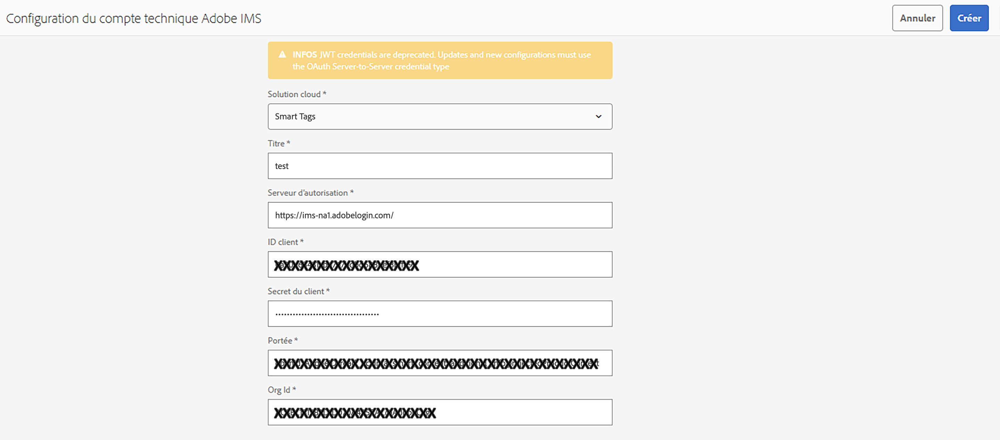
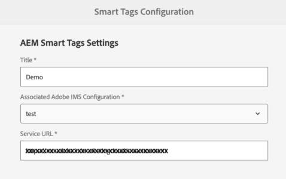

# Préparation de [!DNL Assets] pour le balisage intelligent {#configure-asset-tagging-using-the-smart-content-service}

Avant de commencer à baliser vos ressources à l’aide des services de contenu dynamique, intégrez [!DNL Experience Manager Assets] à l’Adobe Developer Console pour tirer parti du service dynamique d’[!DNL Adobe Sensei]. Une fois configuré, entraînez le service à l’aide de quelques images et d’une balise.

<!--
>[!NOTE]
>
>* Smart Content Services is no longer available to new [!DNL Experience Manager Assets] On-Premise customers. Existing On-Premise customers, who already have this capability enabled, can continue using Smart Content Services.
>* Smart Content Services is available for existing [!DNL Experience Manager Assets] Managed Services customers, who already have this capability enabled.
>* New Experience Manager Assets Managed Services customers can follow the instructions mentioned in this article to set up Smart Content Services.
>* For Service Pack 20 and older, you need to perform the workaround steps for SCS to support Oauth integration. See [Troubleshooting smart tags for OAuth credentials](config-oauth.md).
>* To support the Oauth integration on Service Pack 21, you need to install the [Hotfix for SP 21](https://experience.adobe.com/#/downloads/content/software-distribution/en/aem.html?package=%2Fcontent%2Fsoftware-distribution%2Fen%2Fdetails.html%2Fcontent%2Fdam%2Faem%2Fpublic%2Fadobe%2Fpackages%2Fcq650%2Fproduct%2Fassets%2Fcq-6.5.0-hotfix-40772-1.2.zip). 
>* For Existing SCS configuration, the process is the same as setting up a new OAuth integration. Any legacy configuration will be automatically cleaned up.
-->

Avant d’utiliser le service de contenu dynamique, vérifiez les points suivants :

* [Intégration à la console Adobe Developer](#integrate-adobe-io).
* [Entraînement du service de contenu dynamique](#training-the-smart-content-service)

* Installez le dernier pack de services [[!DNL Experience Manager] ](https://experienceleague.adobe.com/docs/experience-manager-release-information/aem-release-updates/aem-releases-updates.html?lang=fr).

## Mise à niveau SCS pour la prise en charge d’Oauth pour Adobe Managed Services {#scs-upgrade-oauth-managed-services}

**Nouveaux utilisateurs**

Installez le Service Pack 21. Pour prendre en charge l’intégration Oauth sur le Service Pack 21, vous devez installer [Hotfix for Service Pack 21](https://experience.adobe.com/#/downloads/content/software-distribution/en/aem.html?package=%2Fcontent%2Fsoftware-distribution%2Fen%2Fdetails.html%2Fcontent%2Fdam%2Faem%2Fpublic%2Fadobe%2Fpackages%2Fcq650%2Fproduct%2Fassets%2Fcq-6.5.0-hotfix-40772-1.2.zip).

Suivez les instructions mentionnées dans cet article pour configurer Smart Content Services.

**Utilisateurs existants**

Si vous avez effectué la mise à niveau vers le Service Pack 21, installez le [correctif pour SP 21](https://experience.adobe.com/#/downloads/content/software-distribution/en/aem.html?package=%2Fcontent%2Fsoftware-distribution%2Fen%2Fdetails.html%2Fcontent%2Fdam%2Faem%2Fpublic%2Fadobe%2Fpackages%2Fcq650%2Fproduct%2Fassets%2Fcq-6.5.0-hotfix-40772-1.2.zip) pour prendre en charge l’intégration Oauth. Toute configuration existante est automatiquement supprimée. Suivez les instructions mentionnées dans cet article pour configurer Smart Content Services.

Pour le pack de services 20 et les versions antérieures, vous devez exécuter les étapes de contournement pour que SCS prenne en charge l’intégration OAuth. Consultez la section [Dépannage des balises intelligentes pour les informations d’identification OAuth](config-oauth.md).

## Mise à niveau SCS pour prendre en charge Oauth pour les utilisateurs On-premise {#scs-upgrade-oauth-on-premise}

**Nouveaux utilisateurs**

Les services de contenu dynamique ne sont plus disponibles pour les nouveaux utilisateurs [!DNL Experience Manager Assets] On-Premise.

**Utilisateurs existants**

Les utilisateurs On-Premise existants, pour lesquels cette fonctionnalité est déjà activée, peuvent continuer à utiliser les services de contenu dynamique.

Si vous avez effectué la mise à niveau vers le Service Pack 21, installez le [correctif pour SP 21](https://experience.adobe.com/#/downloads/content/software-distribution/en/aem.html?package=%2Fcontent%2Fsoftware-distribution%2Fen%2Fdetails.html%2Fcontent%2Fdam%2Faem%2Fpublic%2Fadobe%2Fpackages%2Fcq650%2Fproduct%2Fassets%2Fcq-6.5.0-hotfix-40772-1.2.zip) pour prendre en charge l’intégration Oauth. Toute configuration existante est automatiquement supprimée. Suivez les instructions mentionnées dans cet article pour configurer Smart Content Services.

Pour le pack de services 20 et les versions antérieures, vous devez exécuter les étapes de contournement pour que SCS prenne en charge l’intégration OAuth. Consultez la section [Dépannage des balises intelligentes pour les informations d’identification OAuth](config-oauth.md).

## Intégration à la console Adobe Developer {#integrate-adobe-io}

Lors de l’intégration à la console Adobe Developer, le serveur [!DNL Experience Manager] authentifie vos informations d’identification de service auprès de la passerelle de la console Adobe Developer avant de transférer votre demande au service de contenu dynamique. Pour l’intégration, vous avez besoin d’un compte Adobe ID disposant de droits d’administrateur pour l’organisation et d’une licence Smart Content Service achetée et activée pour votre organisation.

Pour configurer le service de contenu dynamique, procédez comme suit :

1. Créez une intégration dans l’[Adobe Developer Console](#create-adobe-io-integration).

1. Créez la [configuration du compte technique Adobe IMS](#create-ims-account-config) en utilisant la clé API et d’autres informations d’identification fournies par l’Adobe Developer Console.

1. [Configurez le service de contenu dynamique](#configure-smart-content-service).

1. [Testez la configuration](#validate-the-configuration).

<!--
To configure the Smart Content Service, follow these top-level steps:

1. To generate a public key, [Create a Smart Content Service] (#obtain-public-certificate) configuration in [!DNL Experience Manager]. 

1. Optionally, [enable auto-tagging on asset upload](#enable-smart-tagging-in-the-update-asset-workflow-optional).

   <!--1. [Obtain public certificate](#obtain-public-certificate) for OAuth integration.
   1. [Create an integration in Adobe Developer Console](#create-adobe-i-o-integration) and upload the generated public key.

   1. [Configure your deployment](#configure-smart-content-service) using the API key and other credentials from Adobe Developer Console.

   1. [Test the configuration](#validate-the-configuration).-->

### Créer l’intégration de l’Adobe Developer Console {#create-adobe-io-integration}

Pour utiliser les API de service de contenu dynamique, créez une intégration dans l’Adobe Developer Console afin d’obtenir la [!UICONTROL Clé API] (générée dans le champ [!UICONTROL ID CLIENT] de l’intégration dans l’Adobe Developer Console), l’[!UICONTROL ID D’ORGANISATION] et le [!UICONTROL SECRET CLIENT] pour les [!UICONTROL Paramètres du service de balisage intelligent des ressources] de la configuration cloud dans [!DNL Experience Manager].

1. Accédez à l’URL [https://developer.adobe.com](https://developer.adobe.com/) dans un navigateur. Sélectionnez le compte approprié et vérifiez que le rôle d’organisation associé est **administrateur ou administratrice** système.

1. Créez un projet portant le nom de votre choix. Cliquez sur **[!UICONTROL Add API]** (Ajouter une API).

1. Sur la page **[!UICONTROL Add API]**, sélectionnez **[!UICONTROL Experience Cloud]** puis **[!UICONTROL Smart Content]** (Contenu dynamique). Cliquez sur **[!UICONTROL Next]** (Suivant).

1. Sélectionnez **[!UICONTROL OAuth serveur à serveur]**. Cliquez sur **[!UICONTROL Suivant]**.
Pour plus de détails sur la façon d’effectuer cette configuration, consultez la documentation de la Developer Console, en fonction de vos besoins :

   * Vue d’ensemble :
      * [Authentification de serveur à serveur](https://developer.adobe.com/developer-console/docs/guides/authentication/ServerToServerAuthentication/)

   * Créer de nouvelles informations d’identification OAuth :
      * [Guide de mise en œuvre des informations d’identification OAuth de serveur à serveur](https://developer.adobe.com/developer-console/docs/guides/authentication/ServerToServerAuthentication/implementation/)

   * Migrer des informations d’identification JWT existantes vers des informations d’identification OAuth :
      * [Migrer des informations d’identification du compte de service (JWT) vers les informations d’identification OAuth de serveur à serveur](https://developer.adobe.com/developer-console/docs/guides/authentication/ServerToServerAuthentication/migration/)

1. Dans la page **[!UICONTROL Sélectionner les profils de produit]**, sélectionnez **[!UICONTROL Services de contenu dynamique]**. Cliquez sur **[!UICONTROL Enregistrer l’API configurée]**. 

   Une page affiche davantage d’informations sur la configuration. Laissez cette page ouverte pour copier et ajouter ces valeurs dans les [!UICONTROL Paramètres du service de balisage intelligent des ressources] de la configuration cloud dans [!DNL Experience Manager] pour configurer des balises intelligentes.

   

### Créer la configuration du compte technique Adobe IMS {#create-ims-account-config}

Suivez les étapes ci-dessous pour créer la configuration du compte technique IMS :

1. Dans l’interface d’utilisation [!DNL Experience Manager], accédez à **[!UICONTROL Outils]** > **[!UICONTROL Sécurité]** > **[!UICONTROL Configurations d’Adobe IMS]**.

1. Cliquez sur **[!UICONTROL Créer]**.

1. Dans la boîte de dialogue Configuration du compte technique Adobe IMS, utilisez les valeurs suivantes :

   

   | Champ | Description |
   | -------- | ---------------------------- |
   | Solution cloud | Sélectionnez **[!UICONTROL Balises intelligentes]** dans le menu déroulant. |
   | Titre | Ajoutez le titre du compte IMS de configuration. |
   | Serveur d’autorisation | Ajouter `https://ims-na1.adobelogin.com` |
   | ID client | À fournir via l’[Adobe Developer Console](https://developer.adobe.com/console/). |
   | Secret client | À fournir via l’[Adobe Developer Console](https://developer.adobe.com/console/). |
   | Portée | À fournir via l’[Adobe Developer Console](https://developer.adobe.com/console/). |
   | ID d’organisation | À fournir via l’[Adobe Developer Console](https://developer.adobe.com/console/). |

1. Sélectionnez la configuration que vous avez créée et cliquez sur **[!UICONTROL Contrôle de l’intégrité]**.

1. Confirmez la boîte de dialogue du Contrôle de l’intégrité, puis cliquez sur Fermer une fois la configuration vérifiée comme saine.

### Créer une configuration {#configure-smart-content-service}

<!--
>[!CAUTION]
>
>Previously, configurations that were made with JWT Credentials are now subject to deprecation in the Adobe Developer Console. You cannot create new JWT credentials after June 3, 2024. Such configurations can no longer be created or updated, but can be migrated to OAuth configurations.
> See [Setting up IMS integrations for AEM](https://experienceleague.adobe.com/en/docs/experience-manager-cloud-service/content/security/setting-up-ims-integrations-for-aem-as-a-cloud-service)
>See [Steps to configure OAuth for on-premise users](#config-oauth-onprem)
> See [Troubleshooting smart tags for OAuth credentials](#config-smart-tagging.md)
-->

Pour configurer l’intégration, utilisez les valeurs d’[!UICONTROL ID DE COMPTE TECHNIQUE], d’[!UICONTROL ID D’ORGANISATION], de [!UICONTROL SECRET CLIENT] et d’[!UICONTROL ID CLIENT] à partir de l’intégration de la console Adobe Developer. La création d’une configuration cloud de balises intelligentes permet d’authentifier les demandes d’API provenant du déploiement [!DNL Experience Manager].

1. Dans [!DNL Experience Manager], accédez à **[!UICONTROL Outils]** > **[!UICONTROL Cloud Service]** > **[!UICONTROL Balise intelligente]** pour ouvrir les [!UICONTROL configurations de balise intelligente].

1. Cliquez sur **[!UICONTROL Créer]** pour créer une configuration. Autrement, cliquez sur **[!UICONTROL Propriétés]** pour mettre à jour la configuration existante.

1. Renseignez les champs suivants :

   

   | Champ | Description |
   | -------- | ---------------------------- |
   | Titre | Ajoutez le titre du compte IMS de configuration. |
   | Configuration Adobe IMS associée | Sélectionnez une configuration dans le menu déroulant. |
   | Service URL (URL du service) | `https://smartcontent.adobe.io/<region where your Experience Manager author instance is hosted>`. Par exemple, `https://smartcontent.adobe.io/apac`. Vous pouvez indiquer `na`, `emea`, ou `apac` comme les régions où votre instance d’auteur Experience Manager est hébergée. |

   >[!NOTE]
   >
   >Si le service géré Experience Manager est mis en service avant le 1er septembre 2022, utilisez l’URL de service suivante :
   >`https://mc.adobe.io/marketingcloud/smartcontent`

1. Cliquez sur **[!UICONTROL Enregistrer et fermer]**.

### Validation de la configuration {#validate-the-configuration}

Une fois la configuration terminée, vous pouvez utiliser un MBean JMX pour valider la configuration. Pour procéder à la validation, suivez ces étapes.

1. Accédez à votre serveur [!DNL Experience Manager] sur `https://[aem_server]:[port]`.

1. Accédez à **[!UICONTROL Outils]** > **[!UICONTROL Opérations]** > **[!UICONTROL Console Web]** pour ouvrir la console OSGi. Cliquez sur **[!UICONTROL Principal] > [!UICONTROL JMX]**.

<!--
1. Click `com.day.cq.dam.similaritysearch.internal.impl`. It opens **[!UICONTROL SimilaritySearch Miscellaneous Tasks]**.-->

1. Cliquez sur `com.day.cq.dam.similaritysearch.internal.impl (SCS)`.

   

1. Cliquez sur `validateConfigs()`. Dans la boîte de dialogue **[!UICONTROL Valider les configurations]**, cliquez sur **[!UICONTROL Invoquer]**.

Le résultat de la validation s’affiche dans la même boîte de dialogue.

<!--
### Obtain public certificate by creating Smart Content Service configuration {#obtain-public-certificate}

A public certificate lets you authenticate your profile on Adobe Developer Console.

1. In the [!DNL Experience Manager] user interface, access **[!UICONTROL Tools]** > **[!UICONTROL Cloud Services]** > **[!UICONTROL Legacy Cloud Services]**.

1. In the Cloud Services page, click **[!UICONTROL Configure Now]** under **[!UICONTROL Assets Smart Tags]**.

1. In the **[!UICONTROL Create Configuration]** dialog, specify a title and name for the Smart Tags configuration. Click **[!UICONTROL Create]**.

1. In the **[!UICONTROL AEM Smart Content Service]** dialog, use the following values:

   **[!UICONTROL Service URL]**: `https://smartcontent.adobe.io/<region where your Experience Manager author instance is hosted>`

   For example, `https://smartcontent.adobe.io/apac`. You can specify `na`, `emea`, or, `apac` as the regions where your Experience Manager author instance is hosted. 

   >[!NOTE]
   >
   >If the Experience Manager Managed Service is provisioned before September 01, 2022, use the following Service URL:
   >`https://mc.adobe.io/marketingcloud/smartcontent`

   **[!UICONTROL Authorization Server]**: `https://ims-na1.adobelogin.com`

   Leave the other fields blank for now (to be provided later). Click **[!UICONTROL OK]**.

   

   *Figure: Smart Content Service dialog to provide content service URL*

   >[!NOTE]
   >
   >The URL provided as [!UICONTROL Service URL] is not accessible via browser and generates a 404 error. The configuration works OK with the same value of the [!UICONTROL Service URL] parameter. For the overall service status and maintenance schedule, see [https://status.adobe.com](https://status.adobe.com).

1. Click **[!UICONTROL Download Public Certificate for OAuth Integration]**, and download the public certificate file `AEM-SmartTags.crt`.

   

   *Figure: Settings for smart tagging service.*

#### Reconfigure when a certificate expires {#certrenew}

After a certificate expires, it is no longer trusted. You cannot renew an expired certificate. To add a certificate, follow these steps.

1. Log in your [!DNL Experience Manager] deployment as an administrator. Click **[!UICONTROL Tools]** > **[!UICONTROL Security]** > **[!UICONTROL Users]**.

1. Locate and click **[!UICONTROL dam-update-service]** user. Click **[!UICONTROL Keystore]** tab.

1. Delete the existing **[!UICONTROL similaritysearch]** keystore with the expired certificate. Click **[!UICONTROL Save & Close]**.

   

   *Figure: Delete the existing `similaritysearch` entry in Keystore to add a security certificate.*

1. Navigate to **[!UICONTROL Tools]** > **[!UICONTROL Cloud Services]** > **[!UICONTROL Legacy Cloud Services]**. Click **[!UICONTROL Asset Smart Tags]** > **[!UICONTROL Show Configuration]** > **[!UICONTROL Available Configurations]**. Click the required configuration.  

1. To download a public certificate, click **[!UICONTROL Download Public Certificate for OAuth Integration]**.

1. Access [https://console.adobe.io](https://console.adobe.io) and navigate to the existing Smart Content Services on the **[!UICONTROL Integrations]** page. Upload the new certificate. For more information, see the instructions in [Create Adobe Developer Console integration](#create-adobe-i-o-integration).

### Create Adobe Developer Console integration {#create-adobe-i-o-integration}

To use Smart Content Service APIs, create an integration in Adobe Developer Console to obtain [!UICONTROL API Key] (generated in [!UICONTROL CLIENT ID] field of Adobe Developer Console integration), [!UICONTROL TECHNICAL ACCOUNT ID], [!UICONTROL ORGANIZATION ID], and [!UICONTROL CLIENT SECRET] for [!UICONTROL Assets Smart Tagging Service Settings] of cloud configuration in [!DNL Experience Manager].

1. Access [https://console.adobe.io](https://console.adobe.io/) in a browser. Select the appropriate account and verify that the associated organization role is system administrator.

1. Create a project with any desired name. Click **[!UICONTROL Add API]**.

1. On the **[!UICONTROL Add an API]** page, select **[!UICONTROL Experience Cloud]** and select **[!UICONTROL Smart Content]**. Click **[!UICONTROL Next]**.

1. Select **[!UICONTROL Upload your public key]**. Provide the certificate file downloaded from [!DNL Experience Manager]. A message [!UICONTROL Public key(s) uploaded successfully] is displayed. Click **[!UICONTROL Next]**.

   [!UICONTROL Create a new Service Account (JWT) credential] page displays the public key for the service account.

1. Click **[!UICONTROL Next]**.

1. On the **[!UICONTROL Select product profiles]** page, select **[!UICONTROL Smart Content Services]**. Click **[!UICONTROL Save configured API]**.

   A page displays more information about the configuration. Keep this page open to copy and add these values in [!UICONTROL Assets Smart Tagging Service Settings] of cloud configuration in [!DNL Experience Manager] to configure smart tags.

   

   *Figure: Details of integration in Adobe Developer Console*

### Configure Smart Content Service {#configure-smart-content-service}

>[!CAUTION]
>
>Previously, configurations that were made with JWT Credentials are now subject to deprecation in the Adobe Developer Console. You cannot create new JWT credentials after June 3, 2024. Such configurations can no longer be created or updated, but can be migrated to OAuth configurations.
> See [Setting up IMS integrations for AEM](https://experienceleague.adobe.com/en/docs/experience-manager-cloud-service/content/security/setting-up-ims-integrations-for-aem-as-a-cloud-service)
>See [Steps to configure OAuth for on-premise users](#config-oauth-onprem)
> See [Troubleshooting smart tags for OAuth credentials](#config-smart-tagging.md)

To configure the integration, use the values of [!UICONTROL TECHNICAL ACCOUNT ID], [!UICONTROL ORGANIZATION ID], [!UICONTROL CLIENT SECRET], and [!UICONTROL CLIENT ID] fields from the Adobe Developer Console integration. Creating a Smart Tags cloud configuration allows authentication of API requests from the [!DNL Experience Manager] deployment.

1. In [!DNL Experience Manager], navigate to **[!UICONTROL Tools]** > **[!UICONTROL Cloud Service]** > **[!UICONTROL Legacy Cloud Services]** to open the [!UICONTROL Cloud Services] console.

1. Under the **[!UICONTROL Assets Smart Tags]**, open the configuration created above. On the service settings page, click **[!UICONTROL Edit]**.

1. In the **[!UICONTROL AEM Smart Content Service]** dialog, use the pre-populated values for the **[!UICONTROL Service URL]** and **[!UICONTROL Authorization Server]** fields.

1. For the fields [!UICONTROL Api Key], [!UICONTROL Technical Account ID], [!UICONTROL Organization ID], and [!UICONTROL Client Secret], copy and use the following values generated in [Adobe Developer Console integration](#create-adobe-i-o-integration).

   | [!UICONTROL Assets Smart Tagging Service Settings] | [!DNL Adobe Developer Console] integration fields |
   |--- |--- |
   | [!UICONTROL Api Key] | [!UICONTROL CLIENT ID] |
   | [!UICONTROL Technical Account ID] | [!UICONTROL TECHNICAL ACCOUNT ID] |
   | [!UICONTROL Organization ID] | [!UICONTROL ORGANIZATION ID] |
   | [!UICONTROL Client Secret] | [!UICONTROL CLIENT SECRET] |

### Configure OAuth for on-premise users {#config-oauth-onprem}

#### Prerequisites {#prereqs-config-oauth-onprem}

An authorization scope is an OAuth string that contains the following prerequisites:

* Create a new OAuth integration in the [Developer Console](https://developer.adobe.com/console/user/servicesandapis) using `ClientID`, `ClientSecretID`, and `OrgID`.
* Add the following files at this path `/apps/system/config in crx/de`:
   * `com.adobe.granite.auth.oauth.accesstoken.provider.<randomnumbers>.config`
   * `com.adobe.granite.auth.ims.impl.IMSAccessTokenRequestCustomizerImpl.<randomnumber>.config`

#### Configure OAuth for on-premise users {#steps-config-oauth-onprem}

1. Add or update the below properties in `com.adobe.granite.auth.oauth.accesstoken.provider.<randomnumbers>.config`:

   * `auth.token.provider.authorization.grants="client_credentials"`
   * `auth.token.provider.orgId="<OrgID>"`
   * `auth.token.provider.default.claims=("\"iss\"\ :\ \"<OrgID>\"")`
   * `auth.token.provider.scope="read_pc.dma_smart_content,\ openid,\ AdobeID,\ additional_info.projectedProductContext"`
     `auth.token.validator.type="adobe-ims-similaritysearch"`
   * Update the `auth.token.provider.client.id` with the Client ID of the new OAuth configuration.
   * Update `auth.access.token.request` to `"https://ims-na1.adobelogin.com/ims/token/v3"`
2. Rename the file to `com.adobe.granite.auth.oauth.accesstoken.provider-<randomnumber>.config`.
3. Perform the steps below in `com.adobe.granite.auth.ims.impl.IMSAccessTokenRequestCustomizerImpl.<randomnumber>.config`:
   * Update the property auth.ims.client.secret with the Client Secret from the new OAuth integration.
   * Rename the file to `com.adobe.granite.auth.ims.impl.IMSAccessTokenRequestCustomizerImpl-<randomnumber>.config`
4. Save all the changes in content repository development console, for example, CRXDE.
5. Navigate to `/system/console/configMgr` and replace the OSGi configuration from `.<randomnumber>` to `-<randomnumber>`.
6. Delete the old configuration for `"Access Token provider name: adobe-ims-similaritysearch"` in `/system/console/configMgr`.
7. Restart the console.

### Validate the configuration {#validate-the-configuration}

After you have completed the configuration, you can use a JMX MBean to validate the configuration. To validate, follow these steps.

1. Access your [!DNL Experience Manager] server at `https://[aem_server]:[port]`.

1. Go to **[!UICONTROL Tools]** > **[!UICONTROL Operations]** > **[!UICONTROL Web Console]** to open the OSGi console. Click **[!UICONTROL Main] > [!UICONTROL JMX]**.

1. Click `com.day.cq.dam.similaritysearch.internal.impl`. It opens **[!UICONTROL SimilaritySearch Miscellaneous Tasks]**.

1. Click `validateConfigs()`. In the **[!UICONTROL Validate Configurations]** dialog, click **[!UICONTROL Invoke]**.

The validation results are displayed in the same dialog.
-->

### Activation du balisage intelligent dans le workflow [!UICONTROL Ressource de mise à jour de la gestion des ressources numériques] (Facultatif) {#enable-smart-tagging-in-the-update-asset-workflow-optional}

1. Dans [!DNL Experience Manager], accédez à **[!UICONTROL Outils]** > **[!UICONTROL Workflow]** > **[!UICONTROL Modèles]**.

1. Sur la page **[!UICONTROL Modèles de processus]**, sélectionnez le modèle de processus **[!UICONTROL Ressources de mise à jour de gestion des actifs numériques (DAM)]**.

1. Cliquez sur **[!UICONTROL Modifier]** dans la barre d’outils.

1. Développez le panneau latéral pour afficher les étapes. Faites glisser l’étape **[!UICONTROL Balisage intelligent de la ressource]** disponible dans la section Processus de DAM (gestion des actifs numériques) et placez-la après l’étape **[!UICONTROL Miniatures des processus]**.

   

1. Ouvrez les propriétés de l’étape pour modifier les détails. Dans **[!UICONTROL Paramètres avancés]**, vérifiez que l’option **[!UICONTROL Avance du gestionnaire]** est sélectionnée.

   

1. Dans l’onglet **[!UICONTROL Arguments]**, sélectionnez **[!UICONTROL Ignorer les erreurs]** si vous souhaitez que le workflow se termine même si l’étape de balisage automatique échoue.

   De plus, pour baliser les ressources lors de leur chargement, et ce, que le balisage intelligent soit activé ou non dans les dossiers, cochez la case **[!UICONTROL Ignorer l’indicateur de balise intelligente]**.

   

1. Cliquez sur Terminé  pour fermer l’étape du processus.

1. Cliquez sur **[!UICONTROL Synchroniser]** pour enregistrer le workflow.

## Entraînement du service de contenu dynamique {#training-the-smart-content-service}

Pour que le service de contenu dynamique reconnaisse votre taxonomie métier, exécutez-la sur une série de ressources qui incluent déjà des balises correspondant à votre entreprise. Pour baliser efficacement vos images de marque, le service de contenu dynamique requiert que les images d’entraînement respectent certaines instructions. Après l’entraînement, le service peut appliquer la même taxonomie à un ensemble de ressources similaire.

Vous pouvez entraîner le service plusieurs fois afin d’améliorer sa capacité à appliquer des balises pertinentes. Après chaque cycle d’entraînement, exécutez un workflow de balisage et vérifiez si vos ressources sont correctement balisées.

Vous pouvez entraîner le service de contenu intelligent périodiquement ou selon les besoins.

>[!NOTE]
>
>Le workflow d’entraînement s’exécute sur les dossiers uniquement.

### Instructions d’entraînement {#guidelines-for-training}

Pour un résultat optimal, les images de votre corpus d’entraînement respectent les instructions suivantes :

**Quantité et taille :** minimum 30 images par balise. Minimum 500 pixels sur le côté le plus long.

**Cohérence** : les images utilisées pour une balise spécifique sont visuellement similaires.

Par exemple, il est déconseillé d’incorporer une balise `my-party` pour toutes ces images (en situation d’entraînement), car elles ne sont pas similaires visuellement.

**Couverture** : les images d’entraînement doivent être suffisamment variées. L’idée est de fournir quelques exemples raisonnablement différents pour apprendre à Experience Manager à se concentrer sur les bons éléments. Si vous appliquez la même balise sur des images visuellement différentes, incluez au moins cinq exemples de chaque type.

Par exemple, pour la balise *mannequin-pose-tête-baissée*, incluez davantage d’images d’entraînement similaires à l’image mise en évidence ci-dessous pour que le service reconnaisse les images similaires avec plus de précision lors du balisage.

**Distraction/obstruction** : l’entraînement du service donne de meilleurs résultats sur les images qui ont moins de distractions (telles que des arrière-plans importants ou des objets/personnes sans lien avec le sujet principal).

Par exemple, pour la balise *chaussure-décontractée*, la seconde image n’est pas un bon candidat pour l’entraînement.

**Complétude :** si une image est admissible pour plusieurs balises, ajoutez toutes les balises applicables avant d’inclure l’image à des fins de formation. Par exemple, pour les balises telles que `raincoat` et `model-side-view`, ajoutez les deux balises sur la ressource éligible avant de l’inclure pour la formation.

>[!NOTE]
>
>La capacité du service de contenu dynamique à s’entraîner à partir de vos balises et à les appliquer à d’autres images dépend de la qualité des images que vous utilisez pour l’entraînement. Pour obtenir des résultats optimaux, Adobe recommande d’utiliser des images visuellement similaires afin d’entraîner le service pour chaque balise.

### Entraînement périodique {#periodic-training}

Vous pouvez activer le service de contenu dynamique afin qu’il s’entraîne périodiquement sur les ressources et les balises associées au sein d’un dossier. Ouvrez la page de [!UICONTROL Propriétés] de votre dossier de ressources, sélectionnez **[!UICONTROL Activer les balises intelligentes]** sous l’onglet **[!UICONTROL Détails]** et enregistrez les modifications.

Lorsque cette option est sélectionnée pour un dossier, [!DNL Experience Manager] exécute automatiquement un workflow d’entraînement afin d’entraîner le service de contenu dynamique sur les ressources du dossier et leurs balises. Par défaut, le workflow d’entraînement s’exécute toutes les semaines à 00 h 30 le samedi.

### Entraînement à la demande {#on-demand-training}

Vous pouvez entraîner le service de contenu dynamique lorsque cela s’avère nécessaire à partir de la console de workflow.

1. Dans l’interface d’[!DNL Experience Manager], accédez à **[!UICONTROL Outils]** > **[!UICONTROL Workflow]** > **[!UICONTROL Modèles]**.
1. Dans la page **[!UICONTROL Modèles de workflow]**, sélectionnez le workflow **[!UICONTROL Entraînement des balises intelligentes]**, puis cliquez sur **[!UICONTROL Démarrer le workflow]** dans la barre d’outils.
1. Dans la boîte de dialogue **[!UICONTROL Exécuter le workflow]**, localisez le dossier de payload qui comprend les ressources balisées pour entraîner le service.
1. Indiquez le titre du workflow et ajoutez un commentaire. Cliquez ensuite sur **[!UICONTROL Exécuter]**. Les ressources et les balises sont soumises à l’entraînement.

   

>[!NOTE]
>
>Une fois que les ressources figurant dans un dossier sont traitées pour l’entraînement, seules les ressources modifiées sont traitées au cours des cycles d’entraînement suivants.

### Affichage des rapports de formation {#viewing-training-reports}

Pour vérifier que le service de contenu dynamique est entraîné sur vos balises dans la série de ressources d’entraînement, examinez le rapport de workflow d’entraînement dans la console Rapports.

1. Dans l’interface [!DNL Experience Manager], accédez à **[!UICONTROL Outils]** > **[!UICONTROL Ressources]** > **[!UICONTROL Rapports]**.
1. Dans la page **[!UICONTROL Rapports de ressources]**, cliquez sur **[!UICONTROL Créer]**.
1. Sélectionnez le rapport **[!UICONTROL Entraînement des balises intelligentes]**, puis cliquez sur **[!UICONTROL Suivant]** dans la barre d’outils.
1. Indiquez un titre et une description pour le rapport. Sous **[!UICONTROL Planifier le rapport]**, laissez l’option **[!UICONTROL Maintenant]** sélectionnée. Si vous souhaitez planifier le rapport pour une date ultérieure, sélectionnez **[!UICONTROL Plus tard]** et spécifiez une date et une heure. Ensuite, cliquez sur **[!UICONTROL Créer]** dans la barre d’outils.
1. Dans la page **[!UICONTROL Rapports de ressources]**, sélectionnez le rapport que vous avez généré. Pour afficher le rapport, cliquez sur **[!UICONTROL Afficher]** dans la barre d’outils.
1. Passez en revue les détails du rapport.

   Le rapport affiche le statut d’identification des balises que vous avez entraînées. La couleur verte de la colonne **[!UICONTROL État de l’entraînement]** indique que le service de contenu dynamique est entraîné pour la balise. La couleur jaune indique que le service n’est pas complètement entraîné pour une balise particulière. Dans ce cas, ajoutez d’autres images avec la balise particulière et exécutez le workflow d’entraînement pour l’entraînement complet du service sur la balise.

   Si vous ne voyez pas vos balises dans ce rapport, lancez à nouveau le workflow d’entraînement pour ces balises.

1. Pour télécharger le rapport, sélectionnez-le dans la liste, puis cliquez sur **[!UICONTROL Télécharger]** dans la barre d’outils. Le rapport est téléchargé sous la forme d’une feuille de calcul Microsoft Excel.

## Limites {#limitations}

* Le balisage intelligent amélioré est basé sur des modèles d’apprentissage d’images et de leurs balises. Ces modèles ne sont pas toujours parfaits pour identifier les balises. La version actuelle du service de contenu dynamique présente les limites suivantes :

   * Impossibilité d’identifier des différences subtiles dans les images. Par exemple, des chemises coupe droite ou ajustée.
   * Impossibilité d’identifier des balises basées sur des motifs ou des éléments minuscules d’une image. Par exemple, des logos sur des t-shirts.
   * Le balisage est pris en charge dans les paramètres régionaux gérés par [!DNL Experience Manager].

* Pour rechercher des ressources à l’aide de balises intelligentes (standard ou améliorées), utilisez la recherche de texte intégral d’[!DNL Assets]. Il n’y a aucun prédicat de recherche distinct pour les balises intelligentes.

>[!MORELIKETHIS]
>
>* [Vue d’ensemble et entraînement des balises intelligentes](enhanced-smart-tags.md)
>* [Dépanner les balises intelligentes pour les informations d’identification OAuth](config-oauth.md)
>* [Tutoriel vidéo sur les balises intelligentes](https://experienceleague.adobe.com/docs/experience-manager-learn/assets/metadata/image-smart-tags.html?lang=fr)
