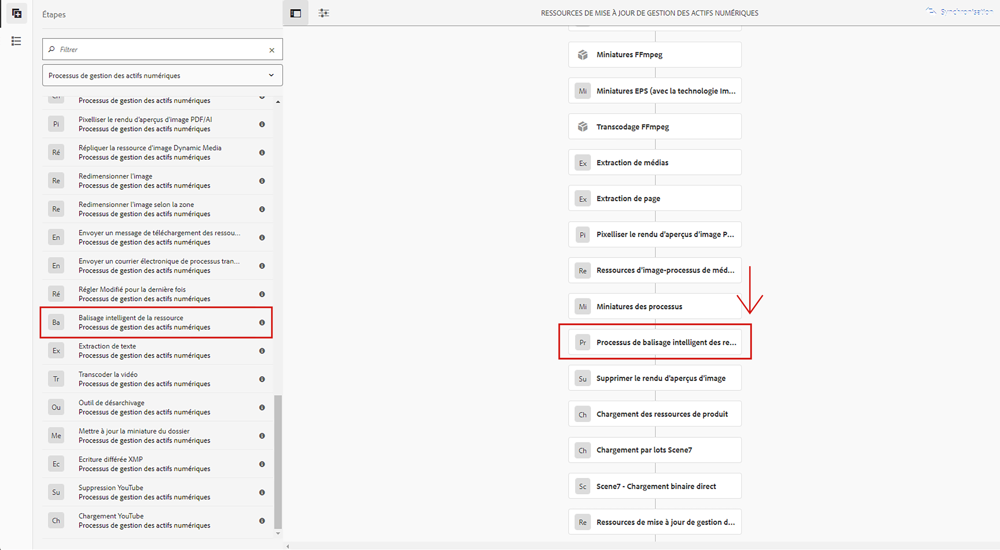

# Configure asset tagging using the Smart Content Service {#configure-asset-tagging-using-the-smart-content-service}

You can integrate [!DNL Adobe Experience Manager] with the Smart Content Service using Adobe Developer Console. Use this configuration to access the Smart Content Service from within [!DNL Experience Manager].

L’article détaille les tâches essentielles suivantes qui sont requises pour configurer le service de contenu dynamique. At the back end, the [!DNL Experience Manager] server authenticates your service credentials with the Adobe Developer Console gateway before forwarding your request to the Smart Content Service.

1. Create a Smart Content Service configuration in [!DNL Experience Manager] to generate a public key. [Obtenez un certificat public](#obtain-public-certificate) pour l’intégration d’OAuth.
1. [Créez une intégration dans Adobe Developer Console](#create-adobe-i-o-integration) et chargez la clé publique générée.
1. [Configurez votre déploiement](#configure-smart-content-service) à l’aide de la clé d’API et d’autres informations d’identification d’Adobe Developer Console.
1. [Testez la configuration](#validate-the-configuration).
1. Optionally, [enable auto-tagging on asset upload](#enable-smart-tagging-in-the-update-asset-workflow-optional).

## Conditions préalables {#prerequisites}

Avant d’utiliser Smart Content Service, vérifiez les éléments suivants pour créer une intégration sur la console de développement Adobe :

* L’organisation doit disposer d’un compte Adobe ID pourvu de droits d’administrateur.
* Le service de contenu dynamique est activé pour votre organisation.

<!-- TBD: This link will update soon after the new articles goes live on docs.adobe.com. Change it when new URL is available.
-->

To enable Enhanced Smart Tags, in addition to the above, also install the latest [Experience Manager service pack](https://helpx.adobe.com/fr/experience-manager/aem-releases-updates.html).

## Obtention d’un certificat public {#obtain-public-certificate}

Un certificat public permet d’authentifier votre profil sur Adobe Developer Console.

1. Dans l’interface [!DNL Experience Manager] utilisateur, accédez à **[!UICONTROL Outils]** > **[!UICONTROL Cloud Service]** > Cloud Service **** hérités.

1. In the Cloud Services page, click **[!UICONTROL Configure Now]** under **[!UICONTROL Assets Smart Tags]**.
1. Dans la boîte de dialogue **[!UICONTROL Créer une configuration]**, spécifiez un titre et un nom pour la configuration de balises intelligentes. Cliquez sur **[!UICONTROL Créer]**.
1. Dans la boîte de dialogue **[!UICONTROL Service de contenu dynamique AEM]**, utilisez les valeurs suivantes :

   **[!UICONTROL URL du service]**: `https://mc.adobe.io/marketingcloud/smartcontent`

   **[!UICONTROL Serveur d’autorisation]**: `https://ims-na1.adobelogin.com`

   Laissez les autres champs vides pour l’instant (pour les remplir ultérieurement). Cliquez sur **[!UICONTROL OK]**.

   

   >[!NOTE]
   >
   >The URL provided as [!UICONTROL Service URL] is not accessible via browser and generates a 404 error. La configuration fonctionne correctement avec la même valeur que le paramètre URL  de service. Pour connaître l’état général du service et le calendrier de maintenance, voir [https://status.adobe.com](https://status.adobe.com).

1. Click **[!UICONTROL Download Public Certificate for OAuth Integration]**, and download the public certificate file `AEM-SmartTags.crt`.

   

### Reconfigure when a certificate expires {#certrenew}

Une fois qu’un certificat expire, il n’est plus approuvé. Vous ne pouvez pas renouveler un certificat ayant expiré. Pour ajouter un nouveau certificat, procédez comme suit.

1. Connectez-vous en tant qu’administrateur à votre déploiement [!DNL Experience Manager]. Cliquez sur **[!UICONTROL Outils]** > **[!UICONTROL Sécurité]** > **[!UICONTROL Utilisateurs]**.

1. Recherchez et cliquez sur l’utilisateur **[!UICONTROL dam-update-service]**. Cliquez sur l’onglet **[!UICONTROL KeyStore]**.
1. Supprimez le fichier de stockage de clés **[!UICONTROL similaritysearch]** existant avec le certificat arrivé à expiration. Cliquez sur **[!UICONTROL Enregistrer et fermer]**.

   

   *Figure : Suppression d’une entrée existante`similaritysearch`dans le Keystore pour ajouter un nouveau certificat de sécurité.*

1. Accédez à **[!UICONTROL Outils]** > **[!UICONTROL Cloud Services]** > **[!UICONTROL Ancienne version de Cloud Services]**. Cliquez sur **[!UICONTROL Balises dynamiques de ressources]** > **[!UICONTROL Afficher la configuration]** > **[!UICONTROL Configurations disponibles]**. Cliquez sur la configuration requise.

1. Pour télécharger un certificat public, cliquez sur **[!UICONTROL Télécharger le certificat public pour l’intégration Oauth]**.
1. Accédez à [https://console.adobe.io](https://console.adobe.io) et accédez aux services de contenu intelligent existants sur la page **[!UICONTROL Intégrations]**. Téléchargez le nouveau certificat. For more information, see the instructions in [Create Adobe Developer Console integration](#create-adobe-i-o-integration).

## Intégration de la Console développeur de création d’Adobes {#create-adobe-i-o-integration}

Pour utiliser les API de Smart Content Service, créez une intégration dans la Console développeur d’Adobes afin de générer la clé d’API, l’ID de compte technique, l’ID d’organisation et la clé secrète client.

1. Accédez à l’URL [https://console.adobe.io](https://console.adobe.io/) dans un navigateur. Sélectionnez le compte approprié et vérifiez que le rôle d’organisation associé est administrateur système.
1. Créez un projet portant le nom de votre choix. Cliquez sur **[!UICONTROL Add API]** (Ajouter une API).
1. Sur la page **[!UICONTROL Add API]**, sélectionnez **[!UICONTROL Experience Cloud]** puis **[!UICONTROL Smart Content]** (Contenu dynamique). Cliquez sur **[!UICONTROL Next]** (Suivant).
1. Sélectionnez **[!UICONTROL Upload your public key]** (Charger votre clé publique). Fournissez le fichier de certificat téléchargé depuis [!DNL Experience Manager]. Le message [!UICONTROL Public key(s) uploaded successfully] (La ou les clés publiques ont été chargées) s’affiche. Cliquez sur **[!UICONTROL Next]** (Suivant).
1. La page [!UICONTROL Create a new Service Account (JWT) credential] (Créer des informations d’identification de compte de service (JWT)) affiche la clé publique du compte de service qui vient d’être configuré. Cliquez sur **[!UICONTROL Next]** (Suivant).
1. Dans la page **[!UICONTROL Select product profiles]** (Sélectionner les profils de produits), sélectionnez **[!UICONTROL Smart Content Services]** (Services de contenu dynamique). Cliquez sur **[!UICONTROL Save configured API]** (Enregistrer l’API configurée). Une page affiche davantage d’informations sur la configuration. Gardez cette page ouverte pour copier et ajouter ces valeurs lors de la configuration ultérieure des balises intelligentes dans [!DNL Experience Manager].

   

## Configuration du service de contenu dynamique {#configure-smart-content-service}

Pour configurer l’intégration, utilisez les valeurs des champs ID de compte technique, ID d’organisation, clé secrète client, serveur d’autorisation et clé d’API de l’intégration de la console de développement d’Adobe. Creating a Smart Tags cloud configuration allows authentication of API requests from the [!DNL Experience Manager] deployment.

1. In [!DNL Experience Manager], navigate to **[!UICONTROL Tools]** > **[!UICONTROL Cloud Service]** > **[!UICONTROL Legacy Cloud Services]** to open the [!UICONTROL Cloud Services] console.
1. Sous **[!UICONTROL Ressources – Balises intelligentes]**, ouvrez la configuration créée ci-dessus. Sur la page de paramètres du service, cliquez sur **[!UICONTROL Modifier]**.
1. Dans la boîte de dialogue **[!UICONTROL Service de contenu dynamique AEM]**, utilisez les valeurs préremplies pour les champs **[!UICONTROL URL de service]** et **[!UICONTROL Serveur d’autorisation]**.
1. Pour les champs **[!UICONTROL Clé API]**, **[!UICONTROL ID de compte technique]**, **[!UICONTROL ID d’organisation]** et **[!UICONTROL Client secret]**, utilisez les valeurs générées ci-dessus.

## Validation de la configuration {#validate-the-configuration}

Une fois la configuration terminée, vous pouvez utiliser un MBean JMX pour valider la configuration. Pour procéder à la validation, suivez ces étapes.

1. Accédez à votre [!DNL Experience Manager] serveur à `https://[aem_server]:[port]`.
1. Go to **[!UICONTROL Tools]** > **[!UICONTROL Operations]** > **[!UICONTROL Web Console]** to open the OSGi console. Click **[!UICONTROL Main]>[!UICONTROL JMX]**.
1. Cliquez sur `com.day.cq.dam.similaritysearch.internal.impl`. It opens **[!UICONTROL SimilaritySearch Miscellaneous Tasks]**.
1. Cliquez sur `validateConfigs()`. In the **[!UICONTROL Validate Configurations]** dialog, click **[!UICONTROL Invoke]**. Les résultats de la validation s’affichent dans la même boîte de dialogue.

## Enable smart tagging in the [!UICONTROL DAM Update Asset] workflow (Optional) {#enable-smart-tagging-in-the-update-asset-workflow-optional}

1. In [!DNL Experience Manager], go to **[!UICONTROL Tools]** > **[!UICONTROL Workflow]** > **[!UICONTROL Models]**.
1. Sur la page **[!UICONTROL Modèles de processus]**, sélectionnez le modèle de processus **[!UICONTROL Ressources de mise à jour de gestion des actifs numériques]**.
1. Cliquez sur **[!UICONTROL Modifier]** dans la barre d’outils.
1. Développez le panneau latéral pour afficher les étapes. Faites glisser l’étape **[!UICONTROL Balisage intelligent de la ressource]** disponible dans la section Processus de DAM (gestion des actifs numériques) et placez-la après l’étape **[!UICONTROL Miniatures des processus]**.

   

   *Figure : Ajout de l’étape Balisage intelligent de la ressource après l’étape Miniatures des processus dans le processus Ressources de mise à jour de gestion des actifs numériques.*

1. Ouvrez l’étape en mode édition. Dans **[!UICONTROL Paramètres avancés]**, vérifiez que l’option **[!UICONTROL Avance du gestionnaire]** est sélectionnée.

   

1. Dans l’onglet **[!UICONTROL Arguments]**, sélectionnez **[!UICONTROL Ignorer les erreurs]** si vous souhaitez que le processus se termine même si l’étape de balisage automatique échoue.

   Pour baliser les ressources lors de leur chargement, et ce, que le balisage intelligent soit activé ou non dans les dossiers, cochez la case **[!UICONTROL Ignorer l’indicateur de balise intelligente]**.

   

1. Cliquez sur **[!UICONTROL OK]** pour fermer l’étape du processus, puis enregistrez ce dernier.

>[!MORELIKETHIS]
>
>* [Gérer les balises actives](managing-smart-tags.md)
>* [Présentation et formation des balises actives](enhanced-smart-tags.md)
>* [Instructions et règles de formation de Smart Content Service](smart-tags-training-guidelines.md)
>* [Didacticiel vidéo sur la configuration des balises actives](https://docs.adobe.com/content/help/en/experience-manager-learn/assets/metadata/smart-tags-technical-video-setup.html)

