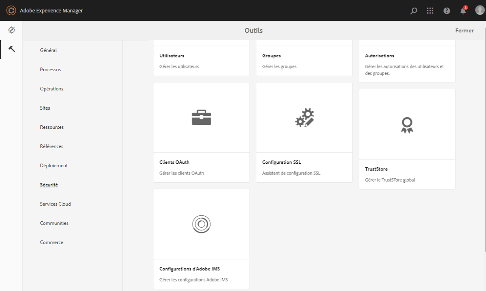
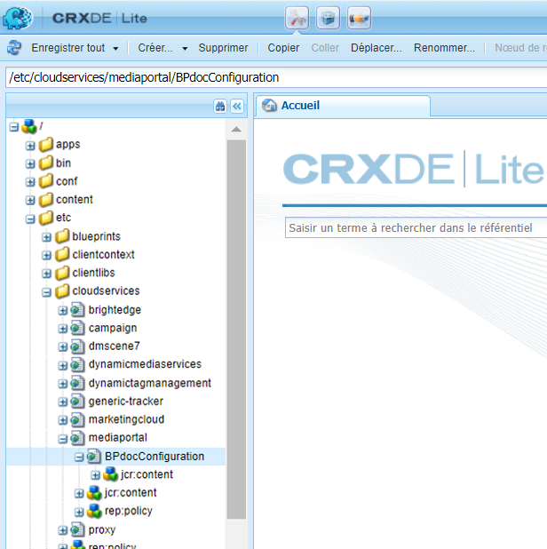

# Configuration d’AEM Assets avec Brand Portal {#configure-integration-65}

Adobe Experience Manager (AEM) Assets est configuré avec Brand Portal via Adobe I/O, qui fournit un jeton IMS pour autoriser votre client Brand Portal.

>[!NOTE]
>
>La configuration d’AEM Assets avec Brand Portal via Adobe I/O est prise en charge sur AEM 6.5.4.0 et versions ultérieures.
>
>Auparavant, Brand Portal était configuré dans l’interface utilisateur classique via la passerelle OAuth héritée, qui fait appel à l’échange de jetons JWT pour obtenir un jeton d’accès IMS en vue de l’autorisation.
>
>La configuration via application OAuth héritée n’est plus prise en charge à partir du 6 avril 2020 et est remplacée par la configuration via Adobe I/O.

>[!TIP]
>
>***Pour les clients existants uniquement***
>
>Il est recommandé de continuer à utiliser la configuration de la passerelle OAuth héritée. Si vous rencontrez des problèmes avec la configuration héritée de la passerelle OAuth, supprimez la configuration existante et créez une configuration via Adobe I/O.

Cette aide décrit les deux cas d’utilisation suivants :
* [Nouvelle configuration](#configure-new-integration-65): Si vous êtes un nouvel utilisateur du portail de marque et souhaitez configurer votre instance d’auteur AEM Assets avec Brand Portal, vous pouvez créer une nouvelle configuration sur les E/S Adobe.
* [Configuration](#upgrade-integration-65)de la mise à niveau : Si vous êtes un utilisateur du portail de marque existant dont l’instance d’auteur AEM Assets est configurée avec Brand Portal sur la passerelle OAuth héritée, il est recommandé de supprimer les configurations existantes et de créer une nouvelle configuration sur les E/S Adobe.

Cette aide s’adresse à un public familiarisé avec les technologies suivantes :

* Installation, configuration et administration des packs Adobe Experience Manager et AEM

* Utilisation des systèmes d’exploitation Linux et Microsoft Windows

## Conditions préalables {#prerequisites}

Pour configurer AEM Assets avec Brand Portal, vous devez disposer des éléments suivants :

* Une instance d’auteur AEM Assets en cours d’exécution avec le dernier Service Pack
* URL du client Brand Portal
* Un utilisateur disposant de droits d’administrateur système sur l’organisation IMS du client Brand Portal

[Téléchargement et installation d’AEM 6.5](#aemquickstart)

[Télécharger et installer le dernier Service Pack AEM](#servicepack)

### Téléchargement et installation d’AEM 6.5 {#aemquickstart}

Il est recommandé d’avoir AEM 6.5 pour configurer une instance d’auteur AEM. Si vous ne l’avez pas, téléchargez-le à partir des emplacements suivants :

* If you are an existing AEM customer, download AEM 6.5 from [Adobe Licensing website](http://licensing.adobe.com).

* If you are an Adobe partner, use [Adobe Partner Training Program](https://adobe.allegiancetech.com/cgi-bin/qwebcorporate.dll?idx=82357Q) to request AEM 6.5.

Après avoir téléchargé AEM, consultez la page [Déploiement et maintenance](https://helpx.adobe.com/fr/experience-manager/6-5/sites/deploying/using/deploy.html#defaultlocalinstall) pour obtenir des instructions sur la configuration d’une instance d’auteur AEM.

### Télécharger et installer le dernier Service Pack AEM {#servicepack}

Pour obtenir des instructions détaillées, voir

* [Notes de mise à jour d’AEM 6.5, Pack de services ](https://helpx.adobe.com/fr/experience-manager/6-5/release-notes/sp-release-notes.html)

**Contactez l’assistance** si vous ne parvenez pas à trouver le dernier package AEM ou le Service Pack.

## Création d’une configuration {#configure-new-integration-65}

Effectuez les étapes suivantes dans la séquence répertoriée si vous configurez AEM Assets avec Brand Portal pour la première fois :
1. [Obtention d’un certificat public](#public-certificate)
1. [Créer l’intégration Adobe I/O](#createnewintegration)
1. [Créer une configuration de compte IMS](#create-ims-account-configuration)
1. [Configuration du service cloud](#configure-the-cloud-service)
1. [Configuration du test](#test-integration)

### Création de la configuration IMS {#create-ims-configuration}

La configuration IMS authentifie votre client du portail de marque avec l’instance d’auteur AEM Assets.

La configuration IMS comprend deux étapes :

* [Obtention d’un certificat public](#public-certificate)
* [Créer une configuration de compte IMS](#create-ims-account-configuration)

### Obtention d’un certificat public {#public-certificate}

Le certificat public vous permet d’authentifier vos  d’sur les E/S Adobe.

1. Connectez-vous à votre instance d’auteur AEM AssetsURL par défaut : http:// localhost:4502/aem/start.html
1. Dans le panneau **Outils**  , accédez à **[!UICONTROL Sécurité]** > Configurations **[!UICONTROL Adobe IMS.]**

   

1. La page Configurations d’Adobe IMS s’ouvre.

   Cliquez sur **[!UICONTROL Créer]**.

   Vous accéderez ainsi à la page Configuration **[!UICONTROL du compte technique IMS d’]** Adobe.

1. Par défaut, l’onglet **Certificat** s’ouvre.

   Dans la solution **** Cloud, sélectionnez **[!UICONTROL Adobe Brand Portal]**.

1. Cochez la case **[!UICONTROL Créer un nouveau certificat]** et spécifiez un **alias** pour le certificat. L’alias sert de nom à la boîte de dialogue.

1. Cliquez sur **[!UICONTROL Créer un certificat]**. Une boîte de dialogue s’affiche. Cliquez sur **[!UICONTROL OK]** pour générer le certificat public.

   

1. Click **[!UICONTROL Download Public Key]** and save the *AEM-Adobe-IMS.crt* certificate file on your machine. The certificate file is used to [create Adobe I/O integration](#createnewintegration).

   

1. Cliquez sur **[!UICONTROL Suivant]**.

   Dans l’onglet **Compte** , vous créez le compte Adobe IMS, mais vous aurez besoin des détails d’intégration. Gardez cette page ouverte pour l&#39;instant.

   Ouvrez un nouvel onglet et [créez une intégration](#createnewintegration) d’E/S Adobe pour obtenir les détails d’intégration des configurations de compte IMS.

### Créer l’intégration Adobe I/O {#createnewintegration}

L’intégration des E/S Adobe génère une clé d’API, une clé secrète client et une charge utile (JWT) requises pour configurer les configurations de compte IMS.

1. Connectez-vous à la console d’E/S Adobe avec les droits d’administrateur système sur l’organisation IMS du client du portail de marque.

   URL par défaut : [https://console.adobe.io/](https://console.adobe.io/)

1. Click **[!UICONTROL Create Integration]**.

1. Sélectionnez **[!UICONTROL Accéder à une API]**, puis cliquez sur **[!UICONTROL Continuer]**.

   

1. Créez une page d’intégration qui s’ouvre.

   Sélectionnez votre organisation dans le  déroulant.

   Dans **[!UICONTROL Experience Cloud]**, sélectionnez **[!UICONTROL AEM Brand Portal]** et cliquez sur **[!UICONTROL Continuer]**.

   If the Brand Portal option is disabled for you, ensure that you have selected correct organization from the drop-down box above the **[!UICONTROL Adobe Services]** option. Si vous ne connaissez pas le nom de votre entreprise, contactez votre administrateur.

   

1. Indiquez un nom et une description pour l’intégration. Click **[!UICONTROL Select a File from your computer]** and upload the `AEM-Adobe-IMS.crt` file downloaded in the [obtain public certificates](#public-certificate) section.

1. Sélectionnez le  de votre organisation.

   Ou bien, sélectionnez le portail **[!UICONTROL des marques]** Ressources par défaut et cliquez sur **[!UICONTROL Créer une intégration]**. L’intégration est alors créée.

1. Click **[!UICONTROL Continue to integration details]** to view the integration information.

   Copie de la clé **[!UICONTROL API]**

   Cliquez sur **[!UICONTROL Récupérer la clé secrète]** du client et copiez la clé secrète du client.

   

1. Accédez à l’onglet **[!UICONTROL JWT]** et copiez la charge **** JWT.

   La clé API, la clé secrète client et les informations de charge utile JWT seront utilisées pour créer la configuration du compte IMS.

### Créer une configuration de compte IMS {#create-ims-account-configuration}

Vérifiez que vous avez effectué les étapes suivantes :

* [Obtention d’un certificat public](#public-certificate)
* [Créer l’intégration Adobe I/O](#createnewintegration)

**Procédure de création de la configuration du compte IMS :**

1. Ouvrez la page Configuration IMS, onglet **[!UICONTROL Comptes]** . Vous avez gardé la page ouverte à la fin de la section [Obtenir des certificats publics](#public-certificate).

1. Spécifiez un **[!UICONTROL titre]** pour le compte IMS.

   Dans **[!UICONTROL Authorization Server]**, saisissez l’URL : [https://ims-na1.adobelogin.com/](https://ims-na1.adobelogin.com/)

   Collez la clé d’API, la clé secrète client et la charge utile JWT que vous avez copiée à la fin de l’intégration [d’E/S](#createnewintegration)Create Adobe.

   Cliquez sur **[!UICONTROL Créer]**.

   L’intégration est créée.

   

1. Select the IMS configuration and click **[!UICONTROL Check Health]**. Une boîte de dialogue s’affiche.

   Cliquez sur **[!UICONTROL Vérifier]**. Une fois la connexion établie, le message *Token retrieved successfully* (Jeton récupéré) s’affiche.

   

>[!CAUTION]
>
>Créez une seule configuration IMS valide.
>
> Assurez-vous que la configuration est saine. Au cas où la configuration serait malsaine, supprimez-la et créez une nouvelle configuration saine.

### Configure cloud service {#configure-the-cloud-service}

Effectuez les étapes suivantes pour créer la configuration du service cloud de Portal de marque :

1. Connexion à votre instance d’auteur AEM Assets

   URL par défaut : http:// localhost:4502/aem/start.html
1. Dans le panneau **Outils**  , accédez à Services **[!UICONTROL Cloud > Portail]** de marque AEM.

   La page Configurations du portail de marque s’ouvre.

1. Cliquez sur **[!UICONTROL Créer]**.

1. Specify a **[!UICONTROL Title]** for the configuration.

   Sélectionnez la configuration IMS que vous avez créée à l’étape, [créez la configuration](#create-ims-account-configuration)du compte IMS.

   Dans l’URL **[!UICONTROL du]** service, saisissez l’URL du client du portail de marque.

   

1. Click **[!UICONTROL Save and Close]**. La configuration cloud est alors créée. Votre instance d’auteur AEM Assets est maintenant intégrée au client du portail de marque.

### Test configuration {#test-integration}

1. Connexion à votre instance d’auteur AEM Assets

   URL par défaut : http:// localhost:4502/aem/start.html

1. Dans le panneau **Outils**  , accédez à **[!UICONTROL Déploiement > Réplication]**.

   

1. La page Réplication s’ouvre.

   Cliquez sur **[!UICONTROL Agents sur l’auteur]**.

   

1. Quatre agents de réplication sont créés pour chaque client.

   Localisez les agents de réplication de votre locataire du portail de marque.

   Cliquez sur l’URL de l’agent de réplication.

   

   >[!NOTE]
   >
   >Les agents de réplication fonctionnent en parallèle et partagent la distribution des tâches de manière égale, augmentant ainsi la vitesse de publication de quatre fois la vitesse initiale. Une fois le service cloud configuré, une configuration supplémentaire n’est pas nécessaire pour activer les agents de réplication qui sont activés par défaut pour activer la publication parallèle de plusieurs ressources.

   >[!NOTE]
   >
   >Évitez de désactiver tout agent de réplication, car cela peut entraîner l’échec de la réplication de certaines ressources.

1. Pour vérifier la connexion entre l’auteur AEM Assets et le portail de marque, cliquez sur **[!UICONTROL Tester la connexion]**.

   

1. En bas des résultats du test, vérifiez que la réplication a réussi.

   

   >[!NOTE]
   >
   >Les agents de réplication fonctionnent en parallèle et partagent la distribution des tâches de manière égale, augmentant ainsi la vitesse de publication de quatre fois la vitesse initiale. Une fois le service cloud configuré, une configuration supplémentaire n’est pas nécessaire pour activer les agents de réplication qui sont activés par défaut pour activer la publication parallèle de plusieurs ressources.

1. Vérifiez les résultats du test sur les quatre agents de réplication un par un.

   >[!NOTE]
   >
   >Évitez de désactiver tout agent de réplication, car cela peut entraîner l’échec de la réplication de certaines ressources.

Le portail de marque est correctement configuré avec votre instance d’auteur AEM Assets. Vous pouvez maintenant :

* [Publication de fichiers depuis AEM Assets vers Brand Portal](../assets/brand-portal-publish-assets.md)
* [Publication de dossiers depuis AEM Assets vers Brand Portal](../assets/brand-portal-publish-folder.md)
* [Publication de collections depuis AEM Assets vers Brand Portal](../assets/brand-portal-publish-collection.md)
* [Configurez la fonctionnalité d’approvisionnement](https://docs.adobe.com/content/help/en/experience-manager-brand-portal/using/asset-sourcing-in-brand-portal/brand-portal-asset-sourcing.html) des ressources pour permettre aux utilisateurs du portail de marque de contribuer et de publier des ressources dans AEM Assets.

## Mise à niveau de la configuration {#upgrade-integration-65}

Effectuez les étapes suivantes dans la séquence répertoriée pour mettre à niveau les configurations existantes :
1. [Vérification des tâches en cours](#verify-jobs)
1. [Supprimer les configurations existantes](#delete-existing-configuration)
1. [Création d’une configuration](#configure-new-integration-65)

### Vérification des tâches en cours {#verify-jobs}

Assurez-vous qu’aucune tâche de publication n’est en cours d’exécution sur votre instance d’auteur AEM Assets avant d’apporter des modifications. Pour cela, vous pouvez vérifier les quatre agents de réplication et vous assurer que la file d’attente est idéale/vide.

1. Connexion à votre instance d’auteur AEM Assets

   URL par défaut : http:// localhost:4502/aem/start.html

1. Dans le panneau **Outils**  , accédez à **[!UICONTROL Déploiement > Réplication]**.

1. La page Réplication s’ouvre.

   Cliquez sur **[!UICONTROL Agents sur l’auteur]**.

   

1. Localisez les agents de réplication de votre locataire du portail de marque.

   Assurez-vous que la **file d’attente est inactive** pour tous les agents de réplication ; aucune tâche de publication n’est active.

   

### Supprimer les configurations existantes {#delete-existing-configuration}

Vous devez exécuter le  de vérification suivant lors de la suppression des configurations existantes.
* Supprimer les quatre agents de réplication
* Suppression du service cloud
* Supprimer un utilisateur MAC

1. Connectez-vous à votre instance d’auteur AEM Assets et ouvrez CRX Lite en tant qu’administrateur.

   URL par défaut : http:// localhost:4502/crx/de/index.jsp

1. Accédez à `/etc/replications/agents.author` et supprimez les quatre agents de réplication de votre locataire du portail de marque.

   

1. Accédez à `/etc/cloudservices/mediaportal` la configuration **du service** Cloud et supprimez-la.

   

1. Accédez à `/home/users/mac` et supprimez l’utilisateur **** MAC de votre locataire du portail de marque.

   

Vous pouvez désormais [créer une configuration](#configure-new-integration-65) sur votre instance d’auteur AEM 6.5 sur les E/S Adobe.

<!--
   Comment Type: draft

   <li> </li>
   -->

<!--
   Comment Type: draft

   <li>Step text</li>
   -->

Une fois la réplication réussie, vous pouvez publier des ressources, des dossiers et des collections sur Brand Portal. Pour plus d’informations, voir :

* [Publication de ressources sur Brand Portal](/help/assets/brand-portal-publish-assets.md)
* [Publication de dossiers sur Brand Portal](/help/assets/brand-portal-publish-folder.md)
* [Publication de collections sur Brand Portal](/help/assets/brand-portal-publish-collection.md)
