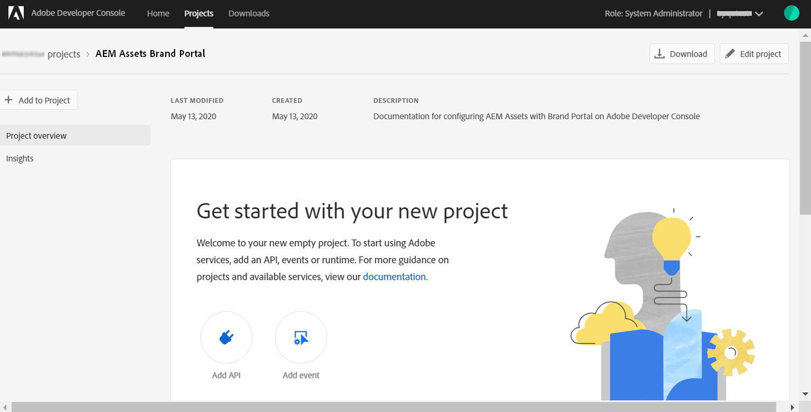

# Configuration d’AEM Assets avec Brand Portal {#configure-integration-65}

Les ressources Adobe Experience Manager (AEM) sont configurées avec le portail de marque via Adobe Developer Console, qui fournit un jeton IMS pour l’autorisation de votre client du portail de marque.

>[!NOTE]
>
>La configuration d’AEM Assets avec Brand Portal via Adobe Developer Console est prise en charge sur AEM 6.5.4.0 et versions ultérieures.
>
>Auparavant, Brand Portal était configuré dans l’interface utilisateur classique via la passerelle OAuth héritée, qui fait appel à l’échange de jetons JWT pour obtenir un jeton d’accès IMS en vue de l’autorisation.
>
>La configuration via Legacy OAuth n’est plus prise en charge depuis le 6 avril 2020 et est remplacée par la configuration via Adobe Developer Console.

>[!TIP]
>
>***Pour les clients existants uniquement***
>
>Il est recommandé de continuer à utiliser la configuration de la passerelle OAuth héritée. Si vous rencontrez des problèmes avec la configuration héritée de la passerelle OAuth, supprimez la configuration existante et créez une nouvelle configuration via Adobe Developer Console.

Cette aide décrit les deux cas d’utilisation suivants :
* [Nouvelle configuration](#configure-new-integration-65): Si vous êtes un nouvel utilisateur du portail de marques et souhaitez configurer votre instance d’auteur AEM Assets avec Brand Portal, vous pouvez créer une nouvelle configuration sur Adobe Developer Console.
* [Configuration](#upgrade-integration-65)de la mise à niveau : Si vous êtes un utilisateur du portail de marque existant dont l’instance d’auteur AEM Assets est configurée avec Brand Portal sur la passerelle OAuth héritée, il est recommandé de supprimer les configurations existantes et de créer une nouvelle configuration sur Adobe Developer Console.

Cette aide s’adresse à un public familiarisé avec les technologies suivantes :

* Installation, configuration et administration des packs Adobe Experience Manager et AEM

* Utilisation des systèmes d’exploitation Linux et Microsoft Windows

## Conditions préalables {#prerequisites}

Pour configurer AEM Assets avec Brand Portal, vous devez disposer des éléments suivants :

* Une instance d’auteur AEM Assets en cours d’exécution avec le dernier Service Pack
* URL du client Brand Portal
* Un utilisateur disposant de droits d’administrateur système sur l’organisation IMS du client Brand Portal

[Téléchargement et installation d’AEM 6.5](#aemquickstart)

[Télécharger et installer le dernier Service Pack AEM](#servicepack)

### Téléchargement et installation d’AEM 6.5 {#aemquickstart}

Il est recommandé d’utiliser AEM 6.5 pour configurer une instance d’auteur AEM. Si vous ne l’avez pas, téléchargez-le à partir des emplacements suivants :

* If you are an existing AEM customer, download AEM 6.5 from [Adobe Licensing website](http://licensing.adobe.com).

* If you are an Adobe partner, use [Adobe Partner Training Program](https://adobe.allegiancetech.com/cgi-bin/qwebcorporate.dll?idx=82357Q) to request AEM 6.5.

Après avoir téléchargé AEM, consultez la page [Déploiement et maintenance](https://helpx.adobe.com/fr/experience-manager/6-5/sites/deploying/using/deploy.html#defaultlocalinstall) pour obtenir des instructions sur la configuration d’une instance d’auteur AEM.

### Télécharger et installer le dernier Service Pack AEM {#servicepack}

Pour obtenir des instructions détaillées, voir

* [Notes de mise à jour d’AEM 6.5, Pack de services ](https://helpx.adobe.com/fr/experience-manager/6-5/release-notes/sp-release-notes.html)

**Contactez le service à la clientèle** si vous ne parvenez pas à trouver le dernier package ou Service Pack d’AEM.

## Création d’une configuration {#configure-new-integration-65}

La configuration d’AEM Assets avec Brand Portal nécessite des configurations à la fois dans l’instance d’auteur AEM Assets et dans Adobe Developer Console.

1. Dans l’instance d’auteur AEM Assets, créez un compte IMS et générez un certificat public (clé publique).

1. Dans Adobe Developer Console, créez un projet pour votre client (organisation) du portail de marque.

1. Sous le projet, configurez une API à l’aide de la clé publique pour créer une connexion au compte de service (JWT).

1. Obtenez les informations d’identification du compte de service et les informations de charge JWT.

1. Dans l’instance d’auteur AEM Assets, configurez le compte IMS à l’aide des informations d’identification du compte de service et de la charge utile JWT.

1. Dans l’instance d’auteur AEM Assets, configurez le service cloud du portail des marques à l’aide du compte IMS et du point de terminaison du portail des marques (URL de l’organisation).

1. Testez la configuration en publiant une ressource de l’instance d’auteur AEM Assets sur le portail de marques.

>[!NOTE]
>
>Un client du portail de marques doit uniquement être configuré avec une seule instance d’auteur AEM Assets.
>
>Ne configurez pas un client du portail de marques avec plusieurs instances d’auteur AEM Assets.

Effectuez les étapes suivantes dans la séquence répertoriée si vous configurez AEM Assets avec Brand Portal pour la première fois :
1. [Obtention d’un certificat public](#public-certificate)
1. [Créer une connexion au compte de service (JWT)](#createnewintegration)
1. [Configuration du compte IMS](#create-ims-account-configuration)
1. [Configuration du service cloud](#configure-the-cloud-service)
1. [Test de la configuration](#test-integration)

### Création de la configuration IMS {#create-ims-configuration}

La configuration IMS authentifie votre client Brand Portal avec l’instance d’auteur AEM Assets.

La configuration IMS comprend deux étapes :

* [Obtention d’un certificat public](#public-certificate)
* [Configuration du compte IMS](#create-ims-account-configuration)

### Obtention d’un certificat public {#public-certificate}

Le certificat public vous permet d’authentifier votre profil sur Adobe Developer Console.

1. Connectez-vous à votre instance d’auteur AEM Assets. L’URL par défaut est
   `http:// localhost:4502/aem/start.html`
1. From the **Tools**  panel, navigate to **[!UICONTROL Security]** > **[!UICONTROL Adobe IMS Configurations]**.

   

1. Dans la page Adobe IMS Configurations, cliquez sur **[!UICONTROL Créer]**.

1. Vous êtes redirigé vers la page Configuration **[!UICONTROL du compte technique]** Adobe IMS. By default, the **Certificate** tab opens.

   Sélectionnez la solution cloud **[!UICONTROL Adobe Brand Portal]**.

1. Mark the checkbox **[!UICONTROL Create new certificate]** and specify an **alias** for the certificate. L’alias sert de nom à la boîte de dialogue.

1. Cliquez sur **[!UICONTROL Créer un certificat]**. Cliquez ensuite sur **[!UICONTROL OK]** dans la boîte de dialogue pour générer le certificat public.

   

1. Click **[!UICONTROL Download Public Key]** and save the certificate (.crt) file on your machine.

   Le fichier de certificat sera utilisé dans d’autres étapes pour configurer l’API de votre client du portail de marque et générer des informations d’identification de compte de service dans Adobe Developer Console.

   

1. Cliquez sur **[!UICONTROL Suivant]**.

   Dans l’onglet **Compte** , vous créez le compte IMS Adobe, mais pour ce faire, vous aurez besoin des informations d’identification du compte de service générées dans Adobe Developer Console. Gardez cette page ouverte pour l’instant.

   Ouvrez un nouvel onglet et [créez une connexion au compte de service (JWT) dans Adobe Developer Console](#createnewintegration) pour obtenir les informations d’identification et la charge utile JWT pour configurer le compte IMS.

### Créer une connexion au compte de service (JWT) {#createnewintegration}

Dans Adobe Developer Console, les projets et les API sont configurés au niveau de l’entreprise (client du portail de marque). La configuration d’une API crée une connexion de compte de service (JWT) dans Adobe Developer Console. Il existe deux méthodes pour configurer l&#39;API, en générant une paire de clés (clés privée et publique) ou en téléchargeant une clé publique. Pour configurer l’instance d’auteur AEM Assets avec Brand Portal, vous devez générer un certificat public (clé publique) dans l’instance d’auteur AEM Assets et créer des informations d’identification dans Adobe Developer Console en téléchargeant la clé publique. Cette clé publique permet de configurer l’API pour l’organisation du portail de marques sélectionnée et de générer les informations d’identification et la charge utile JWT pour le compte de service. Ces informations d’identification sont également utilisées pour configurer le compte IMS dans l’instance d’auteur AEM Assets. Une fois le compte IMS configuré, vous pouvez configurer le service cloud du portail de marque dans l’instance d’auteur AEM Assets.

Effectuez les étapes suivantes pour générer les informations d’identification du compte de service et la charge utile JWT :

1. Connectez-vous à Adobe Developer Console avec les droits d’administrateur système sur l’organisation IMS (locataire du portail de marque). L’URL par défaut est

   [https://www.adobe.com/go/devs_console_ui](https://www.adobe.com/go/devs_console_ui)

   >[!NOTE]
   >
   >Assurez-vous d’avoir sélectionné l’organisation IMS appropriée (locataire du portail de marque) dans la liste déroulante (liste d’organisation) située dans l’angle supérieur droit.

1. Click **[!UICONTROL Create new project]**. Un projet vierge est créé pour votre organisation.

   Cliquez sur **[!UICONTROL Modifier le projet]** pour mettre à jour le titre **[!UICONTROL et la]** description **[!UICONTROL du]** projet, puis cliquez sur **[!UICONTROL Enregistrer.]**

   

1. Dans l’onglet Aperçu du projet, cliquez sur **[!UICONTROL Ajouter l’API]**.

   

1. Dans la fenêtre Ajouter une API, sélectionnez Portail **[!UICONTROL de marque]** AEM et cliquez sur **[!UICONTROL Suivant]**.

   Assurez-vous d’avoir accès au service AEM Brand Portal.

1. Dans la fenêtre Configurer l’API, cliquez sur **[!UICONTROL Télécharger votre clé]** publique. Cliquez ensuite sur **[!UICONTROL Sélectionner un fichier]** et téléchargez le certificat public (fichier .crt) que vous avez téléchargé dans la section [Obtenir un certificat](#public-certificate) public.

   Cliquez sur **[!UICONTROL Suivant]**.

   

1. Vérifiez le certificat public et cliquez sur **[!UICONTROL Suivant]**.

1. Sélectionnez le portail **[!UICONTROL des]** ressources du profil de produits par défaut **[!UICONTROL et cliquez sur]** Enregistrer la configuration.

   

1. Une fois l’API configurée, vous êtes redirigé vers l’aperçu de l’API. Dans le volet de navigation de gauche sous **[!UICONTROL Informations d’identification]**, cliquez sur Compte de **[!UICONTROL service (JWT)]**.

   >[!NOTE]
   >
   >Vous pouvez vue les informations d’identification et effectuer d’autres actions (générer des jetons JWT, copier les informations d’identification, récupérer le secret client, etc.) si nécessaire.

1. Dans l’onglet Informations d’identification **[!UICONTROL du]** client, copiez l’ID **[!UICONTROL du]** client.

   Click **[!UICONTROL Retrieve Client Secret]** and copy the **[!UICONTROL client secret]**.

   

1. Navigate to the **[!UICONTROL Generate JWT]** tab and copy the **[!UICONTROL JWT Payload]**.

Vous pouvez désormais utiliser l’ID client (clé d’API), le secret client et la charge utile JWT pour [configurer le compte](#create-ims-account-configuration) IMS dans l’instance cloud AEM Assets.

<!--
### Create Adobe I/O integration {#createnewintegration}

Adobe I/O integration generates API Key, Client Secret, and Payload (JWT) which is required in setting up the IMS Account configurations.

1. Login to Adobe I/O Console with system administrator privileges on the IMS organization of the Brand Portal tenant.

   Default URL: [https://console.adobe.io/](https://console.adobe.io/) 

1. Click **[!UICONTROL Create Integration]**.

1. Select **[!UICONTROL Access an API]**, and click **[!UICONTROL Continue]**.

   

1. Create a new integration page opens. 
   
   Select your organization from the drop-down list.

   In **[!UICONTROL Experience Cloud]**, Select **[!UICONTROL AEM Brand Portal]** and click **[!UICONTROL Continue]**. 

   If the Brand Portal option is disabled for you, ensure that you have selected correct organization from the drop-down box above the **[!UICONTROL Adobe Services]** option. If you do not know your organization, contact your administrator.

   

1. Specify a name and description for the integration. Click **[!UICONTROL Select a File from your computer]** and upload the `AEM-Adobe-IMS.crt` file downloaded in the [obtain public certificates](#public-certificate) section.

1. Select the profile of your organization. 

   Or, select the default profile **[!UICONTROL Assets Brand Portal]** and click **[!UICONTROL Create Integration]**. The integration is created.

1. Click **[!UICONTROL Continue to integration details]** to view the integration information. 

   Copy the **[!UICONTROL API Key]** 
   
   Click **[!UICONTROL Retrieve Client Secret]** and copy the Client Secret key.

   

1. Navigate to **[!UICONTROL JWT]** tab, and copy the **[!UICONTROL JWT payload]**.

   The API Key, Client Secret key, and JWT payload information will be used to create IMS account configuration.
-->

### Création d’une configuration de compte IMS {#create-ims-account-configuration}

Vérifiez que vous avez effectué les étapes suivantes :

* [Obtention d’un certificat public](#public-certificate)
* [Créer une connexion au compte de service (JWT)](#createnewintegration)

Effectuez les étapes suivantes pour configurer le compte IMS que vous avez créé dans [l’obtention d’un certificat](#public-certificate)public.

1. Ouvrez la configuration IMS et accédez à l’onglet **[!UICONTROL Comptes]** . Vous avez gardé la page ouverte lors de l’ [obtention du certificat](#public-certificate)public.

1. Spécifiez un **[!UICONTROL titre]** pour le compte IMS.

   Dans **[!UICONTROL Serveur d’autorisation]**, entrez l’adresse URL : [https://ims-na1.adobelogin.com/](https://ims-na1.adobelogin.com/)

   Collez l’ID client dans la clé d’API, le secret client et la charge utile JWT que vous avez copiés lors de la [création de la connexion](#createnewintegration)au compte de service (JWT).

   Cliquez sur **[!UICONTROL Créer]**.

   Le compte IMS est configuré.

   

1. Sélectionnez la configuration IMS et cliquez sur **[!UICONTROL Contrôle de l’intégrité]**.

   Cliquez sur **[!UICONTROL Vérifier]** dans la boîte de dialogue. Une fois la configuration réussie, un message s&#39;affiche indiquant que le *jeton est récupéré avec succès*.

   

>[!CAUTION]
>
>Vous ne devez avoir qu’une seule configuration IMS. N’en créez pas plusieurs.
>
>Assurez-vous que la configuration IMS réussit le contrôle d’intégrité. Si tel n’est pas le cas, elle n’est pas valide. Vous devez la supprimer et créer une configuration valide.

### Configuration du service cloud {#configure-the-cloud-service}

Suivez les étapes ci-après pour créer un service cloud Portal de marque :

1. Connectez-vous à votre instance d’auteur AEM Assets.

1. From the **Tools**  panel, navigate to **[!UICONTROL Cloud Services]** > **[!UICONTROL AEM Brand Portal]**.

1. Dans la page Configurations du portail de marque, cliquez sur **[!UICONTROL Créer]**.

1. Saisissez un **[!UICONTROL titre]** pour la configuration.

   Sélectionnez la configuration IMS que vous avez créée lors de la [configuration du compte](#create-ims-account-configuration)IMS.

   In the **[!UICONTROL Service URL]**, enter your Brand Portal tenant (organization) URL.

   

1. Cliquez sur **[!UICONTROL Enregistrer et fermer]**. La configuration cloud est alors créée. Votre instance d’auteur AEM Assets est maintenant configurée avec le client du portail de marques.

### Test de la configuration {#test-integration}

Effectuez les étapes suivantes pour valider la configuration :

1. Connectez-vous à votre instance cloud AEM Assets.

1. Dans le panneau **Outils**  , accédez à **[!UICONTROL Déploiement]** > **[!UICONTROL Réplication.]**

   

1. In the Replication page, click **[!UICONTROL Agents on author]**.

   

1. Quatre agents de réplication sont créés pour chaque client.

   Localisez les agents de réplication de votre locataire du portail de marque.

   Cliquez sur l’URL de l’agent de réplication.

   

   >[!NOTE]
   >
   >Les agents de réplication fonctionnent en parallèle et partagent la répartition des tâches de manière égale, augmentant ainsi la vitesse de publication de quatre fois la vitesse initiale. Une fois le service cloud configuré, aucune configuration supplémentaire n’est requise pour activer les agents de réplication activés par défaut pour permettre la publication parallèle de plusieurs actifs.

1. Pour vérifier la connexion entre AEM Assets et Brand Portal, cliquez sur **[!UICONTROL Tester la connexion]**.

   

   Un message s’affiche en bas de la page pour indiquer que votre package de test a été livré.

   

1. Vérifiez les résultats du test sur les quatre agents de réplication un par un.

   >[!NOTE]
   >
   >Évitez de désactiver tout agent de réplication, car cela peut entraîner l’échec de la réplication de certaines ressources.

Votre instance d’auteur AEM Assets a été correctement configurée avec le portail de marques. Vous pouvez maintenant :

* [Publication de ressources à partir d’AEM Assets sur Brand Portal](../assets/brand-portal-publish-assets.md)
* [Publication de dossiers à partir d’AEM Assets sur Brand Portal](../assets/brand-portal-publish-folder.md)
* [Publication de collections à partir d’AEM Assets sur Brand Portal](../assets/brand-portal-publish-collection.md)
* [Configurez l’approvisionnement](https://docs.adobe.com/content/help/en/experience-manager-brand-portal/using/asset-sourcing-in-brand-portal/brand-portal-asset-sourcing.html) des ressources pour permettre aux utilisateurs du portail de marque de contribuer et de publier des ressources sur AEM Assets.

## Mise à niveau de la configuration {#upgrade-integration-65}

Effectuez les étapes suivantes dans la séquence répertoriée pour mettre à niveau les configurations existantes :
1. [Vérification des tâches en cours](#verify-jobs)
1. [Supprimer les configurations existantes](#delete-existing-configuration)
1. [Création d’une configuration](#configure-new-integration-65)

### Vérification des tâches en cours {#verify-jobs}

Assurez-vous qu’aucune tâche de publication ne s’exécute sur votre instance d’auteur AEM Assets avant d’apporter des modifications. Pour cela, vous pouvez vérifier les quatre agents de réplication et vous assurer que la file d&#39;attente est idéale/vide.

1. Connectez-vous à votre instance d’auteur AEM Assets.

1. Dans le panneau **Outils**  , accédez à **[!UICONTROL Déploiement]** > Réplication **[!UICONTROL du déploiement.]**

1. In the Replication page, click **[!UICONTROL Agents on author]**.

   

1. Localisez les agents de réplication de votre locataire du portail de marque.

   Assurez-vous que la **file d&#39;attente est inactive** pour tous les agents de réplication, aucun travail de publication n&#39;est actif.

   

### Supprimer les configurations existantes {#delete-existing-configuration}

Vous devez exécuter la liste de vérification suivante lors de la suppression des configurations existantes.
* Supprimer les quatre agents de réplication
* Suppression du service cloud
* Supprimer un utilisateur MAC

1. Connectez-vous à votre instance d’auteur AEM Assets et ouvrez CRX Lite en tant qu’administrateur. L’URL par défaut est

   `http:// localhost:4502/crx/de/index.jsp`

1. Accédez à `/etc/replications/agents.author` et supprimez les quatre agents de réplication de votre locataire du portail de marque.

   

1. Accédez à `/etc/cloudservices/mediaportal` la configuration **du service** Cloud et supprimez-la.

   

1. Accédez à `/home/users/mac` l’utilisateur **** MAC de votre locataire du portail de marque et supprimez-le.

   

Vous pouvez désormais [créer une configuration](#configure-new-integration-65) sur votre instance d’auteur AEM 6.5.

<!--
   Comment Type: draft

   <li> </li>
   -->

<!--
   Comment Type: draft

   <li>Step text</li>
   -->

Une fois la réplication réussie, vous pouvez publier des ressources, des dossiers et des collections sur Brand Portal. Pour plus d’informations, voir :

* [Publication de ressources sur Brand Portal](/help/assets/brand-portal-publish-assets.md)
* [Publication de dossiers sur Brand Portal](/help/assets/brand-portal-publish-folder.md)
* [Publication de collections sur Brand Portal](/help/assets/brand-portal-publish-collection.md)
