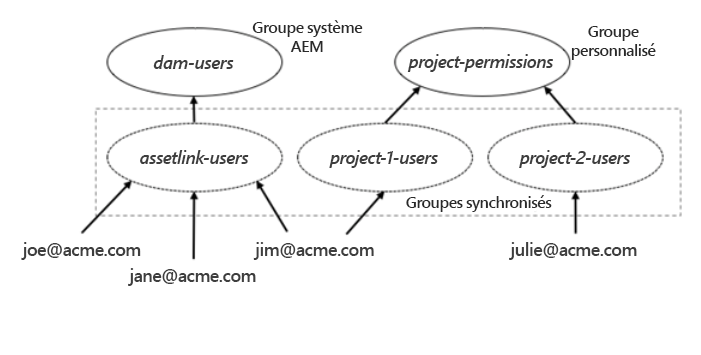

# Configuration d’Experience Manager Assets pour Adobe Asset Link {#adobe-asset-link}

[Adobe Asset Link (AAL)](https://www.adobe.com/fr/creativecloud/business/enterprise/adobe-asset-link.html) simplifie la collaboration entre les créatifs et les spécialistes du marketing dans le processus de création de contenu. Il connecte Adobe Experience Manager Assets aux applications de bureau du Creative Cloud Adobe InDesign, Adobe Photoshop et Adobe Illustrator. Le panneau Adobe Asset Link permet aux créatifs d’accéder au contenu stocké dans AEM Assets et de le modifier sans quitter les applications de création qui leur sont les plus familières.

Pour configurer Experience Manager Assets pour l’utiliser avec Asset Link, implémentez les tâches suivantes. Utilisez le compte administrateur d’Experience Manager pour effectuer la configuration :

1. Installez les packages nécessaires. Vous trouverez les détails dans les [conditions préalables](#prerequisites).

1. Configurez Experience Manager [manuellement](#manual-configuration) ou en utilisant un [package](#configure-using-package).

1. Pour mapper des utilisateurs sous licence Creative Cloud à des utilisateurs d’Experience Manager, gérez le [contrôle d’accès utilisateur](#user-access).

1. Créez l’[index de requête personnalisé](#create-custom-index), configurez les [Rendus FPO](/help/assets/configure-fpo-renditions.md) pour InDesign, configurez l’[intégration d’Adobe Stock](/help/assets/aem-assets-adobe-stock.md) et configurez la [recherche visuelle ou par analogie](https://experienceleague.adobe.com/docs/experience-manager-65/assets/using/search-assets.html?lang=fr#configvisualsearch).

## Conditions préalables et prise en charge de différentes fonctionnalités {#prerequisites}

Assurez-vous d’installer le pack de services et le package appropriés, si nécessaire. Consultez les conditions requises suivantes pour chaque version d’Experience Manager et pour connaître les fonctionnalités spécifiques.

| Fonctionnalité d’Assets | Version d’Experience Manager et configuration requises pour la prise en charge |
|--- |--- |
| Asset Link fonctionne par défaut. | Experience Manager 6,5 6.5.2 ou version ultérieure.   Experience Manager 6.4.4 et 6.4.6, ou une version ultérieure   Adobe recommande d’installer la dernière version du [pack de services (SP) Experience Manager](https://experienceleague.adobe.com/docs/experience-manager-release-information/aem-release-updates/aem-releases-updates.html?lang=fr) avant d’utiliser AAL. |
| Asset Link fonctionne après l’installation d’un package. | Pour Experience Manager 6.4.0 à 6.4.3, installez le package [adobe-asset-link-support](https://experience.adobe.com/#/downloads/content/software-distribution/en/aem.html?package=/content/software-distribution/en/details.html/content/dam/aem/public/adobe/packages/cq640/featurepack/adobe-asset-link-support). |
| Intégration d’Adobe Stock | Experience Manager 6.4.2 ou version ultérieure |
| Recherche visuelle ou par analogie | Experience Manager 6.5.0 ou version ultérieure |

## Configuration d’Experience Manager à l’aide du package de configuration {#configure-using-package}

Adobe recommande d’installer le package de configuration [adobe-asset-link-config](https://experience.adobe.com/#/downloads/content/software-distribution/en/aem.html?package=/content/software-distribution/en/details.html/content/dam/aem/public/adobe/packages/cq640/product/assets/adobe-asset-link-config) pour automatiser la plupart des tâches de configuration, suivi de quelques tâches manuelles. Vous pouvez également utiliser une [configuration manuelle](#manual-configuration).

>[!CAUTION]
>
>Si votre instance d’Experience Manager est configurée pour la connexion utilisateur avec des comptes Adobe IMS, n’utilisez pas le package de configuration. Au lieu de cela, [configurez manuellement](#manual-configuration) votre instance d’Experience Manager.

1. Pour ouvrir le gestionnaire de packages, dans l’interface web d’Experience Manager, accédez à **[!UICONTROL Outils]** > **[!UICONTROL Déploiement]** > **[!UICONTROL Partage de packages]**. Installer le package `adobe-asset-link-config`.

1. Accédez à **[!UICONTROL Outils]** > **[!UICONTROL Opérations]** > **[!UICONTROL Console Web]**. Localisez la configuration du **[!UICONTROL fournisseur IMS OAuth Adobe Granite]** et cliquez pour la modifier.

   Définissez les propriétés suivantes et enregistrez les modifications :

   * [!UICONTROL Mappages de groupe] : laissez ce champ vide, sauf vous souhaitez le remplir. Pour plus d’informations, consultez [Mappage de groupe](#group-mapping).
   * [!UICONTROL Organisation] : saisissez l’ID d’organisation que vous utilisez dans l’Adobe Admin Console. Pour plus d’informations sur les ID d’organisation, consultez [Création d’un groupe d’utilisateurs](https://helpx.adobe.com/fr/enterprise/using/create-aal-user-group.html).

1. Localisez le **[!UICONTROL Gestionnaire d’authentification du porteur Adobe Granite]** et cliquez pour le modifier.

   Ajoutez identifiants du client **[!UICONTROL InDesignAem2]** pour la propriété de configuration d’**[!UICONTROL ID de client OAuth autorisés]**.

## Configuration manuelle d’Experience Manager {#manual-configuration}

Configurez manuellement Experience Manager si vous choisissez de ne pas utiliser de package de configuration ou si votre déploiement d’Experience Manager est configuré pour prendre en charge la connexion utilisateur avec des comptes Adobe IMS.

Pour configurer manuellement Experience Manager :

1. Pour accéder au gestionnaire de configuration, accédez à **[!UICONTROL Outils]** > **[!UICONTROL Opérations]** > **[!UICONTROL Console Web]**. Sélectionnez **[!UICONTROL OSGi]** > **[!UICONTROL Configuration]** dans le menu en haut.

1. Localisez la configuration du **[!UICONTROL fournisseur IMS OAuth Adobe Granite]** et cliquez pour la modifier.

   Définissez la configuration suivante, puis cliquez sur **[!UICONTROL Enregistrer]**.

   * [!UICONTROL Point d’entrée d’autorisation] : ` https://ims-na1.adobelogin.com/ims/authorize/v1`
   * [!UICONTROL Point d’entrée du jeton] : ` https://ims-na1.adobelogin.com/ims/token/v1`
   * [!UICONTROL Point d’entrée de profil] : ` https://ims-na1.adobelogin.com/ims/profile/v1`
   * [!UICONTROL URL de validation] : ` https://ims-na1.adobelogin.com/ims/validate_token/v1`
   * [!UICONTROL Organisation] : défini sur l’ID d’organisation dans l’[Adobe Admin Console](https://adminconsole.adobe.com/).
   * [!UICONTROL Mappages de groupe] : laissez ce champ vide, sauf exception. Pour plus d’informations, consultez [Mappage de groupe](#group-mapping).

1. Localisez le **[!UICONTROL Gestionnaire d’authentification du porteur Adobe Granite]** et cliquez pour le modifier.

   Ajoutez les ID client suivants à la propriété de configuration d’**[!UICONTROL ID client OAuth autorisés]** : `InDesignAem2, cc-europa-desktop_0_1, cc-europa-desktop_1_0, cc-europa-desktop_2_0, cc-europa-desktop_3_0, cc-europa-desktop_4_0, cc-europa-desktop_5_0, cc-europa-desktop_6_0, cc-europa-desktop_7_0, cc-europa-desktop_8_0, cc-europa-desktop_9_0, and cc-europa-desktop_10_0`.

   Pour ajouter chaque `Client ID`, cliquez sur `+`. Cliquez sur **[!UICONTROL Enregistrer]** après l’ajout de tous les identifiants.

1. Dans la configuration du **[!UICONTROL fournisseur et de l’application OAuth Adobe Granite]**, inspectez les instances du **[!UICONTROL Gestionnaire d’authentification OAuth Adobe]**. Si vous localisez une instance avec `Config ID` défini comme `ims`, utilisez-le pour les instructions de cette procédure. Sinon, cliquez sur `+` pour créer une instance de configuration. Définissez les valeurs de propriété suivantes, puis cliquez sur **[!UICONTROL Enregistrer]**.

   * [!UICONTROL ID client] : ne pas modifier
   * [!UICONTROL Secret client] : ne pas modifier
   * [!UICONTROL ID de configuration] : ` ims`
   * [!UICONTROL Portée] : `AdobeID, OpenID, read_organizations` (d’autres valeurs peuvent également se trouver dans la configuration)
   * [!UICONTROL Identifiant du fournisseur] : ` ims`
   * [!UICONTROL Créer des utilisateurs] : ` Checked`
   * [!UICONTROL Propriété de l’ID utilisateur] : `Email` pour la configuration nouvellement créée. Sinon, ne modifiez rien.

1. Recherchez la configuration **[!UICONTROL Gestionnaire de synchronisation par défaut Apache Jackrabbit Oak]** avec le **[!UICONTROL Nom du gestionnaire de synchronisation]** `ims` et cliquez pour le modifier.

   Définissez les propriétés de configuration suivantes, puis cliquez sur **[!UICONTROL Enregistrer]**.

   * [!UICONTROL Délai d’expiration de l’utilisateur et de l’abonnement de l’utilisateur] : temps en minutes suivi d’un « m », sans espace. Par exemple : `15m` pour 15 minutes. Pour plus d’informations, consultez [Mappage de groupe](#group-mapping).
   * [!UICONTROL Abonnement automatique des utilisateurs] : ne pas modifier
   * [!UICONTROL Abonnement dynamique de l’utilisateur] : ` Deslect`

1. Recherchez la configuration du **[!UICONTROL Gestionnaire d’authentification OAuth Granite Adobe]** et cliquez pour la modifier. Sans apporter de modifications, cliquez sur **[!UICONTROL Enregistrer]**.

1. Pour ajuster la priorité relative du gestionnaire d’authentification du porteur, dans CRXDE, accédez à `/apps/system/config`. Localisez `com.adobe.granite.auth.oauth.impl.BearerAuthenticationHandler.config` et ouvrez sa configuration. À la fin, ajoutez `service.ranking=I"-10"`. Enregistrez les modifications.

   >[!NOTE]
   >
   >Chaque requête authentifiée avec un jeton porteur entraîne la surcharge de trois appels à Adobe IMS, la synchronisation des utilisateurs et la création d’un jeton de connexion dans Experience Manager. Pour surmonter cette surcharge, Adobe Asset Link capture le jeton de connexion renvoyé dans la réponse d’Experience Manager et l’envoie avec les requêtes suivantes. Pour que ce processus fonctionne, la priorité relative du gestionnaire d’authentification du porteur doit être ajustée.

1. (Facultatif) Si les utilisateurs d’Experience Manager ont des noms de domaine en majuscules ou en minuscules dans leurs ID d’e-mail, sélectionnez **[!UICONTROL Modification de la casse d’un utilisateur verrouillé]** dans **[!UICONTROL les configurations de la plateforme ACP Granite Adobe]** dans la console Web d’Experience Manager.

## Configuration supplémentaire après la migration vers des profils métier {#configure-migration-activity}

Les utilisateurs d’Adobe Asset Link peuvent se connecter à Experience Manager pour autoriser la connexion IMS à partir de l’organisation principale de Creative Cloud abonnement Entreprise (CCE). Experience Manager utilise les ID client pour identifier l’organisation IMS autorisée. Après la migration vers les profils métier, il est nécessaire de configurer l’identifiant du client et la clé secrète pour l’organisation IMS dans Experience Manager pour le gestionnaire d’authentification du porteur. Pour plus d’informations sur les profils métier, consultez [Introduction des profils d’Adobe](https://helpx.adobe.com/fr/enterprise/kb/introducing-adobe-profiles.html).

Une configuration supplémentaire n’est requise que si vous utilisez différentes organisations Adobe IMS pour Experience Manager et Creative Cloud abonnement Entreprise (CCE) et qu’une relation de confiance de domaine est établie entre ces deux organisations.

>[!NOTE]
>
>* Le correctif pour les profils métier est fourni dans Experience Manager 6.5.11.0.
>* La configuration existante continue de fonctionner si vous utilisez la même organisation Adobe IMS avec Experience Manager et CCE.

**Conditions préalables**

1. Une instance d’Experience Manager en cours d’exécution avec l’authentification du porteur configurée pour AAL
1. Installez le package suivant (pack de services 11) sur votre instance Experience Manager 6.5.

   [Téléchargement d’Experience Manager 6.5.11.0](https://experience.adobe.com/#/downloads/content/software-distribution/en/aem.html?package=/content/software-distribution/en/details.html/content/dam/aem/public/adobe/packages/cq650/servicepack/aem-service-pkg-6.5.11.zip)

1. Contactez le [!UICONTROL service clientèle] pour obtenir l’identifiant client et la clé secrète pour l’authentification du porteur de votre organisation IMS.

Voici les configurations supplémentaires requises après la migration vers les profils métier :

1. Dans le **[!UICONTROL fournisseur de configuration IMS OAuth Adobe Granite]** (`com.adobe.granite.auth.ims.impl.ImsConfigProviderImpl`), définissez :

   * L’ID de configuration OAuth (`oauth.configmanager.ims.configid`) : `ims` (À vérifier, il se peut que vous l’ayez déjà configuré)

   * L’entité propriétaire IMS (`ims.owningEntity`) : l’identifiant IMS de votre organisation

   

1. Ouvrez le **[!UICONTROL Gestionnaire d’authentification du porteur]** et ajoutez l’identifiant client obtenu à partir du [!UICONTROL service clientèle] à la liste des **[!UICONTROL ID client OAuth autorisés]**.

   

1. Ouvrez la configuration du **[!UICONTROL fournisseur et de l’application OAuth Adobe Granite]** et ajoutez l’**[!UICONTROL ID client]** et le **[!UICONTROL Secret du client]** (Clé secrète) obtenus auprès du service clientèle.

   Assurez-vous que le champ **[!UICONTROL ID de configuration]** (`oauth.config.id`) contient la même valeur que celle fournie dans le champ **[!UICONTROL ID de configuration OAuth]** (`oauth.configmanager.ims.configid`) ci-dessus.

   

1. Ouvrez la configuration du **[!UICONTROL Préprocesseur de jeton d’échange de cluster IMS Adobe Granite]** et définissez-la sur `enable`.

## Gestion du contrôle d’accès des utilisateurs {#user-access}

Cette section décrit comment gérer les utilisateurs et leur accès au référentiel d’Experience Manager.

### Mappage de groupe {#group-mapping}

Le mappage de groupes détermine la manière dont les groupes dans Experience Manager correspondent aux groupes dans Adobe IMS. Il joue un rôle important dans la manière dont les utilisateurs Adobe Asset Link se voient accorder l’autorisation d’accéder à Experience Manager Assets.

Lorsqu’il est utilisé avec Adobe Asset Link, Experience Manager délègue des fonctions de gestion des utilisateurs à Adobe IMS. Il crée automatiquement des utilisateurs et des groupes qui correspondent aux utilisateurs et aux groupes dans Adobe IMS. En outre, il synchronise les utilisateurs, les groupes et l’appartenance à un groupe dans Experience Manager pour qu’ils correspondent à ceux d’Adobe IMS.

Supposons, par exemple, que les utilisateurs d’Adobe Asset Link soient membres du groupe Adobe IMS assetlink-users. Dans ce cas, un groupe synchronisé nommé assetlink-users est créé dans Experience Manager lorsqu’un utilisateur de ce groupe Adobe IMS se connecte pour la première fois à Adobe Asset Link. Chaque nouvel utilisateur du groupe Adobe IMS est ajouté à ce groupe correspondant dans Experience Manager lorsqu’il se connecte pour la première fois à Experience Manager via Adobe Asset Link.

Les groupes dans Experience Manager qui correspondent aux groupes dans Adobe IMS et sont synchronisés avec eux peuvent se voir accorder l’accès directement ou en les faisant appartenir à un autre groupe. Voici un exemple de gestion des autorisations.

Les règles suivantes s’appliquent aux mappages de groupes dans Experience Manager :

* Assurez-vous que la propriété **[!UICONTROL Mappages de groupe]** dans la configuration du **[!UICONTROL fournisseur IMS OAuth Adobe Granite]** est vide.
* L’abonnement à un groupe d’utilisateurs Asset Link d’Adobe est évalué lorsque l’utilisateur s’authentifie et que la période définie dans la propriété **[!UICONTROL Délai d’expiration de l’utilisateur]** dans le **[!UICONTROL Gestionnaire de synchronisation par défaut Apache Jackrabbit Oak]** a expiré. Actuellement, les utilisateurs peuvent être ajoutés et supprimés des groupes dans Experience Manager pour se synchroniser avec ce qui se trouve dans Adobe IMS.
* Évitez les conflits de nom de groupe. Assurez-vous que les noms utilisés pour les groupes créés dans Adobe IMS (pour gérer les utilisateurs) sont différents de tous les noms des groupes système d’Experience Manager.

  Par exemple, assurez-vous qu’ils sont différents du groupe `dam-users` et des groupes créés par l’administrateur d’Experience Manager.

  Un groupe Adobe IMS dont le nom est en conflit avec le nom d’un groupe système d’Experience Manager ou d’un groupe créé manuellement n’est pas utilisé pour contrôler les autorisations utilisateur.
* Si un utilisateur Adobe IMS se connecte à une instance d’Experience Manager sur laquelle le nom de l’utilisateur entre en conflit avec un utilisateur Experience Manager créé précédemment, l’utilisateur Adobe IMS se voit attribuer un autre nom, avec des numéros ajoutés, pour le rendre unique.

**Configuration du contrôle d’accès pour la première fois**

Les utilisateurs qui se connectent via Adobe Asset Link ne peuvent afficher et interagir avec les ressources qu’après avoir obtenu l’autorisation requise. La section [Mappage de groupe](#group-mapping) ci-dessus explique comment les groupes d’utilisateurs sont créés dans Experience Manager, lesquels correspondent aux groupes d’utilisateurs de votre entreprise et sont synchronisés avec eux dans Adobe IMS. Il est recommandé que les administrateurs d’Experience Manager utilisent ces groupes pour gérer le contrôle d’accès pour les utilisateurs d’Adobe Asset Link.

Pour chaque groupe d’Experience Manager synchronisé avec un groupe Adobe IMS (utilisé pour gérer le contrôle d’accès des utilisateurs) :

1. Assurez-vous que le groupe comporte un membre qui peut être utilisé pour une première connexion à partir d’Adobe Asset Link.
1. Utilisez cet utilisateur pour vous connecter à Adobe Asset Link et vous connecter à Experience Manager. Cette connexion devrait échouer.
1. Dans Experience Manager, localisez le groupe correspondant au groupe dans Adobe IMS et accordez-lui le contrôle d’accès souhaité. Par exemple, le nouveau groupe est devenu membre du groupe dam-users.
1. Fermez Adobe Asset Link et redémarrez l’application Creative Cloud.
1. Pour vérifier que l’utilisateur dispose de l’accès voulu, rouvrez Adobe Asset Link.

Une fois ces étapes effectuées, les utilisateurs du même groupe peuvent se connecter à Experience Manager avec Adobe Asset Link lors de leur première tentative. Ils disposent automatiquement des mêmes autorisations que les autres utilisateurs du groupe.

## Gestion des utilisateurs Experience Manager pour Adobe Asset Link {#manage-users}

Les utilisateurs d’Adobe Asset Link peuvent se connecter à Experience Manager lorsqu’ils sont connectés à leur application Creative Cloud. Cette authentification utilise la technologie Adobe IMS et crée des informations utilisateur dans Experience Manager si elles n’existent pas. Il est courant pour les clients d’Experience Manager Grands comptes de gérer leurs utilisateurs avec un fournisseur d’identité externe intégré à Experience Manager. Les fournisseurs d’identité incluent Adobe IMS et d’autres produits qui utilisent les protocoles SAML et LDAP. Vous pouvez également créer et gérer des utilisateurs localement dans Experience Manager.

Les utilisateurs qui se connectent à Experience Manager à partir d’Adobe Asset Link n’ont aucun conflit avec les informations d’utilisateur existantes stockées dans Experience Manager à partir de la connexion directe précédente, si :

* tous les noms d’utilisateur utilisés pour la connexion directe à Experience Manager diffèrent des noms d’utilisateur utilisés dans Adobe IMS pour la connexion à Creative Cloud ;
* Adobe IMS est utilisé comme fournisseur d’identité pour la connexion directe à Experience Manager ;
* les utilisateurs se connectent à Experience Manager à partir d’Adobe Asset Link avant de se connecter directement à Experience Manager avec le même compte.

D’un autre côté, les informations utilisateur créées suite à la connexion directe à Experience Manager doivent être mises à jour pour fonctionner avec Adobe Asset Link, dans les scénarios suivants :

* Le même nom d’utilisateur, tel que l’adresse électronique de l’utilisateur, est utilisé à la fois pour le compte Creative Cloud, qui utilise Adobe IMS, et pour le compte dans un fournisseur d’identité externe autre qu’Adobe IMS.
* Le même nom d’utilisateur est utilisé pour : le compte Creative Cloud et un compte d’Experience Manager local.
* Les comptes Creative Cloud dans Adobe IMS sont des Federated ID, qui sont servis par le même fournisseur d’identité externe intégré à Experience Manager pour la connexion directe.

Les utilisateurs créés par le biais de ces scénarios ne disposent pas d’une propriété requise pour les utilisateurs qui sont synchronisés avec Adobe IMS.

Pour mettre à jour ces utilisateurs dans Experience Manager afin qu’ils travaillent avec Adobe Asset Link :

1. Dans la console Web d’Experience Manager, localisez la **[!UICONTROL Configuration principale externe Apache Jackrabbit Oak]** et cliquez pour la modifier. Désélectionnez la case **[!UICONTROL Protection des identités externes]** puis cliquez sur **[!UICONTROL Enregistrer]**.
1. Pour accéder à l’interface de gestion des utilisateurs dans Experience Manager, accédez à **[!UICONTROL Outils]** > **[!UICONTROL Sécurité]** > **[!UICONTROL Utilisateurs]**. Sélectionnez l’utilisateur que vous souhaitez mettre à jour, puis notez la fin du chemin d’URL de votre navigateur pour cet utilisateur, en commençant par `/home/users`. Vous pouvez également rechercher le nom d’utilisateur dans CRXDE. Exemple de chemin d’accès utilisateur : `/home/users/x/xTac082TDh-guJzzG7WM`.
1. Dans CRXDE, accédez au chemin d’accès de l’utilisateur, sélectionnez le nœud utilisateur et affichez les propriétés du nœud en sélectionnant l’onglet **[!UICONTROL Propriétés]** dans la zone inférieure centrale. Ce nœud a une valeur de propriété `jcr:primaryType` de `rep:User`.
1. Au bas de la zone d’onglet **[!UICONTROL Propriétés]**, saisissez une valeur `Name` de `rep:externalId`, une valeur `Type` de `String` et une valeur `Value` de `rep:authorizableId`;`ims`, où `rep:authorizableId` est la valeur de la propriété `rep:authorizableId` du nœud. (Utilisez un point-virgule sans espaces pour séparer la variable `rep:authorizableId` de `ims`.)
1. Cliquez sur le bouton **[!UICONTROL Ajouter]** à droite de votre nouvelle entrée, puis cliquez sur **[!UICONTROL Enregistrer tout]**.
1. Répétez les étapes 2 à 5 pour tous les autres utilisateurs que vous souhaitez mettre à niveau afin de travailler avec Adobe Asset Link.
1. Dans la console Web d’Experience Manager, localisez la **[!UICONTROL Configuration principale externe Apache Jackrabbit Oak]** et cliquez pour la modifier. Désélectionnez la case **[!UICONTROL Protection des identités externes]** puis cliquez sur **[!UICONTROL Enregistrer]**.

>[!NOTE]
>
>Si les services ne sont pas restaurés en quelques minutes, redémarrez Experience Manager pour permettre des authentifications réussies.

Après cette modification, un utilisateur Experience Manager mis à jour peut se connecter à Adobe Asset Link et continuer à utiliser la méthode de connexion directe à Experience Manager utilisée avant la mise à jour. Une fois l’authentification réussie avec Adobe IMS, les informations de profil utilisateur d’Experience Manager sont synchronisées avec le profil utilisateur dans Adobe IMS.

Il existe une méthode par laquelle une migration en bloc de plusieurs utilisateurs d’Experience Manager peut être effectuée pour leur permettre de travailler avec Adobe Asset Link. Pour plus d’informations et d’aide sur l’activation de cette option, contactez l’assistance Adobe.

Au lieu de ces étapes, dans certains cas, un utilisateur d’Adobe Asset Link peut recevoir un accès rapide à Experience Manager. Dans ce cas, les informations préexistantes sur l’utilisateur sont trouvées et supprimées avec Experience Manager User Management ou le CRXDE d’Experience Manager avant leur connexion à Adobe Asset Link. Les informations sur les nouveaux utilisateurs sont créées dans Experience Manager après la connexion. Utilisez cette approche uniquement si vous êtes certain qu’aucune donnée importante n’est ajoutée en tant qu’enfant du nœud utilisateur. Ces données supplémentaires représentent tout nœud enfant du nœud utilisateur autre que `tokens`, `preferences`, `profile`, `profiles`, `profiles/public` et `rep:policy/*`.

## Workflow de démarrage automatique pour traiter les ressources de manière conditionnelle {#auto-start-workflow}

Dans Experience Manager 6.4 et Experience Manager 6.5, les administrateurs peuvent configurer des workflows pour exécuter et traiter automatiquement les ressources en fonction de conditions prédéfinies.

Cette configuration est utile pour les utilisateurs et les spécialistes du marketing du secteur, par exemple pour créer un workflow personnalisé sur des dossiers spécifiques. Disons que toutes les ressources de la séance photo d’une agence peuvent recevoir un filigrane ou que toutes les ressources téléchargées par un programme de travail indépendant peuvent être traitées pour créer des rendus spécifiques.

Pour plus d’informations et pour la configuration d’Experience Manager, consultez [Exécution automatique du workflow sur les ressources](https://experienceleague.adobe.com/docs/experience-manager-65/assets/using/assets-workflow.html?lang=fr#auto-execute-workflow-on-some-assets).

## Création d’un index personnalisé dans les versions Experience Manager 6.4.x {#create-custom-index}

Experience Manager contient des index utilisés pour l’interrogation. Créez l’index personnalisé suivant pour la version spécifiée. Experience Manager 6.5.0 contient cet index par défaut. Adobe Asset Link a besoin de cet index pour déterminer les ressources qu’un utilisateur a extraites.

1. Dans le CRXDE, localisez le nœud `/oak:index`. Créez un nœud nommé `cqDrivelock` et définissez son `Type` sur `oak:QueryIndexDefinition`.

1. Ajoutez les propriétés suivantes au nouveau nœud et enregistrez les modifications :

   * `Name: type; Type: string; Value: property`

   * `Name: propertyNames; Type: Name[] (click the "Multi" button); Value: cq:drivelock`

## Configuration de la recherche visuelle ou par analogie {#configure-visual-similarity-search}

La fonctionnalité de recherche visuelle vous permet de rechercher des ressources visuellement similaires dans le référentiel AEM Assets à l’aide du panneau Adobe Asset Link. Cette fonctionnalité est disponible dans la version 6.5.0 ou une version ultérieure et seules les ressources indexées sont recherchées. Pour plus d’informations, consultez [Comment configurer la recherche visuelle](https://experienceleague.adobe.com/docs/experience-manager-65/assets/using/search-assets.html?lang=fr#configvisualsearch).

## Génération de rendus pour placement uniquement pour Adobe InDesign {#fpo-renditions}

Experience Manager fournit des rendus utilisés uniquement pour placement (FPO). Ces rendus FPO ont une taille de fichier réduite, mais présentent les mêmes proportions. Si un rendu FPO n’est pas disponible pour une ressource, Adobe InDesign utilise la ressource d’origine à la place. Ce mécanisme de secours garantit que le workflow créatif se poursuit sans interruption. Pour plus d’informations, consultez [Générer des rendus FPO](/help/assets/configure-fpo-renditions.md).

## Intégration à Adobe Stock {#adobe-stock-integration}

Les organisations intègrent leurs comptes Adobe Stock à Experience Manager Assets. Cela permet aux spécialistes marketing de mettre à disposition des photos, des vecteurs, des illustrations, des vidéos, des modèles et des ressources 3D de haute qualité et libres de droits pour leurs projets de création et de marketing. Les professionnels de la création peuvent utiliser ces ressources à l’aide du panneau Asset Link.

Pour procéder à l’intégration avec Adobe Stock, reportez-vous à la section [Ressources Adobe Stock dans Experience Manager Assets](/help/assets/aem-assets-adobe-stock.md). Vous avez besoin d’Experience Manager 6.4.2 ou d’une version ultérieure pour l’intégration à Adobe Stock.

## Résolution des problèmes liés à Experience Manager {#troubleshoot}

Si vous rencontrez des problèmes lors de la configuration ou de l’utilisation d’Adobe Asset Link, essayez les méthodes suivantes :

* Assurez-vous que votre déploiement respecte les conditions préalables. Plus précisément, assurez-vous que les pack de fonctionnalités ou les packages appropriés sont installés.
* Contactez le partenaire ou l’intégrateur système de votre entreprise.
* Si les utilisateurs de votre Creative Cloud ne peuvent pas vérifier les ressources extraites, vérifiez la casse des noms de domaine dans les ID d’e-mail. Pour résoudre ce problème, consultez [configuration manuelle](#manual-configuration).
* Pour plus d’informations, consultez [Dépannage d’Asset Link](https://helpx.adobe.com/fr/enterprise/kb/asset-link-troubleshooting.html).

>[!MORELIKETHIS]
>
>* [À propos d’Adobe Asset Link](https://helpx.adobe.com/fr/enterprise/using/adobe-asset-link.html)
>* [Utilisation d’Asset Link dans l’appli de bureau Creative Cloud et gestion des ressources](https://helpx.adobe.com/fr/enterprise/using/manage-assets-using-adobe-asset-link.html)
>* [Configuration d’Adobe Experience Manager Assets as a Cloud Service](https://helpx.adobe.com/fr/enterprise/using/configure-aem-assets-for-asset-link.html).
