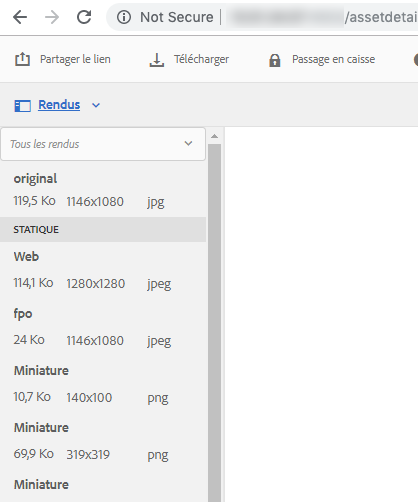

# Génération de rendus pour placement uniquement pour Adobe InDesign {#fpo-renditions}

| Version | Lien de l’article |
| -------- | ---------------------------- |
| AEM as a Cloud Service | [Cliquez ici](https://experienceleague.adobe.com/docs/experience-manager-cloud-service/content/assets/admin/configure-fpo-renditions.html?lang=fr) |
| AEM 6.5 | Cet article |

Lorsque vous transférez des ressources volumineuses d’Experience Manager vers des documents Adobe InDesign, un professionnel de la création doit attendre un temps conséquent avant de [placer une ressource](https://helpx.adobe.com/fr/indesign/using/placing-graphics.html). Pendant ce temps, l’utilisateur ne peut pas utiliser InDesign. Cela interrompt le flux créatif et a un impact négatif sur l’expérience utilisateur. Adobe permet de placer temporairement dans des documents InDesign des rendus de petite taille pour commencer. Lorsque la sortie finale est requise, par exemple pour les workflows d’impression et de publication, les ressources d’origine en pleine résolution remplacent le rendu temporaire en arrière-plan. Cette mise à jour asynchrone en arrière-plan accélère le processus de conception pour améliorer la productivité et n’entrave pas le processus créatif.

Adobe Experience Manager (AEM) fournit des rendus utilisés uniquement pour placement (FPO). Ces rendus FPO ont une taille de fichier réduite, mais présentent les mêmes proportions. Si un rendu FPO n’est pas disponible pour une ressource, Adobe InDesign utilise la ressource d’origine à la place. Ce mécanisme de secours garantit que le workflow créatif se poursuit sans interruption.

## Méthodes de génération de rendus FPO {#approach-to-generate-fpo-renditions}

Experience Manager permet de nombreuses méthodes de traitement des images qui peuvent être utilisées pour générer les rendus FPO. Les deux méthodes les plus courantes consistent à utiliser des workflows Experience Manager intégrés ou d’utiliser ImageMagick. À l’aide de ces deux méthodes, vous pouvez configurer la génération de rendu des ressources nouvellement chargées et des ressources qui existent dans Experience Manager.

Vous pouvez utiliser ImageMagick pour traiter les images, notamment pour générer des rendus FPO. Ces rendus sont sous-échantillonnés, c’est-à-dire que les dimensions en pixels du rendu sont réduites proportionnellement si l’image d’origine a une valeur de ppp supérieure à 72. Consultez [Installation et configuration d’ImageMagick pour une utilisation avec Experience Manager Assets](best-practices-for-imagemagick.md).

|  | Utilisation d’un workflow intégré d’Experience Manager | Utilisation du workflow ImageMagick | Remarques |
|--- |--- |---|--- |
| Pour les nouvelles ressources | Activer le rendu FPO ([aide](#generate-renditions-of-new-assets-using-aem-workflow)) | Ajout de la ligne de commande ImageMagick dans le workflow Experience Manager ([aide](#generate-renditions-of-new-assets-using-imagemagick)) | Experience Manager exécute le workflow Ressource de mise à jour de la gestion des ressources numériques pour chaque chargement. |
| Pour les ressources existantes | Activer le rendu FPO dans un nouveau workflow d’Experience Manager dédié ([aide](#generate-renditions-of-existing-assets-using-aem-workflow)) | Ajout de la ligne de commande ImageMagick dans un nouveau workflow d’Experience Manager dédié ([aide](#generate-renditions-of-existing-assets-using-imagemagick)) | Les rendus FPO des ressources existantes peuvent être créés à la demande ou en bloc. |

>[!CAUTION]
>
>Créez les workflows pour générer des rendus en modifiant une copie des workflows par défaut. Vous prévenez ainsi le remplacement de vos modifications lorsque Experience Manager est mis à jour, par exemple lors de l’installation d’un nouveau pack de services.

## Générer des rendus de nouvelles ressources à l’aide du workflow Experience Manager {#generate-renditions-of-new-assets-using-aem-workflow}

Vous trouverez ci-dessous les étapes de configuration du modèle de workflow Ressource de mise à jour de la gestion des ressources numériques pour activer la génération de rendu :

1. Cliquez sur **[!UICONTROL Outils]** > **[!UICONTROL Workflow]** > **[!UICONTROL Modèles]**. Sélectionnez le modèle **[!UICONTROL Ressource de mise à jour de la gestion des ressources numériques]** et cliquez sur **[!UICONTROL Modifier]**.

1. Sélectionnez l’étape **[!UICONTROL Miniatures des processus]** et cliquez sur **[!UICONTROL Configurer]**.

1. Cliquez sur l’onglet **[!UICONTROL Rendu FPO]**. Sélectionnez **[!UICONTROL Activer la création du rendu FPO]**.

   

1. Réglez la **[!UICONTROL Qualité]** et ajoutez ou modifiez les valeurs de **[!UICONTROL Liste de formats]** selon vos besoins. Par défaut, la liste des types MIME de génération des rendus FPO comprend les pjpeg, jpeg, jpg, gif, png, x-png et tiff. Cliquez sur **[!UICONTROL Terminé]**.

   >[!NOTE]
   >
   >La génération de rendu est prise en charge pour les types de fichiers JPEG, GIF, PNG, TIFF, PSD et BMP.

1. Pour activer les modifications, cliquez sur **[!UICONTROL Synchronisation]**.

>[!NOTE]
>
>Les images de plus de 1 280 pixels sur un côté ne conservent pas les dimensions en pixels dans le rendu FPO.

## Génération de rendus de nouvelles ressources à l’aide d’ImageMagick {#generate-renditions-of-new-assets-using-imagemagick}

Dans Experience Manager, le workflow Ressource de mise à jour de la gestion des ressources numériques s’exécute lorsqu’une nouvelle ressource est chargée. Pour utiliser ImageMagick afin de traiter les rendus des ressources récemment chargées, ajoutez une nouvelle commande au modèle de workflow.

1. Cliquez sur **[!UICONTROL Outils]** > **[!UICONTROL Workflow]** > **[!UICONTROL Modèles]**.

1. Sélectionnez le modèle **[!UICONTROL Ressource de mise à jour de la gestion des ressources numériques]** et cliquez sur **[!UICONTROL Modifier]**.

1. Cliquez sur **[!UICONTROL Activer/désactiver le panneau latéral]** dans le coin supérieur gauche et recherchez l’étape de ligne de commande.

1. Faites glisser l’étape **[!UICONTROL Ligne de commande]** et ajouter-la avant l’étape **[!UICONTROL Miniatures des processus]**.

1. Sélectionnez l’étape **[!UICONTROL Ligne de commande]** et cliquez sur **[!UICONTROL Configurer]**.

1. Ajoutez les informations souhaitées en tant que **[!UICONTROL Titre]** et **[!UICONTROL Description]** personnalisés. Par exemple, le rendu FPO (optimisé par ImageMagick).

1. Dans l’onglet **[!UICONTROL Arguments]**, ajoutez les **[!UICONTROL Types MIME]** appropriés pour fournir une liste des formats de fichiers sur lesquels s’applique la commande.

   

1. Dans l’onglet **[!UICONTROL Arguments]**, dans la section **[!UICONTROL Commandes]**, ajoutez une commande ImageMagick appropriée pour générer des rendus FPO.

   Vous trouverez ci-dessous un exemple de commande qui génère des rendus FPO au format JPEG, sous-échantillonné à 72 ppp, avec un paramètre de qualité de 10 %, et gère les fichiers Adobe Photoshop à plusieurs niveaux en aplatissant la sortie :

   `convert -quality 10% -units PixelsPerInch ${filename} -resample 72 -flatten cq5dam.fpo.jpeg`

1. Pour activer les modifications, cliquez sur **[!UICONTROL Synchronisation]**.

Pour plus d’informations sur les fonctionnalités de ligne de commande d’ImageMagick, consultez [https://imagemagick.org](https://imagemagick.org).

## Générer des rendus des ressources existantes à l’aide du workflow Experience Manager {#generate-renditions-of-existing-assets-using-aem-workflow}

Pour utiliser le workflow d’Experience Manager afin de générer le rendu FPO des ressources existantes, créez un modèle de workflow dédié qui utilise l’option de rendu FPO intégré.

1. Cliquez sur **[!UICONTROL Outils]** > **[!UICONTROL Workflow]** > **[!UICONTROL Modèles]**.

1. Pour créer un modèle, cliquez sur **[!UICONTROL Créer]** > **[!UICONTROL Créer un modèle]**.

1. Ajouter un **[!UICONTROL Titre]** et un **[!UICONTROL Nom]** descriptif.

1. Sélectionnez le modèle et cliquez sur **[!UICONTROL Modifier]**. Cliquez sur **[!UICONTROL Informations sur la page]** > **[!UICONTROL Ouvrir les propriétés]**, puis sélectionnez **[!UICONTROL Workflow transitoire]**. Cela améliore l’évolutivité et les performances.

1. Cliquez sur **[!UICONTROL Enregistrer]** et **[!UICONTROL Fermer]**.

1. Cliquez sur **[!UICONTROL Activer/désactiver le panneau latéral]** dans le coin supérieur gauche et recherchez l’étape de miniature de processus.

1. Sélectionnez **[!UICONTROL Miniatures des processus]** et cliquez sur **[!UICONTROL Configurer]**. Suivez la section [Configuration pour générer le rendu de nouvelles ressources à l’aide du workflow Experience Manager](#generate-renditions-of-new-assets-using-aem-workflow).

1. Pour activer les modifications, cliquez sur **[!UICONTROL Synchronisation]**.

## Génération de rendus de ressources existantes à l’aide d’ImageMagick {#generate-renditions-of-existing-assets-using-imagemagick}

Pour utiliser les fonctionnalités de traitement ImageMagick afin de générer le rendu FPO des ressources existantes, créez un modèle de workflow dédié qui utilise la ligne de commande ImageMagick pour le faire.

1. Suivez les étapes 1 à 3 de [configuration pour générer le rendu de ressources existantes à l’aide du workflow Experience Manager](#generate-renditions-of-existing-assets-using-aem-workflow).

1. Suivez les étapes 4 à 8 de la section [Configuration pour générer le rendu de ressources existantes à l’aide d’ImageMagick](#generate-renditions-of-new-assets-using-imagemagick).

## Affichage des rendus FPO {#view-fpo-renditions}

Vous pouvez vérifier les rendus FPO générés une fois le workflow terminé. Dans l’interface utilisateur Experience Manager Assets, cliquez sur la ressource pour ouvrir un aperçu volumineux. Ouvrez le rail de gauche et sélectionnez Rendus. Vous pouvez également utiliser le raccourci clavier `Alt + 3` lorsque l’aperçu est ouvert.

Cliquez sur **[!UICONTROL Rendu FPO]** pour charger son aperçu. Vous pouvez éventuellement cliquer avec le bouton droit sur le rendu et l’enregistrer dans votre système de fichiers.

## Conseils et restrictions {#tips-limitations}

* Pour utiliser la configuration basée sur ImageMagick, installez ImageMagick sur le même ordinateur qu’Experience Manager.
* Pour générer des rendus FPO de nombreuses ressources ou de l’ensemble du référentiel, planifiez et exécutez les workflows pendant la durée du faible trafic. La génération de rendus FPO pour un grand nombre de ressources est une activité gourmande en ressources et les serveurs d’Experience Manager doivent disposer d’une puissance de traitement et d’une mémoire suffisantes.
* Pour en savoir plus sur les performances et l’évolutivité, consultez [Réglage précis d’ImageMagick](performance-tuning-guidelines.md).
* Pour la gestion générique en lignes de commande des ressources, consultez [Gestionnaire de ligne de commande pour traiter les ressources](media-handlers.md).
