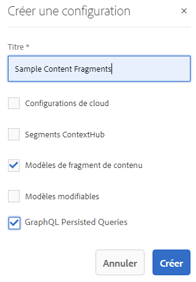
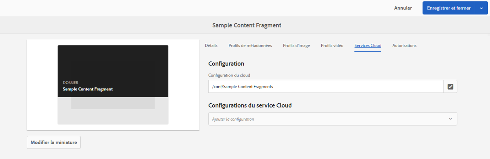

# Fragments de contenu - Navigateur de configurations{#content-fragments-configuration-browser}

Découvrez comment activer certaines fonctionnalités de fragments de contenu dans l’explorateur de configurations pour utiliser des fonctionnalités de diffusion sans interface utilisateur de Adobe Experience Manager (AEM) puissantes.

## Activation de la fonctionnalité de fragments de contenu pour votre instance {#enable-content-fragment-functionality-instance}

Avant d’utiliser des fragments de contenu, utilisez la méthode **Explorateur de configuration** pour activer les éléments suivants :

* **Modèles de fragment de contenu** – obligatoire
* **Requêtes persistantes GraphQL** – facultatif

>[!CAUTION]
>
>Si vous n’activez pas les **modèles de fragment de contenu** :
>
>* la valeur **Créer** ne sera pas disponible pour la création de modèles.
>* vous ne pouvez pas [sélectionnez la configuration Sites pour créer le point d’entrée associé.](/help/sites-developing/headless/graphql-api/graphql-endpoint.md#enabling-graphql-endpoint).

Pour activer la fonctionnalité de fragment de contenu, procédez comme suit :

* Activer l’utilisation de la fonctionnalité de fragment de contenu par le biais de l’explorateur de configuration
* appliquer la configuration à votre dossier de ressources.

### Activation de la fonctionnalité de fragments de contenu dans l’explorateur de configurations {#enable-content-fragment-functionality-in-configuration-browser}

À [utiliser certaines fonctionnalités de fragment de contenu ;](#creating-a-content-fragment-model), vous **must** Activez-les d’abord au moyen de l’option **Explorateur de configuration**:

>[!NOTE]
>
>Pour plus d’informations, voir [Explorateur de configuration :](/help/sites-administering/configurations.md#using-configuration-browser).

1. Accédez à **Outils**, **Général**, puis ouvrez l’**Explorateur de configurations**.

1. Utilisez le bouton **Créer** pour ouvrir la boîte de dialogue.

   1. Spécifiez un **Titre**.
   1. Pour activer leur utilisation, sélectionnez
      * **Modèles de fragment de contenu**
      * **Requêtes persistantes GraphQL**

      

1. Sélectionnez **Créer** pour enregistrer la définition.

<!-- 1. Select the location appropriate to your website. -->

### Application de la configuration à votre dossier de ressources {#apply-the-configuration-to-your-assets-folder}

Lorsque la configuration **global** est activée pour la fonctionnalité de fragments de contenu, elle s’applique à tout dossier Assets.

Pour utiliser d’autres configurations (c’est-à-dire, à l’exclusion de global) avec un dossier de ressources comparable, vous devez définir la connexion. Pour ce faire, utilisez **Configuration** sous l’onglet **Services cloud** des **Propriétés du dossier** du dossier approprié.

