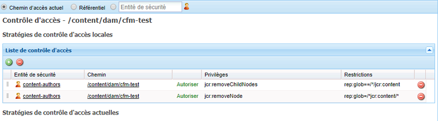

# Fragments de contenu – considérations sur la suppression {#content-fragments-delete-considerations}

Examinez ces points importants avant de définir vos politiques de suppression de fragments de contenu dans AEM. Les fragments de contenu forment un puissant outil de diffusion de contenu découplé. Les implications de leur suppression doivent être soigneusement examinées.

## Autorisations – Supprimer ou ne pas supprimer {#permissions-delete-or-not-delete}

Pouvoir supprimer du contenu est une capacité puissante, mais potentiellement sensible. Pour cette raison, de nombreux secteurs d’activité doivent limiter et contrôler la manière dont ces privilèges sont distribués.

En ce qui concerne les autorisations de suppression, les fragments de contenu doivent être pris en compte à deux niveaux :

1. **Le fragment de contenu en tant qu’entité unique.**

   * **Cas d’utilisation** : un utilisateur qui a besoin de modifier/mettre à jour un fragment de contenu **et de supprimer un fragment entier**.
   * **Autorisations** : l’autorisation [Supprimer](/help/sites-administering/security.md#actions) peut être [attribuée à l’aide de la gestion des utilisateurs et des groupes](/help/sites-administering/security.md#managing-permissions).

2. **Les multiples sous-entités qui constituent un fragment de contenu ; par exemple, les variations, les sous-nœuds.**

   Le fonctionnement de base de l’éditeur de fragment de contenu nécessite que ces sous-éléments transitoires puissent être supprimés. Par exemple, lors de la manipulation des variantes, mais également lors de la modification de métadonnées ou de la gestion du contenu associé.

   * **Cas d’utilisation** : un utilisateur qui a besoin de modifier/mettre à jour un fragment de contenu, **sans être autorisé à supprimer un fragment entier**.
   * **Autorisations** : voir [Autorisations requises pour la fonctionnalité d’éditeur uniquement](#permissions-required-for-editor-functionality-only).

>[!NOTE]
>
>Lorsqu’un utilisateur n’a pas de [Supprimer](/help/sites-administering/security.md#actions) autorisations, l’éditeur de fragment de contenu fonctionne dans *lecture seule* mode .

>[!NOTE]
>
>Voir aussi [Contrôle des opérations de gestion des utilisateurs dans AEM](/help/sites-administering/audit-user-management-operations.md).

## Autorisations requises pour la fonctionnalité d’éditeur uniquement {#permissions-required-for-editor-functionality-only}

Dans le cas des utilisateurs qui doivent modifier/mettre à jour un fragment de contenu, **sans leur permettre de supprimer l’intégralité d’un fragment**, des autorisations spécifiques doivent être attribuées, car l’opération de base de l’éditeur de fragment de contenu nécessite la possibilité de supprimer des sous-éléments transitoires.

Par exemple, lors de la manipulation des variantes, mais également lors de la modification de métadonnées ou de la gestion du contenu associé.

>[!NOTE]
>
>Les autorisations de suppression, requises pour modifier/mettre à jour un fragment de contenu, sont incluses dans l’autorisation Supprimer [affectée via la gestion des utilisateurs et/ou des groupes](/help/sites-administering/security.md#managing-permissions).

Les autorisations nécessaires à la modification/mise à jour d’un fragment doivent être appliquées au nœud contenant le fragment de contenu ou à un nœud parent approprié (à n’importe quel niveau sous `/content/dam`/). Lorsqu’elles sont affectées à ce noeud parent, les autorisations sont appliquées à tous les noeuds de cette branche.

Par exemple, un dossier qui contiendra tous les fragments de contenu, comme :

* `/content/dam/contentfragments`

>[!CAUTION]
>
>La définition des autorisations sur `/content/dam` est également possible, car tous les fragments de contenu y sont stockés.
>
>Toutefois, cette action applique les mêmes autorisations de suppression à *tous* les autres types de ressources.

Les autorisations nécessaires pour permettre à une personne utilisatrice et/ou à un groupe spécifique de modifier/mettre à jour un fragment de contenu sont les suivantes :

>[!NOTE]
>
>Cette liste répertorie tous les privilèges requis, pas uniquement les privilèges de suppression.

* Pour les nœuds ou dossiers de fragments de contenu :

   * `jcr:addChildNodes`, `jcr:modifyProperties`

* Pour le nœud `jcr:content` de tous les fragments de contenu :

   * `jcr:addChildNodes`, `jcr:modifyProperties` et `jcr:removeChildNodes`

* Pour tous les nœuds situés sous `jcr:content` de tous les fragments de contenu :

   * `jcr:addChildNodes`, `jcr:modifyProperties` et `jcr:removeChildNodes`, `jcr:removeNode`

Ces privilèges `remove` doivent être [administrés à l’aide des listes de contrôle d’accès, dans CRXDE Lite](/help/sites-administering/user-group-ac-admin.md#access-right-management).

Les privilèges `add` et `modify` peuvent également être administrés dans CRXDE Lite ou à l’aide de la console de gestion des utilisateurs.

Par exemple, la définition des privilèges `remove` pour un groupe `content-authors-no-delete` :

