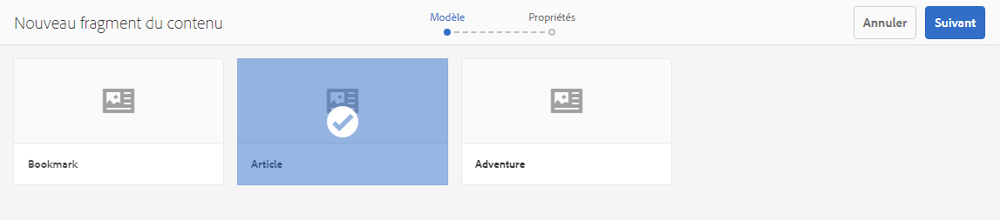

# Gestion des fragments de contenu {#managing-content-fragments}

Découvrez comment utiliser la console Assets pour gérer vos fragments de contenu AEM à la base de votre contenu découplé.

Après avoir défini vos [modèles de fragment de contenu](#creating-a-content-model), vous pouvez les utiliser pour [créer vos fragments de contenu](#creating-a-content-fragment).

L’[éditeur de fragment de contenu](#opening-the-fragment-editor) fournit différents [modes](#modes-in-the-content-fragment-editor) vous permettant :

* de [modifier du](#editing-the-content-of-your-fragment) contenu et de [gérer des variations ;](#creating-and-managing-variations-within-your-fragment)
* [d’annoter votre fragment ;](/help/assets/content-fragments/content-fragments-variations.md#annotating-a-content-fragment)
* [d’associer du contenu à votre fragment ;](#associating-content-with-your-fragment)
* [de configurer des métadonnées ;](#viewing-and-editing-the-metadata-properties-of-your-fragment)
* [d’affcher l’arborescence de la structure ;](/help/assets/content-fragments/content-fragments-structure-tree.md)
* [de générer un aperçu de la représentation JSON.](/help/assets/content-fragments/content-fragments-json-preview.md)

>[!NOTE]
>
>Il est possible d’utiliser les fragments de contenu comme suit :
>
>* lors de la création de pages ; voir [Création de pages avec des fragments de contenu](/help/sites-authoring/content-fragments.md).
>* pour la [Diffusion de contenu découplé utilisant des fragments de contenu avec GraphQL](/help/assets/content-fragments/content-fragments-graphql.md).

>[!NOTE]
>
>Les fragments de contenu sont stockés en tant que **Ressources**, et ils sont donc principalement gérés par l’intermédiaire de la console **Ressources**.

## Création de fragments de contenu {#creating-content-fragments}

### Création d’un modèle de contenu {#creating-a-content-model}

Les [modèles de fragments de contenu](/help/assets/content-fragments/content-fragments-models.md) peuvent être activés et créés, avant de créer des fragments de contenu avec le contenu structuré.

### Création d’un fragment de contenu {#creating-a-content-fragment}

La méthode de création d’un fragment de contenu est la suivante :

1. Accédez au dossier **Ressources** dans lequel vous souhaitez créer le fragment.
1. Pour ouvrir l’assistant, sélectionnez **Créer**, puis **Fragment de contenu**.
1. La première étape de l’assistant nécessite de spécifier la base du nouveau fragment.

   * [Modèle](/help/assets/content-fragments/content-fragments-models.md) : utilisé pour créer un fragment qui nécessite du contenu structuré, par exemple, le modèle **Adventure**.

      * Tous les modèles disponibles s’affichent.

   Après la sélection, cliquez ou appuyez sur **Suivant** pour continuer.

   

1. Dans l’étape **Propriétés**, spécifiez :

   * **De base**

      * **Titre**

         Titre du fragment.

         Obligatoire.

      * **Description**

      * **Balises**
   * **Avancé**

      * **Nom**

         Nom utilisé pour former l’URL.

         Obligatoire, il sera dérivé automatiquement du titre, mais il peut être modifié.

1. Sélectionnez **Créer** pour terminer l’action, puis **ouvrez** le fragment en mode d’édition ou revenez à la console en sélectionnant **Terminé**.

   >[!NOTE]
   >En mode **Liste** de la console, vous pouvez mettre à jour les **Paramètres d’affichage** pour activer la colonne **Modèle de fragment de contenu**.

## Actions pour un fragment de contenu dans la console de ressources {#actions-for-a-content-fragment-assets-console}

Dans la console **Ressources**, différentes actions sont disponibles pour vos fragments de contenu, soit :

* dans la barre d’outils : une fois le fragment sélectionné, toutes les actions appropriées sont disponibles ;
* sous forme d’[actions rapides](/help/sites-authoring/basic-handling.md#quick-actions) : un sous-ensemble d’actions disponibles pour les différentes cartes de fragments.

Sélectionnez le fragment pour afficher la barre d’outils avec les actions applicables :

* **Télécharger**

   * Enregistrez le fragment sous forme d’un fichier ZIP. Vous pouvez indiquer si vous souhaitez inclure des éléments, des variations ou des métadonnées.

* **Créer**
* **Passage en caisse**
* **Propriétés**

   * Permet d’afficher et/ou de modifier les métadonnées du fragment.

* **Modifier**

   * Permet [d’ouvrir le fragment afin d’en modifier le contenu](/help/assets/content-fragments/content-fragments-variations.md) ainsi que ses variations, contenu, métadonnées et éléments associés.

* **Gérer les balises**
* **À la collection**
* **Copier** (et **coller**)
* **Déplacer**
* **Publication rapide**
* **Gérer la publication**
* **Supprimer**

>[!NOTE]
>
>La plupart de ces actions sont [standard pour Assets](/help/assets/manage-assets.md) et/ou l’[application de bureau AEM](https://helpx.adobe.com/fr/experience-manager/desktop-app/aem-desktop-app.html).

## Ouverture de l’éditeur de fragments {#opening-the-fragment-editor}

Pour ouvrir votre fragment à des fins de modification :

>[!CAUTION]
>
>Pour modifier un fragment de contenu, vous devez disposer des [autorisations appropriées](/help/sites-developing/customizing-content-fragments.md#asset-permissions). Si vous rencontrez des problèmes, contactez votre administrateur système.

>[!CAUTION]
>
>Pour modifier un fragment de contenu, vous devez disposer des autorisations appropriées. Si vous rencontrez des problèmes, contactez votre administrateur système.

1. Utilisez la console **Assets** afin de naviguer jusqu’à l’emplacement de votre fragment de contenu.
1. Ouvrez le fragment en mode édition, en effectuant l’une des opérations suivantes :

   * Cliquez/appuyez sur le fragment ou le lien de fragment (selon l’affichage console).
   * Sélectionnez le fragment, puis cliquez sur **Modifier** dans la barre d’outils.

1. L’éditeur de fragment s’ouvre alors. Apportez les modifications nécessaires :

   

1. Après avoir apporté des modifications, utilisez **Enregistrer et fermer**.

<!-- 
1. After making changes, use **Save**, **Save & close** or **Close** as required.

   >[!NOTE]
   >
   >**Save & close** is available via the **Save** dropdown.

   >[!NOTE]
   >
   >Both **Save & Close** and **Close** will exit the editor - see [Save, Close and Versions](#save-close-and-versions) for full information on how the various options operate for content fragments.
-->

## Modes et actions dans l’éditeur de fragment de contenu {#modes-actions-content-fragment-editor}

L’éditeur de fragments de contenu comporte différents modes et actions.

### Modes dans l’éditeur de fragment de contenu {#modes-in-the-content-fragment-editor}

Naviguez entre les différents modes en utilisant les icônes du panneau latéral :

* Variations : [Modification du contenu](#editing-the-content-of-your-fragment) et [Gestion des variations](#creating-and-managing-variations-within-your-fragment)

* [Annotations](/help/assets/content-fragments/content-fragments-variations.md#annotating-a-content-fragment)
* [Contenu associé](#associating-content-with-your-fragment)
* [Métadonnées](#viewing-and-editing-the-metadata-properties-of-your-fragment)
* [Arborescence de la structure](/help/assets/content-fragments/content-fragments-structure-tree.md)
* [Aperçu](/help/assets/content-fragments/content-fragments-json-preview.md)

### Barre d’outils d’actions dans l’éditeur de fragment de contenu {#toolbar-actions-in-the-content-fragment-editor}

Certaines fonctions de la barre d’outils supérieure sont disponibles dans différents modes :

<!-- screenshot changed from original text see commented out below -->

* Un message s’affiche si le fragment est déjà référencé dans une page de contenu. Vous pouvez **Fermer** le message.

* Le panneau latéral peut être masqué/affiché en appuyant sur l’icône **Activer/désactiver le panneau latéral**.

* Sous le nom du fragment, vous pouvez voir le nom du [Modèle de fragment de contenu](/help/assets/content-fragments/content-fragments-models.md) utilisé pour créer le fragment actif :

   * Le nom est également un lien servant à ouvrir l’éditeur de modèles.

* Voir l’état du fragment, par exemple, les informations relatives à la date et à l’heure de création, de modification ou de publication.

* **Enregistrer et fermer**

<!--
Some features in the top toolbar are available from multiple modes:

* A message will be shown when the fragment is already referenced on a content page. You can **Close** the message.

* The side panel can be hidden/shown using the **Toggle Side Panel** icon.

* Underneath the fragment name you can see the name of the [Content Fragment Model](/help/assets/content-fragments/content-fragments-models.md) used for creating the current fragment:

  * The name is also a link that will open the model editor.

* See the status of the fragment; for example, information about when it was created, modified or published. The status is also color-coded:

  * **New**: grey
  * **Draft**: blue
  * **Published**: green
  * **Modified**: orange
  * **Deactivated**: red

* **Save** provides access to the **Save & close** option.
  
* The three dots (**...**) drop-down provides access to additional actions:
  * **Update page references**
    * This updates any page references. 
  * **[Quick publish](#publishing-and-referencing-a-fragment)**
  * **[Manage Publication](#publishing-and-referencing-a-fragment)**
-->

<!--
This updates any page references and ensures that the Dispatcher is flushed as required. -->

<!--
## Save, Close and Versions {#save-close-and-versions}

>[!NOTE]
>
>Versions can also be [created, compared and reverted from the Timeline](/help/assets/content-fragments/content-fragments-managing.md#timeline-for-content-fragments).

The editor has various options:

* **Save** and **Save & close**

  * **Save** will save the latest changes and remain in the editor.
  * **Save & close** will save the latest changes and exit the editor.

  >[!CAUTION]
  >
  >To edit a content fragment you need [the appropriate permissions](/help/sites-developing/customizing-content-fragments.md#asset-permissions). Please contact your system administrator if you are experiencing issues. 

  >[!NOTE]
  >
  >It is possible to remain in the editor, making a series of changes, before saving.

  >[!CAUTION]
  >
  >In addition to simply saving your changes, the actions also update any references and ensures that the Dispatcher is flushed as required. These changes can take time to process. Due to this, there can be a performance impact on a large/complex/heavily-loaded system.
  >
  >Please bear this in mind when using **Save & close** and then quickly re-entering the fragment editor to make and save further changes.

* **Close**

  Will exit the editor without saving the latest changes (i.e made since the last **Save**).

While editing your content fragment AEM automatically creates versions to ensure that prior content can be restored if you cancel your changes (using **Close** without saving):

1. When a content fragment is opened for editing AEM checks for the existence of the cookie-based token that indicates whether an *editing session* exists:

   1. If the token is found, the fragment is considered to be part of the existing editing session.
   2. If the token is *not* available and the user starts editing content, a version is created and a token for this new editing session is sent to the client, where it is saved in a cookie.

2. While there is an *active* editing session, the content being edited is automatically saved every 600 seconds (default).

   >[!NOTE]
   >
   >The auto save interval is configurable using the `/conf` mechanism.
   >
   >Default value, see:
   >&nbsp;&nbsp;`/libs/settings/dam/cfm/jcr:content/autoSaveInterval`

3. If the user cancels the edit, the version created at the start of the editing session is restored and the token is removed to end the editing session.
4. If the user selects to **Save** the edits, the updated elements/variations are persisted and the token is removed to end the editing session.
-->

## Modification du contenu du fragment {#editing-the-content-of-your-fragment}

Une fois que vous avez ouvert le fragment, vous pouvez utiliser l’onglet [Variations](/help/assets/content-fragments/content-fragments-variations.md) pour créer votre contenu.

## Création et gestion de variations dans un fragment {#creating-and-managing-variations-within-your-fragment}

Une fois que vous avez créé le contenu maître, vous pouvez créer et gérer des [Variations](/help/assets/content-fragments/content-fragments-variations.md) de ce contenu.

## Association de contenu au fragment {#associating-content-with-your-fragment}

Vous pouvez également [associer du contenu](/help/assets/content-fragments/content-fragments-assoc-content.md) à un fragment. Cela fournit une liaison pour que les ressources (c’est-à-dire les images) puissent éventuellement être utilisées avec le fragment lorsqu’il est ajouté à une page de contenu.

## Affichage et modification des métadonnées (propriétés) du fragment {#viewing-and-editing-the-metadata-properties-of-your-fragment}

Vous pouvez afficher et modifier les propriétés d’un fragment à l’aide de l’onglet [Métadonnées](/help/assets/content-fragments/content-fragments-metadata.md).

## Chronologie pour les fragments de contenu {#timeline-for-content-fragments}

Outre les options standard, la [Chronologie](/help/assets/manage-assets.md#timeline) fournit les informations et les actions spécifiques aux fragments de contenu :

* Affichage des informations sur les versions, commentaires et annotations
* Actions pour les versions

   * **[Revenir à cette version](#reverting-to-a-version)** (sélectionner un fragment existant, puis une version spécifique)

   * **[Comparer à actuel](#comparing-fragment-versions)** (sélectionner un fragment existant, puis une version spécifique)

   * Ajouter une **étiquette** et/ou un **commentaire** (sélectionner un fragment existant, puis une version spécifique)

   * **Enregistrer comme version** (sélectionner un fragment existant, puis la flèche du haut au bas de la chronologie)

* Actions pour les annotations

   * **Supprimer**

>[!NOTE]
>
>Les commentaires :
>
>* Une fonctionnalité standard pour toutes les ressources
>* Réalisés dans la chronologie
>* Liés à la ressource de fragment

>
>Les annotations (pour les fragments de contenu) sont :
>
>* Entrées dans l’éditeur de fragments
>* Spécifiques à un segment de texte sélectionné au sein du fragment

>

Par exemple :

## Comparaison des versions de fragments {#comparing-fragment-versions}

L’action de **comparer à la version actuelle** est disponible dans la [chronologie](/help/assets/content-fragments/content-fragments-managing.md#timeline-for-content-fragments) après avoir sélectionné une version spécifique.

Cette opération va ouvrir :

* la version **actuelle** (la plus récente) (à gauche) ;

* la version sélectionnée **v&lt;*x.y*>** (à droite).

Elles sont affichées dans des versions côte à côte dans lesquelles :

* les différences sont mises en surbrillance ;

   * le texte supprimé est en rouge ;
   * le texte inséré est en vert ;
   * le texte remplacé est en bleu.

* L’icône en plein écran permet d’ouvrir l’une ou l’autre version seule, puis de revenir en mode parallèle.
* Vous pouvez **rétablir** la version spécifique
* **Terminé** vous ramène à la console

>[!NOTE]
>
>Vous ne pouvez pas modifier le contenu du fragment lors de la comparaison des fragments.

## Restauration vers une version spécifique   {#reverting-to-a-version}

Vous pouvez restaurer vers une version spécifique de votre fragment :

* Directement à partir de la [chronologie](/help/assets/content-fragments/content-fragments-managing.md#timeline-for-content-fragments).

   Sélectionnez la version requise, puis l’action **Revenir à cette version**.

* Lors de la [comparaison d’une version à la version actuelle](/help/assets/content-fragments/content-fragments-managing.md#comparing-fragment-versions), vous pouvez **restaurer** la version sélectionnée.

## Publication et référencement d’un fragment {#publishing-and-referencing-a-fragment}

>[!CAUTION]
>
>Si votre fragment est basé sur un modèle, vous devez vous assurer que le [modèle a été publié](/help/assets/content-fragments/content-fragments-models.md#publishing-a-content-fragment-model).
>
>Si vous publiez un fragment de contenu pour lequel le modèle n’a pas encore été publié, une liste de sélection indique cela, ainsi que le fait que le modèle sera publié avec le fragment.

Les fragments de contenu doivent être publiés pour être utilisés dans l’environnement de publication. Ils peuvent être publiés :

* Après la création, en utilisant les actions [disponibles dans la console de ressources](#actions-for-a-content-fragment-assets-console).
* Dans l’[éditeur de fragment de contenu](#toolbar-actions-in-the-content-fragment-editor).
* Lorsque vous [publiez une page qui utilise le fragment](/help/sites-authoring/content-fragments.md#publishing), celui-ci est répertorié dans les références de la page.

>[!CAUTION]
>
>Une fois qu’un fragment a été publié et/ou référencé, AEM affiche un avertissement lorsqu’un auteur ouvre à nouveau ce fragment en mode d’édition. Il s’agit de signaler que les modifications apportées au fragment seront également répercutées sur les pages référencées.

## Suppression d’un fragment {#deleting-a-fragment}

Pour supprimer un fragment :

1. Dans la console **Ressources**, naviguez jusqu’à l’emplacement de votre fragment de contenu.
2. Sélectionnez le fragment.

   >[!NOTE]
   >
   >L’action **Supprimer** n’est pas proposée comme action rapide.

3. Sélectionnez **Supprimer** dans la barre d’outils.
4. Confirmez l’action **Supprimer**.

   >[!CAUTION]
   >
   >Si le fragment est déjà référencé dans une page, un message d’avertissement vous demande de confirmer que vous souhaitez poursuivre et **forcer la suppression**. Le fragment et son composant de fragment de contenu seront supprimés de toutes les pages de contenu.
