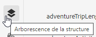
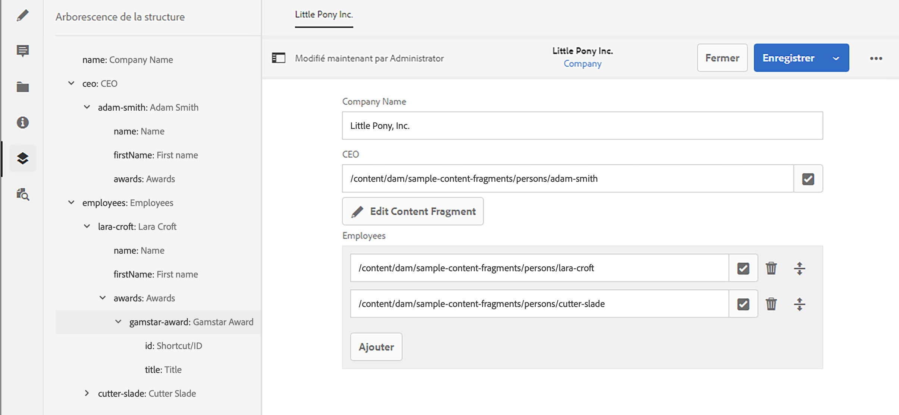

# Arborescence de la structure du fragment de contenu {#content-fragment-structure-tree}

Utilisez la fonction Arborescence de structure de l’éditeur de fragment de contenu dans AEM pour mieux comprendre votre contenu découplé.

Dans l’éditeur de fragments de contenu, vous pouvez sélectionner l’icône d’arborescence de structure :

Une représentation de la structure du fragment s’ouvre alors dans le volet de gauche. Vous pouvez ainsi parcourir et atteindre les fragments référencés. La sélection d’une référence ouvre ce fragment en vue de le modifier.

>[!NOTE]
>
>À l’aide des chemins de navigation du panneau principal, vous pouvez revenir à votre point de départ.

