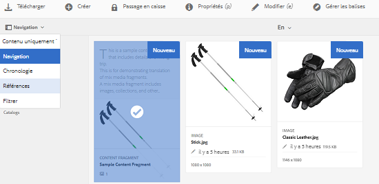
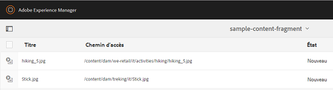

# Création de projets de traduction pour des fragments de contenu {#creating-translation-projects-for-content-fragments}

Outre les ressources, Adobe Experience Manager (AEM) Assets prend en charge les workflows de copie de langue pour [fragments de contenu](/help/assets/content-fragments/content-fragments.md) (y compris les variations). Aucune autre optimisation n’est requise pour exécuter des processus de copie de langue sur des fragments de contenu. Dans chaque processus, le fragment de contenu entier est envoyé en traduction.

Les types de processus que vous pouvez exécuter sur les fragments de contenu sont exactement identiques aux types de processus que vous exécutez pour les ressources. En outre, les options disponibles dans chaque type de processus correspondent aux options disponibles sous les types de processus correspondants pour les actifs.

Vous pouvez exécuter les types de processus de copie de langue suivants sur les fragments de contenu :

**Créer et traduire** 

Dans ce processus, les fragments de contenu à traduire sont copiés vers la racine de langue de la langue vers laquelle vous souhaitez traduire. En outre, en fonction des options que vous sélectionnez, un projet de traduction est créé pour les fragments de contenu dans la console Projets. En fonction des paramètres, vous pouvez démarrer le projet de traduction manuellement ou autoriser son exécution automatique dès sa création.

**Mise à jour des copies de langue**

Lorsque le fragment de contenu source est mis à jour ou modifié, le fragment de contenu correspondant spécifique au paramètre régional/à la langue doit être à nouveau traduit. Le processus de mise à jour des copies de langue traduit un groupe supplémentaire de fragments de contenu et l’ajoute à une copie de langue pour un paramètre régional spécifique. Dans ce cas, les fragments de contenu traduits sont ajoutés au dossier de destination qui contient déjà les fragments de contenu précédemment traduits.

## Workflow Créer et traduire {#create-and-translate-workflow}

Le processus Créer et traduire comprend les options suivantes. Les étapes de procédure associées à chaque option sont similaires aux étapes de procédure associées à l’option correspondante pour les ressources.

* Créer uniquement la structure : pour les étapes de la procédure, reportez-vous à la section [Création de structure uniquement pour les ressources](translation-projects.md#create-structure-only).
* Créez un projet de traduction : Pour connaître les étapes de la procédure, voir [Création d’un projet de traduction pour les ressources](translation-projects.md#create-a-new-translation-project).
* Ajouter au projet de traduction existant : Pour les étapes de la procédure, voir [Ajouter au projet de traduction existant pour les ressources](translation-projects.md#add-to-existing-translation-project).

## Processus de mise à jour des copies de langue {#update-language-copies-workflow}

Le processus de mise à jour des copies de langue comprend les options suivantes. Les étapes de procédure associées à chaque option sont similaires aux étapes de procédure associées à l’option correspondante pour les ressources.

* Créez un projet de traduction : Pour connaître les étapes de la procédure, voir [Création d’un projet de traduction pour les ressources](translation-projects.md#create-a-new-translation-project) (flux de travaux de mise à jour).
* Ajouter au projet de traduction existant : Pour connaître les étapes de la procédure, voir [Ajouter au projet de traduction existant pour les ressources](translation-projects.md#add-to-existing-translation-project) (flux de travaux de mise à jour).

Vous pouvez également créer des copies de langue temporaires pour les fragments en procédant de la même manière que pour créer des copies temporaires pour les ressources. Pour plus d’informations, reportez-vous à la section [Création de copies de langue temporaires pour les ressources](translation-projects.md#creating-temporary-language-copies).

## Traduction de fragments de supports variés {#translating-mixed-media-fragments}

AEM vous permet de traduire des fragments de contenu qui incluent diverses types de ressources multimédia et de collections. Si vous traduisez un fragment de contenu qui comprend des ressources intégrées, les copies traduites de ces ressources sont stockées à la racine de la langue cible.

Si le fragment de contenu inclut une collection, les ressources de la collection sont traduites avec le fragment de contenu. Les copies traduites des ressources sont stockées à la racine de la langue cible correspondante, à un emplacement correspondant à l’emplacement physique des ressources source à la racine de la langue source.

Pour pouvoir traduire des fragments de contenu comprenant des supports variés, modifiez tout d’abord la structure de traduction par défaut afin de permettre la traduction des ressources intégrées et des collections associées à des fragments de contenu.

1. Cliquez/appuyez sur le logo AEM et accédez à **[!UICONTROL Outils > Déploiement > Services Cloud]**.
1. Recherchez **[!UICONTROL Intégration de traduction]** sous **[!UICONTROL Adobe Marketing Cloud]**, puis cliquez/appuyez sur **[!UICONTROL Afficher les configurations]**.

   

1. Dans la liste des configurations disponibles, cliquez/appuyez sur **[!UICONTROL Configuration par défaut (configuration de l’intégration de traduction)]** afin d’ouvrir la page **[!UICONTROL Configuration par défaut]**.

   

1. Cliquez sur le bouton **[!UICONTROL Modifier]** de la barre d’outils afin d’afficher la boîte de dialogue **[!UICONTROL Configuration de traduction]**.

   

1. Accédez à l’onglet **[!UICONTROL Ressources]**, puis choisissez **[!UICONTROL Ressources multimédias intégrées et collections associées]** dans la liste **[!UICONTROL Traduire les ressources du fragment de contenu]**. Pour enregistrer les modifications, cliquez/appuyez sur **[!UICONTROL OK]**.

   

1. Depuis le dossier racine Anglais, ouvrez un fragment de contenu.

   

1. Cliquez/appuyez sur l’icône **[!UICONTROL Insérer une ressource]**.

   

1. Insérez une ressource dans le fragment de contenu.

   

1. Cliquez/appuyez sur l’icône **[!UICONTROL Associer le contenu]**.

   

1. Cliquez/appuyez sur **[!UICONTROL Associer le contenu]**.

   

1. Sélectionnez une collection et incluez-la dans le fragment de contenu. Cliquez/appuyez sur **[!UICONTROL Enregistrer]**.

   

1. Sélectionnez le fragment de contenu, puis cliquez/appuyez sur l’icône de **[!UICONTROL navigation globale]**.
1. Sélectionnez **[!UICONTROL Références]** à partir du menu afin d’afficher le panneau **[!UICONTROL Références]**.

   

1. Cliquez/appuyez sur **[!UICONTROL Copies de langue]** sous **[!UICONTROL Copies]** afin d’afficher les copies de langue.

   

1. Cliquez/appuyez sur **[!UICONTROL Créer et traduire]** depuis le bas du panneau pour afficher la boîte de dialogue **[!UICONTROL Créer et traduire]**.

   

1. Sélectionnez la langue cible dans la liste **[!UICONTROL Langues cible]**.

   

1. Sélectionnez le type de projet de traduction dans la liste **[!UICONTROL Projet]**.

   

1. Indiquez le titre du projet dans le champ **[!UICONTROL Titre du projet]**, puis cliquez/appuyez sur **Créer**.

   

1. Accédez à la console **[!UICONTROL Projets]**, puis ouvrez le dossier du projet de traduction que vous avez créé.

   

1. Cliquez/appuyez sur la mosaïque du projet pour ouvrir la page des détails du projet.

   

1. Depuis la mosaïque de Tâche de traduction, vérifiez le nombre de ressources à traduire.
1. Depuis la mosaïque de **[!UICONTROL Tâche de traduction]**, démarrez la tâche de traduction.

   

1. Cliquez sur les ellipses en bas de la mosaïque Tâche de traduction afin d’afficher l’état de la tâche de traduction.

   

1. Cliquez/appuyez sur le fragment de contenu afin de vérifier le chemin d’accès des ressources associées traduites.

   

1. Examinez la copie de langue pour la collection dans la console Collections.

   

   Notez que seul le contenu de la collection est traduit. La collection elle-même n’est pas traduite.

1. Accédez au chemin d’accès de la ressource associée traduite. Observez que le fichier traduit est stocké sous la racine de la langue de la cible.

   

1. Accédez aux ressources de la collection traduites avec le fragment de contenu. Vérifiez que les copies traduites des ressources sont stockées à la racine de la langue cible correspondante.

   

   >[!NOTE]
   >
   >Les procédures d’ajout de fragment de contenu à un projet existant et les processus de mise à jour sont similaires aux procédures correspondantes pour les ressources. Pour en savoir plus sur ces procédures, reportez-vous aux procédures décrites pour les ressources.

