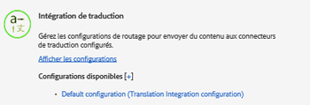
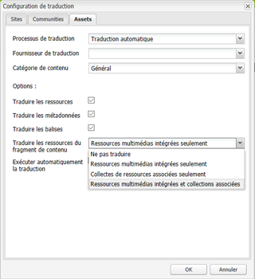
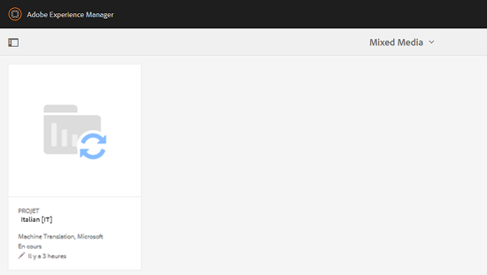

# Création de projets de traduction pour des fragments de contenu {#creating-translation-projects-for-content-fragments}

Outre les ressources, Adobe Experience Manager (AEM) Assets prend en charge les workflow de copie de langue pour les [fragments de contenu](/help/assets/content-fragments/content-fragments.md) (y compris les variations). Aucune optimisation supplémentaire n’est nécessaire pour exécuter des workflows de copie de langue sur des fragments de contenu. Dans chaque workflow, l’intégralité du fragment de contenu est envoyée pour traduction.

Les types de workflows que vous pouvez exécuter sur des fragments de contenu sont exactement similaires aux types de workflows que vous exécutez pour les ressources. En outre, les options disponibles dans chaque type de workflow correspondent aux options disponibles sous les types de workflow correspondants pour les ressources.

Vous pouvez exécuter les types de processus de copie de langue suivants sur les fragments de contenu :

**Créer et traduire**

Dans ce workflow, les fragments de contenu à traduire sont copiés dans la racine de langue de la langue vers laquelle vous souhaitez effectuer la traduction. En outre, en fonction des options que vous choisissez, un projet de traduction est créé pour les fragments de contenu dans la console Projets. Selon les paramètres, le projet de traduction peut être démarré manuellement ou exécuté automatiquement dès sa création.

**Mise à jour des copies de langue**

Lorsque le fragment de contenu source est mis à jour ou modifié, le fragment de contenu correspondant spécifique à la langue/aux paramètres régionaux nécessite une retraduction. Le workflow de mise à jour des copies de langue traduit un groupe supplémentaire de fragments de contenu et l’inclut dans une copie de langue pour un paramètre régional spécifique. Dans ce cas, les fragments de contenu traduits sont ajoutés au dossier cible qui contient déjà les fragments de contenu précédemment traduits.

## Workflow Créer et traduire {#create-and-translate-workflow}

Le workflow Créer et traduire comprend les options suivantes. Les étapes de procédure associées à chaque option sont similaires aux étapes de procédure associées à l’option correspondante pour les ressources.

* Créer uniquement la structure : pour les étapes de la procédure, reportez-vous à [Création de structure uniquement pour les ressources](translation-projects.md#create-structure-only).
* Création d’un projet de traduction : pour les étapes de la procédure, voir [Création d’un projet de traduction pour les ressources](translation-projects.md#create-a-new-translation-project).
* Ajouter à un projet de traduction existant : pour les étapes de la procédure, reportez-vous à [Ajout à un projet de traduction existant pour les ressources.](translation-projects.md#add-to-existing-translation-project)

## Workflow de mise à jour des copies de langue {#update-language-copies-workflow}

Le processus de mise à jour des copies de langue comprend les options suivantes. Les étapes de procédure associées à chaque option sont similaires aux étapes de procédure associées à l’option correspondante pour les ressources.

* Création d’un projet de traduction : pour les étapes de la procédure, voir [Création d’un projet de traduction pour les ressources](translation-projects.md#create-a-new-translation-project) (processus de mise à jour).
* Ajouter à un projet de traduction existant : pour les étapes de la procédure, reportez-vous à [Ajout à un projet de traduction existant pour les ressources](translation-projects.md#add-to-existing-translation-project) (workflow de mise à jour).

Vous pouvez également créer des copies de langue temporaires pour les fragments de la même manière que vous créez des copies temporaires pour les ressources. Pour plus d’informations, voir [Création de copies de langue temporaires pour les ressources](translation-projects.md#creating-temporary-language-copies).

## Traduction de fragments de supports variés {#translating-mixed-media-fragments}

AEM permet de traduire des fragments de contenu qui incluent divers types de ressources et collections multimédia. Si vous traduisez un fragment de contenu qui comprend des ressources intégrées, les copies traduites de ces ressources sont stockées sous la racine de la langue cible.

Si le fragment de contenu inclut une collection, les ressources de la collection sont traduites avec le fragment de contenu. Les copies traduites des ressources sont stockées à la racine de la langue cible appropriée à un emplacement correspondant à l’emplacement physique des ressources source sous la racine de la langue source.

Pour pouvoir traduire des fragments de contenu contenant des supports variés, modifiez d’abord la structure de traduction par défaut afin de permettre la traduction des ressources et collections intégrées associées aux fragments de contenu.

1. Cliquez/appuyez sur le logo AEM et accédez à **[!UICONTROL Outils > Déploiement > Services cloud]**.
1. Localisez **[!UICONTROL Intégration de traduction]** sous **[!UICONTROL Adobe Marketing Cloud]**, puis cliquez/appuyez sur **[!UICONTROL Afficher les configurations]**.

   

1. Dans la liste des configurations disponibles, cliquez/appuyez sur **[!UICONTROL Configuration par défaut (configuration de l’intégration de traduction)]** afin d’ouvrir la page **[!UICONTROL Configuration par défaut]**.

   

1. Cliquez sur le bouton **[!UICONTROL Modifier]** de la barre d’outils afin d’afficher la boîte de dialogue **[!UICONTROL Configuration de traduction]**.

   

1. Accédez au **[!UICONTROL Ressources]** et sélectionnez **[!UICONTROL Ressources multimédias intégrées et collections associées]** de la **[!UICONTROL Traduire des ressources de fragments de contenu]** liste. Cliquez/appuyez sur **[!UICONTROL OK]** pour enregistrer les modifications.

   

1. Depuis le dossier racine Anglais, ouvrez un fragment de contenu.

   

1. Cliquez/appuyez sur l’icône **[!UICONTROL Insérer une ressource]**.

   

1. Insérez une ressource dans le fragment de contenu.

   

1. Cliquez/appuyez sur l’icône **[!UICONTROL Associer le contenu]**.

   

1. Cliquez/appuyez sur **[!UICONTROL Associer le contenu]**.

   

1. Sélectionnez une collection et incluez-la dans le fragment de contenu. Cliquez/appuyez sur **[!UICONTROL Enregistrer]**.

   

1. Sélectionnez le fragment de contenu, puis cliquez/appuyez sur la **[!UICONTROL Navigation globale]** Icône
1. Sélectionner **[!UICONTROL Références]** dans le menu pour afficher la variable **[!UICONTROL Références]** volet.

   

1. Cliquez/appuyez sur **[!UICONTROL Copies de langue]** sous **[!UICONTROL Copies]** afin d’afficher les copies de langue.

   

1. Cliquez/appuyez sur **[!UICONTROL Créer et traduire]** en bas du panneau afin d’afficher la boîte de dialogue **[!UICONTROL Créer et traduire]**.

   

1. Sélectionnez la langue cible dans la liste **[!UICONTROL Langues cible]**.

   

1. Sélectionnez le type de projet de traduction dans la liste **[!UICONTROL Projet]**.

   

1. Indiquez le titre du projet dans le champ **[!UICONTROL Titre du projet]**, puis cliquez/appuyez sur **Créer**.

   

1. Accédez à la console **[!UICONTROL Projets]**, puis ouvrez le dossier du projet de traduction que vous avez créé.

   

1. Cliquez/appuyez sur la mosaïque du projet pour ouvrir la page des détails du projet.

   

1. Dans la mosaïque Tâche de traduction , vérifiez le nombre de ressources à traduire.
1. Dans la **[!UICONTROL Tâche de traduction]** , démarrez la tâche de traduction.

   

1. Cliquez sur les ellipses en bas de la mosaïque Tâche de traduction afin d’afficher le statut de la tâche de traduction.

   

1. Cliquez/appuyez sur le fragment de contenu afin de vérifier le chemin d’accès des ressources associées traduites.

   

1. Examinez la copie de langue pour la collection dans la console Collections.

   

   Notez que seul le contenu de la collection est traduit. La collection elle-même n’est pas traduite.

1. Accédez au chemin d’accès de la ressource associée traduite. Vérifiez que la ressource traduite est stockée à la racine de la langue cible.

   

1. Accédez aux ressources de la collection qui sont traduites avec le fragment de contenu. Notez que les copies traduites des ressources sont stockées à la racine de la langue cible appropriée.

   

   >[!NOTE]
   >
   >Les procédures d’ajout d’un fragment de contenu à un projet existant ou d’exécution de workflows de mise à jour sont similaires aux procédures correspondantes pour les ressources. Pour plus d’informations sur ces procédures, voir les procédures décrites pour les ressources.
