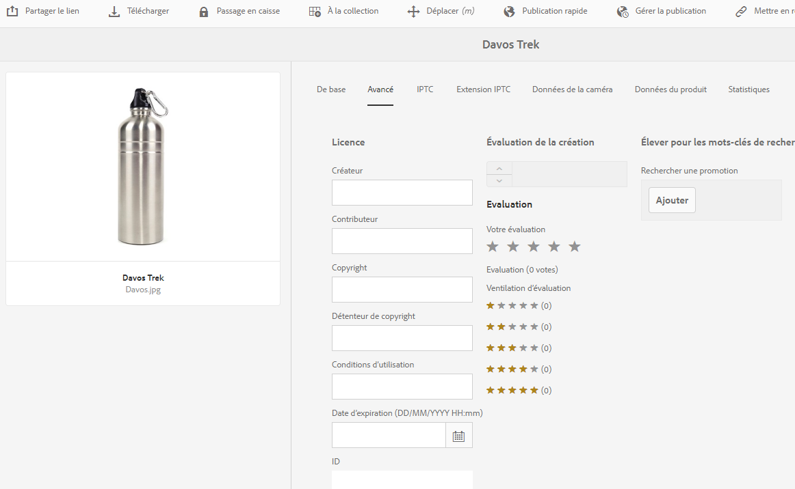

# Digital Rights Management des ressources {#digital-rights-management-in-assets}

| Version | Lien de l’article |
| -------- | ---------------------------- |
| AEM as a Cloud Service | [Cliquez ici](https://experienceleague.adobe.com/docs/experience-manager-cloud-service/content/assets/manage/drm.html?lang=fr) |
| AEM 6.5 | Cet article |

Les ressources numériques sont souvent associées à une licence qui prévoit les conditions et la durée de leur utilisation. Dans la mesure où [!DNL Adobe Experience Manager Assets] est entièrement intégré à la plateforme [!DNL Experience Manager], vous pouvez contrôler efficacement les informations sur l’expiration et l’état des ressources. Vous pouvez également associer des informations de licence à des ressources.

## Expiration de ressources {#asset-expiration}

L’expiration de ressources est un moyen efficace de faire respecter les exigences en matière de licence. Elle garantit que la ressource qui est publiée ne l’est plus lorsqu’elle arrive à expiration, ce qui évite tout risque de violation de licence. Sans autorisations d’administration, un utilisateur ne peut pas modifier, copier, déplacer, publier ni télécharger une ressource arrivée à expiration.

Vous pouvez consulter le statut d’expiration d’une ressource dans la console [!DNL Assets] dans la vue Carte comme dans la vue Liste.

*Image : dans la vue Liste, la colonne [!UICONTROL Statut] affiche la bannière [!UICONTROL Expiré].*

Vous pouvez consulter le statut d’expiration d’une ressource dans la [!UICONTROL chronologie] du rail de gauche.

>[!NOTE]
>
>La date d’expiration d’une ressource s’affiche différemment pour les utilisateurs de différents fuseaux horaires.

Vous pouvez également afficher le statut d’expiration des ressources dans le rail **[!UICONTROL Références]**. Il gère les états d’expiration des ressources et les relations entre les ressources composites et les sous-ressources, les collections et les projets référencés.

1. Accédez à la ressource pour laquelle vous souhaitez voir les pages web de référencement et les ressources composites.
1. Sélectionnez la ressource et ouvrez les **[!UICONTROL Références]** dans le rail de gauche. Pour les ressources arrivées à expiration, le rail [!UICONTROL Références] affiche le statut d’expiration **[!UICONTROL La ressource est arrivée à expiration]** en haut.

   

   Si la ressource contient des sous-ressources arrivées à expiration, le rail [!UICONTROL Références] affiche le statut **[!UICONTROL La ressource contient des sous-ressources arrivées à expiration]**.

   

### Recherche de ressources arrivées à expiration {#search-expired-assets}

Vous pouvez rechercher des ressources arrivées à expiration, y compris les sous-ressources expirées dans le panneau de recherche.

1. Dans la console [!DNL Assets], cliquez sur l’option **[!UICONTROL Rechercher]** de la barre d’outils pour afficher la zone Omni-recherche.

1. Avec le curseur dans la zone Omni-recherche, sélectionnez la touche `Enter` pour afficher la page des résultats de la recherche.
1. Ouvrez le panneau de recherche dans le rail de gauche. Cliquez sur l’option **[!UICONTROL Statut d’expiration]** pour la développer.

   

1. Choisissez **[!UICONTROL Expiré]**. Seules les ressources expirées s’affichent après le filtrage des résultats de recherche.

Quand vous choisissez l’option **[!UICONTROL Expiré]**, la console [!DNL Assets] affiche seulement les ressources et les sous-ressources arrivées à expiration qui ont été référencées par des ressources composites. Les ressources composites qui référencent des sous-ressources expirées ne s’affichent pas immédiatement une fois que les sous-ressources arrivent à expiration. En réalité, elles sont affichées lorsqu’[!DNL Experience Manager] détecte qu’elles référencent des sous-ressources expirées, lors de la prochaine exécution du planificateur.

Si vous modifiez la date d’expiration d’une ressource publiée à une date antérieure au cycle du planificateur en cours, la planification détecte toujours cette ressource en tant que ressource expirée lors de sa prochaine exécution et elle reflète donc son statut.

En outre, si un problème ou une erreur empêche le planificateur de détecter les ressources parvenues à expiration dans le cycle en cours, le planificateur réexamine ces ressources lors du cycle suivant et identifie leur état d’expiration.

Pour que la console [!DNL Assets] affiche les ressources composites référencées avec les sous-ressources expirées, configurez un workflow de **[!UICONTROL notification d’expiration d’Adobe CQ DAM]** dans Configuration Manager.[!DNL Experience Manager]

1. Ouvrez Configuration Manager dans [!DNL Experience Manager].
1. Sélectionnez l’option de **[!UICONTROL notification d’expiration d’Adobe CQ DAM]**. Par défaut, le **[!UICONTROL planificateur basé temps]** est sélectionné. Il programme une tâche qui vérifie, à un moment précis, si une ressource contient des sous-ressources arrivées à expiration. Une fois la tâche terminée, les ressources qui possèdent des sous-ressources expirées et des ressources référencées sont affichées à l’état expiré dans les résultats de la recherche.

1. Pour exécuter la tâche périodiquement, décochez l’option de **[!UICONTROL planificateur basé sur le temps]** et modifiez la périodicité en secondes dans le champ du **[!UICONTROL planificateur de périodicité]**. Par exemple, l’exemple d’expression `0 0 0 * * ?` déclenche la tâche à 00 heures.
1. Sélectionnez **[!UICONTROL Envoyer un e-mail]** pour être averti, par e-mail, de l’expiration d’une ressource.

   >[!NOTE]
   >
   >Seul l’auteur de la ressource (la personne qui charge une ressource spécifique dans [!DNL Assets]) reçoit un e-mail lorsqu’elle arrive à expiration. Reportez-vous à la rubrique traitant de la [configuration de notifications par e-mail](/help/sites-administering/notification.md) pour en savoir plus sur la configuration de notifications par e-mail au niveau global d’[!DNL Experience Manager].

1. Dans le champ **[!UICONTROL Notification préalable en secondes]**, indiquez l’intervalle de temps, en secondes, qui précède le moment auquel une ressource expire et pendant lequel vous souhaitez recevoir une notification concernant l’expiration. Les créateurs de ressources reçoivent un message avant l’expiration de la ressource les informant que la ressource va expirer après l’heure spécifiée. Une fois la ressource arrivée à expiration, vous recevez une autre notification qui confirme l’expiration. En outre, les ressources expirées sont désactivées.

1. Cliquez sur **[!UICONTROL Enregistrer]**.

## États d’un élément {#asset-states}

La console [!DNL Assets] peut afficher différents états des ressources. En fonction de l’état actuel d’une ressource donnée, le mode Carte affiche un libellé décrivant son état (par exemple, expiré, modifié, approuvé, rejeté, etc.).

1. Dans l’interface utilisateur [!DNL Assets], sélectionnez une ressource.
1. Cliquez sur **[!UICONTROL Publier]** dans la barre d’outils. Si vous ne voyez pas l’option **Publier** dans la barre d’outils, cliquez sur **[!UICONTROL Plus]** dans la barre d’outils et recherchez l’option **[!UICONTROL Publier]** .
1. Sélectionnez **[!UICONTROL Publier]** dans le menu, puis fermez la boîte de dialogue de confirmation.
1. Quittez le mode de sélection. Le statut de publication de la ressource s’affiche dans la partie inférieure de sa miniature en mode Carte. Dans la vue Liste, la colonne Publié indique le moment auquel la ressource a été publiée.

   

1. Pour afficher la page de détails de la ressource, sélectionnez une ressource dans l’interface d’[!DNL Assets], puis cliquez sur **[!UICONTROL Propriétés]** .

1. Dans l’onglet [!UICONTROL Avancé], définissez une date d’expiration pour la ressource dans le champ **[!UICONTROL Date d’expiration]**.

   

   *Image : onglet [!UICONTROL Avancé] de la page [!UICONTROL Propriétés] de ressource pour définir l’expiration de la ressource.*

1. Cliquez sur **[!UICONTROL Enregistrer]**, puis sur **[!UICONTROL Fermer]** pour afficher la console Ressources.
1. L’état de publication de la ressource indique qu’elle a expiré au bas de sa miniature en mode d’affichage Carte. Dans la vue Liste, l’état de la ressource s’affiche comme étant **[!UICONTROL arrivée à expiration]**.

   

1. Dans la console [!DNL Assets], sélectionnez un dossier et créez une tâche de révision sur le dossier.
1. Recherchez et approuvez/rejetez les ressources dans la tâche de révision, puis cliquez sur **[!UICONTROL Terminé]**.
1. Accédez au dossier pour lequel vous avez créé la tâche de révision. Le statut des ressources que vous avez approuvées/rejetées s’affiche dans la partie inférieure en mode Carte. Dans la vue Liste, les états d’approbation et d’expiration sont affichés dans les colonnes correspondantes.

   

1. Pour rechercher des ressources en fonction de leur statut, cliquez sur **[!UICONTROL Rechercher]**  pour afficher la barre Omnisearch.
1. Sélectionnez `Return` et cliquez sur [!DNL Experience Manager] pour afficher le panneau de recherche.
1. Dans le panneau de recherche, cliquez sur **[!UICONTROL Statut de publication]** et sélectionnez **[!UICONTROL Publié]** pour rechercher des ressources publiées dans [!DNL Assets].

   

1. Cliquez sur **[!UICONTROL Statut d’approbation]**, puis sur l’option correspondante pour rechercher des ressources approuvées ou rejetées.

   

1. Pour rechercher des ressources en fonction de leur statut d’expiration, sélectionnez **[!UICONTROL Statut d’expiration]** dans le panneau de recherche et choisissez l’option appropriée.

   

1. Vous pouvez également rechercher des éléments en fonction de plusieurs statuts, sous diverses facettes de recherche. Par exemple, vous pouvez rechercher des ressources publiées qui ont été approuvées dans une tâche de révision et qui n’ont pas encore expiré en sélectionnant les options appropriées dans les facettes de recherche.

   

## Digital Rights Management dans [!DNL Assets] {#digital-rights-management-in-assets-1}

Cette fonction force l’acceptation du contrat de licence avant le téléchargement d’une ressource sous licence à partir d’[!DNL Adobe Experience Manager Assets].

Si vous sélectionnez une ressource protégée et que vous cliquez ensuite sur **[!UICONTROL Télécharger]**, vous êtes redirigé vers une page de licence pour vous permettre d’accepter le contrat de licence. Si vous n’en acceptez pas les termes, l’option **[!UICONTROL Télécharger]** n’est pas disponible.

Si la sélection contient plusieurs ressources protégées, sélectionnez-en une à la fois, acceptez le contrat de licence et procédez au téléchargement de la ressource.

Une ressource est considérée comme protégée si l’une de ces conditions est remplie :

* La propriété de métadonnées de la ressource `xmpRights:WebStatement` pointe vers le chemin d’accès de la page qui contient le contrat de licence approprié.
* La valeur de la propriété de métadonnées de la ressource `adobe_dam:restrictions` est un code HTML brut qui spécifie le contrat de licence.

>[!NOTE]
>
>L’emplacement `/etc/dam/drm/licenses` utilisé pour le stockage des licences dans les versions antérieures d’[!DNL Experience Manager] est obsolète.
>
>Si vous créez ou modifiez des pages de licence ou que vous les récupérez à partir de versions précédentes d’[!DNL Experience Manager], Adobe vous recommande de les stocker sous `/apps/settings/dam/drm/licenses` ou `/conf/&ast;/settings/dam/drm/licenses`.

### Téléchargement de ressources protégées par DRM {#downloading-drm-assets}

1. Dans l’affichage en mode Carte, sélectionnez les ressources à télécharger, puis cliquez sur **[!UICONTROL Télécharger]**.
1. Dans la page **[!UICONTROL Gestion des droits d’auteur]**, sélectionnez la ressource à télécharger dans la liste.
1. Dans le volet [!UICONTROL Licence], sélectionnez **[!UICONTROL Accepter]**. Une coche s’affiche en regard de la ressource. Cliquez sur l’option **[!UICONTROL Télécharger]**.

   >[!NOTE]
   >
   >L’option **[!UICONTROL Télécharger]** n’est activée que si vous choisissez d’accepter le contrat de licence d’une ressource protégée. Cependant, si votre sélection comprend à la fois des ressources protégées et non protégées, seules ces dernières sont répertoriées dans le volet, et l’option **[!UICONTROL Télécharger]** est activée pour le téléchargement des ressources non protégées. Pour accepter le contrat de licence de plusieurs ressources protégées en même temps, sélectionnez-les dans la liste, puis cliquez sur **[!UICONTROL Accepter]**.

   

1. Cliquez sur **[!UICONTROL Télécharger]** dans la boîte de dialogue pour télécharger la ressource ou ses rendus.
