# Digital Rights Management for digital assets {#digital-rights-management-in-assets}

Les actifs numériques sont souvent associés à une licence qui prévoit les conditions et la durée de leur utilisation. Les ressources Adobe Experience Manager (AEM) étant entièrement intégrées à la plate-forme AEM, vous pouvez gérer efficacement les informations d’expiration et les états des ressources. Vous pouvez également associer des informations de licence à des ressources.

## Expiration de ressources {#asset-expiration}

L’expiration de ressources est un moyen efficace de faire respecter les exigences en matière de licence pour les ressources. Elle garantit que la ressource qui est publiée ne l’est plus lorsqu’elle arrive à expiration, ce qui évite tout risque de violation de licence. Un utilisateur sans droits d’administration ne peut pas modifier, copier, déplacer, publier ni télécharger une ressource arrivée à expiration.

Vous pouvez l’état d’expiration d’un fichier dans la console Ressources dans le  de la carte et du.

*Figure : Dans le  de la carte, un indicateur sur la carte indique un fichier arrivé à expiration.*

**Mode Liste**

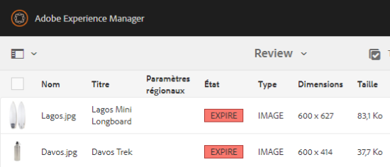

*Figure : Dans  , la colonne[!UICONTROL Etat]affiche la bannière[!UICONTROL Expiré].*

Vous pouvez consulter l’état d’expiration d’une ressource dans la chronologie. Sélectionnez la ressource et choisissez Chronologie dans le menu de navigation globale.

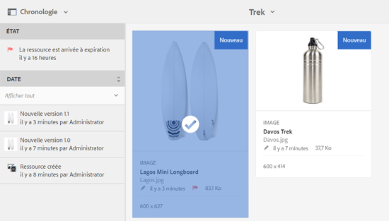

You can also view the expiration status of assets in the **[!UICONTROL References]** rail. Il gère les états d’expiration des ressources et les relations entre les ressources composites et les sous-ressources, les collections et les projets référencés.

1. Accédez à la ressource pour laquelle vous souhaitez voir les pages web de référencement et les ressources composites.
1. Sélectionnez le fichier et le logo Experience Manager.

1. Choose **[!UICONTROL References]** from the menu.

   

   For expired assets, the References rail displays the expiry status **[!UICONTROL Asset is Expired]** at the top.

   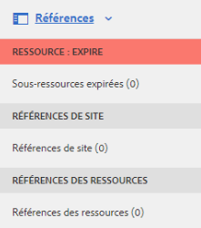

   If the asset has expired subassets, the References rail displays the status **[!UICONTROL Asset has Expired Sub-Assets]**.

   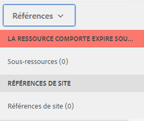

### Recherche de ressources arrivées à expiration {#search-expired-assets}

Vous pouvez rechercher des ressources arrivées à expiration, y compris les sous-ressources expirées dans le panneau de recherche.

1. In the Assets console, click the **[!UICONTROL Search]** in the toolbar to display the Omnisearch box.

1. Avec le curseur dans la zone Omnisearch, appuyez sur la touche Retour pour afficher la page Résultats de la recherche.

   

1. Cliquez sur le logo Experience Manager pour afficher le panneau de recherche.

   

1. Cliquez/appuyez sur l’option **[!UICONTROL État d’expiration]** pour la développer.

   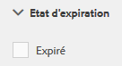

1. Sélectionnez **[!UICONTROL Expiré]**. Les ressources arrivées à expiration sont visibles dans les résultats de la recherche.

   

When you choose the **Expired** option, the Assets console only displays the expired assets and subassets that are referenced by compound assets. Les ressources composites qui référencent des sous-ressources expirées ne s’affichent pas immédiatement une fois que les sous-ressources arrivent à expiration. En réalité, elles sont affichées lorsque AEM Assets détecte qu’elles référencent des sous-ressources expirées, à la prochaine exécution du planificateur.

Si vous modifiez la date d’expiration d’une ressource publiée à une date antérieure au cycle du planificateur en cours, la planification détecte toujours cette ressource en tant que ressource expirée lors de sa prochaine exécution et elle reflète son état en conséquence.

En outre, si un problème ou une erreur empêche le planificateur de détecter les ressources expirées dans le cycle en cours, le planificateur réexamine ces ressources lors du cycle suivant et identifie leur statut expiré.

Pour activer la console Ressources afin d’afficher les ressources composites de référence avec les sous-ressources expirées, configurez un processus de **notification d’expiration Adobe CQ DAM** dans le gestionnaire de configuration AEM.

1. Ouvrez AEM Configuration Manager.
1. Choose **[!UICONTROL Adobe CQ DAM Expiry Notification]**. By default, **[!UICONTROL Time based Scheduler]** is selected, which schedules a job to check at a specific time whether an asset has expired subassets. Une fois la tâche terminée, les ressources qui possèdent des sous-ressources expirées et des ressources référencées sont affichées à l’état expiré dans les résultats de la recherche.

   

1. Pour exécuter régulièrement la tâche, effacez le champ **[!UICONTROL Règle du planificateur temporel]** et modifiez la durée en secondes dans le champ **[!UICONTROL Planificateur périodique]**. Par exemple, l’expression d’exemple ’0 0 0 &amp;ast; &amp;ast; ?’ déclenche la tâche à minuit.
1. Select **[!UICONTROL send email]** to receive emails when an asset expires.

   >[!NOTE]
   >
   >Seul l’auteur de la ressource (la personne qui la charge dans AEM Assets) reçoit un e-mail lorsqu’elle arrive à expiration. Reportez-vous à la rubrique [Configuration des notifications par courrier électronique](/help/sites-administering/notification.md) pour en savoir plus sur la configuration de notifications par e-mail au niveau global d’AEM.

1. Dans le champ **[!UICONTROL Notification préalable en secondes]** indiquez l’intervalle de temps, en secondes, qui précède le moment auquel une ressource expire et pendant lequel vous souhaitez recevoir une notification concernant l’expiration. Si vous êtes administrateur ou l’auteur de la ressource, vous recevez un message avant son expiration vous informant qu’elle va expirer une fois le délai spécifié écoulé.

   Une fois la ressource arrivée à expiration, vous recevez une notification par courrier électronique qui confirme l’expiration. En outre, les ressources expirées sont désactivées.

1. Cliquez sur **[!UICONTROL Enregistrer]**.

## États d’une ressource {#asset-states}

La console Ressources d’Adobe Experience Manager (AEM) Assets peut afficher différents états pour les ressources. En fonction de l’état actuel d’une ressource donnée, le mode Carte affiche un libellé décrivant son état (par exemple, expiré, modifié, approuvé, rejeté, etc.).

1. Dans l’interface utilisateur Assets, sélectionnez une ressource.

   

1. Appuyez sur **[!UICONTROL Publier]** dans la barre d’outils. Si vous ne voyez pas **Publier** dans la barre d’outils, appuyez sur **[!UICONTROL Plus]** dans la barre d’outils et recherchez l’option **[!UICONTROL Publier]** .

   

1. Choose **[!UICONTROL Publish]** from the menu, and then close the confirmation dialog.
1. Quittez le mode de sélection. L’état de publication de la ressource s’affiche au bas de sa miniature en mode d’affichage Carte. En mode Liste, la colonne Publié indique le moment auquel le fichier a été publié.

   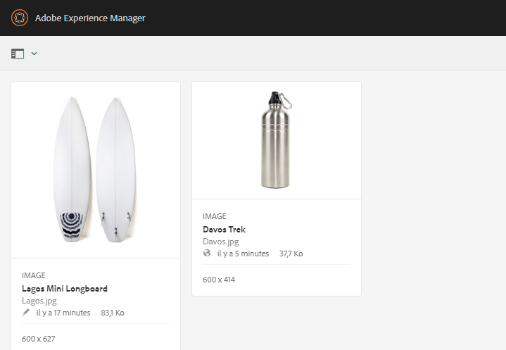

1. In the Assets UI, select an asset and tap **[!UICONTROL Properties]** to display its asset details page.

   

1. In the Advanced tab, and set an expiration date for the asset from the **[!UICONTROL Expires]** field under.

   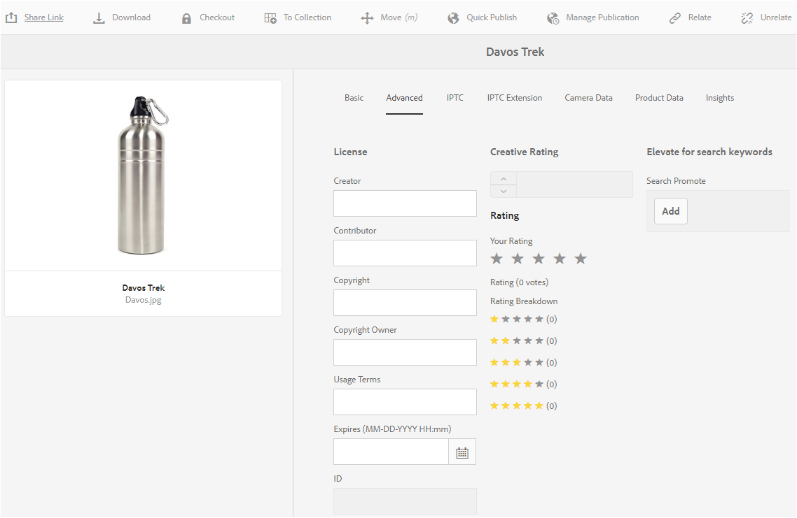

1. Click **[!UICONTROL Save]** and then click **[!UICONTROL Close]** to display the Asset console.
1. L’état de publication de la ressource indique qu’elle a expiré au bas de sa miniature en mode d’affichage Carte. In the list view, the status of the asset is displayed as **[!UICONTROL Expired]**.

   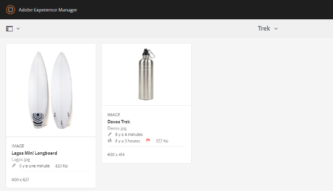

1. Dans la console Ressources, sélectionnez un dossier et créez une tâche de révision sur le dossier.
1. Review and approve/reject the assets in the review task and click **[!UICONTROL Complete]**.
1. Accédez au dossier pour lequel vous avez créé la tâche de révision. L’état des ressources que vous avez approuvées/rejetées s’affiche en bas du mode Carte. Dans le  , les états d’approbation et d’expiration s’affichent dans les colonnes appropriées.

   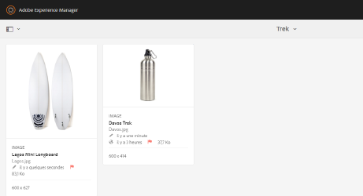

1. Pour rechercher des ressources en fonction de leur état, appuyez sur **[!UICONTROL Rechercher]** pour afficher la barre d&#39;Omnisearch.

   

1. Appuyez sur Retour, puis sur **[!UICONTROL GlobalNav]** pour afficher le panneau Rechercher.
1. Dans le panneau Rechercher, appuyez/cliquez sur **[!UICONTROL Publier l’état]** et sélectionnez **[!UICONTROL Publié]** pour rechercher des fichiers publiés dans AEM Assets.

   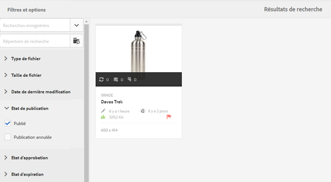

1. Appuyez/cliquez sur **[!UICONTROL État d’approbation]** et cliquez sur l’option appropriée pour rechercher des fichiers approuvés ou rejetés.

   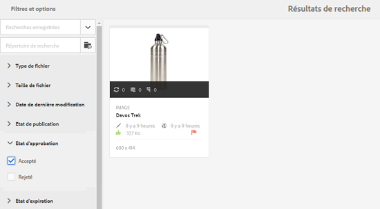

1. Pour rechercher des fichiers en fonction de leur état d’expiration, sélectionnez **[!UICONTROL État d’expiration]** dans le panneau Rechercher et choisissez l’option appropriée.

   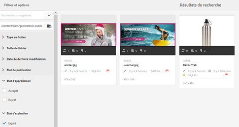

1. Vous pouvez également rechercher des éléments en fonction de plusieurs états, sous diverses facettes de recherche. Par exemple, vous pouvez rechercher les ressources publiées qui ont été approuvées dans une tâche de révision et qui n’ont pas encore expiré, en sélectionnant les options correspondantes dans les facettes de recherche.

   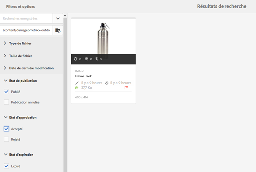

## Gestion des droits numériques dans AEM Assets {#digital-rights-management-in-assets-1}

Cette fonction force l’acceptation du contrat de licence avant le téléchargement d’une ressource sous licence à partir du composant Adobe Experience Manager (AEM) Assets.

If you select a protected asset and tap **[!UICONTROL Download]**, you are redirected to a license page where you accept the license agreement. Si vous n’en acceptez pas les termes, le bouton **[!UICONTROL Télécharger]** est désactivé.

Si la sélection contient plusieurs ressources protégées, sélectionnez-en une à la fois, acceptez le contrat de licence et procédez au téléchargement de la ressource.

Une ressource est considérée comme protégée si l’une des conditions suivantes est remplie :

* La propriété de métadonnées de la ressource `xmpRights:WebStatement` pointe vers le chemin d’accès de la page CQ qui contient le contrat de licence approprié.
* La valeur de la propriété de métadonnées de la ressource `adobe_dam:restrictions` est un code HTML brut qui spécifie le contrat de licence.

>[!NOTE]
>
>The location `/etc/dam/drm/licenses` used for storing licenses in earlier releases of AEM is deprecated.
>
>If you create or modify licence pages, or port them from previous AEM releases, Adobe recommends that you store them under `/apps/settings/dam/drm/licenses` or `/conf/&ast;/settings/dam/drm/licenses`.

### Téléchargement de fichiers protégés par DRM {#downloading-drm-assets}

1. In the Card view, select the assets you want to download and click **[!UICONTROL Download]**.
1. Dans la page **[!UICONTROL Gestion des droits d’auteur]**, sélectionnez le fichier à télécharger dans la liste.
1. Dans le volet Licence, sélectionnez **[!UICONTROL Accepter]**. Une marque de sélection apparaît en regard de la ressource dont vous avez accepté le contrat de licence. Tap/click the **[!UICONTROL Download]** button.

   >[!NOTE]
   >
   >Le bouton **[!UICONTROL Télécharger]** n’est activé que lorsque vous acceptez le contrat de licence pour une ressource protégée. Toutefois, si votre sélection comprend des ressources protégées et non protégées, seules les ressources protégées sont répertoriées dans le volet de gauche et le bouton **[!UICONTROL Télécharger]** est activé pour télécharger les ressources non protégées. Pour accepter simultanément des contrats de licence pour plusieurs ressources protégées, sélectionnez les ressources dans la liste, puis **[!UICONTROL Accepter]**.

   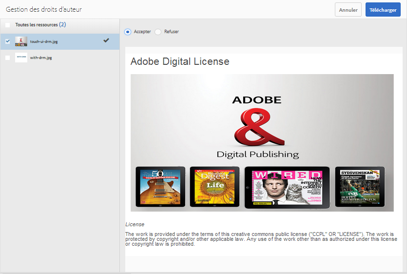

1. In the dialog, tap/click **[!UICONTROL Download]** to download the asset or its renditions.
