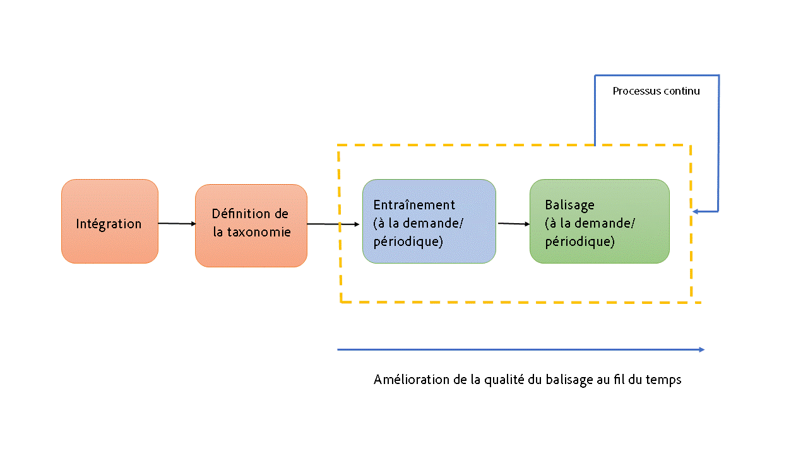
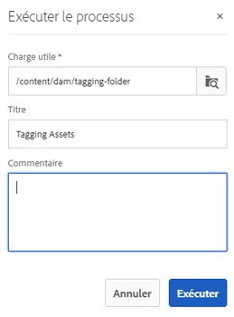

# Comprendre, appliquer et traiter les balises actives {#enhanced-smart-tags}

Les entreprises qui traitent des ressources numériques utilisent de plus en plus le vocabulaire contrôlé par taxonomie dans les métadonnées des ressources. Il comprend essentiellement une liste des mots-clés que les employés, les partenaires et les clients utilisent fréquemment pour mentionner et rechercher des ressources numériques d’une classe particulière. Le balisage des actifs avec un vocabulaire contrôlé par la taxonomie permet d’identifier et de récupérer facilement les actifs.

Comparé aux vocabulaires des langages naturels, le balisage des ressources numériques basé sur la taxonomie métier aide à les aligner avec les activités d’une entreprise et à assurer que les ressources les mieux adaptées apparaissent dans les recherches.

Par exemple, un constructeur de voitures peut baliser les images de voitures avec les noms de modèles afin d’afficher uniquement les images appropriées lors de recherches d’images de différents modèles pour concevoir une campagne de promotion.

Pour que Smart Content Service applique les balises appropriées, entraînez-le à reconnaître votre taxonomie. Pour entraîner le service, regroupez tout d’abord un ensemble de ressources et de balises qui décrivent le mieux ces ressources. Pour aider le service à en savoir plus, appliquez ces balises aux ressources et exécutez un processus de formation.

Une fois une balise entraînée et prête, le service peut appliquer ces balises sur les ressources par un workflow de balisage.

En arrière-plan, Smart Content Service utilise la structure Adobe Sensei AI pour former son algorithme de reconnaissance d’image à la structure des balises et à la taxonomie métier. Cette intelligence de contenu est ensuite utilisée pour appliquer les balises pertinentes sur un ensemble de ressources différentes.

Smart Content Service est un service cloud hébergé sur [!DNL Adobe Developer Console]. Pour l&#39;utiliser dans [!DNL Adobe Experience Manager], l&#39;administrateur système doit intégrer votre déploiement [!DNL Experience Manager] à [!DNL Adobe Developer Console].

En résumé, voici les principales étapes pour utiliser le service de contenu dynamique :

* Intégration
* Passage en revue des ressources et des balises (définition de la taxonomie)
* Entraînement du service de contenu dynamique
* Balisage automatique

## Conditions préalables et formats pris en charge {#prerequisites}

Avant de pouvoir utiliser le service de contenu dynamique, assurez-vous de respecter les conditions suivantes pour créer une intégration sur [!DNL Adobe Developer Console]:

* Un compte Adobe ID doté de droits d’administrateur pour l’entreprise.
* Activez le service Smart Content Service pour votre entreprise.
* Pour ajouter le package de base Smart Content Services à un déploiement, autorisez les licences [!DNL Adobe Experience Manager Sites] Package de base et [!DNL Assets] module complémentaire.

Le service applique les balises actives aux actifs des types MIME suivants :

* image/jpeg
* image/tiff
* image/png
* image/bmp
* image/gif
* image/pjpeg
* image/x-portable-anymap
* image/x-portable-bitmap
* image/x-portable-graymap
* image/x-portable-pixmap
* image/x-rgb
* image/x-xbitmap
* image/x-xpixmap
* image/x-icon
* image/photoshop
* image/x-photoshop
* image/psd
* image/vnd.adobe.photoshop

Le service applique des balises actives aux rendus de ressources des types MIME suivants :

* image/jpeg
* image/pjpeg
* image/png

## Intégration {#onboarding}

Smart Content Service est disponible à l&#39;achat en tant que module complémentaire de [!DNL Experience Manager]. Après l’achat, un courrier électronique est envoyé à l’administrateur de votre organisation avec un lien vers [!DNL Adobe I/O].

L’administrateur peut suivre le lien pour intégrer le service de contenu dynamique à [!DNL Experience Manager]. Pour intégrer le service à [!DNL Experience Manager Assets], voir [Configuration de balises actives](config-smart-tagging.md).

Le processus d’intégration est terminé lorsque l’administrateur configure le service et ajoute des utilisateurs dans [!DNL Experience Manager].

>[!NOTE]
>
>Si vous utilisez la version [!DNL Experience Manager] 6.3 ou antérieure et que vous avez besoin du service de balisage pour vos ressources, voir [Balises dynamiques](https://helpx.adobe.com/experience-manager/6-3/assets/using/touch-ui-smart-tags.html). Les balises actives n’utilisent pas les dernières fonctionnalités d’IA et sont donc moins précises que le service amélioré de balisage intelligent.

## Vérifier les actifs et les balises {#reviewing-assets-and-tags}

Une fois que vous êtes à bord, la première chose à faire est d’identifier un ensemble de balises qui décrivent le mieux ces images dans le contexte de votre entreprise.

Ensuite, passez en revue les images de façon à identifier une série d’images qui représentent le mieux votre produit pour un besoin particulier de votre entreprise. Vérifiez que les ressources figurant dans la série sélectionnée sont conformes aux [instructions d’entraînement du service de contenu dynamique](/help/assets/config-smart-tagging.md#training-the-smart-content-service).

Ajoutez les ressources à un dossier, puis appliquez les balises à chaque ressource sur la page de propriétés. Exécutez ensuite le workflow d’entraînement sur ce dossier. La série de ressources sélectionnée permet au service de contenu dynamique d’entraîner efficacement plus de ressources avec vos définitions de taxonomie.

>[!NOTE]
>
>1. L’entraînement est un processus irrévocable. Adobe recommande de bien passer en revue les balises dans la série de ressources sélectionnée bien avant d’entraîner le service de contenu dynamique sur les balises.
>1. Avant de suivre une formation pour une balise, consultez les [directives de formation de Smart Content Service](/help/assets/config-smart-tagging.md#training-the-smart-content-service).
>1. Lorsque vous entraînez le service de contenu dynamique pour la première fois, Adobe recommande de réaliser l’entraînement sur au moins deux balises distinctes.

## Comprendre les résultats de la recherche [!DNL Experience Manager] avec des balises actives {#understandsearch}

Par défaut, la recherche [!DNL Experience Manager] combine les termes recherchés avec une clause `AND`. L’utilisation de balises intelligentes ne modifie pas ce comportement par défaut. L’utilisation de balises actives ajoute une clause `OR` supplémentaire pour rechercher les termes de recherche qui sont liés aux balises actives. Par exemple, pour la recherche de `woman running`. Les ressources avec les mots-clés `woman` ou `running` uniquement dans les métadonnées n’apparaissent pas dans les résultats de recherche par défaut. Toutefois, une ressource balisée avec `woman` ou `running` à l’aide de balises intelligentes apparaît dans une telle requête de recherche. Les résultats de la recherche sont donc une combinaison de :

* Fichiers contenant des mots-clés `woman` et `running` dans les métadonnées.

* Actifs balisés avec l’un des mots-clés.

Les résultats de recherche qui correspondent à tous les termes de recherche dans les champs de métadonnées s’affichent en premier, suivis des résultats de recherche correspondant à l’un des termes de recherche des balises dynamiques. Dans l’exemple ci-dessus, l’ordre approximatif de l’affichage des résultats de recherche est le suivant :

1. Correspondances de `woman running` dans les différents champs de métadonnées.
1. Correspondances de `woman running` dans les balises intelligentes.
1. Correspondances de `woman` ou de `running` dans les balises intelligentes.

>[!CAUTION]
>
>Si l&#39;indexation Lucene est effectuée à partir de [!DNL Adobe Experience Manager], la recherche basée sur les balises actives ne fonctionne pas comme prévu.

## Marquer automatiquement les actifs {#tagging-assets-automatically}

Après avoir entraîné le service de contenu dynamique, vous pouvez déclencher le workflow de balisage pour appliquer automatiquement les balises appropriées sur une autre série de ressources similaire.

Vous pouvez exécuter le workflow de balisage périodiquement ou au besoin.

>[!NOTE]
>
>Le workflow de balisage s’exécute sur les ressources et les dossiers.

### Balisage périodique {#periodic-tagging}

Vous pouvez activer le service de contenu dynamique de façon à ce qu’il balise périodiquement les ressources au sein d’un dossier. Ouvrez la page de propriétés de votre dossier de ressources, sélectionnez **[!UICONTROL Activer les balises actives]** sous l&#39;onglet **[!UICONTROL Détails]**, puis enregistrez les modifications.

Une fois cette option sélectionnée pour un dossier, Smart Content Service balise automatiquement les fichiers qu’il contient. Par défaut, le processus de balisage s’exécute tous les jours à 12h00.

### Balisage à la demande {#on-demand-tagging}

Vous pouvez déclencher le processus de balisage à partir de la console de processus ou de la chronologie pour baliser instantanément vos ressources.

>[!NOTE]
>
>Si vous exécutez le workflow de balisage à partir de la chronologie, vous pouvez appliquer des balises sur un maximum de 15 ressources à la fois.

#### Balisage des ressources à l’aide de la console de workflow {#tagging-assets-from-the-workflow-console}

1. Dans l&#39;interface [!DNL Experience Manager], accédez à **[!UICONTROL Outils]** > **[!UICONTROL Workflow]** > **[!UICONTROL Modèles]**.
1. Dans la page **[!UICONTROL Modèles de processus]**, sélectionnez le workflow **[!UICONTROL Balisage intelligent des ressources (gestion des actifs numériques)]**, puis appuyez/cliquez sur **[!UICONTROL Démarrer le processus]** dans la barre d’outils.

   

1. Dans la boîte de dialogue **[!UICONTROL Exécuter le processus]**, accédez au dossier de charge utile contenant les ressources sur lesquelles vous souhaitez appliquer vos balises automatiquement.
1. Indiquez un titre pour le workflow et un commentaire facultatif. Cliquez sur **[!UICONTROL Exécuter]**.

   

   Pour vérifier si Smart Content Service a balisé correctement vos ressources, accédez au dossier des ressources et passez en revue les balises.

#### Balisage des ressources à partir de la chronologie {#tagging-assets-from-the-timeline}

1. Dans l&#39;interface utilisateur [!DNL Assets], sélectionnez le dossier contenant des ressources ou des ressources spécifiques auxquelles vous souhaitez appliquer des balises actives.
1. Dans le coin supérieur gauche, ouvrez la **[!UICONTROL Chronologie]**.
1. Ouvrez les actions dans la partie inférieure de la barre latérale gauche et cliquez sur **[!UICONTROL Démarrer le processus]**.

   

1. Sélectionnez le workflow **[!UICONTROL Balisage intelligent des ressources (gestion des actifs numériques)]** et spécifiez un titre pour le workflow.
1. Cliquez sur **[!UICONTROL Début]**. Le processus applique des balises aux ressources. pour vérifier si Smart Content Service a balisé correctement vos ressources, accédez au dossier de ressources et passez en revue les balises.

>[!NOTE]
>
>Lors des cycles de balisage suivants, seules les ressources modifiées sont à nouveau balisées avec des balises nouvellement entraînées. Toutefois, même les ressources non modifiées sont balisées si l’intervalle entre le dernier cycle de balisage et l’actuel pour le workflow de balisage dépasse 24 heures. Pour les workflows de balisage périodiques, les ressources non modifiées sont balisées lorsque l’intervalle de temps dépasse six mois.

## Traiter ou modérer les balises actives appliquées {#manage-smart-tags}

Vous pouvez traiter les balises actives pour supprimer les balises inexactes attribuées aux images de votre marque afin que seules les balises les plus pertinentes soient affichées.

La modération de balises intelligentes contribue également à affiner les résultats des recherches d’images basées sur des balises, en garantissant que votre image apparaisse dans les résultats de la recherche pour les balises les plus pertinentes. Essentiellement, cela réduit les risques que des images non pertinentes apparaissent dans les résultats de la recherche.

Vous pouvez également attribuer un rang plus élevé à une balise pour accroître sa pertinence pour une image. La promotion d’une balise pour une image augmente les chances d’affichage de l’image dans les résultats de la recherche lorsque la balise particulière est recherchée.

1. Dans la zone de recherche, recherchez des ressources basées sur une balise en tant que mot-clé.
1. Pour identifier une image que vous ne trouvez pas pertinente pour votre recherche, vérifiez les résultats de la recherche.
1. Sélectionnez l’image, puis cliquez sur **[!UICONTROL Gérer les balises]** dans la barre d’outils.
1. Dans la page **[!UICONTROL Gérer les balises]**, passez en revue les balises. Si vous ne souhaitez pas que l’image soit recherchée en fonction d’une balise spécifique, sélectionnez la balise, puis cliquez sur **[!UICONTROL Supprimer]** dans la barre d’outils. Vous pouvez également cliquer sur le symbole `x` qui s’affiche en regard d’une balise .
1. Si vous le souhaitez, sélectionnez la balise et cliquez sur **[!UICONTROL Promouvoir]** dans la barre d’outils. La balise objet d’une conversion est déplacée dans la section **[!UICONTROL Balises]**.
1. Cliquez sur **[!UICONTROL Enregistrer]**, puis sur **[!UICONTROL OK]**.
1. Accédez à la page **[!UICONTROL Propriétés]** de l&#39;image. Observez que la balise que vous avez promue se voit attribuer plus de pertinence et apparaît plus tôt dans les résultats de la recherche.

## Conseils et restrictions {#tips-best-practices-limitations}

* L’utilisation de Smart Content Services est limitée à 2 millions d’images balisées par an. Toutes les images de duplicata qui sont traitées et balisées sont comptabilisées comme une image balisée.
* Si vous exécutez le workflow de balisage à partir de la chronologie, vous pouvez appliquer des balises sur un maximum de 15 ressources à la fois.
* Les balises actives fonctionnent uniquement pour les formats d’image PNG et JPG. Ainsi, les ressources prises en charge dont les rendus ont été créés dans ces deux formats sont balisées avec des balises actives.
